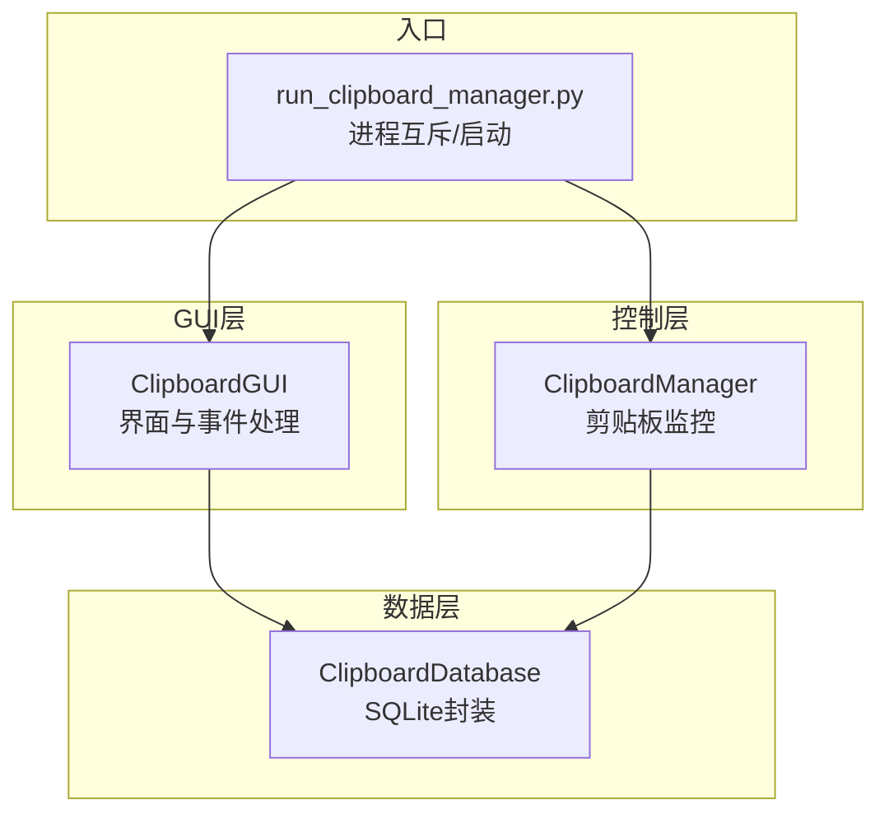
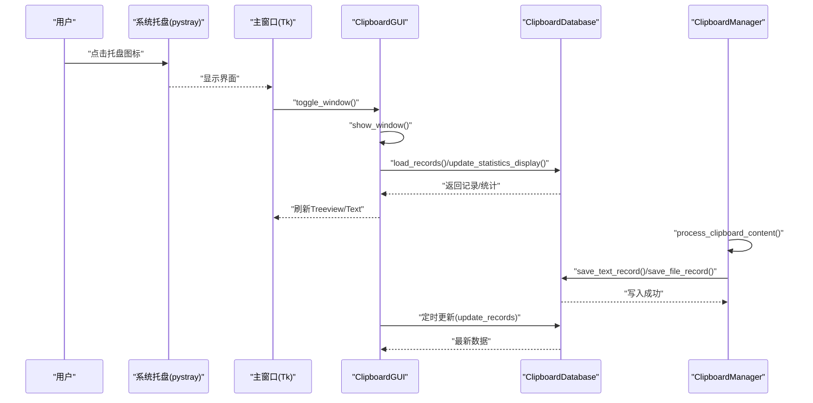
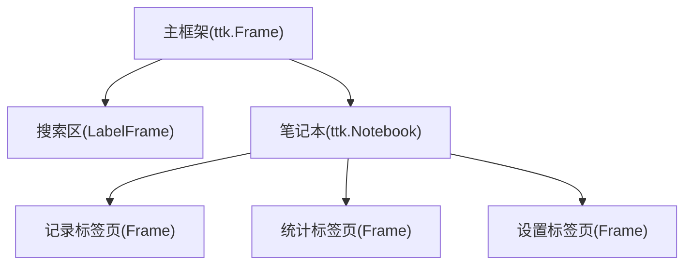
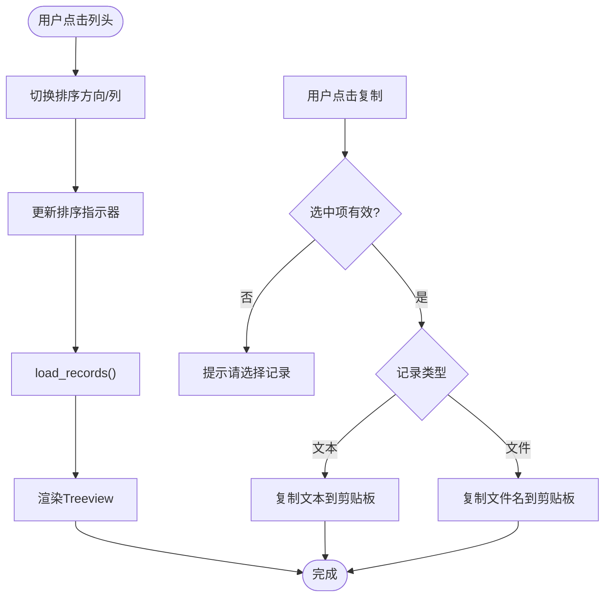
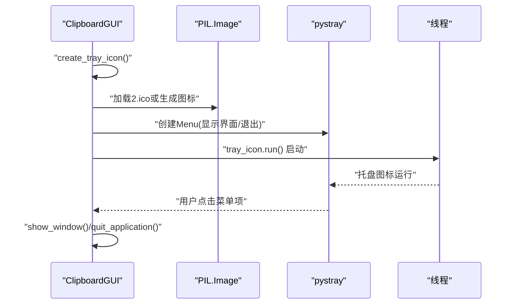
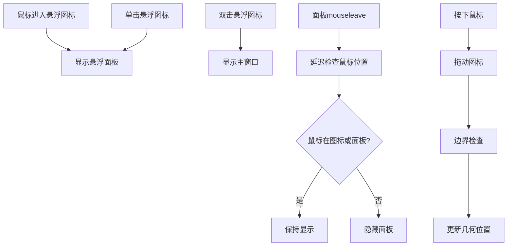
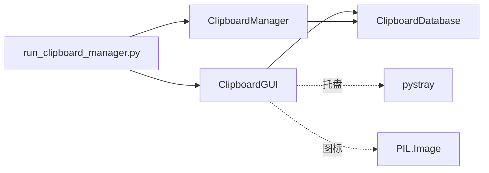

# View层实现

<cite>
**本文引用的文件**
- [clipboard_gui.py](file://clipboard_gui.py)
- [run_clipboard_manager.py](file://run_clipboard_manager.py)
- [clipboard_manager_main.py](file://clipboard_manager_main.py)
</cite>

## 目录
1. [简介](#简介)
2. [项目结构](#项目结构)
3. [核心组件](#核心组件)
4. [架构总览](#架构总览)
5. [详细组件分析](#详细组件分析)
6. [依赖关系分析](#依赖关系分析)
7. [性能考量](#性能考量)
8. [故障排查指南](#故障排查指南)
9. [结论](#结论)
10. [附录](#附录)

## 简介
本文件面向copyhistory项目的View层实现，重点解析ClipboardGUI类如何基于tkinter构建跨平台图形用户界面。文档涵盖：
- 主窗口布局结构：记录标签页、统计信息面板、设置选项卡的UI组织方式
- 系统托盘集成（pystray）：图标加载、右键菜单构建、事件绑定
- 悬浮图标功能：坐标计算、鼠标交互响应、面板显示与隐藏策略
- GUI组件与用户操作响应流程：搜索框输入触发查询、列表项双击恢复剪贴板内容等
- 数据绑定与状态更新模式：Treeview、Entry、Checkbutton等控件
- 界面刷新机制：定时器与回调同步Controller层数据变更
- UI架构图与组件层次结构图，帮助理解渲染逻辑与事件传播路径

## 项目结构
该项目采用“GUI + 数据库 + 监控器”的分层设计：
- GUI层：ClipboardGUI负责界面渲染、事件处理与用户交互
- 数据层：ClipboardDatabase封装SQLite数据库操作
- 控制层：ClipboardManager负责剪贴板监控与数据写入
- 启动入口：run_clipboard_manager.py负责进程互斥、后台监控与GUI启动

图表来源
- [clipboard_gui.py](file://clipboard_gui.py#L1-L120)
- [run_clipboard_manager.py](file://run_clipboard_manager.py#L1-L71)
- [clipboard_manager_main.py](file://clipboard_manager_main.py#L355-L761)

章节来源
- [clipboard_gui.py](file://clipboard_gui.py#L1-L120)
- [run_clipboard_manager.py](file://run_clipboard_manager.py#L1-L71)
- [clipboard_manager_main.py](file://clipboard_manager_main.py#L355-L761)

## 核心组件
- ClipboardGUI：主GUI类，负责窗口布局、标签页、Treeview、Entry、Checkbutton等控件的创建与事件绑定，以及系统托盘与悬浮图标的集成
- ClipboardDatabase：数据库封装，提供记录查询、统计、设置读写等接口
- ClipboardManager：剪贴板监控器，负责检测剪贴板变化并写入数据库
- run_clipboard_manager：进程互斥、后台监控线程与GUI启动

章节来源
- [clipboard_gui.py](file://clipboard_gui.py#L37-L120)
- [clipboard_manager_main.py](file://clipboard_manager_main.py#L56-L111)
- [run_clipboard_manager.py](file://run_clipboard_manager.py#L1-L71)

## 架构总览
GUI层通过ClipboardGUI与数据库层ClipboardDatabase交互，同时由ClipboardManager在后台持续监控剪贴板变化并将数据持久化。run_clipboard_manager负责进程互斥与启动，GUI默认隐藏，通过系统托盘图标提供交互入口。

图表来源
- [clipboard_gui.py](file://clipboard_gui.py#L1676-L1722)
- [clipboard_manager_main.py](file://clipboard_manager_main.py#L395-L496)
- [run_clipboard_manager.py](file://run_clipboard_manager.py#L32-L71)

## 详细组件分析

### 主窗口与标签页布局
- 主框架：使用ttk.Frame作为根容器，内部嵌套搜索区、笔记本控件（ttk.Notebook）
- 标签页：
  - 记录标签页：Treeview展示文本/文件记录，支持排序、复制、删除、双击查看详情
  - 统计标签页：Text控件展示统计信息，支持刷新
  - 设置标签页：Checkbutton、Entry、Radiobutton等控件配置复制限制、保存天数、开机自启、悬浮图标等

图表来源
- [clipboard_gui.py](file://clipboard_gui.py#L172-L219)
- [clipboard_gui.py](file://clipboard_gui.py#L227-L279)
- [clipboard_gui.py](file://clipboard_gui.py#L309-L327)
- [clipboard_gui.py](file://clipboard_gui.py#L328-L435)

章节来源
- [clipboard_gui.py](file://clipboard_gui.py#L172-L219)
- [clipboard_gui.py](file://clipboard_gui.py#L227-L279)
- [clipboard_gui.py](file://clipboard_gui.py#L309-L327)
- [clipboard_gui.py](file://clipboard_gui.py#L328-L435)

### 记录标签页：Treeview与交互
- Treeview列定义：名称或内容、类型、大小、时间、次数
- 排序：点击列头切换正/逆序，更新排序指示器
- 交互：
  - 复制选中内容：根据记录类型复制文本或文件名
  - 删除选中记录：弹窗确认，删除数据库记录并尝试删除本地文件
  - 双击查看详情：文本记录弹窗显示全文；文件记录打开所在目录
  - 滚动事件：保留滚动事件绑定（当前未实现分页加载）

图表来源
- [clipboard_gui.py](file://clipboard_gui.py#L280-L308)
- [clipboard_gui.py](file://clipboard_gui.py#L796-L838)
- [clipboard_gui.py](file://clipboard_gui.py#L839-L878)
- [clipboard_gui.py](file://clipboard_gui.py#L749-L795)

章节来源
- [clipboard_gui.py](file://clipboard_gui.py#L280-L308)
- [clipboard_gui.py](file://clipboard_gui.py#L749-L795)
- [clipboard_gui.py](file://clipboard_gui.py#L796-L838)
- [clipboard_gui.py](file://clipboard_gui.py#L839-L878)

### 统计标签页：Text控件与刷新
- Text控件用于展示统计信息，滚动条配合
- 刷新按钮调用update_statistics_display，从数据库读取统计并格式化输出

章节来源
- [clipboard_gui.py](file://clipboard_gui.py#L309-L327)
- [clipboard_gui.py](file://clipboard_gui.py#L555-L580)

### 设置标签页：数据绑定与状态更新
- 复制限制设置：无限模式Checkbutton联动Entry禁用/启用
- 最大大小/数量：Entry绑定StringVar，保存时转换为字节
- 保存天数：Radiobutton组（永久/自定义），自定义时Entry可用
- 开机自启：Checkbutton，通过注册表设置
- 悬浮图标：Checkbutton，保存后动态创建/销毁悬浮图标
- 重置所有记录：二次确认窗口，删除数据库与本地缓存

章节来源
- [clipboard_gui.py](file://clipboard_gui.py#L328-L435)
- [clipboard_gui.py](file://clipboard_gui.py#L439-L533)
- [clipboard_gui.py](file://clipboard_gui.py#L890-L949)
- [clipboard_gui.py](file://clipboard_gui.py#L1131-L1163)

### 系统托盘集成（pystray）
- 图标加载：优先加载资源文件2.ico，不存在则生成简单图标
- 右键菜单：显示界面、退出
- 事件绑定：显示界面、退出应用
- 线程运行：托盘图标在独立线程中运行，避免阻塞GUI主线程

图表来源
- [clipboard_gui.py](file://clipboard_gui.py#L144-L171)
- [clipboard_gui.py](file://clipboard_gui.py#L1697-L1722)

章节来源
- [clipboard_gui.py](file://clipboard_gui.py#L144-L171)
- [clipboard_gui.py](file://clipboard_gui.py#L1697-L1722)

### 悬浮图标功能：坐标计算与鼠标交互
- 创建悬浮图标：Toplevel窗口，去边框、置顶、半透明，支持拖动
- 图片加载：优先加载2.jpg，失败则使用背景色与文本
- 坐标计算：根据屏幕尺寸与默认偏移量定位，边界检查确保在屏幕内
- 鼠标交互：
  - Enter：显示最近记录悬浮面板
  - Leave：延迟检查并隐藏面板
  - 单击：显示面板（区分拖动与点击）
  - 双击：显示主窗口
- 面板显示策略：最近记录最多50条，按时间排序，支持“查看更多记录”跳转主窗口

图表来源
- [clipboard_gui.py](file://clipboard_gui.py#L1173-L1234)
- [clipboard_gui.py](file://clipboard_gui.py#L1254-L1379)
- [clipboard_gui.py](file://clipboard_gui.py#L1380-L1401)
- [clipboard_gui.py](file://clipboard_gui.py#L1453-L1558)
- [clipboard_gui.py](file://clipboard_gui.py#L1559-L1669)

章节来源
- [clipboard_gui.py](file://clipboard_gui.py#L1173-L1234)
- [clipboard_gui.py](file://clipboard_gui.py#L1254-L1379)
- [clipboard_gui.py](file://clipboard_gui.py#L1453-L1558)
- [clipboard_gui.py](file://clipboard_gui.py#L1559-L1669)

### 用户操作响应流程与数据绑定模式
- 搜索框输入：Entry控件绑定StringVar，搜索按钮触发search_records，按关键词与类型查询并排序显示
- Treeview数据绑定：values与tags承载记录类型与ID，便于复制/删除/查看详情
- Checkbutton/Entry联动：无限模式勾选时禁用大小/数量输入框，保存时转换单位
- 状态更新：通过root.after定时器周期性刷新，避免窗口隐藏、用户操作进行中、窗口无焦点时更新

章节来源
- [clipboard_gui.py](file://clipboard_gui.py#L555-L748)
- [clipboard_gui.py](file://clipboard_gui.py#L439-L533)
- [clipboard_gui.py](file://clipboard_gui.py#L1676-L1696)

### 界面刷新机制与定时器
- 定时器：每2秒执行一次update_records
- 触发条件：窗口非隐藏、无用户操作、无焦点时才刷新
- 显示时刷新：show_window会立即调用load_records

章节来源
- [clipboard_gui.py](file://clipboard_gui.py#L1676-L1696)
- [clipboard_gui.py](file://clipboard_gui.py#L1697-L1722)

## 依赖关系分析
- ClipboardGUI依赖ClipboardDatabase进行数据读写
- ClipboardGUI依赖pystray与PIL进行系统托盘与图标绘制
- run_clipboard_manager负责进程互斥与启动ClipboardGUI
- ClipboardManager在后台线程监控剪贴板并写入数据库

图表来源
- [run_clipboard_manager.py](file://run_clipboard_manager.py#L32-L71)
- [clipboard_gui.py](file://clipboard_gui.py#L144-L171)
- [clipboard_manager_main.py](file://clipboard_manager_main.py#L355-L496)

章节来源
- [run_clipboard_manager.py](file://run_clipboard_manager.py#L1-L71)
- [clipboard_gui.py](file://clipboard_gui.py#L144-L171)
- [clipboard_manager_main.py](file://clipboard_manager_main.py#L355-L496)

## 性能考量
- 定时器频率：2秒一次，避免频繁刷新造成CPU占用
- 条件更新：隐藏、用户操作进行中、窗口有焦点时不刷新
- Treeview渲染：按需加载，避免一次性加载大量记录
- 悬浮面板：延迟隐藏与边界检查，减少无效绘制
- 数据库查询：统计与记录查询使用LIMIT与ORDER BY，避免全量扫描

[本节为通用建议，不直接分析具体文件]

## 故障排查指南
- 系统托盘不可用：缺少pystray或Pillow，安装后重启应用
- 悬浮图标图片加载失败：检查2.jpg是否存在，若不存在将回退到纯色背景与文本
- 悬浮面板无法隐藏：检查鼠标位置判断逻辑，必要时降低延迟或调整边界
- 设置保存失败：确认输入为有效数字，无限模式下大小/数量输入框应禁用
- 窗口无法显示：Alt+C快捷键或托盘菜单可切换显示/隐藏

章节来源
- [clipboard_gui.py](file://clipboard_gui.py#L144-L171)
- [clipboard_gui.py](file://clipboard_gui.py#L1173-L1234)
- [clipboard_gui.py](file://clipboard_gui.py#L439-L533)
- [clipboard_gui.py](file://clipboard_gui.py#L1559-L1669)

## 结论
ClipboardGUI通过清晰的标签页划分与丰富的交互控件，提供了完整的剪贴板历史记录浏览体验。系统托盘与悬浮图标增强了可用性，定时器与条件刷新保证了性能与实时性。设置面板完善地覆盖了复制限制、保存策略与系统行为配置。整体架构简洁、职责明确，适合进一步扩展与维护。

[本节为总结性内容，不直接分析具体文件]

## 附录
- 快捷键：Alt+C切换窗口显示状态
- 关闭行为：WM_DELETE_WINDOW事件改为隐藏窗口，避免误关闭

章节来源
- [clipboard_gui.py](file://clipboard_gui.py#L220-L226)
- [clipboard_gui.py](file://clipboard_gui.py#L1697-L1722)