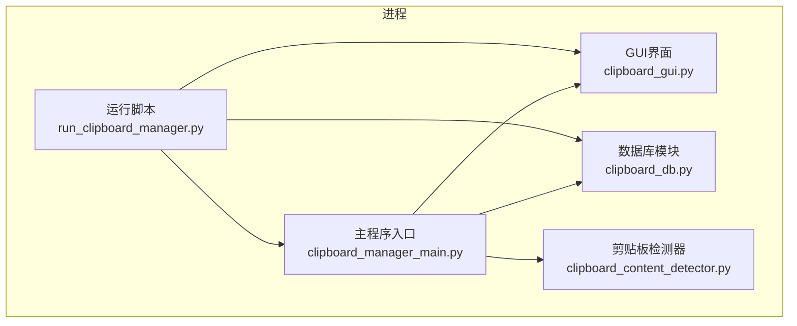
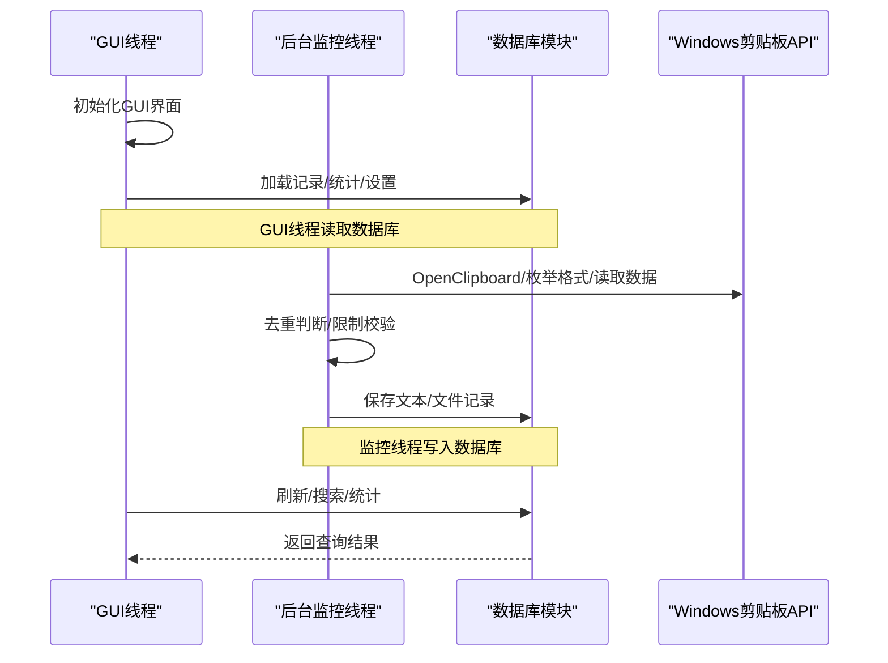
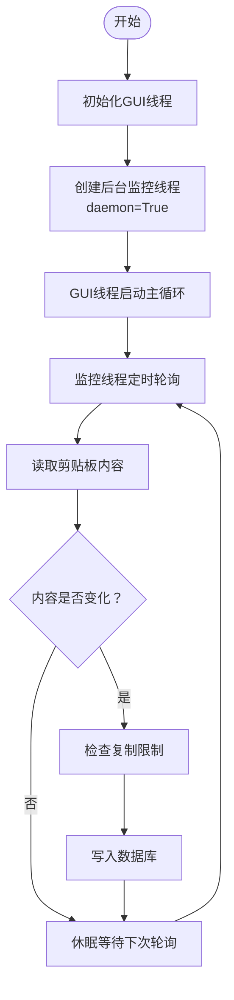
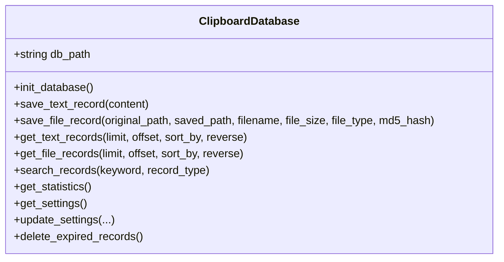
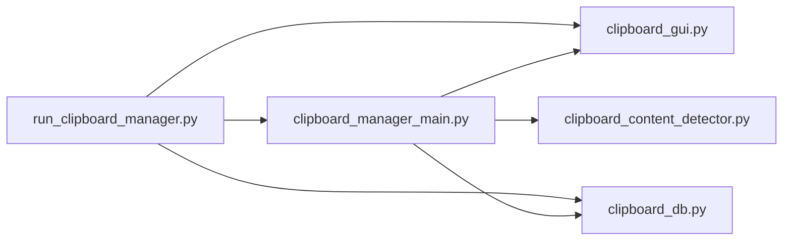
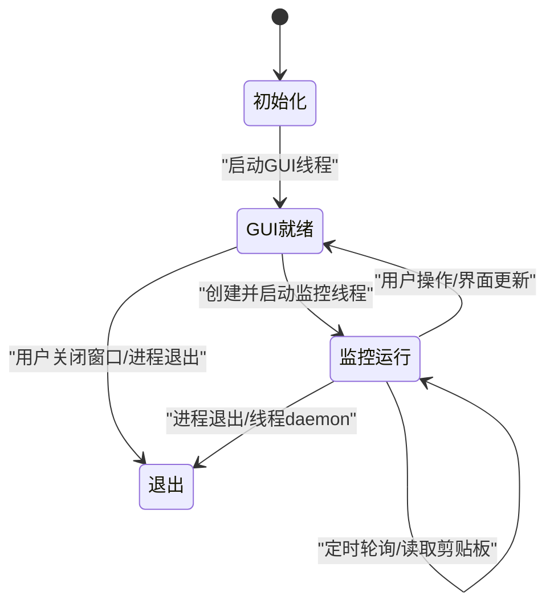

# 多线程模型

<cite>
**本文引用的文件**
- [clipboard_manager_main.py](file://clipboard_manager_main.py)
- [clipboard_gui.py](file://clipboard_gui.py)
- [clipboard_content_detector.py](file://clipboard_content_detector.py)
- [clipboard_db.py](file://clipboard_db.py)
- [run_clipboard_manager.py](file://run_clipboard_manager.py)
</cite>

## 目录
1. [简介](#简介)
2. [项目结构](#项目结构)
3. [核心组件](#核心组件)
4. [架构总览](#架构总览)
5. [详细组件分析](#详细组件分析)
6. [依赖关系分析](#依赖关系分析)
7. [性能考量](#性能考量)
8. [故障排查指南](#故障排查指南)
9. [结论](#结论)
10. [附录](#附录)

## 简介
本文件聚焦于copyhistory项目的多线程设计模型，重点解析主线程（GUI线程）与后台监控线程的职责划分、线程创建与生命周期管理、线程间通信与共享状态、潜在风险与优化建议，并提供线程状态图与时序图帮助理解剪贴板监控、内容处理与UI更新的并发执行流程。

## 项目结构
项目采用“主程序入口 + GUI界面 + 数据库 + 监控器”的模块化组织：
- 主程序入口负责线程调度与GUI启动
- GUI模块负责用户交互与界面渲染
- 数据库模块负责持久化与查询
- 监控器模块负责周期性检查剪贴板变化



图表来源
- [clipboard_manager_main.py](file://clipboard_manager_main.py#L731-L761)
- [run_clipboard_manager.py](file://run_clipboard_manager.py#L32-L66)
- [clipboard_gui.py](file://clipboard_gui.py#L1-L120)
- [clipboard_db.py](file://clipboard_db.py#L1-L60)
- [clipboard_content_detector.py](file://clipboard_content_detector.py#L1-L40)

章节来源
- [clipboard_manager_main.py](file://clipboard_manager_main.py#L731-L761)
- [run_clipboard_manager.py](file://run_clipboard_manager.py#L32-L66)

## 核心组件
- 主程序入口与GUI线程
  - 主程序入口在GUI模式下创建GUI线程并启动主循环，负责UI渲染与用户交互
  - GUI线程负责界面构建、事件绑定、数据加载与展示
- 后台监控线程
  - 通过monitor_clipboard_loop函数在独立线程中持续监控剪贴板变化
  - 使用daemon=True，随主线程退出而自动结束
- 数据库模块
  - 提供SQLite数据库初始化、记录增删改查、设置读写等能力
- 剪贴板检测器
  - 提供独立的剪贴板监控脚本，便于命令行模式运行

章节来源
- [clipboard_manager_main.py](file://clipboard_manager_main.py#L717-L759)
- [clipboard_gui.py](file://clipboard_gui.py#L1-L120)
- [clipboard_db.py](file://clipboard_db.py#L1-L120)
- [clipboard_content_detector.py](file://clipboard_content_detector.py#L218-L273)

## 架构总览
主线程（GUI线程）与后台监控线程的协作关系如下：
- GUI线程负责UI渲染与用户交互
- 后台监控线程负责周期性读取剪贴板、去重判断、限制校验与入库
- 两者通过共享的数据库对象进行数据交换，无显式队列或锁



图表来源
- [clipboard_manager_main.py](file://clipboard_manager_main.py#L395-L496)
- [clipboard_manager_main.py](file://clipboard_manager_main.py#L717-L759)
- [clipboard_db.py](file://clipboard_db.py#L116-L183)

## 详细组件分析

### 组件A：主线程（GUI线程）与后台监控线程
- 分工
  - GUI线程：界面初始化、事件绑定、记录加载与展示、搜索与统计
  - 监控线程：定时轮询剪贴板、内容去重、复制限制检查、数据库写入
- 线程创建与生命周期
  - 通过threading.Thread创建监控线程，daemon=True，随主线程退出而终止
  - GUI线程通过root.mainloop()进入事件循环，等待用户交互
- 线程间通信与共享状态
  - 两者共享同一ClipboardManager实例与ClipboardDatabase实例
  - 无显式队列或锁，依赖Python全局解释器锁（GIL）与SQLite连接的原子性
- 异常处理
  - 监控线程捕获KeyboardInterrupt，优雅退出
  - GUI线程内部对用户操作进行异常保护，避免阻塞事件循环



图表来源
- [clipboard_manager_main.py](file://clipboard_manager_main.py#L717-L759)
- [clipboard_manager_main.py](file://clipboard_manager_main.py#L395-L496)

章节来源
- [clipboard_manager_main.py](file://clipboard_manager_main.py#L717-L759)
- [clipboard_gui.py](file://clipboard_gui.py#L1-L120)

### 组件B：剪贴板监控循环与内容处理
- monitor_clipboard_loop
  - 循环内调用manager.process_clipboard_content()
  - 通过time.sleep(interval)控制轮询频率
  - 捕获KeyboardInterrupt，打印停止提示
- process_clipboard_content
  - 打开剪贴板、判断格式（文件列表/文本）、去重判断
  - 文件：计算MD5、分类保存、入库
  - 文本：长度限制检查、入库
  - 异常处理：读取剪贴板异常、关闭剪贴板异常均进行捕获与打印

```mermaid
sequenceDiagram
participant Loop as "monitor_clipboard_loop"
participant Manager as "ClipboardManager"
participant Win as "Windows剪贴板API"
participant DB as "ClipboardDatabase"
Loop->>Manager : process_clipboard_content()
Manager->>Win : OpenClipboard()
alt 文件列表
Manager->>Win : IsClipboardFormatAvailable(CF_HDROP)
Manager->>Win : GetClipboardData(CF_HDROP)
Manager->>Manager : 检查复制限制
Manager->>DB : save_file_record(...)
else 文本
Manager->>Win : IsClipboardFormatAvailable(CF_UNICODETEXT)
Manager->>Win : GetClipboardData(CF_UNICODETEXT)
Manager->>Manager : 检查文本大小限制
Manager->>DB : save_text_record(...)
end
Manager->>Win : CloseClipboard()
```

图表来源
- [clipboard_manager_main.py](file://clipboard_manager_main.py#L395-L496)
- [clipboard_manager_main.py](file://clipboard_manager_main.py#L717-L759)

章节来源
- [clipboard_manager_main.py](file://clipboard_manager_main.py#L395-L496)
- [clipboard_manager_main.py](file://clipboard_manager_main.py#L717-L759)

### 组件C：数据库模块与线程安全
- 数据库初始化与表结构
  - 文本记录表、文件记录表、设置表
  - 文本记录含md5_hash唯一索引，文件记录含md5_hash唯一约束
- 读写行为
  - 读：查询记录、统计信息、设置读取
  - 写：新增记录、更新计数、删除过期记录
- 线程安全
  - 每次数据库操作建立独立连接，减少跨线程共享状态
  - SQLite在单进程内串行化写入，天然具备原子性
  - 存在潜在竞态：两个线程同时写入同一md5_hash，由数据库约束触发冲突处理



图表来源
- [clipboard_db.py](file://clipboard_db.py#L1-L120)
- [clipboard_db.py](file://clipboard_db.py#L116-L183)
- [clipboard_db.py](file://clipboard_db.py#L360-L412)

章节来源
- [clipboard_db.py](file://clipboard_db.py#L1-L120)
- [clipboard_db.py](file://clipboard_db.py#L116-L183)
- [clipboard_db.py](file://clipboard_db.py#L360-L412)

### 组件D：GUI界面与用户交互
- 界面组成
  - 标签页：文本记录、文件记录、统计、设置
  - 搜索、刷新、排序、右键菜单、悬浮图标、系统托盘
- 线程模型
  - GUI线程负责事件循环与界面更新
  - 用户操作期间标记user_action_in_progress，避免UI闪烁
- 数据加载
  - 通过数据库模块加载记录、统计信息，支持排序与搜索

章节来源
- [clipboard_gui.py](file://clipboard_gui.py#L1-L120)
- [clipboard_gui.py](file://clipboard_gui.py#L581-L795)

### 组件E：独立监控脚本
- clipboard_content_detector提供独立监控脚本，便于命令行模式运行
- 与主程序监控逻辑类似，但不涉及GUI

章节来源
- [clipboard_content_detector.py](file://clipboard_content_detector.py#L218-L273)

## 依赖关系分析
- 主程序入口依赖GUI与数据库模块
- GUI模块依赖数据库模块
- 监控线程依赖管理器与数据库模块
- 独立监控脚本依赖数据库模块



图表来源
- [clipboard_manager_main.py](file://clipboard_manager_main.py#L731-L761)
- [run_clipboard_manager.py](file://run_clipboard_manager.py#L32-L66)

章节来源
- [clipboard_manager_main.py](file://clipboard_manager_main.py#L731-L761)
- [run_clipboard_manager.py](file://run_clipboard_manager.py#L32-L66)

## 性能考量
- GIL竞争
  - 监控线程与GUI线程均受GIL影响，频繁IO（剪贴板读取、数据库操作、文件复制）可缓解CPU竞争
  - 长时间运行的轮询循环可能导致CPU占用，可通过增大轮询间隔或引入更高效的事件驱动机制
- 数据库写入
  - 每次写入建立独立连接，避免跨线程共享连接带来的复杂性
  - 大量重复内容会触发数据库约束冲突，需注意日志输出与异常处理
- 文件复制
  - 文件保存涉及磁盘IO，可能成为瓶颈；可考虑异步或批量策略

[本节为通用性能讨论，不直接分析具体文件]

## 故障排查指南
- 监控线程无法停止
  - 确认daemon=True，主线程退出后监控线程应自动结束
  - 若仍存在，检查是否有非守护线程阻塞进程退出
- 剪贴板访问异常
  - process_clipboard_content中对OpenClipboard/CloseClipboard异常进行捕获与打印
  - 确保剪贴板未被其他进程长时间占用
- 数据库写入冲突
  - 文本/文件记录的md5_hash唯一性约束导致冲突，属预期行为
  - 检查重复内容是否按预期合并计数
- GUI卡顿
  - 避免在GUI线程中执行耗时操作；必要时将耗时任务放入后台线程
  - 使用用户操作标记user_action_in_progress，减少不必要的界面刷新

章节来源
- [clipboard_manager_main.py](file://clipboard_manager_main.py#L488-L496)
- [clipboard_manager_main.py](file://clipboard_manager_main.py#L717-L759)
- [clipboard_db.py](file://clipboard_db.py#L116-L183)

## 结论
本项目采用“GUI线程 + 后台监控线程”的简单多线程模型，分工清晰、实现简洁。监控线程通过daemon=True与主线程解耦，避免了复杂的线程同步与队列设计。数据库层通过独立连接与约束保障一致性。潜在风险主要来自GIL竞争与长时间轮询，建议通过增大轮询间隔、引入事件驱动或队列解耦等方式优化。

[本节为总结性内容，不直接分析具体文件]

## 附录

### 线程状态图（简化）


图表来源
- [clipboard_manager_main.py](file://clipboard_manager_main.py#L717-L759)
- [clipboard_gui.py](file://clipboard_gui.py#L1-L120)

### 优化建议（基于现有代码结构）
- 使用队列解耦
  - 在GUI线程与监控线程之间引入队列，监控线程将“待处理事件”入队，GUI线程消费并更新界面
  - 优点：降低耦合度，避免共享状态带来的竞态
- 事件驱动替代轮询
  - Windows平台可利用系统剪贴板通知事件，减少轮询开销
- 批量写入
  - 将多次数据库写入合并为事务，提升吞吐量
- 异常隔离
  - 为监控线程增加更完善的异常捕获与重试机制，避免单点故障影响进程稳定性

[本节为通用优化建议，不直接分析具体文件]