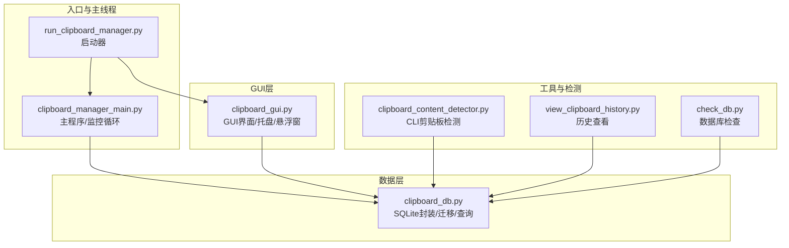
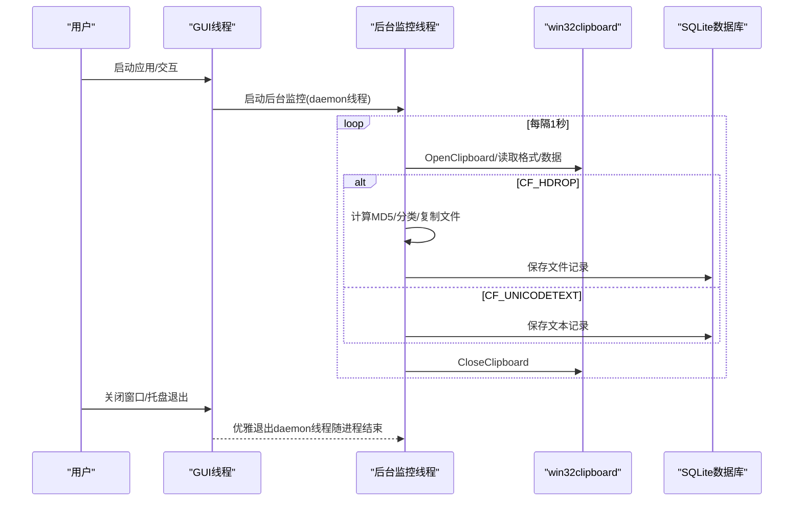
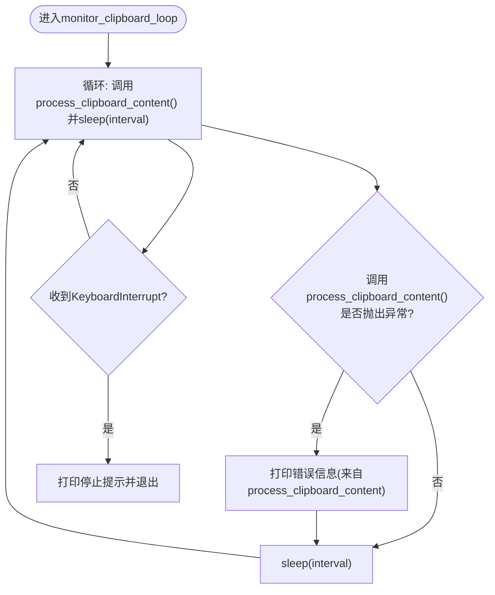
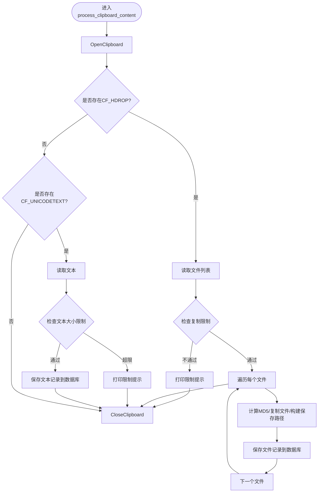
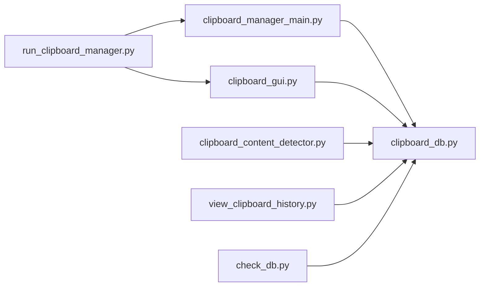

# 异常处理与健壮性

<cite>
**本文引用的文件**
- [clipboard_manager_main.py](file://clipboard_manager_main.py)
- [clipboard_gui.py](file://clipboard_gui.py)
- [clipboard_db.py](file://clipboard_db.py)
- [clipboard_content_detector.py](file://clipboard_content_detector.py)
- [run_clipboard_manager.py](file://run_clipboard_manager.py)
- [view_clipboard_history.py](file://view_clipboard_history.py)
- [check_db.py](file://check_db.py)
</cite>

## 目录
1. [简介](#简介)
2. [项目结构](#项目结构)
3. [核心组件](#核心组件)
4. [架构总览](#架构总览)
5. [详细组件分析](#详细组件分析)
6. [依赖关系分析](#依赖关系分析)
7. [性能考量](#性能考量)
8. [故障排查指南](#故障排查指南)
9. [结论](#结论)
10. [附录](#附录)

## 简介
本文件聚焦于copyhistory项目的多线程异常处理策略，重点分析：
- monitor_clipboard_loop函数如何通过try-except捕获KeyboardInterrupt实现优雅关闭
- process_clipboard_content方法对win32clipboard操作的异常捕获与日志输出
- GUI线程中数据库操作、文件I/O等潜在异常的处理现状与风险
- 当前后台线程未捕获异常可能导致监控停止且用户无感知的问题
- 改进建议：在后台线程添加顶层异常处理器、统一错误日志、通过GUI通知用户服务异常，提升系统健壮性与可维护性

## 项目结构
项目采用“功能模块化 + 线程分离”的组织方式：
- 主程序入口负责启动GUI与后台监控线程
- 数据库模块封装SQLite访问与迁移
- GUI模块提供查询、统计、设置与托盘/悬浮窗能力
- 剪贴板检测器提供独立CLI监控能力
- 辅助脚本用于查看历史与数据库检查

图表来源
- [run_clipboard_manager.py](file://run_clipboard_manager.py#L32-L66)
- [clipboard_manager_main.py](file://clipboard_manager_main.py#L717-L761)
- [clipboard_gui.py](file://clipboard_gui.py#L1-L120)
- [clipboard_db.py](file://clipboard_db.py#L1-L120)
- [clipboard_content_detector.py](file://clipboard_content_detector.py#L218-L274)
- [view_clipboard_history.py](file://view_clipboard_history.py#L1-L75)
- [check_db.py](file://check_db.py#L1-L31)

章节来源
- [run_clipboard_manager.py](file://run_clipboard_manager.py#L32-L66)
- [clipboard_manager_main.py](file://clipboard_manager_main.py#L717-L761)

## 核心组件
- 剪贴板监控循环（monitor_clipboard_loop）：在后台线程持续轮询剪贴板，调用ClipboardManager.process_clipboard_content执行处理
- 剪贴板处理（ClipboardManager.process_clipboard_content）：封装win32clipboard读取、文件/文本识别、MD5计算、数据库写入与文件复制
- 数据库封装（ClipboardDatabase）：封装SQLite连接、建表/迁移、增删改查、统计与过期清理
- GUI界面（ClipboardGUI）：提供记录查询、统计、设置、托盘图标与悬浮图标，内部涉及数据库读取、文件系统操作、系统托盘线程等
- CLI检测器（clipboard_content_detector）：独立CLI监控剪贴板，便于开发调试

章节来源
- [clipboard_manager_main.py](file://clipboard_manager_main.py#L395-L496)
- [clipboard_manager_main.py](file://clipboard_manager_main.py#L717-L761)
- [clipboard_db.py](file://clipboard_db.py#L1-L120)
- [clipboard_gui.py](file://clipboard_gui.py#L1-L120)
- [clipboard_content_detector.py](file://clipboard_content_detector.py#L218-L274)

## 架构总览

图表来源
- [run_clipboard_manager.py](file://run_clipboard_manager.py#L47-L66)
- [clipboard_manager_main.py](file://clipboard_manager_main.py#L717-L761)
- [clipboard_manager_main.py](file://clipboard_manager_main.py#L395-L496)
- [clipboard_db.py](file://clipboard_db.py#L116-L183)

## 详细组件分析

### 1) monitor_clipboard_loop 的优雅关闭与异常处理
- 作用：在后台线程中循环调用ClipboardManager.process_clipboard_content，实现剪贴板监控
- 优雅关闭：在循环外层捕获KeyboardInterrupt，打印提示后退出，避免中断导致的非正常终止
- 线程特性：由run_clipboard_manager.py以daemon=True启动，随主线程退出而结束，不阻塞GUI退出

图表来源
- [clipboard_manager_main.py](file://clipboard_manager_main.py#L717-L730)
- [clipboard_manager_main.py](file://clipboard_manager_main.py#L753-L758)
- [run_clipboard_manager.py](file://run_clipboard_manager.py#L47-L66)

章节来源
- [clipboard_manager_main.py](file://clipboard_manager_main.py#L717-L730)
- [clipboard_manager_main.py](file://clipboard_manager_main.py#L753-L758)
- [run_clipboard_manager.py](file://run_clipboard_manager.py#L47-L66)

### 2) process_clipboard_content 的异常捕获与日志
- win32clipboard.OpenClipboard/CloseClipboard：在finally中确保关闭，避免资源泄漏
- 文件列表(CF_HDROP)与文本(CF_UNICODETEXT)分支均使用try-except捕获异常并打印错误信息
- 文件复制与MD5计算、数据库写入在各自try块内处理，出现异常会跳过当前项并继续后续处理
- 限制检查：在文件分支中先检查复制限制，超限直接返回，减少无效IO

图表来源
- [clipboard_manager_main.py](file://clipboard_manager_main.py#L395-L496)

章节来源
- [clipboard_manager_main.py](file://clipboard_manager_main.py#L395-L496)

### 3) GUI线程中的异常处理现状与风险
- 数据库读取：GUI在多个场景下直接连接数据库并执行查询，如记录加载、搜索、统计等，均使用try-except捕获异常并打印或弹出错误提示，避免界面冻结
- 文件系统操作：打开文件位置、悬浮图标创建、托盘图标创建等涉及文件与外部进程调用，均在try-except中处理，异常时给出友好提示
- 线程模型：托盘图标与悬浮图标创建使用独立线程（daemon=True），避免阻塞GUI主线程
- 风险点：后台监控线程daemon=True，若发生未捕获异常，线程会无声退出，监控停止但用户无感知

章节来源
- [clipboard_gui.py](file://clipboard_gui.py#L1-L120)
- [clipboard_gui.py](file://clipboard_gui.py#L120-L220)
- [clipboard_gui.py](file://clipboard_gui.py#L470-L535)
- [clipboard_gui.py](file://clipboard_gui.py#L1165-L1200)
- [run_clipboard_manager.py](file://run_clipboard_manager.py#L47-L66)

### 4) 数据库层的异常处理与健壮性
- 建表/迁移：使用try-except处理字段新增与索引创建，避免重复执行报错
- 写入冲突：save_text_record/save_file_record使用sqlite3.IntegrityError处理重复MD5，实现去重与计数累加
- 过期清理：删除过期文件时对磁盘删除异常进行捕获并打印，保证流程继续

章节来源
- [clipboard_db.py](file://clipboard_db.py#L18-L115)
- [clipboard_db.py](file://clipboard_db.py#L116-L183)
- [clipboard_db.py](file://clipboard_db.py#L359-L412)
- [clipboard_db.py](file://clipboard_db.py#L413-L455)

### 5) CLI检测器的异常处理
- 剪贴板枚举与读取均在try-except中进行，异常时打印错误并继续循环
- 通过format_content_display输出内容概览，便于定位问题

章节来源
- [clipboard_content_detector.py](file://clipboard_content_detector.py#L15-L33)
- [clipboard_content_detector.py](file://clipboard_content_detector.py#L87-L137)
- [clipboard_content_detector.py](file://clipboard_content_detector.py#L218-L274)

## 依赖关系分析

图表来源
- [run_clipboard_manager.py](file://run_clipboard_manager.py#L32-L66)
- [clipboard_manager_main.py](file://clipboard_manager_main.py#L717-L761)
- [clipboard_gui.py](file://clipboard_gui.py#L1-L120)
- [clipboard_db.py](file://clipboard_db.py#L1-L120)
- [clipboard_content_detector.py](file://clipboard_content_detector.py#L218-L274)
- [view_clipboard_history.py](file://view_clipboard_history.py#L1-L75)
- [check_db.py](file://check_db.py#L1-L31)

章节来源
- [run_clipboard_manager.py](file://run_clipboard_manager.py#L32-L66)
- [clipboard_manager_main.py](file://clipboard_manager_main.py#L717-L761)
- [clipboard_gui.py](file://clipboard_gui.py#L1-L120)
- [clipboard_db.py](file://clipboard_db.py#L1-L120)
- [clipboard_content_detector.py](file://clipboard_content_detector.py#L218-L274)
- [view_clipboard_history.py](file://view_clipboard_history.py#L1-L75)
- [check_db.py](file://check_db.py#L1-L31)

## 性能考量
- 监控频率：默认每秒轮询一次，可通过命令行参数调整，降低CPU占用
- 数据库写入：使用事务提交（每次写入后commit/close），避免频繁IO
- 文件复制：仅当目标文件不存在时才复制，减少磁盘IO
- GUI渲染：记录加载与排序在主线程执行，建议在大数据量场景下考虑分页或异步加载

[本节为通用指导，不直接分析具体文件]

## 故障排查指南
- 剪贴板读取失败
  - 现象：process_clipboard_content打印访问剪贴板时出错
  - 排查：确认OpenClipboard/CloseClipboard配对调用，检查权限与杀软拦截
  - 参考路径
    - [clipboard_manager_main.py](file://clipboard_manager_main.py#L488-L496)
- 文件复制/MD5计算异常
  - 现象：处理文件时打印错误并跳过该项
  - 排查：检查源文件是否存在、磁盘空间、权限与杀软拦截
  - 参考路径
    - [clipboard_manager_main.py](file://clipboard_manager_main.py#L418-L456)
- 数据库写入冲突
  - 现象：重复MD5触发IntegrityError，自动更新计数
  - 排查：确认md5_hash唯一约束与去重逻辑
  - 参考路径
    - [clipboard_db.py](file://clipboard_db.py#L116-L183)
- GUI线程卡顿或崩溃
  - 现象：数据库查询/文件操作异常导致界面冻结
  - 排查：确认各处try-except覆盖范围，避免主线程阻塞
  - 参考路径
    - [clipboard_gui.py](file://clipboard_gui.py#L470-L535)
    - [clipboard_gui.py](file://clipboard_gui.py#L1165-L1200)
- 后台监控停止无提示
  - 现象：daemon线程未捕获异常导致无声退出
  - 排查：添加顶层异常处理器，记录日志并通过GUI通知
  - 参考路径
    - [run_clipboard_manager.py](file://run_clipboard_manager.py#L47-L66)
    - [clipboard_manager_main.py](file://clipboard_manager_main.py#L717-L730)

章节来源
- [clipboard_manager_main.py](file://clipboard_manager_main.py#L395-L496)
- [clipboard_manager_main.py](file://clipboard_manager_main.py#L717-L730)
- [clipboard_db.py](file://clipboard_db.py#L116-L183)
- [clipboard_gui.py](file://clipboard_gui.py#L470-L535)
- [clipboard_gui.py](file://clipboard_gui.py#L1165-L1200)
- [run_clipboard_manager.py](file://run_clipboard_manager.py#L47-L66)

## 结论
- 现状优势
  - monitor_clipboard_loop通过KeyboardInterrupt实现优雅关闭
  - process_clipboard_content对win32clipboard操作进行分层异常捕获与资源释放
  - GUI线程在数据库与文件I/O操作中广泛使用try-except，避免界面冻结
- 存在风险
  - 后台监控线程daemon=True，未捕获异常会导致无声停止，用户无感知
  - 日志主要依赖print，缺乏统一日志记录与持久化
- 改进建议
  - 在后台线程添加顶层异常处理器，捕获未预期异常并记录详细日志
  - 引入标准日志模块，统一输出级别与格式，便于运维与排障
  - 通过GUI向用户推送服务异常通知（托盘气泡或对话框），提升可观测性
  - 对数据库写入与文件操作增加重试与降级策略，增强鲁棒性

[本节为总结性内容，不直接分析具体文件]

## 附录
- 历史查看与数据库检查
  - view_clipboard_history.py：查看最近文本/文件记录与统计
  - check_db.py：检查数据库中MD5重复记录
  - 参考路径
    - [view_clipboard_history.py](file://view_clipboard_history.py#L1-L75)
    - [check_db.py](file://check_db.py#L1-L31)

章节来源
- [view_clipboard_history.py](file://view_clipboard_history.py#L1-L75)
- [check_db.py](file://check_db.py#L1-L31)