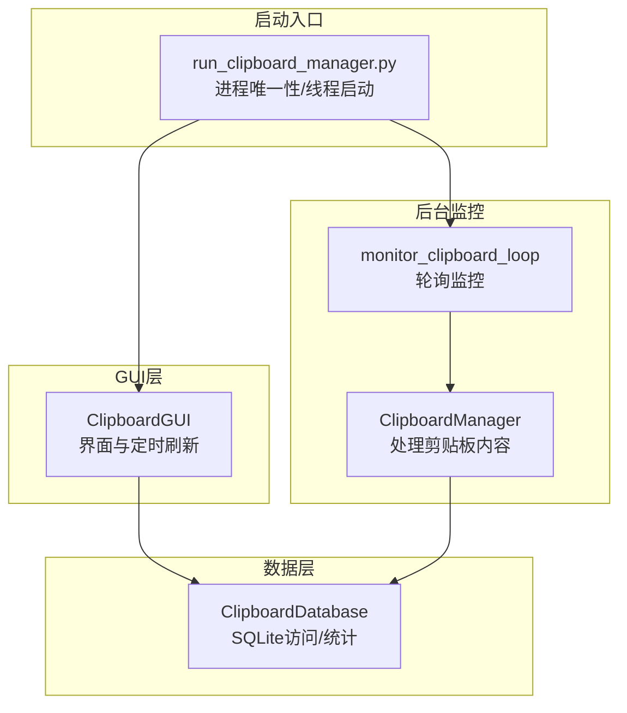
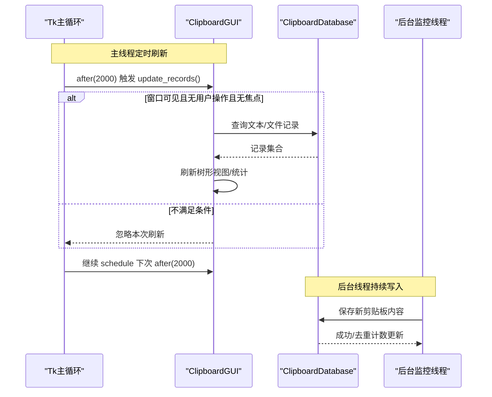
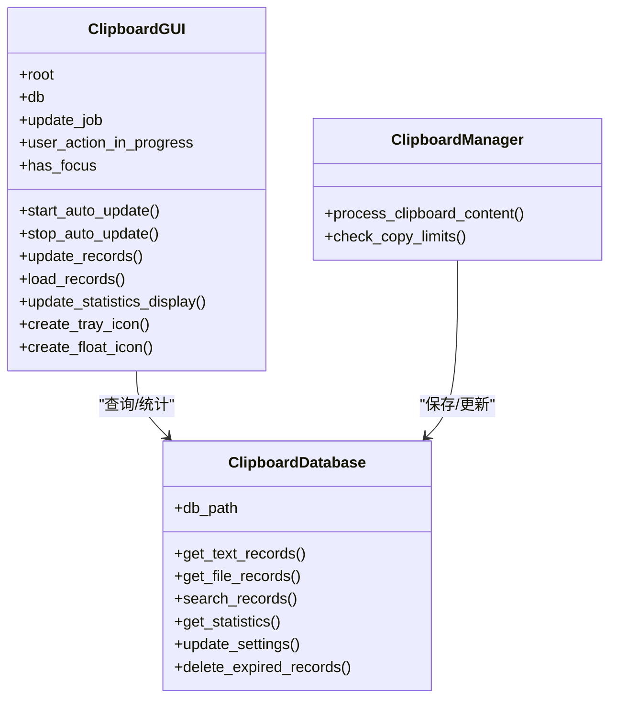

# GUI更新机制

<cite>
**本文引用的文件**
- [clipboard_gui.py](file://clipboard_gui.py)
- [clipboard_manager_main.py](file://clipboard_manager_main.py)
- [clipboard_db.py](file://clipboard_db.py)
- [run_clipboard_manager.py](file://run_clipboard_manager.py)
- [view_clipboard_history.py](file://view_clipboard_history.py)
</cite>

## 目录
1. [简介](#简介)
2. [项目结构](#项目结构)
3. [核心组件](#核心组件)
4. [架构总览](#架构总览)
5. [详细组件分析](#详细组件分析)
6. [依赖关系分析](#依赖关系分析)
7. [性能考量](#性能考量)
8. [故障排查指南](#故障排查指南)
9. [结论](#结论)

## 简介
本文件聚焦于copyhistory项目中GUI界面的更新机制，系统性阐述主线程如何安全地刷新界面元素。重点围绕ClipboardGUI类通过Tkinter的after方法实现的定期更新模式，解释update_job变量如何管理更新任务的调度与取消，避免重复执行；在多线程环境下，后台监控线程通过共享状态变化触发主线程GUI更新的协作机制；以及load_records和update_statistics_display等方法如何在不阻塞UI的情况下从数据库加载数据并更新树形视图。最后结合代码示例说明该更新机制如何平衡实时性与性能开销，并评估其在处理大量历史记录时的效率表现。

## 项目结构
该项目采用“GUI + 数据库 + 后台监控”的分层设计：
- GUI层：ClipboardGUI负责界面展示、交互与定时刷新
- 数据层：ClipboardDatabase封装SQLite访问与统计查询
- 后台监控：ClipboardManager与monitor_clipboard_loop在独立线程中轮询剪贴板变化
- 启动入口：run_clipboard_manager.py控制进程唯一性、后台监控线程与GUI生命周期

图表来源
- [clipboard_gui.py](file://clipboard_gui.py#L1676-L1722)
- [clipboard_manager_main.py](file://clipboard_manager_main.py#L717-L759)
- [clipboard_db.py](file://clipboard_db.py#L1-L120)
- [run_clipboard_manager.py](file://run_clipboard_manager.py#L32-L66)

章节来源
- [clipboard_gui.py](file://clipboard_gui.py#L1-L120)
- [clipboard_manager_main.py](file://clipboard_manager_main.py#L1-L120)
- [clipboard_db.py](file://clipboard_db.py#L1-L120)
- [run_clipboard_manager.py](file://run_clipboard_manager.py#L1-L71)

## 核心组件
- ClipboardGUI：负责界面构建、用户交互、定时刷新、托盘与悬浮图标、设置管理等
- ClipboardDatabase：提供文本/文件记录查询、统计、设置读写、过期清理等
- ClipboardManager + monitor_clipboard_loop：后台线程持续轮询剪贴板，将新内容持久化至数据库
- run_clipboard_manager：进程唯一性检查、启动监控线程、隐藏主窗口并显示托盘图标

章节来源
- [clipboard_gui.py](file://clipboard_gui.py#L37-L120)
- [clipboard_db.py](file://clipboard_db.py#L1-L120)
- [clipboard_manager_main.py](file://clipboard_manager_main.py#L355-L496)
- [run_clipboard_manager.py](file://run_clipboard_manager.py#L17-L66)

## 架构总览
GUI更新机制的核心在于“主线程 + Tkinter after + 后台线程”的协作：
- 主线程通过root.after周期性调度update_records，仅在满足条件时刷新记录树
- 后台线程每秒轮询剪贴板，将新内容保存到数据库
- 数据库变更由GUI侧定时任务感知并刷新界面，避免阻塞UI

图表来源
- [clipboard_gui.py](file://clipboard_gui.py#L1676-L1722)
- [clipboard_manager_main.py](file://clipboard_manager_main.py#L717-L759)
- [clipboard_db.py](file://clipboard_db.py#L116-L183)

## 详细组件分析

### ClipboardGUI类与Tkinter定时更新
- 定时调度与取消
  - start_auto_update：通过root.after(2000, update_records)启动定时任务，update_job保存任务句柄
  - stop_auto_update：当应用退出或窗口关闭时，使用after_cancel取消任务，避免悬挂回调
  - update_records：周期性检查窗口状态（是否隐藏、是否有用户操作、是否有焦点），仅在满足条件时调用load_records刷新
  - show_window/quit_application：显示窗口时立即刷新，退出时停止定时任务

- update_job的作用
  - 作为root.after返回的任务句柄，用于取消重复调度
  - 在每次update_records末尾重新schedule下一次after(2000)，形成稳定的周期性刷新链路

- 线程安全与UI刷新
  - 所有UI更新均发生在主线程（root.after回调），避免跨线程访问Tkinter控件
  - 用户操作标志user_action_in_progress与has_focus用于避免在用户交互或窗口获取焦点时频繁刷新，减少闪烁与抖动

- 统计信息刷新
  - update_statistics_display：从数据库获取统计信息，构造文本并更新只读Text控件，避免编辑态引发的复杂状态

章节来源
- [clipboard_gui.py](file://clipboard_gui.py#L1676-L1722)
- [clipboard_gui.py](file://clipboard_gui.py#L555-L580)
- [clipboard_gui.py](file://clipboard_gui.py#L796-L878)
- [clipboard_gui.py](file://clipboard_gui.py#L1697-L1715)

### load_records与update_statistics_display的非阻塞实现
- load_all_records（被load_records委托）：
  - 清空现有树节点
  - 依据当前排序列映射到数据库字段，分别查询文本与文件记录
  - 对记录进行预处理（文本截断、文件大小格式化、次数提取），批量插入树形视图
  - 结束后调用update_statistics_display刷新统计区

- update_statistics_display：
  - 从数据库获取文本/文件计数与总大小
  - 格式化输出到只读Text控件，避免编辑态带来的状态管理复杂性

- 性能要点
  - 一次性清空并批量插入，减少多次insert导致的界面重绘
  - 排序在数据库层完成，降低Python侧排序成本
  - 统计区禁用编辑态，避免频繁tag更新

章节来源
- [clipboard_gui.py](file://clipboard_gui.py#L581-L626)
- [clipboard_gui.py](file://clipboard_gui.py#L555-L580)
- [clipboard_db.py](file://clipboard_db.py#L185-L261)
- [clipboard_db.py](file://clipboard_db.py#L316-L332)

### 多线程协作：后台监控线程触发主线程GUI更新
- 后台监控
  - monitor_clipboard_loop在独立线程中每秒轮询剪贴板
  - ClipboardManager.process_clipboard_content解析文本/文件，调用ClipboardDatabase保存或去重计数更新

- 主线程感知
  - GUI通过定时任务（root.after）周期性刷新，无需显式监听数据库变更
  - 若希望即时响应，可在后台线程中通过主线程队列或事件机制通知（当前实现未采用），而是采用定时轮询策略

- 进程唯一性与托盘
  - run_clipboard_manager通过互斥量保证进程唯一
  - 默认隐藏主窗口，仅显示托盘图标，用户通过托盘或Alt+C切换显示

章节来源
- [clipboard_manager_main.py](file://clipboard_manager_main.py#L717-L759)
- [clipboard_manager_main.py](file://clipboard_manager_main.py#L355-L496)
- [run_clipboard_manager.py](file://run_clipboard_manager.py#L17-L66)

### 搜索与排序的实现细节
- 搜索流程
  - 清空树节点
  - 调用ClipboardDatabase.search_records获取匹配记录
  - 对结果进行排序（数值/文本），再批量插入树形视图

- 排序策略
  - 列标题点击后更新sort_column与sort_reverse
  - update_sort_indicators动态更新列标题箭头
  - load_all_records与search_records均基于数据库层排序，避免Python侧大规模数据排序

章节来源
- [clipboard_gui.py](file://clipboard_gui.py#L280-L308)
- [clipboard_gui.py](file://clipboard_gui.py#L652-L748)
- [clipboard_db.py](file://clipboard_db.py#L281-L314)

### 悬浮图标与最近记录面板（UI体验增强）
- 悬浮图标
  - create_float_icon：创建无边框、置顶、半透明窗口，支持拖动与悬停显示
  - show_float_panel：拉取最近记录（文本/文件），在面板中以紧凑文本形式展示
  - hide_float_panel/_check_and_hide_float_panel：延迟隐藏，避免焦点切换误触

- 与定时刷新的关系
  - 悬浮面板的数据同样来自数据库查询，受定时刷新影响，保持与主界面一致

章节来源
- [clipboard_gui.py](file://clipboard_gui.py#L1164-L1234)
- [clipboard_gui.py](file://clipboard_gui.py#L1254-L1379)
- [clipboard_gui.py](file://clipboard_gui.py#L1559-L1599)

## 依赖关系分析

图表来源
- [clipboard_gui.py](file://clipboard_gui.py#L37-L120)
- [clipboard_db.py](file://clipboard_db.py#L1-L120)
- [clipboard_manager_main.py](file://clipboard_manager_main.py#L355-L496)

章节来源
- [clipboard_gui.py](file://clipboard_gui.py#L37-L120)
- [clipboard_db.py](file://clipboard_db.py#L1-L120)
- [clipboard_manager_main.py](file://clipboard_manager_main.py#L355-L496)

## 性能考量
- 定时刷新频率
  - 默认2秒一次，兼顾实时性与CPU占用；可根据数据量与机器性能调整
  - 仅在窗口可见、无用户操作、无焦点时刷新，避免干扰用户

- 数据库查询优化
  - load_all_records与search_records均在数据库层完成排序与LIMIT，减少Python侧处理
  - 统计查询使用聚合函数，避免全表扫描

- UI更新优化
  - 一次性清空并批量插入，减少重绘次数
  - 统计区禁用编辑态，避免tag更新带来的额外开销

- 大量历史记录场景
  - 当前实现采用一次性加载与显示，适合中小规模历史记录
  - 若历史记录量极大，建议引入分页加载与虚拟化树形视图，以降低内存与渲染压力

- 后台监控
  - 每秒轮询剪贴板，IO开销低；保存逻辑包含文件复制与MD5计算，需注意磁盘IO与CPU占用

章节来源
- [clipboard_gui.py](file://clipboard_gui.py#L1676-L1722)
- [clipboard_db.py](file://clipboard_db.py#L185-L261)
- [clipboard_manager_main.py](file://clipboard_manager_main.py#L497-L759)

## 故障排查指南
- 界面不刷新
  - 检查update_job是否被取消（stop_auto_update在退出时调用）
  - 确认窗口未隐藏、无用户操作、无焦点
  - 手动调用load_records或update_statistics_display验证数据库查询正常

- 悬浮面板不显示
  - 检查create_float_icon是否成功创建窗口
  - 确认鼠标悬停事件绑定正确，隐藏逻辑中延迟隐藏的after调用是否执行

- 托盘图标不可用
  - pystray/Pillow未安装时会降级为不可用，不影响核心功能
  - 确认系统托盘可用性与权限

- 数据库异常
  - get_statistics/get_text_records/get_file_records失败时，检查db_path与SQLite连接
  - 检查数据库迁移与索引是否存在

章节来源
- [clipboard_gui.py](file://clipboard_gui.py#L1676-L1722)
- [clipboard_gui.py](file://clipboard_gui.py#L1164-L1234)
- [clipboard_db.py](file://clipboard_db.py#L1-L120)

## 结论
本项目的GUI更新机制以“主线程定时刷新 + 后台线程持久化”为核心，通过update_job对Tkinter的after进行统一调度与取消，有效避免重复执行与资源浪费。ClipboardGUI在窗口可见、无用户操作、无焦点时才刷新，既保证了界面的实时性，又兼顾了用户体验与性能。load_records与update_statistics_display采用数据库层排序与批量插入策略，进一步降低了UI阻塞风险。对于超大规模历史记录，建议引入分页与虚拟化技术以提升性能。整体设计简洁可靠，易于维护与扩展。