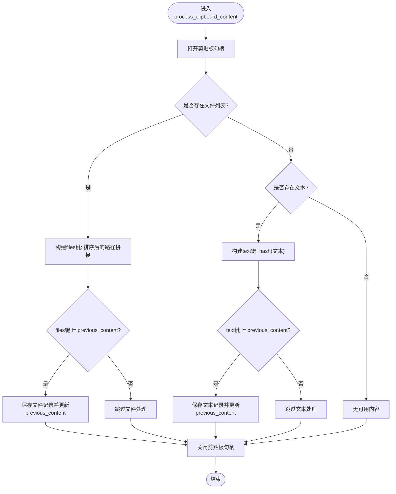

# 共享状态管理

<cite>
**本文引用的文件**
- [clipboard_manager_main.py](file://clipboard_manager_main.py)
- [clipboard_content_detector.py](file://clipboard_content_detector.py)
- [clipboard_db.py](file://clipboard_db.py)
- [run_clipboard_manager.py](file://run_clipboard_manager.py)
- [clipboard_gui.py](file://clipboard_gui.py)
</cite>

## 目录
1. [简介](#简介)
2. [项目结构](#项目结构)
3. [核心组件](#核心组件)
4. [架构总览](#架构总览)
5. [详细组件分析](#详细组件分析)
6. [依赖关系分析](#依赖关系分析)
7. [性能考量](#性能考量)
8. [故障排查指南](#故障排查指南)
9. [结论](#结论)

## 简介
本文件聚焦于copyhistory项目中ClipboardManager类的previous_content字段作为“共享状态”在主线程（GUI）与后台监控线程之间的同步问题。重点分析process_clipboard_content方法中通过比较current_content_key与previous_content来避免重复处理的机制，解释该字段如何作为剪贴板内容变化的检测依据，并探讨在多线程环境下直接读写该共享状态而未使用显式同步原语（如threading.Lock）可能引发的竞态条件，特别是在处理大文件或高频率剪贴板操作时的数据一致性风险。最后结合代码示例说明该轻量级同步机制的设计权衡，以及在当前应用场景下的合理性与潜在缺陷。

## 项目结构
该项目采用“功能模块化 + 主入口控制”的组织方式：
- 主程序入口负责启动GUI与后台监控线程，并在GUI线程中运行剪贴板监控循环。
- 数据库层提供统一的SQLite访问接口，封装增删改查与设置管理。
- GUI层提供查询、统计、设置等界面交互。
- 另有独立的剪贴板内容检测脚本，演示了另一种“基于previous_content_key”的去重策略。

图表来源
- [clipboard_manager_main.py](file://clipboard_manager_main.py#L355-L500)
- [clipboard_db.py](file://clipboard_db.py#L1-L120)
- [run_clipboard_manager.py](file://run_clipboard_manager.py#L32-L71)

章节来源
- [clipboard_manager_main.py](file://clipboard_manager_main.py#L355-L500)
- [run_clipboard_manager.py](file://run_clipboard_manager.py#L32-L71)

## 核心组件
- ClipboardManager：持有previous_content作为共享状态，负责读取剪贴板、判断内容变化、保存文本/文件记录、调用数据库接口。
- ClipboardDatabase：封装SQLite数据库操作，提供文本/文件记录的保存、查询、统计、设置读取与更新。
- GUI与监控线程：GUI线程负责用户交互与展示；后台监控线程周期性调用ClipboardManager.process_clipboard_content，二者共享ClipboardManager实例。

章节来源
- [clipboard_manager_main.py](file://clipboard_manager_main.py#L355-L500)
- [clipboard_db.py](file://clipboard_db.py#L116-L183)

## 架构总览
主线程（GUI）与后台监控线程共享同一个ClipboardManager实例，其中previous_content作为“轻量级”共享状态，用于避免重复处理。由于未使用显式锁，其正确性依赖于Python解释器的原子性保证与调用模式。

图表来源
- [clipboard_manager_main.py](file://clipboard_manager_main.py#L395-L496)
- [clipboard_db.py](file://clipboard_db.py#L116-L183)

章节来源
- [clipboard_manager_main.py](file://clipboard_manager_main.py#L395-L496)
- [run_clipboard_manager.py](file://run_clipboard_manager.py#L47-L66)

## 详细组件分析

### ClipboardManager.previous_content字段与去重机制
- 字段定位：ClipboardManager类在构造时初始化previous_content为None，作为“上一次内容键”的缓存。
- 去重策略：
  - 文件场景：以“files:排序后的文件路径拼接”作为current_content_key，若与previous_content不同则处理并更新。
  - 文本场景：以“text:hash(文本)”作为current_content_key，若与previous_content不同则处理并更新。
- 作用：通过比较current_content_key与previous_content，避免对同一内容的重复处理，降低数据库压力与IO开销。

图表来源
- [clipboard_manager_main.py](file://clipboard_manager_main.py#L395-L496)

章节来源
- [clipboard_manager_main.py](file://clipboard_manager_main.py#L355-L500)
- [clipboard_manager_main.py](file://clipboard_manager_main.py#L395-L496)

### 线程间共享状态的读写与竞态风险
- 现状：主线程（GUI）与后台监控线程均共享同一ClipboardManager实例，且都直接读写previous_content，未使用threading.Lock等显式同步原语。
- Python原子性假设：在CPython中，某些简单操作（如赋值、比较）具有原子性，但跨语句的“读-比较-写”并非整体原子，仍可能在高并发/高频率场景下出现竞态。
- 风险点：
  - 高频复制：短时间内多次复制相同内容，可能因线程切换导致“漏检”或“重复处理”。
  - 大文件复制：文件列表变化频繁或路径顺序不稳定，可能导致键值差异，进而触发重复处理。
  - GUI与监控线程同时修改：若未来引入其他写操作（例如GUI线程主动修改previous_content），将显著增加竞态概率。

章节来源
- [clipboard_manager_main.py](file://clipboard_manager_main.py#L355-L500)
- [run_clipboard_manager.py](file://run_clipboard_manager.py#L47-L66)

### 与独立检测脚本的对比
- 独立脚本clipboard_content_detector.py展示了另一种“基于previous_content_key”的去重思路：在循环中维护一个局部变量previous_content_key，每次读取剪贴板后生成content_key并与之比较，相等则跳过，不等则更新。
- 该模式与ClipboardManager的去重思想一致，但其作用域在函数内部，避免了跨线程共享状态的问题，从而天然规避了竞态。

章节来源
- [clipboard_content_detector.py](file://clipboard_content_detector.py#L218-L273)

### 数据库层与一致性保障
- 文本记录：通过md5_hash唯一约束与number字段实现“去重计数”，即使previous_content未更新，数据库层面也能避免重复入库。
- 文件记录：通过md5_hash唯一约束与number字段实现“去重计数”，同样能缓解重复处理带来的数据冗余。
- 结论：数据库层的唯一约束与计数字段提供了“最终一致性”的兜底，即便previous_content在极少数情况下出现竞态，也不会导致重复记录入库。

章节来源
- [clipboard_db.py](file://clipboard_db.py#L116-L183)
- [clipboard_db.py](file://clipboard_db.py#L316-L351)

### GUI线程与数据库访问
- GUI线程在用户操作时直接连接数据库执行查询/更新，未使用全局锁，但单次操作范围有限，且数据库本身具备事务能力。
- 与ClipboardManager的共享状态相比，GUI线程对数据库的访问更偏向“读写分离”，对previous_content的竞态影响较小。

章节来源
- [clipboard_gui.py](file://clipboard_gui.py#L800-L900)
- [clipboard_gui.py](file://clipboard_gui.py#L950-L1130)

## 依赖关系分析
- ClipboardManager依赖ClipboardDatabase进行持久化。
- GUI与后台监控线程共同依赖ClipboardManager。
- 独立检测脚本clipboard_content_detector.py与主程序逻辑相似，但不涉及共享状态。

图表来源
- [clipboard_manager_main.py](file://clipboard_manager_main.py#L355-L500)
- [clipboard_db.py](file://clipboard_db.py#L1-L120)
- [clipboard_content_detector.py](file://clipboard_content_detector.py#L218-L273)

章节来源
- [clipboard_manager_main.py](file://clipboard_manager_main.py#L355-L500)
- [clipboard_db.py](file://clipboard_db.py#L1-L120)
- [clipboard_content_detector.py](file://clipboard_content_detector.py#L218-L273)

## 性能考量
- 去重成本低：仅字符串比较与少量哈希计算，开销可忽略。
- IO瓶颈：文件复制与数据库写入为主要耗时点，建议关注磁盘IO与数据库事务提交频率。
- 高频场景优化建议：
  - 对超长文本采用MD5键（参考独立检测脚本），减少键长度与比较成本。
  - 对文件列表按键值稳定化（如排序）以减少误判。
  - 若未来引入多处写入previous_content，建议引入轻量级锁或队列化更新，降低竞态概率。

[本节为通用性能讨论，不直接分析具体文件]

## 故障排查指南
- 症状：重复记录或重复处理
  - 检查previous_content是否被意外修改（GUI线程或其他路径）。
  - 检查剪贴板内容键生成逻辑（文件路径排序、文本hash策略）。
- 症状：高频率复制时偶尔漏检
  - 调整监控间隔，避免过于频繁的短间隔导致线程切换。
  - 观察数据库唯一约束是否生效（md5_hash），确认最终一致性。
- 症状：大文件复制异常
  - 确认文件大小限制与复制数量限制设置。
  - 检查文件保存路径与目标目录权限。

章节来源
- [clipboard_manager_main.py](file://clipboard_manager_main.py#L395-L496)
- [clipboard_db.py](file://clipboard_db.py#L116-L183)

## 结论
- previous_content作为“轻量级”共享状态，在当前设计下通过“读-比较-写”的简单流程实现了高效的去重，避免了重复处理与数据库压力。
- 由于未使用显式同步原语，其正确性依赖于Python解释器的原子性与调用模式。在高频率、高并发场景下，仍存在竞态风险，可能导致“漏检/重复处理”的边缘情况。
- 数据库层的md5_hash唯一约束与number计数字段提供了最终一致性兜底，能有效缓解重复入库问题。
- 设计权衡：
  - 优点：实现简单、开销低、易维护。
  - 风险：缺乏显式同步，未来扩展（多写路径、复杂状态）需谨慎。
- 建议：
  - 在当前场景下继续沿用该机制，同时保持监控间隔适中。
  - 若未来引入多处写入previous_content或复杂状态机，应引入轻量级锁或队列化更新，以消除竞态。
  - 对超长文本采用MD5键策略，进一步降低键长度与比较成本。