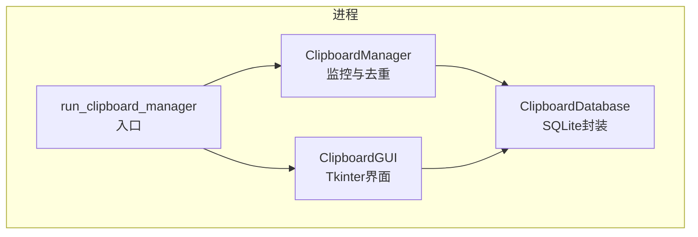
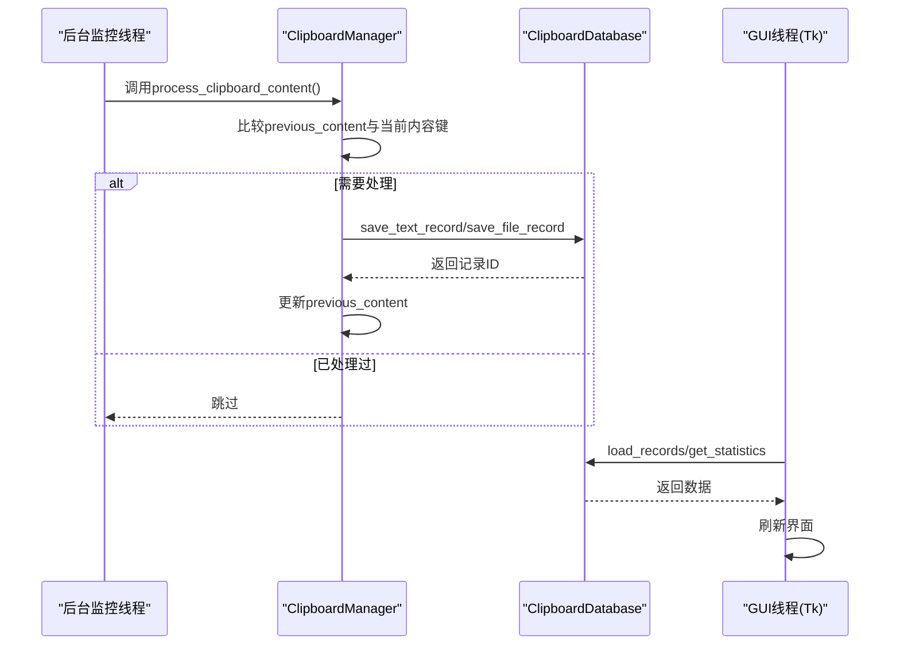
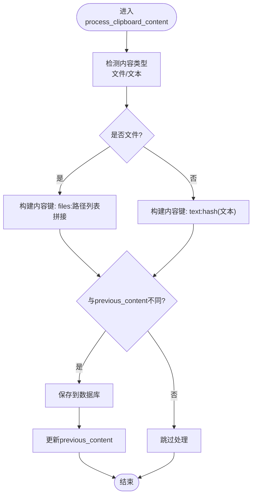
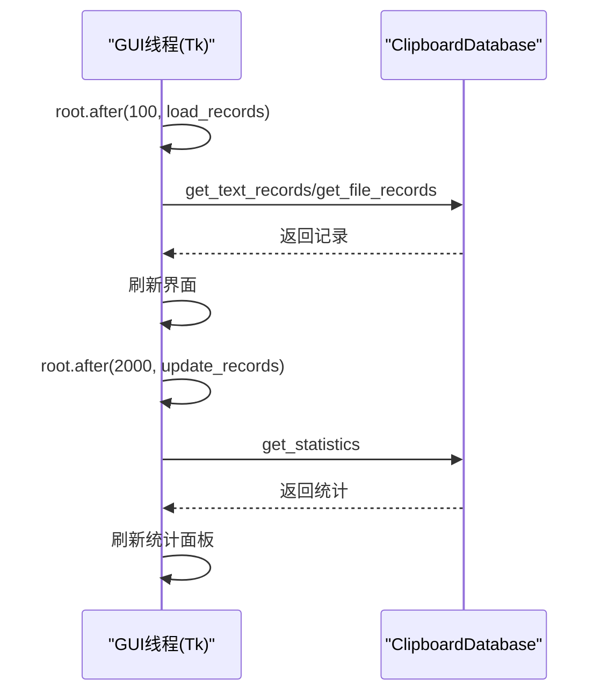
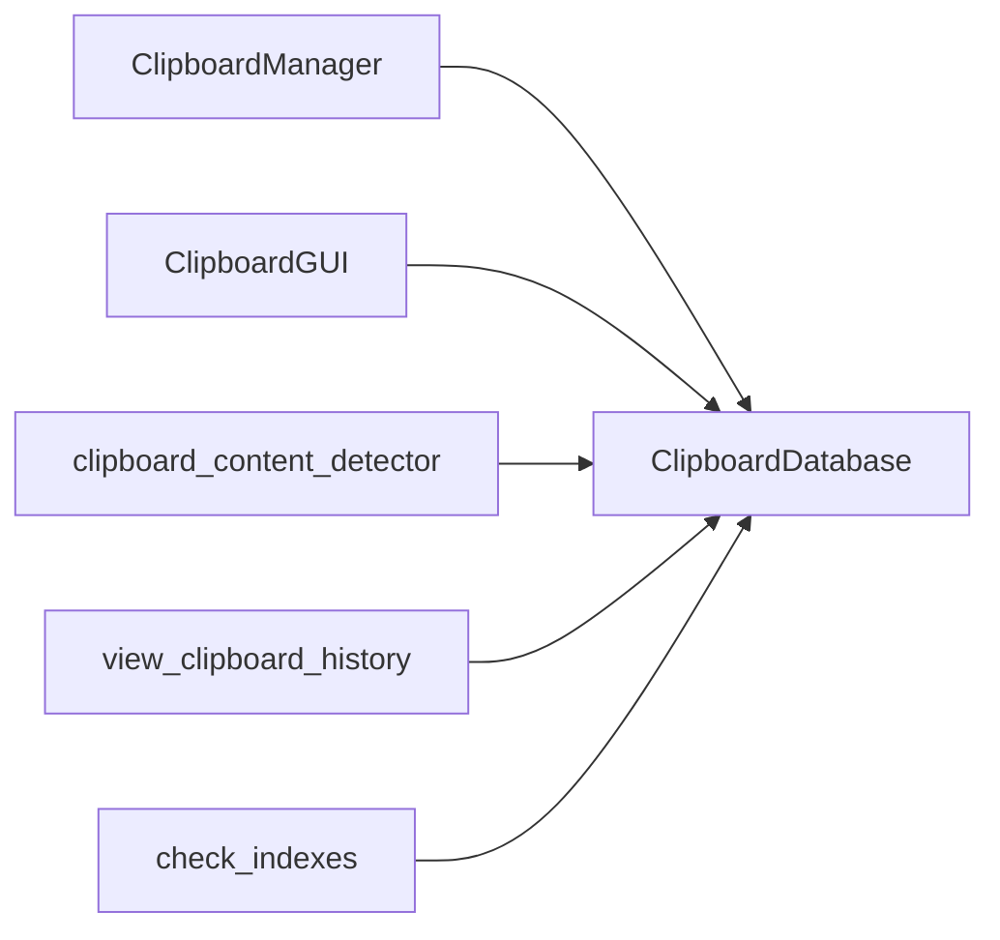

# 同步机制

<cite>
**本文引用的文件**
- [clipboard_manager_main.py](file://clipboard_manager_main.py)
- [clipboard_gui.py](file://clipboard_gui.py)
- [clipboard_db.py](file://clipboard_db.py)
- [clipboard_content_detector.py](file://clipboard_content_detector.py)
- [run_clipboard_manager.py](file://run_clipboard_manager.py)
- [view_clipboard_history.py](file://view_clipboard_history.py)
- [check_indexes.py](file://check_indexes.py)
</cite>

## 目录
1. [简介](#简介)
2. [项目结构](#项目结构)
3. [核心组件](#核心组件)
4. [架构总览](#架构总览)
5. [详细组件分析](#详细组件分析)
6. [依赖关系分析](#依赖关系分析)
7. [性能考量](#性能考量)
8. [故障排查指南](#故障排查指南)
9. [结论](#结论)

## 简介
本文件聚焦于copyhistory项目中的线程同步机制，重点分析：
- 主线程（GUI）与后台监控线程之间的状态同步，尤其是ClipboardManager实例中的previous_content字段如何作为共享状态避免重复处理；
- 当前实现中未使用显式同步原语（如threading.Lock）可能带来的竞态条件风险，特别是在process_clipboard_content方法中对共享状态的读写操作；
- GUI更新机制，特别是Tkinter的after方法在定期更新统计信息和记录列表中的应用，以及如何通过主线程安全地刷新界面；
- 多线程环境下数据库连接（sqlite3）的使用情况与线程安全性评估。

## 项目结构
项目采用“功能模块化 + 单一入口”的组织方式：
- 主程序入口负责启动GUI与后台监控线程，并在必要时独立运行监控器；
- 数据库层提供统一的持久化接口；
- GUI层负责展示与交互，使用Tkinter的after机制进行周期性刷新；
- 监控器负责轮询剪贴板并处理文本/文件内容，避免重复保存。

图表来源
- [clipboard_manager_main.py](file://clipboard_manager_main.py#L355-L496)
- [clipboard_gui.py](file://clipboard_gui.py#L1723-L1730)
- [clipboard_db.py](file://clipboard_db.py#L13-L115)
- [run_clipboard_manager.py](file://run_clipboard_manager.py#L32-L71)

章节来源
- [clipboard_manager_main.py](file://clipboard_manager_main.py#L355-L496)
- [clipboard_gui.py](file://clipboard_gui.py#L1723-L1730)
- [clipboard_db.py](file://clipboard_db.py#L13-L115)
- [run_clipboard_manager.py](file://run_clipboard_manager.py#L32-L71)

## 核心组件
- ClipboardManager：负责监控剪贴板、去重判断、保存文本/文件记录、调用数据库接口。
- ClipboardDatabase：封装SQLite数据库操作，提供增删改查、统计、设置等能力。
- ClipboardGUI：基于Tkinter构建的图形界面，使用root.after进行定时刷新。
- run_clipboard_manager：进程入口，负责创建监控线程与GUI线程，避免重复运行。

章节来源
- [clipboard_manager_main.py](file://clipboard_manager_main.py#L355-L496)
- [clipboard_db.py](file://clipboard_db.py#L13-L115)
- [clipboard_gui.py](file://clipboard_gui.py#L1723-L1730)
- [run_clipboard_manager.py](file://run_clipboard_manager.py#L32-L71)

## 架构总览
主线程（GUI）与后台线程（监控）通过以下方式协作：
- 后台线程每秒调用ClipboardManager.process_clipboard_content，读取剪贴板并写入数据库；
- ClipboardManager使用previous_content作为轻量级共享状态，避免重复处理；
- GUI线程通过root.after周期性调用load_records等方法，从数据库读取最新记录并刷新界面；
- 数据库连接在各模块内部各自建立连接，未使用全局连接池或显式锁。

图表来源
- [clipboard_manager_main.py](file://clipboard_manager_main.py#L395-L496)
- [clipboard_db.py](file://clipboard_db.py#L116-L183)
- [clipboard_gui.py](file://clipboard_gui.py#L55-L80)

章节来源
- [clipboard_manager_main.py](file://clipboard_manager_main.py#L395-L496)
- [clipboard_db.py](file://clipboard_db.py#L116-L183)
- [clipboard_gui.py](file://clipboard_gui.py#L55-L80)

## 详细组件分析

### ClipboardManager：去重与状态同步
- 共享状态：previous_content（字符串），用于记录上一次处理的内容键，避免重复处理。
- 去重策略：
  - 文件场景：以“files:文件路径拼接”作为内容键，若与previous_content不同则处理并更新。
  - 文本场景：以“text:hash(文本)”作为内容键，若与previous_content不同则处理并更新。
- 竞态风险点：
  - 后台线程在process_clipboard_content中读取/写入previous_content，未使用threading.Lock；
  - 若GUI线程同时修改previous_content（例如通过外部接口），可能引发竞态；
  - 若多个后台线程实例共享同一ClipboardManager实例，也会产生竞态。

图表来源
- [clipboard_manager_main.py](file://clipboard_manager_main.py#L395-L496)

章节来源
- [clipboard_manager_main.py](file://clipboard_manager_main.py#L355-L496)

### GUI更新机制：Tkinter after与线程安全
- GUI线程通过root.after周期性调度任务，避免阻塞主线程；
- 在GUI构造函数中，使用root.after(100, self.load_records)延时加载记录；
- 在悬浮图标与自动更新场景中，使用root.after(2000, self.update_records)实现周期刷新；
- GUI线程仅从数据库读取数据，不直接写入共享状态，因此避免了与后台线程的直接竞争。

图表来源
- [clipboard_gui.py](file://clipboard_gui.py#L55-L80)
- [clipboard_gui.py](file://clipboard_gui.py#L1676-L1696)

章节来源
- [clipboard_gui.py](file://clipboard_gui.py#L55-L80)
- [clipboard_gui.py](file://clipboard_gui.py#L1676-L1696)

### 数据库连接与线程安全性
- 各模块在需要时各自创建sqlite3连接（如ClipboardDatabase、GUI中的局部连接），未使用全局连接或显式锁；
- SQLite在单写多读场景下通常能正常工作，但跨线程并发写入存在潜在风险；
- 项目中写入主要集中在ClipboardManager（后台线程），读取分散在GUI线程，属于典型的单写多读模式；
- 建议：为高并发写入场景引入连接池或显式锁，或在GUI线程中避免频繁写入。

章节来源
- [clipboard_db.py](file://clipboard_db.py#L116-L183)
- [clipboard_gui.py](file://clipboard_gui.py#L677-L700)
- [clipboard_gui.py](file://clipboard_gui.py#L761-L794)

### 监控器与GUI入口
- run_clipboard_manager负责：
  - 检查程序是否已运行（互斥锁）；
  - 启动后台监控线程（daemon=True）；
  - 启动GUI线程（默认隐藏主窗口，显示系统托盘图标）；
- clipboard_manager_main提供独立监控模式（命令行参数--monitor）。

章节来源
- [run_clipboard_manager.py](file://run_clipboard_manager.py#L17-L71)
- [clipboard_manager_main.py](file://clipboard_manager_main.py#L717-L761)

## 依赖关系分析
- ClipboardManager依赖ClipboardDatabase进行持久化；
- GUI线程依赖ClipboardDatabase进行读取；
- clipboard_content_detector提供独立的监控与去重逻辑，使用本地previous_content键；
- view_clipboard_history与check_indexes为辅助工具，不参与主线程同步。

图表来源
- [clipboard_manager_main.py](file://clipboard_manager_main.py#L355-L496)
- [clipboard_gui.py](file://clipboard_gui.py#L1723-L1730)
- [clipboard_db.py](file://clipboard_db.py#L13-L115)
- [clipboard_content_detector.py](file://clipboard_content_detector.py#L218-L274)
- [view_clipboard_history.py](file://view_clipboard_history.py#L21-L75)
- [check_indexes.py](file://check_indexes.py#L1-L27)

章节来源
- [clipboard_manager_main.py](file://clipboard_manager_main.py#L355-L496)
- [clipboard_gui.py](file://clipboard_gui.py#L1723-L1730)
- [clipboard_db.py](file://clipboard_db.py#L13-L115)
- [clipboard_content_detector.py](file://clipboard_content_detector.py#L218-L274)
- [view_clipboard_history.py](file://view_clipboard_history.py#L21-L75)
- [check_indexes.py](file://check_indexes.py#L1-L27)

## 性能考量
- 去重策略：
  - 文件场景使用路径拼接作为键，复杂度与文件数量线性相关；
  - 文本场景使用hash，避免长文本比较开销；
- 数据库写入：
  - 每次写入均新建连接，频繁写入可能带来连接开销；
  - 建议：在高频写入场景引入连接池或复用连接；
- GUI刷新：
  - 使用root.after进行周期性刷新，避免阻塞主线程；
  - 建议：根据数据量调整刷新频率，减少不必要的重绘。

[本节为通用建议，不直接分析具体文件]

## 故障排查指南
- 常见问题
  - 重复记录：检查previous_content是否被意外重置或被GUI线程修改；
  - 界面不刷新：确认root.after是否仍在运行，是否存在异常导致任务取消；
  - 数据库锁冲突：在高并发写入时可能出现锁等待，需优化写入策略或引入连接池。
- 排查步骤
  - 使用view_clipboard_history查看最近记录与统计；
  - 使用check_indexes检查索引是否正确；
  - 在clipboard_content_detector中启用monitor模式观察剪贴板变化与去重效果。

章节来源
- [view_clipboard_history.py](file://view_clipboard_history.py#L21-L75)
- [check_indexes.py](file://check_indexes.py#L1-L27)
- [clipboard_content_detector.py](file://clipboard_content_detector.py#L218-L274)

## 结论
- 当前实现通过ClipboardManager的previous_content实现了轻量级去重，避免了重复处理；
- GUI通过Tkinter的after机制安全地刷新界面，避免阻塞主线程；
- 数据库连接在各模块内各自创建，未使用全局连接池或显式锁，属于单写多读的典型场景；
- 竞态风险主要存在于后台线程对previous_content的读写，以及GUI线程可能间接影响该状态的情形；
- 建议：
  - 在ClipboardManager中引入threading.Lock保护shared state；
  - 在GUI线程中避免直接修改previous_content；
  - 在高频写入场景引入连接池或复用连接，降低连接开销；
  - 对root.after任务进行异常捕获与重试，提升稳定性。