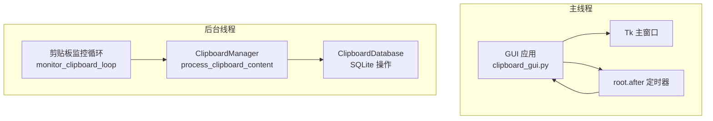
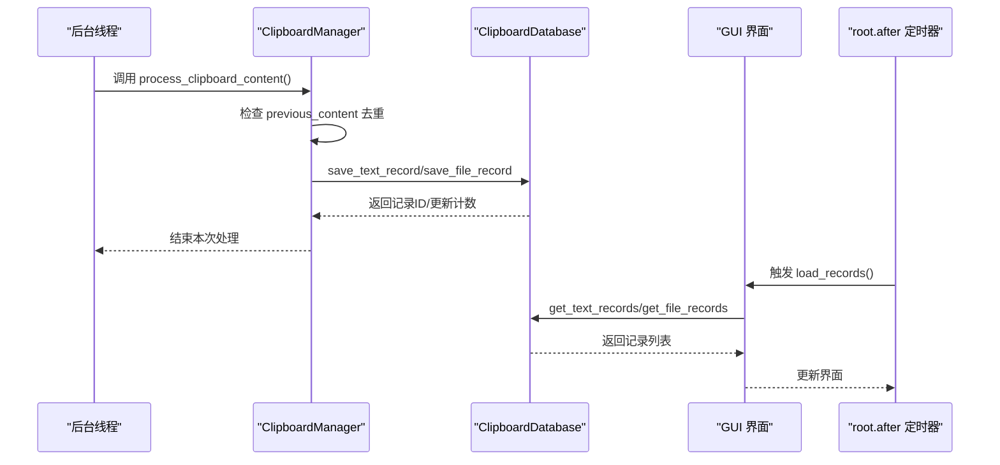
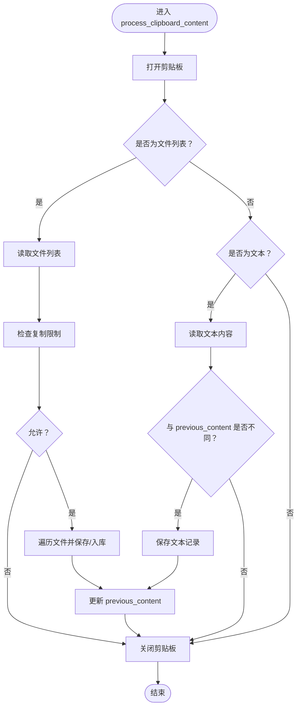
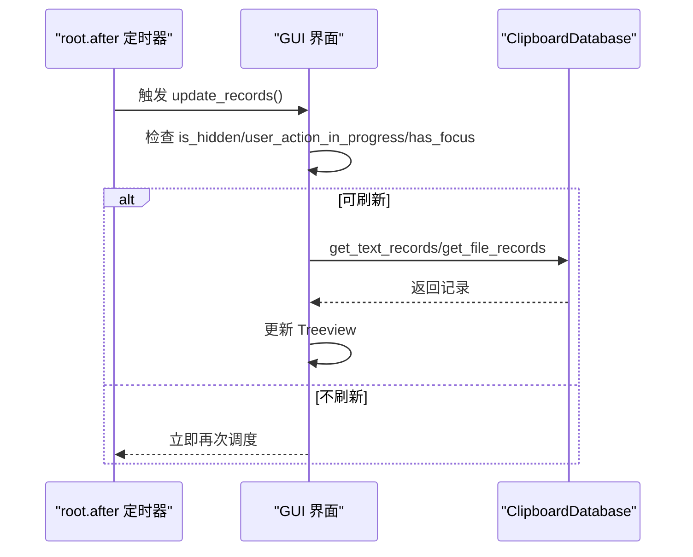
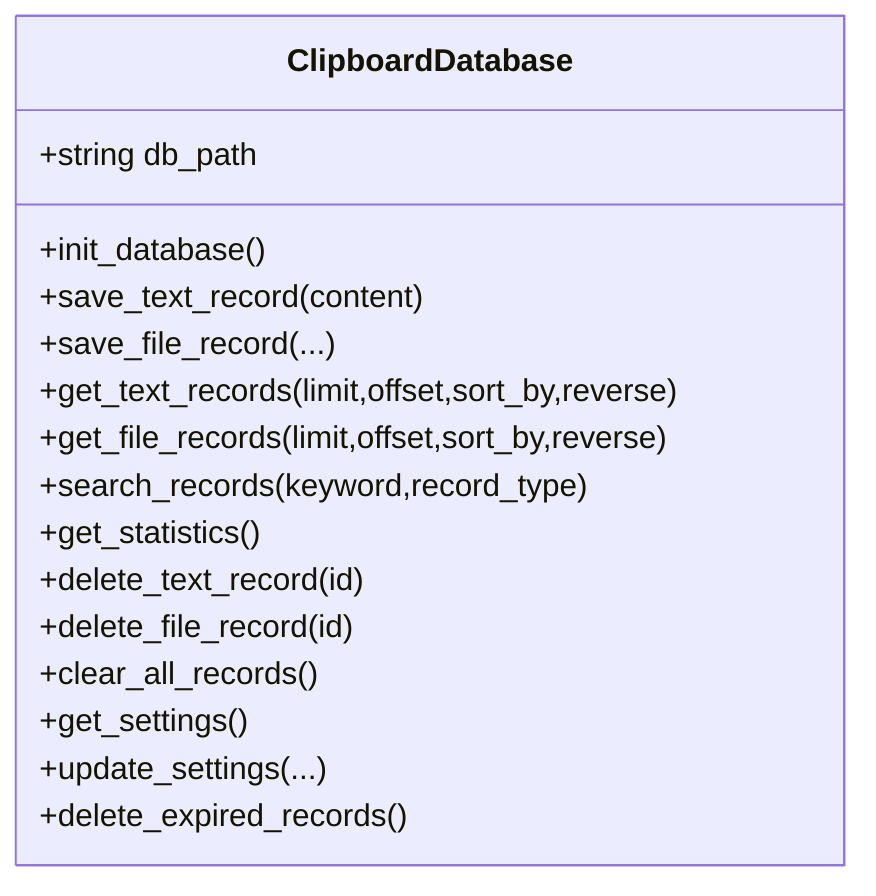
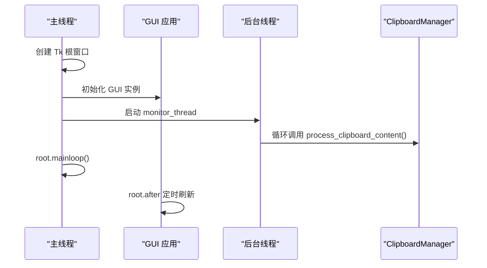
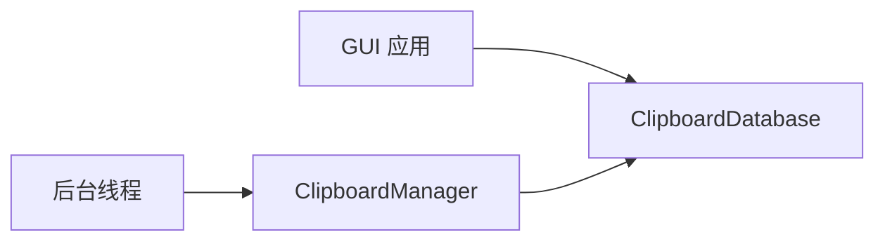
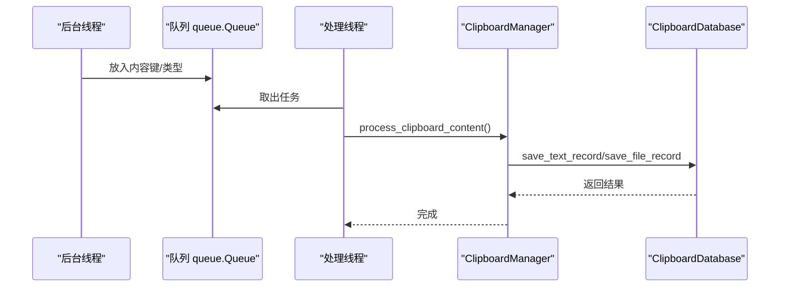

# 线程同步与通信

<cite>
**本文引用的文件**
- [clipboard_manager_main.py](file://clipboard_manager_main.py)
- [clipboard_gui.py](file://clipboard_gui.py)
- [clipboard_db.py](file://clipboard_db.py)
- [run_clipboard_manager.py](file://run_clipboard_manager.py)
- [clipboard_content_detector.py](file://clipboard_content_detector.py)
- [view_clipboard_history.py](file://view_clipboard_history.py)
</cite>

## 目录
1. [简介](#简介)
2. [项目结构](#项目结构)
3. [核心组件](#核心组件)
4. [架构总览](#架构总览)
5. [详细组件分析](#详细组件分析)
6. [依赖关系分析](#依赖关系分析)
7. [性能考量](#性能考量)
8. [故障排查指南](#故障排查指南)
9. [结论](#结论)
10. [附录](#附录)

## 简介
本文件聚焦于 copyhistory 中主线程与后台线程之间的同步与通信机制，围绕以下目标展开：
- ClipboardManager 实例作为共享对象在两个线程间的数据传递方式
- process_clipboard_content 方法如何被后台线程安全调用
- 当前实现中是否存在共享状态（如 previous_content 字段）以及潜在的竞态条件
- GUI 组件（如记录列表）的更新是如何从后台线程安全地传递到主线程的，是否使用了 threading.Event、queue.Queue 或 Tkinter 的 after 方法
- 数据库操作（ClipboardDatabase）在多线程环境下的线程安全性，SQLite 连接是否在跨线程使用时存在风险
- 提出使用队列（queue.Queue）进行线程间通信的优化方案，以解耦监控逻辑与数据处理

## 项目结构
该项目采用“主程序 + GUI + 数据库”的分层设计，主线程负责 GUI 交互与定时刷新，后台线程负责周期性监控剪贴板并写入数据库。数据库模块独立封装，提供统一的 CRUD 接口。

图表来源
- [clipboard_manager_main.py](file://clipboard_manager_main.py#L717-L759)
- [clipboard_gui.py](file://clipboard_gui.py#L1676-L1696)
- [clipboard_db.py](file://clipboard_db.py#L116-L183)

章节来源
- [clipboard_manager_main.py](file://clipboard_manager_main.py#L717-L759)
- [clipboard_gui.py](file://clipboard_gui.py#L1676-L1696)
- [clipboard_db.py](file://clipboard_db.py#L116-L183)

## 核心组件
- ClipboardManager：负责监控剪贴板、去重判断、文件分类与保存、文本入库等业务逻辑。其内部维护 previous_content 作为共享状态，用于避免重复处理相同内容。
- ClipboardDatabase：封装 SQLite 数据库的初始化、增删改查、统计与设置管理。
- GUI 应用（ClipboardGUIMain/ClipboardGUI）：负责界面展示、搜索、刷新、统计、设置等，使用 root.after 定时刷新记录列表。

章节来源
- [clipboard_manager_main.py](file://clipboard_manager_main.py#L355-L716)
- [clipboard_db.py](file://clipboard_db.py#L1-L115)
- [clipboard_gui.py](file://clipboard_gui.py#L1-L120)

## 架构总览
主线程与后台线程通过以下方式进行协作：
- 后台线程周期性调用 ClipboardManager.process_clipboard_content，完成剪贴板内容检测、去重与入库。
- GUI 通过 root.after 定时触发 load_records，从数据库读取最新记录并更新界面。
- 两者均通过 ClipboardDatabase 访问同一份 SQLite 数据库文件，但每次数据库操作都在各自线程内建立独立连接。

图表来源
- [clipboard_manager_main.py](file://clipboard_manager_main.py#L395-L496)
- [clipboard_manager_main.py](file://clipboard_manager_main.py#L717-L759)
- [clipboard_gui.py](file://clipboard_gui.py#L1676-L1696)
- [clipboard_db.py](file://clipboard_db.py#L185-L261)

## 详细组件分析

### ClipboardManager：监控与处理
- 共享状态：previous_content 用于记录上一次的内容键，避免重复处理。该字段在主线程与后台线程之间共享，存在竞态风险。
- 去重策略：文本与文件分别生成内容键，文本键基于哈希或MD5，文件键基于排序后的路径拼接。
- 数据库写入：成功写入或命中重复时，会更新 number 计数并刷新时间戳。
- 异常处理：对剪贴板访问异常进行捕获与降级处理，保证监控循环持续运行。

图表来源
- [clipboard_manager_main.py](file://clipboard_manager_main.py#L395-L496)

章节来源
- [clipboard_manager_main.py](file://clipboard_manager_main.py#L355-L496)

### GUI 更新：定时刷新与线程安全
- 刷新机制：GUI 使用 root.after 每隔固定时间触发 update_records/load_records，从数据库读取最新记录并更新 Treeview。
- 线程安全：GUI 仅在主线程中执行 UI 操作，数据库读取也在主线程内完成，避免跨线程直接修改 Tkinter 组件。
- 用户体验：当窗口隐藏、用户操作进行中或窗口有焦点时，减少不必要的刷新，降低资源消耗。

图表来源
- [clipboard_gui.py](file://clipboard_gui.py#L1676-L1696)
- [clipboard_gui.py](file://clipboard_gui.py#L581-L626)

章节来源
- [clipboard_gui.py](file://clipboard_gui.py#L1676-L1696)
- [clipboard_gui.py](file://clipboard_gui.py#L581-L626)

### 数据库模块：线程安全性与并发访问
- 连接模型：每个数据库操作都新建连接并关闭，避免跨线程共享连接句柄。
- 去重与计数：通过 md5_hash 唯一约束与 number 字段实现重复内容计数更新。
- 索引与迁移：数据库初始化时添加 md5_hash 唯一索引，并兼容旧版本字段迁移。

图表来源
- [clipboard_db.py](file://clipboard_db.py#L1-L115)
- [clipboard_db.py](file://clipboard_db.py#L116-L183)
- [clipboard_db.py](file://clipboard_db.py#L185-L261)
- [clipboard_db.py](file://clipboard_db.py#L316-L412)

章节来源
- [clipboard_db.py](file://clipboard_db.py#L1-L115)
- [clipboard_db.py](file://clipboard_db.py#L116-L183)
- [clipboard_db.py](file://clipboard_db.py#L185-L261)
- [clipboard_db.py](file://clipboard_db.py#L316-L412)

### 后台监控与 GUI 启动
- 后台线程：通过 threading.Thread 启动 monitor_clipboard_loop，周期调用 ClipboardManager.process_clipboard_content。
- GUI 启动：主线程创建 Tk 窗口与 GUI 实例，后台线程与主线程并行运行。

图表来源
- [clipboard_manager_main.py](file://clipboard_manager_main.py#L731-L759)
- [run_clipboard_manager.py](file://run_clipboard_manager.py#L32-L70)

章节来源
- [clipboard_manager_main.py](file://clipboard_manager_main.py#L731-L759)
- [run_clipboard_manager.py](file://run_clipboard_manager.py#L32-L70)

## 依赖关系分析
- 组件耦合
  - GUI 依赖 ClipboardDatabase 进行数据读取与统计。
  - 后台线程依赖 ClipboardManager 完成剪贴板处理与入库。
  - ClipboardManager 依赖 ClipboardDatabase 完成持久化。
- 同步点
  - GUI 与后台线程通过 ClipboardDatabase 共享数据源，未使用显式的同步原语（如 threading.Event、queue.Queue）。
  - GUI 通过 root.after 与 Tk 主循环协调更新，避免直接跨线程修改 UI。

图表来源
- [clipboard_manager_main.py](file://clipboard_manager_main.py#L355-L496)
- [clipboard_gui.py](file://clipboard_gui.py#L581-L626)
- [clipboard_db.py](file://clipboard_db.py#L116-L183)

章节来源
- [clipboard_manager_main.py](file://clipboard_manager_main.py#L355-L496)
- [clipboard_gui.py](file://clipboard_gui.py#L581-L626)
- [clipboard_db.py](file://clipboard_db.py#L116-L183)

## 性能考量
- 监控频率：后台线程以固定间隔轮询剪贴板，建议根据系统负载调整间隔，避免频繁 IO。
- 数据库写入：每次写入均新建连接，SQLite 在单写场景下表现稳定，但大量并发写入可能成为瓶颈。
- GUI 刷新：root.after 以固定周期刷新，窗口隐藏或有焦点时暂停刷新，降低资源占用。
- 去重策略：previous_content 与 md5_hash 双重去重，有效减少重复入库与 UI 刷新。

[本节为通用指导，无需列出具体文件来源]

## 故障排查指南
- 剪贴板访问异常
  - 现象：监控循环报错或无法读取剪贴板。
  - 排查：确认剪贴板句柄正确打开/关闭，异常分支已捕获并降级处理。
  - 参考路径：[clipboard_manager_main.py](file://clipboard_manager_main.py#L395-L496)
- GUI 列表不刷新
  - 现象：新增记录未显示。
  - 排查：确认 root.after 是否仍在运行，窗口是否处于隐藏/焦点状态导致跳过刷新。
  - 参考路径：[clipboard_gui.py](file://clipboard_gui.py#L1676-L1696)
- 数据库写入冲突
  - 现象：重复内容未合并计数。
  - 排查：检查 md5_hash 唯一约束与 number 字段更新逻辑。
  - 参考路径：[clipboard_db.py](file://clipboard_db.py#L116-L183)
- 多实例冲突
  - 现象：重复启动应用。
  - 排查：检查互斥量是否已存在，必要时激活已有窗口。
  - 参考路径：[run_clipboard_manager.py](file://run_clipboard_manager.py#L17-L45)

章节来源
- [clipboard_manager_main.py](file://clipboard_manager_main.py#L395-L496)
- [clipboard_gui.py](file://clipboard_gui.py#L1676-L1696)
- [clipboard_db.py](file://clipboard_db.py#L116-L183)
- [run_clipboard_manager.py](file://run_clipboard_manager.py#L17-L45)

## 结论
- 当前线程模型通过“后台线程 + 主线程 GUI + root.after 定时刷新”实现基本的异步处理与 UI 更新，未引入显式同步原语。
- 存在共享状态 previous_content，若未来引入多线程写入或外部事件驱动，需考虑加锁或使用队列解耦。
- 数据库访问采用每操作一连接的方式，避免跨线程共享连接句柄，具备基础线程安全性。
- 建议引入 queue.Queue 将监控与处理解耦，进一步提升可维护性与扩展性。

[本节为总结性内容，无需列出具体文件来源]

## 附录

### 竞态条件与共享状态分析
- previous_content 位于 ClipboardManager 中，由后台线程写入，GUI 读取用于避免重复处理。若未来改为多线程写入或外部事件驱动，建议：
  - 使用线程锁保护对 previous_content 的读写
  - 或将去重逻辑迁移到数据库层（例如基于时间窗口的去重）

章节来源
- [clipboard_manager_main.py](file://clipboard_manager_main.py#L355-L496)

### SQLite 连接与跨线程使用
- 现状：每个数据库操作新建连接，避免跨线程共享连接句柄。
- 风险：SQLite 在单写场景下较稳定，但在高并发写入时可能出现锁竞争。建议：
  - 保持每操作一连接的模式
  - 对热点写入进行批量化或合并

章节来源
- [clipboard_db.py](file://clipboard_db.py#L116-L183)

### 优化建议：引入队列（queue.Queue）进行线程间通信
- 目标：将“监控”与“处理”解耦，后台线程仅负责采集与投递任务，处理线程专注入库与去重。
- 方案要点：
  - 后台线程将“剪贴板内容键”与“内容类型/数据”放入队列
  - 单独的处理线程从队列取出任务，调用 ClipboardManager.process_clipboard_content
  - GUI 仍通过 root.after 读取数据库并更新 UI
- 优势：
  - 降低后台线程阻塞 UI 的风险
  - 更清晰的任务边界与可测试性
  - 便于扩展为多消费者或多优先级队列

图表来源
- [clipboard_manager_main.py](file://clipboard_manager_main.py#L395-L496)
- [clipboard_db.py](file://clipboard_db.py#L116-L183)

### 相关工具脚本
- 历史记录查看：用于离线查看数据库内容与统计信息
  - 参考路径：[view_clipboard_history.py](file://view_clipboard_history.py#L21-L75)
- 剪贴板内容检测：独立的监控脚本，演示内容格式识别与限制检查
  - 参考路径：[clipboard_content_detector.py](file://clipboard_content_detector.py#L218-L274)

章节来源
- [view_clipboard_history.py](file://view_clipboard_history.py#L21-L75)
- [clipboard_content_detector.py](file://clipboard_content_detector.py#L218-L274)