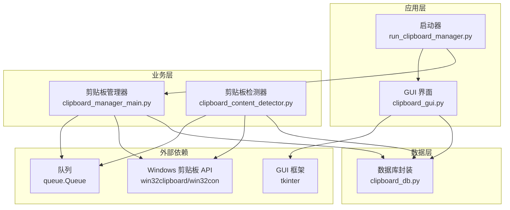
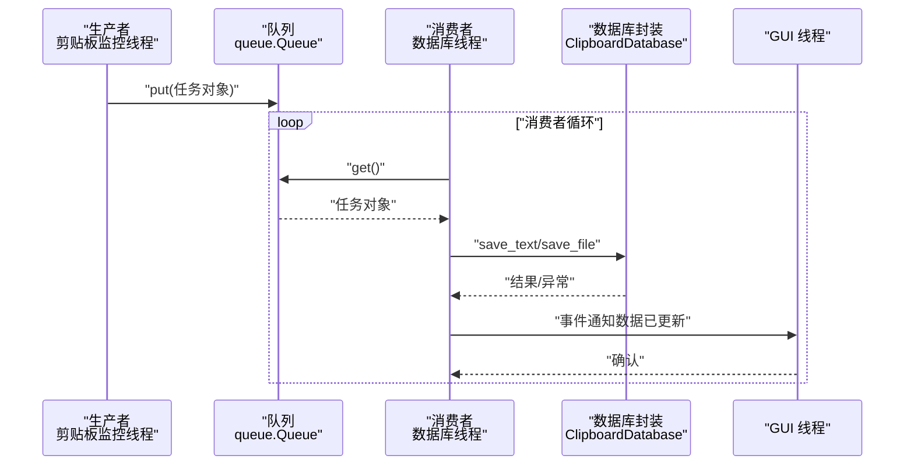
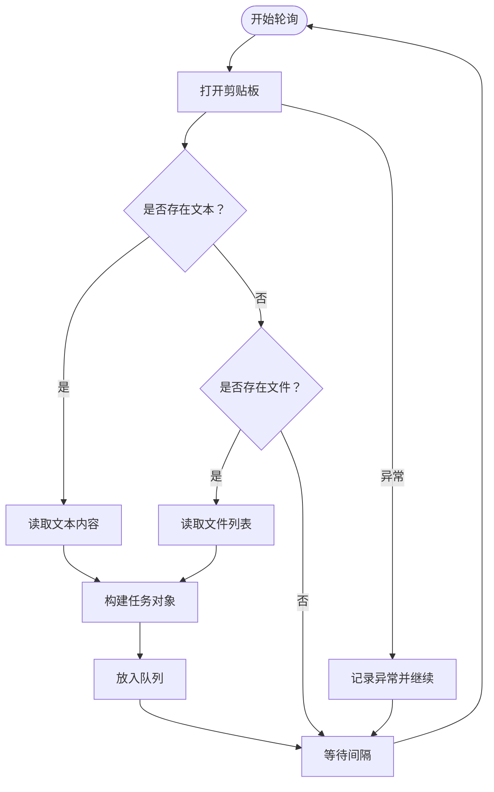
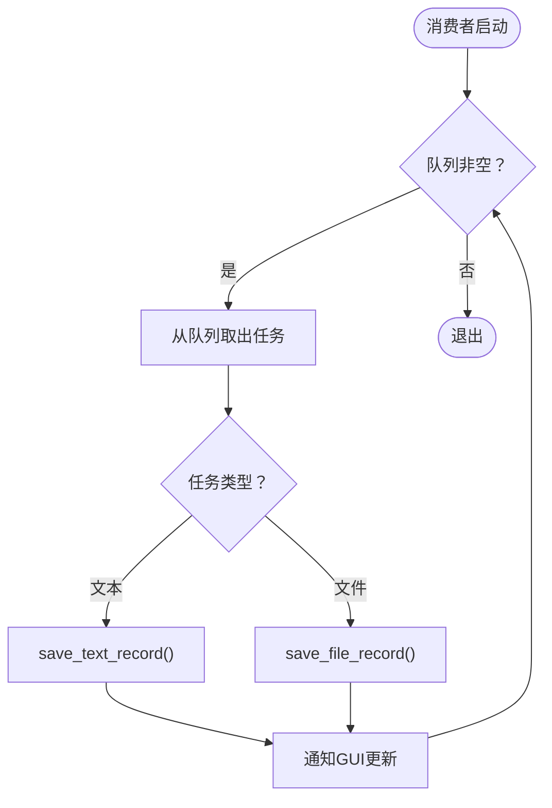
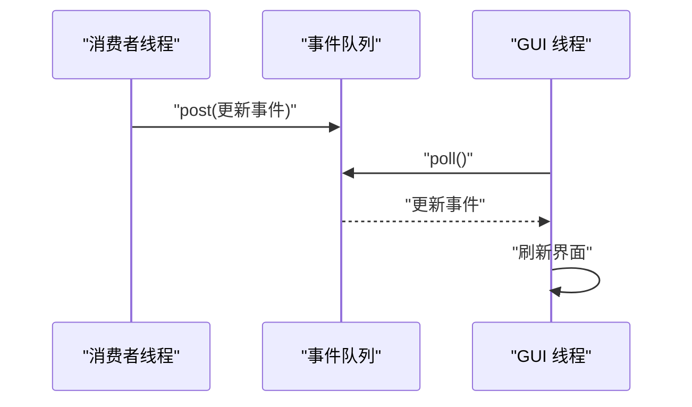
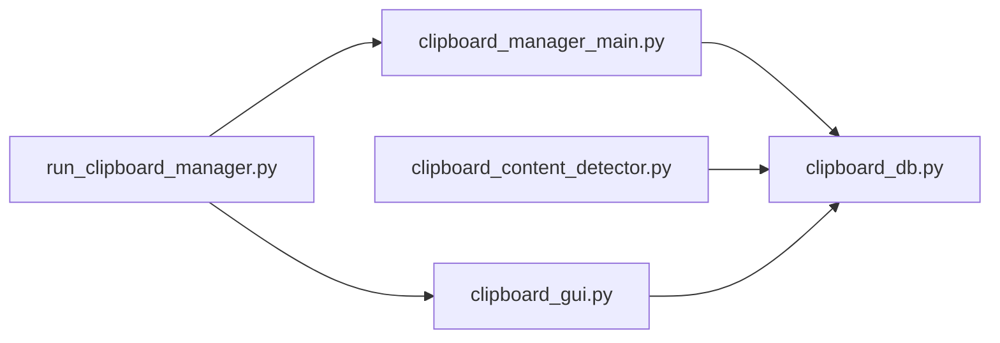

# 优化方案

<cite>
**本文引用的文件**
- [clipboard_manager_main.py](file://clipboard_manager_main.py)
- [clipboard_content_detector.py](file://clipboard_content_detector.py)
- [clipboard_db.py](file://clipboard_db.py)
- [clipboard_gui.py](file://clipboard_gui.py)
- [run_clipboard_manager.py](file://run_clipboard_manager.py)
- [view_clipboard_history.py](file://view_clipboard_history.py)
- [check_db.py](file://check_db.py)
</cite>

## 目录
1. [简介](#简介)
2. [项目结构](#项目结构)
3. [核心组件](#核心组件)
4. [架构总览](#架构总览)
5. [详细组件分析](#详细组件分析)
6. [依赖关系分析](#依赖关系分析)
7. [性能考量](#性能考量)
8. [故障排查指南](#故障排查指南)
9. [结论](#结论)
10. [附录](#附录)

## 简介
本优化方案围绕 copyhistory 项目的线程通信机制，提出基于 queue.Queue 的生产者-消费者模式重构思路，目标如下：
- 将剪贴板监控线程作为生产者，将检测到的内容变化封装为任务对象放入队列；
- 将数据库操作线程作为消费者，从队列中取出任务并安全执行；
- 通过事件驱动机制替代当前的轮询方式，使 GUI 线程能及时响应数据更新；
- 提供具体的代码重构示例，包括队列创建、任务对象设计、线程间异常处理与优雅终止；
- 分析该优化在提升线程安全性、降低耦合度、改善系统响应性方面的优势。

## 项目结构
项目采用模块化组织，主要文件职责如下：
- clipboard_manager_main.py：主程序入口、剪贴板监控循环、GUI 主界面类、数据库封装类；
- clipboard_content_detector.py：独立的剪贴板内容检测器（可作为生产者候选）；
- clipboard_db.py：数据库初始化、增删改查、统计与设置；
- clipboard_gui.py：GUI 界面、托盘图标、定时刷新、设置与统计展示；
- run_clipboard_manager.py：启动脚本，负责进程互斥、监控线程与 GUI 的协调；
- view_clipboard_history.py、check_db.py：辅助工具脚本。

图表来源
- [clipboard_manager_main.py](file://clipboard_manager_main.py#L1-L120)
- [clipboard_content_detector.py](file://clipboard_content_detector.py#L1-L60)
- [clipboard_db.py](file://clipboard_db.py#L1-L60)
- [clipboard_gui.py](file://clipboard_gui.py#L1-L60)
- [run_clipboard_manager.py](file://run_clipboard_manager.py#L1-L40)

章节来源
- [clipboard_manager_main.py](file://clipboard_manager_main.py#L1-L120)
- [clipboard_content_detector.py](file://clipboard_content_detector.py#L1-L60)
- [clipboard_db.py](file://clipboard_db.py#L1-L60)
- [clipboard_gui.py](file://clipboard_gui.py#L1-L60)
- [run_clipboard_manager.py](file://run_clipboard_manager.py#L1-L40)

## 核心组件
- 剪贴板监控线程（生产者）：当前通过轮询检测剪贴板变化，建议改造为事件驱动并通过队列发布任务；
- 数据库操作线程（消费者）：当前由 GUI 或主流程直接调用数据库接口，建议改为从队列消费任务；
- GUI 线程：负责界面渲染与用户交互，应通过事件通知及时刷新；
- 数据库封装：提供统一的数据访问接口，保证并发安全；
- 启动器：负责进程互斥、监控线程与 GUI 的生命周期管理。

章节来源
- [clipboard_manager_main.py](file://clipboard_manager_main.py#L717-L761)
- [run_clipboard_manager.py](file://run_clipboard_manager.py#L32-L71)
- [clipboard_gui.py](file://clipboard_gui.py#L1-L80)
- [clipboard_db.py](file://clipboard_db.py#L1-L60)

## 架构总览
优化后的架构采用“生产者-消费者 + 事件驱动”的模式：
- 生产者：剪贴板监控线程（或独立检测器）检测到变化后，将任务对象放入队列；
- 消费者：数据库线程从队列取出任务，执行持久化与去重逻辑；
- 事件驱动：消费者完成任务后向 GUI 发送事件通知，GUI 刷新界面；
- 优雅终止：通过特殊退出信号或队列哨兵，确保线程安全退出。

图表来源
- [clipboard_manager_main.py](file://clipboard_manager_main.py#L717-L761)
- [clipboard_db.py](file://clipboard_db.py#L116-L183)
- [clipboard_gui.py](file://clipboard_gui.py#L1-L80)

## 详细组件分析

### 剪贴板监控线程（生产者）重构
- 现状：轮询检测，固定间隔调用处理函数；
- 优化：将监控逻辑拆分为事件源与任务封装，生产者仅负责将“变更任务”放入队列；
- 关键点：
  - 任务对象设计：包含变更类型（文本/文件）、内容摘要、时间戳、去重键等；
  - 异常处理：监控线程捕获剪贴板访问异常并继续运行；
  - 优雅终止：支持退出信号或队列哨兵。

图表来源
- [clipboard_manager_main.py](file://clipboard_manager_main.py#L395-L496)
- [clipboard_content_detector.py](file://clipboard_content_detector.py#L87-L138)

章节来源
- [clipboard_manager_main.py](file://clipboard_manager_main.py#L395-L496)
- [clipboard_content_detector.py](file://clipboard_content_detector.py#L87-L138)

### 数据库操作线程（消费者）重构
- 现状：GUI 或主流程直接调用数据库接口；
- 优化：消费者线程从队列取出任务，执行保存与去重逻辑，避免 GUI 线程阻塞；
- 关键点：
  - 任务路由：根据任务类型调用对应保存方法；
  - 并发安全：数据库连接与事务在消费者线程内隔离；
  - 错误处理：捕获数据库异常并上报，不影响其他任务。

图表来源
- [clipboard_db.py](file://clipboard_db.py#L116-L183)
- [clipboard_manager_main.py](file://clipboard_manager_main.py#L112-L179)

章节来源
- [clipboard_db.py](file://clipboard_db.py#L116-L183)
- [clipboard_manager_main.py](file://clipboard_manager_main.py#L112-L179)

### 事件驱动机制替代轮询
- 现状：GUI 通过定时刷新或手动刷新加载数据；
- 优化：消费者完成任务后向 GUI 发送事件，GUI 响应式刷新；
- 实现要点：
  - GUI 使用主线程事件队列（如 tkinter 的 after 或事件绑定）；
  - 消费者通过线程安全方式触发 GUI 更新（例如使用队列或事件对象）；
  - 避免直接在消费者线程中操作 GUI 控件。

图表来源
- [clipboard_gui.py](file://clipboard_gui.py#L1-L80)
- [clipboard_manager_main.py](file://clipboard_manager_main.py#L717-L761)

章节来源
- [clipboard_gui.py](file://clipboard_gui.py#L1-L80)
- [clipboard_manager_main.py](file://clipboard_manager_main.py#L717-L761)

### 具体代码重构示例（路径指引）
以下为关键重构步骤的代码路径指引（不直接粘贴代码内容）：
- 队列创建与任务对象设计
  - 队列初始化与导入：参考 [clipboard_manager_main.py](file://clipboard_manager_main.py#L1-L25)
  - 任务对象结构建议：包含字段如 type、content_key、content、timestamp、md5_hash 等
- 生产者线程重构
  - 轮询监控函数：参考 [clipboard_manager_main.py](file://clipboard_manager_main.py#L717-L761)
  - 任务封装与入队：参考 [clipboard_content_detector.py](file://clipboard_content_detector.py#L87-L138)
- 消费者线程重构
  - 数据库保存方法：参考 [clipboard_db.py](file://clipboard_db.py#L116-L183)
  - 消费循环与事件通知：参考 [clipboard_gui.py](file://clipboard_gui.py#L1-L80)
- 线程间异常处理与优雅终止
  - 监控线程异常捕获与退出：参考 [clipboard_manager_main.py](file://clipboard_manager_main.py#L488-L496)
  - 启动器进程互斥与主线程退出：参考 [run_clipboard_manager.py](file://run_clipboard_manager.py#L17-L45)

章节来源
- [clipboard_manager_main.py](file://clipboard_manager_main.py#L1-L25)
- [clipboard_manager_main.py](file://clipboard_manager_main.py#L717-L761)
- [clipboard_content_detector.py](file://clipboard_content_detector.py#L87-L138)
- [clipboard_db.py](file://clipboard_db.py#L116-L183)
- [clipboard_gui.py](file://clipboard_gui.py#L1-L80)
- [run_clipboard_manager.py](file://run_clipboard_manager.py#L17-L45)

## 依赖关系分析
- 模块耦合现状：
  - clipboard_manager_main.py 直接依赖 win32clipboard 与 tkinter，且 GUI 与监控在同一进程中；
  - clipboard_gui.py 依赖 clipboard_db.py，但 GUI 刷新仍依赖定时器或手动刷新；
  - clipboard_content_detector.py 与 clipboard_manager_main.py 存在重复的剪贴板读取逻辑。
- 优化后的依赖关系：
  - 生产者与消费者通过队列解耦，减少对 GUI 的直接依赖；
  - 数据库封装保持纯数据访问能力，避免跨线程共享状态。

图表来源
- [clipboard_manager_main.py](file://clipboard_manager_main.py#L1-L120)
- [clipboard_content_detector.py](file://clipboard_content_detector.py#L1-L60)
- [clipboard_db.py](file://clipboard_db.py#L1-L60)
- [clipboard_gui.py](file://clipboard_gui.py#L1-L60)
- [run_clipboard_manager.py](file://run_clipboard_manager.py#L1-L40)

章节来源
- [clipboard_manager_main.py](file://clipboard_manager_main.py#L1-L120)
- [clipboard_content_detector.py](file://clipboard_content_detector.py#L1-L60)
- [clipboard_db.py](file://clipboard_db.py#L1-L60)
- [clipboard_gui.py](file://clipboard_gui.py#L1-L60)
- [run_clipboard_manager.py](file://run_clipboard_manager.py#L1-L40)

## 性能考量
- 减少轮询开销：事件驱动替代固定间隔轮询，显著降低 CPU 占用；
- 提升吞吐量：队列缓冲与异步处理，避免 GUI 线程阻塞；
- 降低耦合：生产者与消费者解耦，便于扩展新的任务类型；
- 并发安全：数据库操作集中在线程内，避免多线程竞争；
- 响应性：事件驱动使 GUI 能即时反映数据变化，提升用户体验。

## 故障排查指南
- 剪贴板访问异常
  - 现象：监控线程打印异常信息后继续运行；
  - 排查：检查剪贴板占用情况与权限；
  - 参考路径：[clipboard_manager_main.py](file://clipboard_manager_main.py#L488-L496)
- 数据库完整性约束冲突
  - 现象：MD5 冲突导致更新计数而非插入新记录；
  - 排查：确认去重策略与唯一索引；
  - 参考路径：[clipboard_db.py](file://clipboard_db.py#L137-L151)
- GUI 刷新不及时
  - 现象：依赖定时刷新导致延迟；
  - 改进：采用事件驱动通知；
  - 参考路径：[clipboard_gui.py](file://clipboard_gui.py#L1-L80)
- 进程互斥与窗口激活
  - 现象：重复启动或窗口无法激活；
  - 排查：检查互斥锁与窗口句柄查找；
  - 参考路径：[run_clipboard_manager.py](file://run_clipboard_manager.py#L17-L45)

章节来源
- [clipboard_manager_main.py](file://clipboard_manager_main.py#L488-L496)
- [clipboard_db.py](file://clipboard_db.py#L137-L151)
- [clipboard_gui.py](file://clipboard_gui.py#L1-L80)
- [run_clipboard_manager.py](file://run_clipboard_manager.py#L17-L45)

## 结论
通过引入 queue.Queue 的生产者-消费者模式与事件驱动机制，copyhistory 项目可在以下方面取得显著改进：
- 线程安全性：数据库操作集中在线程内，避免跨线程共享状态；
- 耦合度降低：生产者与消费者通过队列解耦，便于扩展；
- 响应性提升：事件驱动使 GUI 能即时响应数据更新；
- 可维护性增强：任务对象标准化，便于新增任务类型与错误处理。

## 附录
- 辅助工具脚本
  - 查看历史记录：[view_clipboard_history.py](file://view_clipboard_history.py#L1-L75)
  - 检查数据库内容：[check_db.py](file://check_db.py#L1-L31)

章节来源
- [view_clipboard_history.py](file://view_clipboard_history.py#L1-L75)
- [check_db.py](file://check_db.py#L1-L31)