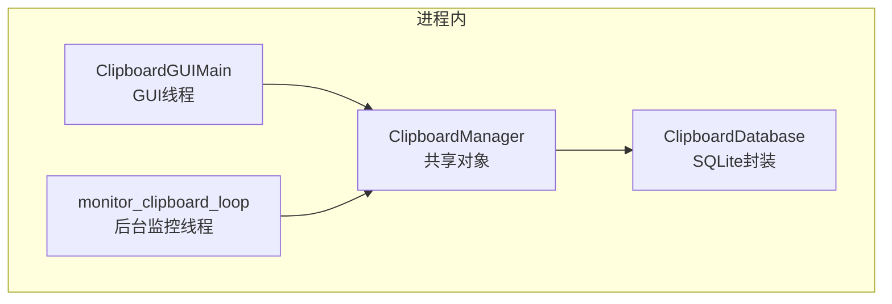
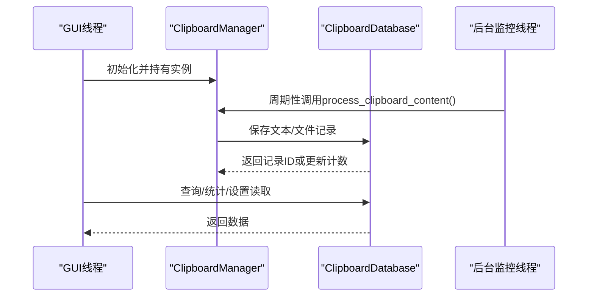
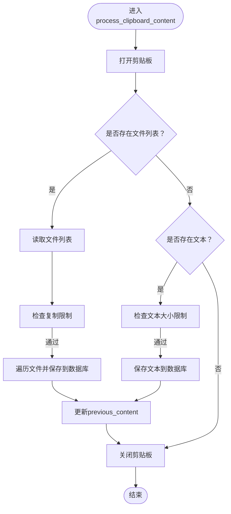
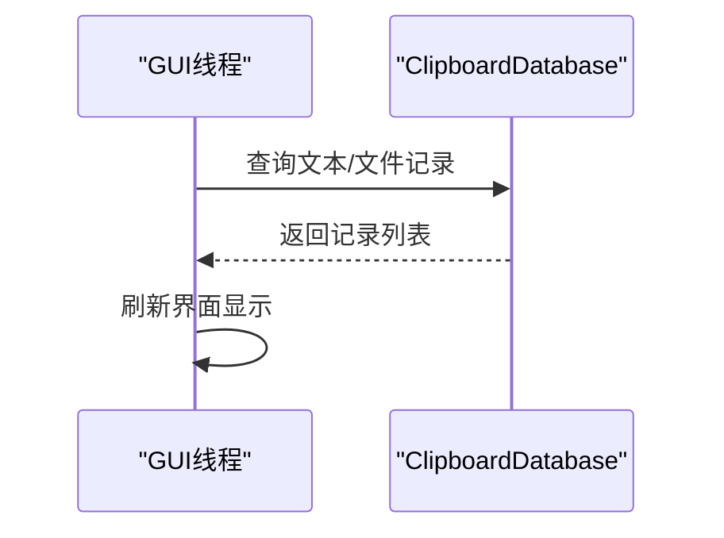
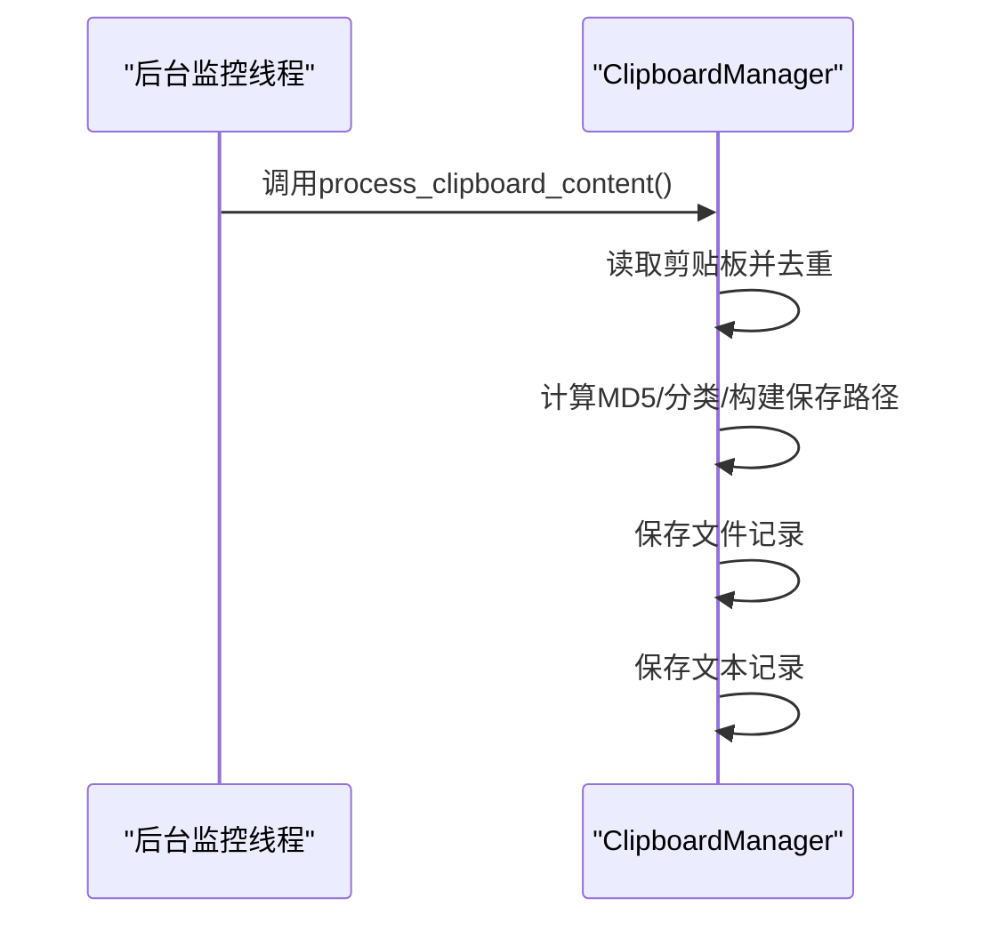
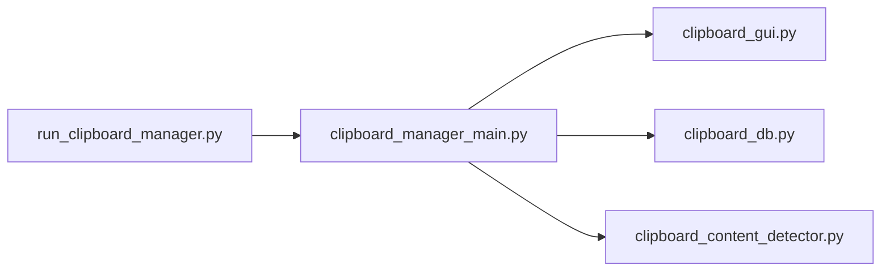

# 当前实现分析

<cite>
**本文引用的文件**
- [clipboard_manager_main.py](file://clipboard_manager_main.py)
- [clipboard_gui.py](file://clipboard_gui.py)
- [clipboard_db.py](file://clipboard_db.py)
- [clipboard_content_detector.py](file://clipboard_content_detector.py)
- [run_clipboard_manager.py](file://run_clipboard_manager.py)
- [view_clipboard_history.py](file://view_clipboard_history.py)
- [build_exe.py](file://build_exe.py)
</cite>

## 目录
1. [简介](#简介)
2. [项目结构](#项目结构)
3. [核心组件](#核心组件)
4. [架构总览](#架构总览)
5. [详细组件分析](#详细组件分析)
6. [依赖关系分析](#依赖关系分析)
7. [性能考量](#性能考量)
8. [故障排查指南](#故障排查指南)
9. [结论](#结论)
10. [附录](#附录)

## 简介
本文件聚焦于copyhistory项目中“主线程（GUI线程）”与“后台监控线程”的通信机制与数据流。通过对ClipboardManager实例作为共享对象在GUI线程与监控线程之间直接共享的设计进行深入剖析，重点解释process_clipboard_content方法在后台线程中被调用并直接操作数据库的行为，指出当前实现缺乏显式线程间通信机制所导致的线程安全风险、GUI线程被动轮询而非事件驱动的缺陷，并结合代码路径说明紧耦合设计在高频剪贴板操作场景下可能引发的数据竞争与性能瓶颈。

## 项目结构
该项目采用“功能模块化 + 主入口控制”的组织方式：
- 主程序入口负责启动GUI与后台监控线程，并在必要时仅运行监控器。
- GUI层提供查询、统计、设置等界面能力。
- 数据库层封装SQLite访问与迁移逻辑。
- 内容检测器提供独立的剪贴板内容探测能力（可单独运行）。
- 打包脚本用于生成可执行文件。

图表来源
- [clipboard_manager_main.py](file://clipboard_manager_main.py#L355-L761)
- [clipboard_gui.py](file://clipboard_gui.py#L1-L120)
- [clipboard_db.py](file://clipboard_db.py#L1-L120)

章节来源
- [clipboard_manager_main.py](file://clipboard_manager_main.py#L1-L120)
- [clipboard_gui.py](file://clipboard_gui.py#L1-L120)
- [clipboard_db.py](file://clipboard_db.py#L1-L120)
- [clipboard_content_detector.py](file://clipboard_content_detector.py#L1-L60)
- [run_clipboard_manager.py](file://run_clipboard_manager.py#L1-L71)
- [view_clipboard_history.py](file://view_clipboard_history.py#L1-L75)
- [build_exe.py](file://build_exe.py#L1-L81)

## 核心组件
- ClipboardManager：负责处理剪贴板内容（文本/文件），并直接调用数据库接口保存记录。其内部维护previous_content用于去重判断。
- ClipboardDatabase：封装SQLite数据库初始化、增删改查、统计与设置读写。
- ClipboardGUIMain：GUI线程侧的界面控制器，负责加载/搜索/展示历史记录。
- monitor_clipboard_loop：后台线程的监控循环，周期性调用ClipboardManager.process_clipboard_content。
- ClipboardGUI：另一个GUI实现（独立脚本），同样通过ClipboardDatabase读取数据并提供交互。
- clipboard_content_detector：独立的剪贴板内容检测器，可单独运行。

章节来源
- [clipboard_manager_main.py](file://clipboard_manager_main.py#L355-L761)
- [clipboard_db.py](file://clipboard_db.py#L1-L200)
- [clipboard_gui.py](file://clipboard_gui.py#L1-L120)
- [clipboard_content_detector.py](file://clipboard_content_detector.py#L1-L120)

## 架构总览
GUI线程与后台监控线程通过一个共享的ClipboardManager实例进行协作：
- GUI线程持有ClipboardManager实例，负责界面渲染与用户交互。
- 后台监控线程持有同一ClipboardManager实例，周期性调用process_clipboard_content，直接对数据库进行写入。
- 两者均通过ClipboardDatabase访问SQLite，但未见显式的线程同步机制（如锁、队列、条件变量等）。

图表来源
- [clipboard_manager_main.py](file://clipboard_manager_main.py#L355-L761)
- [clipboard_gui.py](file://clipboard_gui.py#L560-L720)
- [clipboard_db.py](file://clipboard_db.py#L116-L200)

章节来源
- [clipboard_manager_main.py](file://clipboard_manager_main.py#L717-L761)
- [clipboard_gui.py](file://clipboard_gui.py#L560-L720)
- [clipboard_db.py](file://clipboard_db.py#L116-L200)

## 详细组件分析

### ClipboardManager与process_clipboard_content
- 设计要点
  - ClipboardManager持有ClipboardDatabase实例，作为共享对象在GUI线程与监控线程之间共享。
  - process_clipboard_content在后台线程中被monitor_clipboard_loop周期性调用，直接读取剪贴板并写入数据库。
  - 使用previous_content进行内容去重，避免重复保存。
- 线程安全问题
  - 未使用任何显式同步原语（锁、队列、事件等），存在并发访问数据库的风险。
  - GUI线程与后台线程可能同时访问数据库连接，导致竞态条件与异常。
- 数据库访问模式
  - 每次数据库操作都新建连接并关闭，未复用连接，可能带来额外开销。
  - 未见事务封装，单次写入可能无法保证原子性。

图表来源
- [clipboard_manager_main.py](file://clipboard_manager_main.py#L395-L496)

章节来源
- [clipboard_manager_main.py](file://clipboard_manager_main.py#L355-L496)

### GUI线程与被动更新
- GUI线程通过ClipboardDatabase查询数据库并展示结果，采用“用户主动刷新/搜索”的方式，而非事件驱动的实时更新。
- 这种设计简化了线程同步，但也意味着用户看到的数据存在延迟，且频繁刷新会带来数据库压力。

图表来源
- [clipboard_gui.py](file://clipboard_gui.py#L581-L720)
- [clipboard_db.py](file://clipboard_db.py#L185-L261)

章节来源
- [clipboard_gui.py](file://clipboard_gui.py#L581-L720)
- [clipboard_db.py](file://clipboard_db.py#L185-L261)

### 后台监控线程与共享对象
- 后台线程通过monitor_clipboard_loop周期性调用ClipboardManager.process_clipboard_content，直接对数据库进行写入。
- 该线程与GUI线程共享同一ClipboardManager实例，但未见任何同步保护，存在数据竞争风险。

图表来源
- [clipboard_manager_main.py](file://clipboard_manager_main.py#L717-L730)
- [clipboard_manager_main.py](file://clipboard_manager_main.py#L395-L496)

章节来源
- [clipboard_manager_main.py](file://clipboard_manager_main.py#L717-L730)
- [clipboard_manager_main.py](file://clipboard_manager_main.py#L395-L496)

### 数据库层设计
- ClipboardDatabase负责数据库初始化、表结构迁移、增删改查、统计与设置读写。
- 未见显式的并发控制，所有查询/写入均在方法内建立连接并关闭，未复用连接。
- 存在唯一约束（如text_records.md5_hash），用于避免重复保存。

章节来源
- [clipboard_db.py](file://clipboard_db.py#L1-L200)
- [clipboard_db.py](file://clipboard_db.py#L316-L412)

### 独立内容检测器
- clipboard_content_detector提供独立的剪贴板内容检测能力，可单独运行。
- 该模块未直接参与GUI与监控线程的共享对象设计，但展示了另一种“轮询+限制检查”的思路。

章节来源
- [clipboard_content_detector.py](file://clipboard_content_detector.py#L1-L120)
- [clipboard_content_detector.py](file://clipboard_content_detector.py#L143-L181)

## 依赖关系分析
- 主入口与组件关系
  - run_clipboard_manager.py负责启动GUI与后台监控线程，二者共享ClipboardManager实例。
  - clipboard_manager_main.py提供GUI与监控线程的统一入口与共享对象。
- 组件耦合度
  - GUI线程与监控线程通过共享对象耦合，但缺少显式同步，耦合度较高。
  - 数据库访问在两个线程中均直接发生，未见隔离或缓冲层。

图表来源
- [run_clipboard_manager.py](file://run_clipboard_manager.py#L1-L71)
- [clipboard_manager_main.py](file://clipboard_manager_main.py#L731-L761)
- [clipboard_gui.py](file://clipboard_gui.py#L1-L120)
- [clipboard_db.py](file://clipboard_db.py#L1-L120)
- [clipboard_content_detector.py](file://clipboard_content_detector.py#L1-L60)

章节来源
- [run_clipboard_manager.py](file://run_clipboard_manager.py#L1-L71)
- [clipboard_manager_main.py](file://clipboard_manager_main.py#L731-L761)

## 性能考量
- 高频剪贴板操作场景下的潜在问题
  - 数据库连接频繁创建/销毁：每次数据库操作都新建连接，可能造成I/O与上下文切换开销。
  - 缺少事务封装：单次写入可能无法保证原子性，且频繁提交可能影响性能。
  - 线程竞争：GUI线程与后台线程同时访问数据库，可能导致锁等待、阻塞与异常。
  - 被动轮询：GUI线程依赖用户触发刷新，无法实时反映后台写入，导致界面与数据不同步。
- 优化建议（基于现有代码结构）
  - 引入线程同步：为数据库访问加锁，或引入消息队列让后台线程将变更投递至GUI线程。
  - 连接池/复用：复用数据库连接，减少连接开销。
  - 事件驱动：后台线程通过事件通知GUI线程刷新，避免轮询。
  - 批量写入：合并多次写入为事务，提升吞吐量。

[本节为通用性能讨论，不直接分析具体文件]

## 故障排查指南
- 常见问题定位
  - 数据库异常：检查ClipboardDatabase各方法的异常处理与返回值，确认是否因并发访问导致。
  - 剪贴板访问异常：process_clipboard_content中对win32clipboard的Open/Close调用需成对出现，注意异常分支。
  - 界面刷新不及时：确认GUI线程是否在用户触发刷新或定时任务中调用数据库查询。
- 关键路径参考
  - 后台监控循环与内容处理：[clipboard_manager_main.py](file://clipboard_manager_main.py#L717-L730), [clipboard_manager_main.py](file://clipboard_manager_main.py#L395-L496)
  - GUI查询与展示：[clipboard_gui.py](file://clipboard_gui.py#L581-L720), [clipboard_db.py](file://clipboard_db.py#L185-L261)
  - 独立内容检测器：[clipboard_content_detector.py](file://clipboard_content_detector.py#L218-L274)

章节来源
- [clipboard_manager_main.py](file://clipboard_manager_main.py#L395-L496)
- [clipboard_gui.py](file://clipboard_gui.py#L581-L720)
- [clipboard_db.py](file://clipboard_db.py#L185-L261)
- [clipboard_content_detector.py](file://clipboard_content_detector.py#L218-L274)

## 结论
当前实现通过共享的ClipboardManager实例实现了GUI线程与后台监控线程的协作，但缺乏显式线程间通信与同步机制。process_clipboard_content在后台线程中直接操作数据库，既简化了设计，也带来了显著的线程安全风险与性能瓶颈。GUI线程采用被动轮询而非事件驱动，进一步放大了数据不同步与延迟问题。建议引入线程同步、消息队列或事件通知机制，配合连接复用与事务封装，以提升系统的稳定性与响应性。

[本节为总结性内容，不直接分析具体文件]

## 附录
- 其他相关文件
  - 视图脚本：用于控制台查看历史记录，便于离线诊断与数据导出。
  - 打包脚本：用于生成可执行文件，包含GUI、历史查看器与内容检测器三个可执行体。

章节来源
- [view_clipboard_history.py](file://view_clipboard_history.py#L1-L75)
- [build_exe.py](file://build_exe.py#L1-L81)