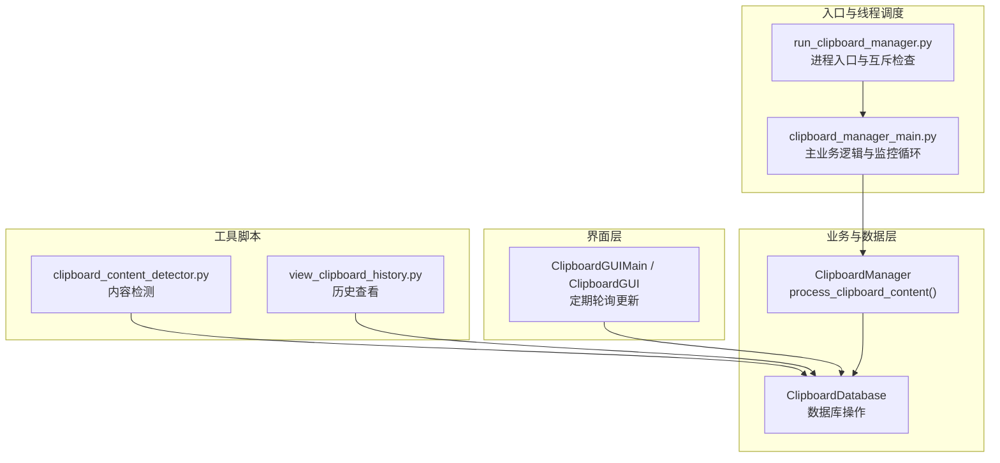
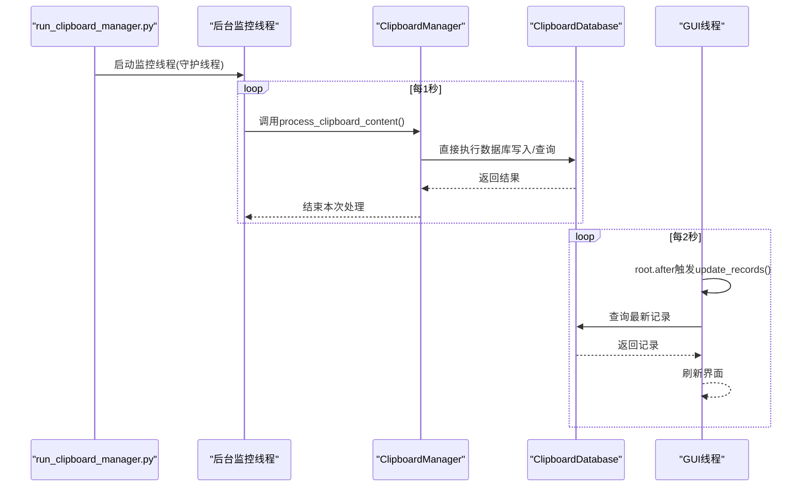
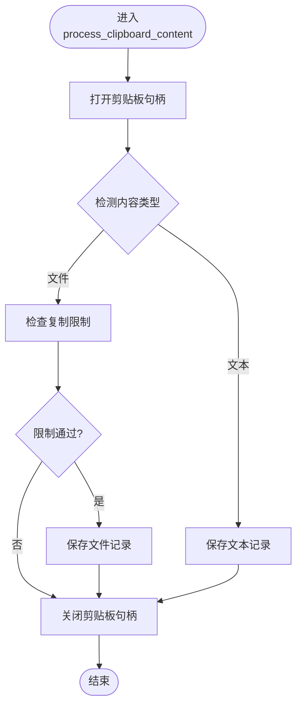
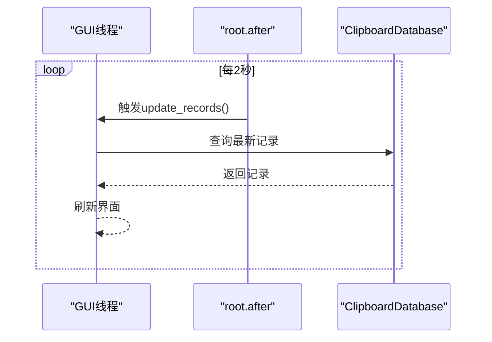
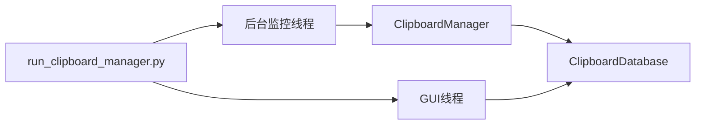
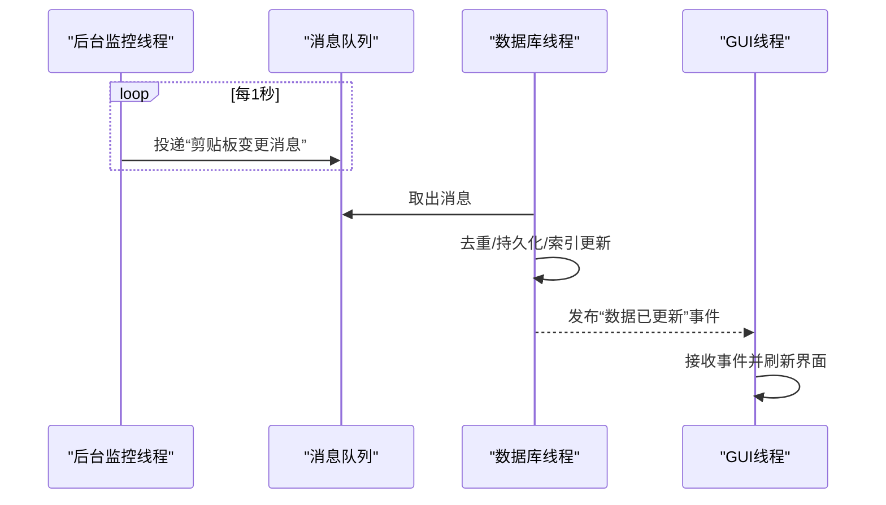

# 通信模式

<cite>
**本文引用的文件**
- [clipboard_manager_main.py](file://clipboard_manager_main.py)
- [clipboard_gui.py](file://clipboard_gui.py)
- [clipboard_db.py](file://clipboard_db.py)
- [run_clipboard_manager.py](file://run_clipboard_manager.py)
- [clipboard_content_detector.py](file://clipboard_content_detector.py)
- [view_clipboard_history.py](file://view_clipboard_history.py)
</cite>

## 目录
1. [简介](#简介)
2. [项目结构](#项目结构)
3. [核心组件](#核心组件)
4. [架构总览](#架构总览)
5. [详细组件分析](#详细组件分析)
6. [依赖关系分析](#依赖关系分析)
7. [性能考量](#性能考量)
8. [故障排查指南](#故障排查指南)
9. [结论](#结论)
10. [附录](#附录)

## 简介
本文件聚焦于copyhistory项目中“主线程与后台线程间的通信模式”。通过对ClipboardManager实例作为共享对象在两个线程间传递数据的设计进行深入分析，重点研究process_clipboard_content方法如何由后台线程直接调用并操作数据库，从而暴露当前实现中缺乏显式线程间通信机制的问题（例如未使用queue.Queue进行任务传递，导致监控线程直接执行数据库操作，增加了线程安全风险）。同时，本文还探讨GUI线程通过定期轮询（start_auto_update）被动获取数据更新的现状，并提出采用生产者-消费者模式的优化方案，通过队列解耦剪贴板监控、内容处理和数据库存储，提升系统的可维护性与线程安全性。

## 项目结构
项目采用“功能模块化+入口脚本”的组织方式：
- 入口脚本负责进程生命周期与线程调度
- 主业务逻辑集中在clipboard_manager_main.py中
- 数据库访问封装在clipboard_db.py中
- GUI界面在clipboard_gui.py中实现
- 其他辅助脚本提供独立功能（如内容检测、历史查看）

图表来源
- [run_clipboard_manager.py](file://run_clipboard_manager.py#L32-L71)
- [clipboard_manager_main.py](file://clipboard_manager_main.py#L355-L761)
- [clipboard_gui.py](file://clipboard_gui.py#L1676-L1696)
- [clipboard_db.py](file://clipboard_db.py#L13-L115)

章节来源
- [clipboard_manager_main.py](file://clipboard_manager_main.py#L355-L761)
- [clipboard_gui.py](file://clipboard_gui.py#L1676-L1696)
- [clipboard_db.py](file://clipboard_db.py#L13-L115)
- [run_clipboard_manager.py](file://run_clipboard_manager.py#L32-L71)
- [clipboard_content_detector.py](file://clipboard_content_detector.py#L218-L274)
- [view_clipboard_history.py](file://view_clipboard_history.py#L21-L75)

## 核心组件
- ClipboardManager：负责读取剪贴板、判断内容类型（文本/文件）、执行复制限制检查、调用数据库写入等。其process_clipboard_content()方法在后台线程中被周期性调用，直接操作数据库。
- ClipboardDatabase：封装SQLite数据库的初始化、增删改查、统计、设置管理等。
- ClipboardGUIMain / ClipboardGUI：提供GUI界面，使用root.after定时触发update_records，间接通过数据库接口刷新显示。
- run_clipboard_manager.py：进程入口，负责互斥检查、启动后台监控线程、运行GUI。

章节来源
- [clipboard_manager_main.py](file://clipboard_manager_main.py#L355-L761)
- [clipboard_db.py](file://clipboard_db.py#L13-L115)
- [clipboard_gui.py](file://clipboard_gui.py#L1676-L1696)
- [run_clipboard_manager.py](file://run_clipboard_manager.py#L32-L71)

## 架构总览
主线程与后台线程的交互如下：
- 后台线程：由run_clipboard_manager.py或clipboard_manager_main.py启动，周期性调用ClipboardManager.process_clipboard_content()，内部直接访问ClipboardDatabase进行读写。
- GUI线程：通过root.after每2秒触发一次update_records，后者调用数据库接口加载最新记录，实现被动更新。

图表来源
- [run_clipboard_manager.py](file://run_clipboard_manager.py#L47-L66)
- [clipboard_manager_main.py](file://clipboard_manager_main.py#L717-L759)
- [clipboard_gui.py](file://clipboard_gui.py#L1676-L1696)

## 详细组件分析

### ClipboardManager与process_clipboard_content
- 角色定位：作为共享对象，被后台线程直接调用，承担“剪贴板内容检测—内容处理—数据库写入”的职责。
- 线程安全问题：后台线程直接调用process_clipboard_content()，该方法内部会频繁打开/关闭剪贴板句柄、读取剪贴板内容、计算MD5、写入数据库。由于未通过队列解耦，存在以下风险：
  - 数据库连接在同一进程中可能被多线程并发访问，若未加锁，可能导致竞态条件或异常。
  - 剪贴板句柄的频繁Open/Close在多线程环境下可能引发异常。
  - 若GUI线程也在同一进程中直接访问数据库，可能与后台线程形成竞争。
- 改进建议：引入queue.Queue，将“剪贴板内容”作为消息投递至后台工作线程，由专门的数据库线程消费队列并执行持久化，避免跨线程共享可变状态。

图表来源
- [clipboard_manager_main.py](file://clipboard_manager_main.py#L395-L496)

章节来源
- [clipboard_manager_main.py](file://clipboard_manager_main.py#L395-L496)

### GUI线程的轮询机制
- GUI线程通过root.after(2000)周期性触发update_records，再调用数据库接口加载记录，实现被动更新。
- 优点：实现简单，无需复杂的事件通知机制。
- 缺点：轮询频率固定，可能造成不必要的数据库访问；当记录量增大时，查询开销上升；无法实现真正的事件驱动通知。

图表来源
- [clipboard_gui.py](file://clipboard_gui.py#L1676-L1696)

章节来源
- [clipboard_gui.py](file://clipboard_gui.py#L1676-L1696)

### 数据库层设计
- ClipboardDatabase封装了数据库初始化、文本/文件记录的增删改查、统计、设置管理等。
- 存在潜在问题：
  - 未使用连接池或线程安全的数据库访问策略，直接在不同线程中创建连接。
  - 未对数据库操作进行显式的同步控制，存在并发访问风险。

章节来源
- [clipboard_db.py](file://clipboard_db.py#L13-L115)
- [clipboard_db.py](file://clipboard_db.py#L116-L412)

### 入口与线程调度
- run_clipboard_manager.py负责进程互斥检查，启动后台监控线程，并运行GUI。
- clipboard_manager_main.py支持两种运行模式：仅监控模式与GUI模式；GUI模式下同样启动后台监控线程。

章节来源
- [run_clipboard_manager.py](file://run_clipboard_manager.py#L17-L71)
- [clipboard_manager_main.py](file://clipboard_manager_main.py#L731-L761)

## 依赖关系分析
- 线程依赖：后台监控线程依赖ClipboardManager；GUI线程依赖数据库接口。
- 组件耦合：ClipboardManager与ClipboardDatabase之间存在直接调用关系；GUI与数据库之间也存在直接调用关系。
- 外部依赖：win32clipboard/win32con用于剪贴板访问；sqlite3用于数据库访问；tkinter用于GUI。

图表来源
- [run_clipboard_manager.py](file://run_clipboard_manager.py#L47-L66)
- [clipboard_manager_main.py](file://clipboard_manager_main.py#L717-L759)
- [clipboard_gui.py](file://clipboard_gui.py#L1676-L1696)
- [clipboard_db.py](file://clipboard_db.py#L13-L115)

章节来源
- [run_clipboard_manager.py](file://run_clipboard_manager.py#L47-L66)
- [clipboard_manager_main.py](file://clipboard_manager_main.py#L717-L759)
- [clipboard_gui.py](file://clipboard_gui.py#L1676-L1696)
- [clipboard_db.py](file://clipboard_db.py#L13-L115)

## 性能考量
- 轮询频率：GUI线程每2秒查询一次数据库，若记录量增长，查询成本线性上升。建议：
  - 降低轮询频率或改为事件驱动更新。
  - 引入增量查询或游标式分页，减少一次性加载的数据量。
- 数据库访问：ClipboardDatabase在多线程中直接创建连接，建议：
  - 为每个线程维护独立连接或使用连接池。
  - 对热点查询建立合适的索引（如按时间戳、MD5等）。
- 剪贴板访问：频繁Open/Close剪贴板句柄可能带来额外开销，建议：
  - 在单次处理周期内尽量复用句柄，或在异常处理中确保句柄正确释放。

[本节为通用指导，不直接分析具体文件]

## 故障排查指南
- 剪贴板访问异常：process_clipboard_content在读取剪贴板时可能因句柄冲突或权限问题抛出异常。排查要点：
  - 确认剪贴板句柄的Open/Close配对调用。
  - 检查是否有其他进程正在占用剪贴板。
- 数据库并发异常：多线程同时访问数据库可能出现锁等待或异常。排查要点：
  - 检查是否存在未提交事务或长时间持有连接。
  - 关注数据库连接是否在异常路径正确关闭。
- GUI界面卡顿：轮询过于频繁或查询负载过大导致界面响应迟缓。排查要点：
  - 适当降低轮询频率或改为事件驱动。
  - 对查询结果进行分页或懒加载。

章节来源
- [clipboard_manager_main.py](file://clipboard_manager_main.py#L395-L496)
- [clipboard_db.py](file://clipboard_db.py#L116-L412)
- [clipboard_gui.py](file://clipboard_gui.py#L1676-L1696)

## 结论
当前实现中，ClipboardManager作为共享对象被后台线程直接调用，process_clipboard_content方法在后台线程中直接操作数据库，这导致：
- 缺少显式线程间通信机制（未使用queue.Queue），监控线程直接执行数据库操作，增加了线程安全风险；
- GUI线程通过定期轮询被动获取数据更新，而非事件驱动的主动通知，存在性能与实时性方面的不足。

建议采用生产者-消费者模式：
- 生产者：后台监控线程负责检测剪贴板变化，将“内容元数据”封装为消息投递到队列；
- 消费者：专用数据库线程从队列取出消息，执行去重、持久化、索引更新等；
- 通知机制：GUI线程通过事件或回调（如root.event_generate）接收更新信号，或继续采用低频轮询以降低数据库压力。

该方案可显著降低线程间共享状态的复杂度，提升系统的可维护性与线程安全性。

[本节为总结性内容，不直接分析具体文件]

## 附录

### 优化方案：生产者-消费者模式

图表来源
- [clipboard_manager_main.py](file://clipboard_manager_main.py#L717-L759)
- [clipboard_gui.py](file://clipboard_gui.py#L1676-L1696)

### 相关工具脚本
- clipboard_content_detector.py：提供剪贴板内容检测与格式识别能力，可用于丰富消息内容。
- view_clipboard_history.py：提供历史记录查看功能，便于开发调试与数据核验。

章节来源
- [clipboard_content_detector.py](file://clipboard_content_detector.py#L218-L274)
- [view_clipboard_history.py](file://view_clipboard_history.py#L21-L75)