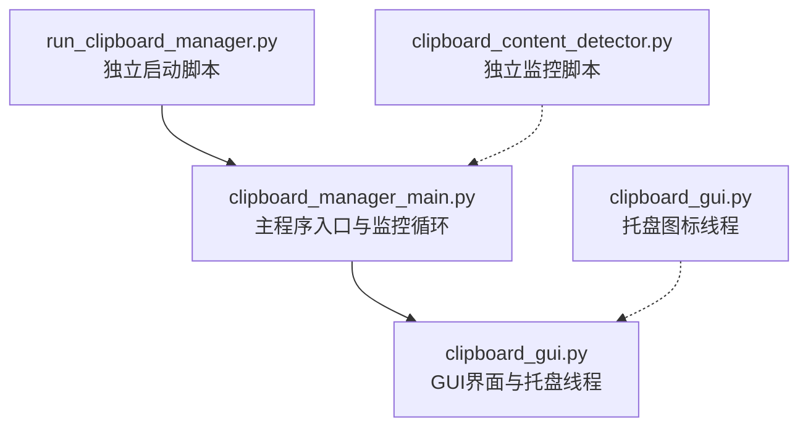
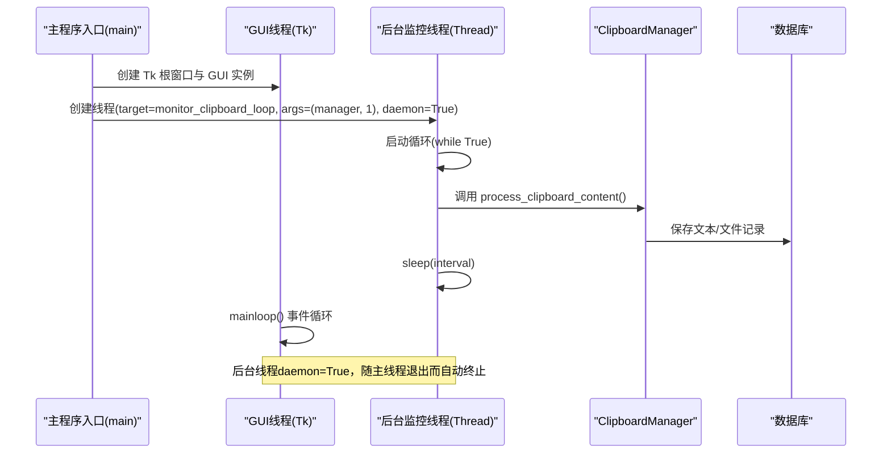
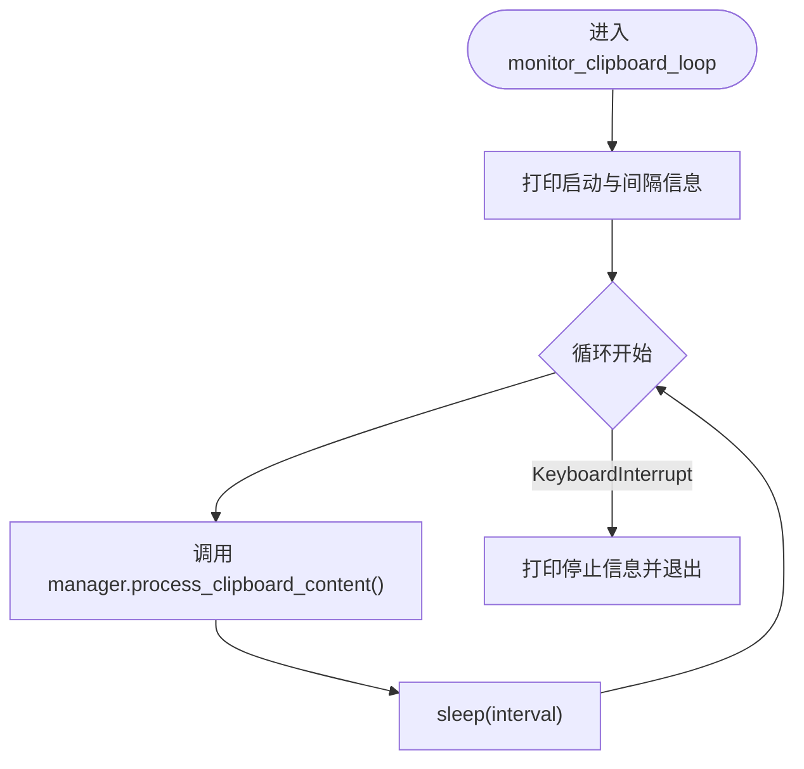
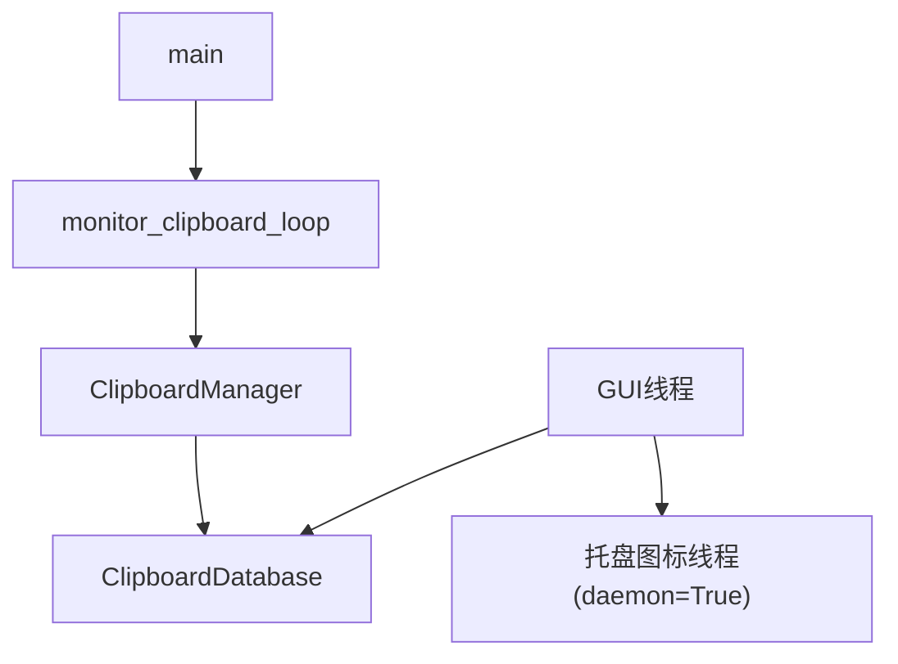

# 线程管理

<cite>
**本文引用的文件**
- [clipboard_manager_main.py](file://clipboard_manager_main.py)
- [run_clipboard_manager.py](file://run_clipboard_manager.py)
- [clipboard_gui.py](file://clipboard_gui.py)
- [clipboard_content_detector.py](file://clipboard_content_detector.py)
</cite>

## 目录
1. [简介](#简介)
2. [项目结构](#项目结构)
3. [核心组件](#核心组件)
4. [架构总览](#架构总览)
5. [详细组件分析](#详细组件分析)
6. [依赖分析](#依赖分析)
7. [性能考虑](#性能考虑)
8. [故障排查指南](#故障排查指南)
9. [结论](#结论)

## 简介
本章节聚焦于 copyhistory 的线程管理机制，重点解析在主程序入口中如何创建后台监控线程，包括：
- threading.Thread 的实例化过程
- target 参数指向 monitor_clipboard_loop 函数
- args 参数传递 ClipboardManager 实例与检测间隔
- daemon=True 属性的作用：后台线程随主线程结束而自动终止，避免程序无法退出
- 线程启动流程（start() 方法调用）与生命周期管理
- 主线程（GUI 线程）与后台线程的协作关系
- 并行处理剪贴板监控与 GUI 响应的设计思路与实践

## 项目结构
围绕线程管理的相关文件与职责如下：
- clipboard_manager_main.py：主程序入口，包含 monitor_clipboard_loop 监控循环与 main 入口；在 GUI 模式下创建后台监控线程
- run_clipboard_manager.py：独立启动脚本，同时运行监控器与 GUI 界面，同样创建后台监控线程
- clipboard_gui.py：GUI 界面类，负责 UI 响应与托盘图标线程（daemon=True）
- clipboard_content_detector.py：剪贴板内容检测器（独立脚本），提供 monitor_clipboard 循环实现

图表来源
- [clipboard_manager_main.py](file://clipboard_manager_main.py#L717-L761)
- [run_clipboard_manager.py](file://run_clipboard_manager.py#L32-L71)
- [clipboard_gui.py](file://clipboard_gui.py#L144-L171)

章节来源
- [clipboard_manager_main.py](file://clipboard_manager_main.py#L717-L761)
- [run_clipboard_manager.py](file://run_clipboard_manager.py#L32-L71)
- [clipboard_gui.py](file://clipboard_gui.py#L144-L171)

## 核心组件
- 后台监控线程（daemon=True）：由 main 函数在 GUI 模式下创建，目标函数为 monitor_clipboard_loop，周期性调用 ClipboardManager 的内容处理逻辑
- GUI 线程：主线程负责 Tkinter GUI 的事件循环（root.mainloop）
- 托盘图标线程（daemon=True）：在 GUI 中创建，用于系统托盘图标运行
- 独立监控脚本线程：run_clipboard_manager.py 中创建后台监控线程，配合 GUI 界面

章节来源
- [clipboard_manager_main.py](file://clipboard_manager_main.py#L717-L761)
- [run_clipboard_manager.py](file://run_clipboard_manager.py#L32-L71)
- [clipboard_gui.py](file://clipboard_gui.py#L144-L171)

## 架构总览
下图展示了主线程与后台监控线程的协作关系，以及 GUI 与托盘线程的关系。

图表来源
- [clipboard_manager_main.py](file://clipboard_manager_main.py#L731-L761)
- [clipboard_manager_main.py](file://clipboard_manager_main.py#L717-L730)

## 详细组件分析

### 后台监控线程创建与启动流程
- 实例化：在 GUI 模式下，通过 threading.Thread(target=..., args=(manager, 1), daemon=True) 创建后台监控线程
- 目标函数：target 指向 monitor_clipboard_loop，该函数内部维护循环，周期性调用 ClipboardManager 的内容处理逻辑
- 参数传递：args=(manager, 1) 将 ClipboardManager 实例与检测间隔传入监控循环
- 启动：调用 start() 方法启动线程
- daemon=True：后台线程随主线程（GUI）退出而自动终止，避免程序无法退出

关键代码片段路径
- [后台监控线程创建与启动](file://clipboard_manager_main.py#L753-L758)
- [监控循环实现](file://clipboard_manager_main.py#L717-L730)

章节来源
- [clipboard_manager_main.py](file://clipboard_manager_main.py#L717-L761)

### monitor_clipboard_loop 的工作流
- 初始化输出：打印“剪贴板监控已启动”、“检测间隔”等提示
- 循环控制：while True，每次循环调用 manager.process_clipboard_content()
- 休眠：time.sleep(interval)，实现周期性检测
- 异常处理：捕获 KeyboardInterrupt，优雅退出

图表来源
- [clipboard_manager_main.py](file://clipboard_manager_main.py#L717-L730)

章节来源
- [clipboard_manager_main.py](file://clipboard_manager_main.py#L717-L730)

### ClipboardManager 的内容处理逻辑
- 打开剪贴板：OpenClipboard
- 判断内容类型：优先检测文件列表（CF_HDROP），其次检测文本（CF_UNICODETEXT）
- 文件处理：校验复制限制、计算 MD5、分类保存、写入数据库
- 文本处理：校验大小限制、写入数据库
- 关闭剪贴板：CloseClipboard（finally 确保释放）

关键代码片段路径
- [ClipboardManager.process_clipboard_content](file://clipboard_manager_main.py#L395-L496)

章节来源
- [clipboard_manager_main.py](file://clipboard_manager_main.py#L395-L496)

### GUI 线程与后台线程的协作
- GUI 线程：负责 Tkinter 界面事件循环（root.mainloop），保证 UI 响应
- 后台监控线程：daemon=True，持续执行剪贴板检测与数据持久化，不影响 GUI 响应
- 协作要点：两者并行运行，后台线程不阻塞 GUI；当 GUI 退出时，后台线程自动终止

关键代码片段路径
- [GUI 启动与后台线程创建](file://clipboard_manager_main.py#L749-L758)

章节来源
- [clipboard_manager_main.py](file://clipboard_manager_main.py#L749-L758)

### 独立启动脚本中的线程管理
- run_clipboard_manager.py 同样采用后台监控线程（daemon=True），并默认隐藏主窗口，通过系统托盘图标提供交互入口
- 托盘图标线程：daemon=True，独立运行托盘图标

关键代码片段路径
- [独立启动脚本中的后台监控线程](file://run_clipboard_manager.py#L50-L53)
- [托盘图标线程](file://clipboard_gui.py#L166-L168)

章节来源
- [run_clipboard_manager.py](file://run_clipboard_manager.py#L32-L71)
- [clipboard_gui.py](file://clipboard_gui.py#L144-L171)

### 独立监控脚本（概念性说明）
- clipboard_content_detector.py 提供 monitor_clipboard 循环实现，用于独立运行的监控脚本
- 与主程序的 monitor_clipboard_loop 功能类似，但面向独立脚本场景

关键代码片段路径
- [独立监控脚本循环](file://clipboard_content_detector.py#L218-L273)

章节来源
- [clipboard_content_detector.py](file://clipboard_content_detector.py#L218-L273)

## 依赖分析
- 主程序依赖关系
  - main 函数依赖 monitor_clipboard_loop 与 ClipboardManager
  - monitor_clipboard_loop 依赖 ClipboardManager 的内容处理方法
  - ClipboardManager 依赖 ClipboardDatabase 进行数据持久化
- GUI 依赖关系
  - GUI 线程依赖 ClipboardDatabase 进行记录查询与统计
  - GUI 线程创建托盘图标线程（daemon=True）

图表来源
- [clipboard_manager_main.py](file://clipboard_manager_main.py#L717-L761)
- [clipboard_gui.py](file://clipboard_gui.py#L144-L171)

章节来源
- [clipboard_manager_main.py](file://clipboard_manager_main.py#L717-L761)
- [clipboard_gui.py](file://clipboard_gui.py#L144-L171)

## 性能考虑
- 检测间隔：默认 1 秒，可根据系统负载与需求调整（通过命令行参数传入）
- 数据库写入：采用 SQLite，注意在高并发写入场景下的性能影响；可通过批量写入策略优化（本项目未实现批量写入）
- GUI 响应：daemon=True 的后台线程不会阻塞 GUI，但频繁的磁盘 IO 仍可能影响 UI 流畅度
- 文件 MD5 计算：对大文件计算 MD5 有一定开销，建议在必要时进行缓存或去重

## 故障排查指南
- 程序无法退出
  - 症状：关闭 GUI 后进程未退出
  - 原因：后台线程未设置 daemon=True 或未正确启动
  - 处理：确认线程创建处 daemon=True，确保 start() 已调用
  - 参考路径：[后台监控线程创建](file://clipboard_manager_main.py#L753-L758)、[托盘图标线程创建](file://clipboard_gui.py#L166-L168)
- 剪贴板访问异常
  - 症状：读取剪贴板时报错
  - 原因：OpenClipboard/CloseClipboard 异常或被其他进程占用
  - 处理：确保 finally 中关闭剪贴板；避免长时间持有剪贴板句柄
  - 参考路径：[ClipboardManager.process_clipboard_content](file://clipboard_manager_main.py#L395-L496)
- 监控循环未生效
  - 症状：剪贴板变化未被检测
  - 原因：线程未启动、间隔过大、异常中断
  - 处理：确认 start() 调用、检查 KeyboardInterrupt 处理、适当降低检测间隔
  - 参考路径：[monitor_clipboard_loop](file://clipboard_manager_main.py#L717-L730)

章节来源
- [clipboard_manager_main.py](file://clipboard_manager_main.py#L717-L761)
- [clipboard_gui.py](file://clipboard_gui.py#L144-L171)
- [clipboard_manager_main.py](file://clipboard_manager_main.py#L395-L496)

## 结论
copyhistory 的线程管理采用“主线程（GUI）+ 后台监控线程”的设计，通过 daemon=True 确保后台线程随 GUI 退出而自动终止，从而避免程序无法退出的问题。主线程专注于 GUI 响应，后台线程负责周期性监控剪贴板并进行数据持久化，二者并行运行，实现剪贴板监控与 GUI 响应的解耦与高效协作。独立启动脚本与 GUI 托盘也采用相同的线程模型，保证了统一的行为与体验。