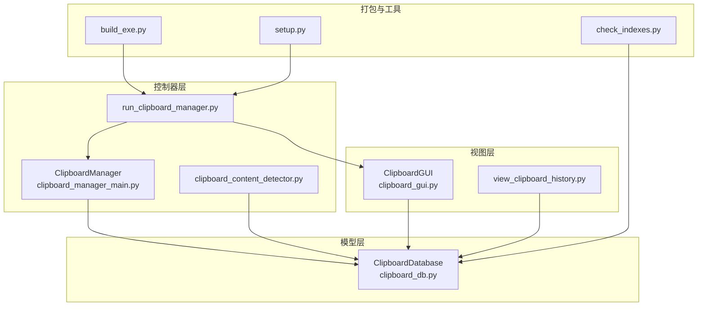
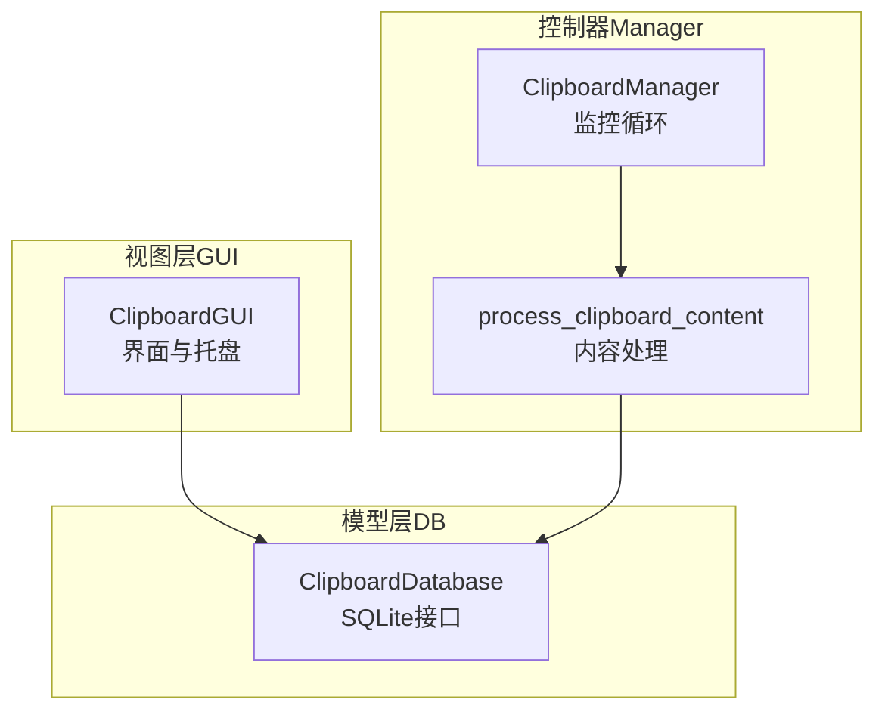
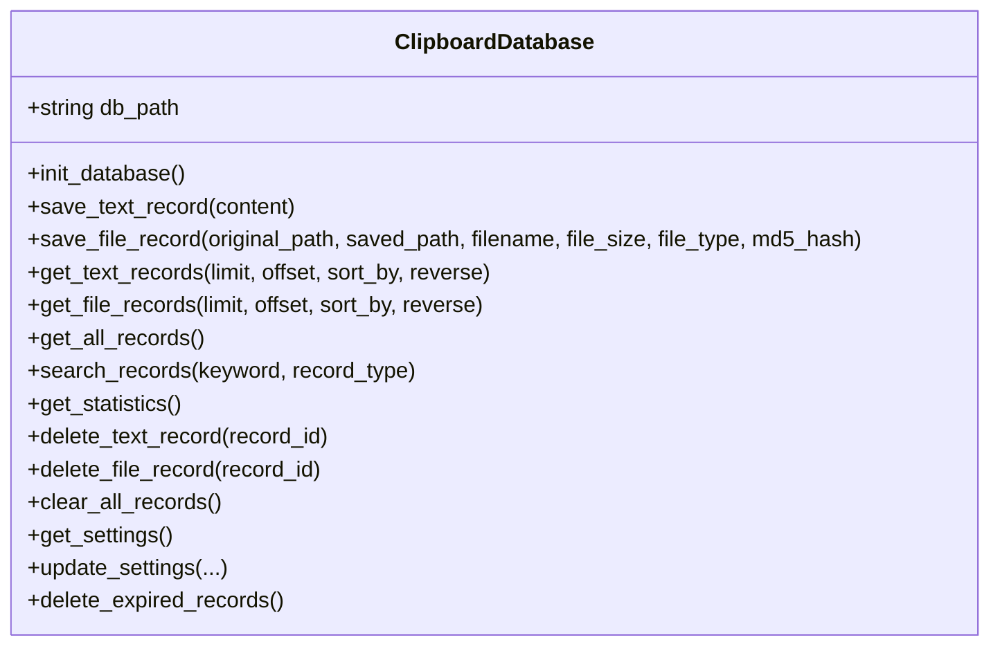
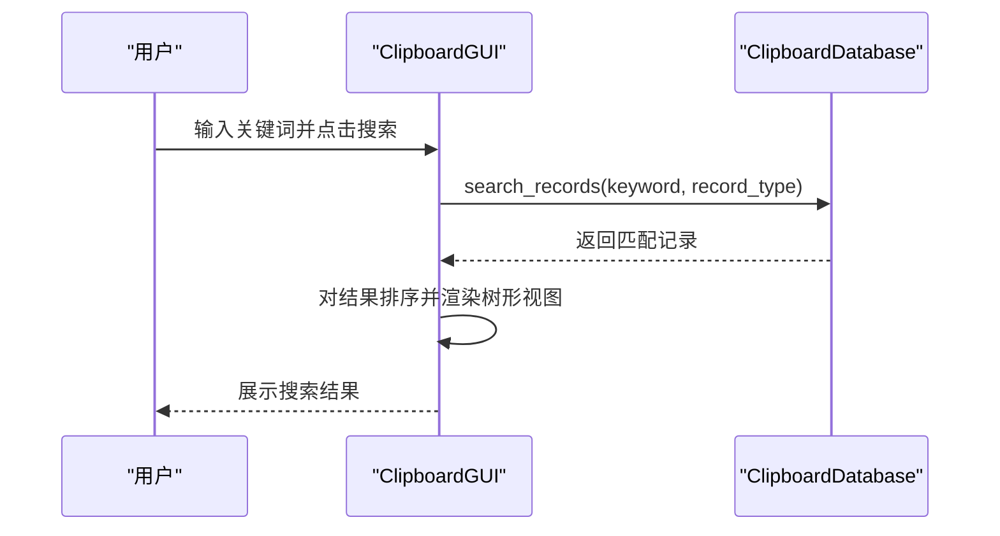
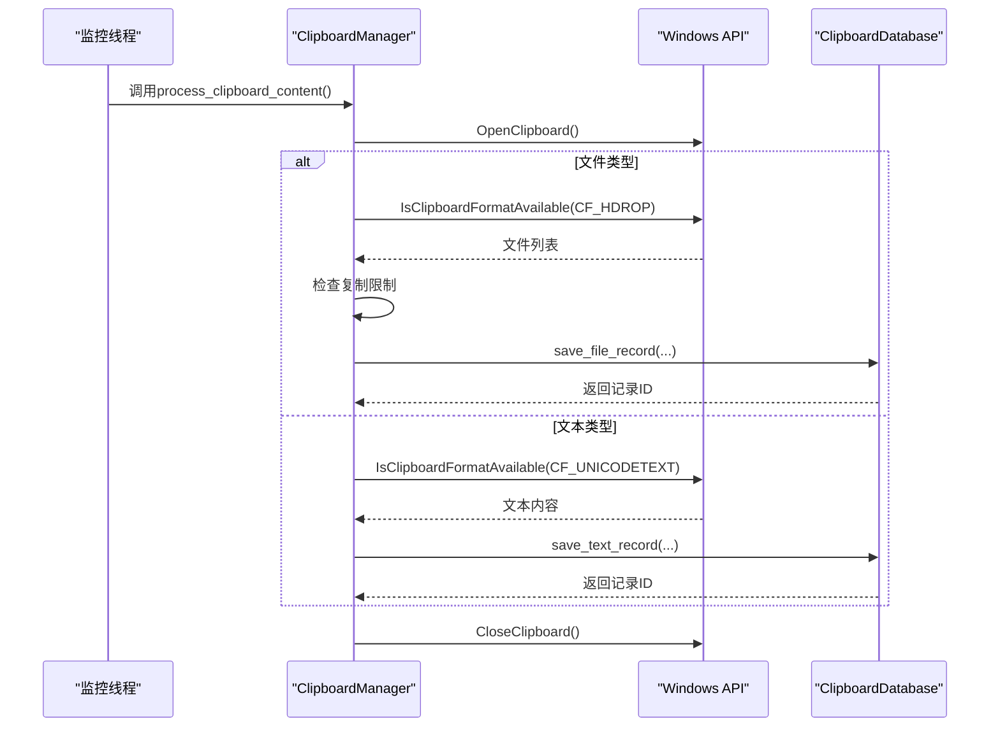
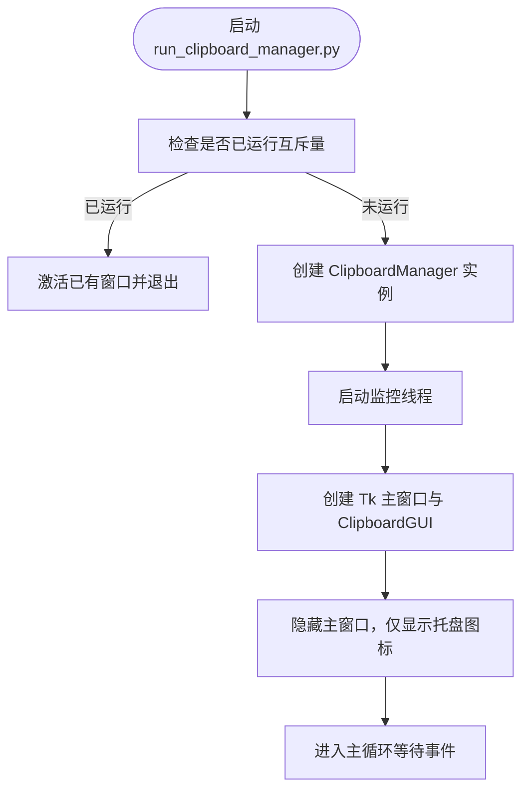
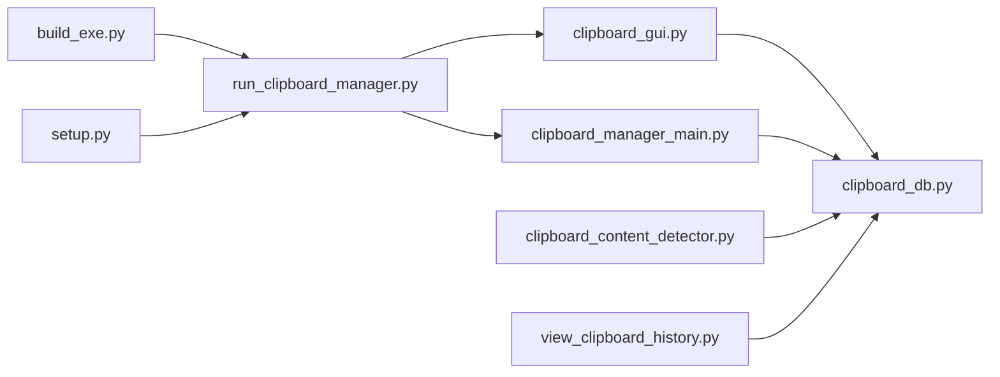

# 技术架构

<cite>
**本文引用的文件**
- [clipboard_db.py](file://clipboard_db.py)
- [clipboard_gui.py](file://clipboard_gui.py)
- [clipboard_manager_main.py](file://clipboard_manager_main.py)
- [run_clipboard_manager.py](file://run_clipboard_manager.py)
- [clipboard_content_detector.py](file://clipboard_content_detector.py)
- [view_clipboard_history.py](file://view_clipboard_history.py)
- [build_exe.py](file://build_exe.py)
- [setup.py](file://setup.py)
- [check_indexes.py](file://check_indexes.py)
</cite>

## 目录
1. [简介](#简介)
2. [项目结构](#项目结构)
3. [核心组件](#核心组件)
4. [架构总览](#架构总览)
5. [详细组件分析](#详细组件分析)
6. [依赖关系分析](#依赖关系分析)
7. [性能与并发特性](#性能与并发特性)
8. [故障排查指南](#故障排查指南)
9. [结论](#结论)
10. [附录](#附录)

## 简介
本项目采用MVC架构设计，围绕“剪贴板历史记录”这一目标，将数据持久化、界面展示与业务逻辑分离：
- ClipboardDatabase（模型层）：封装SQLite数据库操作，提供统一的数据访问接口。
- ClipboardGUI（视图层）：基于tkinter构建图形界面，并通过pystray实现系统托盘交互。
- ClipboardManager（控制器层）：负责剪贴板监控循环、内容识别与业务规则执行，并协调数据库与GUI之间的数据流转。

系统通过独立的监控线程持续扫描剪贴板，避免阻塞GUI主线程；GUI通过数据库接口查询与展示历史记录，并支持搜索、排序、统计等操作。打包脚本支持Windows平台的可执行文件发布。

## 项目结构
项目采用按职责分层的文件组织方式，核心文件如下：
- 数据模型层：clipboard_db.py
- 视图层：clipboard_gui.py
- 控制器与主流程：clipboard_manager_main.py、run_clipboard_manager.py
- 剪贴板内容检测工具：clipboard_content_detector.py
- 历史记录查看器：view_clipboard_history.py
- 打包配置：build_exe.py、setup.py
- 数据库辅助：check_indexes.py

图表来源
- [clipboard_db.py](file://clipboard_db.py#L1-L120)
- [clipboard_gui.py](file://clipboard_gui.py#L1-L120)
- [clipboard_manager_main.py](file://clipboard_manager_main.py#L355-L520)
- [run_clipboard_manager.py](file://run_clipboard_manager.py#L1-L71)
- [clipboard_content_detector.py](file://clipboard_content_detector.py#L1-L60)
- [view_clipboard_history.py](file://view_clipboard_history.py#L1-L40)
- [build_exe.py](file://build_exe.py#L1-L81)
- [setup.py](file://setup.py#L1-L84)
- [check_indexes.py](file://check_indexes.py#L1-L27)

章节来源
- [clipboard_db.py](file://clipboard_db.py#L1-L120)
- [clipboard_gui.py](file://clipboard_gui.py#L1-L120)
- [clipboard_manager_main.py](file://clipboard_manager_main.py#L355-L520)
- [run_clipboard_manager.py](file://run_clipboard_manager.py#L1-L71)
- [clipboard_content_detector.py](file://clipboard_content_detector.py#L1-L60)
- [view_clipboard_history.py](file://view_clipboard_history.py#L1-L40)
- [build_exe.py](file://build_exe.py#L1-L81)
- [setup.py](file://setup.py#L1-L84)
- [check_indexes.py](file://check_indexes.py#L1-L27)

## 核心组件
- ClipboardDatabase（模型层）
  - 负责数据库初始化、表结构维护、增删改查、统计与清理、设置管理。
  - 支持文本与文件两类记录，具备去重与计数机制（基于md5_hash与number字段）。
  - 提供搜索、统计、过期清理等能力。
- ClipboardGUI（视图层）
  - 基于tkinter构建主界面，包含笔记本、树形视图、滚动条、按钮与菜单。
  - 支持搜索、排序、统计、设置编辑、悬浮图标与系统托盘。
  - 通过数据库接口加载与刷新数据，响应用户操作。
- ClipboardManager（控制器层）
  - 基于Windows API监控剪贴板变化，区分文本与文件类型，执行复制限制检查。
  - 将内容持久化到数据库，避免重复保存。
  - 与GUI通过数据库接口进行数据交互，支持独立监控模式与GUI模式。

章节来源
- [clipboard_db.py](file://clipboard_db.py#L116-L455)
- [clipboard_gui.py](file://clipboard_gui.py#L1-L220)
- [clipboard_manager_main.py](file://clipboard_manager_main.py#L355-L761)

## 架构总览
系统采用MVC分层与多线程监控的设计：
- 视图层与控制器通过模型层进行数据访问，形成清晰的单向依赖。
- 控制器在独立线程中运行剪贴板监控循环，避免阻塞GUI。
- GUI通过定时任务或用户触发调用数据库接口，实现数据刷新与展示。

图表来源
- [clipboard_gui.py](file://clipboard_gui.py#L1-L120)
- [clipboard_manager_main.py](file://clipboard_manager_main.py#L355-L520)
- [clipboard_db.py](file://clipboard_db.py#L116-L220)

## 详细组件分析

### 数据模型层：ClipboardDatabase
- 表结构与字段
  - 文本记录表：包含内容、时间戳、字符数、md5哈希、重复计数等字段。
  - 文件记录表：包含原路径、保存路径、文件名、大小、类型、md5哈希、时间戳、重复计数等字段。
  - 设置表：包含复制大小限制、数量限制、无限模式、保留天数、开机自启、悬浮图标等配置项。
- 关键方法
  - 初始化与迁移：自动创建表与索引，保证字段兼容性。
  - 保存与去重：基于md5_hash进行唯一性约束，重复时更新时间戳与计数。
  - 查询与搜索：支持分页、排序、全文检索、联合查询等。
  - 统计与清理：统计文本/文件数量与总大小，按保留天数清理过期记录。
- 设计要点
  - 使用本地时间而非UTC，便于用户阅读。
  - number字段用于去重计数，提升用户体验。
  - 独立的设置表支持灵活配置。

图表来源
- [clipboard_db.py](file://clipboard_db.py#L1-L120)
- [clipboard_db.py](file://clipboard_db.py#L116-L455)

章节来源
- [clipboard_db.py](file://clipboard_db.py#L1-L120)
- [clipboard_db.py](file://clipboard_db.py#L116-L455)

### 视图层：ClipboardGUI
- 功能特性
  - 主界面：搜索、刷新、笔记本（记录/统计/设置）、树形视图、滚动条、按钮与菜单。
  - 悬浮图标与系统托盘：支持托盘图标创建、菜单项（显示界面/退出），托盘线程安全运行。
  - 设置管理：复制限制、保留策略、开机自启、悬浮图标开关等。
  - 统计展示：实时统计文本/文件数量与总大小。
- 交互流程
  - 用户操作（搜索/排序/设置）触发数据库查询与界面刷新。
  - 双击记录弹窗显示完整内容；文件记录支持打开所在位置。
  - 定时任务驱动界面自动刷新，避免频繁手动刷新。

图表来源
- [clipboard_gui.py](file://clipboard_gui.py#L652-L748)
- [clipboard_db.py](file://clipboard_db.py#L281-L314)

章节来源
- [clipboard_gui.py](file://clipboard_gui.py#L1-L220)
- [clipboard_gui.py](file://clipboard_gui.py#L652-L748)
- [clipboard_db.py](file://clipboard_db.py#L281-L314)

### 控制器层：ClipboardManager
- 剪贴板监控
  - 使用Windows API检测剪贴板变化，区分文本与文件类型。
  - 对文件复制进行数量与大小限制检查，避免超出阈值。
  - 生成文件保存路径与唯一文件名，避免重复拷贝。
- 数据持久化
  - 文本：计算md5，去重并更新计数。
  - 文件：计算md5，分类保存至日期/类型子目录，记录元数据。
- 线程模型
  - 监控循环在独立线程中运行，周期性调用内容处理函数。
  - GUI主线程负责界面渲染，二者通过数据库接口解耦。

图表来源
- [clipboard_manager_main.py](file://clipboard_manager_main.py#L355-L520)
- [clipboard_manager_main.py](file://clipboard_manager_main.py#L717-L761)

章节来源
- [clipboard_manager_main.py](file://clipboard_manager_main.py#L355-L520)
- [clipboard_manager_main.py](file://clipboard_manager_main.py#L717-L761)

### 启动与运行：run_clipboard_manager.py
- 单例运行：通过Windows互斥量确保同一时刻只有一个实例运行。
- 后台监控：在独立线程中启动剪贴板监控循环。
- GUI隐藏：默认隐藏主窗口，仅显示系统托盘图标，用户可通过托盘或快捷键唤起界面。

图表来源
- [run_clipboard_manager.py](file://run_clipboard_manager.py#L1-L71)

章节来源
- [run_clipboard_manager.py](file://run_clipboard_manager.py#L1-L71)

### 剪贴板内容检测：clipboard_content_detector.py
- 通用检测器：提供更完整的格式枚举与内容提取能力，适合调试与诊断。
- 与控制器互补：可独立运行，输出剪贴板内容摘要与格式信息。

章节来源
- [clipboard_content_detector.py](file://clipboard_content_detector.py#L1-L120)
- [clipboard_content_detector.py](file://clipboard_content_detector.py#L218-L274)

### 历史记录查看器：view_clipboard_history.py
- 控制台版本：快速查看最近文本与文件记录，统计总数与类型分布。
- 与模型层直接交互，便于离线查看与运维。

章节来源
- [view_clipboard_history.py](file://view_clipboard_history.py#L1-L75)

## 依赖关系分析
- 组件耦合
  - 视图层与控制器均依赖模型层（ClipboardDatabase）。
  - 控制器与视图之间通过数据库接口解耦，降低直接耦合。
- 外部依赖
  - Windows API：剪贴板监控依赖win32clipboard/win32con。
  - GUI框架：tkinter用于界面构建。
  - 托盘：pystray与Pillow用于系统托盘图标与图像处理。
  - 打包：cx_Freeze用于Windows可执行文件打包。
- 循环依赖
  - 未发现循环导入；模块间通过接口调用，职责清晰。

图表来源
- [clipboard_gui.py](file://clipboard_gui.py#L1-L120)
- [clipboard_db.py](file://clipboard_db.py#L1-L120)
- [clipboard_manager_main.py](file://clipboard_manager_main.py#L355-L520)
- [run_clipboard_manager.py](file://run_clipboard_manager.py#L1-L71)
- [view_clipboard_history.py](file://view_clipboard_history.py#L1-L40)
- [build_exe.py](file://build_exe.py#L1-L81)
- [setup.py](file://setup.py#L1-L84)

章节来源
- [clipboard_gui.py](file://clipboard_gui.py#L1-L120)
- [clipboard_db.py](file://clipboard_db.py#L1-L120)
- [clipboard_manager_main.py](file://clipboard_manager_main.py#L355-L520)
- [run_clipboard_manager.py](file://run_clipboard_manager.py#L1-L71)
- [view_clipboard_history.py](file://view_clipboard_history.py#L1-L40)
- [build_exe.py](file://build_exe.py#L1-L81)
- [setup.py](file://setup.py#L1-L84)

## 性能与并发特性
- 多线程设计
  - 监控线程与GUI主线程分离，避免阻塞界面响应。
  - 托盘图标在独立线程中运行，确保托盘菜单与事件处理流畅。
- 数据库访问
  - 每次数据库操作建立连接、执行后关闭，避免长连接占用。
  - 查询接口支持分页与排序，减少一次性加载大量数据。
- 剪贴板监控
  - 固定周期轮询，避免频繁IO与系统调用。
  - 通过previous_content_key避免重复处理相同内容。
- 并发安全考量
  - 当前实现未显式加锁；监控线程与GUI线程共享数据库连接，可能引发竞态。
  - 建议在数据库访问处引入轻量级锁或使用事务，确保同一时间只有一个写操作。
  - 对于托盘线程与GUI线程的共享状态（如用户操作标记），应使用线程安全的数据结构或队列进行通信。

章节来源
- [clipboard_manager_main.py](file://clipboard_manager_main.py#L717-L761)
- [clipboard_gui.py](file://clipboard_gui.py#L144-L171)
- [clipboard_db.py](file://clipboard_db.py#L116-L220)

## 故障排查指南
- 剪贴板监控无法启动
  - 检查Windows API依赖是否可用（win32clipboard/win32con）。
  - 确认互斥量检查逻辑未阻止实例启动。
- 托盘图标不可用
  - 安装pystray与Pillow依赖；确认图标资源路径正确。
- 数据库异常
  - 检查数据库文件是否存在与权限是否足够。
  - 使用check_indexes.py验证索引是否创建成功。
- 打包失败
  - 确认cx_Freeze安装与配置正确，包含必要的包与模块。
  - 检查图标与数据库文件是否包含在打包清单中。

章节来源
- [run_clipboard_manager.py](file://run_clipboard_manager.py#L1-L71)
- [clipboard_gui.py](file://clipboard_gui.py#L144-L171)
- [check_indexes.py](file://check_indexes.py#L1-L27)
- [build_exe.py](file://build_exe.py#L1-L81)
- [setup.py](file://setup.py#L1-L84)

## 结论
本项目通过MVC架构实现了剪贴板历史记录的采集、存储与展示，具备良好的模块化与可维护性。模型层提供稳定的SQLite接口，视图层以tkinter构建直观界面并集成系统托盘，控制器层负责剪贴板监控与业务规则执行。当前实现偏向Windows平台（依赖win32clipboard），但整体架构具备扩展潜力，可在保持MVC分层的前提下引入跨平台适配与云同步能力。

## 附录

### 为什么选择tkinter而非其他GUI框架
- 轻量与内置：tkinter为Python标准库，无需额外依赖，部署简单。
- 跨平台：在Windows/Linux/macOS上均可运行，满足基本界面需求。
- 与系统托盘结合：配合pystray实现托盘图标与菜单，满足后台运行场景。
- 与项目目标契合：本项目以实用为主，不需要复杂的UI特效，tkinter足以胜任。

### 为什么选择pystray实现系统托盘
- 易用性：pystray提供简洁的API，快速创建托盘图标与菜单。
- 线程安全：托盘图标在独立线程中运行，避免阻塞GUI主线程。
- 资源友好：托盘图标体积小、内存占用低，适合后台常驻应用。

### 多线程设计中的安全性建议
- 引入锁：在数据库写操作处使用轻量级锁，避免并发写冲突。
- 事件队列：将GUI与监控线程之间的状态变更通过线程安全队列传递。
- 事务化：对批量写入使用事务，确保原子性与一致性。
- 异常隔离：监控线程捕获异常并记录日志，不影响GUI主线程稳定性。

### 可扩展性与平台锁定问题
- 平台锁定：当前依赖win32clipboard/win32con，限制在Windows平台。
- 跨平台方案：可抽象剪贴板接口，针对不同平台提供实现（如Linux使用X11或Wayland，macOS使用NSPasteboard）。
- 云同步：可在模型层引入远程同步接口，将本地数据库与云端服务对接，实现跨设备历史同步。
- 配置中心：将设置集中管理，支持远程下发与版本控制。