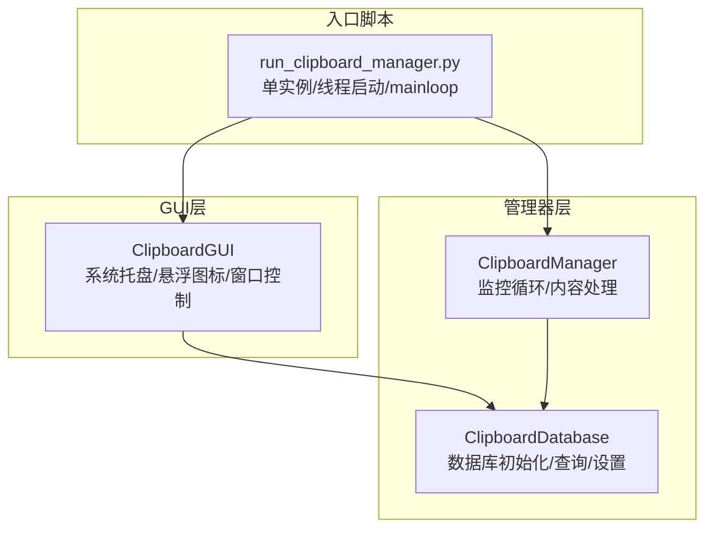
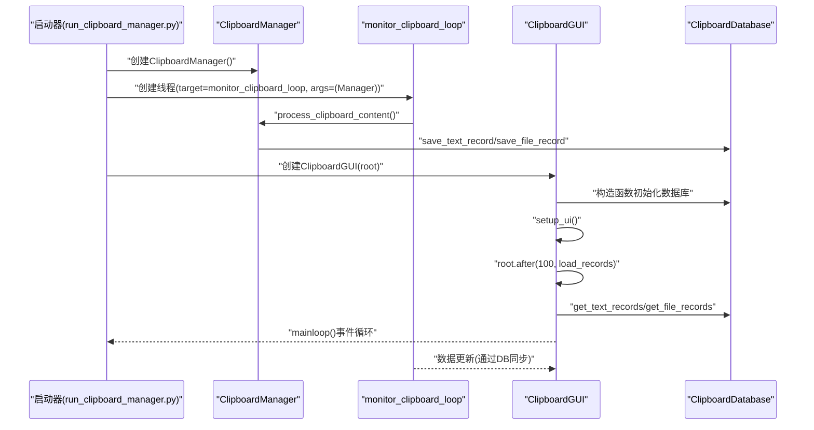
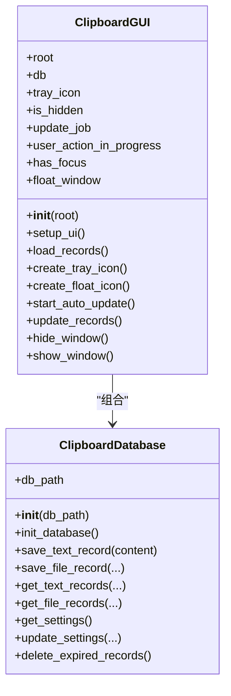
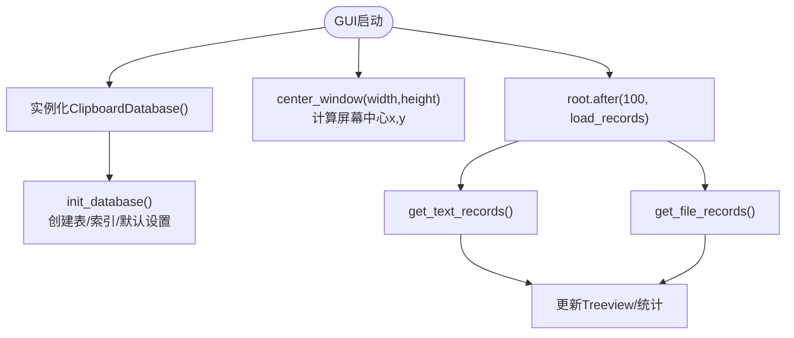
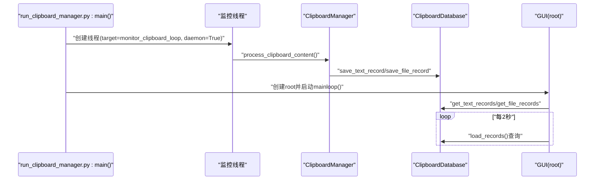
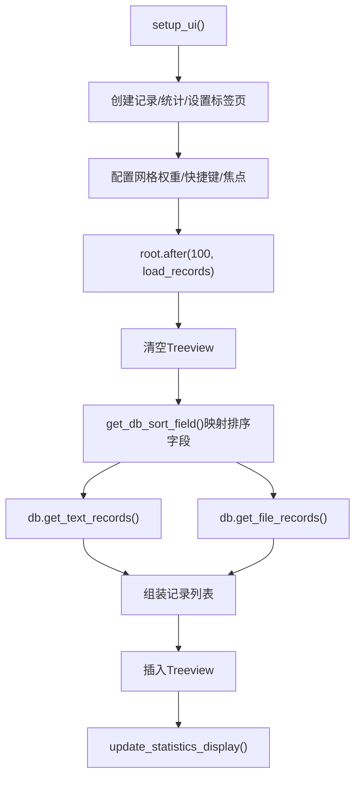
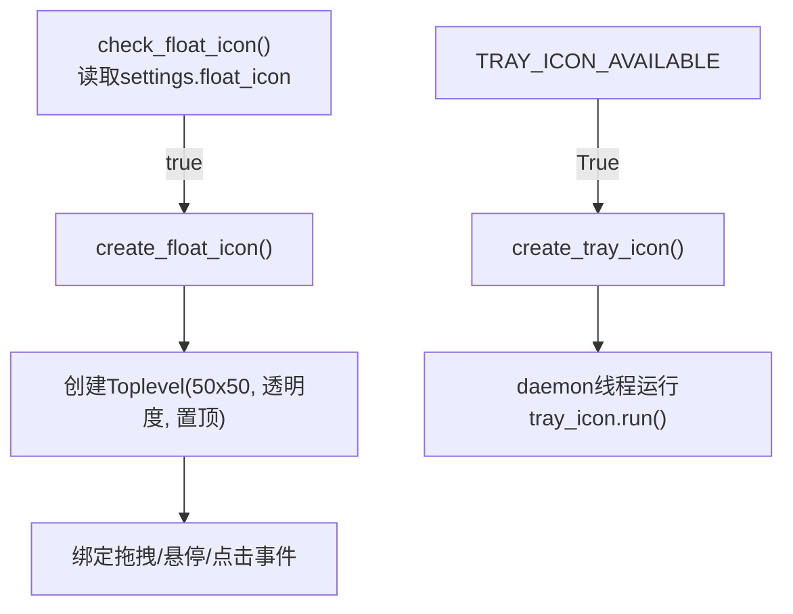
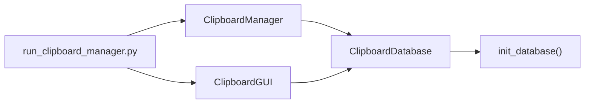

# GUI与管理器初始化通信

<cite>
**本文引用的文件**
- [clipboard_gui.py](file://clipboard_gui.py)
- [clipboard_manager_main.py](file://clipboard_manager_main.py)
- [clipboard_db.py](file://clipboard_db.py)
- [run_clipboard_manager.py](file://run_clipboard_manager.py)
</cite>

## 目录
1. [简介](#简介)
2. [项目结构](#项目结构)
3. [核心组件](#核心组件)
4. [架构总览](#架构总览)
5. [详细组件分析](#详细组件分析)
6. [依赖关系分析](#依赖关系分析)
7. [性能考量](#性能考量)
8. [故障排查指南](#故障排查指南)
9. [结论](#结论)

## 简介
本文聚焦于GUI初始化过程中ClipboardManager实例的创建与通信机制，详细说明ClipboardGUI类在__init__中如何实例化ClipboardDatabase并初始化系统托盘、悬浮图标等组件；解析setup_ui与load_records如何协调数据加载流程；阐述GUI启动时如何触发monitor_clipboard_loop监控线程的创建与启动，包括线程守护设置与事件循环集成；并提供从GUI启动到管理器监控线程运行的完整调用链，涵盖资源路径处理、窗口居中算法与数据库连接初始化等关键步骤。

## 项目结构
- clipboard_gui.py：GUI界面与交互逻辑，负责系统托盘、悬浮图标、窗口生命周期、数据加载与显示。
- clipboard_manager_main.py：剪贴板监控与管理器实现，包含ClipboardManager、ClipboardDatabase以及监控循环。
- clipboard_db.py：独立的数据库模块（兼容旧版本），提供数据库初始化、记录查询与设置管理。
- run_clipboard_manager.py：启动脚本，负责单实例控制、监控线程与GUI主线程的集成。

图表来源
- [clipboard_gui.py](file://clipboard_gui.py#L37-L79)
- [clipboard_manager_main.py](file://clipboard_manager_main.py#L355-L506)
- [clipboard_db.py](file://clipboard_db.py#L13-L115)
- [run_clipboard_manager.py](file://run_clipboard_manager.py#L32-L71)

章节来源
- [clipboard_gui.py](file://clipboard_gui.py#L37-L79)
- [clipboard_manager_main.py](file://clipboard_manager_main.py#L355-L506)
- [clipboard_db.py](file://clipboard_db.py#L13-L115)
- [run_clipboard_manager.py](file://run_clipboard_manager.py#L32-L71)

## 核心组件
- ClipboardGUI：GUI主类，负责窗口初始化、UI构建、系统托盘与悬浮图标、数据加载与显示、窗口显示/隐藏、自动更新调度。
- ClipboardManager：监控剪贴板变化、保存文本/文件记录、检查复制限制、与数据库交互。
- ClipboardDatabase：数据库初始化、记录增删改查、设置读写、过期记录清理。
- run_clipboard_manager：启动器，确保单实例，创建监控线程并启动GUI主循环。

章节来源
- [clipboard_gui.py](file://clipboard_gui.py#L37-L79)
- [clipboard_manager_main.py](file://clipboard_manager_main.py#L355-L506)
- [clipboard_db.py](file://clipboard_db.py#L13-L115)
- [run_clipboard_manager.py](file://run_clipboard_manager.py#L32-L71)

## 架构总览
GUI启动时通过run_clipboard_manager.py创建ClipboardManager实例，随后在同一进程中启动监控线程执行monitor_clipboard_loop，该线程周期性调用manager.process_clipboard_content()。GUI侧ClipboardGUI在__init__中实例化ClipboardDatabase，构建UI并加载记录，同时根据设置创建系统托盘与悬浮图标。GUI与监控线程通过共享的数据库对象进行数据同步。

图表来源
- [run_clipboard_manager.py](file://run_clipboard_manager.py#L47-L66)
- [clipboard_manager_main.py](file://clipboard_manager_main.py#L717-L730)
- [clipboard_gui.py](file://clipboard_gui.py#L37-L79)
- [clipboard_db.py](file://clipboard_db.py#L116-L183)

## 详细组件分析

### ClipboardGUI类初始化与组件装配
- 实例化ClipboardDatabase：在__init__中直接创建ClipboardDatabase()，用于后续数据库操作与设置读取。
- 窗口属性与居中：设置标题、几何尺寸，调用center_window实现窗口居中。
- UI构建：setup_ui创建主框架、搜索区、笔记本标签页、记录/统计/设置页。
- 数据加载：setup_ui后通过root.after(100, load_records)异步加载第一页记录。
- 系统托盘：若可用，创建托盘图标并启动独立守护线程运行pystray.Icon.run。
- 悬浮图标：根据设置检查并创建悬浮图标，支持拖拽、悬停显示最近记录面板。
- 自动更新：start_auto_update每2秒触发一次update_records，避免在窗口隐藏、用户操作或有焦点时频繁刷新。
- 关闭行为：WM_DELETE_WINDOW协议改为隐藏窗口而非退出，支持Alt+C快捷键切换显示。

图表来源
- [clipboard_gui.py](file://clipboard_gui.py#L37-L79)
- [clipboard_gui.py](file://clipboard_gui.py#L172-L219)
- [clipboard_gui.py](file://clipboard_gui.py#L581-L626)
- [clipboard_gui.py](file://clipboard_gui.py#L1402-L1489)
- [clipboard_gui.py](file://clipboard_gui.py#L1676-L1696)
- [clipboard_db.py](file://clipboard_db.py#L13-L115)

章节来源
- [clipboard_gui.py](file://clipboard_gui.py#L37-L79)
- [clipboard_gui.py](file://clipboard_gui.py#L172-L219)
- [clipboard_gui.py](file://clipboard_gui.py#L581-L626)
- [clipboard_gui.py](file://clipboard_gui.py#L1402-L1489)
- [clipboard_gui.py](file://clipboard_gui.py#L1676-L1696)

### 数据库初始化与资源路径处理
- 资源路径：resource_path用于在PyInstaller打包环境下定位资源文件的绝对路径，保证图标与图片加载正确。
- 数据库初始化：ClipboardDatabase.__init__中调用init_database，创建text_records、file_records、settings表并添加必要字段与索引；同时插入默认设置。
- 窗口居中：center_window与center_child_window分别用于主窗口与子窗口的屏幕居中算法，基于屏幕宽高与窗口尺寸计算x/y坐标。

图表来源
- [clipboard_gui.py](file://clipboard_gui.py#L27-L36)
- [clipboard_gui.py](file://clipboard_gui.py#L98-L123)
- [clipboard_gui.py](file://clipboard_gui.py#L581-L626)
- [clipboard_db.py](file://clipboard_db.py#L13-L115)

章节来源
- [clipboard_gui.py](file://clipboard_gui.py#L27-L36)
- [clipboard_gui.py](file://clipboard_gui.py#L98-L123)
- [clipboard_gui.py](file://clipboard_gui.py#L581-L626)
- [clipboard_db.py](file://clipboard_db.py#L13-L115)

### 监控线程创建与事件循环集成
- 单实例与线程启动：run_clipboard_manager.py在main中创建ClipboardManager，随后创建并启动守护线程执行monitor_clipboard_loop，daemon=True确保主线程退出时线程随之下线。
- 事件循环：GUI通过root.mainloop()进入事件循环；监控线程在后台持续运行，周期性调用manager.process_clipboard_content()。
- 通信机制：GUI与监控线程通过共享的ClipboardDatabase进行数据同步，GUI侧load_records从数据库读取最新记录，实现“后台采集、前台展示”。

图表来源
- [run_clipboard_manager.py](file://run_clipboard_manager.py#L47-L66)
- [clipboard_manager_main.py](file://clipboard_manager_main.py#L717-L730)
- [clipboard_gui.py](file://clipboard_gui.py#L1676-L1696)

章节来源
- [run_clipboard_manager.py](file://run_clipboard_manager.py#L47-L66)
- [clipboard_manager_main.py](file://clipboard_manager_main.py#L717-L730)
- [clipboard_gui.py](file://clipboard_gui.py#L1676-L1696)

### setup_ui与load_records的数据加载流程
- setup_ui：创建主框架、搜索区、笔记本标签页（记录/统计/设置），配置网格权重与快捷键，设置焦点。
- load_records：清空现有记录，依据当前排序列映射到数据库字段，分别查询文本与文件记录，拼装显示列表，更新统计信息。
- 排序与指示器：sort_by_column与update_sort_indicators维护列排序状态与UI指示，load_records在排序变更后重新加载。

图表来源
- [clipboard_gui.py](file://clipboard_gui.py#L172-L219)
- [clipboard_gui.py](file://clipboard_gui.py#L581-L626)
- [clipboard_gui.py](file://clipboard_gui.py#L627-L637)

章节来源
- [clipboard_gui.py](file://clipboard_gui.py#L172-L219)
- [clipboard_gui.py](file://clipboard_gui.py#L581-L626)
- [clipboard_gui.py](file://clipboard_gui.py#L627-L637)

### 系统托盘与悬浮图标
- 系统托盘：create_tray_icon在可用时创建pystray.Icon，菜单包含“显示界面”“退出”，在独立守护线程中运行tray_icon.run。
- 悬浮图标：check_float_icon根据设置决定是否创建；create_float_icon创建无边框、置顶、半透明窗口，绑定拖拽与悬停显示最近记录面板；支持双击显示主窗口。

图表来源
- [clipboard_gui.py](file://clipboard_gui.py#L80-L97)
- [clipboard_gui.py](file://clipboard_gui.py#L144-L171)
- [clipboard_gui.py](file://clipboard_gui.py#L1164-L1234)

章节来源
- [clipboard_gui.py](file://clipboard_gui.py#L80-L97)
- [clipboard_gui.py](file://clipboard_gui.py#L144-L171)
- [clipboard_gui.py](file://clipboard_gui.py#L1164-L1234)

## 依赖关系分析
- ClipboardGUI依赖ClipboardDatabase进行数据读写与设置管理。
- run_clipboard_manager.py创建ClipboardManager并启动监控线程，同时创建GUI实例并进入mainloop。
- ClipboardManager内部持有ClipboardDatabase实例，负责监控循环中的内容处理与数据库写入。
- clipboard_db.py提供数据库初始化与查询接口，兼容旧版本字段与索引。

图表来源
- [run_clipboard_manager.py](file://run_clipboard_manager.py#L47-L66)
- [clipboard_manager_main.py](file://clipboard_manager_main.py#L355-L361)
- [clipboard_gui.py](file://clipboard_gui.py#L37-L47)
- [clipboard_db.py](file://clipboard_db.py#L13-L115)

章节来源
- [run_clipboard_manager.py](file://run_clipboard_manager.py#L47-L66)
- [clipboard_manager_main.py](file://clipboard_manager_main.py#L355-L361)
- [clipboard_gui.py](file://clipboard_gui.py#L37-L47)
- [clipboard_db.py](file://clipboard_db.py#L13-L115)

## 性能考量
- 线程守护：监控线程daemon=True，避免主线程退出后线程悬挂。
- 自动更新节流：GUI侧每2秒更新一次，且在窗口隐藏、用户操作进行或有焦点时跳过更新，降低CPU占用。
- 数据库查询：load_records按排序字段查询，避免一次性加载全量数据；搜索与统计使用数据库聚合查询。
- 资源路径：resource_path在打包环境下使用sys._MEIPASS，减少IO开销与路径错误。

## 故障排查指南
- 系统托盘不可用：若导入pystray/Pillow失败，TRAY_ICON_AVAILABLE为False，GUI会打印提示信息。可按提示安装依赖。
- 图标加载失败：create_tray_icon与create_float_icon均提供降级方案（纯色背景/默认文本），确保功能可用。
- 单实例冲突：run_clipboard_manager.py通过Windows互斥量检测是否已运行，如已运行则尝试激活已有窗口。
- 数据库异常：ClipboardDatabase在初始化时尝试添加缺失字段与索引，若失败会捕获异常并继续运行；建议检查数据库文件权限与磁盘空间。

章节来源
- [clipboard_gui.py](file://clipboard_gui.py#L14-L26)
- [clipboard_gui.py](file://clipboard_gui.py#L144-L171)
- [clipboard_gui.py](file://clipboard_gui.py#L1173-L1217)
- [run_clipboard_manager.py](file://run_clipboard_manager.py#L17-L31)
- [clipboard_db.py](file://clipboard_db.py#L13-L115)

## 结论
本文梳理了GUI初始化与管理器通信的关键路径：GUI通过ClipboardGUI在__init__中实例化ClipboardDatabase并完成UI构建与数据加载；run_clipboard_manager.py负责创建ClipboardManager与监控线程，并将GUI与监控线程整合进事件循环。GUI与监控线程通过共享的数据库实现数据同步，GUI侧采用自动更新节流策略优化性能。系统托盘与悬浮图标增强了用户体验，资源路径处理与降级方案提升了健壮性。