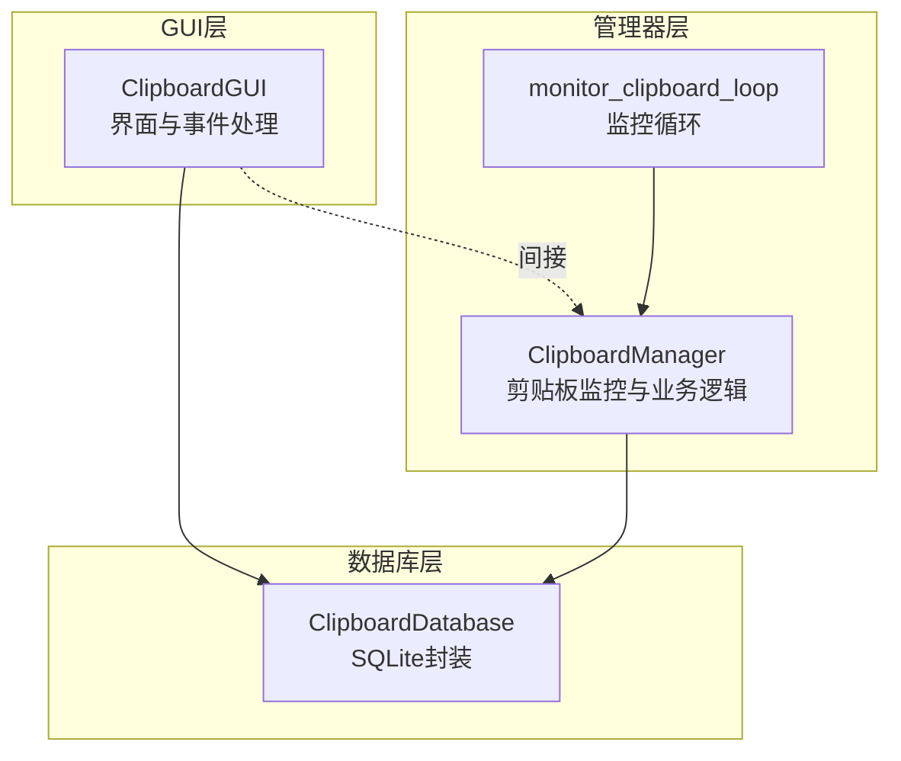
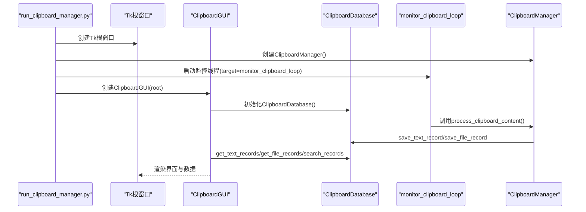
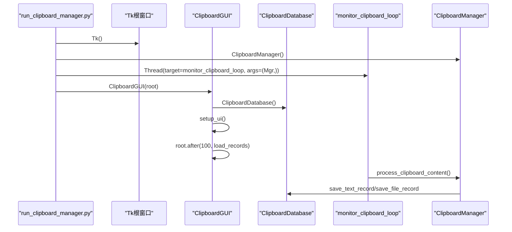
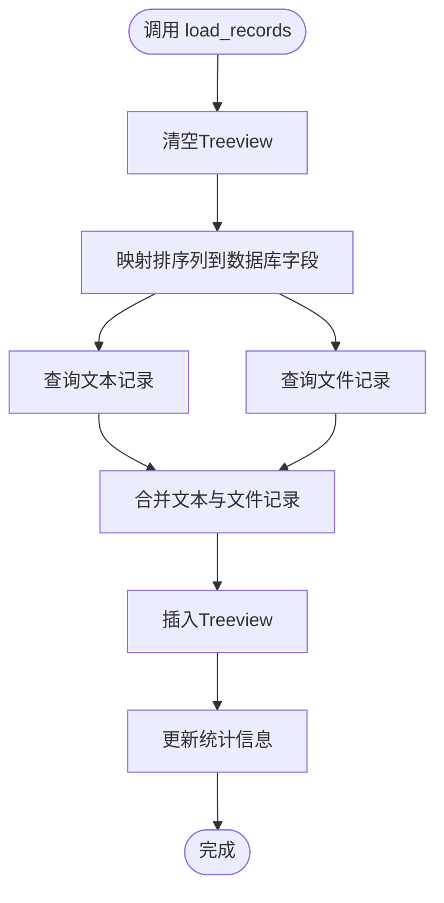
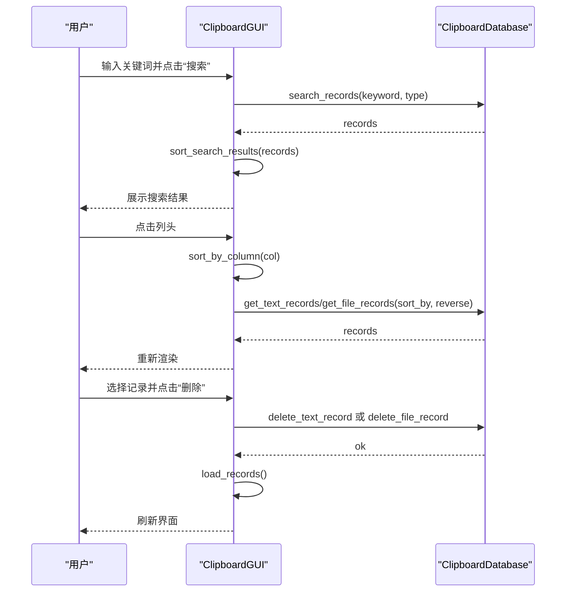
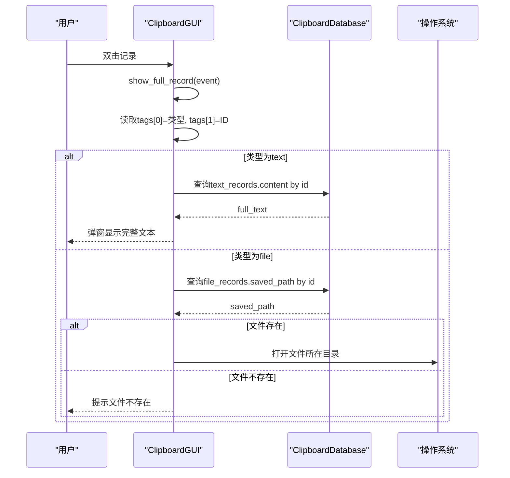
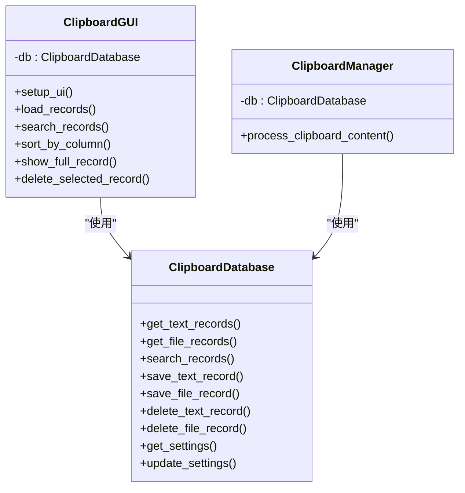

# GUI与管理器通信

<cite>
**本文引用的文件**
- [clipboard_gui.py](file://clipboard_gui.py)
- [clipboard_manager_main.py](file://clipboard_manager_main.py)
- [clipboard_db.py](file://clipboard_db.py)
- [run_clipboard_manager.py](file://run_clipboard_manager.py)
</cite>

## 目录
1. [简介](#简介)
2. [项目结构](#项目结构)
3. [核心组件](#核心组件)
4. [架构总览](#架构总览)
5. [详细组件分析](#详细组件分析)
6. [依赖关系分析](#依赖关系分析)
7. [性能考量](#性能考量)
8. [故障排查指南](#故障排查指南)
9. [结论](#结论)

## 简介
本文聚焦于ClipboardGUI与ClipboardManager实例之间的通信机制，围绕以下目标展开：
- GUI初始化时如何创建管理器实例并启动monitor_clipboard_loop监控线程
- setup_ui与load_records方法如何协调数据加载流程
- 用户操作（搜索、排序、删除）时，GUI如何调用管理器的数据库接口进行查询与更新
- 双击记录查看完整内容时，从GUI事件触发到数据库查询的完整调用链，以及线程安全的数据访问模式

## 项目结构
该项目采用“GUI + 管理器 + 数据库”的分层设计：
- GUI层负责用户交互与界面渲染
- 管理器层负责业务逻辑与剪贴板监控
- 数据库层封装SQLite访问与数据模型

图表来源
- [clipboard_gui.py](file://clipboard_gui.py#L37-L120)
- [clipboard_manager_main.py](file://clipboard_manager_main.py#L355-L761)
- [clipboard_db.py](file://clipboard_db.py#L13-L120)

章节来源
- [clipboard_gui.py](file://clipboard_gui.py#L37-L120)
- [clipboard_manager_main.py](file://clipboard_manager_main.py#L355-L761)
- [clipboard_db.py](file://clipboard_db.py#L13-L120)

## 核心组件
- ClipboardGUI：负责界面初始化、事件绑定、数据加载与展示、用户操作处理（搜索、排序、删除、复制、设置等）
- ClipboardManager：负责剪贴板监控、内容处理、调用数据库接口保存记录
- ClipboardDatabase：负责SQLite数据库的初始化、CRUD操作、统计与设置管理
- monitor_clipboard_loop：独立线程中的监控循环，周期性调用管理器处理剪贴板内容

章节来源
- [clipboard_gui.py](file://clipboard_gui.py#L37-L120)
- [clipboard_manager_main.py](file://clipboard_manager_main.py#L355-L761)
- [clipboard_db.py](file://clipboard_db.py#L13-L120)

## 架构总览
GUI与管理器通过数据库层进行松耦合通信。GUI在初始化时创建ClipboardDatabase实例，随后在用户操作中直接调用数据库接口；管理器同样持有ClipboardDatabase实例，在监控线程中异步写入数据。二者共享同一数据库文件，实现数据一致性。

图表来源
- [run_clipboard_manager.py](file://run_clipboard_manager.py#L32-L66)
- [clipboard_manager_main.py](file://clipboard_manager_main.py#L717-L761)
- [clipboard_manager_main.py](file://clipboard_manager_main.py#L395-L496)
- [clipboard_db.py](file://clipboard_db.py#L116-L183)

## 详细组件分析

### GUI初始化与监控线程启动
- GUI初始化
  - 构造函数中创建ClipboardDatabase实例，准备数据库连接
  - setup_ui构建界面，绑定事件
  - root.after延时触发load_records，完成首次数据加载
- 监控线程启动
  - run_clipboard_manager.py中创建ClipboardManager实例
  - 在独立线程中启动monitor_clipboard_loop，周期性调用管理器的process_clipboard_content
  - GUI默认隐藏主窗口，仅保留系统托盘图标

图表来源
- [run_clipboard_manager.py](file://run_clipboard_manager.py#L32-L66)
- [clipboard_gui.py](file://clipboard_gui.py#L37-L79)
- [clipboard_manager_main.py](file://clipboard_manager_main.py#L717-L761)
- [clipboard_manager_main.py](file://clipboard_manager_main.py#L395-L496)

章节来源
- [run_clipboard_manager.py](file://run_clipboard_manager.py#L32-L66)
- [clipboard_gui.py](file://clipboard_gui.py#L37-L79)

### setup_ui与load_records的数据加载流程
- setup_ui
  - 构建搜索区、笔记本（记录/统计/设置）
  - 记录标签页创建Treeview，绑定双击事件、排序列头点击事件
- load_records/load_all_records
  - 清空现有Treeview
  - 根据当前排序列映射到数据库字段，分别查询文本与文件记录
  - 合并结果，插入Treeview，更新统计信息

图表来源
- [clipboard_gui.py](file://clipboard_gui.py#L581-L626)
- [clipboard_gui.py](file://clipboard_gui.py#L627-L637)

章节来源
- [clipboard_gui.py](file://clipboard_gui.py#L172-L219)
- [clipboard_gui.py](file://clipboard_gui.py#L227-L279)
- [clipboard_gui.py](file://clipboard_gui.py#L581-L626)
- [clipboard_gui.py](file://clipboard_gui.py#L627-L637)

### 用户操作：搜索、排序与删除
- 搜索
  - GUI从搜索框获取关键词，调用数据库search_records
  - 对搜索结果进行二次排序与展示
- 排序
  - 点击列头触发sort_by_column，切换reverse并重新load_records
  - 列标题显示排序方向指示
- 删除
  - 获取选中项的类型与ID
  - 文本记录：调用delete_text_record
  - 文件记录：先查询saved_path，删除数据库记录，尝试删除本地文件，再重新加载

图表来源
- [clipboard_gui.py](file://clipboard_gui.py#L652-L748)
- [clipboard_gui.py](file://clipboard_gui.py#L280-L308)
- [clipboard_gui.py](file://clipboard_gui.py#L839-L877)
- [clipboard_db.py](file://clipboard_db.py#L281-L314)
- [clipboard_db.py](file://clipboard_db.py#L334-L349)

章节来源
- [clipboard_gui.py](file://clipboard_gui.py#L652-L748)
- [clipboard_gui.py](file://clipboard_gui.py#L280-L308)
- [clipboard_gui.py](file://clipboard_gui.py#L839-L877)
- [clipboard_db.py](file://clipboard_db.py#L281-L314)
- [clipboard_db.py](file://clipboard_db.py#L334-L349)

### 双击查看完整内容：调用链与线程安全
- 触发事件
  - 用户双击Treeview某一行，触发show_full_record
- 事件处理
  - 从选中项的tags中提取记录类型与ID
  - 文本记录：直接从数据库查询完整内容
  - 文件记录：查询saved_path，若存在则打开所在目录，否则提示不存在
- 线程安全
  - GUI主线程中建立sqlite3连接执行查询，未跨线程共享连接对象
  - 管理器在独立线程中写入数据库，GUI在主线程中读取，二者通过SQLite并发控制保证一致性

图表来源
- [clipboard_gui.py](file://clipboard_gui.py#L749-L795)
- [clipboard_db.py](file://clipboard_db.py#L116-L183)

章节来源
- [clipboard_gui.py](file://clipboard_gui.py#L749-L795)
- [clipboard_db.py](file://clipboard_db.py#L116-L183)

## 依赖关系分析
- GUI依赖数据库层接口，直接调用get_*、search_*、delete_*等方法
- 管理器同样依赖数据库层接口，用于保存文本与文件记录
- 监控线程与管理器耦合，管理器内部不直接依赖GUI

图表来源
- [clipboard_gui.py](file://clipboard_gui.py#L172-L219)
- [clipboard_gui.py](file://clipboard_gui.py#L581-L626)
- [clipboard_manager_main.py](file://clipboard_manager_main.py#L355-L496)
- [clipboard_db.py](file://clipboard_db.py#L116-L183)

章节来源
- [clipboard_gui.py](file://clipboard_gui.py#L172-L219)
- [clipboard_gui.py](file://clipboard_gui.py#L581-L626)
- [clipboard_manager_main.py](file://clipboard_manager_main.py#L355-L496)
- [clipboard_db.py](file://clipboard_db.py#L116-L183)

## 性能考量
- 数据加载
  - GUI一次性加载文本与文件记录，合并后再插入Treeview，减少多次UI刷新
  - 排序在内存中进行，建议在数据量较大时考虑分页或服务端排序
- 监控线程
  - monitor_clipboard_loop以固定间隔轮询，避免阻塞GUI线程
  - 剪贴板读取与数据库写入均在独立线程中执行，降低UI卡顿风险
- 线程安全
  - GUI与管理器各自维护独立的sqlite3连接，避免跨线程共享连接导致的竞态
  - SQLite具备基本的并发控制能力，适合本场景

[本节为通用指导，不涉及具体文件分析]

## 故障排查指南
- 数据库连接异常
  - 检查ClipboardDatabase初始化是否成功，确认数据库文件是否存在
- 剪贴板监控无效
  - 确认monitor_clipboard_loop线程已启动，且ClipboardManager实例正确传入
- GUI无响应
  - 关注user_action_in_progress标志位，确保长时间操作后及时复位
- 文件删除后仍可见
  - 确认delete_file_record后已尝试删除本地文件，必要时手动清理clipboard_files目录

章节来源
- [clipboard_db.py](file://clipboard_db.py#L18-L115)
- [run_clipboard_manager.py](file://run_clipboard_manager.py#L32-L66)
- [clipboard_gui.py](file://clipboard_gui.py#L839-L877)

## 结论
ClipboardGUI与ClipboardManager通过ClipboardDatabase实现了清晰的分层通信：GUI负责用户交互与数据展示，管理器负责后台监控与数据持久化。二者共享同一数据库，既保证了数据一致性，又避免了复杂的跨进程通信。事件驱动的调用链简洁明确，线程安全通过独立连接与SQLite并发控制得到保障。对于大规模数据场景，可进一步引入分页与索引优化以提升性能。