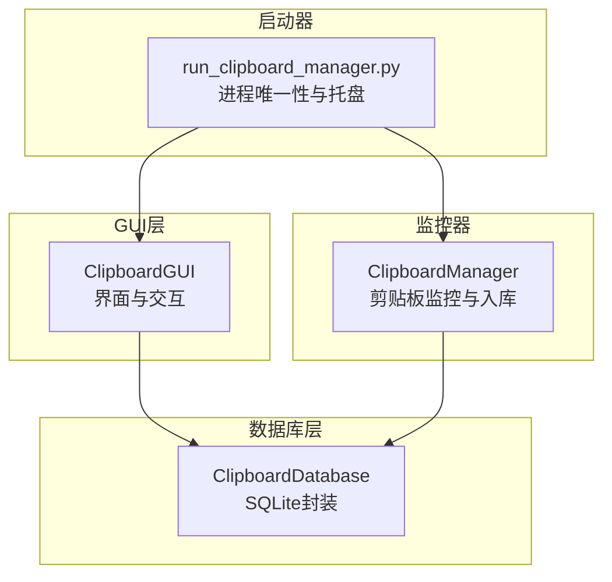
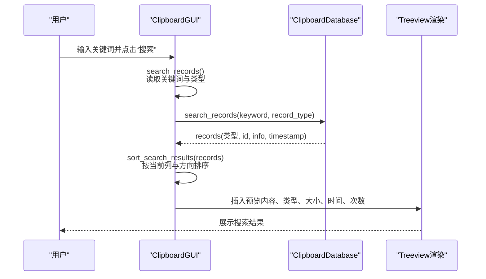
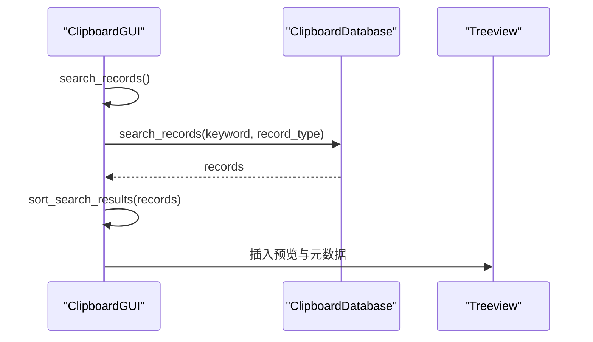
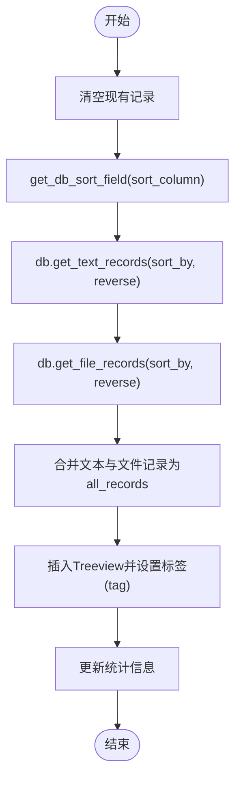
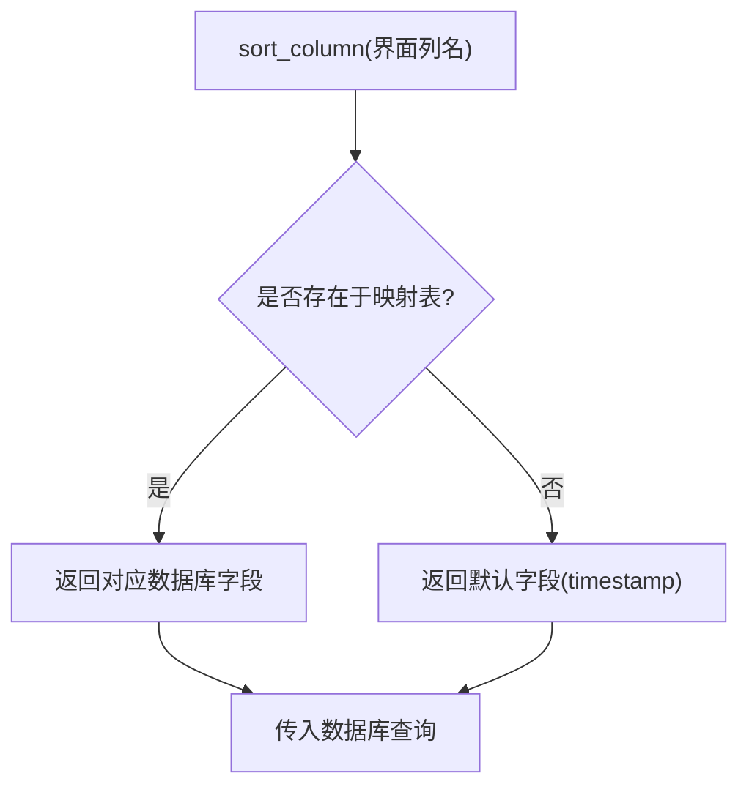
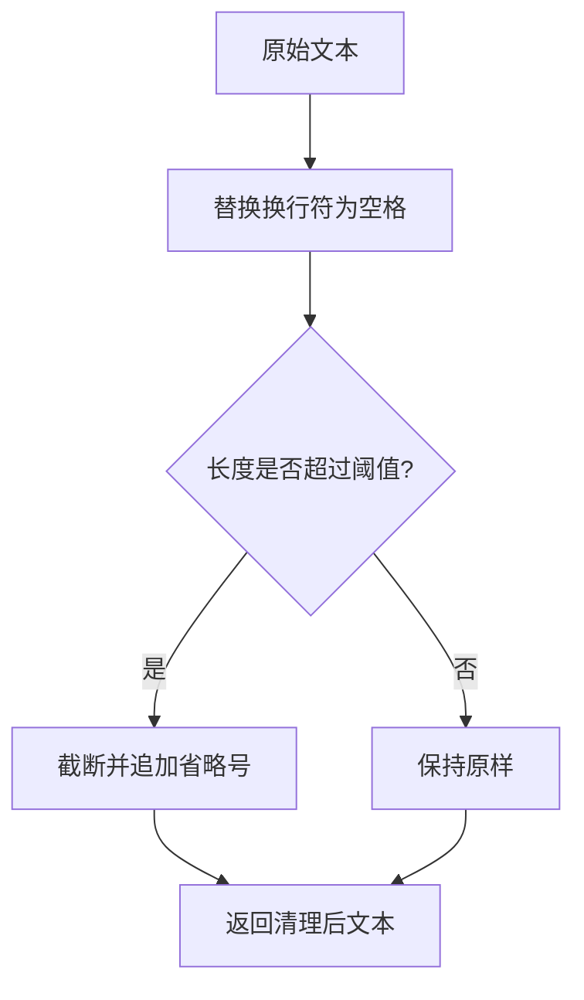
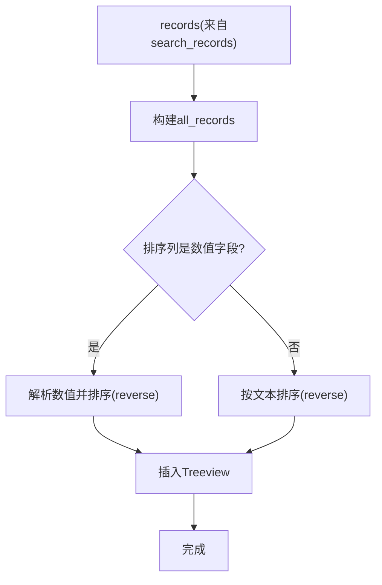
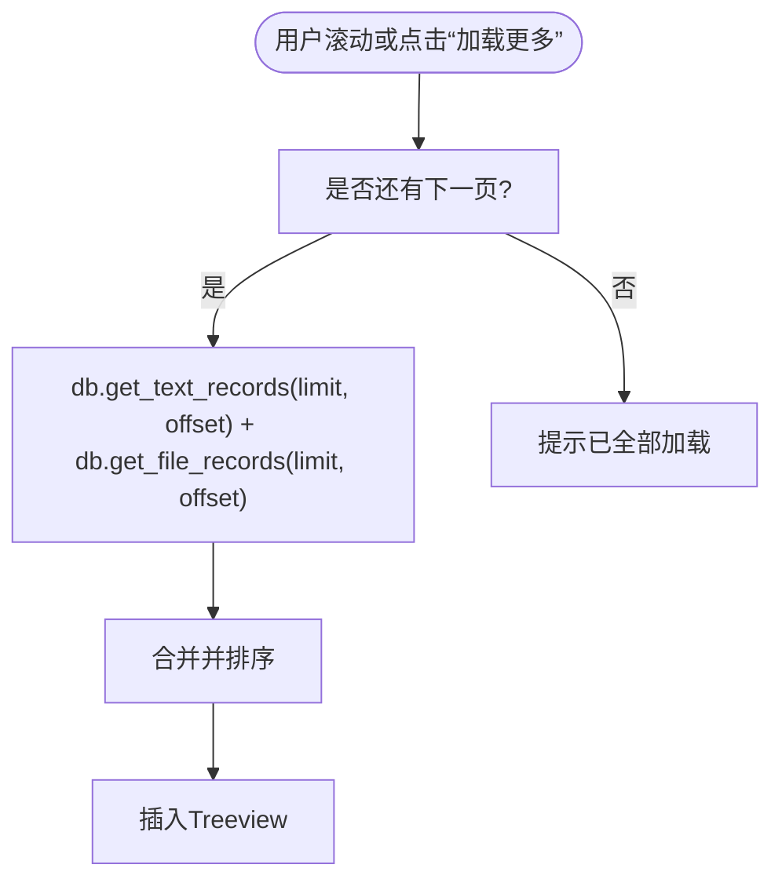
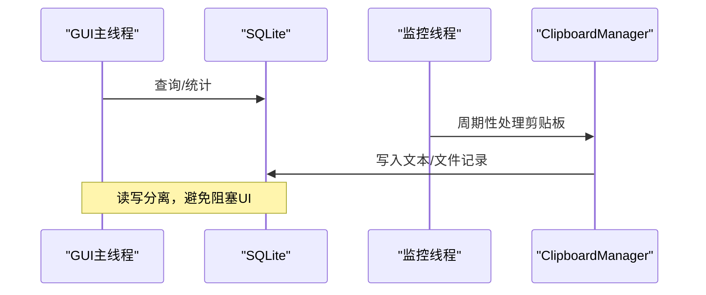
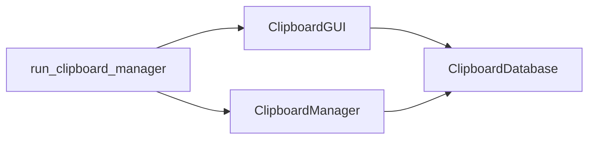

# GUI数据查询与管理器通信

<cite>
**本文引用的文件**
- [clipboard_gui.py](file://clipboard_gui.py)
- [clipboard_db.py](file://clipboard_db.py)
- [run_clipboard_manager.py](file://run_clipboard_manager.py)
- [clipboard_manager_main.py](file://clipboard_manager_main.py)
</cite>

## 目录
1. [简介](#简介)
2. [项目结构](#项目结构)
3. [核心组件](#核心组件)
4. [架构总览](#架构总览)
5. [详细组件分析](#详细组件分析)
6. [依赖关系分析](#依赖关系分析)
7. [性能考量](#性能考量)
8. [故障排查指南](#故障排查指南)
9. [结论](#结论)

## 简介
本文件聚焦于GUI界面与ClipboardManager的通信机制，围绕以下目标展开：
- search_records方法如何通过ClipboardDatabase接口执行数据库查询
- load_all_records中对文本和文件记录的合并处理逻辑
- get_db_sort_field方法如何实现界面列名到数据库字段的映射转换，以及排序参数的传递过程
- 从用户输入搜索关键词到数据库查询执行再到结果渲染的完整数据流
- sanitize_text_for_display内容清理策略
- 分页加载机制现状与替代方案
- 线程安全的数据访问模式

## 项目结构
该项目采用“GUI + 数据库 + 启动器”的分层组织：
- GUI层：负责用户交互、排序、搜索、渲染等
- 数据库层：封装SQLite访问、记录查询、统计、设置等
- 启动器：控制进程唯一性、后台监控线程与GUI显示

图表来源
- [clipboard_gui.py](file://clipboard_gui.py#L1-L120)
- [clipboard_db.py](file://clipboard_db.py#L1-L120)
- [run_clipboard_manager.py](file://run_clipboard_manager.py#L1-L71)
- [clipboard_manager_main.py](file://clipboard_manager_main.py#L1-L120)

章节来源
- [clipboard_gui.py](file://clipboard_gui.py#L1-L120)
- [clipboard_db.py](file://clipboard_db.py#L1-L120)
- [run_clipboard_manager.py](file://run_clipboard_manager.py#L1-L71)
- [clipboard_manager_main.py](file://clipboard_manager_main.py#L1-L120)

## 核心组件
- ClipboardGUI：提供记录浏览、搜索、排序、复制、删除、统计、设置等功能，内部持有ClipboardDatabase实例
- ClipboardDatabase：封装SQLite数据库访问，提供文本/文件记录查询、搜索、统计、设置读写等
- run_clipboard_manager：负责进程唯一性、托盘图标、隐藏主窗体、启动监控线程
- ClipboardManager（在另一个入口中）：负责剪贴板监控、内容识别、入库、限制检查

章节来源
- [clipboard_gui.py](file://clipboard_gui.py#L1-L120)
- [clipboard_db.py](file://clipboard_db.py#L1-L120)
- [run_clipboard_manager.py](file://run_clipboard_manager.py#L1-L71)
- [clipboard_manager_main.py](file://clipboard_manager_main.py#L1-L120)

## 架构总览
GUI与数据库的交互遵循“界面调用数据库接口 -> 数据库执行SQL -> 返回结果 -> GUI渲染”的标准流程。排序通过界面列名映射到数据库字段，并将排序方向传入数据库查询。

图表来源
- [clipboard_gui.py](file://clipboard_gui.py#L652-L748)
- [clipboard_db.py](file://clipboard_db.py#L281-L314)

章节来源
- [clipboard_gui.py](file://clipboard_gui.py#L652-L748)
- [clipboard_db.py](file://clipboard_db.py#L281-L314)

## 详细组件分析

### 组件A：GUI搜索与数据库查询（search_records）
- 触发点：用户在搜索框输入关键词并点击“搜索”
- 关键步骤：
  - 读取关键词与默认类型（all）
  - 清空现有记录
  - 调用数据库接口执行搜索
  - 对搜索结果进行二次排序（按当前列与方向）
  - 渲染到记录标签页

图表来源
- [clipboard_gui.py](file://clipboard_gui.py#L652-L748)
- [clipboard_db.py](file://clipboard_db.py#L281-L314)

章节来源
- [clipboard_gui.py](file://clipboard_gui.py#L652-L748)
- [clipboard_db.py](file://clipboard_db.py#L281-L314)

### 组件B：记录合并与渲染（load_all_records）
- 触发点：用户点击“刷新”或排序变更
- 关键步骤：
  - 清空现有记录
  - 依据当前排序列获取数据库排序字段
  - 分别查询文本记录与文件记录
  - 合并为统一的all_records列表
  - 渲染到Treeview，包含名称/内容、类型、大小、时间、次数等

图表来源
- [clipboard_gui.py](file://clipboard_gui.py#L585-L626)
- [clipboard_gui.py](file://clipboard_gui.py#L627-L637)
- [clipboard_db.py](file://clipboard_db.py#L185-L261)

章节来源
- [clipboard_gui.py](file://clipboard_gui.py#L585-L626)
- [clipboard_gui.py](file://clipboard_gui.py#L627-L637)
- [clipboard_db.py](file://clipboard_db.py#L185-L261)

### 组件C：列名到数据库字段映射（get_db_sort_field）
- 功能：将界面列名映射为数据库字段名，并提供默认降序（最新在前）
- 映射规则：
  - “名称或内容” -> content
  - “类型” -> file_type
  - “大小” -> file_size
  - “时间” -> timestamp
  - “次数” -> number
- 排序参数传递：
  - sort_by：由get_db_sort_field返回
  - reverse：由GUI维护的sort_reverse布尔值决定

图表来源
- [clipboard_gui.py](file://clipboard_gui.py#L627-L637)

章节来源
- [clipboard_gui.py](file://clipboard_gui.py#L627-L637)

### 组件D：内容清理与预览（sanitize_text_for_display）
- 目标：保证显示内容整洁，避免换行影响布局，限制长度
- 行为：
  - 替换换行符为空格
  - 截断过长内容并追加省略号
- 使用场景：文本记录预览、悬浮面板摘要、搜索结果预览

图表来源
- [clipboard_gui.py](file://clipboard_gui.py#L124-L133)
- [clipboard_gui.py](file://clipboard_gui.py#L595-L626)
- [clipboard_gui.py](file://clipboard_gui.py#L670-L748)

章节来源
- [clipboard_gui.py](file://clipboard_gui.py#L124-L133)
- [clipboard_gui.py](file://clipboard_gui.py#L595-L626)
- [clipboard_gui.py](file://clipboard_gui.py#L670-L748)

### 组件E：排序参数传递与二次排序（sort_search_results）
- 列表二次排序：
  - 数值字段（大小、次数）：解析字符串为数值后排序
  - 文本字段：按文本排序
  - 失败回退：按时间降序
- 排序方向：由GUI维护的sort_reverse决定

图表来源
- [clipboard_gui.py](file://clipboard_gui.py#L668-L748)

章节来源
- [clipboard_gui.py](file://clipboard_gui.py#L668-L748)

### 组件F：分页加载机制现状与替代方案
- 现状：
  - GUI侧未实现分页加载，load_all_records一次性加载文本与文件记录
  - get_text_records/get_file_records支持limit/offset参数，但GUI未使用
- 替代方案建议：
  - 增加“加载更多”按钮，基于offset增量拉取
  - 使用Treeview的虚拟化或延迟渲染减少大数据量时的卡顿
  - 优化数据库索引（如按timestamp、number等）

图表来源
- [clipboard_db.py](file://clipboard_db.py#L185-L261)
- [clipboard_gui.py](file://clipboard_gui.py#L585-L626)

章节来源
- [clipboard_db.py](file://clipboard_db.py#L185-L261)
- [clipboard_gui.py](file://clipboard_gui.py#L585-L626)

### 组件G：线程安全的数据访问模式
- GUI主线程：
  - 直接调用数据库接口（如search_records、get_text_records、get_file_records）
  - 通过定时任务（每2秒）自动刷新，受is_hidden、user_action_in_progress、has_focus保护
- 监控线程：
  - run_clipboard_manager.py在独立线程中运行ClipboardManager监控循环
  - 与GUI互不阻塞，避免UI卡顿
- 建议：
  - 对频繁读取的统计与最近记录可考虑缓存
  - 对高并发写入（监控线程）与读取（GUI）可引入连接池或串行化写入

图表来源
- [run_clipboard_manager.py](file://run_clipboard_manager.py#L32-L71)
- [clipboard_manager_main.py](file://clipboard_manager_main.py#L717-L761)
- [clipboard_gui.py](file://clipboard_gui.py#L1676-L1696)

章节来源
- [run_clipboard_manager.py](file://run_clipboard_manager.py#L32-L71)
- [clipboard_manager_main.py](file://clipboard_manager_main.py#L717-L761)
- [clipboard_gui.py](file://clipboard_gui.py#L1676-L1696)

## 依赖关系分析
- GUI依赖数据库接口：search_records、get_text_records、get_file_records、get_statistics、update_settings、clear_all_records等
- 启动器依赖GUI与监控器：进程唯一性、托盘图标、隐藏主窗体、启动监控线程
- 监控器依赖数据库：save_text_record、save_file_record、check_copy_limits

图表来源
- [clipboard_gui.py](file://clipboard_gui.py#L1-L120)
- [clipboard_db.py](file://clipboard_db.py#L1-L120)
- [run_clipboard_manager.py](file://run_clipboard_manager.py#L1-L71)
- [clipboard_manager_main.py](file://clipboard_manager_main.py#L1-L120)

章节来源
- [clipboard_gui.py](file://clipboard_gui.py#L1-L120)
- [clipboard_db.py](file://clipboard_db.py#L1-L120)
- [run_clipboard_manager.py](file://run_clipboard_manager.py#L1-L71)
- [clipboard_manager_main.py](file://clipboard_manager_main.py#L1-L120)

## 性能考量
- 查询性能
  - 文本/文件记录均按timestamp降序，适合“最新优先”展示
  - 搜索使用UNION ALL，注意在大数据量时的索引与LIMIT
- 渲染性能
  - 一次性渲染可能造成大量节点插入，建议引入分页或虚拟化
- 线程与锁
  - SQLite默认非线程安全，建议：
    - 为GUI读取使用独立连接
    - 为写入（监控线程）串行化或使用连接池
- 缓存策略
  - 统计信息与最近记录可缓存，结合定时刷新

## 故障排查指南
- 搜索结果为空
  - 检查关键词是否正确，确认数据库中是否存在匹配记录
  - 确认search_records调用链是否正确执行
- 排序异常
  - 检查get_db_sort_field映射是否覆盖目标列
  - 确认sort_reverse是否按预期切换
- 渲染卡顿
  - 若记录量较大，考虑启用分页或虚拟化
- 线程冲突
  - 确保监控线程与GUI线程分别使用独立连接
  - 避免在GUI线程中执行耗时数据库操作

章节来源
- [clipboard_gui.py](file://clipboard_gui.py#L627-L748)
- [clipboard_db.py](file://clipboard_db.py#L185-L314)
- [run_clipboard_manager.py](file://run_clipboard_manager.py#L32-L71)

## 结论
本项目通过清晰的分层设计实现了GUI与数据库的稳定通信：
- search_records通过ClipboardDatabase完成搜索与二次排序
- load_all_records负责文本与文件记录的合并与渲染
- get_db_sort_field将界面列名映射到数据库字段，配合reverse实现灵活排序
- sanitize_text_for_display保障显示质量
- 分页加载尚未实现，建议后续引入以提升大数据量下的用户体验
- 线程安全方面，监控线程与GUI分离，但SQLite默认非线程安全，建议进一步优化连接与并发策略