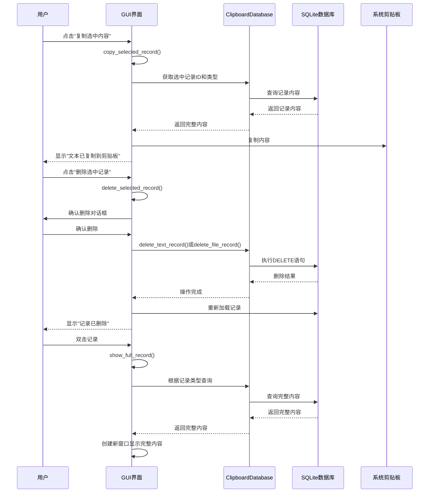
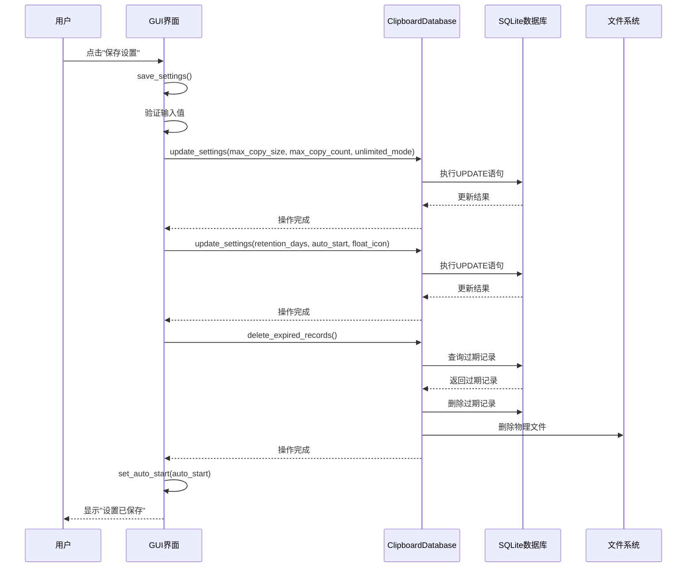
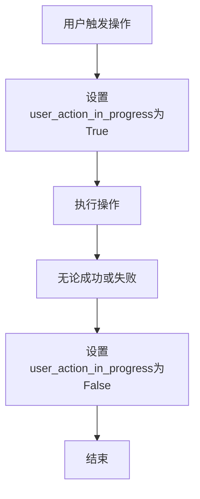

# GUI用户操作与管理器通信

<cite>
**本文档引用的文件**   
- [clipboard_gui.py](file://clipboard_gui.py)
- [clipboard_db.py](file://clipboard_db.py)
</cite>

## 目录
1. [简介](#简介)
2. [用户操作与管理器通信流程](#用户操作与管理器通信流程)
3. [核心功能分析](#核心功能分析)
4. [设置保存流程](#设置保存流程)
5. [系统集成调用](#系统集成调用)
6. [异常处理与用户反馈](#异常处理与用户反馈)

## 简介
本项目是一个剪贴板历史记录管理器，提供GUI界面供用户查看和管理剪贴板历史记录。系统通过ClipboardDatabase接口与底层SQLite数据库进行交互，实现了文本和文件记录的存储、检索、删除等功能。GUI界面通过事件驱动的方式响应用户操作，并与数据库管理器进行通信。

## 用户操作与管理器通信流程
GUI用户操作通过事件驱动的方式触发管理器通信。主要操作包括复制选中记录、删除选中记录和查看完整记录。这些操作通过绑定到相应按钮和事件的回调函数实现，与ClipboardDatabase接口进行交互。



**Diagram sources**
- [clipboard_gui.py](file://clipboard_gui.py#L796-L837)
- [clipboard_gui.py](file://clipboard_gui.py#L839-L877)
- [clipboard_gui.py](file://clipboard_gui.py#L749-L794)

## 核心功能分析
系统的核心功能包括记录的复制、删除和查看，这些功能通过GUI与数据库管理器的通信实现。

### 复制选中记录
`copy_selected_record`方法处理用户复制选中记录的请求。该方法首先检查是否有选中记录，然后根据记录类型（文本或文件）从数据库获取相应内容，并将其复制到系统剪贴板。

```mermaid
flowchart TD
A[开始] --> B{是否有选中记录?}
B --> |否| C[显示警告: 请先选择一条记录]
B --> |是| D[获取选中记录的ID和类型]
D --> E{记录类型是文本?}
E --> |是| F[从text_records表查询完整文本内容]
E --> |否| G[获取文件名]
F --> H[复制到系统剪贴板]
G --> H
H --> I[显示"文本已复制到剪贴板"]
I --> J[结束]
```

**Diagram sources**
- [clipboard_gui.py](file://clipboard_gui.py#L796-L837)

**Section sources**
- [clipboard_gui.py](file://clipboard_gui.py#L796-L837)

### 删除选中记录
`delete_selected_record`方法处理用户删除选中记录的请求。该方法首先确认用户是否真的要删除记录，然后根据记录类型调用相应的删除方法。

```mermaid
flowchart TD
A[开始] --> B{是否有选中记录?}
B --> |否| C[显示警告: 请先选择一条记录]
B --> |是| D[显示确认对话框]
D --> E{用户确认删除?}
E --> |否| F[取消操作]
E --> |是| G{记录类型是文本?}
G --> |是| H[调用delete_text_record()]
G --> |否| I[查询saved_path]
I --> J[调用delete_file_record()]
J --> K[尝试删除物理文件]
H --> L[从数据库删除记录]
L --> M[重新加载记录显示]
M --> N[显示"记录已删除"]
N --> O[结束]
```

**Diagram sources**
- [clipboard_gui.py](file://clipboard_gui.py#L839-L877)
- [clipboard_db.py](file://clipboard_db.py#L334-L348)

**Section sources**
- [clipboard_gui.py](file://clipboard_gui.py#L839-L877)
- [clipboard_db.py](file://clipboard_db.py#L334-L348)

### 双击事件处理
`show_full_record`方法处理用户双击记录的事件。根据记录类型，该方法会显示完整文本内容或打开文件位置。

```mermaid
flowchart TD
A[双击事件] --> B[获取选中记录]
B --> C{记录存在?}
C --> |否| D[结束]
C --> |是| E[获取记录类型和ID]
E --> F{记录类型是文本?}
F --> |是| G[查询text_records表获取完整内容]
G --> H[创建新窗口显示完整文本]
F --> |否| I[查询file_records表获取saved_path]
I --> J{文件存在?}
J --> |是| K[使用explorer打开文件位置]
J --> |否| L[显示"文件不存在"警告]
H --> M[结束]
K --> M
L --> M
```

**Diagram sources**
- [clipboard_gui.py](file://clipboard_gui.py#L749-L794)

**Section sources**
- [clipboard_gui.py](file://clipboard_gui.py#L749-L794)

## 设置保存流程
设置保存功能通过`save_settings`方法实现，该方法将用户在GUI界面中设置的参数保存到数据库中。



**Diagram sources**
- [clipboard_gui.py](file://clipboard_gui.py#L477-L533)

**Section sources**
- [clipboard_gui.py](file://clipboard_gui.py#L477-L533)

## 系统集成调用
系统通过`set_auto_start`方法实现开机自启功能，该方法使用Windows注册表来设置程序的开机自启。

```mermaid
flowchart TD
A[set_auto_start(enable)] --> B{enable为真?}
B --> |是| C[打开注册表HKEY_CURRENT_USER\Software\Microsoft\Windows\CurrentVersion\Run]
B --> |否| D[打开注册表HKEY_CURRENT_USER\Software\Microsoft\Windows\CurrentVersion\Run]
C --> E[创建或更新ClipboardManager键值]
E --> F[设置键值为程序路径]
D --> G{ClipboardManager键值存在?}
G --> |是| H[删除ClipboardManager键值]
G --> |否| I[无操作]
H --> J[结束]
I --> J
F --> J
```

**Diagram sources**
- [clipboard_gui.py](file://clipboard_gui.py#L1131-L1163)

**Section sources**
- [clipboard_gui.py](file://clipboard_gui.py#L1131-L1163)

## 异常处理与用户反馈
系统在用户操作过程中实现了完善的异常处理机制和用户反馈。

### 输入验证
在保存设置时，系统会对用户输入进行验证，确保输入的是有效数字。

```mermaid
flowchart TD
A[用户点击"保存设置"] --> B[尝试转换输入值为数字]
B --> C{转换成功?}
C --> |是| D[继续保存设置]
C --> |否| E[捕获ValueError异常]
E --> F[显示"请输入有效的数字"错误]
F --> G[结束]
D --> H[更新数据库设置]
H --> I[显示"设置已保存"提示]
I --> G
```

**Diagram sources**
- [clipboard_gui.py](file://clipboard_gui.py#L477-L533)

### 用户操作状态管理
系统使用`user_action_in_progress`标志来管理用户操作状态，防止在操作进行时触发其他操作。



**Section sources**
- [clipboard_gui.py](file://clipboard_gui.py#L798-L800)
- [clipboard_gui.py](file://clipboard_gui.py#L842-L843)