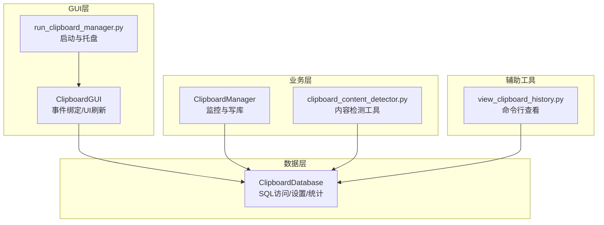
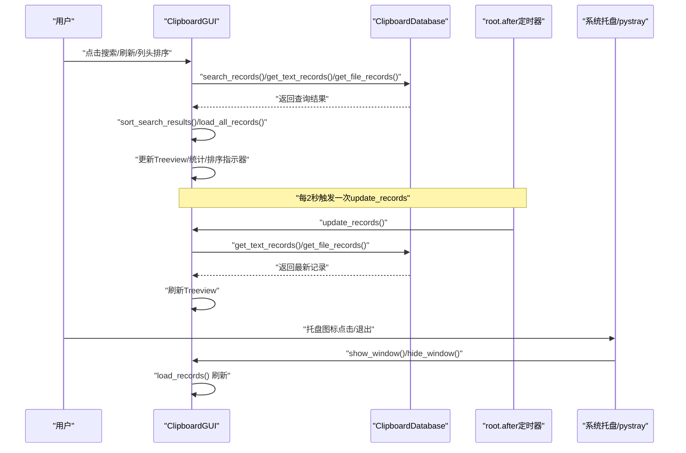
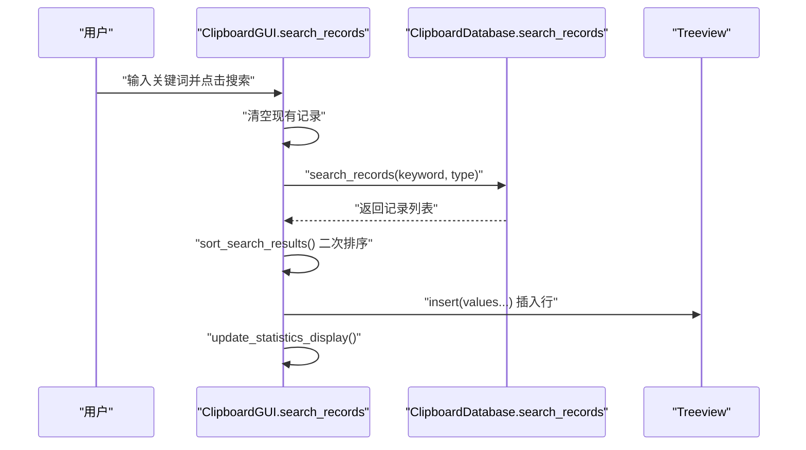
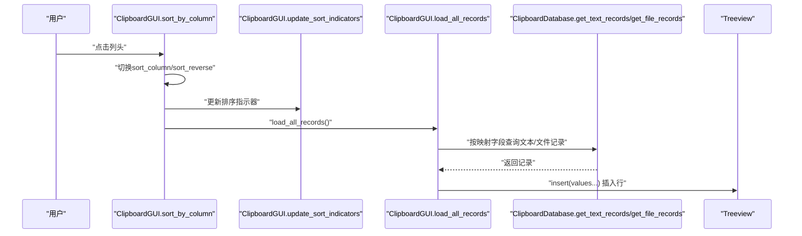
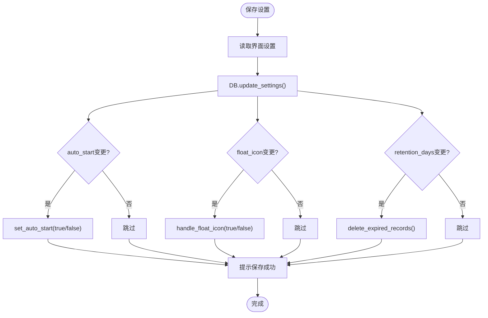
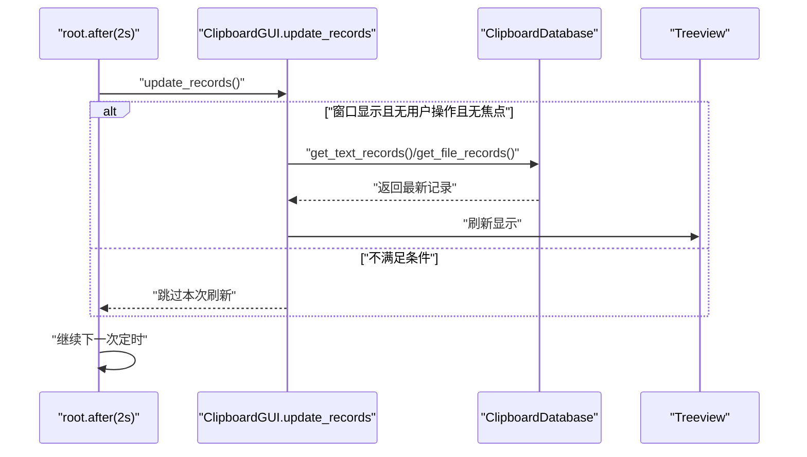
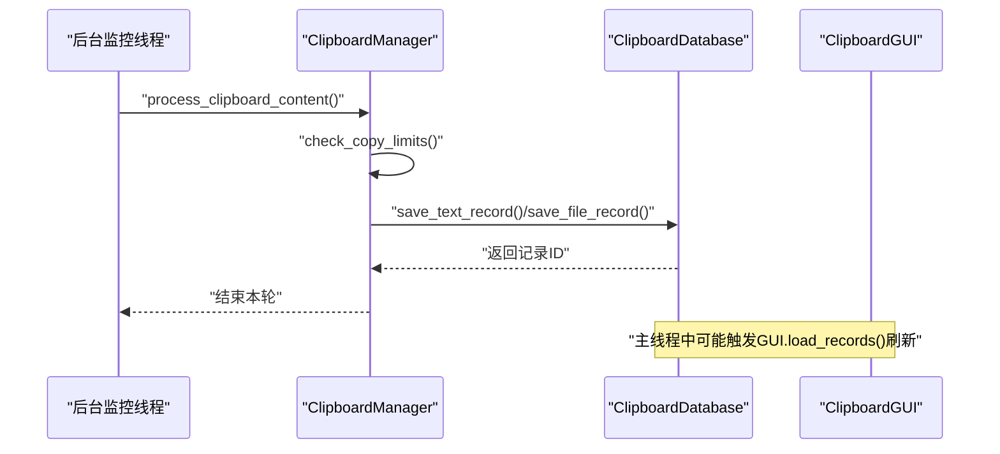
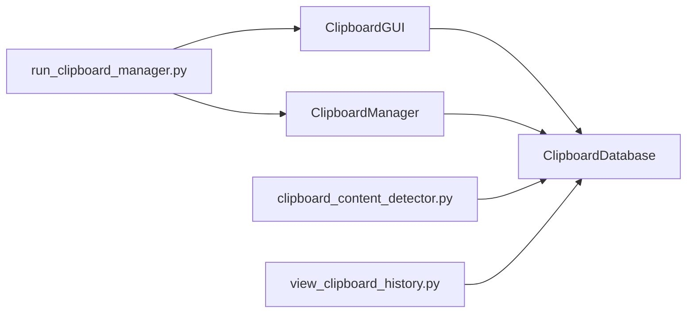

# 事件驱动交互

<cite>
**本文引用的文件**
- [clipboard_gui.py](file://clipboard_gui.py)
- [clipboard_manager_main.py](file://clipboard_manager_main.py)
- [clipboard_db.py](file://clipboard_db.py)
- [run_clipboard_manager.py](file://run_clipboard_manager.py)
- [clipboard_content_detector.py](file://clipboard_content_detector.py)
- [view_clipboard_history.py](file://view_clipboard_history.py)
</cite>

## 目录
1. [简介](#简介)
2. [项目结构](#项目结构)
3. [核心组件](#核心组件)
4. [架构总览](#架构总览)
5. [详细组件分析](#详细组件分析)
6. [依赖关系分析](#依赖关系分析)
7. [性能考量](#性能考量)
8. [故障排查指南](#故障排查指南)
9. [结论](#结论)

## 简介
本文件系统性阐述应用程序的事件驱动交互机制，围绕以下目标展开：
- 用户搜索操作如何触发事件循环，从GUI的search_records方法调用开始，到数据库查询执行，再到结果在Treeview组件中更新显示的完整流程。
- 排序功能如何通过sort_by_column方法重新加载数据并更新UI。
- 设置更改事件如何触发数据库更新和系统功能调整（如开机自启和悬浮图标）。
- 状态变更通知机制的实现细节，包括回调函数和界面刷新的协调。

## 项目结构
该项目采用“GUI + 数据库 + 监控器”的分层设计，核心文件职责如下：
- GUI层：负责用户交互、事件绑定、界面刷新与状态管理。
- 数据库层：封装SQLite访问、查询、统计与设置管理。
- 监控层：后台线程持续检测剪贴板变化并写入数据库。
- 启动入口：控制应用生命周期、托盘图标与窗口可见性。

图表来源
- [clipboard_gui.py](file://clipboard_gui.py#L1-L200)
- [run_clipboard_manager.py](file://run_clipboard_manager.py#L1-L71)
- [clipboard_manager_main.py](file://clipboard_manager_main.py#L355-L761)
- [clipboard_db.py](file://clipboard_db.py#L1-L120)
- [clipboard_content_detector.py](file://clipboard_content_detector.py#L1-L120)
- [view_clipboard_history.py](file://view_clipboard_history.py#L1-L75)

章节来源
- [clipboard_gui.py](file://clipboard_gui.py#L1-L200)
- [run_clipboard_manager.py](file://run_clipboard_manager.py#L1-L71)

## 核心组件
- ClipboardGUI：主GUI类，负责界面构建、事件绑定、定时刷新、托盘与悬浮图标、设置持久化等。
- ClipboardDatabase：数据库访问封装，提供查询、统计、设置读写、过期清理等功能。
- ClipboardManager：后台监控器，周期性检测剪贴板变化并写入数据库。
- run_clipboard_manager.py：应用入口，负责托盘图标、窗口可见性控制与线程调度。
- clipboard_content_detector.py：剪贴板内容检测工具，便于独立测试与调试。
- view_clipboard_history.py：命令行查看器，用于快速浏览历史记录与统计。

章节来源
- [clipboard_gui.py](file://clipboard_gui.py#L1-L200)
- [clipboard_db.py](file://clipboard_db.py#L1-L120)
- [clipboard_manager_main.py](file://clipboard_manager_main.py#L355-L761)
- [run_clipboard_manager.py](file://run_clipboard_manager.py#L1-L71)
- [clipboard_content_detector.py](file://clipboard_content_detector.py#L1-L120)
- [view_clipboard_history.py](file://view_clipboard_history.py#L1-L75)

## 架构总览
应用采用事件驱动模型：
- GUI事件：用户点击、键盘、鼠标滚轮、焦点变化、托盘图标点击等。
- 定时事件：root.after驱动的周期性刷新，避免频繁刷新影响用户体验。
- 数据库事件：设置变更、搜索与排序、统计更新等。
- 监控事件：后台线程定期轮询剪贴板，触发数据库写入与UI刷新。

图表来源
- [clipboard_gui.py](file://clipboard_gui.py#L570-L750)
- [clipboard_gui.py](file://clipboard_gui.py#L1676-L1696)
- [clipboard_db.py](file://clipboard_db.py#L281-L315)
- [clipboard_db.py](file://clipboard_db.py#L185-L261)

## 详细组件分析

### 搜索事件流：从GUI到数据库再到Treeview
- 触发点：用户在搜索框输入关键词并点击“搜索”按钮。
- 关键方法链：
  - GUI.search_records()：读取关键词，清空Treeview，调用DB.search_records()。
  - DB.search_records()：根据record_type拼接SQL查询，返回统一结构的结果集。
  - GUI.sort_search_results()：对结果集进行二次排序（考虑数值字段），然后插入Treeview。
  - GUI.update_statistics_display()：刷新统计信息展示。
- UI更新：Treeview按列顺序插入数据，标签页切换不影响搜索结果展示。

图表来源
- [clipboard_gui.py](file://clipboard_gui.py#L652-L750)
- [clipboard_db.py](file://clipboard_db.py#L281-L315)

章节来源
- [clipboard_gui.py](file://clipboard_gui.py#L652-L750)
- [clipboard_db.py](file://clipboard_db.py#L281-L315)

### 排序事件流：sort_by_column驱动的数据重载
- 触发点：用户点击Treeview列头。
- 关键方法链：
  - GUI.sort_by_column(col)：切换排序方向或列，更新排序指示器，调用GUI.load_all_records()。
  - GUI.load_all_records()：清空Treeview，依据DB映射字段获取排序字段，分别查询文本与文件记录，合并后插入Treeview。
  - GUI.update_sort_indicators()：动态更新列标题的上下箭头指示器。
- 性能注意：排序在内存中完成，适合当前规模；若数据量增大，建议在DB层完成排序并分页。

图表来源
- [clipboard_gui.py](file://clipboard_gui.py#L280-L308)
- [clipboard_gui.py](file://clipboard_gui.py#L581-L626)
- [clipboard_gui.py](file://clipboard_gui.py#L627-L637)
- [clipboard_db.py](file://clipboard_db.py#L185-L261)

章节来源
- [clipboard_gui.py](file://clipboard_gui.py#L280-L308)
- [clipboard_gui.py](file://clipboard_gui.py#L581-L626)
- [clipboard_gui.py](file://clipboard_gui.py#L627-L637)
- [clipboard_db.py](file://clipboard_db.py#L185-L261)

### 设置变更事件流：数据库更新与系统功能调整
- 触发点：用户在“设置”标签页修改配置并点击“保存设置”。
- 关键方法链：
  - GUI.save_settings()：读取界面变量，调用DB.update_settings()更新设置。
  - DB.update_settings()：原子性更新settings表字段。
  - GUI.handle_float_icon(float_icon)：根据设置创建/销毁悬浮图标。
  - GUI.set_auto_start(auto_start)：根据设置启用/禁用开机自启。
  - GUI.check_float_icon()/check_auto_start()：应用启动时读取设置并执行相应动作。
- 影响范围：开机自启、悬浮图标、记录保留策略（过期清理）。

图表来源
- [clipboard_gui.py](file://clipboard_gui.py#L477-L533)
- [clipboard_gui.py](file://clipboard_gui.py#L80-L110)
- [clipboard_gui.py](file://clipboard_gui.py#L439-L462)
- [clipboard_db.py](file://clipboard_db.py#L387-L412)
- [clipboard_db.py](file://clipboard_db.py#L413-L455)

章节来源
- [clipboard_gui.py](file://clipboard_gui.py#L477-L533)
- [clipboard_gui.py](file://clipboard_gui.py#L80-L110)
- [clipboard_gui.py](file://clipboard_gui.py#L439-L462)
- [clipboard_db.py](file://clipboard_db.py#L387-L412)
- [clipboard_db.py](file://clipboard_db.py#L413-L455)

### 状态变更通知机制：回调与界面刷新协调
- 定时刷新：GUI.start_auto_update()通过root.after每2秒调用update_records()，在满足条件（窗口显示、无用户操作、无焦点）时刷新数据，避免干扰用户。
- 焦点与用户操作标记：GUI.on_focus_in/on_focus_out与user_action_in_progress标志协同，确保在用户编辑或交互时暂停刷新。
- 托盘与窗口切换：toggle_window/show_window/hide_window通过root.deiconify/withdraw配合load_records实现即时刷新。
- 回调与事件绑定：
  - Treeview选择、双击、滚轮事件用于交互反馈。
  - 快捷键Alt+C用于窗口显示/隐藏。
  - 托盘图标点击显示界面，退出时停止定时任务与托盘图标。

图表来源
- [clipboard_gui.py](file://clipboard_gui.py#L1676-L1696)
- [clipboard_gui.py](file://clipboard_gui.py#L134-L143)
- [clipboard_gui.py](file://clipboard_gui.py#L57-L68)
- [clipboard_db.py](file://clipboard_db.py#L185-L261)

章节来源
- [clipboard_gui.py](file://clipboard_gui.py#L1676-L1696)
- [clipboard_gui.py](file://clipboard_gui.py#L134-L143)
- [clipboard_gui.py](file://clipboard_gui.py#L57-L68)
- [clipboard_db.py](file://clipboard_db.py#L185-L261)

### 剪贴板监控与事件注入
- 后台线程：run_clipboard_manager.py启动monitor_clipboard_loop，ClipboardManager.process_clipboard_content()周期性检测剪贴板变化。
- 写库与刷新：当检测到新内容时，写入数据库并触发GUI.load_records()刷新（由run_clipboard_manager.py在主线程中调度）。
- 限制与去重：ClipboardManager.check_copy_limits()与数据库层的UNIQUE约束共同实现复制限制与重复内容去重。

图表来源
- [run_clipboard_manager.py](file://run_clipboard_manager.py#L32-L71)
- [clipboard_manager_main.py](file://clipboard_manager_main.py#L355-L761)
- [clipboard_manager_main.py](file://clipboard_manager_main.py#L362-L394)
- [clipboard_manager_main.py](file://clipboard_manager_main.py#L112-L183)

章节来源
- [run_clipboard_manager.py](file://run_clipboard_manager.py#L32-L71)
- [clipboard_manager_main.py](file://clipboard_manager_main.py#L355-L761)
- [clipboard_manager_main.py](file://clipboard_manager_main.py#L362-L394)
- [clipboard_manager_main.py](file://clipboard_manager_main.py#L112-L183)

## 依赖关系分析
- GUI依赖数据库：所有查询、统计、设置读写均通过ClipboardDatabase完成。
- 监控器依赖数据库：写库与查询均通过ClipboardDatabase完成。
- 启动入口依赖GUI与监控器：负责托盘图标、窗口可见性与线程调度。
- 工具模块：clipboard_content_detector.py与view_clipboard_history.py提供独立功能与调试能力。

图表来源
- [clipboard_gui.py](file://clipboard_gui.py#L1-L200)
- [clipboard_db.py](file://clipboard_db.py#L1-L120)
- [clipboard_manager_main.py](file://clipboard_manager_main.py#L355-L761)
- [run_clipboard_manager.py](file://run_clipboard_manager.py#L1-L71)
- [clipboard_content_detector.py](file://clipboard_content_detector.py#L1-L120)
- [view_clipboard_history.py](file://view_clipboard_history.py#L1-L75)

章节来源
- [clipboard_gui.py](file://clipboard_gui.py#L1-L200)
- [clipboard_db.py](file://clipboard_db.py#L1-L120)
- [clipboard_manager_main.py](file://clipboard_manager_main.py#L355-L761)
- [run_clipboard_manager.py](file://run_clipboard_manager.py#L1-L71)
- [clipboard_content_detector.py](file://clipboard_content_detector.py#L1-L120)
- [view_clipboard_history.py](file://view_clipboard_history.py#L1-L75)

## 性能考量
- 查询与排序：
  - GUI.load_all_records()在内存中合并文本与文件记录，适合当前规模；若数据量增长，建议在DB层完成排序与LIMIT/OFFSET分页。
  - GUI.sort_search_results()对数值字段（大小、次数）进行解析排序，异常时回退到按时间排序，保证稳定性。
- 定时刷新：
  - 每2秒一次的刷新频率在大多数场景下足够，避免频繁IO与UI重绘。
  - 通过user_action_in_progress与has_focus避免在用户交互时刷新，提升体验。
- 数据库：
  - ClipboardDatabase在text_records/file_records上维护number字段与md5_hash索引，减少重复内容写入与查询成本。
  - delete_expired_records()按时间删除过期记录并清理文件，降低数据库体积与查询压力。

章节来源
- [clipboard_gui.py](file://clipboard_gui.py#L581-L750)
- [clipboard_gui.py](file://clipboard_gui.py#L1676-L1696)
- [clipboard_db.py](file://clipboard_db.py#L1-L120)
- [clipboard_db.py](file://clipboard_db.py#L413-L455)

## 故障排查指南
- 搜索无结果：
  - 检查关键词是否正确，确认DB.search_records()返回非空结果。
  - 若排序异常，检查sort_search_results()的数值解析分支与回退逻辑。
- 排序无效或异常：
  - 确认sort_by_column()已更新sort_column/sort_reverse，并调用load_all_records()。
  - 检查update_sort_indicators()是否正确更新列标题指示器。
- 设置未生效：
  - 确认save_settings()已调用DB.update_settings()并传入正确参数。
  - 检查handle_float_icon()/set_auto_start()是否被执行。
  - 若retention_days>0，确认delete_expired_records()已执行。
- 定时刷新不工作：
  - 检查start_auto_update()是否被调用，update_job是否被取消。
  - 确认update_records()条件判断（is_hidden、user_action_in_progress、has_focus）。
- 剪贴板监控未触发：
  - 确认run_clipboard_manager.py已启动后台线程。
  - 检查ClipboardManager.process_clipboard_content()是否抛出异常并被捕获。
- 托盘图标问题：
  - 确认TRAY_ICON_AVAILABLE为True，且pystray/Pillow已安装。
  - 检查create_tray_icon()与quit_application()的生命周期。

章节来源
- [clipboard_gui.py](file://clipboard_gui.py#L280-L308)
- [clipboard_gui.py](file://clipboard_gui.py#L477-L533)
- [clipboard_gui.py](file://clipboard_gui.py#L1676-L1696)
- [clipboard_manager_main.py](file://clipboard_manager_main.py#L355-L761)
- [run_clipboard_manager.py](file://run_clipboard_manager.py#L32-L71)

## 结论
本应用通过清晰的事件驱动架构实现了用户交互、后台监控与数据库访问的解耦：
- GUI层负责事件捕获与界面刷新，利用root.after实现平滑的定时刷新。
- 数据库层提供稳定的查询、统计与设置管理，支持去重与过期清理。
- 监控器在后台线程中持续检测剪贴板变化，保障实时性。
- 设置变更通过数据库原子更新，联动系统功能（开机自启、悬浮图标）与UI状态。

该设计具备良好的可扩展性与可维护性，适合进一步引入分页、索引优化与更丰富的排序/过滤能力。