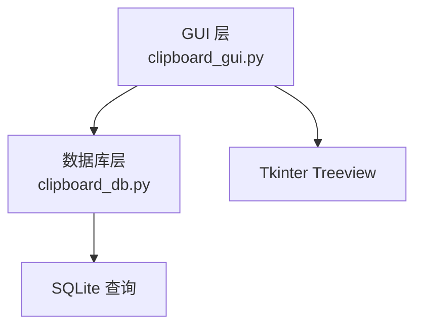
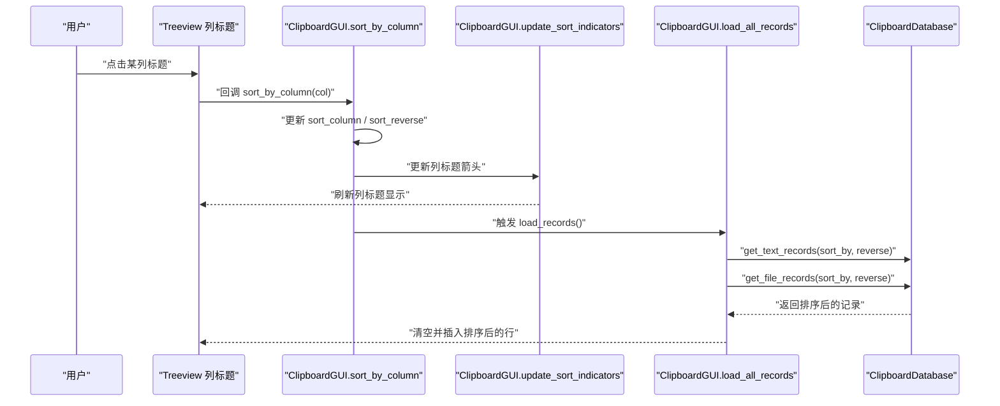
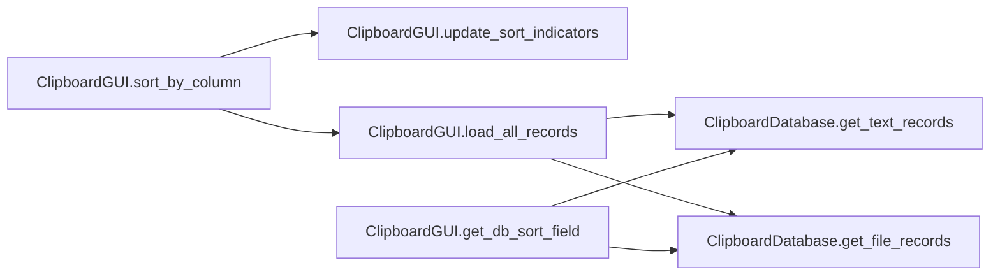

# 排序事件流程

<cite>
**本文引用的文件**
- [clipboard_gui.py](file://clipboard_gui.py)
- [clipboard_db.py](file://clipboard_db.py)
</cite>

## 目录
1. [简介](#简介)
2. [项目结构](#项目结构)
3. [核心组件](#核心组件)
4. [架构总览](#架构总览)
5. [详细组件分析](#详细组件分析)
6. [依赖关系分析](#依赖关系分析)
7. [性能考量](#性能考量)
8. [故障排查指南](#故障排查指南)
9. [结论](#结论)

## 简介
本文件聚焦于系统中“列点击排序”的事件处理机制，围绕 GUI 层的 sort_by_column 方法展开，解释其如何响应用户点击、维护 sort_column 与 sort_reverse 状态、通过 update_sort_indicators 更新 UI 指示器，并触发 load_records 重新加载数据以应用新的排序规则。文档同时说明排序方向切换逻辑与默认倒序行为的实现细节，剖析该设计如何与数据库查询解耦（采用内存中重新加载排序），并讨论对用户体验与性能的影响及潜在优化方向。

## 项目结构
- GUI 层负责界面交互与事件绑定，包含 Treeview 列标题点击事件、排序状态维护、UI 指示器更新与记录加载。
- 数据库层提供统一的数据访问接口，支持按字段与方向排序的查询能力。

图表来源
- [clipboard_gui.py](file://clipboard_gui.py#L238-L308)
- [clipboard_db.py](file://clipboard_db.py#L185-L261)

章节来源
- [clipboard_gui.py](file://clipboard_gui.py#L238-L308)
- [clipboard_db.py](file://clipboard_db.py#L185-L261)

## 核心组件
- GUI 中的排序入口：setup_records_tab 初始化默认排序列与方向，绑定各列标题点击事件至 sort_by_column。
- 排序状态：sort_column 与 sort_reverse 两个状态变量，分别表示当前排序列与排序方向。
- UI 指示器：update_sort_indicators 动态在列标题上添加上下箭头，直观反映当前排序方向。
- 数据加载：load_all_records 先清空 Treeview，再依据当前排序状态调用数据库接口获取记录，最后插入 UI。
- 数据库接口：get_text_records/get_file_records 支持按字段与方向排序，返回完整记录集。

章节来源
- [clipboard_gui.py](file://clipboard_gui.py#L238-L308)
- [clipboard_gui.py](file://clipboard_gui.py#L581-L626)
- [clipboard_db.py](file://clipboard_db.py#L185-L261)

## 架构总览
下面的序列图展示了“列点击 -> 状态更新 -> UI 指示器 -> 重新加载 -> 显示”的完整流程。

图表来源
- [clipboard_gui.py](file://clipboard_gui.py#L280-L308)
- [clipboard_gui.py](file://clipboard_gui.py#L581-L626)
- [clipboard_db.py](file://clipboard_db.py#L185-L261)

## 详细组件分析

### 排序入口与状态维护
- 列标题绑定：setup_records_tab 中为每个列标题绑定点击事件，使用偏函数将列名传入 sort_by_column。
- 默认状态：
  - 默认排序列：时间
  - 默认排序方向：倒序（True）
- 点击处理：
  - 若点击同一列：切换排序方向（sort_reverse 取反）
  - 若点击不同列：更新排序列为该列，并默认倒序（与原始行为一致）

章节来源
- [clipboard_gui.py](file://clipboard_gui.py#L238-L246)
- [clipboard_gui.py](file://clipboard_gui.py#L280-L294)

### UI 指示器更新
- update_sort_indicators 会遍历所有列标题，若当前列匹配 sort_column，则在标题文本后追加箭头：
  - 倒序：↓
  - 正序：↑
- 同时为每个列标题重新绑定点击事件，确保点击仍能回到 sort_by_column。

章节来源
- [clipboard_gui.py](file://clipboard_gui.py#L295-L308)

### 数据加载与排序应用
- load_all_records：
  - 清空 Treeview
  - 通过 get_db_sort_field 将界面列名映射为数据库字段名
  - 分别调用 get_text_records 与 get_file_records，并传入当前排序字段与方向
  - 将两类记录合并为统一格式，插入 Treeview
  - 最后更新统计信息显示

章节来源
- [clipboard_gui.py](file://clipboard_gui.py#L581-L626)
- [clipboard_gui.py](file://clipboard_gui.py#L627-L637)
- [clipboard_db.py](file://clipboard_db.py#L185-L261)

### 数据库排序实现
- get_text_records/get_file_records：
  - 根据 reverse 参数决定 ASC/DESC
  - 根据 sort_by 参数选择排序字段（如 content/char_count/number 或 file_size/file_type/filename 等）
  - 支持 limit/offset 分页（此处 GUI 层未使用分页参数，传入 None）
- get_all_records：用于全局聚合查询，按时间倒序返回文本与文件记录的联合结果。

章节来源
- [clipboard_db.py](file://clipboard_db.py#L185-L261)
- [clipboard_db.py](file://clipboard_db.py#L263-L279)

### 排序方向切换与默认倒序逻辑
- 切换逻辑：
  - 点击同一列：sort_reverse 取反
  - 点击不同列：更新 sort_column 并强制 sort_reverse 为 True（默认倒序）
- UI 表达：
  - 通过 update_sort_indicators 在列标题后添加箭头，直观反馈当前方向

章节来源
- [clipboard_gui.py](file://clipboard_gui.py#L280-L308)

### 与数据库查询的解耦与内存重排序
- 设计要点：
  - GUI 层在每次排序时先从数据库获取全部记录（未分页），然后在内存中进行统一排序与合并，再插入 UI。
  - 数据库层提供按字段与方向排序的查询能力，但 GUI 层并未使用 limit/offset，而是全量加载。
- 用户体验影响：
  - 优点：排序即时、UI 一致性好、可跨类型记录统一排序。
  - 缺点：当记录量较大时，内存占用与排序开销上升，首次排序可能较慢。
- 性能影响：
  - 数据库侧：按字段排序，SQL 执行成本与索引相关。
  - GUI 侧：Python 层对完整列表进行排序，时间复杂度 O(n log n)，空间复杂度 O(n)。

章节来源
- [clipboard_gui.py](file://clipboard_gui.py#L581-L626)
- [clipboard_db.py](file://clipboard_db.py#L185-L261)

### 搜索场景下的排序差异
- 搜索结果排序：search_records 之后调用 sort_search_results，在内存中对搜索结果进行排序并插入 UI。
- 数值字段处理：针对“大小”“次数”等列，提供数值解析与排序，异常时回退到按时间排序。
- 与主记录排序的区别：搜索结果排序完全在 GUI 层完成，不依赖数据库层的排序参数。

章节来源
- [clipboard_gui.py](file://clipboard_gui.py#L652-L748)

## 依赖关系分析
- GUI 依赖数据库层提供的查询接口，传入排序字段与方向。
- GUI 通过 get_db_sort_field 将界面列名映射到数据库字段名，避免硬编码。
- UI 指示器与事件绑定相互作用，形成闭环。

图表来源
- [clipboard_gui.py](file://clipboard_gui.py#L280-L308)
- [clipboard_gui.py](file://clipboard_gui.py#L581-L637)
- [clipboard_db.py](file://clipboard_db.py#L185-L261)

章节来源
- [clipboard_gui.py](file://clipboard_gui.py#L280-L308)
- [clipboard_gui.py](file://clipboard_gui.py#L581-L637)
- [clipboard_db.py](file://clipboard_db.py#L185-L261)

## 性能考量
- 当前实现：
  - 全量加载：GUI 层未使用 limit/offset，导致每次排序都加载全部记录，内存与 CPU 开销随记录数线性增长。
  - 内存排序：Python 层对完整列表进行排序，适合中小规模数据，大规模数据可能卡顿。
- 优化建议：
  - 引入分页加载：在 load_all_records 中传入 limit/offset，仅加载可见范围内的记录，减少内存占用与排序成本。
  - 增加数据库索引：为常用排序字段（如 timestamp、file_size、number）建立索引，降低 SQL 排序成本。
  - 延迟排序：在用户快速连续点击时，延迟执行排序（如去抖），减少频繁重载。
  - 结果缓存：对当前筛选条件与排序状态的结果进行缓存，避免重复查询与排序。
  - 异步加载：将数据库查询与 UI 更新分离到后台线程，避免阻塞主线程。

[本节为通用性能建议，不直接分析具体文件，故无章节来源]

## 故障排查指南
- 现象：点击列标题无反应
  - 检查列标题是否正确绑定 sort_by_column（setup_records_tab 中的 heading 绑定）。
  - 确认 update_sort_indicators 是否被调用且重新绑定了点击事件。
- 现象：排序方向未切换
  - 检查 sort_by_column 的分支逻辑：点击同一列应切换 sort_reverse。
- 现象：UI 箭头不显示或显示错误
  - 检查 update_sort_indicators 中的箭头拼接逻辑与 sort_column/sort_reverse 的对应关系。
- 现象：排序结果异常（数值列）
  - 检查 sort_search_results 中对“大小”“次数”的数值解析与排序逻辑，确保异常时回退到按时间排序。
- 现象：大数据量时卡顿
  - 考虑引入分页与异步加载策略，减少一次性加载与排序的数据量。

章节来源
- [clipboard_gui.py](file://clipboard_gui.py#L238-L308)
- [clipboard_gui.py](file://clipboard_gui.py#L581-L748)
- [clipboard_db.py](file://clipboard_db.py#L185-L261)

## 结论
本系统通过 GUI 事件驱动与数据库查询解耦的方式实现了灵活的列点击排序。sort_by_column 负责状态维护与 UI 指示器更新，load_all_records 负责数据加载与内存排序，二者协同保证了排序的即时性与一致性。当前实现默认全量加载与内存排序，适合中小规模数据；对于大规模数据，建议引入分页、索引与异步策略以提升性能与用户体验。