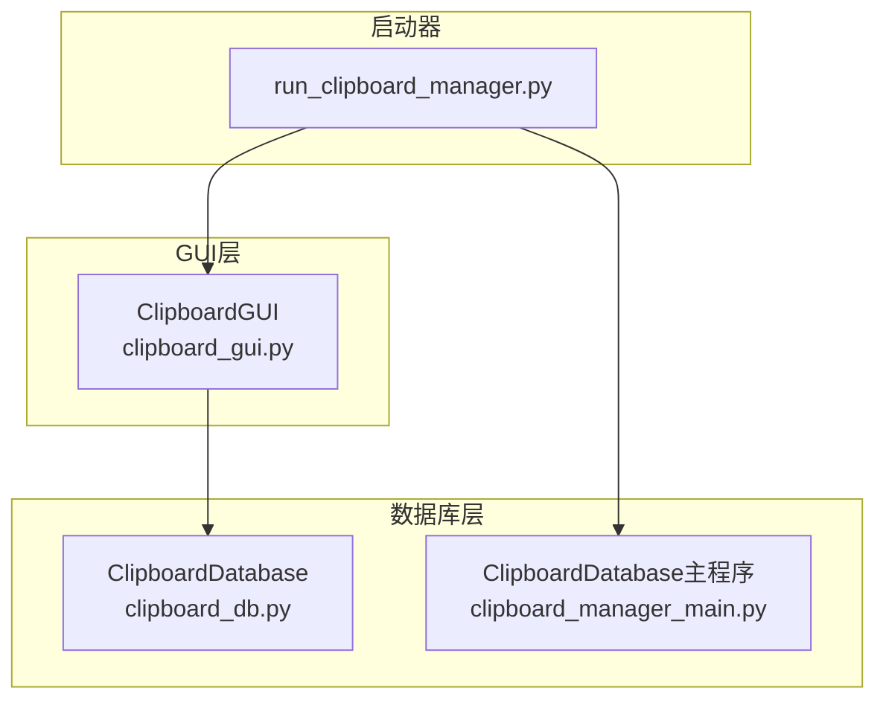
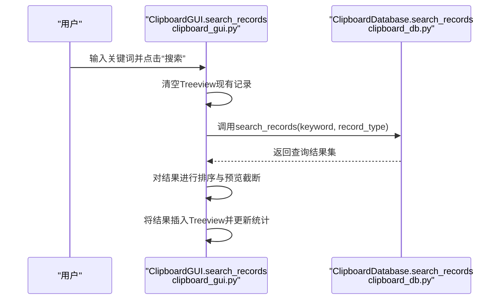
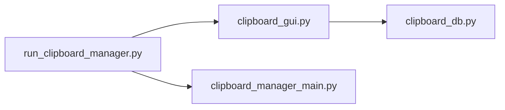

# 搜索事件流程

<cite>
**本文引用的文件**
- [clipboard_gui.py](file://clipboard_gui.py)
- [clipboard_manager_main.py](file://clipboard_manager_main.py)
- [clipboard_db.py](file://clipboard_db.py)
- [run_clipboard_manager.py](file://run_clipboard_manager.py)
</cite>

## 目录
1. [简介](#简介)
2. [项目结构](#项目结构)
3. [核心组件](#核心组件)
4. [架构总览](#架构总览)
5. [详细组件分析](#详细组件分析)
6. [依赖关系分析](#依赖关系分析)
7. [性能考量](#性能考量)
8. [故障排查指南](#故障排查指南)
9. [结论](#结论)

## 简介
本文围绕“搜索功能的事件驱动流程”展开，从GUI的search_records方法获取关键词与类型开始，逐步分析：
- 如何清空Treeview组件的现有记录
- 如何调用数据库的search_records方法执行SQL查询
- 数据库层如何根据文本、文件或全部类型构建不同查询语句，并支持模糊匹配
- 查询结果如何返回并重新插入到GUI的文本和文件Treeview中，以及内容预览截断处理
- 参数传递与数据流的实际代码示例路径
- 可能的性能瓶颈与优化策略（LIMIT限制、索引使用）

## 项目结构
该项目采用“GUI + 数据库 + 启动器”的分层组织：
- GUI层负责用户交互与界面展示（clipboard_gui.py）
- 数据库层封装SQLite访问与查询（clipboard_db.py）
- 主程序层提供另一种GUI界面（clipboard_manager_main.py），其中也包含数据库接口
- 启动器负责进程互斥与主线程调度（run_clipboard_manager.py）

图表来源
- [clipboard_gui.py](file://clipboard_gui.py#L1-L120)
- [clipboard_db.py](file://clipboard_db.py#L1-L60)
- [clipboard_manager_main.py](file://clipboard_manager_main.py#L1-L60)
- [run_clipboard_manager.py](file://run_clipboard_manager.py#L1-L40)

章节来源
- [clipboard_gui.py](file://clipboard_gui.py#L1-L120)
- [clipboard_db.py](file://clipboard_db.py#L1-L60)
- [clipboard_manager_main.py](file://clipboard_manager_main.py#L1-L60)
- [run_clipboard_manager.py](file://run_clipboard_manager.py#L1-L40)

## 核心组件
- GUI层（ClipboardGUI）：提供搜索入口、清空Treeview、调用数据库搜索、排序与展示
- 数据库层（ClipboardDatabase）：封装SQLite连接、表结构、查询与统计
- 启动器（run_clipboard_manager）：进程互斥、主线程调度、隐藏主窗体、托盘图标

章节来源
- [clipboard_gui.py](file://clipboard_gui.py#L652-L748)
- [clipboard_db.py](file://clipboard_db.py#L281-L314)
- [run_clipboard_manager.py](file://run_clipboard_manager.py#L1-L71)

## 架构总览
搜索事件的端到端流程如下：
1. 用户在GUI搜索框输入关键词并点击“搜索”
2. GUI调用自身search_records方法
3. GUI清空Treeview现有记录
4. GUI调用数据库search_records方法传入关键词与类型
5. 数据库根据类型构造LIKE模糊查询并返回结果
6. GUI对结果进行二次排序与预览截断
7. GUI将结果插入对应Treeview并更新统计

图表来源
- [clipboard_gui.py](file://clipboard_gui.py#L652-L748)
- [clipboard_db.py](file://clipboard_db.py#L281-L314)

## 详细组件分析

### GUI层：搜索入口与结果展示
- 搜索入口绑定到“搜索”按钮，调用search_records
- 清空Treeview：遍历并删除所有子项
- 调用数据库search_records，传入关键词与类型
- 对结果进行排序与预览截断，再插入Treeview

关键实现路径
- 搜索按钮绑定与UI布局：[clipboard_gui.py](file://clipboard_gui.py#L172-L206)
- 清空Treeview与调用数据库：[clipboard_gui.py](file://clipboard_gui.py#L652-L667)
- 结果排序与预览截断：[clipboard_gui.py](file://clipboard_gui.py#L668-L748)
- 内容预览截断工具方法：[clipboard_gui.py](file://clipboard_gui.py#L124-L133)

章节来源
- [clipboard_gui.py](file://clipboard_gui.py#L172-L206)
- [clipboard_gui.py](file://clipboard_gui.py#L652-L748)
- [clipboard_gui.py](file://clipboard_gui.py#L124-L133)

### 数据库层：SQL查询构建与模糊匹配
- 支持三种类型：text、file、all
- 使用LIKE进行模糊匹配，通配符包裹关键词
- all类型通过UNION ALL合并文本与文件查询
- 返回结果包含类型标识、记录ID、信息字段、时间等

关键实现路径
- 模糊匹配与类型分支：[clipboard_db.py](file://clipboard_db.py#L281-L314)

章节来源
- [clipboard_db.py](file://clipboard_db.py#L281-L314)

### 时间范围过滤与LIMIT限制
- 主程序版本的数据库接口支持start_date与end_date参数，可实现时间范围过滤
- 主程序版本在查询末尾追加ORDER BY timestamp DESC与LIMIT 30，限制返回数量

关键实现路径
- 时间范围过滤与LIMIT：[clipboard_manager_main.py](file://clipboard_manager_main.py#L213-L260)

章节来源
- [clipboard_manager_main.py](file://clipboard_manager_main.py#L213-L260)

### 结果插入与预览截断
- GUI对文本内容进行预览截断，避免过长显示影响性能与可读性
- 文件记录显示文件名、类型、大小、时间等字段
- 插入Treeview时使用values元组，保证列对齐

关键实现路径
- 预览截断与插入：[clipboard_gui.py](file://clipboard_gui.py#L668-L748)

章节来源
- [clipboard_gui.py](file://clipboard_gui.py#L668-L748)

### 排序逻辑
- GUI根据当前列与排序方向对结果进行二次排序
- 数值型字段（大小、次数）做数值解析，非数值回退到按时间排序

关键实现路径
- 排序与回退逻辑：[clipboard_gui.py](file://clipboard_gui.py#L700-L744)

章节来源
- [clipboard_gui.py](file://clipboard_gui.py#L700-L744)

## 依赖关系分析
- GUI依赖数据库层提供的search_records接口
- 启动器负责创建GUI实例并运行主线程，避免重复启动
- 主程序版本提供另一种GUI界面，其数据库接口支持时间范围过滤与LIMIT

图表来源
- [run_clipboard_manager.py](file://run_clipboard_manager.py#L32-L71)
- [clipboard_gui.py](file://clipboard_gui.py#L1-L120)
- [clipboard_db.py](file://clipboard_db.py#L1-L60)
- [clipboard_manager_main.py](file://clipboard_manager_main.py#L1-L60)

章节来源
- [run_clipboard_manager.py](file://run_clipboard_manager.py#L32-L71)
- [clipboard_gui.py](file://clipboard_gui.py#L1-L120)
- [clipboard_db.py](file://clipboard_db.py#L1-L60)
- [clipboard_manager_main.py](file://clipboard_manager_main.py#L1-L60)

## 性能考量
- 模糊匹配LIKE：关键词两侧通配符可能导致全表扫描，建议在高频关键词场景下考虑建立全文检索或索引
- LIMIT限制：主程序版本默认LIMIT 30，有效控制返回量；GUI版本未显式LIMIT，建议在大数据量时统一加入LIMIT
- 二次排序：GUI对结果再次排序，若结果集较大，建议在数据库层完成排序以减少内存拷贝
- 预览截断：对长文本进行截断，避免渲染开销过大
- 索引建议：对content、filename、timestamp等常用查询字段建立索引，可显著提升模糊匹配与排序性能

章节来源
- [clipboard_db.py](file://clipboard_db.py#L281-L314)
- [clipboard_manager_main.py](file://clipboard_manager_main.py#L213-L260)
- [clipboard_gui.py](file://clipboard_gui.py#L668-L748)

## 故障排查指南
- 关键词无效或无结果
  - 检查关键词是否正确传入GUI的search_records
  - 确认数据库search_records是否正确执行（LIKE模糊匹配）
  - 参考路径：[clipboard_gui.py](file://clipboard_gui.py#L652-L667)、[clipboard_db.py](file://clipboard_db.py#L281-L314)
- Treeview未更新
  - 确认清空逻辑是否执行
  - 确认排序与插入逻辑是否正常
  - 参考路径：[clipboard_gui.py](file://clipboard_gui.py#L658-L748)
- 性能缓慢
  - 建议在数据库层增加索引或使用LIMIT
  - 参考路径：[clipboard_manager_main.py](file://clipboard_manager_main.py#L213-L260)
- 进程重复启动
  - 检查互斥锁逻辑
  - 参考路径：[run_clipboard_manager.py](file://run_clipboard_manager.py#L17-L46)

章节来源
- [clipboard_gui.py](file://clipboard_gui.py#L652-L748)
- [clipboard_db.py](file://clipboard_db.py#L281-L314)
- [clipboard_manager_main.py](file://clipboard_manager_main.py#L213-L260)
- [run_clipboard_manager.py](file://run_clipboard_manager.py#L17-L46)

## 结论
- 事件驱动流程清晰：GUI触发、数据库执行、GUI渲染
- 模糊匹配与类型筛选满足常见搜索需求
- 主程序版本提供了时间范围过滤与LIMIT限制，有利于性能控制
- 建议在数据库层完善索引与排序策略，统一加入LIMIT，以进一步提升性能与用户体验