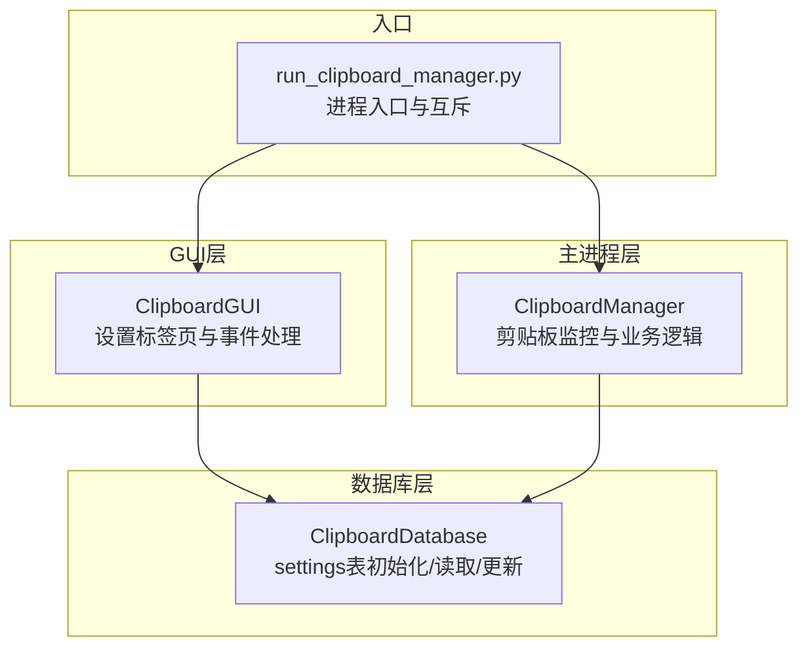
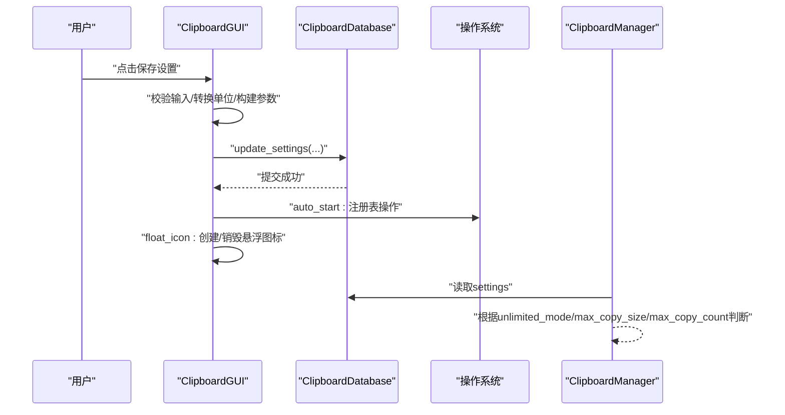
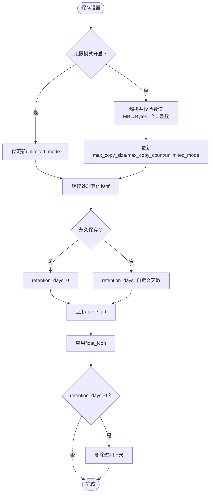
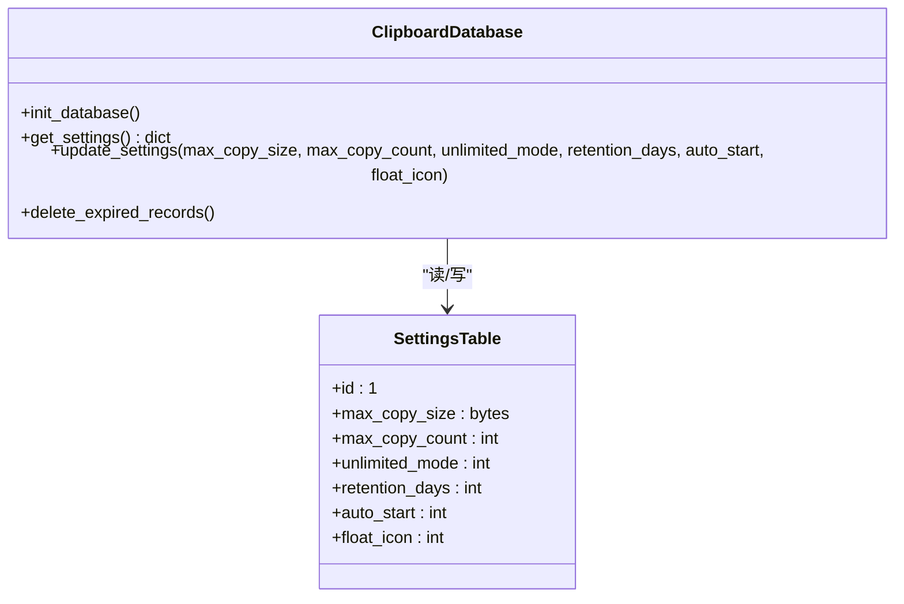
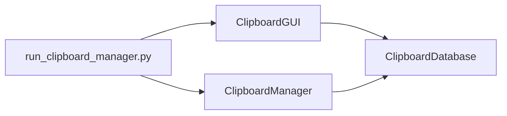

# 设置更新事件流程

<cite>
**本文引用的文件**
- [clipboard_gui.py](file://clipboard_gui.py)
- [clipboard_db.py](file://clipboard_db.py)
- [clipboard_manager_main.py](file://clipboard_manager_main.py)
- [run_clipboard_manager.py](file://run_clipboard_manager.py)
</cite>

## 目录
1. [简介](#简介)
2. [项目结构](#项目结构)
3. [核心组件](#核心组件)
4. [架构总览](#架构总览)
5. [详细组件分析](#详细组件分析)
6. [依赖关系分析](#依赖关系分析)
7. [性能考量](#性能考量)
8. [故障排查指南](#故障排查指南)
9. [结论](#结论)

## 简介
本文围绕“设置标签页”的事件驱动机制展开，系统性阐述用户在设置界面修改参数后，如何通过GUI层调用数据库层的update_settings方法更新settings表，并解释各设置项（如max_copy_size、auto_start、float_icon等）的条件更新逻辑、布尔值转整数存储策略，以及设置变更对系统行为的影响（开机自启注册表操作、悬浮图标显示控制）。同时提供错误处理建议、原子性与一致性保障思路，以及跨平台兼容性注意事项。

## 项目结构
本仓库采用“GUI + 数据库 + 主进程”的分层设计：
- GUI层负责用户交互与事件绑定（设置标签页、按钮点击、开机自启与悬浮图标控制）
- 数据库层负责settings表的初始化、读取与更新
- 主进程层负责剪贴板监控与业务逻辑（受设置约束）

图表来源
- [clipboard_gui.py](file://clipboard_gui.py#L329-L533)
- [clipboard_db.py](file://clipboard_db.py#L77-L114)
- [clipboard_manager_main.py](file://clipboard_manager_main.py#L355-L394)
- [run_clipboard_manager.py](file://run_clipboard_manager.py#L32-L69)

章节来源
- [clipboard_gui.py](file://clipboard_gui.py#L329-L533)
- [clipboard_db.py](file://clipboard_db.py#L77-L114)
- [clipboard_manager_main.py](file://clipboard_manager_main.py#L355-L394)
- [run_clipboard_manager.py](file://run_clipboard_manager.py#L32-L69)

## 核心组件
- ClipboardGUI：设置标签页UI、事件绑定、调用数据库更新、执行系统行为（开机自启、悬浮图标）
- ClipboardDatabase：settings表初始化、读取、更新、过期记录清理
- ClipboardManager：剪贴板监控与业务逻辑，读取settings决定行为
- run_clipboard_manager.py：进程入口，避免重复运行，启动GUI与后台监控线程

章节来源
- [clipboard_gui.py](file://clipboard_gui.py#L329-L533)
- [clipboard_db.py](file://clipboard_db.py#L359-L412)
- [clipboard_manager_main.py](file://clipboard_manager_main.py#L355-L394)
- [run_clipboard_manager.py](file://run_clipboard_manager.py#L32-L69)

## 架构总览
设置更新的端到端流程如下：
1. 用户在设置标签页修改参数并点击“保存设置”
2. GUI层校验输入、构造参数，调用数据库层update_settings
3. 数据库层将布尔值转换为整数写入settings表
4. GUI层根据auto_start与float_icon触发系统行为
5. 主进程层在后续剪贴板监控中读取settings，决定是否放行复制

图表来源
- [clipboard_gui.py](file://clipboard_gui.py#L477-L533)
- [clipboard_db.py](file://clipboard_db.py#L387-L412)
- [clipboard_manager_main.py](file://clipboard_manager_main.py#L362-L394)

## 详细组件分析

### 设置标签页与事件绑定
- 设置标签页包含：
  - 复制限制设置：无限模式、最大复制大小（MB）、最大复制文件数量
  - 记录保存设置：永久保存或自定义天数
  - 系统设置：开机自启
  - 悬浮图标设置：启用悬浮图标
  - 数据管理：重置所有记录
- 事件绑定：
  - “保存设置”按钮绑定到save_settings
  - “恢复默认”按钮绑定到reset_to_default_settings
  - 无限模式复选框trace监听，动态禁用/启用相关输入框

章节来源
- [clipboard_gui.py](file://clipboard_gui.py#L329-L462)
- [clipboard_gui.py](file://clipboard_gui.py#L477-L554)

### save_settings：条件更新与数据转换
- 输入校验与转换：
  - 无限模式开启时，仅更新unlimited_mode
  - 无限模式关闭时，校验并转换“最大复制大小（MB）→字节”，“最大复制数量（个）→整数”，随后更新max_copy_size、max_copy_count、unlimited_mode
  - 记录保存天数：若选择“永久保存”，retention_days=0；否则取自定义天数
  - 开机自启与悬浮图标：分别读取布尔值
- 条件更新：
  - 仅当对应参数非None时才执行UPDATE语句，避免误更新其他字段
- 过期记录清理：
  - 当retention_days>0时，调用delete_expired_records删除过期记录
- 系统行为：
  - set_auto_start根据auto_start启用/禁用开机自启
  - handle_float_icon根据float_icon创建/销毁悬浮图标

图表来源
- [clipboard_gui.py](file://clipboard_gui.py#L477-L533)
- [clipboard_db.py](file://clipboard_db.py#L413-L455)

章节来源
- [clipboard_gui.py](file://clipboard_gui.py#L477-L533)

### 数据库层：settings表结构与更新
- 表结构要点：
  - settings表id=1，max_copy_size（字节）、max_copy_count（整数）、unlimited_mode（整数）
  - 后续迁移中新增字段：retention_days（整数，默认0）、auto_start（整数，默认1）、float_icon（整数，默认1）
- 初始化与默认值：
  - 若settings不存在，插入默认值（max_copy_size=300MB，max_copy_count=100，unlimited_mode=0）
  - 新增字段通过ALTER TABLE兼容性添加
- 读取：
  - get_settings返回字典，其中unlimited_mode/auto_start/float_icon转换为布尔值
- 更新：
  - update_settings按需更新字段，布尔值统一转换为整数（int(bool_val)）
  - 采用单连接事务式提交，保证单一设置项的原子性

图表来源
- [clipboard_db.py](file://clipboard_db.py#L77-L114)
- [clipboard_db.py](file://clipboard_db.py#L359-L412)

章节来源
- [clipboard_db.py](file://clipboard_db.py#L77-L114)
- [clipboard_db.py](file://clipboard_db.py#L359-L412)

### 剪贴板监控与设置生效
- ClipboardManager在process_clipboard_content中读取settings：
  - unlimited_mode：无限模式直接放行
  - max_copy_count：限制一次复制文件数量
  - max_copy_size：限制单个文件与总大小
- 该流程体现了设置变更对系统行为的直接影响。

章节来源
- [clipboard_manager_main.py](file://clipboard_manager_main.py#L362-L394)

### 系统行为：开机自启与悬浮图标
- 开机自启（Windows注册表）：
  - set_auto_start通过winreg在HKCU\Software\Microsoft\Windows\CurrentVersion\Run下写入/删除值
  - 依据enable布尔值决定启用或禁用
- 悬浮图标：
  - handle_float_icon根据布尔值创建或销毁悬浮图标
  - create_float_icon创建Toplevel窗口，设置置顶、透明度、可拖拽、点击/双击事件
  - destroy_float_icon销毁已有悬浮图标

章节来源
- [clipboard_gui.py](file://clipboard_gui.py#L1133-L1172)
- [clipboard_gui.py](file://clipboard_gui.py#L1164-L1234)
- [clipboard_gui.py](file://clipboard_gui.py#L1173-L1234)

## 依赖关系分析
- GUI层依赖数据库层的get_settings/update_settings
- 主进程层依赖数据库层的get_settings
- 进程入口通过互斥避免重复运行

图表来源
- [clipboard_gui.py](file://clipboard_gui.py#L329-L533)
- [clipboard_db.py](file://clipboard_db.py#L359-L412)
- [clipboard_manager_main.py](file://clipboard_manager_main.py#L355-L394)
- [run_clipboard_manager.py](file://run_clipboard_manager.py#L32-L69)

章节来源
- [clipboard_gui.py](file://clipboard_gui.py#L329-L533)
- [clipboard_db.py](file://clipboard_db.py#L359-L412)
- [clipboard_manager_main.py](file://clipboard_manager_main.py#L355-L394)
- [run_clipboard_manager.py](file://run_clipboard_manager.py#L32-L69)

## 性能考量
- 单次设置更新为轻量级事务，涉及少量UPDATE语句，性能开销极低
- 过期记录清理在retention_days>0时触发，建议在用户保存设置后异步执行，避免阻塞主线程
- 悬浮图标面板内容来自数据库查询，建议限制查询条数（如50条），避免UI卡顿
- 剪贴板监控频率较低（默认1秒），对CPU占用影响有限

## 故障排查指南
- 保存设置时报“请输入有效的数字”：
  - 检查无限模式关闭时，最大复制大小与最大复制数量输入是否为合法数值
  - 确认MB到字节转换逻辑未产生非法值
- 开机自启设置无效：
  - 确认set_auto_start调用成功且无异常
  - 检查Windows注册表权限与路径是否正确
- 悬浮图标无法显示或消失：
  - 检查handle_float_icon与create_float_icon/destroy_float_icon调用链
  - 确认图片资源是否存在，或回退到默认背景
- 设置未生效：
  - 确认update_settings已提交（数据库层commit）
  - 确认主进程层读取settings的时机（剪贴板监控循环中）

章节来源
- [clipboard_gui.py](file://clipboard_gui.py#L477-L533)
- [clipboard_gui.py](file://clipboard_gui.py#L1133-L1172)
- [clipboard_gui.py](file://clipboard_gui.py#L1164-L1234)
- [clipboard_db.py](file://clipboard_db.py#L387-L412)

## 结论
- 设置更新采用事件驱动：GUI层收集用户输入、进行条件判断与数据转换，调用数据库层update_settings，随后执行系统行为（注册表与悬浮图标）
- 数据一致性通过单连接事务与字段级UPDATE实现，布尔值统一转换为整数存储，确保跨版本兼容
- 设置变更直接影响剪贴板监控逻辑（无限模式、数量与大小限制），体现“配置即策略”的设计
- 建议在生产环境中：
  - 为设置更新增加事务封装，确保多字段更新的原子性
  - 对系统行为（注册表、悬浮图标）增加幂等性与回滚策略
  - 对跨平台场景（macOS/Linux）提供条件编译与替代方案