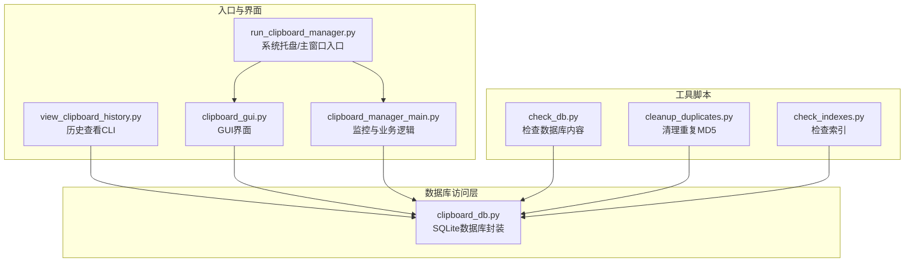
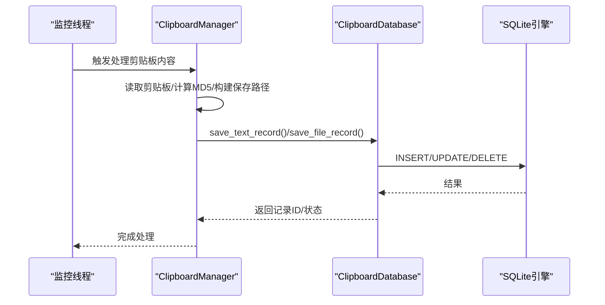
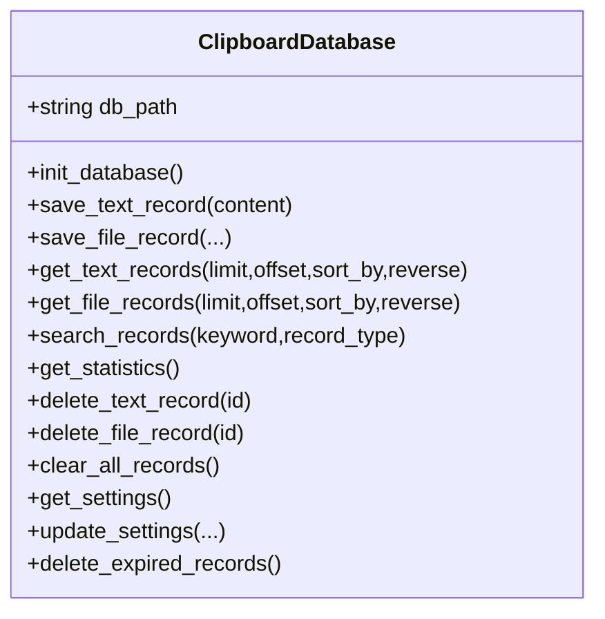
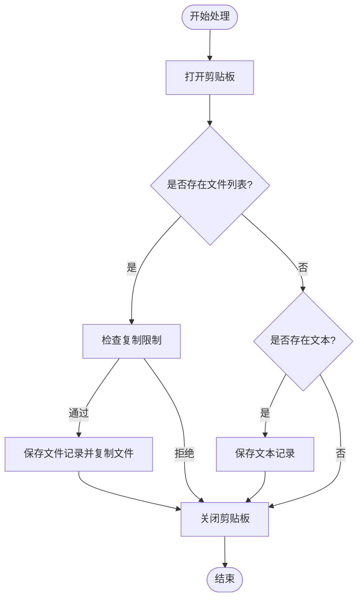
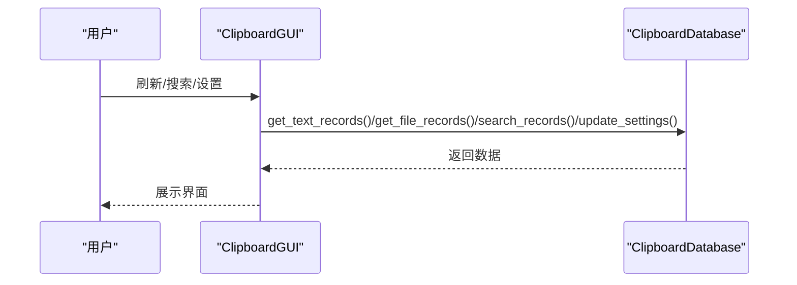
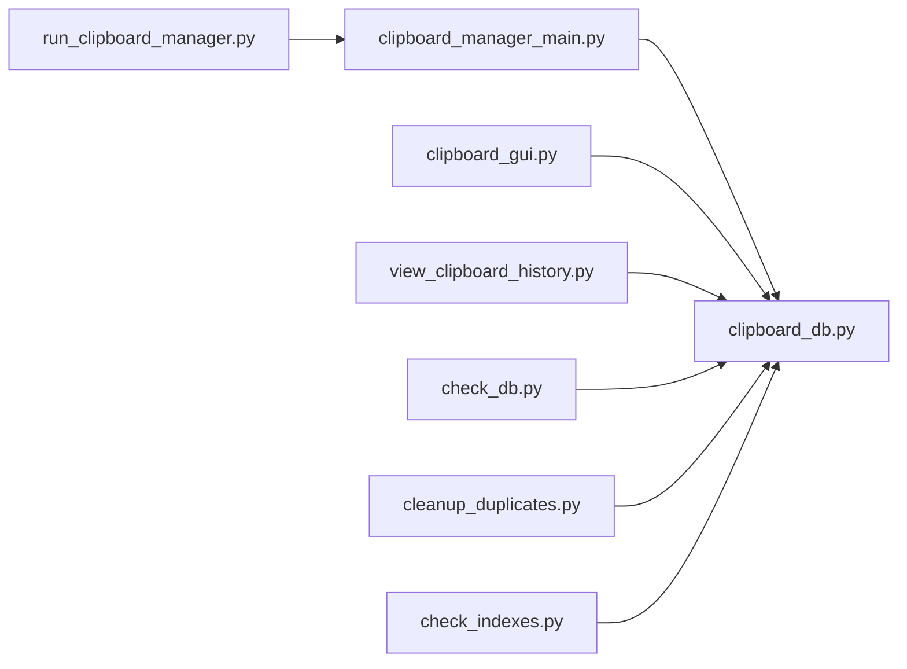

# 事务管理

<cite>
**本文引用的文件**
- [clipboard_db.py](file://clipboard_db.py)
- [clipboard_manager_main.py](file://clipboard_manager_main.py)
- [clipboard_gui.py](file://clipboard_gui.py)
- [run_clipboard_manager.py](file://run_clipboard_manager.py)
- [view_clipboard_history.py](file://view_clipboard_history.py)
- [check_db.py](file://check_db.py)
- [cleanup_duplicates.py](file://cleanup_duplicates.py)
- [check_indexes.py](file://check_indexes.py)
</cite>

## 目录
1. [简介](#简介)
2. [项目结构](#项目结构)
3. [核心组件](#核心组件)
4. [架构总览](#架构总览)
5. [详细组件分析](#详细组件分析)
6. [依赖关系分析](#依赖关系分析)
7. [性能考量](#性能考量)
8. [故障排查指南](#故障排查指南)
9. [结论](#结论)
10. [附录](#附录)

## 简介
本文件围绕应用程序中的数据库事务管理机制展开，重点覆盖以下方面：
- 数据插入、更新、删除操作中的事务使用方式，包括事务的开始、提交与回滚处理
- 多线程环境下事务的线程安全性问题及数据库锁定、死锁规避策略
- 事务隔离级别对数据一致性的影响，以及在不同操作场景下的事务管理策略
- 实际代码示例路径展示事务管理最佳实践与常见问题的解决方案

通过对仓库中数据库访问层、业务逻辑层与GUI/CLI入口的综合分析，本文给出可操作的建议与可视化图示，帮助读者在保持数据一致性的前提下提升系统稳定性与性能。

## 项目结构
该项目采用“模块化+职责分离”的组织方式：
- 数据库访问层：统一在数据库模块中封装连接、DDL/DML与查询逻辑
- 业务逻辑层：负责业务规则（如去重、限额、过期清理等）
- 入口与界面层：提供GUI、CLI与系统托盘入口，并在独立线程中运行监控任务

图表来源
- [run_clipboard_manager.py](file://run_clipboard_manager.py#L1-L71)
- [clipboard_gui.py](file://clipboard_gui.py#L1-L120)
- [clipboard_manager_main.py](file://clipboard_manager_main.py#L1-L120)
- [view_clipboard_history.py](file://view_clipboard_history.py#L1-L75)
- [clipboard_db.py](file://clipboard_db.py#L1-L120)
- [check_db.py](file://check_db.py#L1-L31)
- [cleanup_duplicates.py](file://cleanup_duplicates.py#L1-L67)
- [check_indexes.py](file://check_indexes.py#L1-L27)

章节来源
- [run_clipboard_manager.py](file://run_clipboard_manager.py#L1-L71)
- [clipboard_gui.py](file://clipboard_gui.py#L1-L120)
- [clipboard_manager_main.py](file://clipboard_manager_main.py#L1-L120)
- [view_clipboard_history.py](file://view_clipboard_history.py#L1-L75)
- [clipboard_db.py](file://clipboard_db.py#L1-L120)
- [check_db.py](file://check_db.py#L1-L31)
- [cleanup_duplicates.py](file://cleanup_duplicates.py#L1-L67)
- [check_indexes.py](file://check_indexes.py#L1-L27)

## 核心组件
- 数据库封装类：统一负责数据库初始化、表结构维护、增删改查、统计与过期清理
- 业务逻辑类：负责剪贴板监控、内容处理、去重与限额校验
- GUI/CLI入口：提供交互界面与命令行工具，分别调用数据库封装与业务逻辑

章节来源
- [clipboard_db.py](file://clipboard_db.py#L1-L120)
- [clipboard_manager_main.py](file://clipboard_manager_main.py#L1-L120)
- [clipboard_gui.py](file://clipboard_gui.py#L1-L120)

## 架构总览
数据库访问层通过独立连接执行每条SQL语句，成功后显式提交，异常时回滚。业务层在多处调用数据库封装，GUI/CLI入口在独立线程中运行监控任务，避免阻塞主线程。

图表来源
- [clipboard_manager_main.py](file://clipboard_manager_main.py#L395-L496)
- [clipboard_db.py](file://clipboard_db.py#L116-L183)

章节来源
- [clipboard_manager_main.py](file://clipboard_manager_main.py#L395-L496)
- [clipboard_db.py](file://clipboard_db.py#L116-L183)

## 详细组件分析

### 数据库封装层（ClipboardDatabase）
- 初始化与表结构维护：在初始化阶段创建必要表与索引，保证唯一性约束与查询效率
- 插入与更新策略：针对重复MD5采用INSERT失败后UPDATE的方式，避免重复写入并累加计数
- 删除与清理：提供按ID删除、清空表、按时间阈值删除过期记录等功能
- 统计与查询：提供统计信息与通用查询接口，支持排序与分页

图表来源
- [clipboard_db.py](file://clipboard_db.py#L1-L455)

章节来源
- [clipboard_db.py](file://clipboard_db.py#L1-L455)

### 业务逻辑层（ClipboardManager）
- 剪贴板监控：在独立线程中周期性检查剪贴板内容，区分文件与文本两类
- 去重与限额：基于MD5去重，结合设置中的大小与数量限制进行校验
- 文件保存：计算MD5、分类目录、生成唯一文件名并复制到目标路径

图表来源
- [clipboard_manager_main.py](file://clipboard_manager_main.py#L395-L496)

章节来源
- [clipboard_manager_main.py](file://clipboard_manager_main.py#L395-L496)

### GUI与入口层
- GUI界面：提供记录浏览、搜索、统计与设置管理，内部调用数据库封装
- CLI查看器：输出历史记录与统计信息
- 系统托盘入口：在独立线程中运行监控，主窗口默认隐藏

图表来源
- [clipboard_gui.py](file://clipboard_gui.py#L581-L626)
- [clipboard_db.py](file://clipboard_db.py#L185-L261)

章节来源
- [clipboard_gui.py](file://clipboard_gui.py#L581-L626)
- [clipboard_db.py](file://clipboard_db.py#L185-L261)

## 依赖关系分析
- 数据库封装被多个入口模块共享调用，形成清晰的单点数据访问层
- 业务逻辑层与GUI/CLI入口之间通过数据库封装解耦，便于扩展与测试
- 工具脚本独立于主流程，用于诊断与维护

图表来源
- [clipboard_manager_main.py](file://clipboard_manager_main.py#L1-L120)
- [clipboard_gui.py](file://clipboard_gui.py#L1-L120)
- [view_clipboard_history.py](file://view_clipboard_history.py#L1-L75)
- [run_clipboard_manager.py](file://run_clipboard_manager.py#L1-L71)
- [clipboard_db.py](file://clipboard_db.py#L1-L120)
- [check_db.py](file://check_db.py#L1-L31)
- [cleanup_duplicates.py](file://cleanup_duplicates.py#L1-L67)
- [check_indexes.py](file://check_indexes.py#L1-L27)

章节来源
- [clipboard_manager_main.py](file://clipboard_manager_main.py#L1-L120)
- [clipboard_gui.py](file://clipboard_gui.py#L1-L120)
- [view_clipboard_history.py](file://view_clipboard_history.py#L1-L75)
- [run_clipboard_manager.py](file://run_clipboard_manager.py#L1-L71)
- [clipboard_db.py](file://clipboard_db.py#L1-L120)
- [check_db.py](file://check_db.py#L1-L31)
- [cleanup_duplicates.py](file://cleanup_duplicates.py#L1-L67)
- [check_indexes.py](file://check_indexes.py#L1-L27)

## 性能考量
- 连接生命周期：每个操作均新建连接并在完成后关闭，避免长时间持有连接导致资源占用
- 唯一性约束：通过MD5哈希与唯一索引减少重复数据，降低存储与查询成本
- 排序与分页：查询接口支持排序与分页，避免一次性加载大量数据
- 过期清理：按设定天数定期清理过期记录，控制数据库规模

章节来源
- [clipboard_db.py](file://clipboard_db.py#L1-L120)
- [clipboard_db.py](file://clipboard_db.py#L350-L455)

## 故障排查指南
- 插入冲突与去重：当MD5冲突时，系统会更新计数而非抛出异常，确保幂等性
- 连接与提交：所有写操作均显式提交，若出现异常需检查异常捕获与日志输出
- 过期清理：确认设置中的保留天数，避免误删或未删
- 索引与重复：使用工具脚本检查索引与重复MD5，必要时执行清理脚本

章节来源
- [clipboard_db.py](file://clipboard_db.py#L116-L183)
- [clipboard_db.py](file://clipboard_db.py#L413-L455)
- [check_db.py](file://check_db.py#L1-L31)
- [cleanup_duplicates.py](file://cleanup_duplicates.py#L1-L67)
- [check_indexes.py](file://check_indexes.py#L1-L27)

## 结论
本项目在数据库事务管理上采取“每操作一连接、显式提交”的简单而稳健的策略，配合唯一性约束与去重逻辑，有效保障了数据一致性与性能。在多线程环境下，通过独立线程运行监控任务与GUI，避免了跨线程共享连接带来的复杂性。建议在未来引入更细粒度的事务控制与连接池配置，以进一步提升并发性能与资源利用率。

## 附录

### 事务使用现状与建议
- 当前实现：每个数据库操作新建连接并在成功后提交，异常时未显式回滚（但因连接短生命周期，异常通常不会造成持久状态）
- 建议：
  - 在关键写操作中显式使用上下文管理或try/finally确保提交/回滚
  - 对批量写入场景考虑使用事务块包裹，减少提交次数
  - 引入连接池以降低频繁创建/销毁连接的成本

章节来源
- [clipboard_db.py](file://clipboard_db.py#L116-L183)
- [clipboard_db.py](file://clipboard_db.py#L334-L358)

### 多线程与并发安全
- 现状：监控线程与GUI线程各自持有独立连接，避免了跨线程共享连接的问题
- 建议：
  - 若未来引入共享连接，应使用线程局部存储或连接池，并在每个事务内显式开启/提交
  - 对高并发写入场景，优先使用唯一性约束与幂等更新策略，减少锁竞争

章节来源
- [run_clipboard_manager.py](file://run_clipboard_manager.py#L32-L71)
- [clipboard_manager_main.py](file://clipboard_manager_main.py#L731-L761)

### 事务隔离级别与一致性
- SQLite默认隔离级别：在单进程/单连接场景下，隔离级别对一致性影响有限
- 建议：
  - 对需要强一致性的场景，可在应用层通过唯一性约束与幂等更新实现“可串行化”效果
  - 如需跨进程/多连接的严格隔离，可考虑在更高层引入分布式锁或队列机制

章节来源
- [clipboard_db.py](file://clipboard_db.py#L116-L183)

### 实际代码示例路径（事务管理最佳实践）
- 插入与更新（去重）：参考文本记录保存与文件记录保存的实现路径
  - [save_text_record](file://clipboard_db.py#L116-L151)
  - [save_file_record](file://clipboard_db.py#L152-L183)
- 删除与清理：参考按ID删除与过期清理的实现路径
  - [delete_text_record](file://clipboard_db.py#L334-L341)
  - [delete_file_record](file://clipboard_db.py#L342-L349)
  - [clear_all_records](file://clipboard_db.py#L350-L358)
  - [delete_expired_records](file://clipboard_db.py#L413-L455)
- 统计与查询：参考统计与查询接口的实现路径
  - [get_statistics](file://clipboard_db.py#L316-L333)
  - [get_text_records](file://clipboard_db.py#L185-L221)
  - [get_file_records](file://clipboard_db.py#L223-L261)
  - [search_records](file://clipboard_db.py#L281-L315)