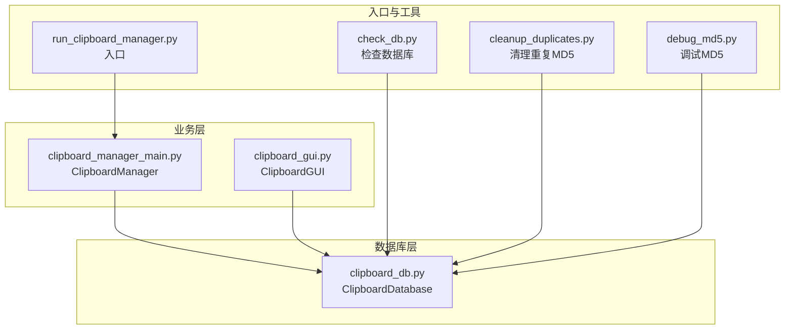
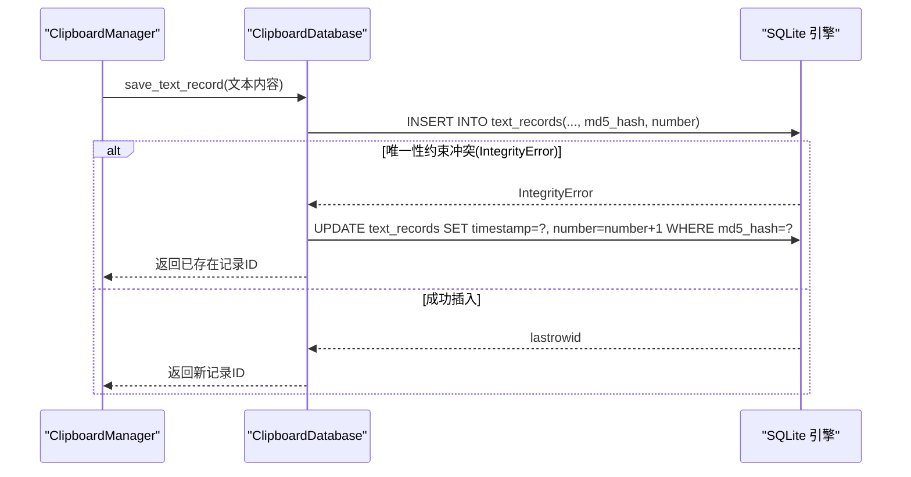
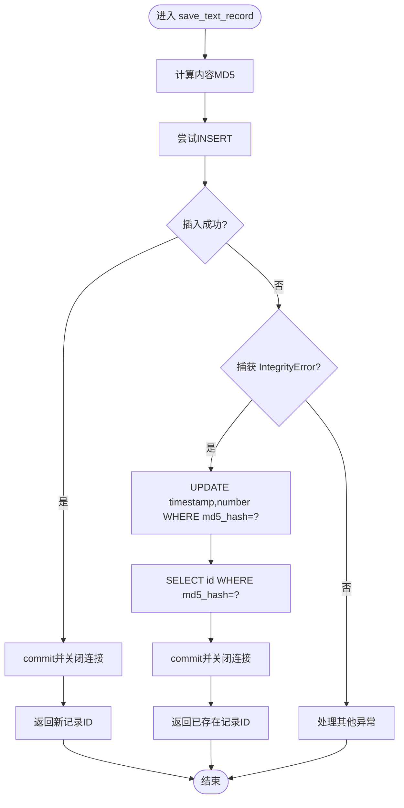
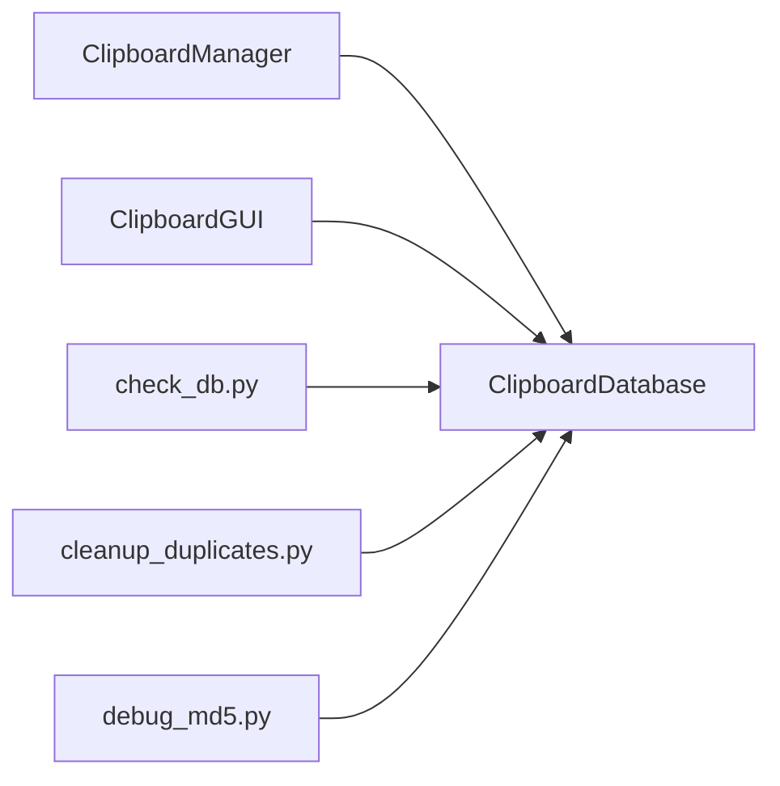

# 事务错误恢复

<cite>
**本文引用的文件**
- [clipboard_db.py](file://clipboard_db.py)
- [clipboard_manager_main.py](file://clipboard_manager_main.py)
- [clipboard_gui.py](file://clipboard_gui.py)
- [run_clipboard_manager.py](file://run_clipboard_manager.py)
- [check_db.py](file://check_db.py)
- [cleanup_duplicates.py](file://cleanup_duplicates.py)
- [debug_md5.py](file://debug_md5.py)
</cite>

## 目录
1. [简介](#简介)
2. [项目结构](#项目结构)
3. [核心组件](#核心组件)
4. [架构总览](#架构总览)
5. [详细组件分析](#详细组件分析)
6. [依赖关系分析](#依赖关系分析)
7. [性能考量](#性能考量)
8. [故障排查指南](#故障排查指南)
9. [结论](#结论)
10. [附录](#附录)

## 简介
本文件系统性梳理事务执行过程中可能发生的异常类型（如 IntegrityError、OperationalError）及其对应的恢复机制，重点围绕 save_text_record 方法中的 MD5 唯一性约束冲突，说明如何通过捕获异常实现优雅降级（更新而非插入）。文档还记录事务回滚的触发条件、日志记录策略以及用户反馈机制，确保数据完整性不受破坏，并提供错误处理模式的最佳实践与可扩展设计建议。

## 项目结构
该项目采用“模块化+职责分离”的组织方式：
- 数据库层：负责数据库初始化、表结构维护、增删改查与过期清理等。
- 业务层：负责剪贴板监控、内容处理、文件复制与MD5计算等。
- 界面层：提供GUI与系统托盘交互，支持记录查看、搜索、统计与设置管理。
- 工具脚本：辅助检查数据库状态、清理重复MD5记录、调试MD5特性等。



图表来源
- [clipboard_db.py](file://clipboard_db.py#L1-L115)
- [clipboard_manager_main.py](file://clipboard_manager_main.py#L355-L761)
- [clipboard_gui.py](file://clipboard_gui.py#L1-L120)
- [run_clipboard_manager.py](file://run_clipboard_manager.py#L1-L71)
- [check_db.py](file://check_db.py#L1-L31)
- [cleanup_duplicates.py](file://cleanup_duplicates.py#L1-L67)
- [debug_md5.py](file://debug_md5.py#L1-L56)

章节来源
- [clipboard_db.py](file://clipboard_db.py#L1-L115)
- [clipboard_manager_main.py](file://clipboard_manager_main.py#L355-L761)
- [clipboard_gui.py](file://clipboard_gui.py#L1-L120)
- [run_clipboard_manager.py](file://run_clipboard_manager.py#L1-L71)

## 核心组件
- ClipboardDatabase：封装数据库初始化、表结构迁移、唯一性约束、事务提交/关闭、查询与统计、过期清理等。
- ClipboardManager：负责剪贴板监控、内容识别（文本/文件）、复制限制检查、文件MD5计算与保存。
- ClipboardGUI：提供GUI界面、系统托盘、记录展示、搜索、统计与设置管理。
- 工具脚本：check_db、cleanup_duplicates、debug_md5，分别用于检查数据库状态、清理重复MD5、调试MD5特性。

章节来源
- [clipboard_db.py](file://clipboard_db.py#L1-L115)
- [clipboard_manager_main.py](file://clipboard_manager_main.py#L355-L761)
- [clipboard_gui.py](file://clipboard_gui.py#L1-L120)

## 架构总览
事务错误恢复的关键流程集中在数据库层的 save_text_record 与 save_file_record 方法中。当插入因唯一性约束失败时，捕获 IntegrityError 并执行优雅降级：更新已有记录的时间戳与计数字段，避免重复写入，保证数据一致性与用户体验。



图表来源
- [clipboard_manager_main.py](file://clipboard_manager_main.py#L395-L496)
- [clipboard_db.py](file://clipboard_db.py#L116-L151)

章节来源
- [clipboard_db.py](file://clipboard_db.py#L116-L151)
- [clipboard_manager_main.py](file://clipboard_manager_main.py#L395-L496)

## 详细组件分析

### 数据库层：ClipboardDatabase 的异常处理与优雅降级
- 唯一性约束与索引
  - 文本记录表与文件记录表均对 md5_hash 字段建立唯一性约束，防止重复内容/文件入库。
  - 初始化阶段通过 ALTER TABLE 与 CREATE UNIQUE INDEX 确保字段与索引存在，捕获 OperationalError 并忽略，提升健壮性。
- 事务提交与关闭
  - 每次数据库操作后显式 commit，异常发生时同样需要确保连接关闭，避免资源泄漏。
- 优雅降级逻辑
  - save_text_record：捕获 IntegrityError 后，更新已有记录的 timestamp 与 number 字段，返回已存在记录ID。
  - save_file_record：同理，若 md5_hash 已存在，更新 timestamp 与 number 并返回记录ID。
- 过期清理
  - delete_expired_records：根据设置的 retention_days 删除过期记录，并同步删除本地文件，异常时打印错误信息但不影响整体流程。



图表来源
- [clipboard_db.py](file://clipboard_db.py#L116-L151)

章节来源
- [clipboard_db.py](file://clipboard_db.py#L1-L115)
- [clipboard_db.py](file://clipboard_db.py#L116-L151)
- [clipboard_db.py](file://clipboard_db.py#L152-L183)
- [clipboard_db.py](file://clipboard_db.py#L413-L455)

### 业务层：ClipboardManager 的监控与限制检查
- 剪贴板监控循环：周期性调用 process_clipboard_content，处理文本与文件两类内容。
- 复制限制检查：基于设置项 max_copy_size、max_copy_count 与 unlimited_mode 判断是否允许复制，超限时输出提示并终止后续处理。
- 文件处理：计算MD5、分类保存、去重入库（save_file_record）。
- 文本处理：保存文本记录（save_text_record），并输出时间戳与字符数等信息。

```mermaid
sequenceDiagram
participant Loop as "监控循环"
participant CM as "ClipboardManager"
participant Win as "Windows剪贴板"
participant DB as "ClipboardDatabase"
Loop->>CM : process_clipboard_content()
CM->>Win : OpenClipboard()
alt 检测到文件列表
CM->>CM : check_copy_limits()
alt 未通过限制
CM-->>Loop : 输出限制提示并返回
else 通过限制
CM->>CM : 计算MD5/分类/复制文件
CM->>DB : save_file_record(...)
DB-->>CM : 返回记录ID
end
else 检测到文本
CM->>CM : 检查文本大小限制
alt 超限
CM-->>Loop : 输出限制提示并返回
else 未超限
CM->>DB : save_text_record(...)
DB-->>CM : 返回记录ID
end
end
CM->>Win : CloseClipboard()
```

图表来源
- [clipboard_manager_main.py](file://clipboard_manager_main.py#L395-L496)
- [clipboard_manager_main.py](file://clipboard_manager_main.py#L362-L394)

章节来源
- [clipboard_manager_main.py](file://clipboard_manager_main.py#L362-L394)
- [clipboard_manager_main.py](file://clipboard_manager_main.py#L395-L496)

### 界面层：ClipboardGUI 的用户反馈与设置管理
- 用户反馈：通过控制台打印与GUI消息框（如提示/警告）向用户反馈操作结果与限制信息。
- 设置管理：支持无限模式、复制大小/数量限制、保存天数、开机自启、悬浮图标等设置，并在保存设置时调用数据库层的 delete_expired_records 与相关系统设置。
- 记录展示：提供记录列表、搜索、统计与详情查看，便于用户感知数据状态。

章节来源
- [clipboard_gui.py](file://clipboard_gui.py#L478-L533)
- [clipboard_gui.py](file://clipboard_gui.py#L555-L580)
- [clipboard_gui.py](file://clipboard_gui.py#L581-L626)

### 工具脚本：检查与清理
- check_db：查询最近带MD5的记录与重复MD5组，辅助定位唯一性约束冲突问题。
- cleanup_duplicates：合并重复MD5记录，保留最新记录并累加计数，删除冗余记录，确保数据一致性。
- debug_md5：演示相同文本多次保存的行为，验证MD5唯一性与计数累加逻辑。

章节来源
- [check_db.py](file://check_db.py#L1-L31)
- [cleanup_duplicates.py](file://cleanup_duplicates.py#L1-L67)
- [debug_md5.py](file://debug_md5.py#L1-L56)

## 依赖关系分析
- ClipboardManager 依赖 ClipboardDatabase 完成数据库操作。
- ClipboardGUI 依赖 ClipboardDatabase 进行记录查询、统计与设置更新。
- 工具脚本独立运行，依赖 SQLite 连接与数据库表结构。



图表来源
- [clipboard_manager_main.py](file://clipboard_manager_main.py#L355-L361)
- [clipboard_gui.py](file://clipboard_gui.py#L1-L20)
- [check_db.py](file://check_db.py#L1-L10)
- [cleanup_duplicates.py](file://cleanup_duplicates.py#L1-L10)
- [debug_md5.py](file://debug_md5.py#L1-L10)

章节来源
- [clipboard_manager_main.py](file://clipboard_manager_main.py#L355-L361)
- [clipboard_gui.py](file://clipboard_gui.py#L1-L20)

## 性能考量
- 唯一性约束冲突概率：高并发场景下，MD5冲突概率低，但频繁重复内容会触发 IntegrityError，需关注 UPDATE 的开销。
- 索引与查询：md5_hash 唯一索引可快速定位冲突记录；查询与统计应避免全表扫描，必要时使用 LIMIT 与排序优化。
- 文件IO与复制：文件保存涉及磁盘IO，应避免重复复制与无效写入，结合MD5去重可显著降低IO压力。
- 连接管理：每次操作显式 commit 与 close，避免长时间持有连接导致资源占用。

## 故障排查指南
- 唯一性约束冲突（IntegrityError）
  - 现象：save_text_record/save_file_record 抛出 IntegrityError。
  - 处理：代码已捕获并执行优雅降级（更新 timestamp 与 number），返回已存在记录ID。
  - 验证：使用 check_db 或 debug_md5 观察 md5_hash 与 number 字段变化。
- 运行时错误（OperationalError）
  - 现象：初始化阶段 ALTER/CREATE 语句执行失败。
  - 处理：捕获 OperationalError 并忽略，确保兼容字段/索引已存在的情况。
- 过期清理异常
  - 现象：删除过期文件时抛出异常。
  - 处理：打印错误信息，不影响数据库层面的删除操作。
- 用户反馈
  - 界面层通过消息框与控制台输出提供明确提示，便于用户理解限制与结果。

章节来源
- [clipboard_db.py](file://clipboard_db.py#L33-L52)
- [clipboard_db.py](file://clipboard_db.py#L137-L151)
- [clipboard_db.py](file://clipboard_db.py#L166-L183)
- [clipboard_db.py](file://clipboard_db.py#L413-L455)
- [clipboard_gui.py](file://clipboard_gui.py#L478-L533)
- [check_db.py](file://check_db.py#L1-L31)
- [debug_md5.py](file://debug_md5.py#L1-L56)

## 结论
本项目通过在数据库层捕获 IntegrityError 实现事务异常的优雅降级，结合唯一性约束与计数字段，有效避免重复写入并保持数据一致性。OperationalError 在初始化阶段被安全忽略，提升了系统的健壮性。配合 GUI 的用户反馈与工具脚本的诊断能力，形成了完整的错误处理与恢复闭环。建议在生产环境中进一步引入统一的日志记录与告警机制，以增强可观测性与可维护性。

## 附录
- 最佳实践清单
  - 明确异常类型：区分 IntegrityError（唯一性冲突）与 OperationalError（DDL/DCL异常）。
  - 优雅降级：在冲突时执行 UPDATE 而非抛出异常，减少上层复杂度。
  - 事务边界：每个数据库操作显式 commit/close，确保资源释放。
  - 用户反馈：通过消息框与控制台输出及时告知用户限制与结果。
  - 可扩展设计：将异常处理抽象为策略或装饰器，便于未来扩展新的恢复策略。