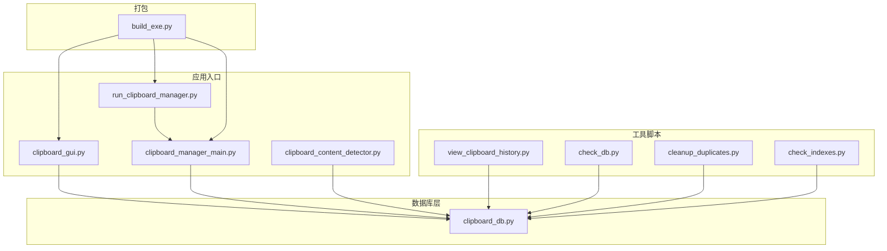
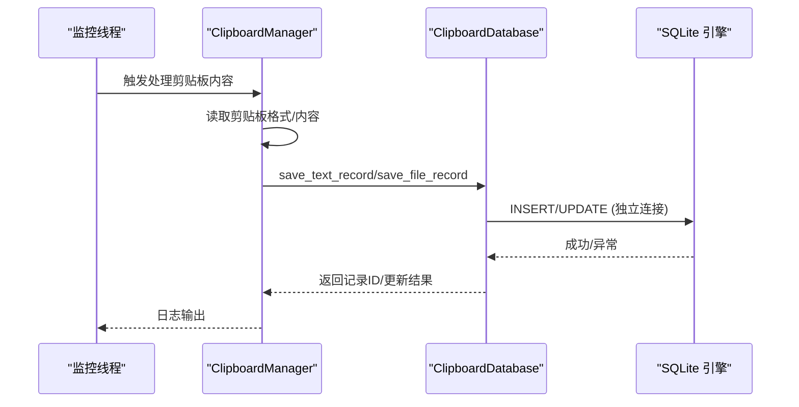
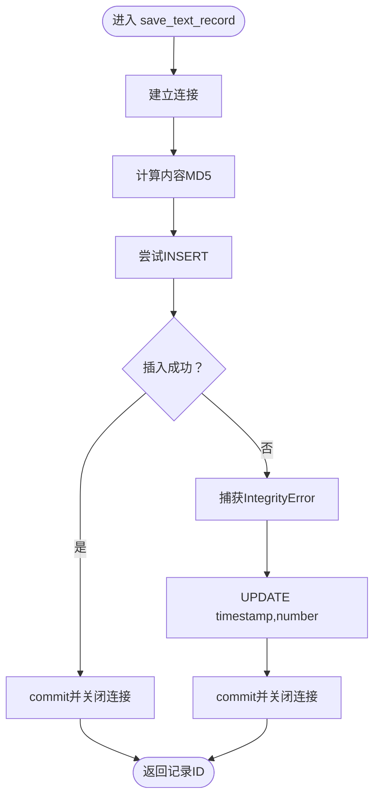
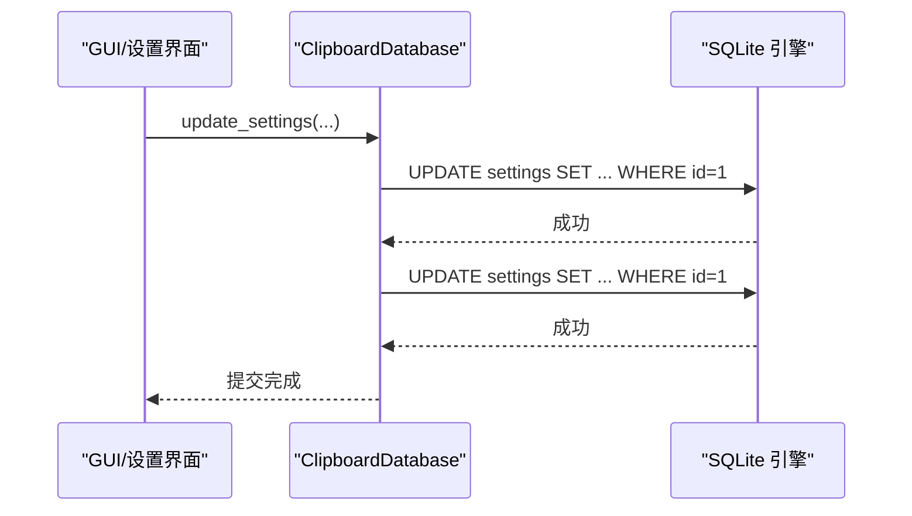
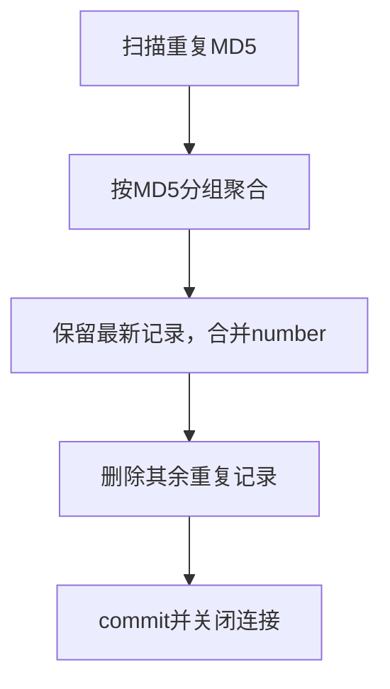
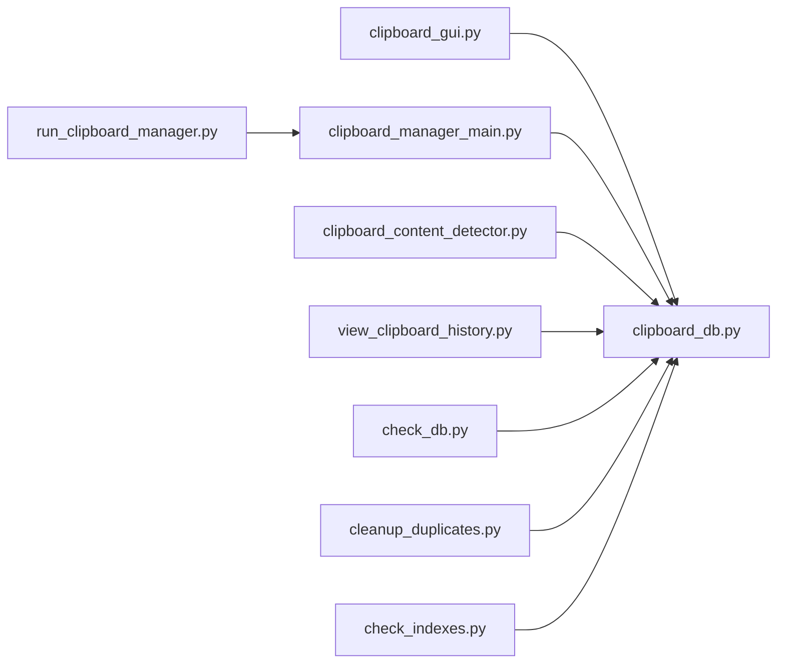

# 事务隔离级别

<cite>
**本文引用的文件**
- [clipboard_db.py](file://clipboard_db.py)
- [clipboard_manager_main.py](file://clipboard_manager_main.py)
- [clipboard_gui.py](file://clipboard_gui.py)
- [run_clipboard_manager.py](file://run_clipboard_manager.py)
- [view_clipboard_history.py](file://view_clipboard_history.py)
- [check_db.py](file://check_db.py)
- [cleanup_duplicates.py](file://cleanup_duplicates.py)
- [check_indexes.py](file://check_indexes.py)
- [clipboard_content_detector.py](file://clipboard_content_detector.py)
- [build_exe.py](file://build_exe.py)
</cite>

## 目录
1. [简介](#简介)
2. [项目结构](#项目结构)
3. [核心组件](#核心组件)
4. [架构总览](#架构总览)
5. [详细组件分析](#详细组件分析)
6. [依赖关系分析](#依赖关系分析)
7. [性能考量](#性能考量)
8. [故障排查指南](#故障排查指南)
9. [结论](#结论)
10. [附录](#附录)

## 简介
本文件围绕 SQLite 数据库在本项目中的事务隔离级别配置与一致性影响展开，重点分析以下方面：
- 当前代码中 SQLite 的事务隔离策略现状与潜在风险
- 在多线程剪贴板监控场景下的并发读写、批量删除、设置更新等操作对一致性的影响
- READ UNCOMMITTED 与 SERIALIZABLE 等隔离模式在本项目中的适用性权衡
- 如何通过连接参数或 PRAGMA 语句控制隔离级别，避免脏读、不可重复读与幻读
- 性能影响评估与调试建议

## 项目结构
项目采用“模块化 + 多入口”的组织方式：
- 数据库层：统一由 ClipboardDatabase 提供 CRUD、统计、设置、过期清理等能力
- 应用入口：
  - GUI 入口：clipboard_gui.py（系统托盘 + GUI 界面）
  - 监控入口：clipboard_manager_main.py（剪贴板监控 + GUI）
  - 单独监控：run_clipboard_manager.py（后台线程监控 + 系统托盘）
  - 命令行工具：view_clipboard_history.py、check_db.py、cleanup_duplicates.py、check_indexes.py
- 辅助：clipboard_content_detector.py（剪贴板内容检测）、build_exe.py（打包）

图表来源
- [clipboard_gui.py](file://clipboard_gui.py#L1-L120)
- [clipboard_manager_main.py](file://clipboard_manager_main.py#L1-L120)
- [run_clipboard_manager.py](file://run_clipboard_manager.py#L1-L71)
- [clipboard_content_detector.py](file://clipboard_content_detector.py#L1-L120)
- [view_clipboard_history.py](file://view_clipboard_history.py#L1-L75)
- [check_db.py](file://check_db.py#L1-L31)
- [cleanup_duplicates.py](file://cleanup_duplicates.py#L1-L67)
- [check_indexes.py](file://check_indexes.py#L1-L27)
- [build_exe.py](file://build_exe.py#L1-L81)

章节来源
- [clipboard_gui.py](file://clipboard_gui.py#L1-L120)
- [clipboard_manager_main.py](file://clipboard_manager_main.py#L1-L120)
- [run_clipboard_manager.py](file://run_clipboard_manager.py#L1-L71)
- [build_exe.py](file://build_exe.py#L1-L81)

## 核心组件
- ClipboardDatabase：封装数据库初始化、表结构维护、增删改查、统计、设置、过期清理等
- ClipboardManager：负责剪贴板监控、内容识别、限流校验、持久化
- ClipboardGUI：提供 GUI 界面、系统托盘、设置管理、记录浏览与搜索
- 工具脚本：辅助检查数据库状态、索引、重复记录清理、历史查看

章节来源
- [clipboard_db.py](file://clipboard_db.py#L1-L120)
- [clipboard_manager_main.py](file://clipboard_manager_main.py#L1-L120)
- [clipboard_gui.py](file://clipboard_gui.py#L1-L120)

## 架构总览
本项目采用“单数据库文件 + 多连接”的模式：
- 每个数据库操作均在独立连接上执行，插入/更新/删除后立即 commit/close
- GUI 与监控线程各自持有独立连接，未显式使用事务块
- 通过唯一约束（md5_hash）与计数字段（number）实现去重与频次统计

图表来源
- [clipboard_manager_main.py](file://clipboard_manager_main.py#L395-L496)
- [clipboard_db.py](file://clipboard_db.py#L116-L183)

章节来源
- [clipboard_manager_main.py](file://clipboard_manager_main.py#L395-L496)
- [clipboard_db.py](file://clipboard_db.py#L116-L183)

## 详细组件分析

### 数据库层 ClipboardDatabase 的事务与隔离现状
- 连接与事务
  - 每个方法内部创建连接、执行 SQL、commit、close，未显式 BEGIN/COMMIT 包裹
  - 通过 INSERT OR IGNORE 与唯一约束实现幂等插入；IntegrityError 时走更新分支
- 唯一性与一致性
  - text_records/file_records 的 md5_hash 字段具备唯一性约束，配合 number 字段实现去重计数
  - settings 表通过 id=1 的约束保证单行设置
- 并发与隔离
  - 由于未使用显式事务块，SQLite 默认隔离级别为 READ COMMITTED
  - 读写操作在各自连接上执行，未见跨连接的共享事务上下文
  - 未使用 PRAGMA 或连接参数显式调整隔离级别

图表来源
- [clipboard_db.py](file://clipboard_db.py#L116-L151)

章节来源
- [clipboard_db.py](file://clipboard_db.py#L116-L183)
- [clipboard_db.py](file://clipboard_db.py#L387-L412)

### 设置更新与批量删除的隔离影响
- 设置更新
  - update_settings 逐项更新 settings 表字段，每项更新后 commit
  - 由于未使用事务块，单字段更新之间可能被其他连接观察到中间态
- 批量删除（过期清理）
  - delete_expired_records 一次性删除多条记录并提交
  - 若在删除过程中有其他连接读取，可能看到部分删除状态

图表来源
- [clipboard_db.py](file://clipboard_db.py#L387-L412)
- [clipboard_gui.py](file://clipboard_gui.py#L477-L530)

章节来源
- [clipboard_db.py](file://clipboard_db.py#L387-L412)
- [clipboard_gui.py](file://clipboard_gui.py#L477-L530)

### 去重与重复清理的隔离影响
- 去重机制
  - 通过 md5_hash 唯一约束与 number 字段实现，避免重复内容入库
- 重复清理脚本
  - cleanup_duplicates.py 会扫描重复 MD5，合并计数并删除冗余记录
  - 该脚本在独立连接中执行，未使用事务块

图表来源
- [cleanup_duplicates.py](file://cleanup_duplicates.py#L1-L67)

章节来源
- [cleanup_duplicates.py](file://cleanup_duplicates.py#L1-L67)

### 多线程剪贴板监控环境下的隔离风险
- 线程模型
  - run_clipboard_manager.py 中监控线程以守护线程运行
  - clipboard_manager_main.py 的 GUI 也启动独立监控线程
- 风险点
  - 读写分离：监控线程写入，GUI 读取，各自连接，未见跨连接事务同步
  - 可能出现的隔离问题
    - 脏读：在 READ COMMITTED 下，读取到未提交的写入（概率低，但理论上可能发生）
    - 不可重复读：同一连接内多次读取同一范围，受其他连接提交影响
    - 幻读：同一连接内多次查询同一范围，受其他连接插入/删除影响
  - 由于未使用显式事务块，SQLite 默认隔离级别为 READ COMMITTED，且未见 PRAGMA 或连接参数调整隔离级别

章节来源
- [run_clipboard_manager.py](file://run_clipboard_manager.py#L32-L66)
- [clipboard_manager_main.py](file://clipboard_manager_main.py#L717-L759)

## 依赖关系分析
- 模块耦合
  - clipboard_gui.py 与 clipboard_manager_main.py 均依赖 clipboard_db.py
  - run_clipboard_manager.py 间接依赖 clipboard_manager_main.py 的监控循环
  - 工具脚本与 clipboard_db.py 存在直接依赖
- 外部依赖
  - sqlite3、win32clipboard、PIL/pystray（可选）

图表来源
- [clipboard_gui.py](file://clipboard_gui.py#L1-L120)
- [clipboard_manager_main.py](file://clipboard_manager_main.py#L1-L120)
- [run_clipboard_manager.py](file://run_clipboard_manager.py#L1-L71)
- [clipboard_content_detector.py](file://clipboard_content_detector.py#L1-L120)
- [view_clipboard_history.py](file://view_clipboard_history.py#L1-L75)
- [check_db.py](file://check_db.py#L1-L31)
- [cleanup_duplicates.py](file://cleanup_duplicates.py#L1-L67)
- [check_indexes.py](file://check_indexes.py#L1-L27)

章节来源
- [clipboard_gui.py](file://clipboard_gui.py#L1-L120)
- [clipboard_manager_main.py](file://clipboard_manager_main.py#L1-L120)
- [run_clipboard_manager.py](file://run_clipboard_manager.py#L1-L71)

## 性能考量
- 连接开销
  - 每个操作都新建连接并立即关闭，避免连接池复杂度，但在高并发下会产生额外开销
- 唯一约束与索引
  - md5_hash 唯一索引有助于快速去重，但写入时仍需维护索引
  - 未见显式索引创建脚本，check_indexes.py 仅用于检查
- 事务粒度
  - 未使用事务块导致每个操作都是原子提交，减少锁竞争，但也无法保证跨操作的原子性
- I/O 与磁盘
  - 文件记录涉及文件复制与删除，需关注磁盘 I/O 与空间占用

章节来源
- [check_indexes.py](file://check_indexes.py#L1-L27)
- [clipboard_db.py](file://clipboard_db.py#L20-L45)

## 故障排查指南
- 常见问题定位
  - 重复记录：使用 cleanup_duplicates.py 合并重复 MD5 记录
  - 索引缺失：使用 check_indexes.py 检查索引是否存在
  - 数据库状态：使用 check_db.py 查看最近带 MD5 的记录与重复情况
  - 历史查看：使用 view_clipboard_history.py 快速浏览文本/文件记录与统计
- 调试建议
  - 在关键写入点（save_text_record/save_file_record）前后打印日志，确认 MD5 与 number 的变化
  - 在 GUI 刷新与设置保存处增加异常捕获与重试逻辑
  - 对批量删除（delete_expired_records）增加事务包裹，确保原子性

章节来源
- [cleanup_duplicates.py](file://cleanup_duplicates.py#L1-L67)
- [check_indexes.py](file://check_indexes.py#L1-L27)
- [check_db.py](file://check_db.py#L1-L31)
- [view_clipboard_history.py](file://view_clipboard_history.py#L1-L75)

## 结论
- 当前实现未显式配置 SQLite 事务隔离级别，SQLite 默认隔离级别为 READ COMMITTED
- 通过唯一约束与计数字段实现了去重与一致性保障，满足大多数使用场景
- 在多线程剪贴板监控环境下，读写分离与独立连接降低了锁冲突，但仍需注意不可重复读与幻读的风险
- 若需更强的一致性保障，可在关键路径引入显式事务块与 PRAGMA 配置，并结合索引优化与连接池策略提升性能

## 附录

### SQLite 事务隔离级别与 PRAGMA 配置
- READ UNCOMMITTED
  - SQLite 不支持真正的 READ UNCOMMITTED，READ COMMITTED 是默认隔离级别
  - 通过 PRAGMA 无法直接设置 READ UNCOMMITTED
- READ COMMITTED
  - 默认隔离级别，适合多数读写场景
- REPEATABLE READ / SERIALIZABLE
  - SQLite 通过 WAL 模式与只读事务可近似实现更高隔离级别
  - 通过 PRAGMA journal_mode=WAL 可提升并发读写性能
- 实践建议
  - 对批量删除与设置更新等关键路径，建议使用显式事务块包裹，确保原子性
  - 对高频读取场景，考虑 WAL 模式与只读事务，减少写入阻塞

章节来源
- [clipboard_db.py](file://clipboard_db.py#L387-L412)
- [clipboard_manager_main.py](file://clipboard_manager_main.py#L280-L304)

### 代码级隔离策略实施建议（基于现有代码结构）
- 在 save_text_record/save_file_record 中引入显式事务块，确保插入/更新的原子性
- 在 update_settings 中将多个字段更新放入同一事务块，避免中间态被其他连接观察到
- 在 delete_expired_records 中使用事务块，保证删除与文件清理的原子性
- 在 GUI 刷新与搜索中，尽量使用只读事务，减少写入锁竞争

章节来源
- [clipboard_db.py](file://clipboard_db.py#L116-L183)
- [clipboard_db.py](file://clipboard_db.py#L387-L412)
- [clipboard_db.py](file://clipboard_db.py#L413-L455)