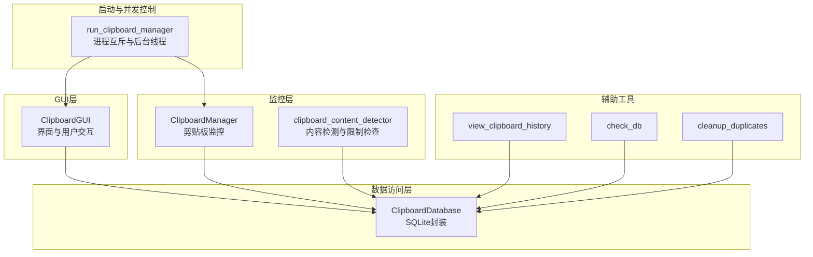
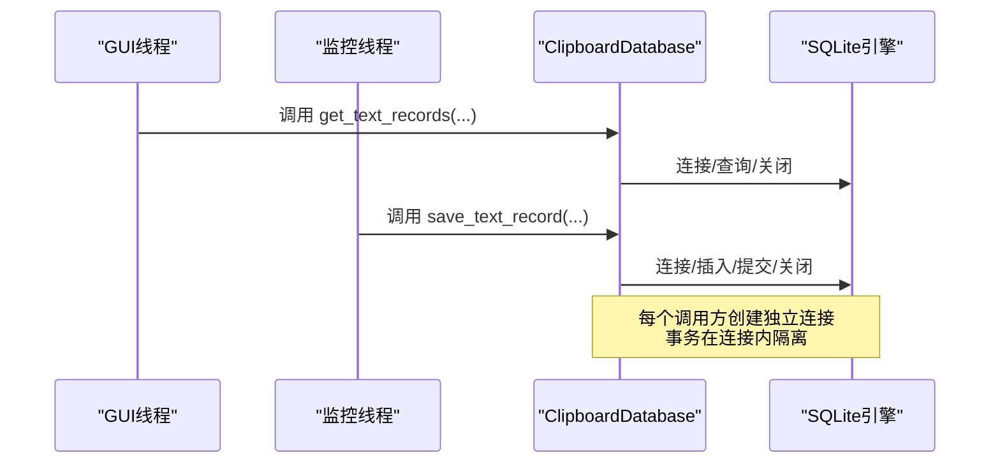
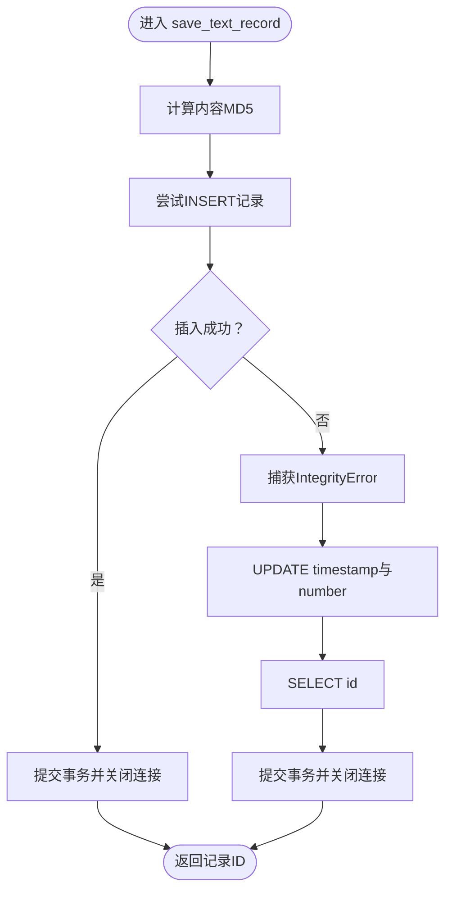
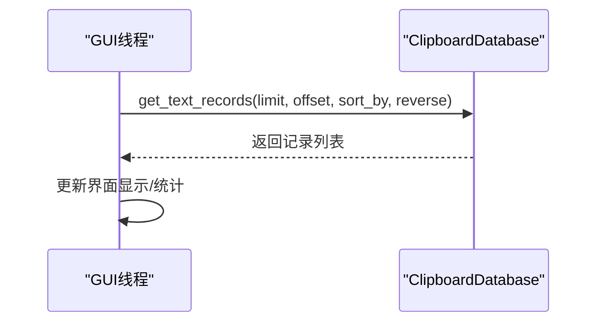
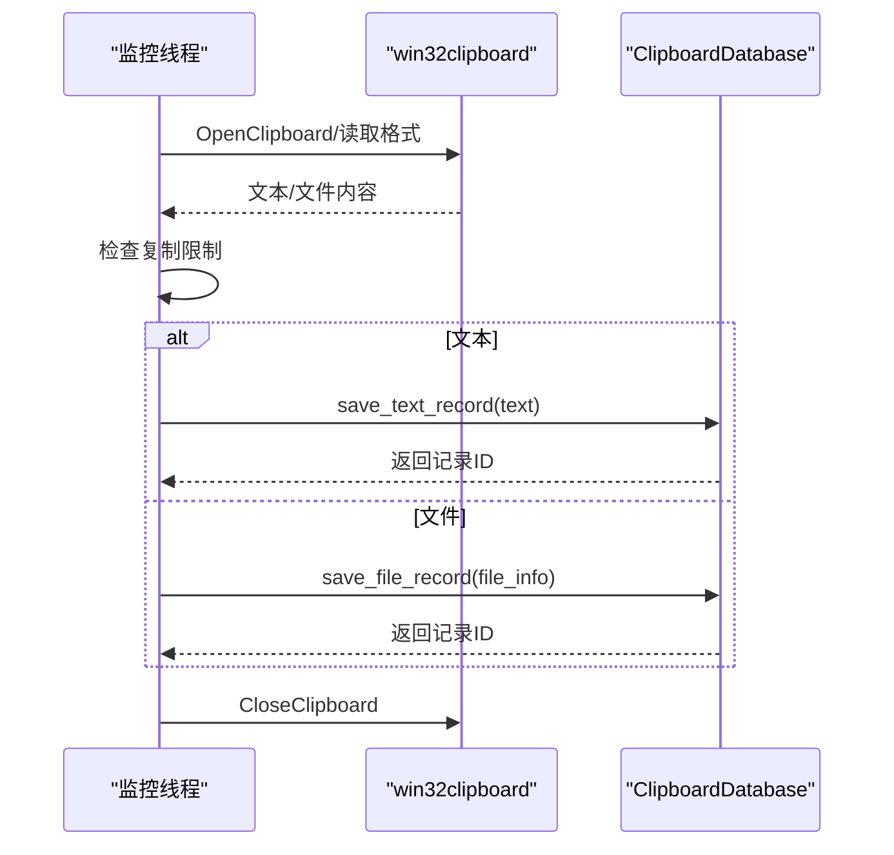
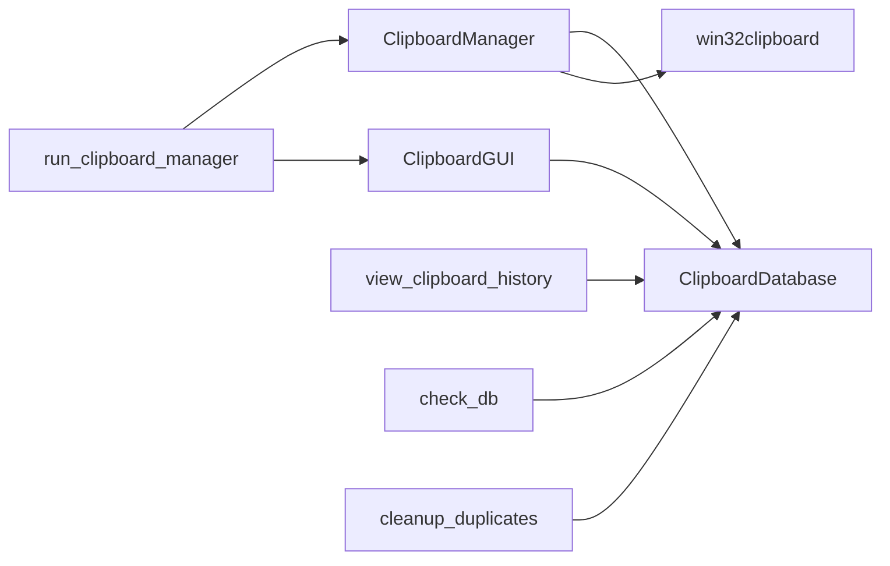

# 并发事务处理

<cite>
**本文引用的文件**
- [clipboard_db.py](file://clipboard_db.py)
- [clipboard_gui.py](file://clipboard_gui.py)
- [clipboard_manager_main.py](file://clipboard_manager_main.py)
- [run_clipboard_manager.py](file://run_clipboard_manager.py)
- [view_clipboard_history.py](file://view_clipboard_history.py)
- [check_db.py](file://check_db.py)
- [cleanup_duplicates.py](file://cleanup_duplicates.py)
- [clipboard_content_detector.py](file://clipboard_content_detector.py)
</cite>

## 目录
1. [简介](#简介)
2. [项目结构](#项目结构)
3. [核心组件](#核心组件)
4. [架构总览](#架构总览)
5. [详细组件分析](#详细组件分析)
6. [依赖关系分析](#依赖关系分析)
7. [性能考量](#性能考量)
8. [故障排查指南](#故障排查指南)
9. [结论](#结论)
10. [附录](#附录)

## 简介
本文件聚焦于应用程序在多线程环境中的并发数据库事务安全处理，围绕主线程（GUI）与后台监控线程对数据库连接的访问机制展开，解释连接池管理、线程局部存储（thread-local connections）的实现方式，结合 save_text_record 与 get_text_records 等方法的实际调用流程，说明如何防止事务冲突与数据库锁定，并提供死锁检测与恢复策略及高并发优化建议。

## 项目结构
该项目采用“模块化+分层”的组织方式：
- 数据访问层：clipboard_db.py 提供 SQLite 数据库封装与 CRUD 接口
- GUI 层：clipboard_gui.py 提供 Tkinter 界面与用户交互
- 后台监控层：clipboard_manager_main.py 提供剪贴板监控与历史记录维护
- 启动与并发控制：run_clipboard_manager.py 控制进程互斥与后台线程
- 辅助工具：view_clipboard_history.py、check_db.py、cleanup_duplicates.py、clipboard_content_detector.py 提供查看、检查与清理能力

图表来源
- [clipboard_gui.py](file://clipboard_gui.py#L1-L120)
- [clipboard_manager_main.py](file://clipboard_manager_main.py#L355-L761)
- [clipboard_db.py](file://clipboard_db.py#L12-L114)
- [run_clipboard_manager.py](file://run_clipboard_manager.py#L17-L70)
- [view_clipboard_history.py](file://view_clipboard_history.py#L1-L75)
- [check_db.py](file://check_db.py#L1-L31)
- [cleanup_duplicates.py](file://cleanup_duplicates.py#L1-L67)
- [clipboard_content_detector.py](file://clipboard_content_detector.py#L1-L274)

章节来源
- [clipboard_gui.py](file://clipboard_gui.py#L1-L120)
- [clipboard_manager_main.py](file://clipboard_manager_main.py#L355-L761)
- [clipboard_db.py](file://clipboard_db.py#L12-L114)
- [run_clipboard_manager.py](file://run_clipboard_manager.py#L17-L70)

## 核心组件
- ClipboardDatabase：封装 SQLite 表结构、事务语义与 CRUD 方法，负责数据一致性与去重逻辑
- ClipboardGUI：主线程 GUI，负责用户交互与展示，内部持有数据库实例
- ClipboardManager：后台监控线程主体，负责剪贴板内容检测、限制检查与数据库写入
- run_clipboard_manager：进程互斥与后台线程启动，避免重复运行并启动监控线程

章节来源
- [clipboard_db.py](file://clipboard_db.py#L12-L114)
- [clipboard_gui.py](file://clipboard_gui.py#L37-L79)
- [clipboard_manager_main.py](file://clipboard_manager_main.py#L355-L761)
- [run_clipboard_manager.py](file://run_clipboard_manager.py#L17-L70)

## 架构总览
主线程（GUI）与后台监控线程共享同一个数据库实例（ClipboardDatabase），但各自在不同线程内创建独立的数据库连接。SQLite 的事务由每个连接内的本地事务控制，通过唯一约束与完整性异常实现幂等写入与计数累加，从而避免重复记录与竞态条件。

图表来源
- [clipboard_gui.py](file://clipboard_gui.py#L581-L626)
- [clipboard_manager_main.py](file://clipboard_manager_main.py#L497-L518)
- [clipboard_db.py](file://clipboard_db.py#L184-L220)

## 详细组件分析

### 数据库层：ClipboardDatabase
- 表结构与索引
  - text_records：包含 content、timestamp、char_count、md5_hash、number 等字段；md5_hash 字段具备唯一性约束，number 字段用于计数累加
  - file_records：包含 original_path、saved_path、filename、file_size、file_type、md5_hash、timestamp、number 等字段；md5_hash 字段具备唯一性约束
  - settings：包含 max_copy_size、max_copy_count、unlimited_mode、retention_days、auto_start、float_icon 等配置项
- 事务与一致性
  - save_text_record：先尝试插入，若 IntegrityError（唯一约束冲突）则更新 timestamp 与 number，保证重复内容只增计数而不重复插入
  - save_file_record：同上，基于 md5_hash 去重并累加计数
  - get_text_records/get_file_records：每次调用创建独立连接，执行查询后立即关闭，避免长事务占用
- 过期清理
  - delete_expired_records：基于 settings.retention_days 删除过期记录并清理对应文件

图表来源
- [clipboard_db.py](file://clipboard_db.py#L115-L149)

章节来源
- [clipboard_db.py](file://clipboard_db.py#L12-L114)
- [clipboard_db.py](file://clipboard_db.py#L115-L149)
- [clipboard_db.py](file://clipboard_db.py#L184-L220)
- [clipboard_db.py](file://clipboard_db.py#L412-L455)

### GUI层：ClipboardGUI
- 主线程职责
  - 初始化数据库实例，创建界面与托盘图标
  - 定时刷新与用户交互（搜索、排序、统计、设置）
  - 通过 db.get_text_records 等接口加载数据
- 并发注意
  - 未显式使用线程局部存储；GUI线程每次调用数据库接口时创建独立连接，避免跨线程共享连接
  - 通过 root.after 与事件绑定驱动界面更新，减少阻塞

图表来源
- [clipboard_gui.py](file://clipboard_gui.py#L581-L626)
- [clipboard_gui.py](file://clipboard_gui.py#L627-L667)

章节来源
- [clipboard_gui.py](file://clipboard_gui.py#L37-L79)
- [clipboard_gui.py](file://clipboard_gui.py#L581-L667)

### 监控层：ClipboardManager
- 后台监控线程
  - 通过 win32clipboard 检测剪贴板变化，识别文本与文件两类内容
  - 对文件复制进行限制检查（数量与大小），避免超出设置阈值
  - 调用 db.save_text_record/save_file_record 写入数据库
- 进程互斥
  - 使用 Windows Mutex 防止重复运行，避免多个监控线程竞争同一数据库连接

图表来源
- [clipboard_manager_main.py](file://clipboard_manager_main.py#L395-L496)
- [clipboard_manager_main.py](file://clipboard_manager_main.py#L497-L518)
- [run_clipboard_manager.py](file://run_clipboard_manager.py#L17-L31)

章节来源
- [clipboard_manager_main.py](file://clipboard_manager_main.py#L355-L761)
- [run_clipboard_manager.py](file://run_clipboard_manager.py#L17-L31)

### 内容检测与限制检查
- clipboard_content_detector：提供剪贴板内容检测、格式枚举、复制限制检查与格式化输出
- 与数据库层协作：通过 db.get_settings 获取限制配置，避免超限写入

章节来源
- [clipboard_content_detector.py](file://clipboard_content_detector.py#L1-L274)

### 辅助工具
- view_clipboard_history：快速查看最近记录与统计
- check_db：检查数据库中 MD5 去重情况
- cleanup_duplicates：清理重复 MD5 记录并合并计数

章节来源
- [view_clipboard_history.py](file://view_clipboard_history.py#L1-L75)
- [check_db.py](file://check_db.py#L1-L31)
- [cleanup_duplicates.py](file://cleanup_duplicates.py#L1-L67)

## 依赖关系分析
- GUI 与监控线程均依赖 ClipboardDatabase
- ClipboardManager 依赖 win32clipboard 实现剪贴板读取
- run_clipboard_manager 通过 Mutex 防止重复运行，并启动监控线程
- 辅助工具独立于主流程，但依赖 ClipboardDatabase

图表来源
- [clipboard_gui.py](file://clipboard_gui.py#L37-L79)
- [clipboard_manager_main.py](file://clipboard_manager_main.py#L355-L496)
- [run_clipboard_manager.py](file://run_clipboard_manager.py#L17-L70)
- [view_clipboard_history.py](file://view_clipboard_history.py#L1-L75)
- [check_db.py](file://check_db.py#L1-L31)
- [cleanup_duplicates.py](file://cleanup_duplicates.py#L1-L67)

章节来源
- [clipboard_gui.py](file://clipboard_gui.py#L37-L79)
- [clipboard_manager_main.py](file://clipboard_manager_main.py#L355-L496)
- [run_clipboard_manager.py](file://run_clipboard_manager.py#L17-L70)

## 性能考量
- 连接管理
  - 每次数据库调用创建独立连接，避免跨线程共享连接导致的锁争用与状态污染
  - 读取接口（如 get_text_records）在查询后立即关闭连接，降低锁持有时间
- 去重与计数
  - 基于 md5_hash 唯一约束与 number 字段累加，减少重复写入与索引扫描
- 索引与查询
  - text_records 的 md5_hash 唯一索引有助于快速去重
  - 查询接口支持排序与分页参数，避免一次性加载大量数据
- 限制检查
  - 在写入前进行复制限制检查，减少无效写入与后续清理成本

章节来源
- [clipboard_db.py](file://clipboard_db.py#L12-L114)
- [clipboard_db.py](file://clipboard_db.py#L184-L220)
- [clipboard_manager_main.py](file://clipboard_manager_main.py#L362-L394)

## 故障排查指南
- 事务冲突与完整性异常
  - 现象：save_text_record/save_file_record 抛出 IntegrityError
  - 处理：代码已捕获并回退到更新 timestamp 与 number 的分支，确保幂等写入
- 数据库锁定
  - 现象：查询或写入缓慢
  - 处理：确认未在其他线程长时间持有连接；避免在同一连接上串行执行耗时操作
- 重复记录
  - 现象：相同内容出现多次
  - 处理：使用 cleanup_duplicates 合并重复 MD5 记录并累加计数
- 进程重复运行
  - 现象：多个监控线程同时运行
  - 处理：利用 Mutex 防止重复启动；若已运行，可通过托盘图标或 Alt+C 激活已有窗口

章节来源
- [clipboard_db.py](file://clipboard_db.py#L115-L149)
- [clipboard_db.py](file://clipboard_db.py#L151-L182)
- [cleanup_duplicates.py](file://cleanup_duplicates.py#L1-L67)
- [run_clipboard_manager.py](file://run_clipboard_manager.py#L17-L31)

## 结论
本项目通过“每调用创建独立连接”的简单连接管理模式，在 GUI 与后台监控线程之间实现了基本的并发安全：每个线程拥有独立的事务边界，借助 SQLite 的唯一约束与完整性异常处理，实现了幂等写入与计数累加，有效避免了重复记录与竞态条件。对于高并发场景，建议引入连接池与更细粒度的锁策略，同时优化热点查询与写入路径，以进一步提升吞吐量与稳定性。

## 附录

### 并发事务处理最佳实践清单
- 使用每调用创建独立连接的方式，避免跨线程共享连接
- 对写入路径使用唯一约束与异常回退，确保幂等性
- 读取接口及时关闭连接，缩短锁持有时间
- 在写入前进行业务限制检查，减少无效写入
- 对热点查询建立必要索引，避免全表扫描
- 在高并发场景考虑引入连接池与重试/退避策略