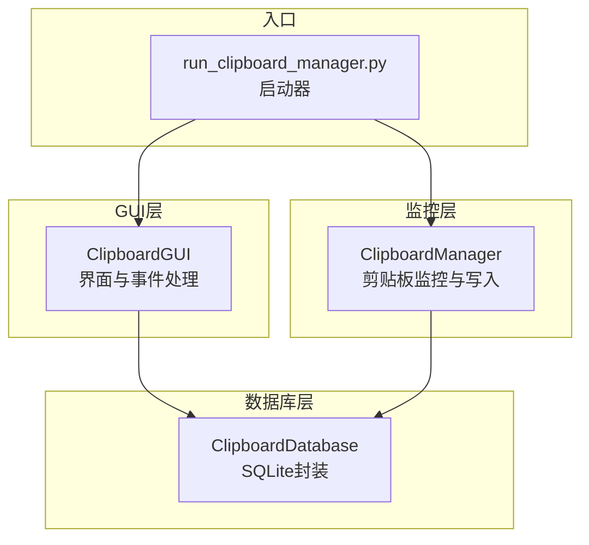
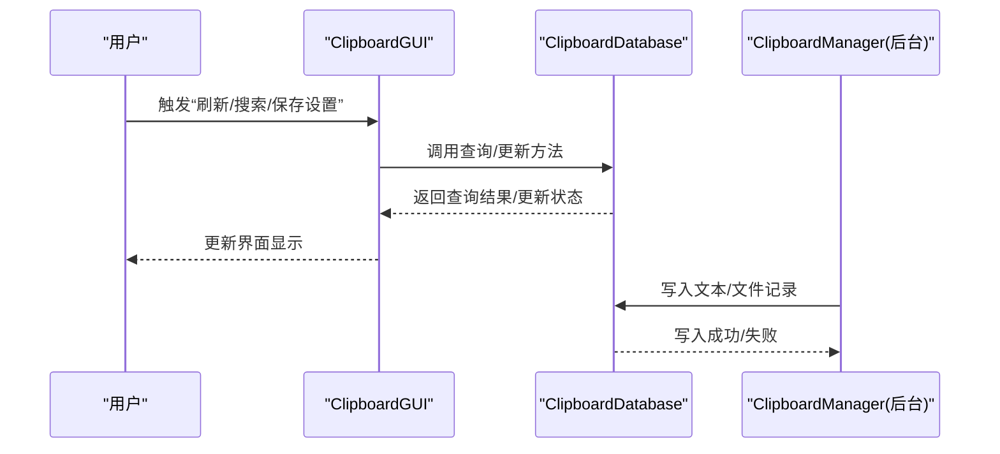
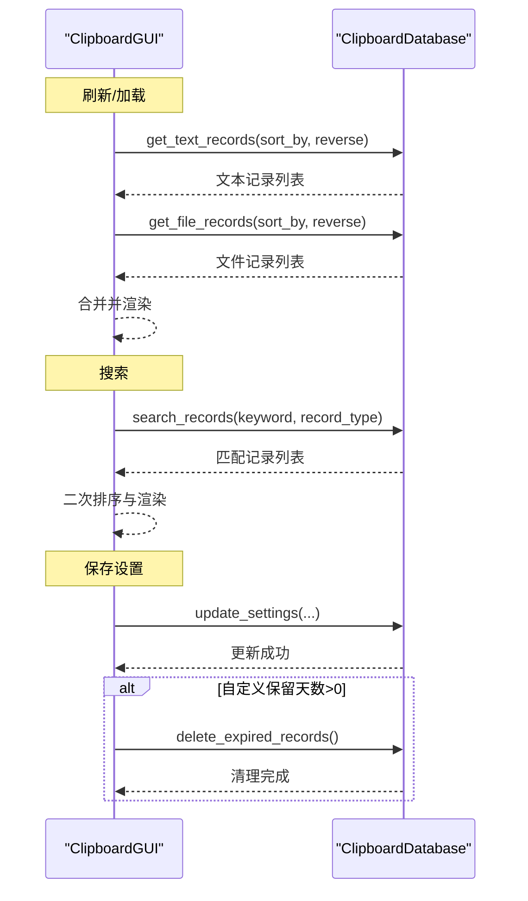
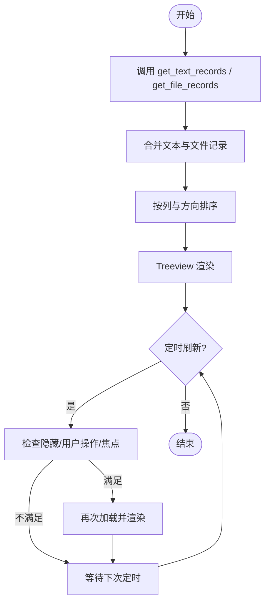
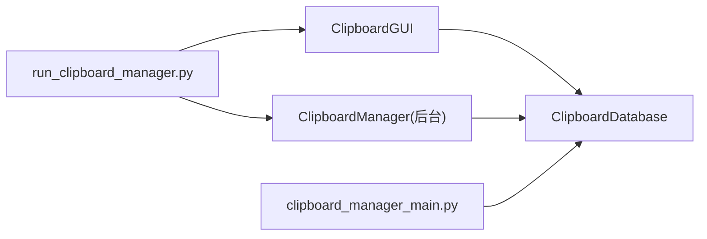

# 数据库访问模式

<cite>
**本文引用的文件**
- [clipboard_gui.py](file://clipboard_gui.py)
- [clipboard_db.py](file://clipboard_db.py)
- [run_clipboard_manager.py](file://run_clipboard_manager.py)
- [clipboard_manager_main.py](file://clipboard_manager_main.py)
- [clipboard_content_detector.py](file://clipboard_content_detector.py)
- [view_clipboard_history.py](file://view_clipboard_history.py)
</cite>

## 目录
1. [简介](#简介)
2. [项目结构](#项目结构)
3. [核心组件](#核心组件)
4. [架构总览](#架构总览)
5. [详细组件分析](#详细组件分析)
6. [依赖关系分析](#依赖关系分析)
7. [性能考量](#性能考量)
8. [故障排查指南](#故障排查指南)
9. [结论](#结论)
10. [附录](#附录)

## 简介
本文件聚焦于应用程序中 GUI 与数据库的交互模式，深入解析 ClipboardGUI 如何通过 ClipboardDatabase 实例执行同步查询操作，涵盖 get_text_records、get_file_records 和 search_records 的调用时机与参数传递；分析数据加载（load_records）、搜索（search_records）与设置更新（save_settings）等场景下的数据库事务处理机制；探讨查询结果在 GUI 中的缓存策略与显示更新机制，以及数据库连接的线程安全性问题。

## 项目结构
该项目采用“GUI + 数据库 + 监控器”的分层设计：
- GUI 层：负责用户交互、界面展示与事件响应（ClipboardGUI）
- 数据库层：封装 SQLite 访问与事务控制（ClipboardDatabase）
- 监控层：后台持续监听剪贴板变化并写入数据库（clipboard_manager_main.py 中的 ClipboardManager）
- 启动与入口：run_clipboard_manager.py 启动 GUI 并在后台线程中运行监控器

图表来源
- [clipboard_gui.py](file://clipboard_gui.py#L37-L120)
- [clipboard_db.py](file://clipboard_db.py#L13-L115)
- [run_clipboard_manager.py](file://run_clipboard_manager.py#L32-L66)
- [clipboard_manager_main.py](file://clipboard_manager_main.py#L355-L496)

章节来源
- [clipboard_gui.py](file://clipboard_gui.py#L37-L120)
- [clipboard_db.py](file://clipboard_db.py#L13-L115)
- [run_clipboard_manager.py](file://run_clipboard_manager.py#L32-L66)
- [clipboard_manager_main.py](file://clipboard_manager_main.py#L355-L496)

## 核心组件
- ClipboardGUI：提供记录浏览、搜索、统计、设置等功能，负责调用 ClipboardDatabase 的查询与更新接口，并将结果渲染到 Tkinter 界面。
- ClipboardDatabase：封装 SQLite 初始化、表结构维护、增删改查、统计与设置读写、过期记录清理等操作。
- ClipboardManager：后台线程持续监控剪贴板变化，按规则写入数据库（文本与文件），并与 GUI 互补。

章节来源
- [clipboard_gui.py](file://clipboard_gui.py#L37-L120)
- [clipboard_db.py](file://clipboard_db.py#L13-L115)
- [clipboard_manager_main.py](file://clipboard_manager_main.py#L355-L496)

## 架构总览
GUI 与数据库交互的关键流程如下：
- GUI 初始化时创建 ClipboardDatabase 实例，并在 UI 构建完成后触发首次数据加载。
- 用户操作（如点击“刷新”、“搜索”、“保存设置”）触发 GUI 调用 ClipboardDatabase 的相应方法。
- ClipboardDatabase 在每个方法内部建立独立连接，执行 SQL 查询或更新，然后关闭连接。
- 监控器在后台线程中写入数据库，与 GUI 并行工作，保证数据实时性。

图表来源
- [clipboard_gui.py](file://clipboard_gui.py#L581-L626)
- [clipboard_gui.py](file://clipboard_gui.py#L652-L748)
- [clipboard_gui.py](file://clipboard_gui.py#L477-L533)
- [clipboard_db.py](file://clipboard_db.py#L185-L261)
- [clipboard_db.py](file://clipboard_db.py#L281-L314)
- [clipboard_db.py](file://clipboard_db.py#L387-L412)
- [clipboard_manager_main.py](file://clipboard_manager_main.py#L395-L496)

## 详细组件分析

### ClipboardGUI 与 ClipboardDatabase 的交互模式
- 初始化与数据加载
  - GUI 在构造函数中创建 ClipboardDatabase 实例，并在 UI 构建完成后通过定时器触发 load_records。
  - load_records 会调用 ClipboardDatabase 的 get_text_records 与 get_file_records，合并结果并渲染到 Treeview。
- 搜索与排序
  - search_records 调用 ClipboardDatabase 的 search_records 获取匹配记录，随后在 GUI 内部对结果进行二次排序与展示。
  - 排序依据来自 GUI 的列名映射与当前排序方向。
- 设置更新
  - save_settings 读取界面输入，调用 ClipboardDatabase 的 update_settings 更新配置；若设置为自定义保留天数，还会触发 delete_expired_records 清理过期记录。

图表来源
- [clipboard_gui.py](file://clipboard_gui.py#L581-L626)
- [clipboard_gui.py](file://clipboard_gui.py#L652-L748)
- [clipboard_gui.py](file://clipboard_gui.py#L477-L533)
- [clipboard_db.py](file://clipboard_db.py#L185-L261)
- [clipboard_db.py](file://clipboard_db.py#L281-L314)
- [clipboard_db.py](file://clipboard_db.py#L387-L412)
- [clipboard_db.py](file://clipboard_db.py#L413-L455)

章节来源
- [clipboard_gui.py](file://clipboard_gui.py#L581-L626)
- [clipboard_gui.py](file://clipboard_gui.py#L652-L748)
- [clipboard_gui.py](file://clipboard_gui.py#L477-L533)
- [clipboard_db.py](file://clipboard_db.py#L185-L261)
- [clipboard_db.py](file://clipboard_db.py#L281-L314)
- [clipboard_db.py](file://clipboard_db.py#L387-L412)
- [clipboard_db.py](file://clipboard_db.py#L413-L455)

### 查询方法调用时机与参数传递
- get_text_records
  - 调用时机：load_records、load_all_records、悬浮面板最近记录展示等。
  - 参数：sort_by（列名映射）、reverse（布尔）、limit/offset（可选）。
- get_file_records
  - 调用时机：load_records、load_all_records、悬浮面板最近记录展示等。
  - 参数：sort_by（列名映射）、reverse（布尔）、limit/offset（可选）。
- search_records
  - 调用时机：用户点击“搜索”按钮。
  - 参数：keyword（关键词）、record_type（all/text/file）。

章节来源
- [clipboard_gui.py](file://clipboard_gui.py#L581-L626)
- [clipboard_gui.py](file://clipboard_gui.py#L652-L748)
- [clipboard_db.py](file://clipboard_db.py#L185-L261)
- [clipboard_db.py](file://clipboard_db.py#L281-L314)

### 数据加载、搜索与设置更新的事务处理机制
- 事务特性
  - ClipboardDatabase 的每个查询/更新方法内部均以独立连接执行 SQL，commit/close 在方法内部完成，未显式使用 BEGIN/COMMIT 语句。
  - 单次调用通常对应单个事务，适合读取与简单更新。
- 事务边界
  - save_text_record/save_file_record：INSERT 或 UPDATE，成功后 commit/close。
  - update_settings/delete_expired_records：单条或多条 UPDATE/DELETE，成功后 commit/close。
  - get_text_records/get_file_records/search_records/get_statistics：只读查询，连接在方法内关闭。
- 事务一致性
  - 由于每次调用都独立开启/关闭连接，未实现跨多次调用的多语句事务，因此不支持跨方法的原子性。
  - 若需跨方法事务，应在调用方（GUI）或数据库层引入上下文管理器或显式事务包装。

章节来源
- [clipboard_db.py](file://clipboard_db.py#L116-L184)
- [clipboard_db.py](file://clipboard_db.py#L185-L261)
- [clipboard_db.py](file://clipboard_db.py#L281-L314)
- [clipboard_db.py](file://clipboard_db.py#L316-L333)
- [clipboard_db.py](file://clipboard_db.py#L387-L412)
- [clipboard_db.py](file://clipboard_db.py#L413-L455)

### 查询结果在 GUI 中的缓存策略与显示更新机制
- 缓存策略
  - GUI 在 load_records 中一次性拉取全部记录并渲染，未实现分页或增量缓存。
  - 搜索结果在 GUI 内部进行二次排序与展示，未持久化到内存缓存。
- 显示更新
  - GUI 通过 Treeview 的 insert/delete 方式更新显示，支持排序列切换与排序方向翻转。
  - 自动更新：GUI 每 2 秒检查一次条件后刷新，避免干扰用户操作。
- 悬浮面板
  - 悬浮面板在显示时从数据库拉取最近记录，不与主界面共享缓存。

图表来源
- [clipboard_gui.py](file://clipboard_gui.py#L581-L626)
- [clipboard_gui.py](file://clipboard_gui.py#L280-L294)
- [clipboard_gui.py](file://clipboard_gui.py#L1676-L1696)

章节来源
- [clipboard_gui.py](file://clipboard_gui.py#L581-L626)
- [clipboard_gui.py](file://clipboard_gui.py#L280-L294)
- [clipboard_gui.py](file://clipboard_gui.py#L1676-L1696)

### 数据库连接的线程安全性问题
- 线程模型
  - GUI 主线程负责界面事件与定时任务。
  - 监控器在后台线程中运行，持续写入数据库。
- 连接策略
  - ClipboardDatabase 的每个方法内部创建连接并关闭，避免长时间持有连接。
  - GUI 在用户操作中也直接创建连接（例如搜索结果二次查询、显示完整内容等）。
- 线程安全风险
  - SQLite 默认在多线程下可能遇到并发写入冲突。
  - 当前实现未使用连接池或显式串行化写入队列，存在潜在竞争。
- 建议改进
  - 在 ClipboardDatabase 层引入连接池或串行化写入队列，确保写操作互斥。
  - 对频繁读取的热点数据（如最近记录）在 GUI 内部做轻量级缓存，并在写入后主动失效或刷新。

章节来源
- [clipboard_gui.py](file://clipboard_gui.py#L652-L748)
- [clipboard_gui.py](file://clipboard_gui.py#L749-L795)
- [clipboard_db.py](file://clipboard_db.py#L116-L184)
- [clipboard_manager_main.py](file://clipboard_manager_main.py#L395-L496)

### 事务处理与数据一致性保障
- 写入路径
  - ClipboardManager 在后台线程中调用 ClipboardDatabase 的 save_text_record/save_file_record，内部执行 INSERT/UPDATE 并 commit/close。
- 读取路径
  - GUI 与工具脚本通过 ClipboardDatabase 的查询方法读取数据，未显式使用事务。
- 一致性建议
  - 对于需要强一致性的场景（如批量删除、统计校验），可在调用方或数据库层引入显式事务。
  - 对于高频读取，考虑在 GUI 内部做短期缓存并结合定时刷新策略。

章节来源
- [clipboard_manager_main.py](file://clipboard_manager_main.py#L395-L496)
- [clipboard_db.py](file://clipboard_db.py#L116-L184)
- [clipboard_db.py](file://clipboard_db.py#L185-L261)
- [clipboard_db.py](file://clipboard_db.py#L281-L314)

## 依赖关系分析
- ClipboardGUI 依赖 ClipboardDatabase 提供的查询与更新能力。
- run_clipboard_manager.py 同时启动 GUI 与后台监控线程，二者共享同一个数据库实例。
- clipboard_manager_main.py 提供独立的 GUI 与监控实现，与 clipboard_gui.py 的实现略有差异，但数据库接口一致。

图表来源
- [clipboard_gui.py](file://clipboard_gui.py#L37-L120)
- [clipboard_db.py](file://clipboard_db.py#L13-L115)
- [run_clipboard_manager.py](file://run_clipboard_manager.py#L32-L66)
- [clipboard_manager_main.py](file://clipboard_manager_main.py#L355-L496)

章节来源
- [clipboard_gui.py](file://clipboard_gui.py#L37-L120)
- [clipboard_db.py](file://clipboard_db.py#L13-L115)
- [run_clipboard_manager.py](file://run_clipboard_manager.py#L32-L66)
- [clipboard_manager_main.py](file://clipboard_manager_main.py#L355-L496)

## 性能考量
- 查询性能
  - GUI 的搜索在数据库侧使用 LIKE 查询，未见全文索引；对于大量记录的模糊搜索可能较慢。
  - 建议：为 content/filename 建立 FTS5 或虚拟表索引，或在 GUI 侧增加分页与延迟搜索。
- 渲染性能
  - Treeview 的 insert/delete 操作在大量数据时可能卡顿；建议分页或虚拟滚动。
- 线程与并发
  - SQLite 默认并发有限；建议引入写入队列或连接池，避免写入竞争。
- I/O 与磁盘
  - 文件记录涉及磁盘拷贝与删除，建议异步处理并限制并发。

[本节为通用指导，不直接分析具体文件]

## 故障排查指南
- 数据库连接异常
  - 症状：查询或更新时报连接错误。
  - 排查：确认数据库文件路径正确、权限足够；检查是否存在并发写入冲突。
- 搜索结果不准确
  - 症状：搜索不到预期结果或结果顺序异常。
  - 排查：确认 keyword 是否正确传入；检查 GUI 二次排序逻辑是否覆盖了数据库排序。
- 设置保存无效
  - 症状：修改设置后未生效。
  - 排查：确认 update_settings 被调用且返回成功；检查 delete_expired_records 是否被触发（当设置为自定义保留天数时）。
- 悬浮面板显示异常
  - 症状：面板不显示或隐藏过快。
  - 排查：检查鼠标位置判断逻辑与隐藏延迟；确认悬浮图标创建成功。

章节来源
- [clipboard_gui.py](file://clipboard_gui.py#L477-L533)
- [clipboard_gui.py](file://clipboard_gui.py#L1559-L1632)
- [clipboard_db.py](file://clipboard_db.py#L387-L412)
- [clipboard_db.py](file://clipboard_db.py#L413-L455)

## 结论
本应用通过 ClipboardGUI 与 ClipboardDatabase 的清晰职责划分，实现了稳定的 GUI 查询与设置更新能力。查询方法在 GUI 中被广泛使用，搜索与排序在数据库侧与 GUI 侧协同完成。当前实现未显式使用事务，单次调用即开即关连接，具备良好的线程隔离；但在高并发写入场景下仍存在潜在竞争。建议在数据库层引入连接池或串行化写入队列，并在 GUI 层对热点数据做轻量缓存与分页渲染，以进一步提升性能与稳定性。

[本节为总结性内容，不直接分析具体文件]

## 附录
- 快速参考
  - 查询方法：get_text_records、get_file_records、search_records
  - 更新方法：update_settings、delete_expired_records
  - 工具脚本：view_clipboard_history.py 用于快速查看历史记录与统计信息
  - 监控脚本：clipboard_content_detector.py 用于检测剪贴板内容类型

章节来源
- [view_clipboard_history.py](file://view_clipboard_history.py#L21-L75)
- [clipboard_content_detector.py](file://clipboard_content_detector.py#L218-L274)