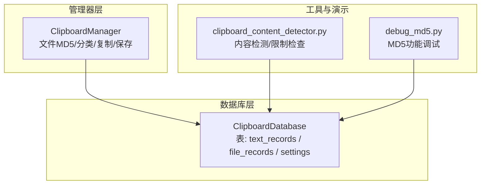
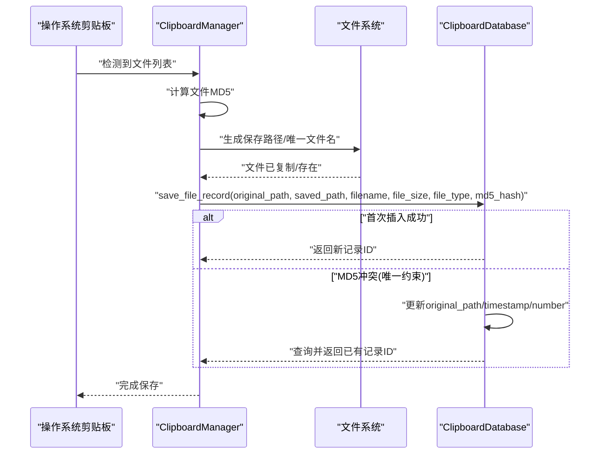
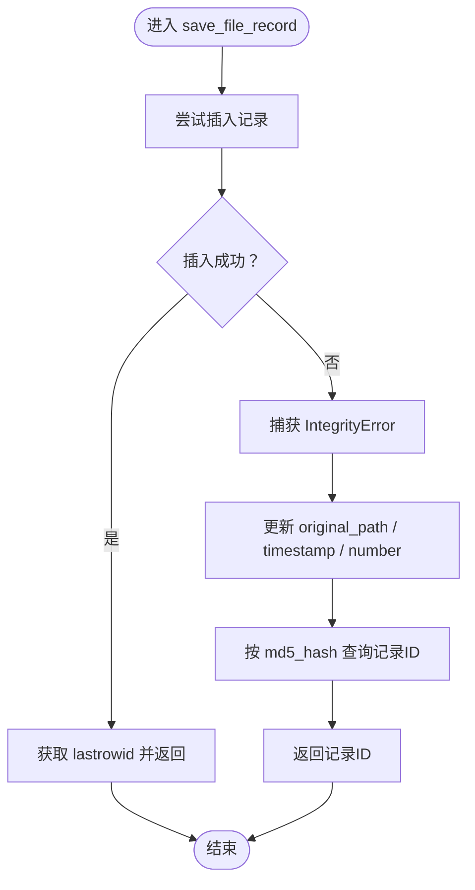
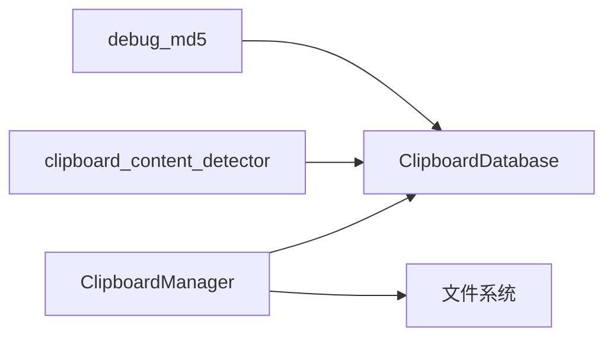

# 文件记录保存

<cite>
**本文引用的文件**
- [clipboard_db.py](file://clipboard_db.py)
- [clipboard_manager_main.py](file://clipboard_manager_main.py)
- [clipboard_content_detector.py](file://clipboard_content_detector.py)
- [debug_md5.py](file://debug_md5.py)
</cite>

## 目录
1. [简介](#简介)
2. [项目结构](#项目结构)
3. [核心组件](#核心组件)
4. [架构总览](#架构总览)
5. [详细组件分析](#详细组件分析)
6. [依赖关系分析](#依赖关系分析)
7. [性能考量](#性能考量)
8. [故障排查指南](#故障排查指南)
9. [结论](#结论)
10. [附录](#附录)

## 简介
本文件聚焦“文件记录保存”的实现细节，围绕 save_file_record 方法展开，系统阐述其如何处理文件路径、文件名、文件大小、文件类型与MD5哈希值等参数的持久化；当遇到唯一约束冲突（IntegrityError）时的更新逻辑（更新原始路径、时间戳与递增计数器）；本地时间戳的应用；以及 lastrowid 在获取新记录ID中的作用。同时给出从创建到入库的完整调用链路示例，并对比文本记录保存的异同与异常处理策略。

## 项目结构
- 数据库层：负责SQLite表结构初始化、文本与文件记录的插入与查询、设置项维护、过期清理等。
- 管理器层：负责剪贴板内容检测、文件去重与复制、文件MD5计算、文件分类与落盘、最终调用数据库层保存。
- 工具与演示：包含内容检测脚本、MD5调试脚本等辅助工具。

图表来源
- [clipboard_db.py](file://clipboard_db.py#L1-L115)
- [clipboard_manager_main.py](file://clipboard_manager_main.py#L355-L496)
- [clipboard_content_detector.py](file://clipboard_content_detector.py#L1-L60)
- [debug_md5.py](file://debug_md5.py#L1-L56)

章节来源
- [clipboard_db.py](file://clipboard_db.py#L1-L115)
- [clipboard_manager_main.py](file://clipboard_manager_main.py#L355-L496)

## 核心组件
- ClipboardDatabase：封装数据库连接、表初始化、文本与文件记录的保存、查询、统计、清理等功能。
- ClipboardManager：封装剪贴板监控、文件MD5计算、文件分类与落盘、调用数据库保存文件记录。
- clipboard_content_detector：提供剪贴板内容检测与复制限制检查能力，供其他模块复用。
- debug_md5：演示文本MD5去重与计数更新的调试脚本，便于理解去重机制。

章节来源
- [clipboard_db.py](file://clipboard_db.py#L1-L115)
- [clipboard_manager_main.py](file://clipboard_manager_main.py#L355-L496)
- [clipboard_content_detector.py](file://clipboard_content_detector.py#L1-L60)
- [debug_md5.py](file://debug_md5.py#L1-L56)

## 架构总览
文件记录保存的端到端流程如下：
- 剪贴板检测到文件列表后，计算每个文件的MD5；
- 根据文件类型与日期生成目标保存目录与唯一文件名；
- 若目标文件不存在则复制源文件；
- 调用数据库层的 save_file_record 方法持久化记录；
- 当MD5冲突时，触发更新逻辑（更新原始路径、时间戳、递增计数器）。

图表来源
- [clipboard_manager_main.py](file://clipboard_manager_main.py#L416-L454)
- [clipboard_db.py](file://clipboard_db.py#L152-L184)

## 详细组件分析

### save_file_record 方法详解
- 参数与持久化字段
  - original_path：原始文件路径
  - saved_path：最终保存路径
  - filename：文件名
  - file_size：文件大小（字节）
  - file_type：文件类型（基于扩展名分类）
  - md5_hash：文件MD5哈希值（唯一索引）
  - timestamp：时间戳（本地时间）
  - number：计数器（默认1，冲突时递增）

- 插入逻辑
  - 使用本地时间字符串写入timestamp字段
  - 插入上述字段，number初始为1
  - 通过cursor.lastrowid获取刚插入的记录ID

- 冲突处理（IntegrityError）
  - 当md5_hash唯一约束冲突时，执行更新：
    - 更新original_path为最新路径
    - 更新timestamp为当前本地时间
    - 将number加1
  - 查询并返回该md5_hash对应的记录ID

- 本地时间戳与lastrowid
  - 本地时间：使用本地时间字符串写入数据库，便于人类可读与统一时区显示
  - lastrowid：在INSERT成功后立即可用，用于快速获取新记录ID，避免额外查询

- 异常处理策略
  - 数据库层对sqlite3.IntegrityError进行捕获与分支处理
  - 管理器层在计算MD5失败时会跳过该文件，避免无效数据入库
  - 剪贴板访问异常在管理器层有try/finally保护，确保资源释放

章节来源
- [clipboard_db.py](file://clipboard_db.py#L152-L184)
- [clipboard_manager_main.py](file://clipboard_manager_main.py#L416-L454)

### 与文本记录保存的异同
- 相同点
  - 都使用md5_hash作为去重依据
  - 都在冲突时更新timestamp并递增number
  - 都使用本地时间字符串写入timestamp
  - 都通过lastrowid获取新记录ID

- 不同点
  - 文件记录多出original_path与saved_path字段，用于追踪原始来源与最终落盘位置
  - 文件记录的冲突更新还会同步更新original_path，确保记录指向最新来源
  - 文件记录还包含file_size与file_type字段，便于检索与统计

章节来源
- [clipboard_db.py](file://clipboard_db.py#L116-L151)
- [clipboard_db.py](file://clipboard_db.py#L152-L184)

### 实际调用示例（从创建到数据库存储）
以下示例展示一次典型文件复制与保存流程（步骤对应源码行号）：
1. 剪贴板检测到文件列表
   - 参考：[clipboard_manager_main.py](file://clipboard_manager_main.py#L395-L496)
2. 计算文件MD5
   - 参考：[clipboard_manager_main.py](file://clipboard_manager_main.py#L24-L35)
3. 生成保存路径与唯一文件名
   - 参考：[clipboard_manager_main.py](file://clipboard_manager_main.py#L429-L439)
4. 复制文件（若目标不存在）
   - 参考：[clipboard_manager_main.py](file://clipboard_manager_main.py#L440-L444)
5. 调用save_file_record保存记录
   - 参考：[clipboard_manager_main.py](file://clipboard_manager_main.py#L446-L448)
6. 数据库层插入或冲突更新
   - 参考：[clipboard_db.py](file://clipboard_db.py#L152-L184)

章节来源
- [clipboard_manager_main.py](file://clipboard_manager_main.py#L395-L454)
- [clipboard_db.py](file://clipboard_db.py#L152-L184)

### 关键流程图：冲突更新逻辑

图表来源
- [clipboard_db.py](file://clipboard_db.py#L152-L184)

## 依赖关系分析
- ClipboardManager 依赖 ClipboardDatabase 的 save_file_record 与 save_text_record
- ClipboardManager 依赖文件系统进行复制与路径生成
- clipboard_content_detector 依赖 ClipboardDatabase 的设置查询能力
- debug_md5 依赖 ClipboardDatabase 的文本记录保存与查询

图表来源
- [clipboard_manager_main.py](file://clipboard_manager_main.py#L355-L496)
- [clipboard_db.py](file://clipboard_db.py#L1-L115)
- [clipboard_content_detector.py](file://clipboard_content_detector.py#L1-L60)
- [debug_md5.py](file://debug_md5.py#L1-L56)

章节来源
- [clipboard_manager_main.py](file://clipboard_manager_main.py#L355-L496)
- [clipboard_db.py](file://clipboard_db.py#L1-L115)
- [clipboard_content_detector.py](file://clipboard_content_detector.py#L1-L60)
- [debug_md5.py](file://debug_md5.py#L1-L56)

## 性能考量
- MD5计算
  - 文件MD5采用分块读取，避免大文件一次性加载内存，降低内存峰值
  - 参考：[clipboard_manager_main.py](file://clipboard_manager_main.py#L24-L35)
- 去重与计数
  - 通过md5_hash唯一索引实现O(log n)级别的冲突检测
  - 冲突时仅更新必要字段并递增计数，避免全量更新
  - 参考：[clipboard_db.py](file://clipboard_db.py#L152-L184)
- 时间戳
  - 使用本地时间字符串，减少时区转换开销
  - 参考：[clipboard_db.py](file://clipboard_db.py#L157-L158)

## 故障排查指南
- 常见问题与定位
  - MD5计算失败：检查文件是否存在、权限是否足够、读取是否抛出异常
    - 参考：[clipboard_manager_main.py](file://clipboard_manager_main.py#L24-L35)
  - 插入失败（IntegrityError）：确认md5_hash是否唯一；如冲突，检查是否正确执行了更新逻辑
    - 参考：[clipboard_db.py](file://clipboard_db.py#L169-L184)
  - 无法获取新记录ID：确认INSERT是否成功；lastrowid仅在成功插入后有效
    - 参考：[clipboard_db.py](file://clipboard_db.py#L162-L169)
  - 剪贴板访问异常：确保在finally中关闭剪贴板句柄
    - 参考：[clipboard_manager_main.py](file://clipboard_manager_main.py#L488-L496)

- 调试建议
  - 使用debug_md5脚本验证文本MD5去重与计数更新行为，类比理解文件记录的冲突更新
    - 参考：[debug_md5.py](file://debug_md5.py#L1-L56)

章节来源
- [clipboard_manager_main.py](file://clipboard_manager_main.py#L24-L35)
- [clipboard_manager_main.py](file://clipboard_manager_main.py#L488-L496)
- [clipboard_db.py](file://clipboard_db.py#L152-L184)
- [debug_md5.py](file://debug_md5.py#L1-L56)

## 结论
- save_file_record方法通过md5_hash实现文件级去重，冲突时更新原始路径、时间戳与计数器，保证历史可追溯且避免重复存储。
- 本地时间戳与lastrowid的结合，既满足人类可读的时间显示，又能在插入成功时高效获取新记录ID。
- 与文本记录保存相比，文件记录增加了原始路径与保存路径字段，更利于文件溯源与管理。
- 整体实现简洁可靠，具备良好的异常处理与调试支持。

## 附录
- 表结构要点（file_records）
  - 字段：id、original_path、saved_path、filename、file_size、file_type、md5_hash（UNIQUE）、timestamp、number（DEFAULT 1）
  - 参考：[clipboard_db.py](file://clipboard_db.py#L54-L67)

章节来源
- [clipboard_db.py](file://clipboard_db.py#L54-L67)