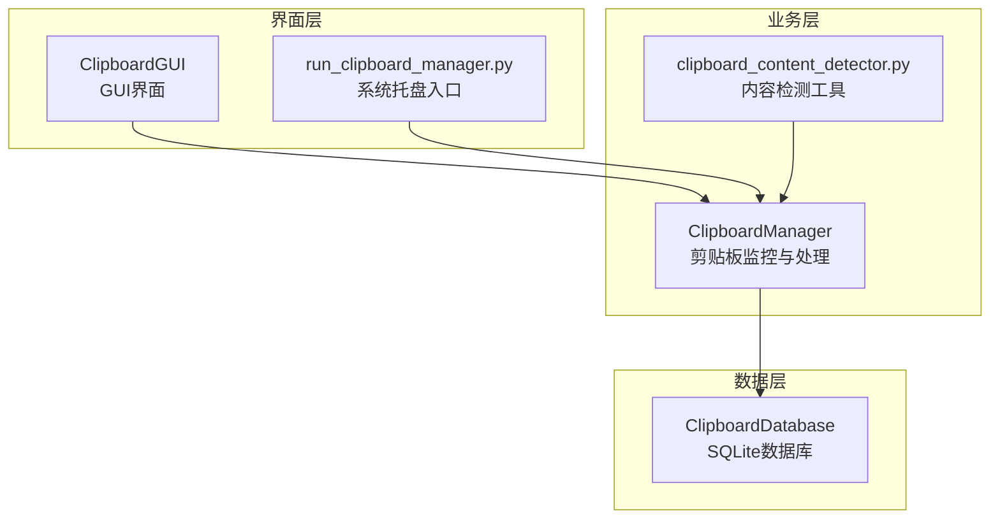
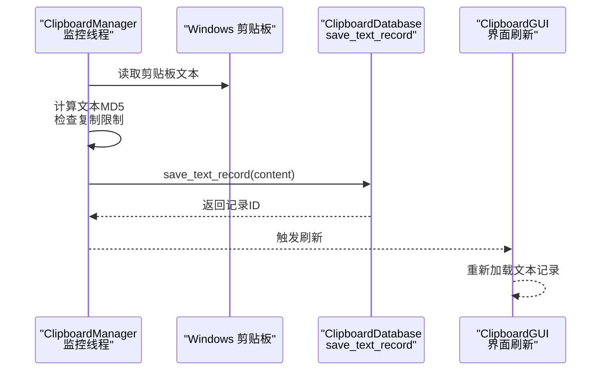
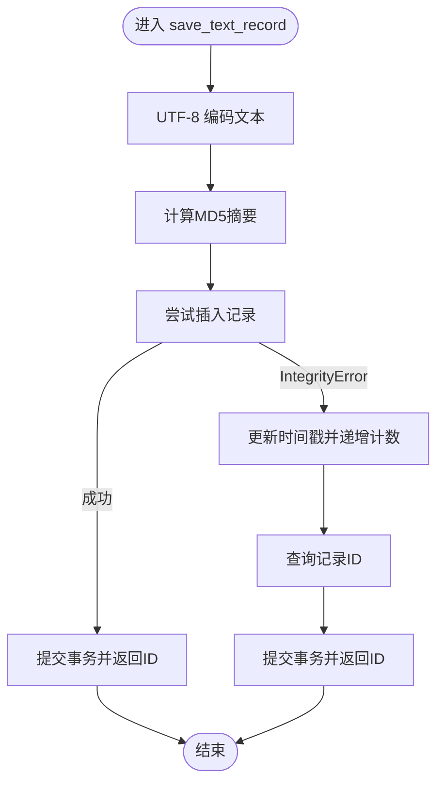
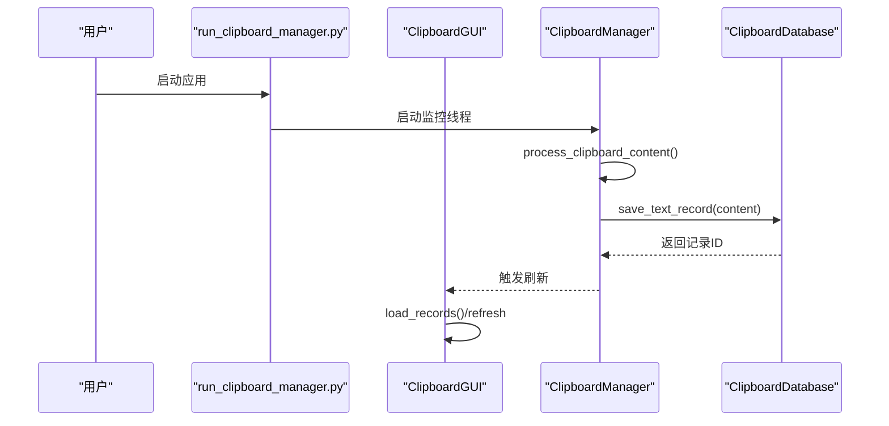
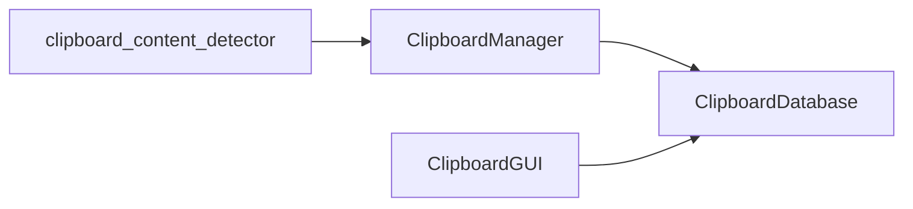

# 文本记录保存

<cite>
**本文引用的文件**
- [clipboard_manager_main.py](file://clipboard_manager_main.py)
- [clipboard_db.py](file://clipboard_db.py)
- [clipboard_gui.py](file://clipboard_gui.py)
- [clipboard_content_detector.py](file://clipboard_content_detector.py)
- [debug_md5.py](file://debug_md5.py)
- [run_clipboard_manager.py](file://run_clipboard_manager.py)
</cite>

## 目录
1. [简介](#简介)
2. [项目结构](#项目结构)
3. [核心组件](#核心组件)
4. [架构总览](#架构总览)
5. [详细组件分析](#详细组件分析)
6. [依赖关系分析](#依赖关系分析)
7. [性能考量](#性能考量)
8. [故障排查指南](#故障排查指南)
9. [结论](#结论)
10. [附录](#附录)

## 简介
本文聚焦“文本记录保存”的实现细节，围绕以下目标展开：
- 详解 save_text_record 方法如何计算MD5哈希值、处理本地时间戳、执行数据库插入或更新。
- 分析在遇到IntegrityError时的去重逻辑，包括更新时间戳和递增计数器的处理流程。
- 探讨文本内容编码为UTF-8的必要性以及字符计数的实现方式。
- 提供从GUI界面触发文本记录保存的完整调用链，并说明异常处理策略和事务提交机制。

## 项目结构
该项目采用“功能模块化 + GUI入口”的组织方式：
- 数据层：ClipboardDatabase 类负责数据库初始化、文本/文件记录的增删改查、设置管理等。
- 业务层：ClipboardManager 负责监控剪贴板、读取内容、计算MD5、保存记录、限制检查等。
- 界面层：ClipboardGUI 提供图形界面，支持查询、统计、设置等功能。
- 工具与入口：run_clipboard_manager.py 作为系统托盘入口；debug_md5.py 用于调试MD5功能；clipboard_content_detector.py 提供剪贴板内容检测工具。

图表来源
- [clipboard_manager_main.py](file://clipboard_manager_main.py#L112-L179)
- [clipboard_db.py](file://clipboard_db.py#L116-L183)
- [clipboard_gui.py](file://clipboard_gui.py#L1-L120)
- [run_clipboard_manager.py](file://run_clipboard_manager.py#L32-L70)
- [clipboard_content_detector.py](file://clipboard_content_detector.py#L1-L120)

章节来源
- [clipboard_manager_main.py](file://clipboard_manager_main.py#L112-L179)
- [clipboard_db.py](file://clipboard_db.py#L116-L183)
- [clipboard_gui.py](file://clipboard_gui.py#L1-L120)
- [run_clipboard_manager.py](file://run_clipboard_manager.py#L32-L70)
- [clipboard_content_detector.py](file://clipboard_content_detector.py#L1-L120)

## 核心组件
- ClipboardDatabase.save_text_record：核心保存逻辑，负责MD5计算、本地时间戳、插入或更新、计数递增。
- ClipboardManager.process_clipboard_content：从剪贴板读取文本，调用数据库保存。
- ClipboardGUI：提供界面入口，支持搜索、刷新、统计等。
- run_clipboard_manager.py：系统托盘入口，启动监控线程与GUI。

章节来源
- [clipboard_manager_main.py](file://clipboard_manager_main.py#L112-L179)
- [clipboard_db.py](file://clipboard_db.py#L116-L183)
- [clipboard_gui.py](file://clipboard_gui.py#L1-L120)
- [run_clipboard_manager.py](file://run_clipboard_manager.py#L32-L70)

## 架构总览
文本记录保存的端到端流程如下：
- 剪贴板监控线程周期性检查剪贴板内容。
- 若检测到新的文本内容，计算其MD5并判断是否超过限制。
- 调用数据库层的 save_text_record 执行插入或更新。
- GUI界面刷新显示最新记录。

图表来源
- [clipboard_manager_main.py](file://clipboard_manager_main.py#L395-L496)
- [clipboard_manager_main.py](file://clipboard_manager_main.py#L471-L484)
- [clipboard_manager_main.py](file://clipboard_manager_main.py#L112-L179)
- [clipboard_gui.py](file://clipboard_gui.py#L615-L716)

章节来源
- [clipboard_manager_main.py](file://clipboard_manager_main.py#L395-L496)
- [clipboard_manager_main.py](file://clipboard_manager_main.py#L112-L179)
- [clipboard_gui.py](file://clipboard_gui.py#L615-L716)

## 详细组件分析

### 1) save_text_record 方法实现细节
- MD5哈希计算
  - 使用 UTF-8 编码将文本转为字节流，再计算MD5摘要。
  - 该方法在两个文件中均有实现，确保一致性。
- 本地时间戳
  - 使用本地时间格式化为字符串，避免跨时区差异带来的显示问题。
- 插入或更新
  - 首次插入成功时返回最后插入ID；若因唯一约束冲突抛出IntegrityError，则执行更新逻辑。
- 去重与计数
  - 发生冲突时，更新该MD5对应记录的时间戳，并将number字段加一。
  - 最终通过查询该MD5对应的记录ID返回给调用方。

图表来源
- [clipboard_db.py](file://clipboard_db.py#L116-L183)
- [clipboard_manager_main.py](file://clipboard_manager_main.py#L112-L179)

章节来源
- [clipboard_db.py](file://clipboard_db.py#L116-L183)
- [clipboard_manager_main.py](file://clipboard_manager_main.py#L112-L179)

### 2) 文本内容编码为UTF-8的必要性
- 保证跨平台一致性：不同系统或语言环境下的文本可能以不同编码存储，统一使用UTF-8可确保MD5计算结果稳定。
- 与数据库字段设计一致：数据库层对文本字段的MD5计算均基于UTF-8字节序列，避免重复保存相同内容但编码不同的情况。

章节来源
- [clipboard_db.py](file://clipboard_db.py#L121-L123)
- [clipboard_manager_main.py](file://clipboard_manager_main.py#L117-L120)
- [clipboard_content_detector.py](file://clipboard_content_detector.py#L139-L141)

### 3) 字符计数的实现方式
- 通过计算UTF-8字节长度来估算字符数，便于限制检查与显示。
- 在限制检查阶段，会将文本大小与设置的最大复制大小比较，防止超限。

章节来源
- [clipboard_manager_main.py](file://clipboard_manager_main.py#L471-L477)
- [clipboard_db.py](file://clipboard_db.py#L128-L131)

### 4) 异常处理策略与事务提交机制
- IntegrityError 去重：捕获唯一约束冲突，执行更新而非插入。
- 事务提交：每次数据库操作均在本地连接内提交，确保原子性。
- 其他异常：对剪贴板读取、文件处理等场景进行异常捕获与日志输出，避免中断监控线程。

章节来源
- [clipboard_manager_main.py](file://clipboard_manager_main.py#L488-L496)
- [clipboard_manager_main.py](file://clipboard_manager_main.py#L133-L146)
- [clipboard_db.py](file://clipboard_db.py#L137-L150)

### 5) 从GUI触发文本记录保存的调用链
- GUI入口：run_clipboard_manager.py 启动监控线程与GUI。
- 监控线程：ClipboardManager.monitor_clipboard_loop 循环调用 process_clipboard_content。
- 文本处理：process_clipboard_content 读取剪贴板文本，调用 save_text_record 保存。
- 界面刷新：GUI.load_records 或 ClipboardGUIMain.load_records 刷新显示。

图表来源
- [run_clipboard_manager.py](file://run_clipboard_manager.py#L32-L70)
- [clipboard_manager_main.py](file://clipboard_manager_main.py#L395-L496)
- [clipboard_manager_main.py](file://clipboard_manager_main.py#L471-L484)
- [clipboard_gui.py](file://clipboard_gui.py#L615-L716)

章节来源
- [run_clipboard_manager.py](file://run_clipboard_manager.py#L32-L70)
- [clipboard_manager_main.py](file://clipboard_manager_main.py#L395-L496)
- [clipboard_gui.py](file://clipboard_gui.py#L615-L716)

## 依赖关系分析
- ClipboardManager 依赖 ClipboardDatabase 提供的数据库接口。
- ClipboardGUI 依赖 ClipboardDatabase 查询与统计能力。
- clipboard_content_detector.py 与 ClipboardManager 协作，提供内容检测与限制检查辅助。

图表来源
- [clipboard_manager_main.py](file://clipboard_manager_main.py#L355-L496)
- [clipboard_gui.py](file://clipboard_gui.py#L1-L120)
- [clipboard_content_detector.py](file://clipboard_content_detector.py#L1-L120)

章节来源
- [clipboard_manager_main.py](file://clipboard_manager_main.py#L355-L496)
- [clipboard_gui.py](file://clipboard_gui.py#L1-L120)
- [clipboard_content_detector.py](file://clipboard_content_detector.py#L1-L120)

## 性能考量
- MD5计算：对长文本逐块读取，降低内存占用，提高大文本处理效率。
- 唯一索引：text_records 的 md5_hash 字段建立唯一索引，加速冲突检测与去重。
- 事务粒度：每个保存操作在独立连接内提交，避免长时间持有连接导致阻塞。
- 监控频率：默认1秒检测一次，可根据需求调整间隔。

章节来源
- [clipboard_manager_main.py](file://clipboard_manager_main.py#L24-L35)
- [clipboard_db.py](file://clipboard_db.py#L33-L53)
- [clipboard_manager_main.py](file://clipboard_manager_main.py#L718-L730)

## 故障排查指南
- 文本未保存或重复保存
  - 检查是否触发了复制限制（无限模式除外），确认文本大小与数量限制。
  - 使用 debug_md5.py 验证MD5计算与去重逻辑。
- MD5不一致
  - 确认编码一致性（UTF-8）与内容一致性（去空白、换行等影响）。
- 数据库唯一约束冲突
  - IntegrityError 是预期行为，表示命中去重逻辑；如需排查，可查询 md5_hash 对应记录的 number 字段。
- 剪贴板访问异常
  - 监控线程中对 OpenClipboard 异常进行了保护，避免崩溃；若出现权限问题，建议以管理员身份运行。

章节来源
- [debug_md5.py](file://debug_md5.py#L1-L56)
- [clipboard_manager_main.py](file://clipboard_manager_main.py#L471-L496)
- [clipboard_manager_main.py](file://clipboard_manager_main.py#L133-L146)

## 结论
- save_text_record 通过UTF-8编码与MD5去重，结合本地时间戳与计数字段，实现了高效稳定的文本记录保存。
- IntegrityError 的捕获与更新逻辑确保相同内容不会产生重复记录，同时提升检索与统计的准确性。
- GUI与监控线程协同工作，提供良好的用户体验与可观测性。

## 附录
- 实际调用示例（路径参考）
  - 保存文本记录：[clipboard_manager_main.py](file://clipboard_manager_main.py#L471-L484)
  - 数据库保存：[clipboard_db.py](file://clipboard_db.py#L116-L183)
  - GUI界面刷新：[clipboard_gui.py](file://clipboard_gui.py#L615-L716)
  - 系统托盘入口：[run_clipboard_manager.py](file://run_clipboard_manager.py#L32-L70)
  - MD5调试脚本：[debug_md5.py](file://debug_md5.py#L1-L56)