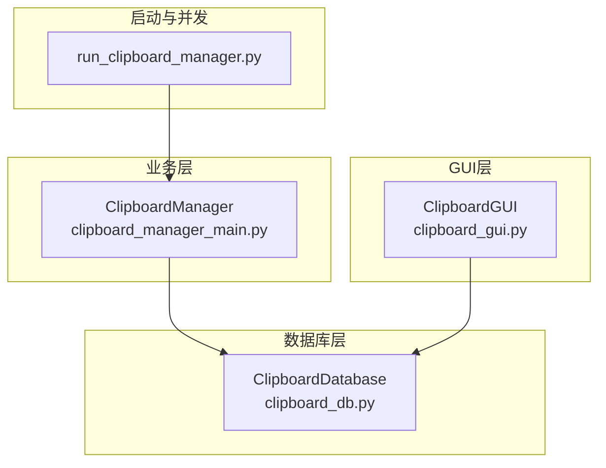
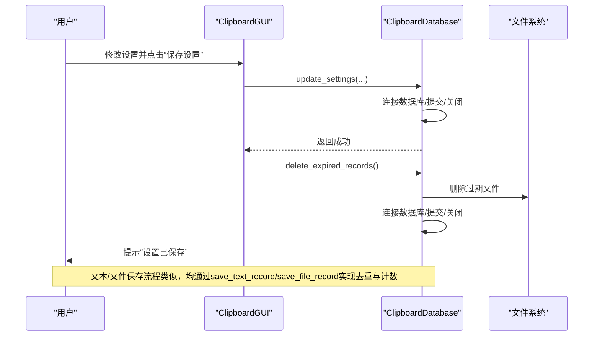
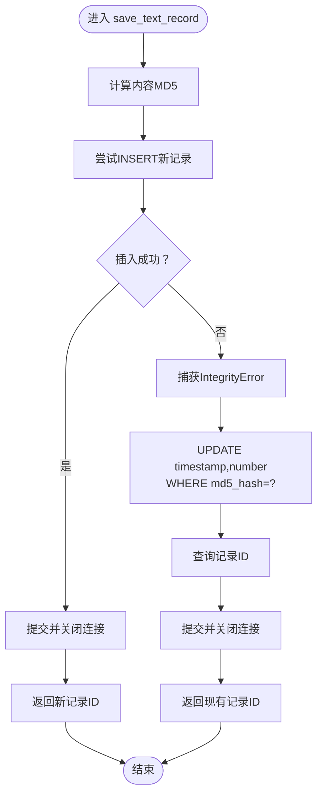
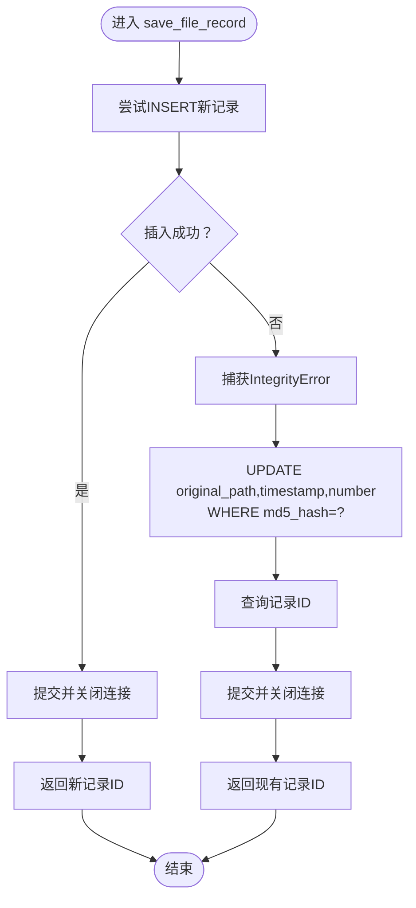
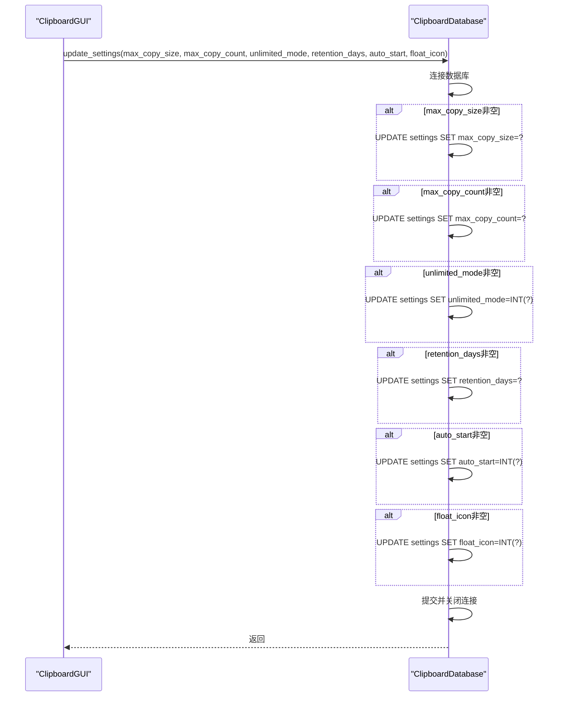
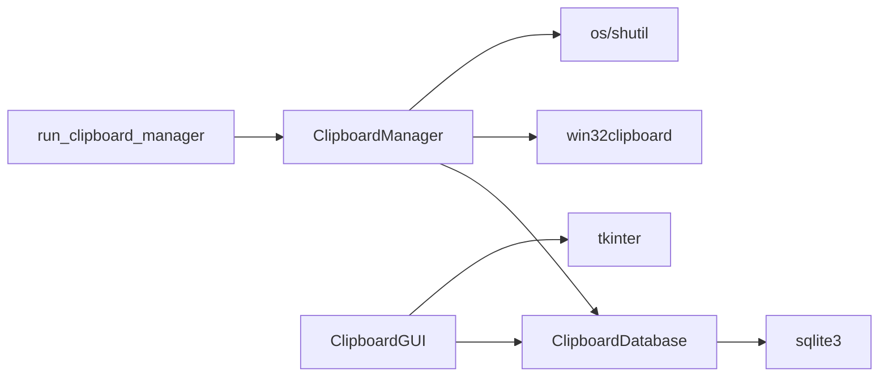

# 更新操作

<cite>
**本文引用的文件**
- [clipboard_db.py](file://clipboard_db.py)
- [clipboard_manager_main.py](file://clipboard_manager_main.py)
- [clipboard_gui.py](file://clipboard_gui.py)
- [run_clipboard_manager.py](file://run_clipboard_manager.py)
- [debug_md5.py](file://debug_md5.py)
- [cleanup_duplicates.py](file://cleanup_duplicates.py)
- [check_db.py](file://check_db.py)
</cite>

## 目录
1. [简介](#简介)
2. [项目结构](#项目结构)
3. [核心组件](#核心组件)
4. [架构总览](#架构总览)
5. [详细组件分析](#详细组件分析)
6. [依赖关系分析](#依赖关系分析)
7. [性能考量](#性能考量)
8. [故障排查指南](#故障排查指南)
9. [结论](#结论)
10. [附录](#附录)

## 简介
本文件聚焦于应用程序中的数据库更新操作，深入解析以下方法的实现细节：
- save_text_record：文本记录的保存与去重更新
- save_file_record：文件记录的保存与去重更新
- update_settings：设置项的更新

重点覆盖：
- 事务处理与错误处理策略
- 数据一致性保障（MD5去重、number计数、时间戳）
- 批量更新与单条更新的性能差异与优化建议
- 实际调用方式与异常处理策略示例

## 项目结构
该项目采用“模块化+职责分离”的组织方式：
- 数据库层：clipboard_db.py 提供SQLite数据库封装与CRUD接口
- 业务层：clipboard_manager_main.py 提供剪贴板监控与内容处理逻辑
- GUI层：clipboard_gui.py 提供图形界面与设置更新入口
- 启动与并发：run_clipboard_manager.py 控制进程互斥与线程监控

图表来源
- [clipboard_db.py](file://clipboard_db.py#L1-L115)
- [clipboard_manager_main.py](file://clipboard_manager_main.py#L355-L496)
- [clipboard_gui.py](file://clipboard_gui.py#L478-L533)
- [run_clipboard_manager.py](file://run_clipboard_manager.py#L32-L66)

章节来源
- [clipboard_db.py](file://clipboard_db.py#L1-L115)
- [clipboard_manager_main.py](file://clipboard_manager_main.py#L355-L496)
- [clipboard_gui.py](file://clipboard_gui.py#L478-L533)
- [run_clipboard_manager.py](file://run_clipboard_manager.py#L32-L66)

## 核心组件
- ClipboardDatabase：封装数据库初始化、文本/文件记录保存、设置更新、过期清理等
- ClipboardManager：负责剪贴板监控、内容识别、文件MD5计算与保存
- ClipboardGUI：提供设置界面，调用update_settings并触发过期清理
- run_clipboard_manager：进程互斥、监控线程与GUI启动

章节来源
- [clipboard_db.py](file://clipboard_db.py#L1-L115)
- [clipboard_manager_main.py](file://clipboard_manager_main.py#L355-L496)
- [clipboard_gui.py](file://clipboard_gui.py#L478-L533)
- [run_clipboard_manager.py](file://run_clipboard_manager.py#L32-L66)

## 架构总览
更新操作在不同入口处的调用链如下：

图表来源
- [clipboard_gui.py](file://clipboard_gui.py#L478-L533)
- [clipboard_db.py](file://clipboard_db.py#L387-L412)
- [clipboard_db.py](file://clipboard_db.py#L413-L455)

## 详细组件分析

### ClipboardDatabase.save_text_record：文本记录保存与MD5去重
- 功能要点
  - 计算内容MD5，插入新记录或命中唯一约束时走去重分支
  - 去重分支：更新timestamp与number计数，保持最新时间与出现频次
  - 使用本地时间字符串而非UTC，便于人类可读
- 错误处理
  - 捕获IntegrityError表示MD5冲突，进入去重更新逻辑
  - 其他异常未显式捕获，由调用方处理
- 数据一致性
  - md5_hash唯一索引（text_records）保证去重
  - number字段用于统计重复次数，避免冗余存储
  - timestamp字段用于排序与过期清理

图表来源
- [clipboard_db.py](file://clipboard_db.py#L116-L151)

章节来源
- [clipboard_db.py](file://clipboard_db.py#L116-L151)

### ClipboardDatabase.save_file_record：文件记录保存与MD5去重
- 功能要点
  - 以文件MD5作为去重依据，插入新记录或命中唯一约束时走去重分支
  - 去重分支：更新original_path、timestamp与number计数
  - 保存路径与文件类型等元信息一并持久化
- 错误处理
  - 捕获IntegrityError表示MD5冲突，进入去重更新逻辑
  - 其他异常未显式捕获，由调用方处理
- 数据一致性
  - file_records.md5_hash唯一约束保证去重
  - number字段用于统计重复次数
  - timestamp字段用于排序与过期清理

图表来源
- [clipboard_db.py](file://clipboard_db.py#L152-L184)

章节来源
- [clipboard_db.py](file://clipboard_db.py#L152-L184)

### ClipboardDatabase.update_settings：设置项更新
- 功能要点
  - 支持部分字段更新（max_copy_size、max_copy_count、unlimited_mode、retention_days、auto_start、float_icon）
  - 逐字段判断非None后执行UPDATE，最后统一提交
- 错误处理
  - 未显式捕获异常，调用方需自行处理
- 数据一致性
  - settings表id=1的单行约束保证唯一性
  - 新增字段通过ALTER TABLE兼容旧版本

图表来源
- [clipboard_db.py](file://clipboard_db.py#L387-L412)
- [clipboard_gui.py](file://clipboard_gui.py#L478-L533)

章节来源
- [clipboard_db.py](file://clipboard_db.py#L387-L412)
- [clipboard_gui.py](file://clipboard_gui.py#L478-L533)

### 事务处理与错误处理策略
- 事务特性
  - 单条INSERT/UPDATE/DELETE操作在方法内独立开启/提交/关闭连接，未使用显式BEGIN/COMMIT块
  - 去重场景先INSERT后UPDATE，分别提交，不构成原子事务
- 错误处理
  - save_text_record/save_file_record：捕获IntegrityError进行去重更新
  - update_settings：未显式捕获异常，调用方应处理
  - delete_expired_records：删除过期记录后提交，文件删除异常仅打印日志
- 建议
  - 对需要强一致性的多步操作（如先INSERT后UPDATE）建议引入显式事务BEGIN/COMMIT/ROLLBACK
  - 对可能失败的文件删除操作增加更完善的异常捕获与回滚策略

章节来源
- [clipboard_db.py](file://clipboard_db.py#L116-L151)
- [clipboard_db.py](file://clipboard_db.py#L152-L184)
- [clipboard_db.py](file://clipboard_db.py#L387-L412)
- [clipboard_db.py](file://clipboard_db.py#L413-L455)

### MD5去重机制与时间戳处理
- MD5去重
  - 文本：text_records.md5_hash唯一索引，去重时更新timestamp与number
  - 文件：file_records.md5_hash唯一约束，去重时更新original_path、timestamp与number
- 时间戳
  - 保存时使用本地时间字符串，便于人类可读
  - 去重时更新timestamp为最新时间，保证排序与过期清理的正确性
- number计数
  - 去重时递增number，用于统计重复次数
  - 查询与排序时可按number进行聚合展示

章节来源
- [clipboard_db.py](file://clipboard_db.py#L23-L45)
- [clipboard_db.py](file://clipboard_db.py#L54-L74)
- [clipboard_db.py](file://clipboard_db.py#L116-L151)
- [clipboard_db.py](file://clipboard_db.py#L152-L184)

### 批量更新与单条更新的性能差异与优化
- 单条更新
  - save_text_record/save_file_record每次只处理一条记录，适合高频触发的剪贴板监控
  - 去重成本低，但多次INSERT/UPDATE开销累积
- 批量更新
  - 当前实现未提供批量接口，若需提升吞吐，可在业务层合并相同MD5的记录，减少去重更新次数
  - 建议：在ClipboardManager中维护内存去重表，周期性批量写入数据库
- 优化建议
  - 引入显式事务：对多步更新（INSERT/UPDATE）使用BEGIN/COMMIT包裹，减少锁竞争
  - 减少往返：将多个UPDATE合并为单条SQL（如使用CASE WHEN）
  - 索引优化：确保md5_hash与timestamp字段有合适索引，加速去重与过期清理
  - I/O优化：文件保存与数据库写入异步化，避免阻塞主线程

章节来源
- [clipboard_manager_main.py](file://clipboard_manager_main.py#L395-L496)
- [clipboard_db.py](file://clipboard_db.py#L116-L151)
- [clipboard_db.py](file://clipboard_db.py#L152-L184)

### 实际调用方式与异常处理策略示例
- 文本记录保存（剪贴板监控）
  - 调用路径：ClipboardManager.process_clipboard_content -> ClipboardDatabase.save_text_record
  - 异常处理：外层try/except捕获读取剪贴板与保存过程中的异常，避免中断监控循环
  - 参考路径：
    - [clipboard_manager_main.py](file://clipboard_manager_main.py#L395-L496)
    - [clipboard_db.py](file://clipboard_db.py#L116-L151)
- 文件记录保存（剪贴板监控）
  - 调用路径：ClipboardManager.process_clipboard_content -> ClipboardDatabase.save_file_record
  - 异常处理：外层try/except捕获文件读取、MD5计算与保存过程中的异常
  - 参考路径：
    - [clipboard_manager_main.py](file://clipboard_manager_main.py#L395-L496)
    - [clipboard_db.py](file://clipboard_db.py#L152-L184)
- 设置更新（GUI）
  - 调用路径：ClipboardGUI.save_settings -> ClipboardDatabase.update_settings -> delete_expired_records
  - 异常处理：GUI层对数值校验失败进行提示；update_settings未捕获异常，调用方需处理
  - 参考路径：
    - [clipboard_gui.py](file://clipboard_gui.py#L478-L533)
    - [clipboard_db.py](file://clipboard_db.py#L387-L412)
    - [clipboard_db.py](file://clipboard_db.py#L413-L455)
- 调试与验证
  - 使用debug_md5.py验证MD5去重与number计数
  - 使用cleanup_duplicates.py清理历史重复记录
  - 使用check_db.py检查数据库状态
  - 参考路径：
    - [debug_md5.py](file://debug_md5.py#L1-L56)
    - [cleanup_duplicates.py](file://cleanup_duplicates.py#L1-L67)
    - [check_db.py](file://check_db.py#L1-L31)

章节来源
- [clipboard_manager_main.py](file://clipboard_manager_main.py#L395-L496)
- [clipboard_db.py](file://clipboard_db.py#L116-L151)
- [clipboard_db.py](file://clipboard_db.py#L152-L184)
- [clipboard_gui.py](file://clipboard_gui.py#L478-L533)
- [debug_md5.py](file://debug_md5.py#L1-L56)
- [cleanup_duplicates.py](file://cleanup_duplicates.py#L1-L67)
- [check_db.py](file://check_db.py#L1-L31)

## 依赖关系分析
- 组件耦合
  - ClipboardManager依赖ClipboardDatabase进行数据持久化
  - ClipboardGUI依赖ClipboardDatabase进行设置读取与更新
  - run_clipboard_manager控制进程互斥与监控线程
- 外部依赖
  - sqlite3：本地数据库
  - win32clipboard/win32con：Windows剪贴板访问
  - tkinter：GUI界面
  - os/shutil：文件系统操作

图表来源
- [clipboard_manager_main.py](file://clipboard_manager_main.py#L355-L496)
- [clipboard_gui.py](file://clipboard_gui.py#L478-L533)
- [run_clipboard_manager.py](file://run_clipboard_manager.py#L32-L66)
- [clipboard_db.py](file://clipboard_db.py#L1-L115)

章节来源
- [clipboard_manager_main.py](file://clipboard_manager_main.py#L355-L496)
- [clipboard_gui.py](file://clipboard_gui.py#L478-L533)
- [run_clipboard_manager.py](file://run_clipboard_manager.py#L32-L66)
- [clipboard_db.py](file://clipboard_db.py#L1-L115)

## 性能考量
- 当前实现特点
  - 单条更新频繁，去重逻辑简单，适合轻量级使用
  - 未使用显式事务，多步更新可能产生短暂不一致
- 优化方向
  - 引入显式事务，减少锁竞争与提交次数
  - 合并UPDATE语句，降低网络/磁盘往返
  - 增加索引覆盖（md5_hash、timestamp），提升查询与清理效率
  - 异步化文件I/O与数据库写入，避免阻塞监控线程
  - 批量写入：在业务层聚合相同MD5的记录，减少去重更新次数

[本节为通用性能讨论，不直接分析具体文件]

## 故障排查指南
- 常见问题
  - MD5冲突导致去重失败：检查md5_hash唯一约束与去重逻辑
  - 设置更新未生效：确认update_settings调用链与提交流程
  - 过期清理失败：检查retention_days配置与文件删除权限
- 排查工具
  - debug_md5.py：验证MD5去重与number计数
  - cleanup_duplicates.py：清理历史重复记录
  - check_db.py：检查数据库状态与重复MD5
- 参考路径
  - [debug_md5.py](file://debug_md5.py#L1-L56)
  - [cleanup_duplicates.py](file://cleanup_duplicates.py#L1-L67)
  - [check_db.py](file://check_db.py#L1-L31)

章节来源
- [debug_md5.py](file://debug_md5.py#L1-L56)
- [cleanup_duplicates.py](file://cleanup_duplicates.py#L1-L67)
- [check_db.py](file://check_db.py#L1-L31)

## 结论
- 本项目通过md5_hash唯一约束实现了高效的去重与计数，结合number字段与timestamp字段满足了排序与过期清理需求
- save_text_record与save_file_record在去重场景下表现稳定，但在高并发下建议引入显式事务与批量写入以提升性能
- update_settings提供了灵活的设置更新能力，建议在调用方增加异常处理与参数校验
- 通过debug与cleanup工具可有效验证与修复数据一致性问题

[本节为总结性内容，不直接分析具体文件]

## 附录
- 关键实现路径参考
  - 文本保存：[clipboard_db.py](file://clipboard_db.py#L116-L151)
  - 文件保存：[clipboard_db.py](file://clipboard_db.py#L152-L184)
  - 设置更新：[clipboard_db.py](file://clipboard_db.py#L387-L412)
  - 过期清理：[clipboard_db.py](file://clipboard_db.py#L413-L455)
  - 剪贴板监控与保存：[clipboard_manager_main.py](file://clipboard_manager_main.py#L395-L496)
  - GUI设置保存与清理：[clipboard_gui.py](file://clipboard_gui.py#L478-L533)
  - 进程互斥与监控线程：[run_clipboard_manager.py](file://run_clipboard_manager.py#L32-L66)