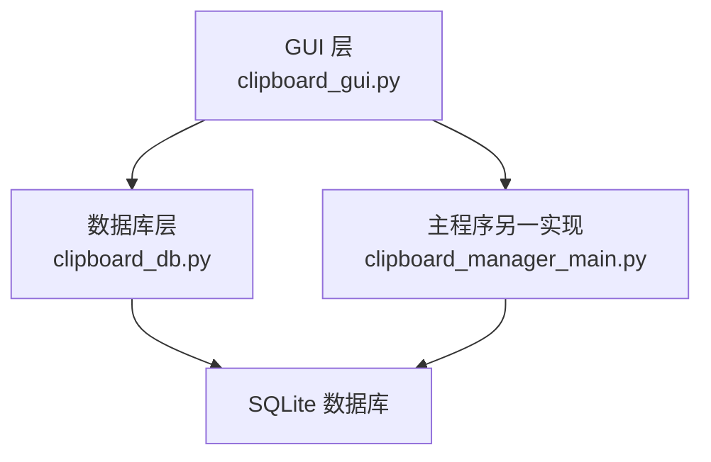
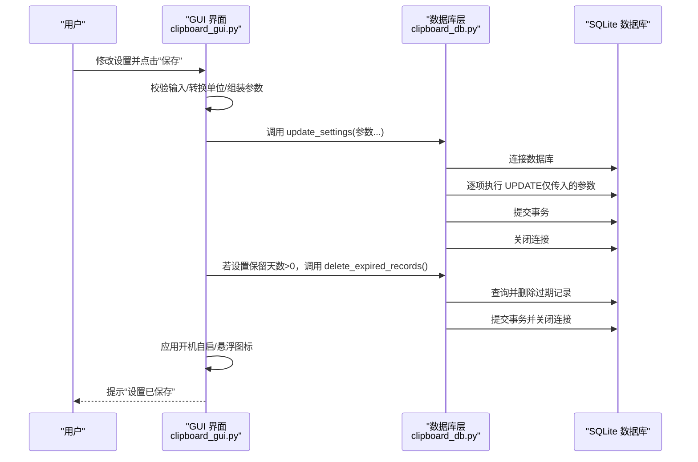
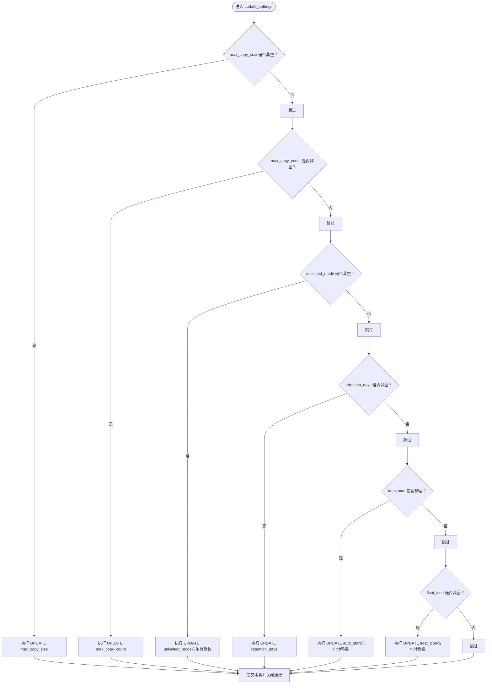
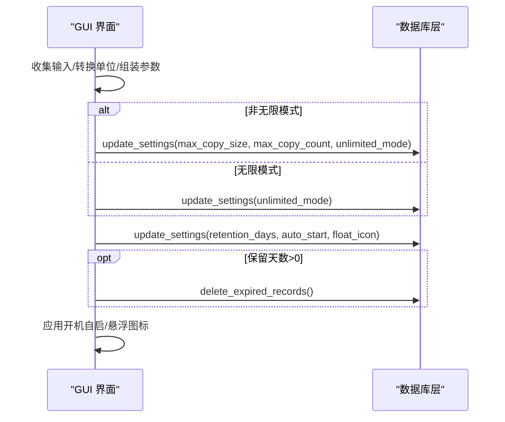

# 设置更新

<cite>
**本文引用的文件**
- [clipboard_db.py](file://clipboard_db.py)
- [clipboard_gui.py](file://clipboard_gui.py)
- [clipboard_manager_main.py](file://clipboard_manager_main.py)
</cite>

## 目录
1. [简介](#简介)
2. [项目结构](#项目结构)
3. [核心组件](#核心组件)
4. [架构总览](#架构总览)
5. [详细组件分析](#详细组件分析)
6. [依赖关系分析](#依赖关系分析)
7. [性能考量](#性能考量)
8. [故障排查指南](#故障排查指南)
9. [结论](#结论)
10. [附录](#附录)

## 简介
本文件聚焦“设置更新”功能的实现细节，围绕 update_settings 方法如何根据传入的不同参数（最大复制大小、最大复制数量、无限模式、保留天数、开机自启、悬浮图标）选择性地执行相应的 UPDATE 语句展开。文档将深入解析：
- 参数到 SQL 的映射规则与条件判断逻辑
- 布尔值转换为整数存储的处理方式
- 事务提交与数据库连接关闭的时机
- GUI 界面 save_settings 如何协同调用 update_settings 并驱动后续行为（如删除过期记录、应用开机自启、处理悬浮图标）
- 实际调用场景：用户在设置标签页修改配置后，设置数据如何通过 update_settings 持久化到数据库

## 项目结构
本仓库采用模块化组织，涉及设置更新的关键文件如下：
- 数据库层：clipboard_db.py，负责数据库初始化、设置表结构、设置读取与更新、过期记录清理等
- GUI 层：clipboard_gui.py，负责设置界面、用户交互、调用数据库层 update_settings
- 主程序（另一套实现）：clipboard_manager_main.py，包含另一个 ClipboardDatabase 类，其 update_settings 仅覆盖旧有设置字段（未包含新增字段）

图表来源
- [clipboard_gui.py](file://clipboard_gui.py#L477-L533)
- [clipboard_db.py](file://clipboard_db.py#L77-L114)
- [clipboard_manager_main.py](file://clipboard_manager_main.py#L93-L110)

章节来源
- [clipboard_gui.py](file://clipboard_gui.py#L477-L533)
- [clipboard_db.py](file://clipboard_db.py#L77-L114)
- [clipboard_manager_main.py](file://clipboard_manager_main.py#L93-L110)

## 核心组件
- 数据库设置表结构
  - settings 表包含 id（主键且约束为 1）、max_copy_size、max_copy_count、unlimited_mode、retention_days、auto_start、float_icon 等字段
  - 通过 ALTER TABLE 动态添加新字段，保证向后兼容
- update_settings 方法
  - 接收可选参数：max_copy_size、max_copy_count、unlimited_mode、retention_days、auto_start、float_icon
  - 对每个非空参数，构造对应的 UPDATE 语句，仅更新传入的字段
  - 布尔值通过 int() 转换为 0/1 存储
  - 执行完所有更新后统一提交事务并关闭连接
- GUI save_settings 流程
  - 读取界面输入，按需转换单位（如 MB 到字节），调用 update_settings 更新设置
  - 根据保留天数决定是否清理过期记录
  - 应用开机自启与悬浮图标设置

章节来源
- [clipboard_db.py](file://clipboard_db.py#L77-L114)
- [clipboard_db.py](file://clipboard_db.py#L387-L412)
- [clipboard_gui.py](file://clipboard_gui.py#L477-L533)

## 架构总览
设置更新的端到端流程如下：

图表来源
- [clipboard_gui.py](file://clipboard_gui.py#L477-L533)
- [clipboard_db.py](file://clipboard_db.py#L387-L412)
- [clipboard_db.py](file://clipboard_db.py#L413-L455)

## 详细组件分析

### update_settings 方法：参数选择性更新与布尔转换
- 参数到 SQL 的映射
  - max_copy_size：当非空时，更新 settings.max_copy_size
  - max_copy_count：当非空时，更新 settings.max_copy_count
  - unlimited_mode：当非空时，更新 settings.unlimited_mode，并将布尔值转换为整数（0/1）
  - retention_days：当非空时，更新 settings.retention_days
  - auto_start：当非空时，更新 settings.auto_start，并将布尔值转换为整数（0/1）
  - float_icon：当非空时，更新 settings.float_icon，并将布尔值转换为整数（0/1）
- 条件判断逻辑
  - 仅当参数不为 None 时才执行对应 UPDATE，避免误更新其他字段
  - 布尔值统一转换为整数，确保与 SQLite INTEGER 字段一致
- 事务与连接管理
  - 在方法内建立连接、执行多条 UPDATE、统一提交、随后关闭连接
  - 未使用显式 BEGIN/COMMIT 区块，但 sqlite3 在单次 commit() 时会自动开启事务并提交

图表来源
- [clipboard_db.py](file://clipboard_db.py#L387-L412)

章节来源
- [clipboard_db.py](file://clipboard_db.py#L387-L412)

### GUI save_settings：与 update_settings 的协同
- 输入收集与转换
  - 无限模式：若未勾选，校验并转换“最大复制大小（MB）→ 字节”，以及“最大复制数量（个）”
  - 保留天数：若选择“永久保存”，设为 0；否则取自输入框
  - 开机自启与悬浮图标：读取布尔值
- 调用 update_settings
  - 非无限模式：一次性传入 max_copy_size、max_copy_count、unlimited_mode
  - 无论无限与否：再次调用传入 retention_days、auto_start、float_icon
- 后续处理
  - 若保留天数 > 0：调用 delete_expired_records 清理过期记录
  - 应用开机自启与悬浮图标设置（由 GUI 层负责）

图表来源
- [clipboard_gui.py](file://clipboard_gui.py#L477-L533)
- [clipboard_db.py](file://clipboard_db.py#L413-L455)

章节来源
- [clipboard_gui.py](file://clipboard_gui.py#L477-L533)

### 设置表结构与字段演进
- 初始字段：id、max_copy_size、max_copy_count、unlimited_mode
- 新增字段（通过 ALTER TABLE）：retention_days、auto_start、float_icon
- 字段默认值与约束：
  - id 主键且 CHECK(id=1)，确保全局唯一设置
  - 以上新增字段均提供默认值，便于首次运行时自动补齐

章节来源
- [clipboard_db.py](file://clipboard_db.py#L77-L114)

### delete_expired_records：基于保留天数的清理
- 读取当前设置的 retention_days
- 若 ≤ 0（永久保存），直接关闭连接并返回
- 否则计算过期时间，删除 text_records 与 file_records 中早于过期时间的记录，并删除对应文件（如有）

章节来源
- [clipboard_db.py](file://clipboard_db.py#L413-L455)

### 与主程序实现的差异
- clipboard_manager_main.py 中的 ClipboardDatabase.update_settings 仅覆盖旧有设置字段（max_copy_size、max_copy_count、unlimited_mode），未包含新增字段（retention_days、auto_start、float_icon）
- 本仓库推荐使用 clipboard_db.py 中的实现，以获得完整设置能力

章节来源
- [clipboard_manager_main.py](file://clipboard_manager_main.py#L327-L343)

## 依赖关系分析
- GUI 依赖数据库层：GUI 通过 self.db.update_settings(...) 调用数据库层方法
- 数据库层依赖 SQLite：update_settings 在方法内部建立连接、执行 SQL、提交并关闭连接
- delete_expired_records 依赖 get_settings 读取当前设置

图表来源
- [clipboard_gui.py](file://clipboard_gui.py#L477-L533)
- [clipboard_db.py](file://clipboard_db.py#L387-L412)

章节来源
- [clipboard_gui.py](file://clipboard_gui.py#L477-L533)
- [clipboard_db.py](file://clipboard_db.py#L387-L412)

## 性能考量
- 选择性更新：仅对传入的参数执行 UPDATE，避免不必要的写放大
- 单事务提交：多次 UPDATE 在方法内统一提交，减少事务开销
- 字段演进：通过 ALTER TABLE 动态添加字段，避免重建表带来的性能损耗
- 过期清理：按天数阈值批量删除，建议在低峰时段触发（GUI 已在满足条件时调用）

## 故障排查指南
- 保存设置后未生效
  - 检查 GUI 是否正确调用了 update_settings（确认按钮绑定与参数组装）
  - 确认数据库连接是否成功（update_settings 内部建立连接并在最后关闭）
- 布尔值显示异常
  - 确保从 GUI 传入布尔值，update_settings 会将其转换为整数存储
- 保留天数未清理过期记录
  - 确认 GUI 在保存设置后调用了 delete_expired_records（仅当 retention_days > 0）
- 新增字段未出现
  - 确认数据库初始化阶段已执行 ALTER TABLE 添加字段（首次运行会自动补齐）

章节来源
- [clipboard_gui.py](file://clipboard_gui.py#L477-L533)
- [clipboard_db.py](file://clipboard_db.py#L77-L114)
- [clipboard_db.py](file://clipboard_db.py#L413-L455)

## 结论
- update_settings 采用“参数非空即更新”的策略，确保最小化写入范围
- 布尔值统一转换为整数存储，保持与 SQLite INTEGER 字段一致
- 事务在方法内统一提交，连接在最后关闭，保证一致性与简洁性
- GUI save_settings 将用户输入转换为合适的单位与布尔值，并在必要时触发过期清理与系统设置应用
- 若需完整设置能力（含保留天数、开机自启、悬浮图标），请使用 clipboard_db.py 的实现

## 附录
- 实际调用场景示例
  - 用户在设置标签页勾选“无限模式”，点击“保存”：GUI 调用 update_settings(unlimited_mode=True)，随后可能再次调用以更新其他字段
  - 用户设置“自定义天数”为 30，点击“保存”：GUI 调用 update_settings(retention_days=30)，随后调用 delete_expired_records 清理过期记录
  - 用户勾选“开机自启/悬浮图标”：GUI 调用 update_settings(auto_start=True, float_icon=True)，随后应用系统设置