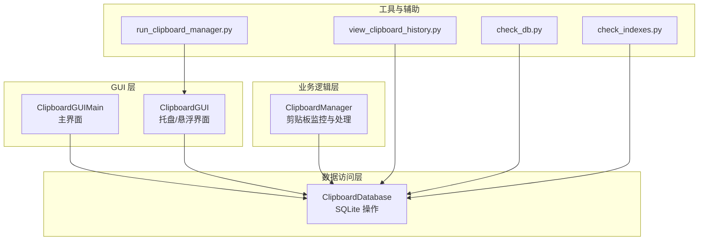
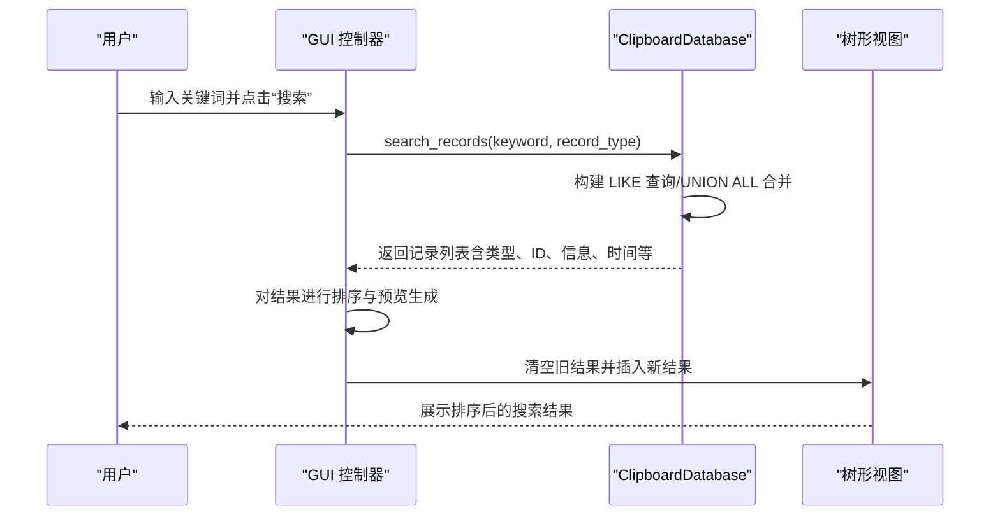
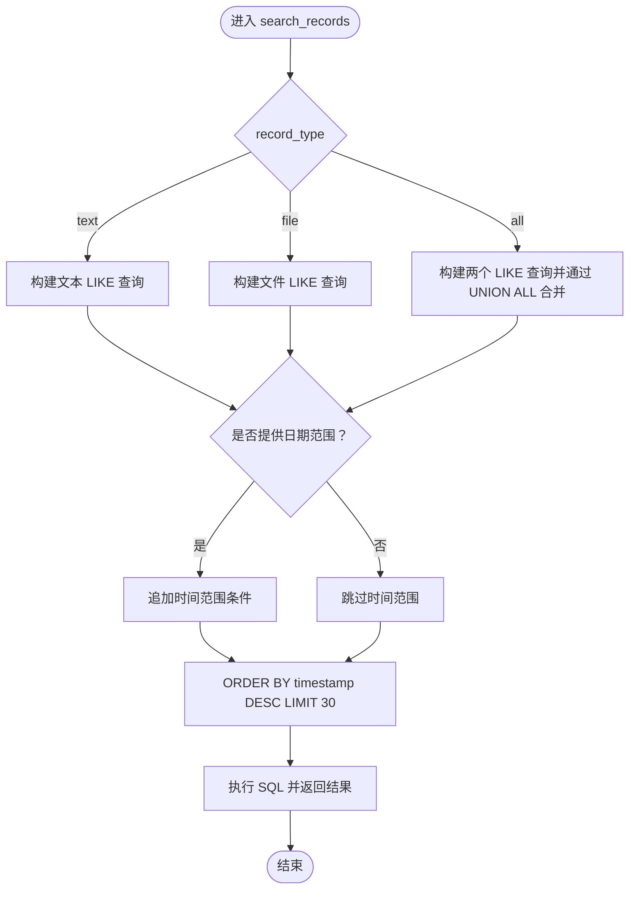
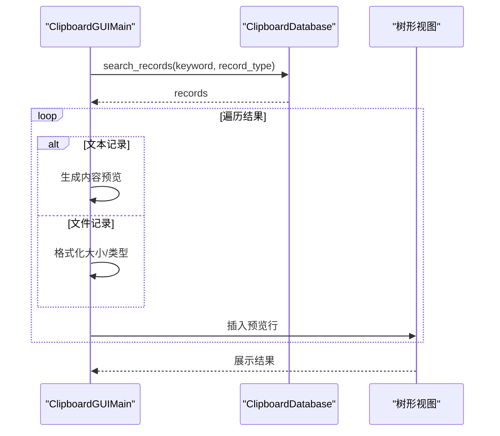
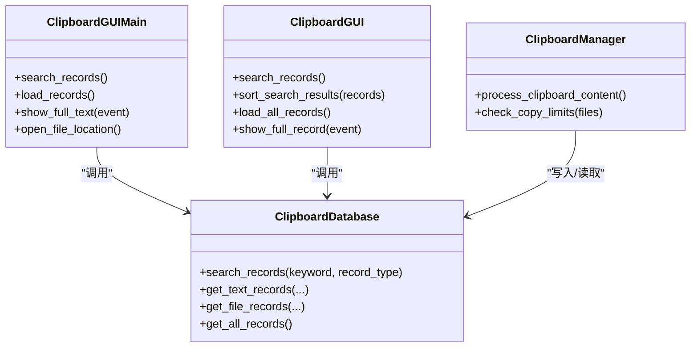
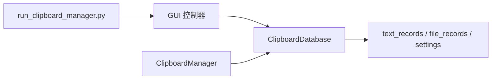

# 搜索查询

<cite>
**本文引用的文件**
- [clipboard_manager_main.py](file://clipboard_manager_main.py)
- [clipboard_gui.py](file://clipboard_gui.py)
- [clipboard_db.py](file://clipboard_db.py)
- [view_clipboard_history.py](file://view_clipboard_history.py)
- [run_clipboard_manager.py](file://run_clipboard_manager.py)
- [check_db.py](file://check_db.py)
- [check_indexes.py](file://check_indexes.py)
</cite>

## 目录
1. [简介](#简介)
2. [项目结构](#项目结构)
3. [核心组件](#核心组件)
4. [架构总览](#架构总览)
5. [详细组件分析](#详细组件分析)
6. [依赖关系分析](#依赖关系分析)
7. [性能考量](#性能考量)
8. [故障排查指南](#故障排查指南)
9. [结论](#结论)
10. [附录](#附录)

## 简介
本章节聚焦应用程序中的“搜索查询”能力，系统性解析 search_records 方法的实现细节，涵盖：
- 基于关键词的模糊搜索（LIKE 查询）的 SQL 实现
- 如何根据记录类型（文本、文件或全部）动态构建查询语句
- UNION ALL 在合并文本与文件搜索结果中的应用
- GUI 中搜索结果的处理流程（排序、预览内容生成、树形视图更新）
- 实际调用方式与最佳实践
- 性能优化与用户体验建议

## 项目结构
该项目采用模块化设计，围绕数据库层、GUI 层与主程序控制流组织：
- 数据库层：负责 SQLite 表结构、数据持久化与查询
- GUI 层：提供用户交互界面与结果展示
- 主程序控制流：负责剪贴板监控、数据写入与 GUI 启动

图表来源
- [clipboard_manager_main.py](file://clipboard_manager_main.py#L497-L760)
- [clipboard_gui.py](file://clipboard_gui.py#L1-L200)
- [clipboard_db.py](file://clipboard_db.py#L1-L120)
- [view_clipboard_history.py](file://view_clipboard_history.py#L1-L75)
- [run_clipboard_manager.py](file://run_clipboard_manager.py#L1-L71)
- [check_db.py](file://check_db.py#L1-L31)
- [check_indexes.py](file://check_indexes.py#L1-L27)

章节来源
- [clipboard_manager_main.py](file://clipboard_manager_main.py#L1-L120)
- [clipboard_gui.py](file://clipboard_gui.py#L1-L120)
- [clipboard_db.py](file://clipboard_db.py#L1-L120)

## 核心组件
- ClipboardDatabase.search_records：统一的搜索入口，支持文本、文件与全量搜索，内部通过 LIKE 模糊匹配与 UNION ALL 合并结果，并按时间倒序限制返回数量。
- ClipboardGUIMain.search_records：GUI 触发搜索，清空现有树形视图，调用数据库搜索并将结果预览插入文本/文件标签页。
- ClipboardGUI.search_records/sort_search_results：在托盘/悬浮界面中执行搜索，随后对结果进行二次排序与预览展示。
- ClipboardManager：负责剪贴板监控与数据写入，间接影响搜索结果的实时性与完整性。

章节来源
- [clipboard_db.py](file://clipboard_db.py#L281-L314)
- [clipboard_manager_main.py](file://clipboard_manager_main.py#L213-L260)
- [clipboard_gui.py](file://clipboard_gui.py#L652-L748)

## 架构总览
搜索查询在 GUI 与数据库之间形成清晰的调用链路：GUI 层触发搜索 -> 数据库层执行 LIKE + UNION ALL -> 结果返回 GUI 层进行排序与预览 -> 更新树形视图。

图表来源
- [clipboard_manager_main.py](file://clipboard_manager_main.py#L691-L716)
- [clipboard_gui.py](file://clipboard_gui.py#L652-L748)
- [clipboard_db.py](file://clipboard_db.py#L281-L314)

## 详细组件分析

### 数据库层：search_records 的实现与 SQL 设计
- 动态构建查询
  - 文本类型：WHERE content LIKE ?，返回字段包含类型标识、ID、内容、时间、字符数
  - 文件类型：WHERE filename LIKE ?，返回字段包含类型标识、ID、文件名、时间、MD5
  - 全部类型：两个子查询通过 UNION ALL 合并，统一字段与排序
- 日期范围过滤
  - 支持 start_date 与 end_date 参数，拼接到 WHERE 子句中
- 排序与限制
  - 统一按时间倒序 ORDER BY timestamp DESC
  - 全量搜索默认限制返回数量（GUI 层限制更严格）

图表来源
- [clipboard_manager_main.py](file://clipboard_manager_main.py#L213-L260)
- [clipboard_db.py](file://clipboard_db.py#L281-L314)

章节来源
- [clipboard_manager_main.py](file://clipboard_manager_main.py#L213-L260)
- [clipboard_db.py](file://clipboard_db.py#L281-L314)

### GUI 层：搜索结果处理与展示
- 主界面（ClipboardGUIMain）
  - 清空现有树形视图
  - 调用数据库 search_records 获取结果
  - 对文本记录生成内容预览，文件记录生成文件大小与类型预览
  - 插入树形视图并保持时间倒序
- 托盘/悬浮界面（ClipboardGUI）
  - 搜索后先对结果进行二次排序（按当前列规则）
  - 文本记录：从数据库获取完整内容，避免预览截断
  - 文件记录：打开文件所在目录

图表来源
- [clipboard_manager_main.py](file://clipboard_manager_main.py#L691-L716)
- [clipboard_gui.py](file://clipboard_gui.py#L652-L748)

章节来源
- [clipboard_manager_main.py](file://clipboard_manager_main.py#L691-L716)
- [clipboard_gui.py](file://clipboard_gui.py#L652-L748)

### UNION ALL 的应用与注意事项
- 合并策略
  - 文本与文件分别执行 LIKE 查询，通过 UNION ALL 合并为统一结果集
  - 两查询返回字段需一致（类型标识、ID、信息、时间），便于后续统一处理
- 性能与一致性
  - 合并后统一 ORDER BY timestamp DESC，保证跨类型结果的时间顺序
  - 若未来扩展更多类型，应保持字段一致性与排序规则一致

章节来源
- [clipboard_manager_main.py](file://clipboard_manager_main.py#L235-L245)
- [clipboard_db.py](file://clipboard_db.py#L300-L310)

### 关键类与方法关系图

图表来源
- [clipboard_db.py](file://clipboard_db.py#L281-L314)
- [clipboard_manager_main.py](file://clipboard_manager_main.py#L497-L760)
- [clipboard_gui.py](file://clipboard_gui.py#L1-L200)

## 依赖关系分析
- GUI 与数据库
  - GUI 通过 ClipboardDatabase.search_records 获取结果
  - 文本详情展示依赖额外查询完整内容，避免预览截断
- 主程序与 GUI
  - run_clipboard_manager.py 启动 GUI 并在后台运行剪贴板监控线程
- 数据库结构
  - text_records 与 file_records 分别存储文本与文件记录
  - settings 表存储配置（如复制限制、保留天数等）

图表来源
- [clipboard_manager_main.py](file://clipboard_manager_main.py#L497-L760)
- [clipboard_gui.py](file://clipboard_gui.py#L1-L200)
- [clipboard_db.py](file://clipboard_db.py#L1-L120)
- [run_clipboard_manager.py](file://run_clipboard_manager.py#L1-L71)

章节来源
- [clipboard_manager_main.py](file://clipboard_manager_main.py#L497-L760)
- [clipboard_gui.py](file://clipboard_gui.py#L1-L200)
- [clipboard_db.py](file://clipboard_db.py#L1-L120)
- [run_clipboard_manager.py](file://run_clipboard_manager.py#L1-L71)

## 性能考量
- LIKE 查询的性能
  - LIKE 通配符通常无法使用索引，建议在高频关键词场景下考虑全文检索或建立专用索引（如 GIN/FTS5，取决于 SQLite 版本与扩展）
- UNION ALL 的代价
  - 合并两个 LIKE 查询会增加查询复杂度，建议在数据量较大时限制返回条数（已有 LIMIT 30）
- 预览与完整内容
  - GUI 层对文本记录进行预览，完整内容通过二次查询获取，避免一次性加载大文本导致 UI 卡顿
- 排序与预览
  - GUI 层对搜索结果进行二次排序，注意数值字段（大小、次数）的解析与异常回退

章节来源
- [clipboard_manager_main.py](file://clipboard_manager_main.py#L255-L260)
- [clipboard_gui.py](file://clipboard_gui.py#L668-L748)

## 故障排查指南
- 搜索无结果
  - 确认关键词是否正确传入（GUI 层会自动拼接 %）
  - 检查日期范围是否过于严格
- 结果顺序异常
  - 确认 GUI 层排序逻辑（时间倒序优先，其他列可能有数值解析）
- 预览内容截断
  - 文本详情需二次查询完整内容，确认数据库连接与查询成功
- 数据库结构变更
  - 使用 check_db.py 与 check_indexes.py 检查 MD5 与索引状态，确保去重与查询效率

章节来源
- [check_db.py](file://check_db.py#L1-L31)
- [check_indexes.py](file://check_indexes.py#L1-L27)
- [clipboard_gui.py](file://clipboard_gui.py#L652-L748)

## 结论
本应用的搜索查询通过 LIKE 模糊匹配与 UNION ALL 合并实现了跨类型的统一检索，并在 GUI 层完成排序与预览展示。通过限制返回条数与二次查询完整内容，兼顾了性能与用户体验。未来可考虑引入全文检索或索引优化以进一步提升搜索性能。

## 附录

### 实际调用方式与最佳实践
- GUI 主界面搜索
  - 通过 ClipboardGUIMain.search_records 获取关键词与类型，调用 ClipboardDatabase.search_records
  - 对文本记录生成预览，文件记录格式化大小与类型
  - 插入树形视图并保持时间倒序
- 托盘/悬浮界面搜索
  - ClipboardGUI.search_records 先清空树形视图，再调用数据库搜索
  - sort_search_results 对结果进行二次排序，数值字段按数值比较
  - 文本记录二次查询完整内容，文件记录打开文件所在目录
- 最佳实践
  - 限制返回条数（默认 30），避免大数据量导致 UI 卡顿
  - 对数值字段（大小、次数）进行数值解析，异常时回退到时间排序
  - 文本详情二次查询完整内容，避免预览截断
  - 在高频场景下考虑全文检索或索引优化

章节来源
- [clipboard_manager_main.py](file://clipboard_manager_main.py#L691-L716)
- [clipboard_gui.py](file://clipboard_gui.py#L652-L748)
- [clipboard_db.py](file://clipboard_db.py#L281-L314)