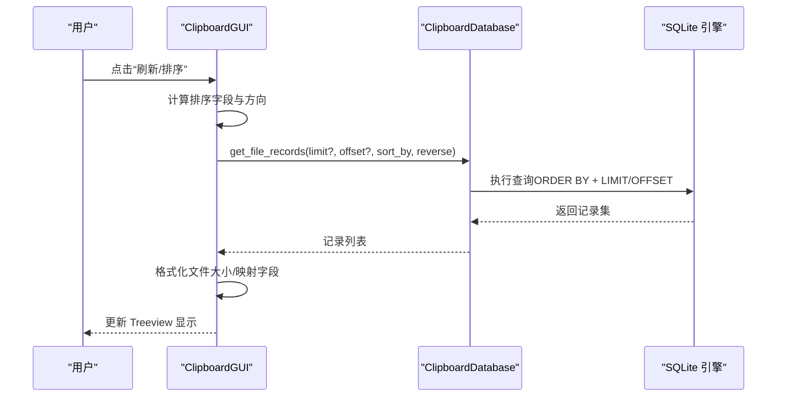
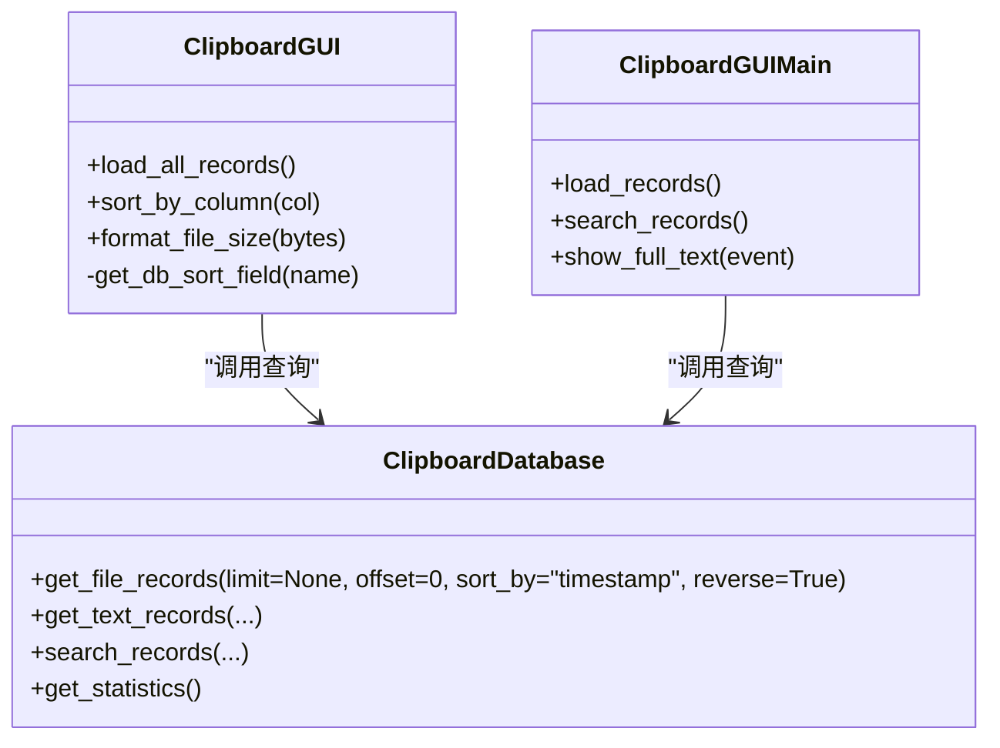
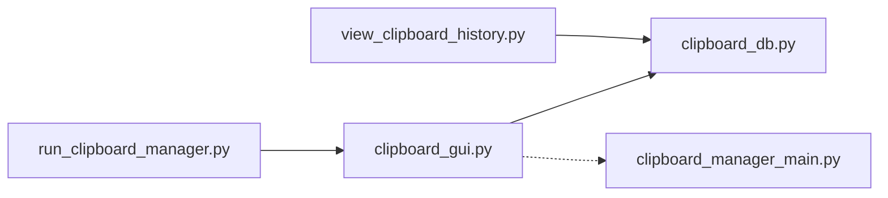

# 文件查询

<cite>
**本文引用的文件**
- [clipboard_db.py](file://clipboard_db.py)
- [clipboard_gui.py](file://clipboard_gui.py)
- [view_clipboard_history.py](file://view_clipboard_history.py)
- [clipboard_manager_main.py](file://clipboard_manager_main.py)
- [run_clipboard_manager.py](file://run_clipboard_manager.py)
- [check_indexes.py](file://check_indexes.py)
- [check_db.py](file://check_db.py)
</cite>

## 目录
1. [简介](#简介)
2. [项目结构](#项目结构)
3. [核心组件](#核心组件)
4. [架构总览](#架构总览)
5. [详细组件分析](#详细组件分析)
6. [依赖关系分析](#依赖关系分析)
7. [性能考量](#性能考量)
8. [故障排查指南](#故障排查指南)
9. [结论](#结论)
10. [附录](#附录)

## 简介
本文件聚焦于应用程序中的“文件记录查询”能力，系统性解析 get_file_records 方法的实现细节，涵盖：
- SQL 查询语句的构建、参数绑定与结果处理
- 排序字段（时间、文件名、文件大小、文件类型、次数）的实现逻辑
- 分页查询中 LIMIT 与 OFFSET 的应用
- 查询结果在 GUI 中的显示机制，包括树形视图字段映射与文件大小格式化
- 实际调用方式与最佳实践
- 大数据量查询的性能优化策略

## 项目结构
该项目采用模块化设计，围绕 SQLite 数据库存储剪贴板历史记录，提供 CLI 视图与 GUI 界面两种入口。与文件查询直接相关的模块如下：
- 数据库层：clipboard_db.py（通用数据库类，提供 get_file_records 等查询接口）
- GUI 展示层：clipboard_gui.py（记录标签页、排序、格式化显示）
- CLI 视图：view_clipboard_history.py（简单文本输出）
- 主程序（旧版 GUI）：clipboard_manager_main.py（含另一个 get_file_records 实现）
- 启动入口：run_clipboard_manager.py（系统托盘 GUI）

```mermaid
graph TB
subgraph "应用入口"
RUN["run_clipboard_manager.py"]
end
subgraph "GUI"
GUI["clipboard_gui.py"]
end
subgraph "数据库"
DB["clipboard_db.py"]
MAIN_DB["clipboard_manager_main.py<br/>含另一个 get_file_records 实现"]
end
subgraph "CLI"
VIEW["view_clipboard_history.py"]
end
RUN --> GUI
GUI --> DB
VIEW --> DB
GUI --> MAIN_DB
```

图表来源
- [run_clipboard_manager.py](file://run_clipboard_manager.py#L1-L71)
- [clipboard_gui.py](file://clipboard_gui.py#L1-L120)
- [clipboard_db.py](file://clipboard_db.py#L1-L120)
- [view_clipboard_history.py](file://view_clipboard_history.py#L1-L75)
- [clipboard_manager_main.py](file://clipboard_manager_main.py#L1-L120)

章节来源
- [run_clipboard_manager.py](file://run_clipboard_manager.py#L1-L71)
- [clipboard_gui.py](file://clipboard_gui.py#L1-L120)
- [clipboard_db.py](file://clipboard_db.py#L1-L120)
- [view_clipboard_history.py](file://view_clipboard_history.py#L1-L75)
- [clipboard_manager_main.py](file://clipboard_manager_main.py#L1-L120)

## 核心组件
- 数据库查询接口：ClipboardDatabase.get_file_records
  - 支持 limit/offset 分页
  - 支持多字段排序（filename、file_size、file_type、number、timestamp）
  - 返回字段包含 id、original_path、saved_path、filename、file_size、file_type、md5_hash、timestamp、number
- GUI 展示逻辑：ClipboardGUI.load_all_records
  - 将数据库记录映射到 Treeview 列（名称或内容、类型、大小、时间、次数）
  - 文件大小通过 format_file_size 进行格式化显示
- CLI 视图：view_clipboard_history.py
  - 使用 get_file_records 输出最近文件记录与统计信息

章节来源
- [clipboard_db.py](file://clipboard_db.py#L223-L261)
- [clipboard_gui.py](file://clipboard_gui.py#L581-L626)
- [view_clipboard_history.py](file://view_clipboard_history.py#L1-L75)

## 架构总览
文件查询在 GUI 中的典型流程：
- 用户触发加载或排序
- GUI 调用数据库层 get_file_records
- 数据库执行 SQL 查询（可带 LIMIT/OFFSET 与 ORDER BY）
- GUI 将结果映射到 Treeview 并格式化显示



图表来源
- [clipboard_gui.py](file://clipboard_gui.py#L581-L626)
- [clipboard_db.py](file://clipboard_db.py#L223-L261)

## 详细组件分析

### get_file_records 方法实现细节
- SQL 查询构建
  - 当 limit 为 None 时，查询所有记录并按指定字段排序
  - 当提供 limit 时，使用 LIMIT ?，并按需传入 OFFSET ?
  - 排序字段映射：
    - filename → filename
    - file_size → file_size
    - file_type → file_type
    - number → number
    - 其他情况 → timestamp
  - 排序方向：reverse 为 True 时降序（DESC），否则升序（ASC）
- 参数绑定
  - 未分页：无参数绑定
  - 分页：LIMIT ? 与 OFFSET ?，参数为 (limit, offset)
- 结果处理
  - fetchall 返回记录列表，每条记录包含 id、original_path、saved_path、filename、file_size、file_type、md5_hash、timestamp、number

章节来源
- [clipboard_db.py](file://clipboard_db.py#L223-L261)

### 排序字段与分页逻辑
- 排序字段映射
  - GUI 层将界面列名映射到数据库字段：
    - 名称或内容 → content
    - 类型 → file_type
    - 大小 → file_size
    - 时间 → timestamp
    - 次数 → number
- 分页参数
  - GUI 层调用 get_file_records 时传入 limit/offset
  - SQL 中使用 LIMIT ? OFFSET ? 实现分页
- 排序方向
  - reverse 控制 ASC/DESC

章节来源
- [clipboard_gui.py](file://clipboard_gui.py#L627-L637)
- [clipboard_db.py](file://clipboard_db.py#L223-L261)

### GUI 中的显示机制与字段映射
- Treeview 列定义：名称或内容、类型、大小、时间、次数
- 数据映射规则
  - 文件记录：filename → 名称或内容；file_type → 类型；format_file_size(file_size) → 大小；timestamp → 时间；number → 次数
  - 文本记录：content 预览 → 名称或内容；类型固定为“文本”；“-”占位大小；timestamp → 时间；number → 次数
- 文件大小格式化
  - 使用 format_file_size 将字节数转换为 B/KB/MB/GB
  - GUI 中多次调用该函数进行显示

章节来源
- [clipboard_gui.py](file://clipboard_gui.py#L581-L626)
- [clipboard_gui.py](file://clipboard_gui.py#L878-L890)

### CLI 视图中的文件查询
- 使用 get_file_records 获取最近文件记录
- 输出字段：文件名、大小、类型、时间
- 统计信息：文件总数、文件总大小、类型分布

章节来源
- [view_clipboard_history.py](file://view_clipboard_history.py#L1-L75)

### 与主程序 GUI 的对比
- 主程序 GUI（clipboard_manager_main.py）提供了另一个 get_file_records 实现，且默认只取前 30 条记录
- GUI 标签页中文件记录列：ID、文件名、原路径、保存路径、大小、类型、MD5、时间
- 文件大小同样通过 format_file_size 格式化

章节来源
- [clipboard_manager_main.py](file://clipboard_manager_main.py#L197-L211)
- [clipboard_manager_main.py](file://clipboard_manager_main.py#L582-L690)

### 类关系与调用链


图表来源
- [clipboard_db.py](file://clipboard_db.py#L223-L261)
- [clipboard_gui.py](file://clipboard_gui.py#L581-L626)
- [clipboard_manager_main.py](file://clipboard_manager_main.py#L197-L211)

## 依赖关系分析
- GUI 依赖数据库层提供的查询接口
- GUI 依赖 format_file_size 进行显示格式化
- CLI 依赖数据库层查询接口
- 启动入口 run_clipboard_manager.py 启动 GUI 并在后台运行剪贴板监控



图表来源
- [run_clipboard_manager.py](file://run_clipboard_manager.py#L1-L71)
- [clipboard_gui.py](file://clipboard_gui.py#L1-L120)
- [clipboard_db.py](file://clipboard_db.py#L1-L120)
- [view_clipboard_history.py](file://view_clipboard_history.py#L1-L75)
- [clipboard_manager_main.py](file://clipboard_manager_main.py#L1-L120)

章节来源
- [run_clipboard_manager.py](file://run_clipboard_manager.py#L1-L71)
- [clipboard_gui.py](file://clipboard_gui.py#L1-L120)
- [clipboard_db.py](file://clipboard_db.py#L1-L120)
- [view_clipboard_history.py](file://view_clipboard_history.py#L1-L75)
- [clipboard_manager_main.py](file://clipboard_manager_main.py#L1-L120)

## 性能考量
- 查询范围与排序
  - 当前 GUI 的 get_file_records 支持分页（LIMIT/OFFSET），但 GUI 实际加载逻辑会一次性拉取两类记录并合并排序，可能在大量数据时造成内存压力
- 建议的优化策略
  - 优先在数据库侧完成分页与排序，避免在 GUI 层合并后再排序
  - 为常用排序字段建立索引（如 file_size、file_type、timestamp、number）
  - 对大数据量场景，考虑延迟加载或虚拟滚动（TreeView 的 yview 与滚动事件已存在，可进一步扩展）
- 现状检查
  - 可使用 check_indexes.py 检查现有索引
  - 可使用 check_db.py 检查重复 MD5 与记录数量

章节来源
- [clipboard_gui.py](file://clipboard_gui.py#L581-L626)
- [clipboard_db.py](file://clipboard_db.py#L223-L261)
- [check_indexes.py](file://check_indexes.py#L1-L27)
- [check_db.py](file://check_db.py#L1-L31)

## 故障排查指南
- 查询无结果或排序异常
  - 确认 sort_by 是否为受支持的字段（filename、file_size、file_type、number、timestamp）
  - 确认 reverse 参数是否正确（True 为降序）
- GUI 显示异常
  - 文件大小显示为“-”：通常表示数据库中 file_size 缺失或为 null
  - “次数”列显示异常：检查 number 字段是否存在与更新逻辑
- CLI 输出异常
  - 确认数据库连接正常，表结构与字段存在
- 索引缺失导致慢查询
  - 使用 check_indexes.py 检查索引
  - 根据业务需求为高频查询字段添加索引

章节来源
- [clipboard_gui.py](file://clipboard_gui.py#L611-L623)
- [clipboard_gui.py](file://clipboard_gui.py#L694-L699)
- [view_clipboard_history.py](file://view_clipboard_history.py#L1-L75)
- [check_indexes.py](file://check_indexes.py#L1-L27)

## 结论
- get_file_records 在数据库层实现了灵活的排序与分页能力，支持多字段排序与 LIMIT/OFFSET
- GUI 层负责将数据库结果映射到 Treeview，并通过 format_file_size 进行人性化显示
- 面向大数据量场景，建议在数据库侧完成分页与排序，并补充必要索引以提升性能

## 附录

### 实际调用方式与最佳实践
- GUI 中的调用路径
  - ClipboardGUI.sort_by_column → get_db_sort_field → ClipboardDatabase.get_file_records
  - ClipboardGUI.load_all_records → 合并文本与文件记录 → 格式化显示
- CLI 中的调用路径
  - view_clipboard_history.py → ClipboardDatabase.get_file_records → 输出统计
- 最佳实践
  - 优先使用数据库侧分页（LIMIT/OFFSET），减少 GUI 层内存占用
  - 对高频排序字段建立索引
  - 对文件大小等数值字段进行格式化显示，提升可读性

章节来源
- [clipboard_gui.py](file://clipboard_gui.py#L581-L626)
- [clipboard_gui.py](file://clipboard_gui.py#L627-L637)
- [view_clipboard_history.py](file://view_clipboard_history.py#L1-L75)