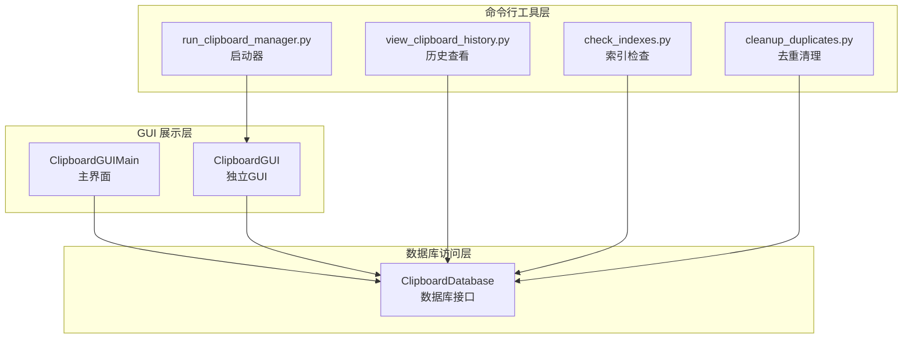
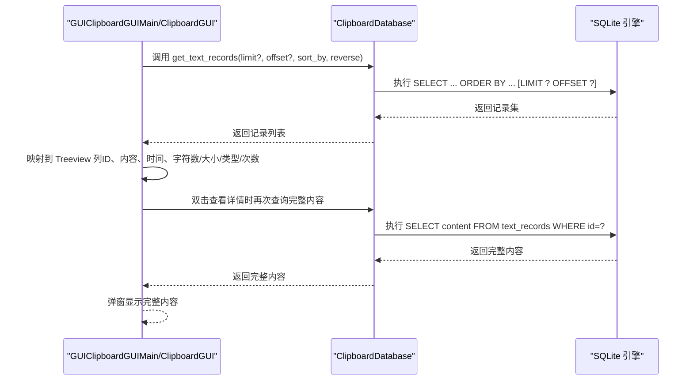
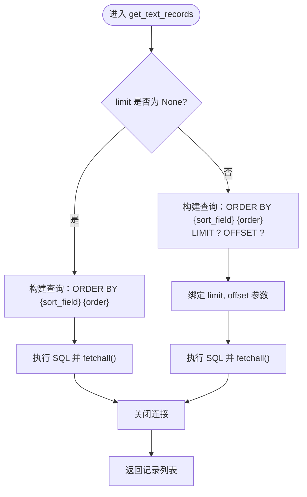
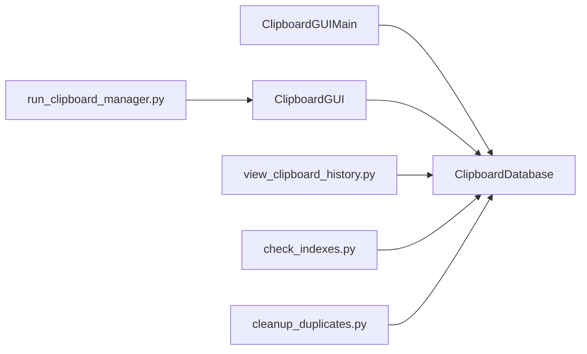

# 文本查询

<cite>
**本文引用的文件**
- [clipboard_db.py](file://clipboard_db.py)
- [clipboard_manager_main.py](file://clipboard_manager_main.py)
- [clipboard_gui.py](file://clipboard_gui.py)
- [view_clipboard_history.py](file://view_clipboard_history.py)
- [check_indexes.py](file://check_indexes.py)
- [cleanup_duplicates.py](file://cleanup_duplicates.py)
- [run_clipboard_manager.py](file://run_clipboard_manager.py)
</cite>

## 目录
1. [简介](#简介)
2. [项目结构](#项目结构)
3. [核心组件](#核心组件)
4. [架构总览](#架构总览)
5. [详细组件分析](#详细组件分析)
6. [依赖关系分析](#依赖关系分析)
7. [性能考量](#性能考量)
8. [故障排查指南](#故障排查指南)
9. [结论](#结论)
10. [附录](#附录)

## 简介
本文件聚焦于应用程序中的“文本记录查询”能力，系统性解析 get_text_records 方法的实现细节，涵盖 SQL 查询语句构建、参数绑定、结果处理、排序字段（时间、内容、字符数、次数）的实现逻辑，以及分页查询中 LIMIT 和 OFFSET 的应用。同时阐述查询结果在 GUI 中的显示机制，如何将数据库记录映射到树形视图的显示字段，并提供实际调用示例与最佳实践，以及针对大数据量查询的性能优化策略。

## 项目结构
该项目采用模块化设计，围绕数据库访问层、GUI 展示层与命令行工具层协同工作：
- 数据库访问层：负责数据库初始化、记录增删改查、统计与设置维护等。
- GUI 展示层：提供两种界面，一种是主界面（剪贴板历史记录管理器），另一种是独立 GUI（记录、统计、设置）。
- 命令行工具层：提供历史查看脚本与索引检查脚本等辅助工具。

图表来源
- [clipboard_db.py](file://clipboard_db.py#L1-L120)
- [clipboard_manager_main.py](file://clipboard_manager_main.py#L497-L761)
- [clipboard_gui.py](file://clipboard_gui.py#L1-L120)
- [view_clipboard_history.py](file://view_clipboard_history.py#L1-L75)
- [check_indexes.py](file://check_indexes.py#L1-L27)
- [cleanup_duplicates.py](file://cleanup_duplicates.py#L1-L67)
- [run_clipboard_manager.py](file://run_clipboard_manager.py#L1-L71)

章节来源
- [clipboard_db.py](file://clipboard_db.py#L1-L120)
- [clipboard_manager_main.py](file://clipboard_manager_main.py#L497-L761)
- [clipboard_gui.py](file://clipboard_gui.py#L1-L120)
- [view_clipboard_history.py](file://view_clipboard_history.py#L1-L75)
- [check_indexes.py](file://check_indexes.py#L1-L27)
- [cleanup_duplicates.py](file://cleanup_duplicates.py#L1-L67)
- [run_clipboard_manager.py](file://run_clipboard_manager.py#L1-L71)

## 核心组件
- 数据库接口 ClipboardDatabase：封装数据库初始化、文本/文件记录的增删查改、搜索、统计、设置与过期记录清理等。
- GUI 展示组件：
  - ClipboardGUIMain：主界面，包含文本记录与文件记录两个标签页，支持搜索、刷新、双击查看详情。
  - ClipboardGUI：独立 GUI，提供记录、统计、设置三个标签页，支持多列排序、数值字段排序、搜索与复制/删除等。
- 历史查看与工具：view_clipboard_history.py、check_indexes.py、cleanup_duplicates.py、run_clipboard_manager.py。

章节来源
- [clipboard_db.py](file://clipboard_db.py#L1-L120)
- [clipboard_manager_main.py](file://clipboard_manager_main.py#L497-L761)
- [clipboard_gui.py](file://clipboard_gui.py#L227-L340)

## 架构总览
文本查询在系统中的流转如下：
- GUI 触发查询请求（可带排序字段与方向）。
- 数据库接口执行 SQL 查询，返回记录集合。
- GUI 将记录映射到 Treeview 列，展示预览内容与元信息。
- 用户交互（如双击）触发二次查询以获取完整内容。

图表来源
- [clipboard_db.py](file://clipboard_db.py#L185-L221)
- [clipboard_manager_main.py](file://clipboard_manager_main.py#L636-L664)
- [clipboard_gui.py](file://clipboard_gui.py#L752-L781)

## 详细组件分析

### get_text_records 方法实现细节
- SQL 查询语句构建
  - 支持动态排序字段：content、char_count、number 或 timestamp（默认）。
  - 支持排序方向：reverse 控制升序/降序。
  - 支持分页：当 limit 不为 None 时，使用 LIMIT ? OFFSET ?。
- 参数绑定
  - 排序字段与方向通过字符串拼接控制，避免注入风险。
  - 分页参数通过占位符绑定，保证安全。
- 结果处理
  - fetchall 返回记录列表，每条记录包含 id、content、timestamp、char_count、md5_hash、number。
  - GUI 层将记录映射到 Treeview 列，文本记录显示内容预览、时间、字符数等。

图表来源
- [clipboard_db.py](file://clipboard_db.py#L185-L221)

章节来源
- [clipboard_db.py](file://clipboard_db.py#L185-L221)

### 排序字段与实现逻辑
- 时间排序：默认按 timestamp 排序，支持升序/降序。
- 内容排序：按 content 文本排序。
- 字符数排序：按 char_count 数值排序。
- 次数排序：按 number 数值排序。
- GUI 层映射：
  - ClipboardGUIMain 的文本标签页列：ID、内容、时间、字符数。
  - ClipboardGUI 的记录标签页列：名称或内容、类型、大小、时间、次数。
  - GUI 层在加载记录时会将数据库字段映射到 Treeview 列，并对数值字段（大小、次数）进行数值排序。

章节来源
- [clipboard_db.py](file://clipboard_db.py#L185-L221)
- [clipboard_manager_main.py](file://clipboard_manager_main.py#L554-L716)
- [clipboard_gui.py](file://clipboard_gui.py#L595-L623)

### 分页查询中 LIMIT 与 OFFSET 的应用
- 当前 GUI（ClipboardGUI）未使用分页参数，而是加载所有记录并进行排序与显示。
- 数据库接口提供完整的分页支持（limit、offset），可用于未来扩展为分页加载。
- ClipboardGUIMain 默认加载最近 30 条记录，但未显式传入分页参数，实际由数据库接口的默认行为决定。

章节来源
- [clipboard_db.py](file://clipboard_db.py#L185-L221)
- [clipboard_manager_main.py](file://clipboard_manager_main.py#L181-L195)

### 查询结果在 GUI 中的显示机制
- ClipboardGUIMain
  - 文本标签页：Treeview 列为 ID、内容、时间、字符数；内容预览长度限制。
  - 文件标签页：Treeview 列为 ID、文件名、原路径、保存路径、大小、类型、MD5、时间。
  - 双击文本记录弹窗显示完整内容；右键文件记录可打开文件所在位置。
- ClipboardGUI
  - 记录标签页：列名为名称或内容、类型、大小、时间、次数；支持多列排序与数值字段排序。
  - 双击记录弹窗显示完整文本或打开文件位置。
  - 统计标签页：显示文本/文件数量与累计大小。
  - 设置标签页：配置复制限制、保存天数、开机自启、悬浮图标等。

章节来源
- [clipboard_manager_main.py](file://clipboard_manager_main.py#L554-L716)
- [clipboard_gui.py](file://clipboard_gui.py#L227-L340)
- [clipboard_gui.py](file://clipboard_gui.py#L595-L623)

### 实际调用示例与最佳实践
- 历史查看脚本调用数据库接口获取文本/文件记录并打印预览。
- GUI 层调用数据库接口获取记录并映射到 Treeview。
- 最佳实践
  - 使用参数化查询防止 SQL 注入。
  - 对大数据量场景，优先使用分页（limit/offset）或索引优化。
  - 对数值字段排序时，先解析为数值再排序，避免字符串比较导致的异常。
  - 双击查看详情时，仅在必要时发起二次查询，减少不必要的数据库访问。

章节来源
- [view_clipboard_history.py](file://view_clipboard_history.py#L21-L75)
- [clipboard_gui.py](file://clipboard_gui.py#L668-L748)

## 依赖关系分析
- 数据库接口 ClipboardDatabase 是所有查询与展示的基础。
- GUI 展示层依赖数据库接口提供的查询方法。
- 历史查看与索引检查脚本作为工具层，直接依赖数据库接口。
- 启动器负责协调 GUI 与监控线程。

图表来源
- [clipboard_db.py](file://clipboard_db.py#L1-L120)
- [clipboard_manager_main.py](file://clipboard_manager_main.py#L497-L761)
- [clipboard_gui.py](file://clipboard_gui.py#L1-L120)
- [view_clipboard_history.py](file://view_clipboard_history.py#L1-L75)
- [check_indexes.py](file://check_indexes.py#L1-L27)
- [cleanup_duplicates.py](file://cleanup_duplicates.py#L1-L67)
- [run_clipboard_manager.py](file://run_clipboard_manager.py#L1-L71)

章节来源
- [clipboard_db.py](file://clipboard_db.py#L1-L120)
- [clipboard_manager_main.py](file://clipboard_manager_main.py#L497-L761)
- [clipboard_gui.py](file://clipboard_gui.py#L1-L120)
- [view_clipboard_history.py](file://view_clipboard_history.py#L1-L75)
- [check_indexes.py](file://check_indexes.py#L1-L27)
- [cleanup_duplicates.py](file://cleanup_duplicates.py#L1-L67)
- [run_clipboard_manager.py](file://run_clipboard_manager.py#L1-L71)

## 性能考量
- 索引与唯一约束
  - 文本记录表包含 md5_hash 唯一索引，有助于去重与快速查找。
  - 文件记录表包含 md5_hash 唯一索引，避免重复文件记录。
- 排序与分页
  - 当前 GUI 未使用分页参数，建议在大数据量场景下启用分页（limit/offset）。
  - 对常用排序字段（如 timestamp、char_count、number）建立索引可显著提升排序性能。
- 数据清理
  - 提供去重脚本，合并重复 MD5 记录并累加计数，减少冗余数据。
- I/O 与连接
  - 每次查询后及时关闭连接，避免连接泄漏。
  - 对频繁访问的记录（如完整文本）可考虑缓存策略，但需注意缓存一致性。

章节来源
- [clipboard_db.py](file://clipboard_db.py#L23-L53)
- [clipboard_db.py](file://clipboard_db.py#L60-L67)
- [check_indexes.py](file://check_indexes.py#L1-L27)
- [cleanup_duplicates.py](file://cleanup_duplicates.py#L1-L67)

## 故障排查指南
- 查询结果为空
  - 检查数据库初始化是否成功，确认表是否存在且有数据。
  - 确认排序字段与方向是否合理，必要时调整为默认排序。
- 排序异常或崩溃
  - 数值字段排序时，若解析失败会回退到按时间排序；检查数据格式是否符合预期。
- GUI 显示异常
  - 确认 Treeview 列定义与数据库返回字段顺序一致。
  - 双击查看详情时，确认记录 ID 正确传递并能查询到完整内容。
- 索引缺失
  - 使用索引检查脚本确认 text_records 与 file_records 的索引情况，必要时手动创建索引。

章节来源
- [clipboard_gui.py](file://clipboard_gui.py#L700-L748)
- [clipboard_manager_main.py](file://clipboard_manager_main.py#L636-L664)
- [check_indexes.py](file://check_indexes.py#L1-L27)

## 结论
本系统通过清晰的分层设计实现了高效的文本记录查询与展示。get_text_records 方法支持动态排序与分页，结合 GUI 的树形视图映射，提供了直观的用户体验。针对大数据量场景，建议启用分页、建立索引、清理冗余数据，并在必要时引入缓存策略，以进一步提升性能与稳定性。

## 附录
- 实际调用示例路径
  - 历史查看脚本：[view_clipboard_history.py](file://view_clipboard_history.py#L21-L75)
  - 主界面加载记录：[clipboard_manager_main.py](file://clipboard_manager_main.py#L665-L716)
  - 独立 GUI 加载记录：[clipboard_gui.py](file://clipboard_gui.py#L581-L626)
- 性能优化建议
  - 分页查询：使用 limit/offset，避免一次性加载大量数据。
  - 索引优化：为常用排序字段建立索引。
  - 数据清理：定期执行去重脚本，合并重复记录。
  - 连接管理：每次查询后及时关闭连接，避免资源泄漏。