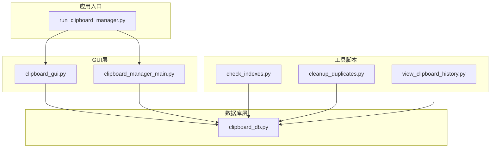
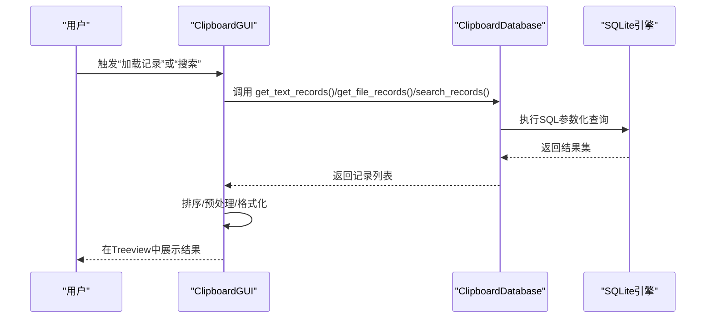
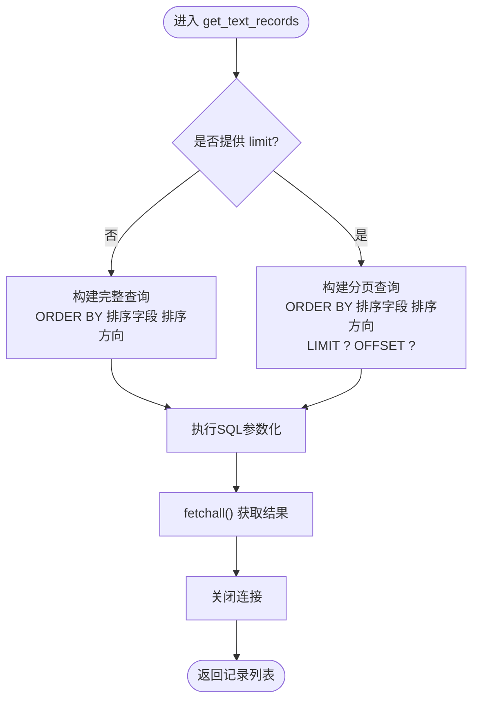
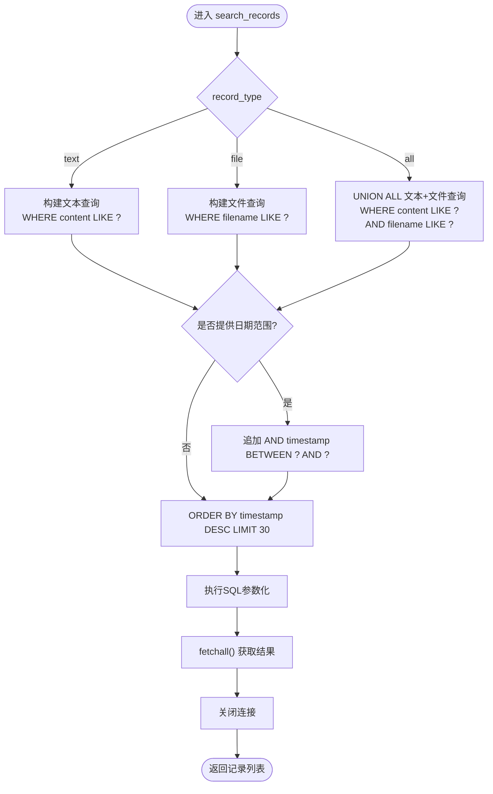
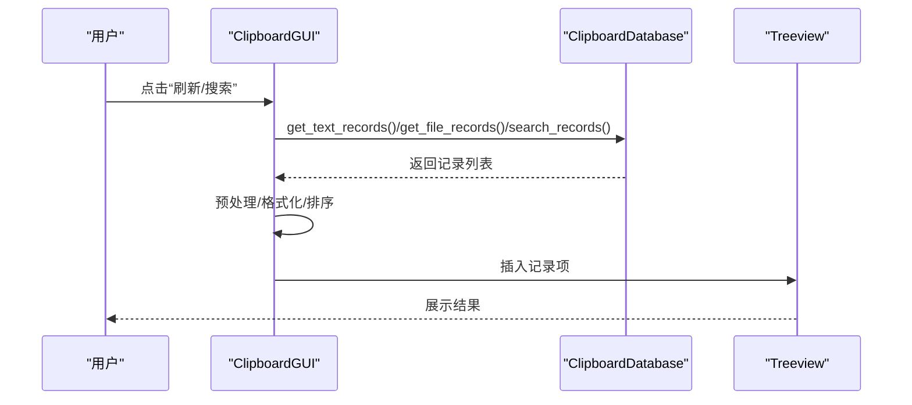
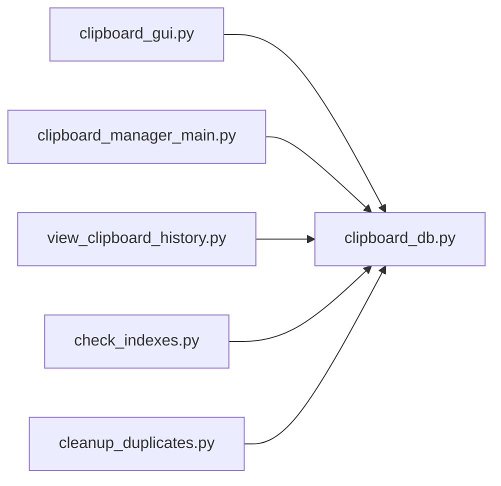

# 查询操作

<cite>
**本文引用的文件**
- [clipboard_db.py](file://clipboard_db.py)
- [clipboard_gui.py](file://clipboard_gui.py)
- [clipboard_manager_main.py](file://clipboard_manager_main.py)
- [view_clipboard_history.py](file://view_clipboard_history.py)
- [run_clipboard_manager.py](file://run_clipboard_manager.py)
- [check_indexes.py](file://check_indexes.py)
- [cleanup_duplicates.py](file://cleanup_duplicates.py)
</cite>

## 目录
1. [简介](#简介)
2. [项目结构](#项目结构)
3. [核心组件](#核心组件)
4. [架构总览](#架构总览)
5. [详细组件分析](#详细组件分析)
6. [依赖关系分析](#依赖关系分析)
7. [性能考量](#性能考量)
8. [故障排查指南](#故障排查指南)
9. [结论](#结论)
10. [附录](#附录)

## 简介
本章节聚焦于应用程序中的数据库查询操作，深入解析以下方法的实现细节：
- get_text_records：获取文本记录，支持排序与分页
- get_file_records：获取文件记录，支持排序与分页
- search_records：按关键词搜索记录，支持文本/文件/全部类型，并可附加时间范围过滤

同时，我们将分析SQL查询语句的构建、参数绑定与结果处理流程，探讨不同查询场景下的性能优化策略（索引使用、查询缓存、分页与批量加载），并说明查询结果在GUI中的显示机制及大数据量查询的性能问题处理方案。最后提供实际调用示例与最佳实践建议。

## 项目结构
该项目采用“模块化+分层”的组织方式：
- 数据库访问层：clipboard_db.py（SQLite封装与查询方法）
- GUI层：clipboard_gui.py（记录展示、搜索、排序、统计）
- 独立GUI版本：clipboard_manager_main.py（独立GUI界面与查询）
- 命令行查看器：view_clipboard_history.py（简单输出历史记录）
- 启动入口：run_clipboard_manager.py（托盘+监控线程）
- 索引检查与去重工具：check_indexes.py、cleanup_duplicates.py

图表来源
- [run_clipboard_manager.py](file://run_clipboard_manager.py#L32-L66)
- [clipboard_gui.py](file://clipboard_gui.py#L37-L79)
- [clipboard_manager_main.py](file://clipboard_manager_main.py#L554-L760)
- [clipboard_db.py](file://clipboard_db.py#L185-L314)
- [check_indexes.py](file://check_indexes.py#L9-L27)
- [cleanup_duplicates.py](file://cleanup_duplicates.py#L9-L67)
- [view_clipboard_history.py](file://view_clipboard_history.py#L21-L75)

章节来源
- [run_clipboard_manager.py](file://run_clipboard_manager.py#L32-L66)
- [clipboard_gui.py](file://clipboard_gui.py#L37-L79)
- [clipboard_manager_main.py](file://clipboard_manager_main.py#L554-L760)
- [clipboard_db.py](file://clipboard_db.py#L185-L314)
- [check_indexes.py](file://check_indexes.py#L9-L27)
- [cleanup_duplicates.py](file://cleanup_duplicates.py#L9-L67)
- [view_clipboard_history.py](file://view_clipboard_history.py#L21-L75)

## 核心组件
- 数据库类 ClipboardDatabase：封装数据库初始化、记录保存、查询与统计等操作
- GUI类 ClipboardGUI：负责记录展示、搜索、排序、统计与设置交互
- 独立GUI类 ClipboardGUIMain：提供独立GUI界面，包含文本/文件两个标签页
- 工具脚本：索引检查与重复记录清理

章节来源
- [clipboard_db.py](file://clipboard_db.py#L185-L314)
- [clipboard_gui.py](file://clipboard_gui.py#L581-L748)
- [clipboard_manager_main.py](file://clipboard_manager_main.py#L554-L716)

## 架构总览
查询操作在GUI层触发，通过数据库层执行SQL，最终将结果渲染到界面。GUI层还负责排序、搜索与统计展示。

图表来源
- [clipboard_gui.py](file://clipboard_gui.py#L581-L748)
- [clipboard_db.py](file://clipboard_db.py#L185-L314)

## 详细组件分析

### get_text_records 实现细节
- SQL构建与参数绑定
  - 支持按 content、char_count、number 或 timestamp 排序
  - 支持正序/倒序
  - 支持分页（LIMIT/OFFSET）
  - 参数绑定使用占位符，避免拼接字符串
- 结果处理
  - 返回包含 id、content、timestamp、char_count、md5_hash、number 的元组列表
  - GUI层对 content 进行预览裁剪与显示
- 性能要点
  - 当前未显式创建排序字段索引，排序可能走全表扫描
  - 分页可减少一次性传输的数据量

图表来源
- [clipboard_db.py](file://clipboard_db.py#L185-L221)

章节来源
- [clipboard_db.py](file://clipboard_db.py#L185-L221)
- [clipboard_gui.py](file://clipboard_gui.py#L581-L626)

### get_file_records 实现细节
- SQL构建与参数绑定
  - 支持按 filename、file_size、file_type、number 或 timestamp 排序
  - 支持正序/倒序
  - 支持分页（LIMIT/OFFSET）
  - 参数绑定使用占位符
- 结果处理
  - 返回包含 id、original_path、saved_path、filename、file_size、file_type、md5_hash、timestamp、number 的元组列表
  - GUI层对文件大小进行格式化显示
- 性能要点
  - 与文本记录类似，排序可能走全表扫描
  - 分页有助于控制网络/内存占用

图表来源
- [clipboard_db.py](file://clipboard_db.py#L223-L261)

章节来源
- [clipboard_db.py](file://clipboard_db.py#L223-L261)
- [clipboard_gui.py](file://clipboard_gui.py#L617-L626)

### search_records 实现细节
- SQL构建与参数绑定
  - 支持三种类型：text、file、all
  - 使用 LIKE 匹配关键词
  - 支持附加时间范围过滤（start_date、end_date）
  - 统一按 timestamp 倒序，限制返回数量（默认30）
  - 参数绑定使用占位符
- 结果处理
  - 返回包含 type、id、info、timestamp 的元组列表
  - GUI层根据 type 判断为文本或文件，并补充 size/number 等字段
- 性能要点
  - LIKE “%keyword%” 无法使用索引，可能全表扫描
  - 限制返回数量可缓解性能问题

图表来源
- [clipboard_manager_main.py](file://clipboard_manager_main.py#L213-L260)

章节来源
- [clipboard_manager_main.py](file://clipboard_manager_main.py#L213-L260)
- [clipboard_gui.py](file://clipboard_gui.py#L652-L748)

### GUI 中的查询调用与显示机制
- 记录加载
  - GUI 通过 get_text_records/get_file_records 获取数据
  - 对文本内容进行预览裁剪，文件大小格式化
  - 将记录插入 Treeview，支持双击查看详情
- 搜索
  - GUI 通过 search_records 获取结果
  - 对搜索结果进行二次排序（按当前列规则）
  - 补充 number、size 等字段后再显示
- 统计
  - GUI 调用 get_statistics 获取文本/文件数量与总大小
  - 在统计页展示格式化后的统计信息

图表来源
- [clipboard_gui.py](file://clipboard_gui.py#L581-L748)
- [clipboard_db.py](file://clipboard_db.py#L185-L314)

章节来源
- [clipboard_gui.py](file://clipboard_gui.py#L581-L748)

## 依赖关系分析
- GUI 依赖数据库层提供的查询方法
- 独立GUI版本同样依赖数据库层
- 工具脚本用于辅助诊断与维护（索引检查、重复清理）

图表来源
- [clipboard_gui.py](file://clipboard_gui.py#L37-L79)
- [clipboard_manager_main.py](file://clipboard_manager_main.py#L554-L760)
- [clipboard_db.py](file://clipboard_db.py#L185-L314)
- [view_clipboard_history.py](file://view_clipboard_history.py#L21-L75)
- [check_indexes.py](file://check_indexes.py#L9-L27)
- [cleanup_duplicates.py](file://cleanup_duplicates.py#L9-L67)

章节来源
- [clipboard_gui.py](file://clipboard_gui.py#L37-L79)
- [clipboard_manager_main.py](file://clipboard_manager_main.py#L554-L760)
- [clipboard_db.py](file://clipboard_db.py#L185-L314)
- [view_clipboard_history.py](file://view_clipboard_history.py#L21-L75)
- [check_indexes.py](file://check_indexes.py#L9-L27)
- [cleanup_duplicates.py](file://cleanup_duplicates.py#L9-L67)

## 性能考量
- 现状分析
  - 排序字段未建立索引：text_records/file_records 的排序可能走全表扫描
  - 搜索使用 LIKE “%keyword%”：无法使用索引，可能全表扫描
  - 分页：get_text_records/get_file_records 支持 LIMIT/OFFSET，但 GUI 层未使用分页参数
- 优化建议
  - 索引优化
    - 为 text_records 的 content、timestamp、char_count、number 建立索引
    - 为 file_records 的 filename、file_size、file_type、timestamp、number 建立索引
  - 查询缓存
    - 对高频查询（如最近N条记录）可在应用层做轻量缓存（注意失效策略）
  - 分页与批量加载
    - GUI 层应使用分页接口，避免一次性加载大量数据
  - 搜索优化
    - 若关键词匹配需求较高，考虑全文检索（如FTS5）或建立前缀索引
  - 数据清理
    - 使用 cleanup_duplicates.py 合并重复MD5记录，减少冗余数据
- 索引检查
  - 使用 check_indexes.py 检查现有索引情况，指导后续优化

章节来源
- [clipboard_db.py](file://clipboard_db.py#L185-L261)
- [clipboard_manager_main.py](file://clipboard_manager_main.py#L213-L260)
- [check_indexes.py](file://check_indexes.py#L9-L27)
- [cleanup_duplicates.py](file://cleanup_duplicates.py#L9-L67)

## 故障排查指南
- 查询结果异常或顺序不符
  - 检查排序字段映射与 reverse 参数
  - 确认数据库中对应字段是否存在索引
- 搜索速度慢
  - 确认是否使用了 LIKE “%keyword%”，建议优化为前缀匹配或全文检索
  - 限制返回数量或启用分页
- GUI 显示空白或卡顿
  - 检查是否一次性加载过多数据
  - 确认 Treeview 插入与更新逻辑未阻塞主线程
- 数据库文件过大
  - 使用清理脚本合并重复记录
  - 调整设置中的保留天数，定期删除过期记录

章节来源
- [clipboard_gui.py](file://clipboard_gui.py#L581-L748)
- [clipboard_manager_main.py](file://clipboard_manager_main.py#L213-L260)
- [cleanup_duplicates.py](file://cleanup_duplicates.py#L9-L67)

## 结论
本应用的查询操作以参数化SQL为核心，具备良好的安全性与可维护性。当前在排序与搜索方面存在潜在性能瓶颈，主要源于缺少索引与LIKE前缀模糊匹配。通过建立针对性索引、引入分页与缓存、优化搜索策略以及定期清理重复数据，可显著提升查询性能与用户体验。GUI层的展示逻辑清晰，建议进一步完善分页与异步加载机制以应对大数据量场景。

## 附录

### 实际调用示例（路径参考）
- 获取文本记录（带分页与排序）
  - 路径参考：[clipboard_db.py](file://clipboard_db.py#L185-L221)
  - 调用方参考：[clipboard_gui.py](file://clipboard_gui.py#L581-L626)
- 获取文件记录（带分页与排序）
  - 路径参考：[clipboard_db.py](file://clipboard_db.py#L223-L261)
  - 调用方参考：[clipboard_gui.py](file://clipboard_gui.py#L617-L626)
- 搜索记录（关键词+类型）
  - 路径参考：[clipboard_manager_main.py](file://clipboard_manager_main.py#L213-L260)
  - 调用方参考：[clipboard_gui.py](file://clipboard_gui.py#L652-L748)
- 索引检查
  - 路径参考：[check_indexes.py](file://check_indexes.py#L9-L27)
- 重复记录清理
  - 路径参考：[cleanup_duplicates.py](file://cleanup_duplicates.py#L9-L67)

### 最佳实践
- 使用参数化查询，避免字符串拼接
- 为常用排序与搜索字段建立索引
- 优先使用前缀匹配而非“%keyword%”
- 对大数据量查询启用分页与批量加载
- 在GUI中使用异步线程执行查询，避免阻塞界面
- 定期清理重复数据与过期记录，保持数据库健康