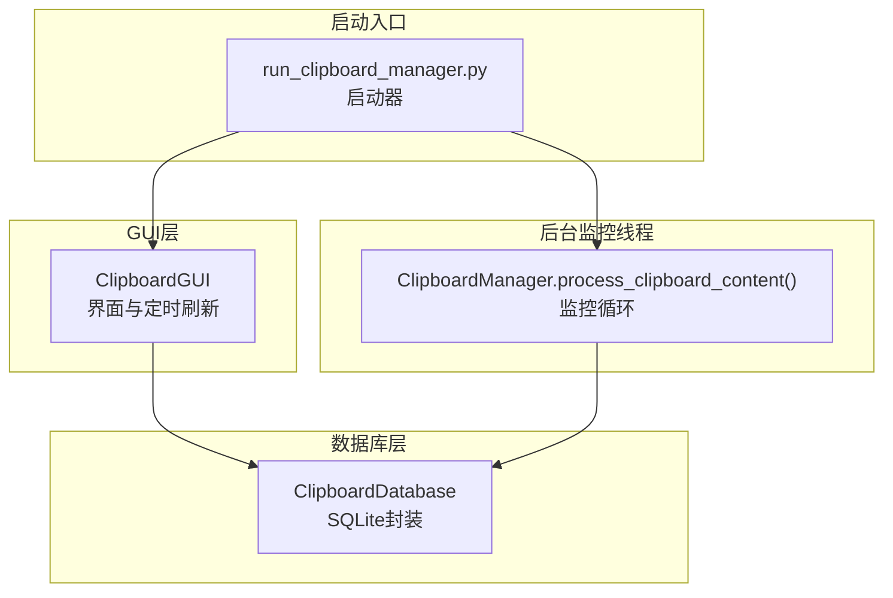
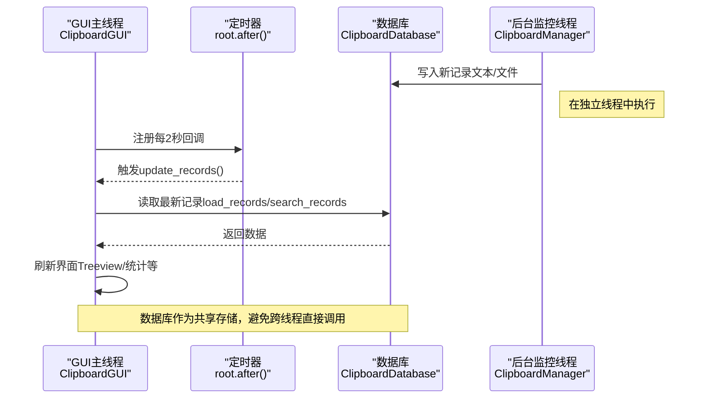
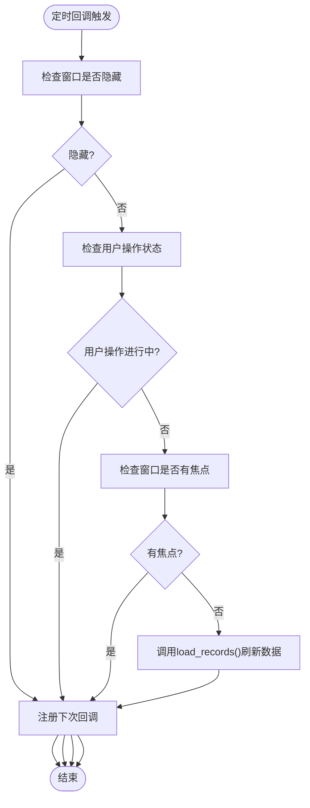
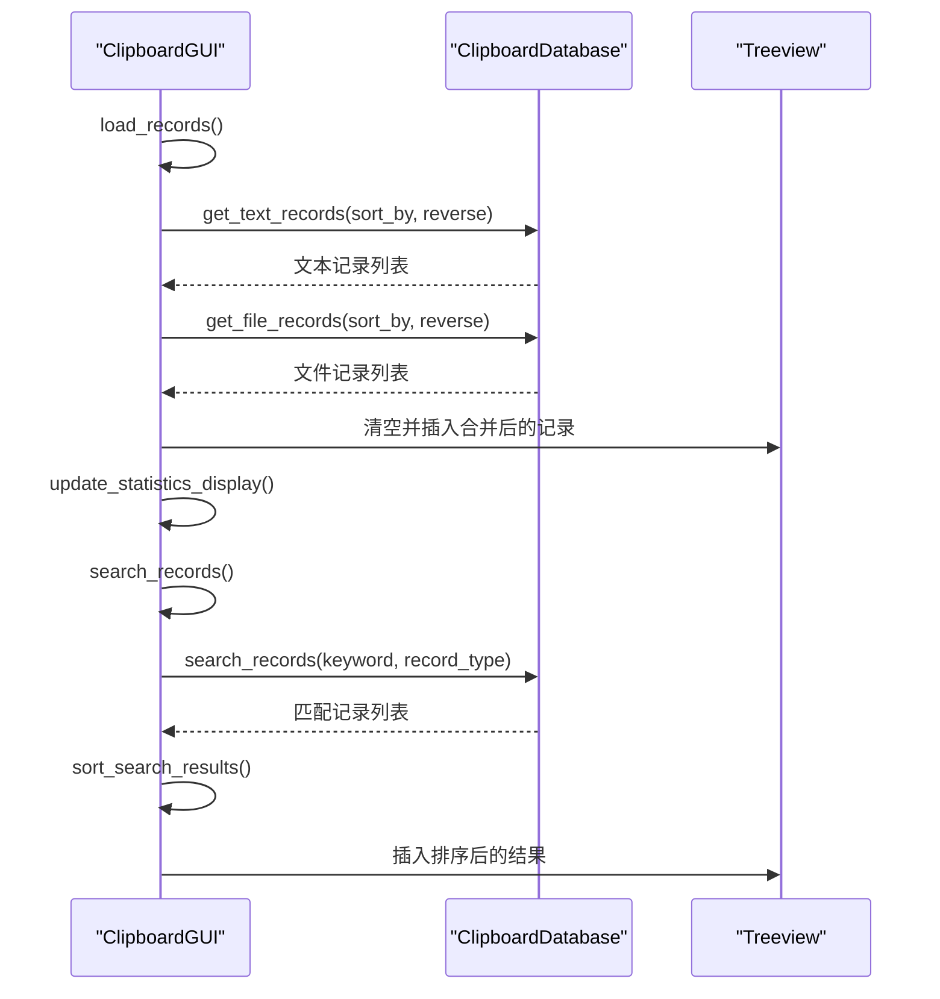
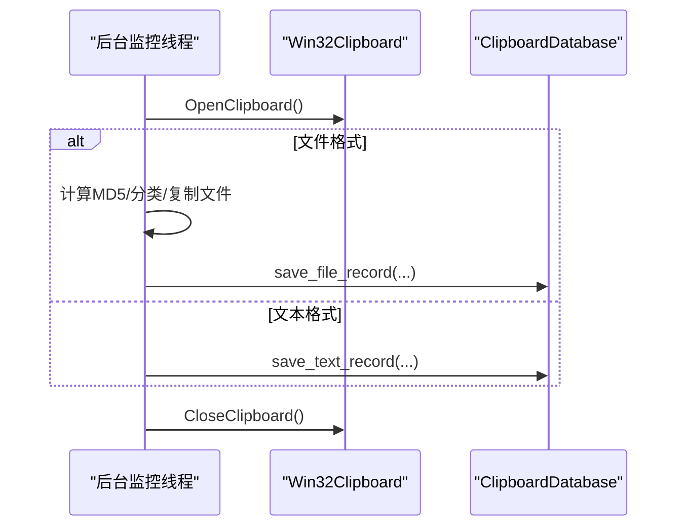
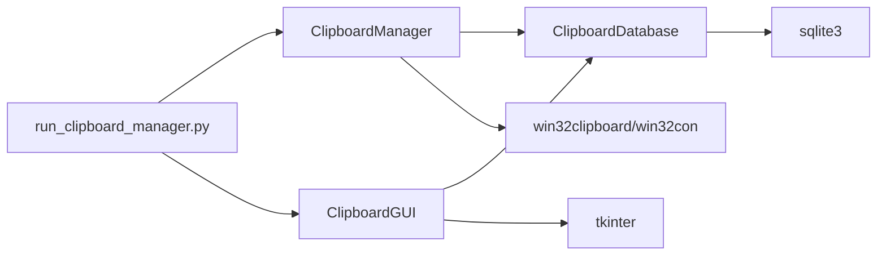

# GUI线程通信机制

<cite>
**本文引用的文件**
- [clipboard_gui.py](file://clipboard_gui.py)
- [clipboard_manager_main.py](file://clipboard_manager_main.py)
- [clipboard_db.py](file://clipboard_db.py)
- [run_clipboard_manager.py](file://run_clipboard_manager.py)
</cite>

## 目录
1. [简介](#简介)
2. [项目结构](#项目结构)
3. [核心组件](#核心组件)
4. [架构总览](#架构总览)
5. [详细组件分析](#详细组件分析)
6. [依赖关系分析](#依赖关系分析)
7. [性能考量](#性能考量)
8. [故障排查指南](#故障排查指南)
9. [结论](#结论)

## 简介
本文件聚焦于GUI主线程与后台监控线程之间的通信模式，重点分析ClipboardGUI类如何通过定期调用load_records()与search_records()从数据库读取最新数据，实现与监控线程的“间接通信”。我们解释基于SQLite数据库的共享存储模式如何规避复杂的跨线程直接调用，确保tkinter组件仅在主线程中被访问，并说明auto_update机制如何通过root.after()实现非阻塞的定期数据刷新。

## 项目结构
该项目采用“GUI + 数据库 + 后台监控线程”的分层设计：
- GUI层：负责用户交互与界面展示，位于clipboard_gui.py
- 数据库层：提供统一的数据访问接口，位于clipboard_db.py
- 后台监控线程：负责周期性扫描剪贴板并将变更写入数据库，位于clipboard_manager_main.py
- 启动入口：run_clipboard_manager.py负责启动监控线程与GUI

图表来源
- [clipboard_gui.py](file://clipboard_gui.py#L1676-L1708)
- [clipboard_manager_main.py](file://clipboard_manager_main.py#L355-L496)
- [clipboard_db.py](file://clipboard_db.py#L1-L120)
- [run_clipboard_manager.py](file://run_clipboard_manager.py#L32-L66)

章节来源
- [clipboard_gui.py](file://clipboard_gui.py#L1-L120)
- [clipboard_manager_main.py](file://clipboard_manager_main.py#L1-L120)
- [clipboard_db.py](file://clipboard_db.py#L1-L120)
- [run_clipboard_manager.py](file://run_clipboard_manager.py#L1-L71)

## 核心组件
- ClipboardGUI：GUI主类，负责界面构建、事件绑定、定时刷新与用户操作状态管理
- ClipboardDatabase：数据库访问封装，提供读写接口与统计查询
- ClipboardManager：后台监控器，周期性读取剪贴板并写入数据库
- run_clipboard_manager：启动器，创建监控线程与GUI实例

章节来源
- [clipboard_gui.py](file://clipboard_gui.py#L37-L120)
- [clipboard_db.py](file://clipboard_db.py#L1-L120)
- [clipboard_manager_main.py](file://clipboard_manager_main.py#L355-L496)
- [run_clipboard_manager.py](file://run_clipboard_manager.py#L32-L66)

## 架构总览
GUI主线程与后台监控线程之间不直接互相调用，而是通过共享的SQLite数据库作为“消息通道”：
- 后台线程在独立线程中周期性扫描剪贴板，将新内容写入数据库
- GUI主线程通过root.after()定时触发回调，在主线程内安全地从数据库读取最新数据并刷新界面
- 所有tkinter组件的访问均发生在主线程，避免跨线程访问UI带来的竞态与崩溃风险

图表来源
- [clipboard_gui.py](file://clipboard_gui.py#L1676-L1708)
- [clipboard_manager_main.py](file://clipboard_manager_main.py#L355-L496)
- [clipboard_db.py](file://clipboard_db.py#L116-L183)

## 详细组件分析

### ClipboardGUI类与auto_update机制
- 定时刷新入口
  - start_auto_update()：通过root.after(2000, update_records)注册每2秒回调
  - update_records()：在满足条件（窗口显示、无用户操作、无焦点）时调用load_records()刷新界面，并再次注册下一次回调
  - stop_auto_update()：取消定时任务，避免资源浪费
- 用户操作状态管理
  - user_action_in_progress：标记用户操作进行中，避免刷新干扰
  - has_focus：窗口焦点状态，避免在用户输入时频繁刷新
  - is_hidden：窗口隐藏状态，避免在隐藏时无意义刷新
- 界面初始化与首次加载
  - 构造函数中使用root.after(100, self.load_records)在UI创建后延迟加载第一页记录，确保界面先可见再渲染数据

图表来源
- [clipboard_gui.py](file://clipboard_gui.py#L1676-L1708)

章节来源
- [clipboard_gui.py](file://clipboard_gui.py#L1676-L1708)
- [clipboard_gui.py](file://clipboard_gui.py#L581-L626)

### load_records()与search_records()的数据库读取流程
- load_records()与load_all_records()
  - 清空现有Treeview条目
  - 根据当前排序列映射到数据库字段，分别调用db.get_text_records()与db.get_file_records()
  - 将两类记录合并并插入Treeview，同时更新统计信息
- search_records()
  - 清空现有Treeview条目
  - 调用db.search_records()获取匹配结果
  - 对结果进行排序并插入Treeview

图表来源
- [clipboard_gui.py](file://clipboard_gui.py#L581-L626)
- [clipboard_gui.py](file://clipboard_gui.py#L652-L748)
- [clipboard_db.py](file://clipboard_db.py#L185-L261)
- [clipboard_db.py](file://clipboard_db.py#L281-L314)

章节来源
- [clipboard_gui.py](file://clipboard_gui.py#L581-L748)
- [clipboard_db.py](file://clipboard_db.py#L185-L314)

### 后台监控线程与数据库写入
- ClipboardManager.process_clipboard_content()
  - 打开剪贴板，判断文本或文件格式
  - 对文件：计算MD5、分类类型、复制到目标目录、写入file_records
  - 对文本：写入text_records
  - 使用sqlite3连接数据库，遵循完整性约束（如md5_hash唯一），自动去重并累加number
- 监控循环
  - run_clipboard_manager.py启动独立线程执行monitor_clipboard_loop(manager, 1)，每秒检查一次剪贴板
  - 通过全局数据库文件共享，后台线程与GUI线程互不阻塞

图表来源
- [clipboard_manager_main.py](file://clipboard_manager_main.py#L395-L496)
- [clipboard_db.py](file://clipboard_db.py#L116-L183)
- [run_clipboard_manager.py](file://run_clipboard_manager.py#L47-L66)

章节来源
- [clipboard_manager_main.py](file://clipboard_manager_main.py#L395-L496)
- [clipboard_db.py](file://clipboard_db.py#L116-L183)
- [run_clipboard_manager.py](file://run_clipboard_manager.py#L47-L66)

### 基于数据库的共享存储模式
- 通信路径
  - 后台线程写入：ClipboardManager -> ClipboardDatabase -> SQLite
  - GUI线程读取：ClipboardGUI -> ClipboardDatabase -> SQLite
- 优势
  - 避免跨线程直接调用tkinter对象，降低复杂度与风险
  - 通过root.after()非阻塞调度，保证UI流畅
  - 数据库作为单一事实来源，便于扩展统计、搜索与历史管理
- 注意事项
  - 需要合理控制刷新频率，避免频繁IO
  - 排序与搜索逻辑在GUI线程中执行，注意大数据量下的性能

章节来源
- [clipboard_gui.py](file://clipboard_gui.py#L581-L748)
- [clipboard_manager_main.py](file://clipboard_manager_main.py#L395-L496)
- [clipboard_db.py](file://clipboard_db.py#L185-L314)

## 依赖关系分析
- 组件耦合
  - ClipboardGUI依赖ClipboardDatabase进行读取
  - ClipboardManager依赖ClipboardDatabase进行写入
  - run_clipboard_manager.py将两者解耦，分别在不同线程运行
- 外部依赖
  - tkinter：GUI框架
  - sqlite3：本地数据库
  - win32clipboard/win32con：Windows剪贴板API
  - threading：后台监控线程

图表来源
- [clipboard_gui.py](file://clipboard_gui.py#L1-L120)
- [clipboard_manager_main.py](file://clipboard_manager_main.py#L1-L120)
- [clipboard_db.py](file://clipboard_db.py#L1-L120)
- [run_clipboard_manager.py](file://run_clipboard_manager.py#L1-L71)

章节来源
- [clipboard_gui.py](file://clipboard_gui.py#L1-L120)
- [clipboard_manager_main.py](file://clipboard_manager_main.py#L1-L120)
- [clipboard_db.py](file://clipboard_db.py#L1-L120)
- [run_clipboard_manager.py](file://run_clipboard_manager.py#L1-L71)

## 性能考量
- 刷新频率
  - 默认每2秒刷新一次，可根据数据量与设备性能调整
  - 在窗口隐藏或有用户操作时暂停刷新，减少无效工作
- 查询优化
  - 搜索与排序在GUI线程执行，建议限制返回条目数量或使用分页
  - 对大数据量场景，考虑在数据库侧增加索引或使用LIMIT
- IO与并发
  - 数据库读写由各自线程负责，避免阻塞UI
  - 注意SQLite并发写入的事务粒度，必要时批量提交

## 故障排查指南
- GUI卡顿或无响应
  - 检查是否过度频繁刷新，适当增大定时间隔
  - 确认未在用户输入期间强制刷新
- 数据不同步
  - 确认后台监控线程正常运行且数据库路径正确
  - 检查load_records()与search_records()是否被正确调用
- 剪贴板读取异常
  - 检查win32clipboard权限与异常捕获
  - 关注OpenClipboard/CloseClipboard的配对使用

章节来源
- [clipboard_gui.py](file://clipboard_gui.py#L1676-L1708)
- [clipboard_manager_main.py](file://clipboard_manager_main.py#L395-L496)

## 结论
本项目通过“后台监控线程写入数据库 + GUI主线程定时读取”的模式，实现了稳定、清晰的跨线程通信。该方案避免了复杂的跨线程直接调用，确保tkinter组件仅在主线程中被访问，同时利用root.after()实现非阻塞的定期刷新。ClipboardGUI的auto_update机制与用户操作状态管理共同保障了用户体验与性能平衡。