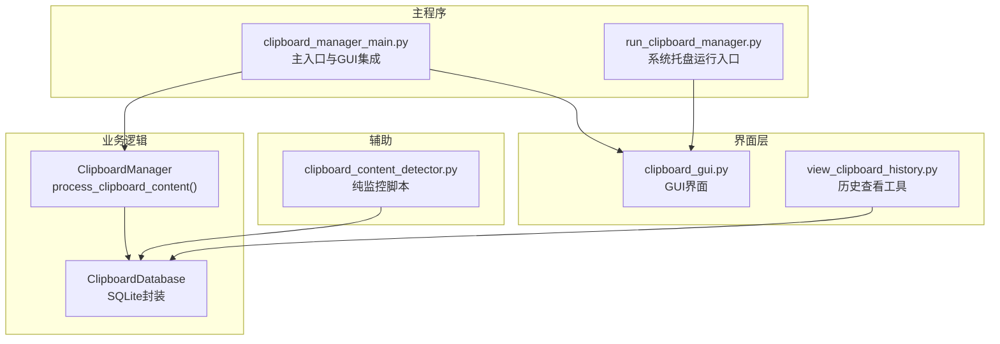
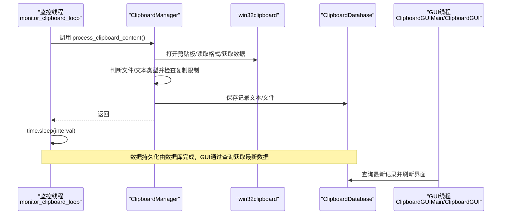
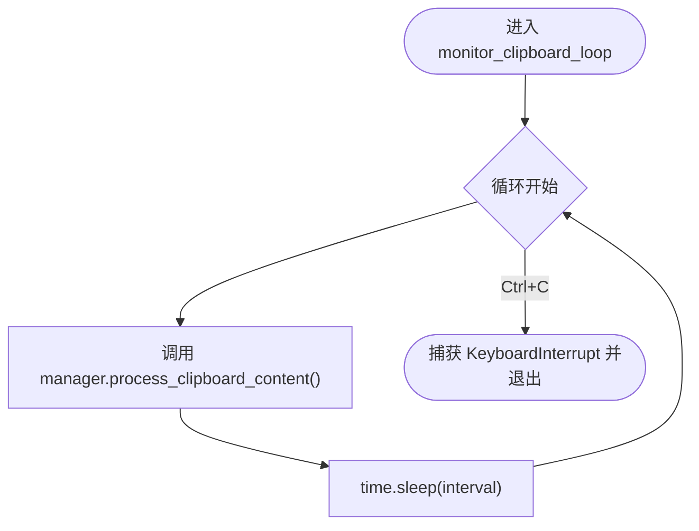
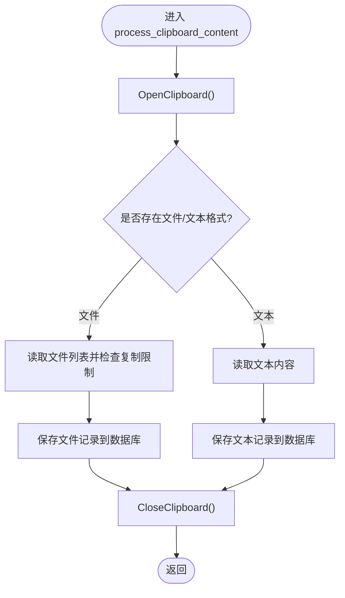
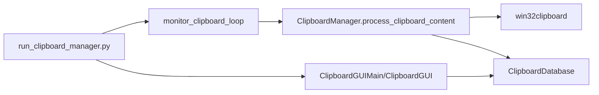

# 剪贴板监控线程安全

<cite>
**本文引用的文件**
- [clipboard_manager_main.py](file://clipboard_manager_main.py)
- [clipboard_gui.py](file://clipboard_gui.py)
- [clipboard_content_detector.py](file://clipboard_content_detector.py)
- [clipboard_db.py](file://clipboard_db.py)
- [run_clipboard_manager.py](file://run_clipboard_manager.py)
- [view_clipboard_history.py](file://view_clipboard_history.py)
</cite>

## 目录
1. [简介](#简介)
2. [项目结构](#项目结构)
3. [核心组件](#核心组件)
4. [架构总览](#架构总览)
5. [详细组件分析](#详细组件分析)
6. [依赖关系分析](#依赖关系分析)
7. [性能考量](#性能考量)
8. [故障排查指南](#故障排查指南)
9. [结论](#结论)
10. [附录](#附录)

## 简介
本文件聚焦于 monitor_clipboard_loop 函数在独立线程中运行时的线程安全机制，解释其如何通过定期调用 manager.process_clipboard_content() 与主线程共享状态，同时避免直接修改 GUI 组件；说明 time.sleep(interval) 如何防止 CPU 过度占用并确保监控循环不会阻塞 GUI 响应；阐述在多线程环境下访问 win32clipboard API 的安全性考虑，以及如何通过异常处理确保监控线程的稳定性。

## 项目结构
该项目采用“功能模块化 + 主入口控制”的组织方式：
- 主程序负责 GUI 与剪贴板监控的协同运行
- 数据层封装 SQLite 操作与设置管理
- GUI 层提供查询、统计与设置界面
- 独立脚本提供纯监控模式与系统托盘运行模式

图表来源
- [clipboard_manager_main.py](file://clipboard_manager_main.py#L355-L761)
- [clipboard_gui.py](file://clipboard_gui.py#L1-L200)
- [clipboard_content_detector.py](file://clipboard_content_detector.py#L1-L274)
- [clipboard_db.py](file://clipboard_db.py#L1-L120)
- [run_clipboard_manager.py](file://run_clipboard_manager.py#L1-L71)
- [view_clipboard_history.py](file://view_clipboard_history.py#L1-L75)

章节来源
- [clipboard_manager_main.py](file://clipboard_manager_main.py#L355-L761)
- [run_clipboard_manager.py](file://run_clipboard_manager.py#L1-L71)

## 核心组件
- monitor_clipboard_loop：独立线程中的监控循环，周期性调用 manager.process_clipboard_content()，并通过 time.sleep(interval) 控制 CPU 占用
- ClipboardManager.process_clipboard_content：负责读取剪贴板、判断内容类型、执行复制限制检查、保存到数据库等纯数据处理逻辑
- ClipboardDatabase：封装 SQLite 数据库操作，提供文本/文件记录与设置的增删改查
- GUI 层（ClipboardGUIMain/ClipboardGUI）：负责展示与交互，不直接参与剪贴板读写

章节来源
- [clipboard_manager_main.py](file://clipboard_manager_main.py#L355-L761)
- [clipboard_db.py](file://clipboard_db.py#L1-L120)
- [clipboard_gui.py](file://clipboard_gui.py#L1-L200)

## 架构总览
监控线程与 GUI 的职责分离：
- 监控线程：只做“读取剪贴板 -> 判断内容 -> 保存到数据库”，不直接操作 GUI 组件
- GUI 线程：只负责渲染与用户交互，必要时从数据库读取最新记录

图表来源
- [clipboard_manager_main.py](file://clipboard_manager_main.py#L355-L761)
- [clipboard_db.py](file://clipboard_db.py#L1-L120)
- [clipboard_gui.py](file://clipboard_gui.py#L600-L760)

## 详细组件分析

### monitor_clipboard_loop 线程安全机制
- 独立线程运行：通过 threading.Thread(target=..., daemon=True) 启动，daemon=True 确保主线程退出时监控线程随之下线
- 循环与睡眠：while True 中调用 manager.process_clipboard_content() 后执行 time.sleep(interval)，既保证周期性检查，又避免 CPU 高占用
- 异常处理：捕获 KeyboardInterrupt，优雅退出；内部 try/finally 确保 win32clipboard.CloseClipboard() 总能执行
- 与 GUI 的解耦：monitor_clipboard_loop 仅调用 manager.process_clipboard_content()，不直接操作 Tkinter 组件，避免跨线程修改 GUI 导致的竞态与崩溃

图表来源
- [clipboard_manager_main.py](file://clipboard_manager_main.py#L717-L730)

章节来源
- [clipboard_manager_main.py](file://clipboard_manager_main.py#L717-L730)

### manager.process_clipboard_content() 的线程安全要点
- win32clipboard 访问：每次读取剪贴板前 OpenClipboard，结束后 CloseClipboard，且在 finally 中兜底关闭，避免异常导致句柄泄漏
- 状态共享：通过数据库（ClipboardDatabase）共享状态，GUI 通过查询数据库获取最新记录，避免直接跨线程修改 GUI 组件
- 复制限制：在监控线程内完成复制限制检查，减少后续数据库写入失败带来的额外开销
- 错误隔离：对文件读取、数据库写入等可能失败的操作进行 try/except 包裹，不影响监控循环继续运行

图表来源
- [clipboard_manager_main.py](file://clipboard_manager_main.py#L395-L496)
- [clipboard_db.py](file://clipboard_db.py#L116-L183)

章节来源
- [clipboard_manager_main.py](file://clipboard_manager_main.py#L395-L496)
- [clipboard_db.py](file://clipboard_db.py#L116-L183)

### GUI 与数据层的协作
- GUI 侧不直接读取剪贴板：ClipboardGUIMain/ClipboardGUI 仅负责展示与交互，通过 ClipboardDatabase 查询数据库获取最新记录
- 数据一致性：ClipboardDatabase 提供统一的数据访问接口，避免多处直接操作数据库带来的竞态
- 实时刷新：GUI 可通过定时任务或用户手动刷新触发数据库查询，从而呈现最新数据

章节来源
- [clipboard_gui.py](file://clipboard_gui.py#L600-L760)
- [clipboard_db.py](file://clipboard_db.py#L185-L261)

### 纯监控脚本的对比参考
- clipboard_content_detector 提供了另一种监控模式（纯命令行），同样遵循“OpenClipboard/CloseClipboard”与异常处理原则，但其 monitor_clipboard 会直接打印输出而非写入数据库
- 该脚本可作为 monitor_clipboard_loop 的行为参考，强调了 sleep(interval) 与异常兜底的重要性

章节来源
- [clipboard_content_detector.py](file://clipboard_content_detector.py#L1-L274)

## 依赖关系分析
- monitor_clipboard_loop 依赖 ClipboardManager.process_clipboard_content
- ClipboardManager.process_clipboard_content 依赖 win32clipboard 与 ClipboardDatabase
- GUI 层依赖 ClipboardDatabase 进行数据展示
- run_clipboard_manager.py 将监控线程与 GUI 结合，实现系统托盘运行模式

图表来源
- [clipboard_manager_main.py](file://clipboard_manager_main.py#L355-L761)
- [clipboard_gui.py](file://clipboard_gui.py#L1-L200)
- [run_clipboard_manager.py](file://run_clipboard_manager.py#L1-L71)
- [clipboard_db.py](file://clipboard_db.py#L1-L120)

章节来源
- [clipboard_manager_main.py](file://clipboard_manager_main.py#L355-L761)
- [clipboard_gui.py](file://clipboard_gui.py#L1-L200)
- [run_clipboard_manager.py](file://run_clipboard_manager.py#L1-L71)
- [clipboard_db.py](file://clipboard_db.py#L1-L120)

## 性能考量
- CPU 占用控制：通过 time.sleep(interval) 降低轮询频率，避免频繁调用 win32clipboard 导致 CPU 占用过高
- I/O 优化：数据库写入采用事务式提交，尽量减少频繁 I/O；文件复制前先计算 MD5 并去重，避免重复写入
- GUI 响应性：监控线程与 GUI 线程分离，监控线程只做数据处理，不直接操作 GUI，确保 GUI 保持流畅

章节来源
- [clipboard_manager_main.py](file://clipboard_manager_main.py#L717-L730)
- [clipboard_db.py](file://clipboard_db.py#L116-L183)

## 故障排查指南
- 监控线程未启动或异常退出
  - 检查是否正确创建 daemon 线程并传入 manager 实例
  - 关注 KeyboardInterrupt 处理，确认 Ctrl+C 能正常退出
- 剪贴板访问失败
  - 确认 OpenClipboard/CloseClipboard 成对出现，异常时也能关闭
  - 检查 win32clipboard 是否可用，必要时在 finally 中兜底关闭
- 数据库写入异常
  - 关注 IntegrityError（如重复 MD5）的处理分支，确保记录更新与计数递增
  - 检查数据库连接与事务提交是否成功
- GUI 无法刷新
  - 确认 GUI 侧通过 ClipboardDatabase 查询最新记录
  - 检查数据库路径与权限，确保 GUI 能正常读取

章节来源
- [clipboard_manager_main.py](file://clipboard_manager_main.py#L395-L496)
- [clipboard_db.py](file://clipboard_db.py#L116-L183)
- [clipboard_gui.py](file://clipboard_gui.py#L600-L760)

## 结论
monitor_clipboard_loop 通过“独立线程 + 定期睡眠 + 异常兜底 + 数据库共享状态”的设计，在保证监控效率的同时，有效避免了直接修改 GUI 组件带来的线程安全风险。ClipboardManager.process_clipboard_content() 将剪贴板读取、复制限制检查与数据库写入集中在监控线程内完成，GUI 仅负责展示，实现了清晰的职责分离与良好的并发安全性。

## 附录
- 历史记录查看工具：view_clipboard_history.py 展示了如何通过 ClipboardDatabase 查询与格式化输出历史记录，便于离线核对数据一致性

章节来源
- [view_clipboard_history.py](file://view_clipboard_history.py#L1-L75)