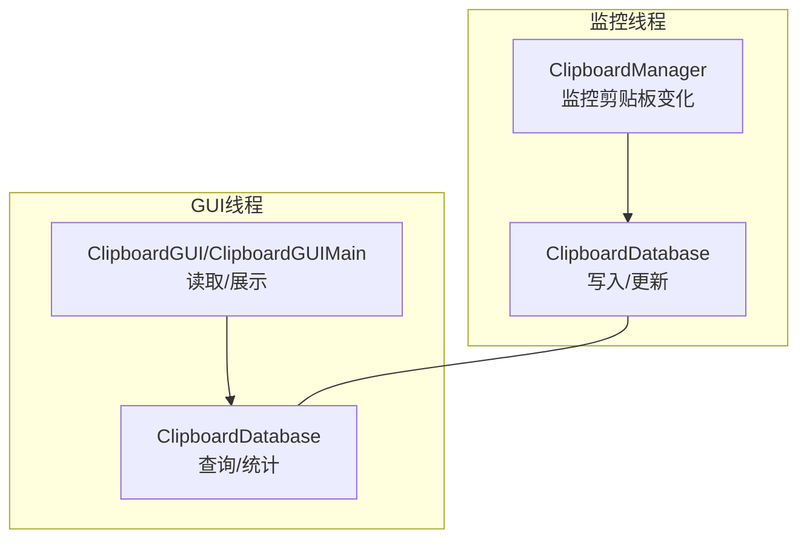
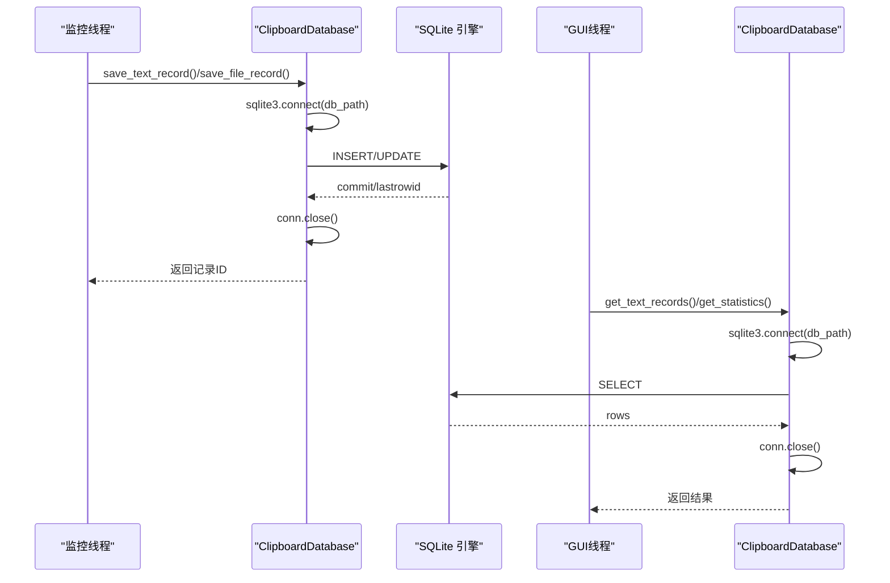
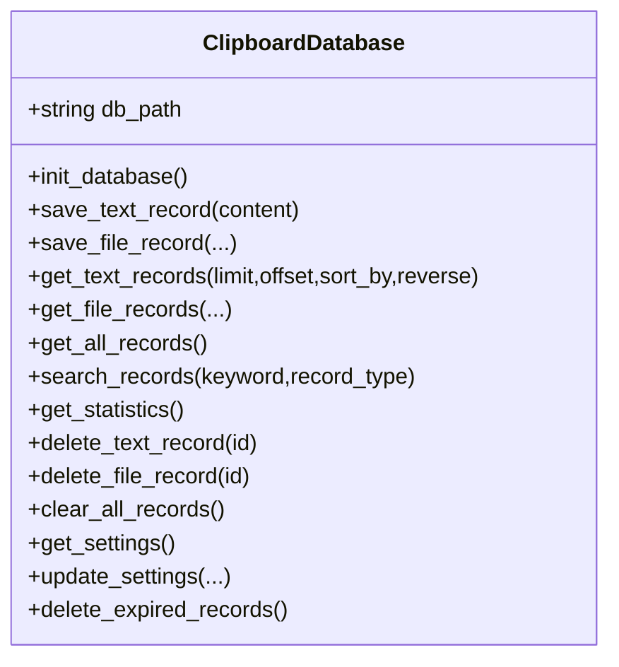
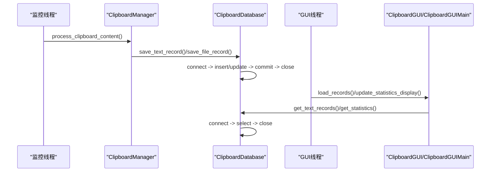
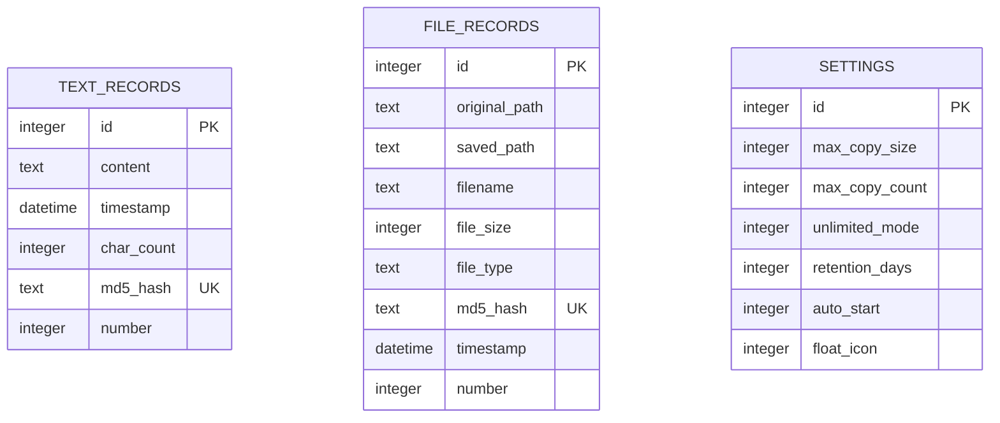
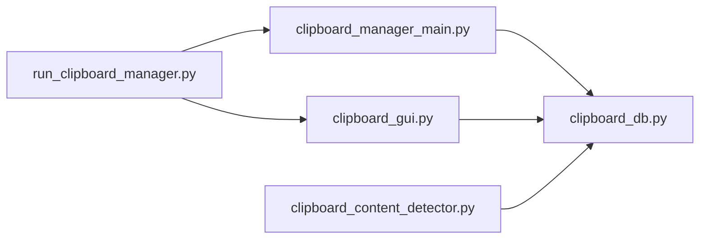

# 数据库线程安全策略

<cite>
**本文引用的文件**
- [clipboard_db.py](file://clipboard_db.py)
- [clipboard_gui.py](file://clipboard_gui.py)
- [clipboard_manager_main.py](file://clipboard_manager_main.py)
- [run_clipboard_manager.py](file://run_clipboard_manager.py)
- [clipboard_content_detector.py](file://clipboard_content_detector.py)
- [check_db.py](file://check_db.py)
- [cleanup_duplicates.py](file://cleanup_duplicates.py)
- [check_indexes.py](file://check_indexes.py)
</cite>

## 目录
1. [简介](#简介)
2. [项目结构](#项目结构)
3. [核心组件](#核心组件)
4. [架构总览](#架构总览)
5. [详细组件分析](#详细组件分析)
6. [依赖关系分析](#依赖关系分析)
7. [性能考量](#性能考量)
8. [故障排查指南](#故障排查指南)
9. [结论](#结论)

## 简介
本文件系统性阐述 SQLite 在多线程环境下的安全访问策略，重点分析 ClipboardDatabase 类如何利用 sqlite3 模块的内置线程安全特性，并通过“每个线程一个连接”的模式避免连接共享导致的锁冲突，从而实现后台监控线程的写入与 GUI 线程的读取安全并发执行。同时讨论该策略在性能与安全性之间的权衡，以及在本项目中的具体落地与实践。

## 项目结构
该项目围绕“剪贴板历史记录”构建，包含数据库层、监控层与 GUI 展示层：
- 数据库层：ClipboardDatabase 提供统一的数据库访问接口，负责建表、增删改查、统计与设置读写等。
- 监控层：ClipboardManager 通过系统剪贴板 API 检测变化，将文本/文件内容持久化至数据库。
- GUI 展示层：ClipboardGUI 或 ClipboardGUIMain 提供界面，展示历史记录、统计与设置。
- 启动与并发：run_clipboard_manager.py 在独立线程中运行监控，主线程运行 GUI，二者通过数据库进行数据交互。

图表来源
- [clipboard_manager_main.py](file://clipboard_manager_main.py#L355-L761)
- [clipboard_gui.py](file://clipboard_gui.py#L1-L200)
- [clipboard_db.py](file://clipboard_db.py#L1-L120)

章节来源
- [clipboard_manager_main.py](file://clipboard_manager_main.py#L355-L761)
- [clipboard_gui.py](file://clipboard_gui.py#L1-L200)
- [run_clipboard_manager.py](file://run_clipboard_manager.py#L32-L71)

## 核心组件
- ClipboardDatabase：封装数据库初始化、建表、CRUD、统计、设置读写与过期清理等。
- ClipboardManager：负责读取系统剪贴板内容，按规则去重与限流，最终写入数据库。
- ClipboardGUI/ClipboardGUIMain：负责界面渲染、用户交互、定时刷新与统计展示。
- run_clipboard_manager.py：进程入口，确保单实例运行，并在后台线程启动监控，前台运行 GUI。

章节来源
- [clipboard_db.py](file://clipboard_db.py#L1-L120)
- [clipboard_manager_main.py](file://clipboard_manager_main.py#L355-L761)
- [clipboard_gui.py](file://clipboard_gui.py#L1-L200)
- [run_clipboard_manager.py](file://run_clipboard_manager.py#L32-L71)

## 架构总览
本项目的数据库访问遵循“每线程一连接”的原则：
- 每次数据库操作均通过 sqlite3.connect(db_path) 创建新连接，执行完毕后立即 close()。
- 监控线程与 GUI 线程各自持有独立连接，避免跨线程共享连接带来的锁竞争与死锁风险。
- 由于 sqlite3 的线程安全模型允许“每个线程一个连接”，且未跨线程共享连接，因此读写并发安全。

图表来源
- [clipboard_db.py](file://clipboard_db.py#L116-L183)
- [clipboard_db.py](file://clipboard_db.py#L185-L261)
- [clipboard_db.py](file://clipboard_db.py#L316-L385)
- [clipboard_manager_main.py](file://clipboard_manager_main.py#L395-L496)
- [clipboard_gui.py](file://clipboard_gui.py#L581-L626)

## 详细组件分析

### ClipboardDatabase 类与“每线程一连接”策略
- 初始化与建表：在 init_database 中一次性创建表结构与索引，确保后续读写具备良好性能基础。
- 写入路径（save_text_record/save_file_record）：每次写入都新建连接，插入成功后提交并关闭；若因唯一约束冲突（如 md5_hash 已存在），捕获异常并更新计数字段，随后关闭连接。
- 读取路径（get_text_records/get_file_records/get_all_records/search_records）：每次查询新建连接，执行 SQL 后关闭连接。
- 统计与设置：get_statistics/get_settings/update_settings 同样采用“每调用一次一连接”的模式。
- 过期清理：delete_expired_records 读取设置后计算过期时间，删除过期记录并同步删除磁盘文件，最后关闭连接。

图表来源
- [clipboard_db.py](file://clipboard_db.py#L1-L455)

章节来源
- [clipboard_db.py](file://clipboard_db.py#L18-L115)
- [clipboard_db.py](file://clipboard_db.py#L116-L183)
- [clipboard_db.py](file://clipboard_db.py#L185-L261)
- [clipboard_db.py](file://clipboard_db.py#L263-L315)
- [clipboard_db.py](file://clipboard_db.py#L316-L385)
- [clipboard_db.py](file://clipboard_db.py#L387-L455)

### 监控线程与 GUI 线程的并发协作
- 监控线程：ClipboardManager 在独立线程中周期性调用 process_clipboard_content，内部通过 ClipboardDatabase.save_text_record/save_file_record 写入数据库，遵循“每调用一连接”的模式。
- GUI 线程：ClipboardGUI/ClipboardGUIMain 在主线程中调用 ClipboardDatabase 的查询方法展示数据，同样遵循“每调用一连接”的模式。
- 并发控制：由于未跨线程共享连接，sqlite3 的线程安全模型允许在同一进程中不同线程各自持有独立连接，避免锁冲突。

图表来源
- [clipboard_manager_main.py](file://clipboard_manager_main.py#L395-L496)
- [clipboard_gui.py](file://clipboard_gui.py#L581-L626)
- [clipboard_db.py](file://clipboard_db.py#L116-L183)

章节来源
- [clipboard_manager_main.py](file://clipboard_manager_main.py#L395-L496)
- [clipboard_gui.py](file://clipboard_gui.py#L581-L626)
- [run_clipboard_manager.py](file://run_clipboard_manager.py#L47-L66)

### “每线程一连接”模式的安全性与性能权衡
- 安全性
  - 避免跨线程共享连接：sqlite3 的线程安全模型允许“每个线程一个连接”，但不保证跨线程共享连接的安全性。本项目通过“每调用一连接”彻底规避了跨线程共享连接的风险。
  - 原子性与一致性：每次操作都在独立连接上执行，事务边界清晰，异常处理（如 IntegrityError）在连接内完成，避免了跨线程事务状态干扰。
- 性能
  - 连接开销：频繁创建/销毁连接会带来一定开销。对于高并发写入场景，建议考虑连接池或批量写入策略；但在本项目中，写入频率适中，且 GUI 读取为短查询，整体影响可接受。
  - 优化建议
    - 批量写入：将多个写入合并为单次事务，减少 commit 次数。
    - 读写分离：对只读查询尽量走 WAL 模式（SQLite 默认 WAL），提升并发读取性能。
    - 索引优化：已有 md5_hash 唯一索引，有助于去重与快速查找；可结合业务进一步评估其他索引。

章节来源
- [clipboard_db.py](file://clipboard_db.py#L116-L183)
- [clipboard_db.py](file://clipboard_db.py#L185-L261)
- [clipboard_db.py](file://clipboard_db.py#L316-L385)

### 数据库设计与一致性保障
- 去重策略：通过 md5_hash 字段与 number 字段实现“内容去重 + 计数累加”，避免重复写入与冗余存储。
- 唯一性约束：text_records/file_records 的 md5_hash 字段设置为 UNIQUE，配合 IntegrityError 捕获实现幂等写入。
- 设置表：settings 表提供 max_copy_size/max_copy_count/unlimited_mode 等配置项，监控与 GUI 均可读取并据此执行限流与清理。

图表来源
- [clipboard_db.py](file://clipboard_db.py#L23-L67)
- [clipboard_db.py](file://clipboard_db.py#L76-L115)

章节来源
- [clipboard_db.py](file://clipboard_db.py#L23-L115)

### 实践验证与辅助工具
- 检查数据库内容：check_db.py 用于查看最近带 MD5 的记录与重复 MD5 情况，验证去重策略有效性。
- 清理重复记录：cleanup_duplicates.py 用于修复历史数据中的重复 MD5，合并计数并删除冗余记录。
- 索引检查：check_indexes.py 用于确认索引是否存在，保障查询性能。

章节来源
- [check_db.py](file://check_db.py#L1-L31)
- [cleanup_duplicates.py](file://cleanup_duplicates.py#L1-L67)
- [check_indexes.py](file://check_indexes.py#L1-L27)

## 依赖关系分析
- 模块间依赖
  - clipboard_manager_main.py 中定义了与 clipboard_db.py 同名的 ClipboardDatabase，但其职责更偏向“监控+GUI”的集成层；本文件主要分析 clipboard_db.py 的数据库访问策略。
  - clipboard_gui.py 直接依赖 clipboard_db.py 进行数据读取与展示。
  - run_clipboard_manager.py 启动监控线程与 GUI，二者通过数据库进行数据交互。
  - clipboard_content_detector.py 提供剪贴板内容检测与格式识别，内部也使用 ClipboardDatabase 进行设置读取与限流判断。

图表来源
- [clipboard_manager_main.py](file://clipboard_manager_main.py#L355-L761)
- [clipboard_gui.py](file://clipboard_gui.py#L1-L200)
- [run_clipboard_manager.py](file://run_clipboard_manager.py#L32-L71)
- [clipboard_content_detector.py](file://clipboard_content_detector.py#L1-L60)

章节来源
- [clipboard_manager_main.py](file://clipboard_manager_main.py#L355-L761)
- [clipboard_gui.py](file://clipboard_gui.py#L1-L200)
- [run_clipboard_manager.py](file://run_clipboard_manager.py#L32-L71)
- [clipboard_content_detector.py](file://clipboard_content_detector.py#L1-L60)

## 性能考量
- 连接生命周期：每次操作新建连接，适合低频写入与短查询场景；高频写入建议采用批量提交与连接复用策略（需谨慎处理线程安全）。
- 事务粒度：将多次写入合并为单个事务可显著降低 commit 次数，提升吞吐量。
- 查询优化：合理使用索引（如 md5_hash）与 LIMIT 子句，避免全表扫描。
- I/O 与磁盘：文件记录涉及磁盘复制与删除，应关注磁盘性能与空间占用。

## 故障排查指南
- IntegrityError（唯一约束冲突）
  - 现象：写入时抛出 IntegrityError，通常由 md5_hash 重复触发。
  - 处理：捕获异常后更新 timestamp 与 number 字段，确保幂等写入。
- 连接泄漏
  - 现象：长时间运行后出现连接数过多或句柄占用。
  - 处理：确保每次操作后显式关闭连接；检查异常分支是否遗漏 close()。
- 查询超时或锁等待
  - 现象：GUI 查询卡顿或响应慢。
  - 处理：确认未跨线程共享连接；优化查询语句与索引；必要时启用 WAL 模式。
- 数据不一致
  - 现象：重复记录或计数异常。
  - 处理：使用 cleanup_duplicates.py 修复历史数据；核对 md5_hash 生成逻辑与去重策略。

章节来源
- [clipboard_db.py](file://clipboard_db.py#L136-L151)
- [clipboard_db.py](file://clipboard_db.py#L169-L183)
- [cleanup_duplicates.py](file://cleanup_duplicates.py#L1-L67)
- [check_db.py](file://check_db.py#L1-L31)

## 结论
本项目通过“每线程一连接”的数据库访问策略，充分利用 sqlite3 的线程安全特性，在不跨线程共享连接的前提下，实现了后台监控线程的写入与 GUI 线程的读取安全并发。该策略在安全性方面表现稳健，且在当前写入频率与查询规模下具备良好的可维护性。为进一步提升性能，可在保持线程安全前提下引入批量写入、连接复用与 WAL 优化等手段，以平衡吞吐与一致性需求。