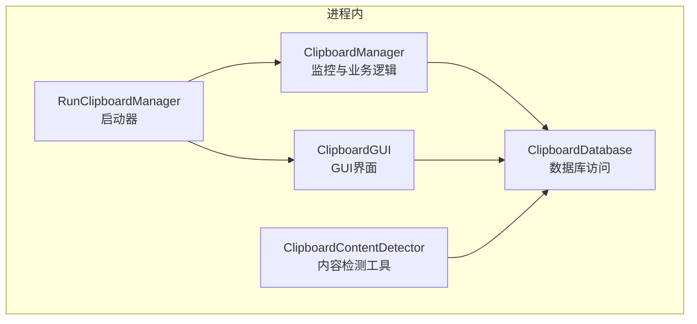
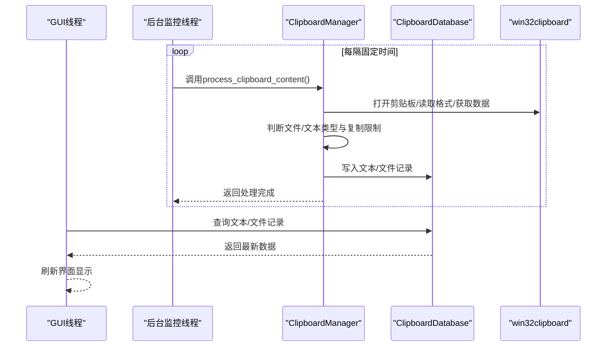
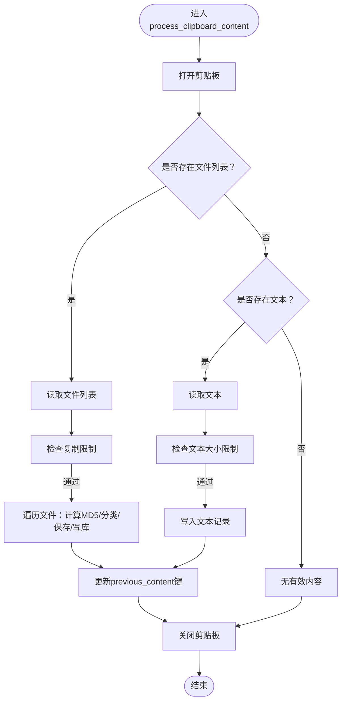
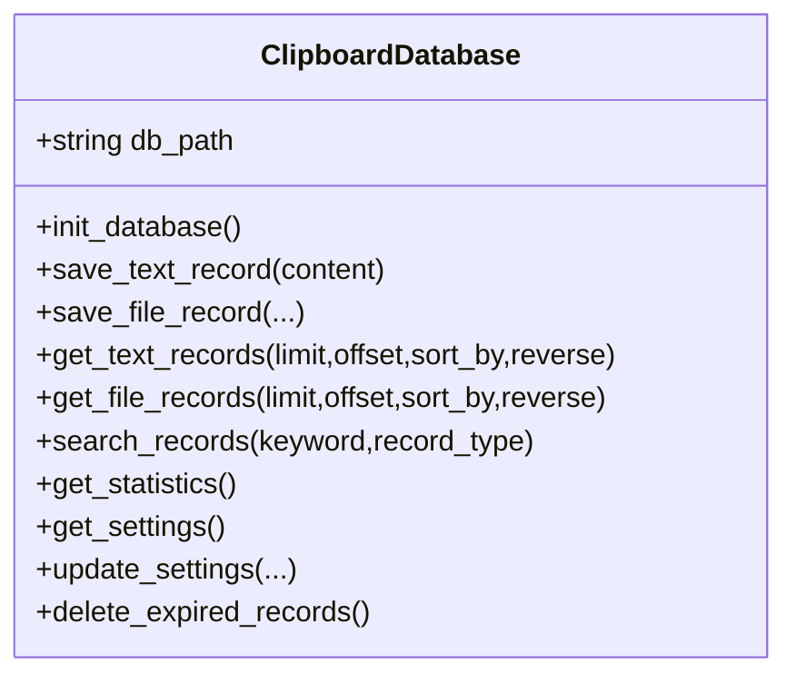
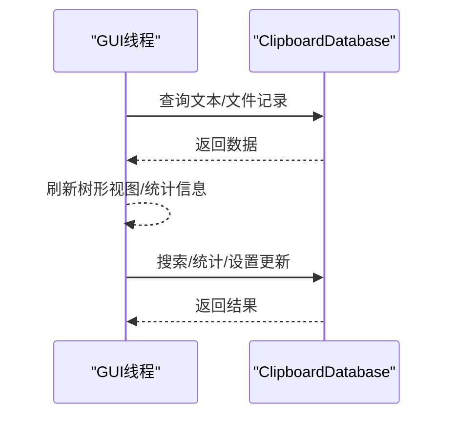
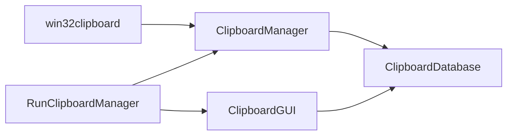

# 线程安全通信

<cite>
**本文引用的文件**
- [clipboard_manager_main.py](file://clipboard_manager_main.py)
- [clipboard_gui.py](file://clipboard_gui.py)
- [clipboard_db.py](file://clipboard_db.py)
- [clipboard_content_detector.py](file://clipboard_content_detector.py)
- [run_clipboard_manager.py](file://run_clipboard_manager.py)
- [view_clipboard_history.py](file://view_clipboard_history.py)
- [check_db.py](file://check_db.py)
- [check_indexes.py](file://check_indexes.py)
</cite>

## 目录
1. [简介](#简介)
2. [项目结构](#项目结构)
3. [核心组件](#核心组件)
4. [架构总览](#架构总览)
5. [详细组件分析](#详细组件分析)
6. [依赖关系分析](#依赖关系分析)
7. [性能考量](#性能考量)
8. [故障排查指南](#故障排查指南)
9. [结论](#结论)
10. [附录](#附录)

## 简介
本文件聚焦于多线程环境下“主线程（GUI）与后台监控线程”的线程安全通信机制。重点分析：
- 主线程（GUI）与后台监控线程之间如何安全地共享数据，尤其是 monitor_clipboard_loop 如何安全访问 ClipboardManager 的共享状态；
- GUI 如何通过定期轮询或事件通知机制获取监控线程的数据更新，避免直接跨线程调用；
- win32clipboard API 调用的线程安全性考虑；
- 数据库连接在多线程环境下的使用策略；
- 避免竞态条件和死锁的最佳实践示例。

## 项目结构
该项目采用“模块化+职责分离”的组织方式：
- 剪贴板监控与业务逻辑集中在主模块中，负责轮询剪贴板、处理文本/文件、写入数据库；
- GUI 界面独立模块，负责展示历史记录、统计信息、设置等；
- 数据库访问封装在独立模块中，提供统一的 CRUD 接口；
- 其他辅助脚本用于查看历史、检查数据库状态等。

图表来源
- [clipboard_manager_main.py](file://clipboard_manager_main.py#L355-L761)
- [clipboard_gui.py](file://clipboard_gui.py#L1-L200)
- [clipboard_db.py](file://clipboard_db.py#L1-L120)
- [clipboard_content_detector.py](file://clipboard_content_detector.py#L1-L120)
- [run_clipboard_manager.py](file://run_clipboard_manager.py#L1-L71)

章节来源
- [clipboard_manager_main.py](file://clipboard_manager_main.py#L355-L761)
- [clipboard_gui.py](file://clipboard_gui.py#L1-L200)
- [clipboard_db.py](file://clipboard_db.py#L1-L120)
- [clipboard_content_detector.py](file://clipboard_content_detector.py#L1-L120)
- [run_clipboard_manager.py](file://run_clipboard_manager.py#L1-L71)

## 核心组件
- ClipboardManager：负责监控剪贴板、判断复制限制、处理文本/文件、写入数据库，并维护上一次内容键值用于去重。
- ClipboardDatabase：封装 SQLite 数据库的初始化、CRUD、统计、设置读取与更新等。
- ClipboardGUI：提供 GUI 界面，支持搜索、排序、统计、设置等功能，通过数据库接口读取数据。
- ClipboardContentDetector：提供独立的剪贴板内容检测与格式识别能力，便于测试与工具化。
- RunClipboardManager：进程入口，负责单实例互斥、后台监控线程启动与 GUI 启动。

章节来源
- [clipboard_manager_main.py](file://clipboard_manager_main.py#L355-L761)
- [clipboard_gui.py](file://clipboard_gui.py#L1-L200)
- [clipboard_db.py](file://clipboard_db.py#L1-L120)
- [clipboard_content_detector.py](file://clipboard_content_detector.py#L1-L120)
- [run_clipboard_manager.py](file://run_clipboard_manager.py#L1-L71)

## 架构总览
主线程（GUI）与后台监控线程通过“只读共享状态 + 数据库作为最终一致性来源”实现解耦：
- 后台线程持有 ClipboardManager 实例，周期性调用其处理方法，内部通过 win32clipboard 读取剪贴板，必要时写入数据库；
- GUI 线程不直接调用后台线程的方法，而是通过数据库查询获取最新数据；
- 数据库作为共享状态的权威来源，避免了直接跨线程调用带来的竞态与死锁风险。

图表来源
- [clipboard_manager_main.py](file://clipboard_manager_main.py#L395-L496)
- [clipboard_manager_main.py](file://clipboard_manager_main.py#L717-L730)
- [clipboard_gui.py](file://clipboard_gui.py#L581-L626)
- [clipboard_db.py](file://clipboard_db.py#L116-L183)

章节来源
- [clipboard_manager_main.py](file://clipboard_manager_main.py#L395-L496)
- [clipboard_manager_main.py](file://clipboard_manager_main.py#L717-L730)
- [clipboard_gui.py](file://clipboard_gui.py#L581-L626)
- [clipboard_db.py](file://clipboard_db.py#L116-L183)

## 详细组件分析

### 组件A：ClipboardManager（剪贴板监控与处理）
- 角色定位：后台监控线程的核心执行体，负责周期性检查剪贴板变化、去重、限制校验、文件分类与保存、数据库写入。
- 关键点：
  - 使用 win32clipboard.OpenClipboard()/CloseClipboard() 包裹读取流程，确保异常时也能正确关闭；
  - 通过 previous_content 键值实现“内容键去重”，避免重复入库；
  - 限制校验在进入写库前完成，减少无效 IO；
  - 文本/文件分别处理，文件按类型分类保存至不同目录，计算 MD5 去重。

图表来源
- [clipboard_manager_main.py](file://clipboard_manager_main.py#L395-L496)

章节来源
- [clipboard_manager_main.py](file://clipboard_manager_main.py#L395-L496)

### 组件B：ClipboardDatabase（数据库访问）
- 角色定位：提供统一的数据库接口，封装初始化、CRUD、统计、设置读取与更新。
- 关键点：
  - 每次数据库操作均新建连接、提交事务、关闭连接，避免跨线程共享连接；
  - 文本记录与文件记录均支持去重（基于 md5_hash 或唯一约束），并维护 number 计数；
  - 设置项支持动态扩展（如 retention_days、auto_start、float_icon），通过 ALTER TABLE 兼容旧版本。

图表来源
- [clipboard_db.py](file://clipboard_db.py#L1-L120)
- [clipboard_db.py](file://clipboard_db.py#L116-L183)
- [clipboard_db.py](file://clipboard_db.py#L185-L261)
- [clipboard_db.py](file://clipboard_db.py#L281-L314)
- [clipboard_db.py](file://clipboard_db.py#L316-L332)
- [clipboard_db.py](file://clipboard_db.py#L359-L412)
- [clipboard_db.py](file://clipboard_db.py#L413-L455)

章节来源
- [clipboard_db.py](file://clipboard_db.py#L1-L120)
- [clipboard_db.py](file://clipboard_db.py#L116-L183)
- [clipboard_db.py](file://clipboard_db.py#L185-L261)
- [clipboard_db.py](file://clipboard_db.py#L281-L314)
- [clipboard_db.py](file://clipboard_db.py#L316-L332)
- [clipboard_db.py](file://clipboard_db.py#L359-L412)
- [clipboard_db.py](file://clipboard_db.py#L413-L455)

### 组件C：ClipboardGUI（GUI界面）
- 角色定位：负责界面展示、用户交互、数据查询与统计。
- 关键点：
  - 通过定时任务（root.after）驱动界面刷新，避免阻塞 GUI；
  - 列表加载与搜索均通过数据库接口完成，保证数据一致性；
  - 支持排序、搜索、统计、设置修改等。

图表来源
- [clipboard_gui.py](file://clipboard_gui.py#L581-L626)
- [clipboard_gui.py](file://clipboard_gui.py#L627-L748)
- [clipboard_gui.py](file://clipboard_gui.py#L749-L800)
- [clipboard_db.py](file://clipboard_db.py#L185-L261)
- [clipboard_db.py](file://clipboard_db.py#L281-L314)
- [clipboard_db.py](file://clipboard_db.py#L316-L332)

章节来源
- [clipboard_gui.py](file://clipboard_gui.py#L581-L626)
- [clipboard_gui.py](file://clipboard_gui.py#L627-L748)
- [clipboard_gui.py](file://clipboard_gui.py#L749-L800)
- [clipboard_db.py](file://clipboard_db.py#L185-L261)
- [clipboard_db.py](file://clipboard_db.py#L281-L314)
- [clipboard_db.py](file://clipboard_db.py#L316-L332)

### 组件D：ClipboardContentDetector（内容检测工具）
- 角色定位：独立的剪贴板内容检测与格式识别工具，便于调试与测试。
- 关键点：
  - 提供格式枚举、文本/文件读取、复制限制检查、内容展示等能力；
  - 与主模块的监控逻辑互补，可用于验证限制策略与格式识别。

章节来源
- [clipboard_content_detector.py](file://clipboard_content_detector.py#L1-L120)
- [clipboard_content_detector.py](file://clipboard_content_detector.py#L143-L181)
- [clipboard_content_detector.py](file://clipboard_content_detector.py#L218-L273)

### 组件E：RunClipboardManager（启动器）
- 角色定位：进程入口，负责单实例互斥、后台监控线程启动与 GUI 启动。
- 关键点：
  - 使用 Windows Mutex 实现单实例控制；
  - 后台监控线程以守护线程方式运行，避免阻塞主进程退出；
  - GUI 默认隐藏主窗口，仅显示系统托盘图标。

章节来源
- [run_clipboard_manager.py](file://run_clipboard_manager.py#L1-L71)

## 依赖关系分析
- 线程关系：
  - 主线程（GUI）与后台监控线程通过 ClipboardManager 单一实例交互；
  - GUI 通过 ClipboardDatabase 读取数据，不直接调用后台线程方法；
  - 启动器负责创建并启动后台线程，随后启动 GUI。
- 数据流：
  - 剪贴板 -> ClipboardManager -> 数据库；
  - 数据库 -> ClipboardGUI -> 用户界面。
- 外部依赖：
  - win32clipboard/win32con：剪贴板 API；
  - sqlite3：本地数据库；
  - tkinter：GUI 框架；
  - 其他第三方库（如 pystray、Pillow）用于托盘与图标。

图表来源
- [clipboard_manager_main.py](file://clipboard_manager_main.py#L395-L496)
- [clipboard_gui.py](file://clipboard_gui.py#L581-L626)
- [clipboard_db.py](file://clipboard_db.py#L116-L183)
- [run_clipboard_manager.py](file://run_clipboard_manager.py#L1-L71)

章节来源
- [clipboard_manager_main.py](file://clipboard_manager_main.py#L395-L496)
- [clipboard_gui.py](file://clipboard_gui.py#L581-L626)
- [clipboard_db.py](file://clipboard_db.py#L116-L183)
- [run_clipboard_manager.py](file://run_clipboard_manager.py#L1-L71)

## 性能考量
- 剪贴板轮询频率：默认每秒一次，可通过命令行参数调整；频率越高 CPU 占用越大，但响应越快。
- 数据库写入：每次写入均新建连接、提交事务、关闭连接，避免连接池复杂度；对于高频写入建议评估 WAL 模式与索引优化。
- GUI 刷新：使用 root.after 定时刷新，避免阻塞主线程；列表加载与搜索均通过数据库接口完成，减少内存压力。
- 文件处理：文件复制与 MD5 计算可能成为瓶颈，建议对大文件采用异步或分块处理策略（当前实现已分块）。

[本节为通用性能讨论，不直接分析具体文件]

## 故障排查指南
- 剪贴板访问异常：
  - 确认 OpenClipboard/CloseClipboard 成对出现，异常时也要关闭；
  - 检查剪贴板格式是否可用，避免读取失败导致异常传播。
- 数据库并发问题：
  - 每次数据库操作新建连接，避免跨线程共享连接引发的并发问题；
  - 若出现“数据库锁定”，检查是否存在长时间事务未提交或并发写入过多。
- GUI 无数据更新：
  - 确认后台监控线程已启动且未被阻塞；
  - 检查 GUI 的定时刷新逻辑是否正常触发；
  - 使用辅助脚本查看数据库内容，确认数据是否已写入。
- 单实例冲突：
  - 启动器使用 Mutex 控制单实例，若异常退出可能导致互斥体未释放，需重启系统或手动清理互斥体。

章节来源
- [clipboard_manager_main.py](file://clipboard_manager_main.py#L395-L496)
- [clipboard_db.py](file://clipboard_db.py#L116-L183)
- [run_clipboard_manager.py](file://run_clipboard_manager.py#L1-L71)
- [view_clipboard_history.py](file://view_clipboard_history.py#L1-L75)
- [check_db.py](file://check_db.py#L1-L31)
- [check_indexes.py](file://check_indexes.py#L1-L27)

## 结论
本项目通过“后台监控线程 + 数据库作为共享状态中心”的设计，在多线程环境下实现了稳定的线程安全通信：
- GUI 与后台线程之间避免直接跨线程调用，降低竞态与死锁风险；
- win32clipboard 的访问通过严格的打开/关闭包裹，提升稳定性；
- 数据库采用“每次操作新建连接”的策略，规避连接级并发问题；
- 通过定期轮询与事件通知（root.after）相结合的方式，保证 GUI 的实时性与响应性。

[本节为总结性内容，不直接分析具体文件]

## 附录

### 最佳实践清单（避免竞态与死锁）
- 避免直接跨线程调用：GUI 仅通过数据库查询获取数据，不直接调用后台线程方法。
- 严格管理资源：win32clipboard 的 Open/Close 必须成对出现，异常路径也要关闭。
- 数据库连接隔离：每个数据库操作新建连接，避免跨线程共享连接。
- 去重与幂等：通过 MD5/唯一键实现去重，保证重复写入不会破坏一致性。
- 限制前置：在写库前完成复制限制检查，减少无效 IO。
- 单实例控制：使用互斥体防止重复启动，避免资源竞争。

[本节为通用最佳实践，不直接分析具体文件]