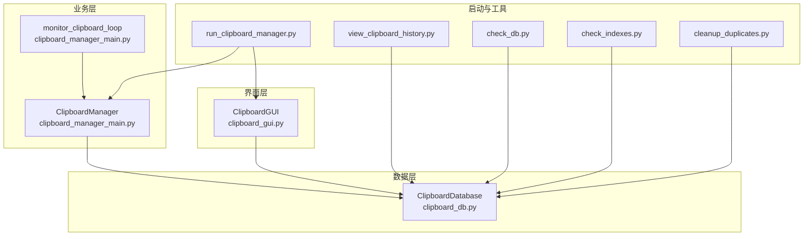
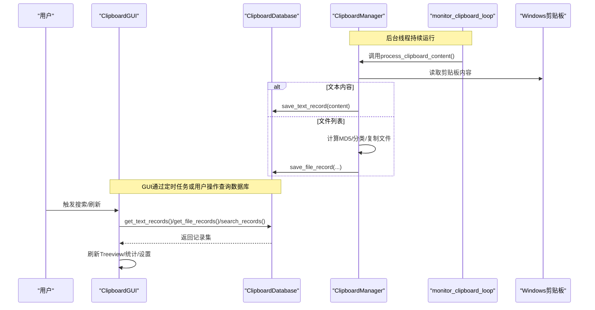
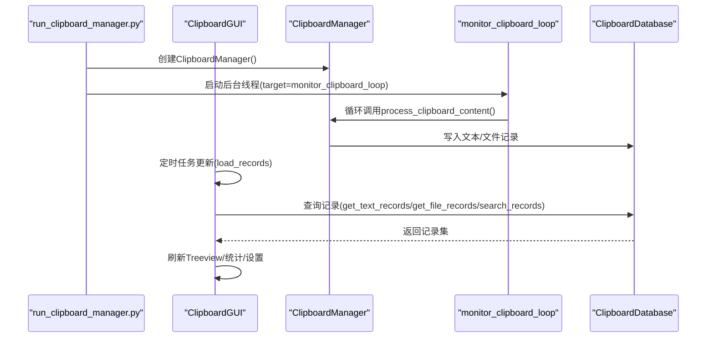
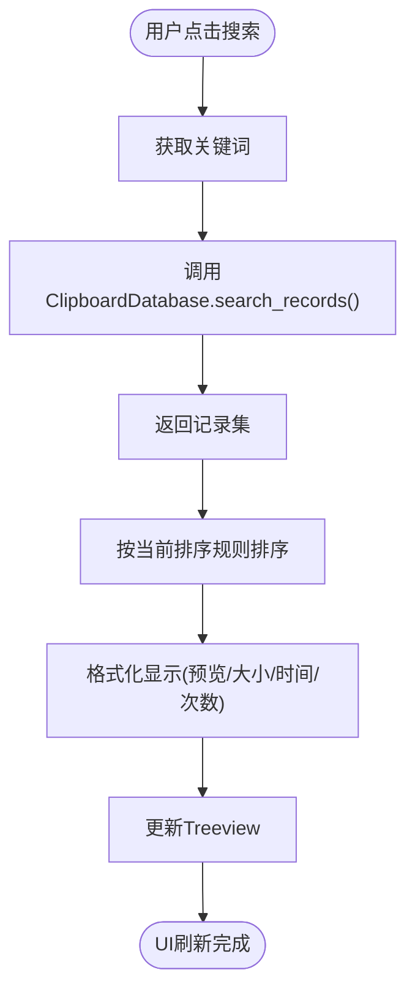
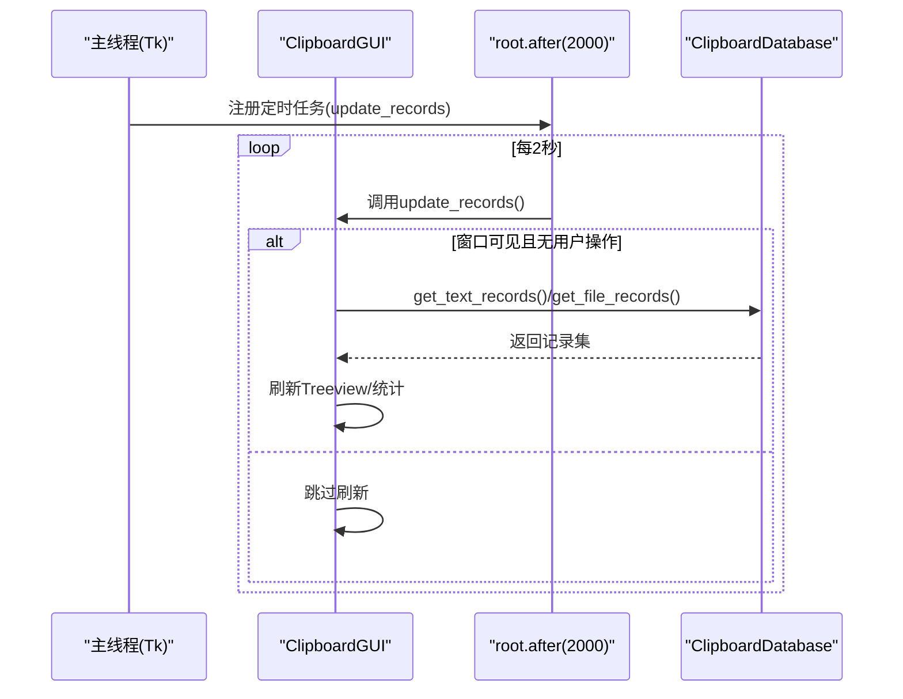
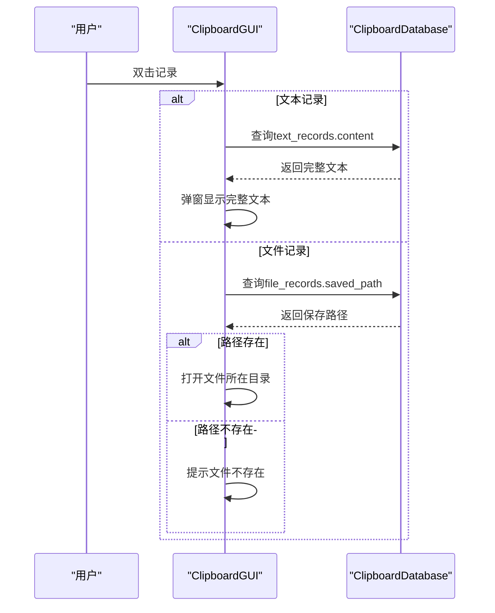
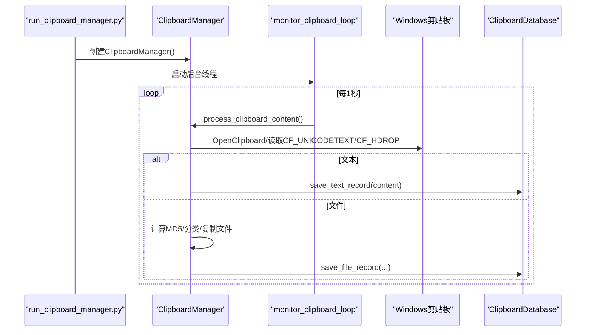
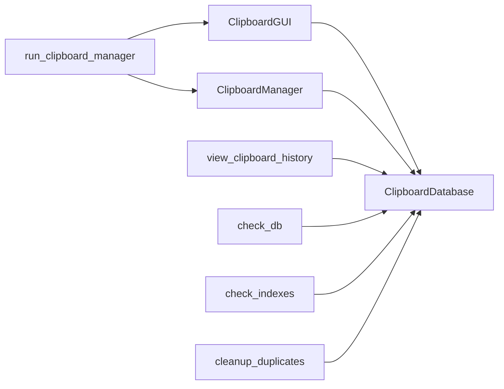

# 组件交互机制

<cite>
**本文引用的文件**
- [clipboard_gui.py](file://clipboard_gui.py)
- [clipboard_manager_main.py](file://clipboard_manager_main.py)
- [clipboard_db.py](file://clipboard_db.py)
- [run_clipboard_manager.py](file://run_clipboard_manager.py)
- [view_clipboard_history.py](file://view_clipboard_history.py)
- [check_db.py](file://check_db.py)
- [check_indexes.py](file://check_indexes.py)
- [cleanup_duplicates.py](file://cleanup_duplicates.py)
</cite>

## 目录
1. [简介](#简介)
2. [项目结构](#项目结构)
3. [核心组件](#核心组件)
4. [架构总览](#架构总览)
5. [详细组件分析](#详细组件分析)
6. [依赖关系分析](#依赖关系分析)
7. [性能考量](#性能考量)
8. [故障排查指南](#故障排查指南)
9. [结论](#结论)
10. [附录](#附录)

## 简介
本文件聚焦于“copyhistory”项目中各组件的交互机制，重点阐述：
- GUI界面与剪贴板管理器之间的方法调用关系：ClipboardGUI如何通过ClipboardManager实例启动monitor_clipboard_loop监控线程，管理器如何通过数据库写入通知GUI界面刷新。
- 数据库访问模式：同步查询与异步操作的处理方式。
- 事件驱动机制：用户搜索操作如何触发数据库查询并更新UI显示。
- 多线程环境下线程安全问题：主线程（GUI）与后台监控线程之间的数据共享与通信机制。
- 关键交互点示例：双击记录查看完整内容时的跨组件调用链。

## 项目结构
该项目采用“模块化+分层”的组织方式：
- 界面层：clipboard_gui.py 提供系统托盘、悬浮图标、主界面、统计与设置等GUI能力。
- 业务层：clipboard_manager_main.py 定义ClipboardManager负责剪贴板监控、内容处理与持久化。
- 数据层：clipboard_db.py 封装SQLite数据库访问，提供增删改查、统计、设置管理等接口。
- 启动与工具：run_clipboard_manager.py 启动GUI并后台运行监控线程；view_* 脚本用于检查数据库与索引、清理重复MD5记录。

图表来源
- [clipboard_gui.py](file://clipboard_gui.py#L1-L1730)
- [clipboard_manager_main.py](file://clipboard_manager_main.py#L1-L761)
- [clipboard_db.py](file://clipboard_db.py#L1-L455)
- [run_clipboard_manager.py](file://run_clipboard_manager.py#L1-L71)
- [view_clipboard_history.py](file://view_clipboard_history.py#L1-L75)
- [check_db.py](file://check_db.py#L1-L31)
- [check_indexes.py](file://check_indexes.py#L1-L27)
- [cleanup_duplicates.py](file://cleanup_duplicates.py#L1-L67)

章节来源
- [clipboard_gui.py](file://clipboard_gui.py#L1-L1730)
- [clipboard_manager_main.py](file://clipboard_manager_main.py#L1-L761)
- [clipboard_db.py](file://clipboard_db.py#L1-L455)
- [run_clipboard_manager.py](file://run_clipboard_manager.py#L1-L71)
- [view_clipboard_history.py](file://view_clipboard_history.py#L1-L75)
- [check_db.py](file://check_db.py#L1-L31)
- [check_indexes.py](file://check_indexes.py#L1-L27)
- [cleanup_duplicates.py](file://cleanup_duplicates.py#L1-L67)

## 核心组件
- ClipboardGUI：负责构建主界面、系统托盘、悬浮图标、搜索与排序、复制/删除记录、统计与设置、自动更新等。
- ClipboardManager：负责监控剪贴板、处理文本/文件内容、计算MD5、分类保存文件、写入数据库。
- ClipboardDatabase：封装SQLite访问，提供文本/文件记录的增删改查、统计、设置管理、过期清理等。
- monitor_clipboard_loop：后台监控循环，周期性调用ClipboardManager.process_clipboard_content。
- run_clipboard_manager：启动GUI并后台运行monitor_clipboard_loop，实现“后台监控+前台界面”的双线程模式。

章节来源
- [clipboard_gui.py](file://clipboard_gui.py#L1-L1730)
- [clipboard_manager_main.py](file://clipboard_manager_main.py#L1-L761)
- [clipboard_db.py](file://clipboard_db.py#L1-L455)
- [run_clipboard_manager.py](file://run_clipboard_manager.py#L1-L71)

## 架构总览
GUI与管理器通过数据库作为共享状态中心进行解耦。监控线程在后台持续写入数据库，GUI通过定时任务或用户操作触发数据库查询，从而刷新UI。

图表来源
- [clipboard_manager_main.py](file://clipboard_manager_main.py#L1-L761)
- [clipboard_gui.py](file://clipboard_gui.py#L1-L1730)
- [clipboard_db.py](file://clipboard_db.py#L1-L455)

## 详细组件分析

### GUI与剪贴板管理器的交互链路
- GUI通过ClipboardGUI类持有ClipboardDatabase实例，用于查询与更新UI。
- 启动时，run_clipboard_manager.py创建ClipboardManager实例，并在后台线程中运行monitor_clipboard_loop，后者周期性调用ClipboardManager.process_clipboard_content()。
- ClipboardManager在process_clip板内容处理完成后，直接写入ClipboardDatabase，不直接回调GUI。
- GUI通过定时任务（每2秒）在窗口可见且无用户操作时刷新记录，从而间接感知到数据库的变化。

图表来源
- [run_clipboard_manager.py](file://run_clipboard_manager.py#L1-L71)
- [clipboard_manager_main.py](file://clipboard_manager_main.py#L1-L761)
- [clipboard_gui.py](file://clipboard_gui.py#L1-L1730)
- [clipboard_db.py](file://clipboard_db.py#L1-L455)

章节来源
- [run_clipboard_manager.py](file://run_clipboard_manager.py#L1-L71)
- [clipboard_manager_main.py](file://clipboard_manager_main.py#L1-L761)
- [clipboard_gui.py](file://clipboard_gui.py#L1-L1730)
- [clipboard_db.py](file://clipboard_db.py#L1-L455)

### 数据库访问模式与线程安全
- 同步查询：GUI在主线程中调用ClipboardDatabase的方法（如get_text_records、get_file_records、search_records、get_statistics），这些方法内部建立sqlite连接执行SQL并关闭连接，属于典型的同步阻塞式访问。
- 异步写入：monitor_clipboard_loop在后台线程中调用ClipboardManager.process_clipboard_content()，由ClipboardManager直接写入ClipboardDatabase，同样为同步写入。
- 线程安全：
  - SQLite默认在单进程内是线程安全的，但不保证并发写入的安全性。本项目通过“单一写入源（后台监控线程）+ 主线程读取”的模式，避免了并发写冲突。
  - GUI在用户操作期间会设置user_action_in_progress标志，定时更新update_records会在非用户操作时才刷新，减少频繁刷新带来的竞争风险。
  - ClipboardDatabase未使用显式的锁，但其每个方法内部都独立建立/关闭连接，避免了跨方法的共享状态。

章节来源
- [clipboard_manager_main.py](file://clipboard_manager_main.py#L1-L761)
- [clipboard_gui.py](file://clipboard_gui.py#L1-L1730)
- [clipboard_db.py](file://clipboard_db.py#L1-L455)

### 事件驱动机制：用户搜索与UI刷新
- 用户在GUI界面输入关键词并点击“搜索”，ClipboardGUI调用ClipboardDatabase.search_records()获取结果。
- GUI对搜索结果进行二次排序与格式化，然后在Treeview中展示。
- 若用户点击“刷新”，GUI调用ClipboardDatabase.get_text_records()与get_file_records()，并刷新统计信息。

图表来源
- [clipboard_gui.py](file://clipboard_gui.py#L1-L1730)
- [clipboard_db.py](file://clipboard_db.py#L1-L455)

章节来源
- [clipboard_gui.py](file://clipboard_gui.py#L1-L1730)
- [clipboard_db.py](file://clipboard_db.py#L1-L455)

### 多线程与数据共享
- 后台监控线程：run_clipboard_manager.py创建daemon线程执行monitor_clipboard_loop，避免主线程退出导致监控中断。
- 主线程GUI：通过root.after(2000, update_records)实现定时刷新，update_records在窗口可见且无用户操作时才执行，降低竞争概率。
- 数据共享：ClipboardDatabase.db_path为共享状态，但每次方法内部建立连接，避免跨调用共享连接对象。

图表来源
- [run_clipboard_manager.py](file://run_clipboard_manager.py#L1-L71)
- [clipboard_gui.py](file://clipboard_gui.py#L1-L1730)
- [clipboard_db.py](file://clipboard_db.py#L1-L455)

章节来源
- [run_clipboard_manager.py](file://run_clipboard_manager.py#L1-L71)
- [clipboard_gui.py](file://clipboard_gui.py#L1-L1730)
- [clipboard_db.py](file://clipboard_db.py#L1-L455)

### 双击记录查看完整内容的跨组件调用链
- 用户双击记录，ClipboardGUI在show_full_record中根据记录类型（text/file）从数据库读取完整内容：
  - 文本记录：从ClipboardDatabase.get_text_records()中读取content。
  - 文件记录：从ClipboardDatabase.get_file_records()中读取saved_path，若存在则打开文件所在目录。
- 该流程完全由GUI发起，通过ClipboardDatabase完成数据读取，不涉及管理器的直接回调。

图表来源
- [clipboard_gui.py](file://clipboard_gui.py#L1-L1730)
- [clipboard_db.py](file://clipboard_db.py#L1-L455)

章节来源
- [clipboard_gui.py](file://clipboard_gui.py#L1-L1730)
- [clipboard_db.py](file://clipboard_db.py#L1-L455)

### GUI界面与剪贴板管理器的启动与监控
- run_clipboard_manager.py负责：
  - 检查程序是否已运行（互斥锁）。
  - 创建ClipboardManager实例。
  - 在后台线程启动monitor_clipboard_loop，周期性调用ClipboardManager.process_clipboard_content()。
  - 启动GUI（默认隐藏主窗口，显示系统托盘图标）。
- ClipboardManager.process_clipboard_content()负责：
  - 读取Windows剪贴板（文本/文件列表）。
  - 计算文件MD5、分类保存、去重计数、写入数据库。

图表来源
- [run_clipboard_manager.py](file://run_clipboard_manager.py#L1-L71)
- [clipboard_manager_main.py](file://clipboard_manager_main.py#L1-L761)
- [clipboard_db.py](file://clipboard_db.py#L1-L455)

章节来源
- [run_clipboard_manager.py](file://run_clipboard_manager.py#L1-L71)
- [clipboard_manager_main.py](file://clipboard_manager_main.py#L1-L761)
- [clipboard_db.py](file://clipboard_db.py#L1-L455)

## 依赖关系分析
- ClipboardGUI依赖ClipboardDatabase进行查询与更新UI。
- ClipboardManager依赖ClipboardDatabase进行持久化。
- run_clipboard_manager.py同时依赖ClipboardManager与ClipboardGUI。
- view_*脚本与cleanup_*脚本均依赖ClipboardDatabase进行数据检查与维护。

图表来源
- [clipboard_gui.py](file://clipboard_gui.py#L1-L1730)
- [clipboard_manager_main.py](file://clipboard_manager_main.py#L1-L761)
- [clipboard_db.py](file://clipboard_db.py#L1-L455)
- [run_clipboard_manager.py](file://run_clipboard_manager.py#L1-L71)
- [view_clipboard_history.py](file://view_clipboard_history.py#L1-L75)
- [check_db.py](file://check_db.py#L1-L31)
- [check_indexes.py](file://check_indexes.py#L1-L27)
- [cleanup_duplicates.py](file://cleanup_duplicates.py#L1-L67)

章节来源
- [clipboard_gui.py](file://clipboard_gui.py#L1-L1730)
- [clipboard_manager_main.py](file://clipboard_manager_main.py#L1-L761)
- [clipboard_db.py](file://clipboard_db.py#L1-L455)
- [run_clipboard_manager.py](file://run_clipboard_manager.py#L1-L71)
- [view_clipboard_history.py](file://view_clipboard_history.py#L1-L75)
- [check_db.py](file://check_db.py#L1-L31)
- [check_indexes.py](file://check_indexes.py#L1-L27)
- [cleanup_duplicates.py](file://cleanup_duplicates.py#L1-L67)

## 性能考量
- 查询优化：ClipboardDatabase提供按timestamp、content、file_size、file_type、number等字段排序的查询接口，GUI可按需选择排序字段与方向，减少不必要的全量扫描。
- 分页策略：GUI当前一次性加载所有记录，未实现分页。若记录量增大，建议在ClipboardDatabase中引入limit/offset参数，或在GUI侧实现虚拟滚动。
- 定时刷新：GUI每2秒刷新一次，窗口隐藏或有用户操作时跳过刷新，避免无效负载。
- 索引与重复：check_indexes.py与cleanup_duplicates.py可用于诊断与修复索引缺失与重复MD5问题，提升查询效率与一致性。

[本节为通用指导，不直接分析具体文件]

## 故障排查指南
- 数据库检查
  - 使用check_db.py检查text_records中MD5与number字段，定位重复记录与计数异常。
  - 使用check_indexes.py检查text_records/file_records索引是否存在，必要时重建索引。
  - 使用cleanup_duplicates.py合并重复MD5记录，统一计数并删除冗余记录。
- 启动冲突
  - run_clipboard_manager.py通过互斥锁避免重复启动；若出现无法恢复窗口，检查互斥锁句柄是否泄漏。
- 系统托盘与悬浮图标
  - 若托盘图标不可用，检查pystray与Pillow依赖；悬浮图标位置与透明度可通过设置调整。
- 剪贴板权限
  - Windows剪贴板访问可能因权限或系统策略受限，monitor_clipboard_loop在异常时会捕获并打印日志，便于定位。

章节来源
- [check_db.py](file://check_db.py#L1-L31)
- [check_indexes.py](file://check_indexes.py#L1-L27)
- [cleanup_duplicates.py](file://cleanup_duplicates.py#L1-L67)
- [run_clipboard_manager.py](file://run_clipboard_manager.py#L1-L71)
- [clipboard_gui.py](file://clipboard_gui.py#L1-L1730)

## 结论
本项目通过“后台监控线程+前台GUI”的双线程架构，实现了对剪贴板内容的持续采集与持久化，并以数据库为共享状态中心，避免了组件间的紧耦合。GUI通过定时任务与用户事件驱动数据库查询，实现UI的实时更新。整体设计简洁清晰，具备良好的可维护性与扩展性。建议后续引入分页与索引优化，进一步提升大数据量场景下的性能表现。

[本节为总结性内容，不直接分析具体文件]

## 附录
- 启动方式
  - 直接运行run_clipboard_manager.py以同时启动GUI与后台监控。
  - 或运行clipboard_manager_main.py以仅运行监控器（命令行参数支持-i设置检测间隔）。
- 历史查看
  - view_clipboard_history.py用于快速查看最近文本与文件记录及统计信息。

章节来源
- [run_clipboard_manager.py](file://run_clipboard_manager.py#L1-L71)
- [clipboard_manager_main.py](file://clipboard_manager_main.py#L1-L761)
- [view_clipboard_history.py](file://view_clipboard_history.py#L1-L75)