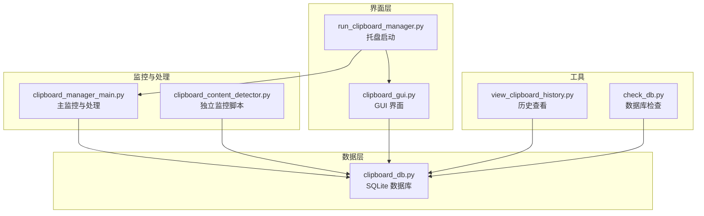
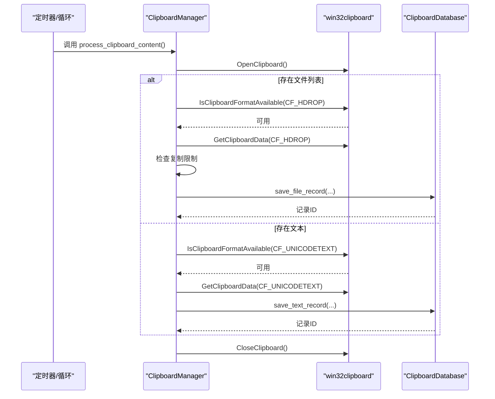
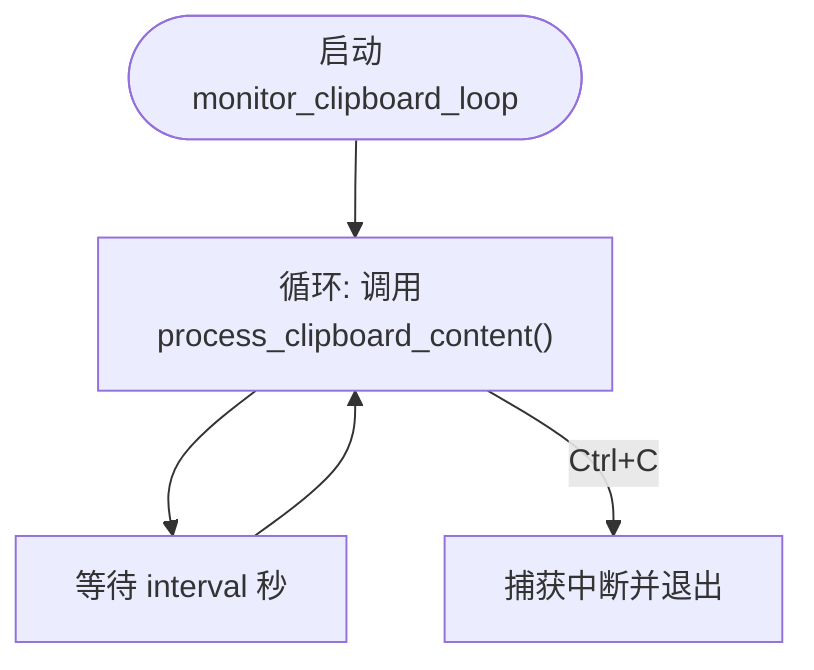
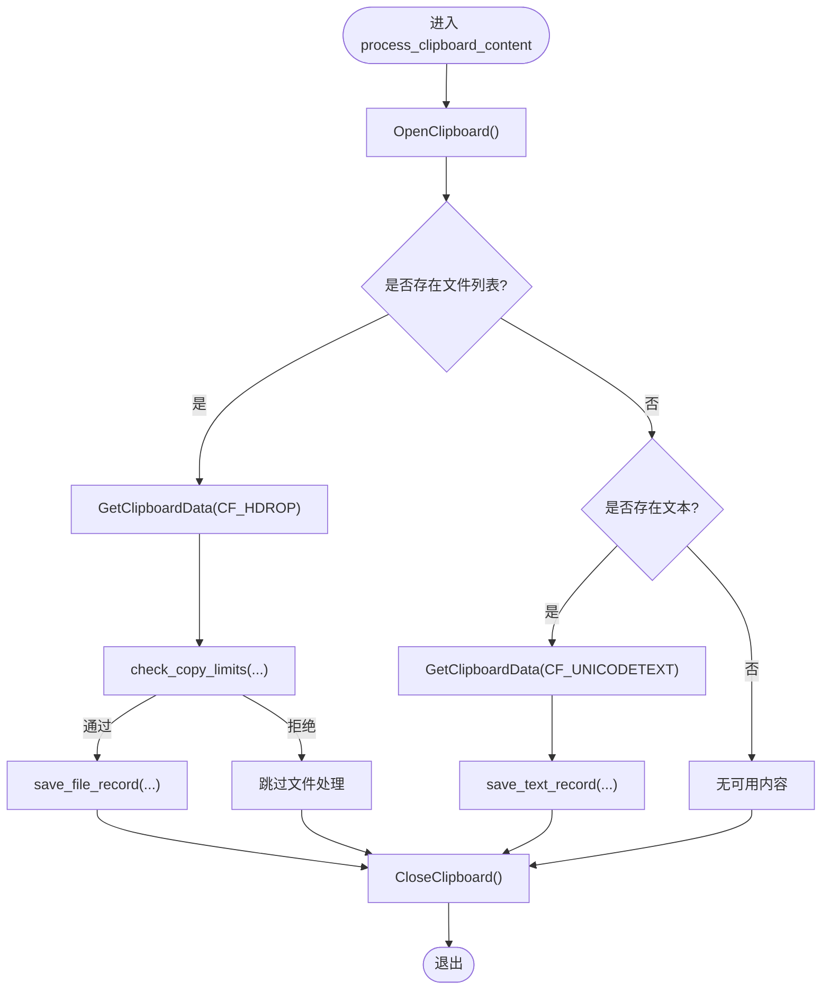
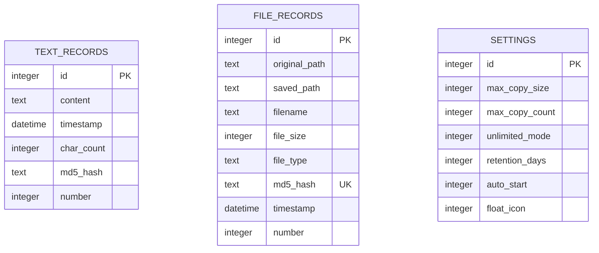
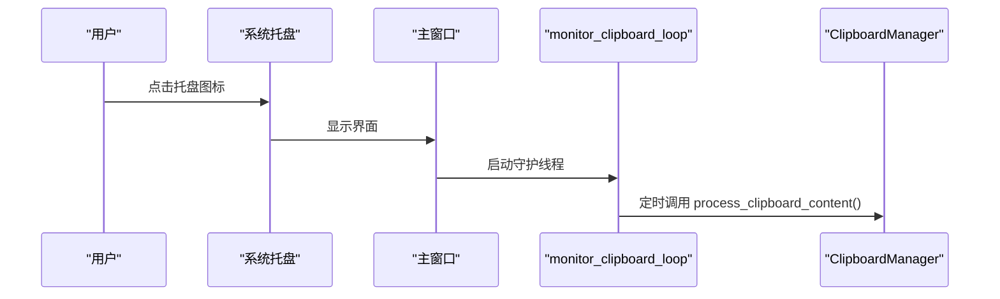
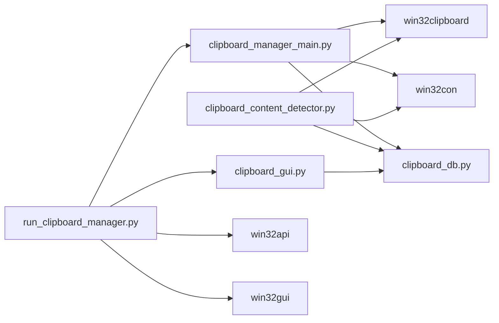

# 剪贴板监控失效

<cite>
**本文引用的文件**
- [clipboard_manager_main.py](file://clipboard_manager_main.py)
- [clipboard_content_detector.py](file://clipboard_content_detector.py)
- [clipboard_db.py](file://clipboard_db.py)
- [clipboard_gui.py](file://clipboard_gui.py)
- [run_clipboard_manager.py](file://run_clipboard_manager.py)
- [view_clipboard_history.py](file://view_clipboard_history.py)
- [check_db.py](file://check_db.py)
</cite>

## 目录
1. [简介](#简介)
2. [项目结构](#项目结构)
3. [核心组件](#核心组件)
4. [架构总览](#架构总览)
5. [详细组件分析](#详细组件分析)
6. [依赖关系分析](#依赖关系分析)
7. [性能考量](#性能考量)
8. [故障排除指南](#故障排除指南)
9. [结论](#结论)
10. [附录](#附录)

## 简介
本指南聚焦“剪贴板监控失效”的常见问题，结合代码库中剪贴板监控与处理的实现，系统性地分析可能导致监控失败的原因，并提供可操作的诊断与修复建议。重点覆盖以下方面：
- Windows 剪贴板 API 访问被阻止
- 多线程竞争与线程生命周期
- 权限问题与系统资源不足
- monitor_clipboard_loop 的运行机制
- process_clipboard_content 中对 win32clipboard 的调用流程
- 诊断方法与调试建议
- 解决方案与优化策略

## 项目结构
该项目由多个模块组成，围绕“剪贴板监控、内容识别、数据库持久化、GUI 展示”四个维度构建。核心文件如下：
- 主监控与处理：clipboard_manager_main.py
- 独立监控脚本：clipboard_content_detector.py
- 数据库管理：clipboard_db.py
- GUI 界面：clipboard_gui.py
- 启动与托盘：run_clipboard_manager.py
- 历史记录查看：view_clipboard_history.py
- 数据库检查：check_db.py

图表来源
- [clipboard_manager_main.py](file://clipboard_manager_main.py#L1-L761)
- [clipboard_content_detector.py](file://clipboard_content_detector.py#L1-L274)
- [clipboard_db.py](file://clipboard_db.py#L1-L455)
- [clipboard_gui.py](file://clipboard_gui.py#L1-L800)
- [run_clipboard_manager.py](file://run_clipboard_manager.py#L1-L71)
- [view_clipboard_history.py](file://view_clipboard_history.py#L1-L75)
- [check_db.py](file://check_db.py#L1-L31)

章节来源
- [clipboard_manager_main.py](file://clipboard_manager_main.py#L1-L761)
- [clipboard_content_detector.py](file://clipboard_content_detector.py#L1-L274)
- [clipboard_db.py](file://clipboard_db.py#L1-L455)
- [clipboard_gui.py](file://clipboard_gui.py#L1-L800)
- [run_clipboard_manager.py](file://run_clipboard_manager.py#L1-L71)
- [view_clipboard_history.py](file://view_clipboard_history.py#L1-L75)
- [check_db.py](file://check_db.py#L1-L31)

## 核心组件
- 剪贴板监控循环：周期性触发内容检查，避免重复保存，处理文本与文件两类内容。
- 剪贴板内容处理：通过 win32clipboard 打开剪贴板、判断格式、读取数据、保存到数据库。
- 数据库管理：维护文本与文件记录、设置项、统计信息与过期清理。
- GUI 界面：提供查询、统计、设置等交互入口，支持系统托盘与悬浮图标。
- 独立监控脚本：提供更细粒度的格式枚举与内容展示，便于诊断。

章节来源
- [clipboard_manager_main.py](file://clipboard_manager_main.py#L355-L761)
- [clipboard_content_detector.py](file://clipboard_content_detector.py#L1-L274)
- [clipboard_db.py](file://clipboard_db.py#L1-L455)
- [clipboard_gui.py](file://clipboard_gui.py#L1-L800)

## 架构总览
监控流程从“定时循环”出发，进入“内容处理”，随后“写入数据库”。GUI 与托盘负责用户交互与后台运行。

图表来源
- [clipboard_manager_main.py](file://clipboard_manager_main.py#L395-L496)
- [clipboard_db.py](file://clipboard_db.py#L116-L183)

章节来源
- [clipboard_manager_main.py](file://clipboard_manager_main.py#L395-L496)
- [clipboard_db.py](file://clipboard_db.py#L116-L183)

## 详细组件分析

### 组件A：monitor_clipboard_loop 与线程模型
- 角色：在独立线程中持续执行监控循环，按固定间隔调用内容处理函数。
- 关键点：
  - 循环内调用 manager.process_clipboard_content()。
  - 支持通过命令行参数设置间隔（秒），默认 1 秒。
  - 捕获键盘中断优雅退出。
  - GUI 模式下以守护线程运行，避免阻塞主事件循环。

图表来源
- [clipboard_manager_main.py](file://clipboard_manager_main.py#L717-L730)

章节来源
- [clipboard_manager_main.py](file://clipboard_manager_main.py#L717-L730)
- [run_clipboard_manager.py](file://run_clipboard_manager.py#L47-L66)

### 组件B：process_clipboard_content 的 win32clipboard 调用流程
- 打开剪贴板：OpenClipboard()。
- 判断格式：
  - 文件列表：IsClipboardFormatAvailable(CF_HDROP) → GetClipboardData(CF_HDROP)。
  - 文本内容：IsClipboardFormatAvailable(CF_UNICODETEXT) → GetClipboardData(CF_UNICODETEXT)。
- 重复性控制：基于 previous_content 与内容键（文本哈希/文件列表排序拼接）避免重复处理。
- 异常处理：对 OpenClipboard 外的异常进行打印；finally 中确保 CloseClipboard() 执行。
- 数据库写入：分别调用 save_text_record/save_file_record。

图表来源
- [clipboard_manager_main.py](file://clipboard_manager_main.py#L395-L496)

章节来源
- [clipboard_manager_main.py](file://clipboard_manager_main.py#L395-L496)

### 组件C：数据库层（ClipboardDatabase）
- 表结构：
  - text_records：文本内容、时间戳、字符数、md5_hash、number。
  - file_records：文件路径、保存路径、文件名、大小、类型、md5_hash、时间戳、number。
  - settings：复制限制、无限模式、保存天数、开机自启、悬浮图标等。
- 功能：
  - 保存记录（文本/文件），冲突时按 md5_hash 增加 number。
  - 获取记录、搜索、统计、清理过期记录。
  - 设置项读取与更新。

图表来源
- [clipboard_db.py](file://clipboard_db.py#L18-L115)
- [clipboard_db.py](file://clipboard_db.py#L116-L183)
- [clipboard_db.py](file://clipboard_db.py#L359-L412)

章节来源
- [clipboard_db.py](file://clipboard_db.py#L18-L115)
- [clipboard_db.py](file://clipboard_db.py#L116-L183)
- [clipboard_db.py](file://clipboard_db.py#L359-L412)

### 组件D：GUI 与托盘
- GUI：提供记录查询、统计、设置等功能，支持系统托盘图标与悬浮图标。
- 托盘：run_clipboard_manager.py 通过互斥量防止重复运行，隐藏主窗口，后台运行监控线程。

图表来源
- [run_clipboard_manager.py](file://run_clipboard_manager.py#L17-L66)
- [clipboard_gui.py](file://clipboard_gui.py#L144-L171)

章节来源
- [run_clipboard_manager.py](file://run_clipboard_manager.py#L17-L66)
- [clipboard_gui.py](file://clipboard_gui.py#L144-L171)

## 依赖关系分析
- clipboard_manager_main.py 依赖 win32clipboard/win32con 进行剪贴板访问，依赖 ClipboardDatabase 进行持久化。
- clipboard_content_detector.py 独立监控脚本同样依赖 win32clipboard，提供格式枚举与内容展示。
- clipboard_gui.py 依赖 ClipboardDatabase 进行查询与统计。
- run_clipboard_manager.py 依赖 win32api/win32gui 控制互斥量与窗口激活。

图表来源
- [clipboard_manager_main.py](file://clipboard_manager_main.py#L1-L761)
- [clipboard_content_detector.py](file://clipboard_content_detector.py#L1-L274)
- [clipboard_db.py](file://clipboard_db.py#L1-L455)
- [clipboard_gui.py](file://clipboard_gui.py#L1-L800)
- [run_clipboard_manager.py](file://run_clipboard_manager.py#L1-L71)

章节来源
- [clipboard_manager_main.py](file://clipboard_manager_main.py#L1-L761)
- [clipboard_content_detector.py](file://clipboard_content_detector.py#L1-L274)
- [clipboard_db.py](file://clipboard_db.py#L1-L455)
- [clipboard_gui.py](file://clipboard_gui.py#L1-L800)
- [run_clipboard_manager.py](file://run_clipboard_manager.py#L1-L71)

## 性能考量
- 监控间隔：默认 1 秒，可根据系统负载与需求调整；过短会增加 CPU/IO 压力。
- 数据库写入：每次变更都会写入 SQLite，建议合理设置复制限制，避免频繁写入。
- 文件复制：文件保存涉及磁盘 IO，建议关注磁盘空间与权限。
- GUI 与托盘：守护线程避免阻塞主线程，但需注意资源释放与异常处理。

[本节为通用指导，不直接分析具体文件]

## 故障排除指南

### 一、常见失效原因与定位
- Windows 剪贴板 API 访问被阻止
  - 症状：出现“无法打开剪贴板”类错误或无响应。
  - 排查要点：
    - 检查是否被其他进程占用（例如杀毒软件、剪贴板增强工具）。
    - 确认当前进程具备访问剪贴板的权限。
    - 在独立监控脚本中运行，观察是否能成功枚举格式与读取内容。
- 多线程竞争
  - 症状：GUI 与监控线程同时访问剪贴板或数据库，偶发异常。
  - 排查要点：
    - 确认 monitor_clipboard_loop 以守护线程运行，避免阻塞 GUI。
    - 检查异常处理是否覆盖 OpenClipboard 之外的异常。
- 权限问题
  - 症状：无法写入数据库或保存文件。
  - 排查要点：
    - 确认运行目录有写权限。
    - 确认目标保存目录存在且可写。
- 系统资源不足
  - 症状：CPU 占用高、内存增长、监控卡顿。
  - 排查要点：
    - 调整监控间隔，减少写入频率。
    - 检查复制限制设置，避免超大文件或大量文件同时处理。

章节来源
- [clipboard_manager_main.py](file://clipboard_manager_main.py#L395-L496)
- [clipboard_content_detector.py](file://clipboard_content_detector.py#L1-L274)
- [run_clipboard_manager.py](file://run_clipboard_manager.py#L47-L66)

### 二、诊断方法
- 检查“无法打开剪贴板”错误日志
  - 在 process_clipboard_content 中，OpenClipboard 外的异常会被打印；若未见异常，优先排查 OpenClipboard 是否被外部占用。
- 验证线程是否正常运行
  - GUI 模式下，监控线程以守护线程启动；可通过任务管理器确认线程存在。
  - 独立运行 monitor_clipboard_loop，观察输出与行为。
- 测试其他程序的剪贴板功能
  - 使用系统自带记事本或第三方工具复制文本/文件，确认剪贴板可用。
- 使用独立监控脚本
  - clipboard_content_detector.py 提供 get_clipboard_content 与 get_clipboard_formats，可快速验证格式与内容读取。

章节来源
- [clipboard_manager_main.py](file://clipboard_manager_main.py#L395-L496)
- [clipboard_content_detector.py](file://clipboard_content_detector.py#L87-L138)
- [run_clipboard_manager.py](file://run_clipboard_manager.py#L47-L66)

### 三、解决方案与优化
- 关闭占用剪贴板的程序
  - 识别并暂时关闭可能独占剪贴板的第三方工具。
- 调整监控间隔
  - 通过命令行参数设置更长间隔，降低系统压力。
- 优化异常处理逻辑
  - 在 OpenClipboard 成功后，确保 CloseClipboard() 总被执行；对外部异常进行更明确的日志输出。
- 合理设置复制限制
  - 通过 GUI 或设置接口调整最大复制大小与数量，避免一次性处理过多数据。
- 数据库健康检查
  - 使用 check_db.py 检查重复 MD5 与记录数量，必要时清理冗余数据。

章节来源
- [clipboard_manager_main.py](file://clipboard_manager_main.py#L717-L730)
- [clipboard_db.py](file://clipboard_db.py#L359-L412)
- [check_db.py](file://check_db.py#L1-L31)

### 四、调试建议
- 启用详细日志记录
  - 在 process_clipboard_content 中增加剪贴板访问状态日志（如打开/关闭、格式枚举结果）。
- 分阶段验证
  - 先验证 OpenClipboard/CloseClipboard 的配对调用是否稳定。
  - 再验证 CF_HDROP 与 CF_UNICODETEXT 的读取与去重逻辑。
- 使用历史查看工具
  - 通过 view_clipboard_history.py 快速核对数据库中记录是否正确写入。

章节来源
- [clipboard_manager_main.py](file://clipboard_manager_main.py#L395-L496)
- [view_clipboard_history.py](file://view_clipboard_history.py#L1-L75)

## 结论
剪贴板监控失效通常由“剪贴板被占用、线程竞争、权限与资源问题”导致。通过理解 monitor_clipboard_loop 的运行机制与 process_clipboard_content 的 win32clipboard 调用流程，结合独立监控脚本与数据库工具，可以快速定位并解决问题。建议优先检查剪贴板占用与线程状态，其次优化监控间隔与复制限制，并完善异常处理与日志记录。

[本节为总结，不直接分析具体文件]

## 附录
- 命令行参数
  - --monitor：仅运行监控器，支持 -i 指定间隔（秒）。
- 关键函数路径参考
  - monitor_clipboard_loop：[clipboard_manager_main.py](file://clipboard_manager_main.py#L717-L730)
  - process_clipboard_content：[clipboard_manager_main.py](file://clipboard_manager_main.py#L395-L496)
  - get_clipboard_content/get_clipboard_formats：[clipboard_content_detector.py](file://clipboard_content_detector.py#L87-L138)
  - ClipboardDatabase.save_text_record/save_file_record：[clipboard_db.py](file://clipboard_db.py#L116-L183)
  - run_clipboard_manager 启动与托盘：[run_clipboard_manager.py](file://run_clipboard_manager.py#L17-L66)