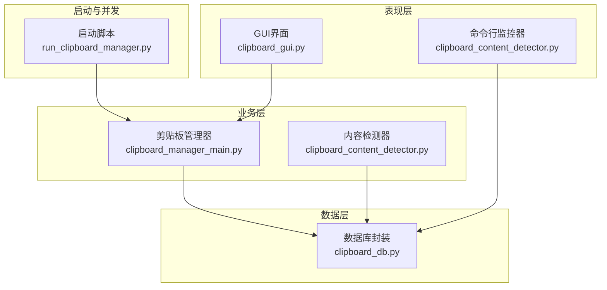
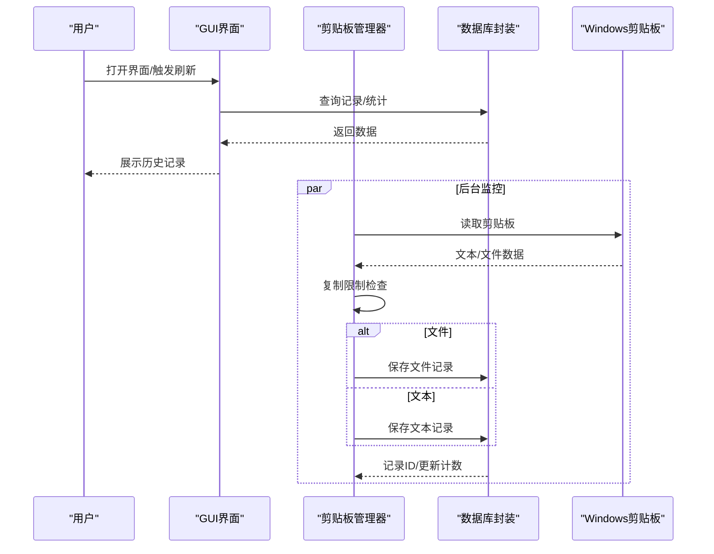
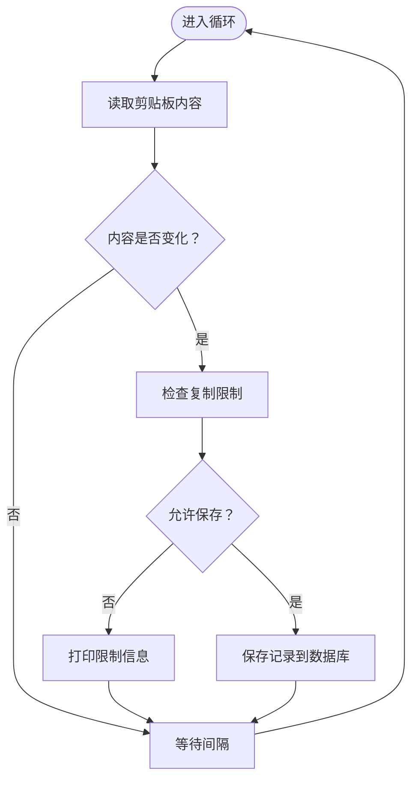
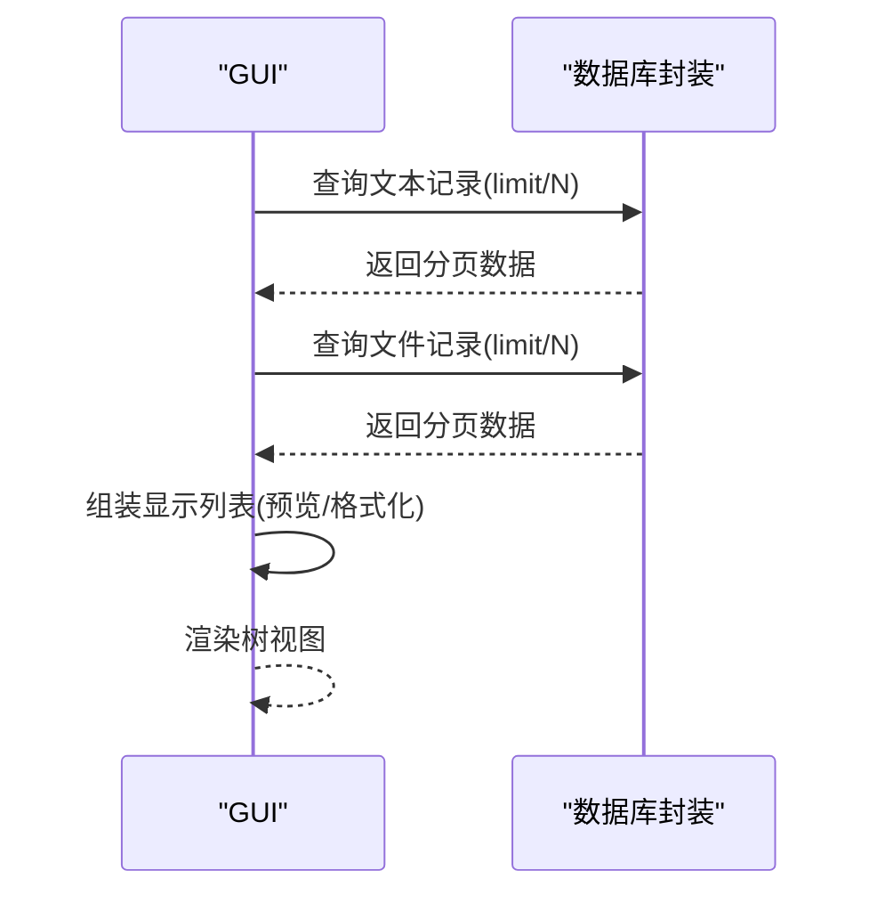
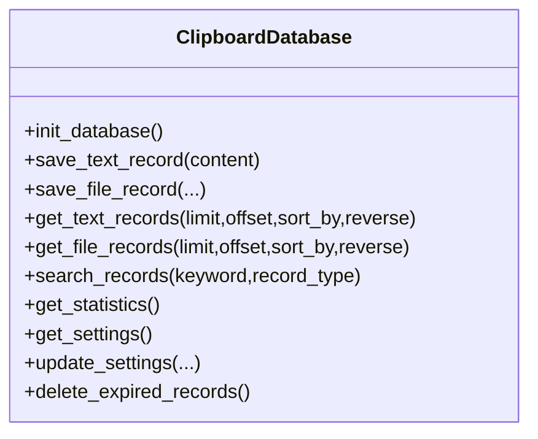
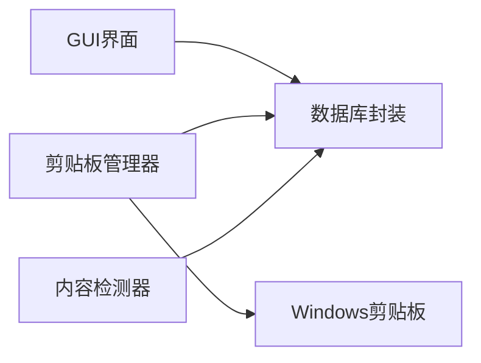

# 性能与资源占用问题

<cite>
**本文引用的文件**
- [clipboard_manager_main.py](file://clipboard_manager_main.py)
- [clipboard_gui.py](file://clipboard_gui.py)
- [clipboard_db.py](file://clipboard_db.py)
- [clipboard_content_detector.py](file://clipboard_content_detector.py)
- [run_clipboard_manager.py](file://run_clipboard_manager.py)
- [view_clipboard_history.py](file://view_clipboard_history.py)
- [check_db.py](file://check_db.py)
- [cleanup_duplicates.py](file://cleanup_duplicates.py)
- [check_indexes.py](file://check_indexes.py)
- [debug_md5.py](file://debug_md5.py)
</cite>

## 目录
1. [简介](#简介)
2. [项目结构](#项目结构)
3. [核心组件](#核心组件)
4. [架构总览](#架构总览)
5. [详细组件分析](#详细组件分析)
6. [依赖关系分析](#依赖关系分析)
7. [性能考量](#性能考量)
8. [故障排查指南](#故障排查指南)
9. [结论](#结论)
10. [附录](#附录)

## 简介
本文件聚焦于本项目的性能与资源占用问题，围绕以下目标展开：
- 分析可能导致高CPU或内存使用的原因，如监控循环间隔过短、数据库查询效率低下、GUI更新过于频繁等。
- 解释 monitor_clipboard_loop 中时间间隔参数的影响，以及 load_records 等方法对性能的作用。
- 提供诊断工具与优化建议，包括调整监控间隔、优化SQL查询、启用懒加载、限制历史记录数量等。
- 强调资源释放的最佳实践，如及时关闭数据库连接、清理缓存数据。

## 项目结构
该项目采用“功能模块化 + GUI入口”的组织方式，核心职责划分如下：
- 数据层：负责SQLite数据库初始化、记录增删改查、统计与设置管理。
- 业务层：负责剪贴板内容检测、去重计数、文件分类与保存、复制限制校验。
- 表现层：提供命令行监控器与GUI界面，支持历史记录浏览、搜索、统计与设置。
- 启动与并发：通过线程实现后台监控，避免阻塞GUI主线程。

图表来源
- [clipboard_manager_main.py](file://clipboard_manager_main.py#L355-L761)
- [clipboard_gui.py](file://clipboard_gui.py#L1-L200)
- [clipboard_db.py](file://clipboard_db.py#L1-L120)
- [clipboard_content_detector.py](file://clipboard_content_detector.py#L1-L120)
- [run_clipboard_manager.py](file://run_clipboard_manager.py#L1-L71)

章节来源
- [clipboard_manager_main.py](file://clipboard_manager_main.py#L1-L120)
- [clipboard_gui.py](file://clipboard_gui.py#L1-L120)
- [clipboard_db.py](file://clipboard_db.py#L1-L120)
- [clipboard_content_detector.py](file://clipboard_content_detector.py#L1-L120)
- [run_clipboard_manager.py](file://run_clipboard_manager.py#L1-L71)

## 核心组件
- 剪贴板监控循环 monitor_clipboard_loop：以固定间隔轮询剪贴板变化，调用业务层处理逻辑。
- 剪贴板管理器 ClipboardManager：封装剪贴板读取、复制限制检查、文件MD5计算与保存、文本记录保存。
- 数据库封装 ClipboardDatabase：提供初始化、增删改查、统计、设置与过期清理等能力。
- GUI界面 ClipboardGUIMain/ClipboardGUI：提供记录浏览、搜索、统计与设置，支持线程安全的后台更新。
- 内容检测器 clipboard_content_detector：独立CLI工具，用于调试与监控剪贴板格式与内容。

章节来源
- [clipboard_manager_main.py](file://clipboard_manager_main.py#L717-L761)
- [clipboard_manager_main.py](file://clipboard_manager_main.py#L355-L520)
- [clipboard_db.py](file://clipboard_db.py#L1-L120)
- [clipboard_gui.py](file://clipboard_gui.py#L1-L120)
- [clipboard_content_detector.py](file://clipboard_content_detector.py#L1-L120)

## 架构总览

图表来源
- [clipboard_manager_main.py](file://clipboard_manager_main.py#L395-L496)
- [clipboard_manager_main.py](file://clipboard_manager_main.py#L112-L180)
- [clipboard_db.py](file://clipboard_db.py#L116-L184)
- [clipboard_gui.py](file://clipboard_gui.py#L581-L626)

## 详细组件分析

### 组件A：剪贴板监控循环 monitor_clipboard_loop
- 影响因素
  - 时间间隔 interval：越短，CPU占用越高；越长，响应延迟越大。
  - 调用频率：每次循环都会执行剪贴板读取与数据库写入，频繁调用会放大IO与CPU压力。
  - 并发模型：GUI与监控分别在不同线程运行，但共享数据库连接，需注意连接竞争与锁争用。
- 性能特征
  - 循环内调用 process_clipboard_content，内部包含剪贴板读取、文件MD5计算、数据库事务等，属于CPU与IO混合负载。
  - 默认间隔为1秒，可通过命令行参数调整。
- 优化建议
  - 合理增大间隔（例如2-5秒），在交互体验与资源占用之间取得平衡。
  - 在GUI侧也应限制刷新频率，避免频繁重建树视图导致内存抖动。

图表来源
- [clipboard_manager_main.py](file://clipboard_manager_main.py#L717-L730)
- [clipboard_manager_main.py](file://clipboard_manager_main.py#L395-L496)

章节来源
- [clipboard_manager_main.py](file://clipboard_manager_main.py#L717-L761)

### 组件B：GUI记录加载 load_records/load_all_records
- 影响因素
  - 列表项数量：一次性加载所有记录会导致内存占用飙升与渲染卡顿。
  - 排序与预览：对文本内容进行截断与格式化，可能产生额外字符串处理开销。
  - 数据库查询：未分页查询所有记录，排序字段与LIMIT/OFFSET缺失，易引发全表扫描。
- 性能特征
  - GUI侧在加载时会清空旧项并重建，频繁刷新会带来内存抖动与GC压力。
  - 搜索与统计同样涉及多次数据库查询，若无索引或LIMIT约束，查询成本较高。
- 优化建议
  - 实施分页加载与懒加载策略，按需加载，避免一次性渲染大量节点。
  - 为常用查询字段建立索引，并在查询中加入LIMIT/OFFSET。
  - 缓存最近N条记录的预览，减少重复计算与字符串拼接。

图表来源
- [clipboard_gui.py](file://clipboard_gui.py#L581-L626)
- [clipboard_db.py](file://clipboard_db.py#L185-L261)

章节来源
- [clipboard_gui.py](file://clipboard_gui.py#L581-L626)
- [clipboard_db.py](file://clipboard_db.py#L185-L261)

### 组件C：数据库封装 ClipboardDatabase
- 影响因素
  - 事务与连接：每个操作均新建连接并关闭，频繁连接/断开会带来额外开销。
  - 唯一性约束与冲突处理：MD5冲突时走UPDATE并查询ID，存在额外查询成本。
  - 查询模式：多处使用ORDER BY DESC且未限制LIMIT，易造成全表扫描。
  - 索引缺失：未显式创建全文检索或复合索引，影响搜索与统计性能。
- 性能特征
  - 文本记录保存：INSERT冲突走UPDATE，查询ID，整体为O(1)但存在多次往返。
  - 文件记录保存：INSERT冲突走UPDATE，查询ID，成本与文本类似。
  - 统计查询：COUNT/SUM为聚合查询，但缺少WHERE条件与索引时仍较慢。
- 优化建议
  - 为常用查询字段（如timestamp、md5_hash、file_type、file_size）建立索引。
  - 在GUI侧查询时强制LIMIT，避免全表扫描。
  - 考虑连接池或复用连接，减少连接开销（需谨慎处理并发）。
  - 对高频统计场景引入缓存，定期更新而非每次查询都计算。

图表来源
- [clipboard_db.py](file://clipboard_db.py#L1-L120)
- [clipboard_db.py](file://clipboard_db.py#L185-L332)

章节来源
- [clipboard_db.py](file://clipboard_db.py#L1-L120)
- [clipboard_db.py](file://clipboard_db.py#L185-L332)

### 组件D：内容检测器 clipboard_content_detector
- 影响因素
  - 监控间隔：CLI模式下同样受间隔控制，过短会拉高CPU。
  - 格式枚举：枚举剪贴板格式可能带来额外开销，建议仅在调试时使用。
  - 自动保存：预留自动保存逻辑，实际保存会引入磁盘IO与数据库写入。
- 优化建议
  - CLI模式下适当增大间隔，避免干扰系统。
  - 仅在必要时进行格式枚举与显示，减少输出噪声。

章节来源
- [clipboard_content_detector.py](file://clipboard_content_detector.py#L1-L120)
- [clipboard_content_detector.py](file://clipboard_content_detector.py#L218-L273)

## 依赖关系分析
- 组件耦合
  - GUI与管理器通过数据库封装解耦，但两者均直接创建连接，存在潜在竞争。
  - 监控线程与GUI线程共享数据库，需避免同时进行大量写入。
- 外部依赖
  - Windows剪贴板API、SQLite、PIL（GUI托盘图标）、pystray（系统托盘）。
- 潜在风险
  - 缺少索引导致查询缓慢。
  - GUI一次性加载所有记录，内存与渲染压力大。
  - 频繁连接/断开数据库，事务成本高。

图表来源
- [clipboard_manager_main.py](file://clipboard_manager_main.py#L355-L496)
- [clipboard_gui.py](file://clipboard_gui.py#L1-L120)
- [clipboard_db.py](file://clipboard_db.py#L1-L120)
- [clipboard_content_detector.py](file://clipboard_content_detector.py#L1-L120)

章节来源
- [clipboard_manager_main.py](file://clipboard_manager_main.py#L355-L496)
- [clipboard_gui.py](file://clipboard_gui.py#L1-L120)
- [clipboard_db.py](file://clipboard_db.py#L1-L120)
- [clipboard_content_detector.py](file://clipboard_content_detector.py#L1-L120)

## 性能考量
- 监控循环间隔
  - monitor_clipboard_loop 的 interval 参数直接影响CPU占用与响应延迟。建议默认2-5秒，GUI侧刷新也应限频。
- 数据库查询效率
  - 多处未限制LIMIT或未建立索引，易导致全表扫描。应在GUI查询与统计中强制LIMIT，并为常用字段建立索引。
- GUI更新频率
  - load_records/load_all_records一次性清空并重建树视图，建议改为增量更新与懒加载。
- 资源释放
  - 数据库连接在每次操作后立即关闭，这是正确的做法。但GUI侧频繁创建/销毁控件与字符串对象，需优化内存分配与回收。

章节来源
- [clipboard_manager_main.py](file://clipboard_manager_main.py#L717-L761)
- [clipboard_gui.py](file://clipboard_gui.py#L581-L626)
- [clipboard_db.py](file://clipboard_db.py#L185-L332)

## 故障排查指南
- 使用内置性能分析器
  - Python内置的 cProfile 或 pstats 可用于定位热点函数。可在GUI入口或监控循环入口处添加性能采样，观察数据库查询、字符串处理与文件IO的耗时占比。
- 监控线程状态
  - 确认监控线程是否正常运行（daemon=True），避免主线程退出导致监控中断。
- 测量数据库查询时间
  - 在关键查询前后打点计时，评估LIMIT与索引带来的收益。
  - 使用 check_db.py/cleanup_duplicates.py/check_indexes.py 等辅助脚本验证数据库状态与索引情况。
- 调试MD5与重复记录
  - 使用 debug_md5.py 验证MD5计算与去重计数逻辑，确认是否存在异常重复导致的写入膨胀。
- GUI卡顿与内存占用
  - 观察load_records是否一次性加载过多记录；必要时引入分页与懒加载。
  - 减少不必要的字符串拼接与格式化，避免频繁创建临时对象。

章节来源
- [check_db.py](file://check_db.py#L1-L31)
- [cleanup_duplicates.py](file://cleanup_duplicates.py#L1-L67)
- [check_indexes.py](file://check_indexes.py#L1-L27)
- [debug_md5.py](file://debug_md5.py#L1-L56)
- [clipboard_gui.py](file://clipboard_gui.py#L581-L626)

## 结论
本项目在功能上较为完整，但在性能与资源占用方面仍有较大优化空间。建议优先实施以下措施：
- 调整监控间隔至2-5秒，降低CPU占用。
- 为常用查询字段建立索引，强制LIMIT，避免全表扫描。
- 实施GUI分页与懒加载，减少一次性渲染与内存压力。
- 优化数据库连接与事务，减少连接开销。
- 引入缓存与统计预计算，降低高频查询成本。
- 完善资源释放与内存管理，避免泄漏与抖动。

## 附录
- 常用诊断脚本
  - [view_clipboard_history.py](file://view_clipboard_history.py#L1-L75)：快速查看历史记录与统计。
  - [check_db.py](file://check_db.py#L1-L31)：检查MD5与重复记录。
  - [cleanup_duplicates.py](file://cleanup_duplicates.py#L1-L67)：清理重复MD5记录。
  - [check_indexes.py](file://check_indexes.py#L1-L27)：检查数据库索引。
  - [debug_md5.py](file://debug_md5.py#L1-L56)：调试文本MD5功能。
- 启动与并发
  - [run_clipboard_manager.py](file://run_clipboard_manager.py#L1-L71)：防止重复运行并隐藏主窗口，仅保留系统托盘。
  - [clipboard_manager_main.py](file://clipboard_manager_main.py#L717-L761)：监控循环与GUI入口。