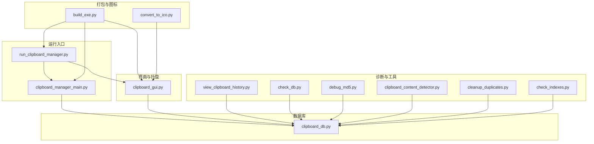
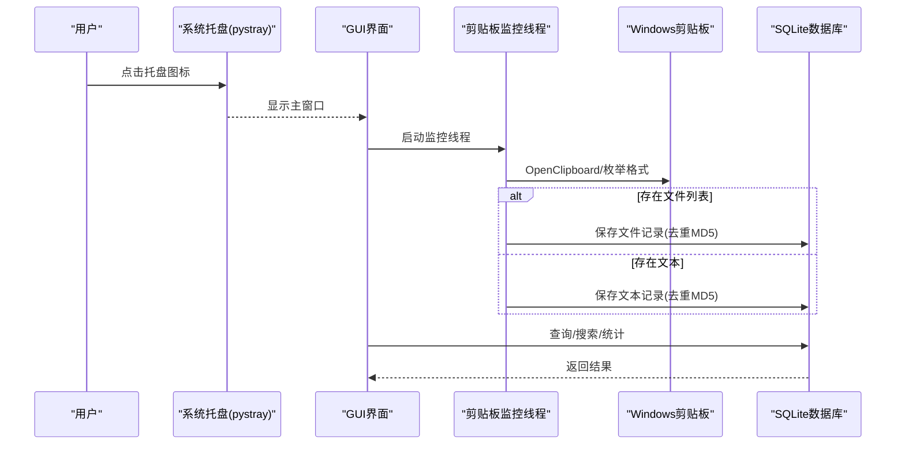
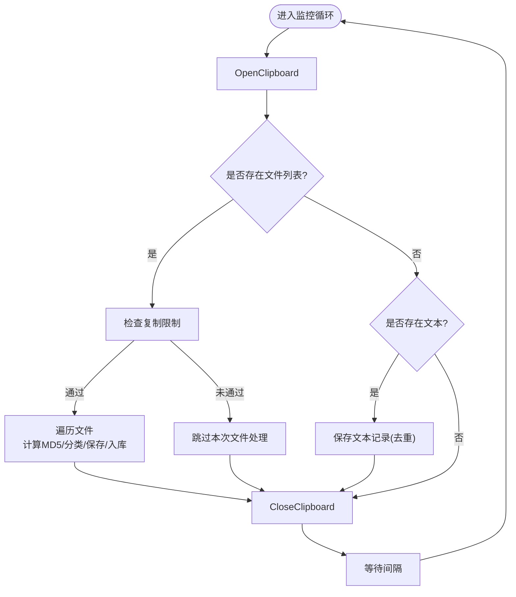
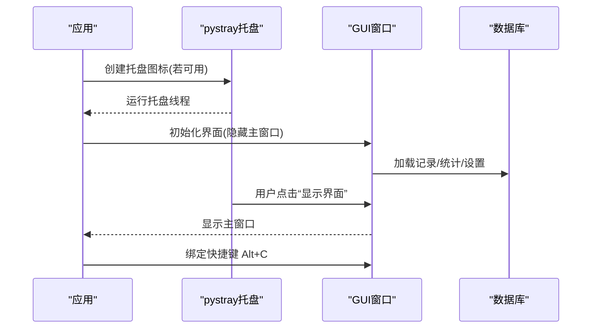
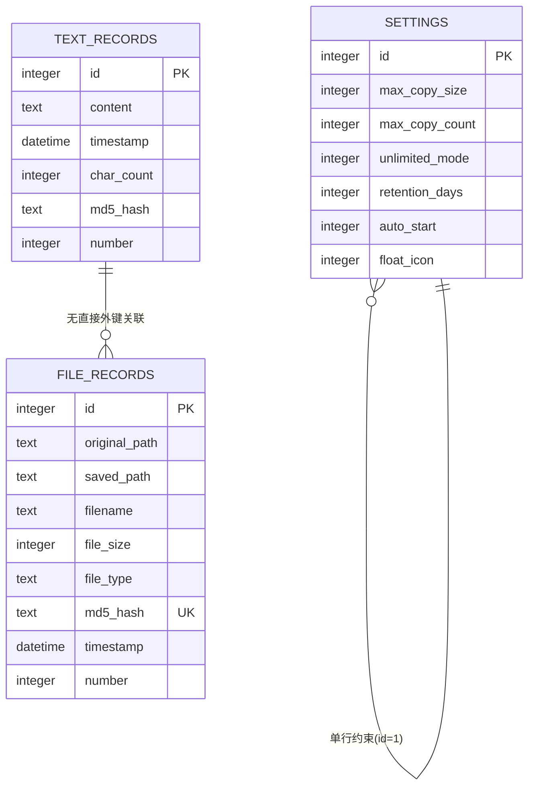
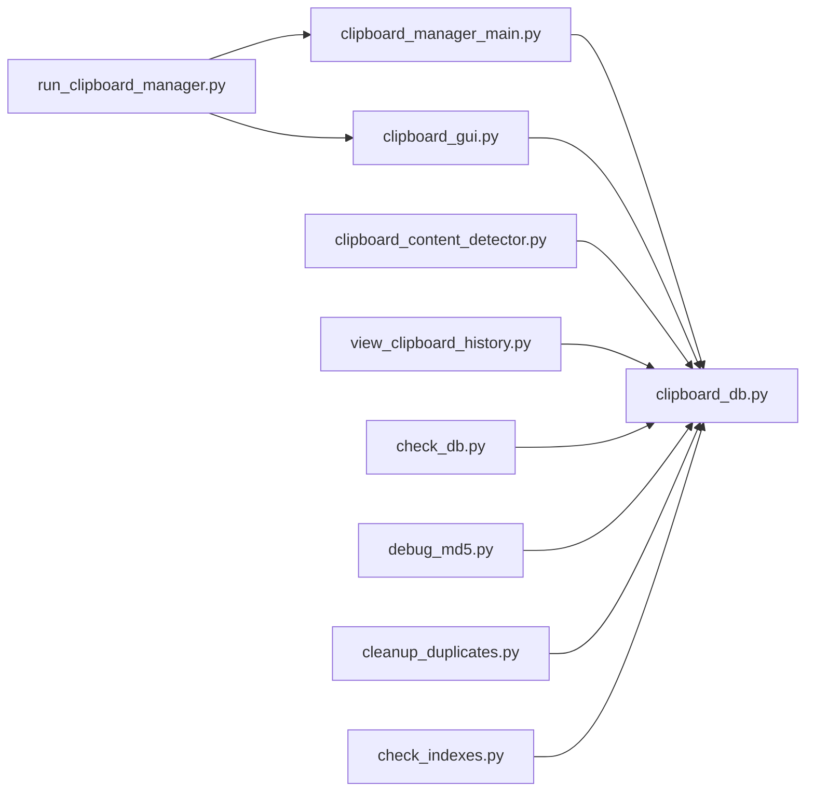

# 故障排除

<cite>
**本文引用的文件**
- [clipboard_manager_main.py](file://clipboard_manager_main.py)
- [clipboard_gui.py](file://clipboard_gui.py)
- [clipboard_db.py](file://clipboard_db.py)
- [run_clipboard_manager.py](file://run_clipboard_manager.py)
- [clipboard_content_detector.py](file://clipboard_content_detector.py)
- [view_clipboard_history.py](file://view_clipboard_history.py)
- [check_db.py](file://check_db.py)
- [debug_md5.py](file://debug_md5.py)
- [cleanup_duplicates.py](file://cleanup_duplicates.py)
- [check_indexes.py](file://check_indexes.py)
- [build_exe.py](file://build_exe.py)
- [convert_to_ico.py](file://convert_to_ico.py)
</cite>

## 目录
1. [简介](#简介)
2. [项目结构](#项目结构)
3. [核心组件](#核心组件)
4. [架构总览](#架构总览)
5. [详细组件分析](#详细组件分析)
6. [依赖关系分析](#依赖关系分析)
7. [性能考虑](#性能考虑)
8. [故障排除指南](#故障排除指南)
9. [结论](#结论)
10. [附录](#附录)

## 简介
本指南面向使用“剪贴板历史记录管理器”的用户与维护者，聚焦于常见问题的诊断与修复流程，涵盖程序无法启动（缺少依赖）、剪贴板监控失效（权限/异常）、数据库锁定错误（并发访问）、系统托盘图标不显示（pystray兼容性）、悬浮图标错位（DPI缩放问题）等场景。同时提供基于仓库内工具的诊断步骤与恢复策略，并给出调试技巧与资源占用排查建议。

## 项目结构
该项目采用模块化设计，主要由以下模块组成：
- 主程序与监控：clipboard_manager_main.py
- GUI与托盘：clipboard_gui.py、run_clipboard_manager.py
- 数据库层：clipboard_db.py
- 辅助诊断与工具：check_db.py、debug_md5.py、view_clipboard_history.py、clipboard_content_detector.py、cleanup_duplicates.py、check_indexes.py
- 打包与图标：build_exe.py、convert_to_ico.py

图表来源
- [run_clipboard_manager.py](file://run_clipboard_manager.py#L1-L71)
- [clipboard_manager_main.py](file://clipboard_manager_main.py#L1-L120)
- [clipboard_gui.py](file://clipboard_gui.py#L1-L120)
- [clipboard_db.py](file://clipboard_db.py#L1-L120)
- [view_clipboard_history.py](file://view_clipboard_history.py#L1-L75)
- [check_db.py](file://check_db.py#L1-L31)
- [debug_md5.py](file://debug_md5.py#L1-L56)
- [clipboard_content_detector.py](file://clipboard_content_detector.py#L1-L120)
- [cleanup_duplicates.py](file://cleanup_duplicates.py#L1-L67)
- [check_indexes.py](file://check_indexes.py#L1-L27)
- [build_exe.py](file://build_exe.py#L1-L81)
- [convert_to_ico.py](file://convert_to_ico.py#L1-L48)

章节来源
- [clipboard_manager_main.py](file://clipboard_manager_main.py#L1-L120)
- [clipboard_gui.py](file://clipboard_gui.py#L1-L120)
- [clipboard_db.py](file://clipboard_db.py#L1-L120)
- [run_clipboard_manager.py](file://run_clipboard_manager.py#L1-L71)

## 核心组件
- 剪贴板监控与处理：负责周期性读取剪贴板，区分文本与文件，计算MD5避免重复，写入数据库。
- GUI与托盘：提供界面、托盘图标、悬浮图标、设置项（复制限制、开机自启、悬浮图标开关、记录保留天数等）。
- 数据库层：统一管理SQLite表结构、索引、设置项与记录增删改查。
- 诊断与工具：独立脚本用于查看历史、检查数据库一致性、调试MD5、检测剪贴板格式、清理重复MD5、检查索引。

章节来源
- [clipboard_manager_main.py](file://clipboard_manager_main.py#L355-L761)
- [clipboard_gui.py](file://clipboard_gui.py#L1-L200)
- [clipboard_db.py](file://clipboard_db.py#L1-L200)
- [clipboard_content_detector.py](file://clipboard_content_detector.py#L1-L120)

## 架构总览

图表来源
- [run_clipboard_manager.py](file://run_clipboard_manager.py#L32-L70)
- [clipboard_manager_main.py](file://clipboard_manager_main.py#L395-L496)
- [clipboard_gui.py](file://clipboard_gui.py#L144-L171)
- [clipboard_db.py](file://clipboard_db.py#L116-L183)

## 详细组件分析

### 组件A：剪贴板监控与处理
- 功能要点
  - 周期性读取剪贴板，识别文本与文件。
  - 文件：计算MD5，按类型与日期归档，避免重复保存。
  - 文本：计算MD5，避免重复保存，计数累加。
  - 限制：复制数量与大小限制，支持无限模式。
- 关键路径
  - 监控循环：clipboard_manager_main.py 中的 monitor_clipboard_loop。
  - 处理逻辑：process_clipboard_content。
  - 限制检查：check_copy_limits。
  - 数据库写入：save_text_record/save_file_record。
- 错误处理
  - 剪贴板访问异常会捕获并打印，但不中断监控循环。
  - 关闭剪贴板时的异常被忽略，避免影响主流程。

图表来源
- [clipboard_manager_main.py](file://clipboard_manager_main.py#L395-L496)
- [clipboard_manager_main.py](file://clipboard_manager_main.py#L362-L394)
- [clipboard_db.py](file://clipboard_db.py#L116-L183)

章节来源
- [clipboard_manager_main.py](file://clipboard_manager_main.py#L355-L496)
- [clipboard_manager_main.py](file://clipboard_manager_main.py#L362-L394)
- [clipboard_db.py](file://clipboard_db.py#L116-L183)

### 组件B：GUI与托盘
- 功能要点
  - 系统托盘：使用pystray创建图标，菜单含“显示界面/退出”。
  - 界面：记录浏览、搜索、统计、设置（复制限制、开机自启、悬浮图标、记录保留天数）。
  - 快捷键：Alt+C切换窗口显示。
  - 悬浮图标：可选悬浮图标，支持透明度与拖动。
- 兼容性与DPI
  - 窗口居中与悬浮图标位置计算依赖屏幕尺寸，需关注高DPI环境下的坐标换算。
- 错误处理
  - 缺少pystray/Pillow时会降级提示，不影响主流程。

图表来源
- [run_clipboard_manager.py](file://run_clipboard_manager.py#L32-L70)
- [clipboard_gui.py](file://clipboard_gui.py#L144-L171)
- [clipboard_gui.py](file://clipboard_gui.py#L220-L226)
- [clipboard_db.py](file://clipboard_db.py#L359-L412)

章节来源
- [clipboard_gui.py](file://clipboard_gui.py#L144-L171)
- [clipboard_gui.py](file://clipboard_gui.py#L220-L226)
- [run_clipboard_manager.py](file://run_clipboard_manager.py#L32-L70)

### 组件C：数据库层
- 表结构与索引
  - text_records：内容、时间戳、字符数、md5_hash、number。
  - file_records：原路径、保存路径、文件名、大小、类型、md5_hash、时间戳、number。
  - settings：复制限制、无限模式、记录保留天数、开机自启、悬浮图标。
- 去重与计数
  - 通过md5_hash唯一约束与number字段实现重复内容计数累加。
- 诊断工具
  - check_db.py：查看最近带MD5记录与重复MD5。
  - cleanup_duplicates.py：合并重复MD5记录并累加计数。
  - check_indexes.py：检查索引是否存在。

图表来源
- [clipboard_db.py](file://clipboard_db.py#L18-L115)
- [clipboard_db.py](file://clipboard_db.py#L116-L183)
- [clipboard_db.py](file://clipboard_db.py#L359-L412)

章节来源
- [clipboard_db.py](file://clipboard_db.py#L18-L115)
- [clipboard_db.py](file://clipboard_db.py#L116-L183)
- [clipboard_db.py](file://clipboard_db.py#L359-L412)
- [check_db.py](file://check_db.py#L1-L31)
- [cleanup_duplicates.py](file://cleanup_duplicates.py#L1-L67)
- [check_indexes.py](file://check_indexes.py#L1-L27)

## 依赖关系分析
- 运行时依赖
  - Python标准库：sqlite3、hashlib、os、time、threading、tkinter、win32clipboard、win32con。
  - 可选依赖：pystray、Pillow（托盘与图标）、cx_Freeze（打包）。
- 模块间耦合
  - clipboard_manager_main.py 与 clipboard_db.py 强耦合（数据库操作）。
  - clipboard_gui.py 与 clipboard_db.py 强耦合（查询/统计/设置）。
  - run_clipboard_manager.py 与 clipboard_manager_main.py/clipboard_gui.py 协作启动托盘与监控线程。
- 潜在风险
  - 缺少pystray/Pillow会导致托盘/图标不可用。
  - SQLite并发写入可能引发锁冲突，需注意多线程写入顺序与事务粒度。

图表来源
- [clipboard_manager_main.py](file://clipboard_manager_main.py#L1-L120)
- [clipboard_gui.py](file://clipboard_gui.py#L1-L120)
- [clipboard_db.py](file://clipboard_db.py#L1-L120)
- [run_clipboard_manager.py](file://run_clipboard_manager.py#L1-L71)
- [clipboard_content_detector.py](file://clipboard_content_detector.py#L1-L120)
- [view_clipboard_history.py](file://view_clipboard_history.py#L1-L75)
- [check_db.py](file://check_db.py#L1-L31)
- [debug_md5.py](file://debug_md5.py#L1-L56)
- [cleanup_duplicates.py](file://cleanup_duplicates.py#L1-L67)
- [check_indexes.py](file://check_indexes.py#L1-L27)

## 性能考虑
- 监控频率：默认1秒一次，可根据CPU占用调整。
- 数据库写入：批量写入建议使用事务封装，减少磁盘IO。
- GUI刷新：树形视图一次性加载所有记录，建议分页或懒加载。
- 文件MD5：大文件计算耗时，建议异步或延迟计算。
- 线程安全：数据库连接应避免跨线程共享，必要时使用队列或锁。

[本节为通用指导，不直接分析具体文件]

## 故障排除指南

### 一、程序无法启动（缺少依赖）
- 现象
  - 启动即报错，提示找不到模块或库。
- 诊断步骤
  - 检查Python环境与第三方库安装情况。
  - 若使用打包版本，确认图标与依赖文件随包部署。
- 常见缺失
  - pystray、Pillow（托盘/图标）。
  - win32clipboard、win32con（剪贴板访问）。
  - cx_Freeze（打包）。
- 修复建议
  - 安装缺失依赖并重试。
  - 使用打包脚本构建可执行文件，确保包含图标与依赖。
- 相关文件
  - [build_exe.py](file://build_exe.py#L1-L81)
  - [convert_to_ico.py](file://convert_to_ico.py#L1-L48)

章节来源
- [build_exe.py](file://build_exe.py#L1-L81)
- [convert_to_ico.py](file://convert_to_ico.py#L1-L48)

### 二、剪贴板监控失效（权限/异常）
- 现象
  - 界面显示“监控已启动”，但无新增记录；或出现访问异常。
- 诊断步骤
  - 使用独立脚本检测剪贴板格式与内容。
  - 检查数据库是否正常，是否存在重复MD5导致的异常。
- 典型错误
  - “Unable to open clipboard”：通常由其他进程占用剪贴板或权限不足引起。
- 修复建议
  - 关闭占用剪贴板的应用后重试。
  - 降低监控频率，避免频繁OpenClipboard/CloseClipboard。
  - 使用独立脚本验证剪贴板内容，定位异常来源。
- 相关文件
  - [clipboard_content_detector.py](file://clipboard_content_detector.py#L1-L120)
  - [clipboard_manager_main.py](file://clipboard_manager_main.py#L395-L496)
  - [check_db.py](file://check_db.py#L1-L31)

章节来源
- [clipboard_content_detector.py](file://clipboard_content_detector.py#L1-L120)
- [clipboard_manager_main.py](file://clipboard_manager_main.py#L395-L496)
- [check_db.py](file://check_db.py#L1-L31)

### 三、数据库锁定错误（并发访问）
- 现象
  - 写入时报错或卡顿；GUI查询缓慢。
- 诊断步骤
  - 使用check_indexes.py检查索引是否存在。
  - 使用check_db.py检查重复MD5与记录数量。
- 修复建议
  - 优化写入路径，减少并发写入冲突。
  - 使用cleanup_duplicates.py清理重复MD5，降低索引压力。
  - 调整监控频率与GUI刷新策略。
- 相关文件
  - [check_indexes.py](file://check_indexes.py#L1-L27)
  - [check_db.py](file://check_db.py#L1-L31)
  - [cleanup_duplicates.py](file://cleanup_duplicates.py#L1-L67)

章节来源
- [check_indexes.py](file://check_indexes.py#L1-L27)
- [check_db.py](file://check_db.py#L1-L31)
- [cleanup_duplicates.py](file://cleanup_duplicates.py#L1-L67)

### 四、系统托盘图标不显示（pystray兼容性）
- 现象
  - 启动后看不到托盘图标。
- 诊断步骤
  - 查看控制台输出，确认是否提示安装pystray/Pillow。
  - 检查图标文件是否存在（2.ico）。
- 修复建议
  - 安装pystray与Pillow。
  - 确认图标资源路径正确。
- 相关文件
  - [clipboard_gui.py](file://clipboard_gui.py#L144-L171)
  - [convert_to_ico.py](file://convert_to_ico.py#L1-L48)

章节来源
- [clipboard_gui.py](file://clipboard_gui.py#L144-L171)
- [convert_to_ico.py](file://convert_to_ico.py#L1-L48)

### 五、悬浮图标错位（DPI缩放问题）
- 现象
  - 悬浮图标位置与预期不符，尤其在高DPI显示器上。
- 诊断步骤
  - 检查悬浮图标创建与居中逻辑是否考虑DPI缩放。
  - 确认窗口几何计算依赖的屏幕尺寸是否正确。
- 修复建议
  - 在高DPI环境下修正坐标换算逻辑。
  - 限制悬浮图标尺寸与透明度，避免遮挡。
- 相关文件
  - [clipboard_gui.py](file://clipboard_gui.py#L80-L120)

章节来源
- [clipboard_gui.py](file://clipboard_gui.py#L80-L120)

### 六、典型错误消息与含义
- Unable to open clipboard
  - 可能原因：其他进程占用剪贴板、权限不足、剪贴板处于不可访问状态。
  - 建议：关闭占用应用、以管理员权限运行、稍后再试。
- IntegrityError（重复MD5）
  - 可能原因：重复内容被检测到，触发去重逻辑。
  - 建议：使用cleanup_duplicates.py清理重复记录，或检查MD5计算逻辑。
- 数据库锁
  - 可能原因：并发写入、长时间事务未提交。
  - 建议：减少并发、缩短事务、优化索引。

章节来源
- [clipboard_manager_main.py](file://clipboard_manager_main.py#L112-L179)
- [clipboard_db.py](file://clipboard_db.py#L116-L183)
- [check_db.py](file://check_db.py#L1-L31)

### 七、调试技巧与工具
- 启用详细日志
  - 使用监控脚本查看剪贴板内容变化与格式。
  - 在主程序中适当增加日志输出，定位异常点。
- 独立验证数据
  - 使用view_clipboard_history.py查看最近记录与统计。
  - 使用debug_md5.py验证文本MD5计算与去重逻辑。
- 数据库完整性检查
  - 使用check_db.py检查重复MD5与最近记录。
  - 使用cleanup_duplicates.py清理重复MD5。
- 快速验证
  - 使用clipboard_content_detector.py检测当前剪贴板格式与内容类型。

章节来源
- [clipboard_content_detector.py](file://clipboard_content_detector.py#L1-L120)
- [view_clipboard_history.py](file://view_clipboard_history.py#L1-L75)
- [debug_md5.py](file://debug_md5.py#L1-L56)
- [check_db.py](file://check_db.py#L1-L31)
- [cleanup_duplicates.py](file://cleanup_duplicates.py#L1-L67)

### 八、资源占用过高排查
- 线程状态
  - 确认监控线程是否仍在运行且未阻塞。
  - 检查GUI线程与托盘线程是否正常。
- 内存使用
  - 减少一次性加载记录数量，改为分页或懒加载。
  - 降低悬浮图标刷新频率。
- I/O与CPU
  - 降低监控频率，避免频繁读取剪贴板。
  - 优化文件MD5计算与数据库写入路径。

章节来源
- [clipboard_manager_main.py](file://clipboard_manager_main.py#L717-L761)
- [clipboard_gui.py](file://clipboard_gui.py#L220-L226)

### 九、恢复策略
- 重置数据库
  - 清空所有记录：使用数据库层提供的清空接口或脚本。
- 重新注册快捷键
  - 确保Alt+C绑定生效，必要时重启应用。
- 重新创建托盘与悬浮图标
  - 安装pystray/Pillow后重启应用。
  - 确认图标文件存在并可访问。

章节来源
- [clipboard_db.py](file://clipboard_db.py#L350-L358)
- [clipboard_gui.py](file://clipboard_gui.py#L220-L226)
- [convert_to_ico.py](file://convert_to_ico.py#L1-L48)

### 十、联系开发者与支持渠道
- 当前仓库未提供官方联系方式，请通过项目主页或发行页获取支持信息。
- 建议在使用过程中记录日志与截图，便于问题定位与反馈。

[本节为通用指导，不直接分析具体文件]

## 结论
本指南围绕“剪贴板历史记录管理器”的常见问题提供了系统化的诊断与修复流程。通过结合仓库内的诊断脚本与工具，用户可以快速定位问题根因并采取相应措施。建议在生产环境中持续关注数据库索引与并发写入策略，合理配置监控频率与界面刷新策略，以获得更稳定的用户体验。