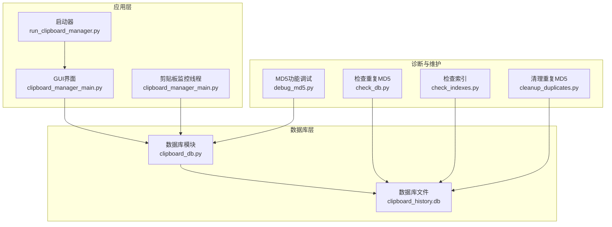
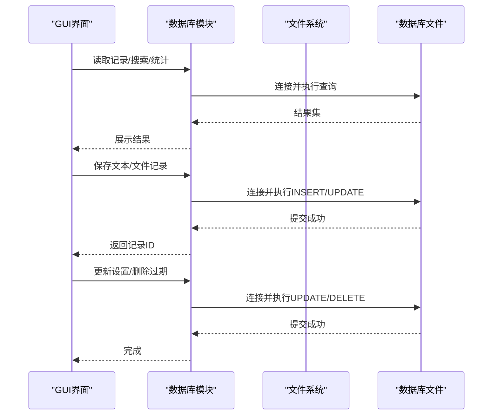
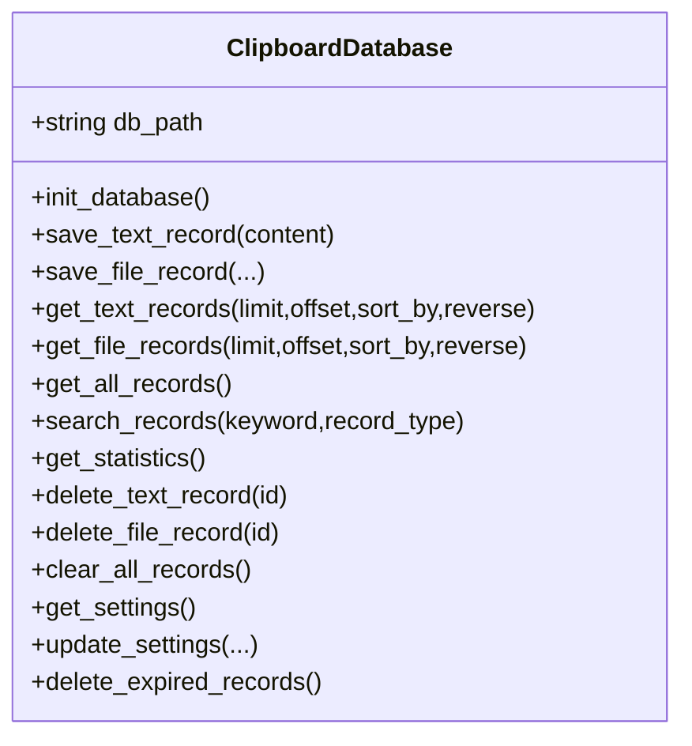
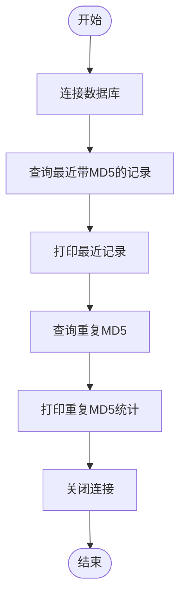
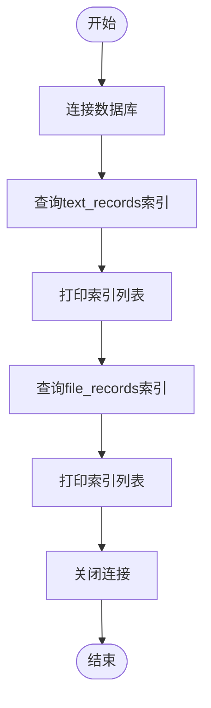
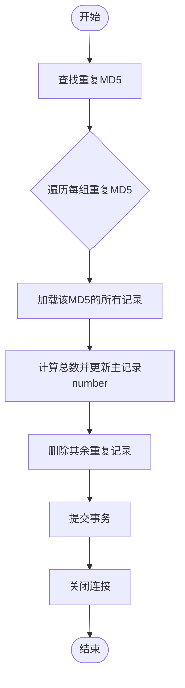
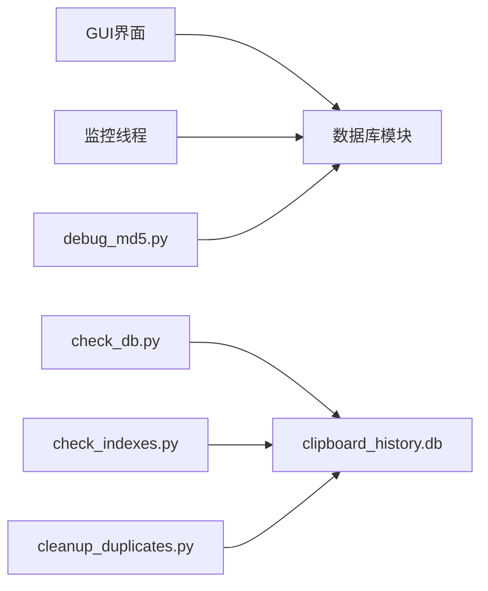

# 数据库问题

<cite>
**本文引用的文件**
- [check_db.py](file://check_db.py)
- [check_indexes.py](file://check_indexes.py)
- [clipboard_db.py](file://clipboard_db.py)
- [cleanup_duplicates.py](file://cleanup_duplicates.py)
- [debug_md5.py](file://debug_md5.py)
- [clipboard_manager_main.py](file://clipboard_manager_main.py)
- [run_clipboard_manager.py](file://run_clipboard_manager.py)
</cite>

## 目录
1. [简介](#简介)
2. [项目结构](#项目结构)
3. [核心组件](#核心组件)
4. [架构总览](#架构总览)
5. [详细组件分析](#详细组件分析)
6. [依赖关系分析](#依赖关系分析)
7. [性能与并发注意事项](#性能与并发注意事项)
8. [故障排查指南](#故障排查指南)
9. [结论](#结论)
10. [附录](#附录)

## 简介
本指南聚焦于数据库相关问题的排查与修复，覆盖以下主题：
- 并发访问冲突（数据库锁定错误）
- 数据损坏与一致性问题
- 索引缺失导致的查询性能下降
- SQLite 在多线程环境下的使用限制与连接管理
- 使用 check_db.py 检查 MD5 重复记录与数据库完整性
- 使用 check_indexes.py 确保查询性能
- 正确关闭数据库连接、使用事务控制、定期维护数据库
- 恢复策略：从备份恢复或重建数据库

## 项目结构
该项目围绕剪贴板历史记录管理，采用 SQLite 作为本地存储，包含数据库初始化、写入、查询、清理、GUI 展示等模块。数据库文件为 clipboard_history.db，主要表包括 text_records、file_records、settings。

图表来源
- [clipboard_manager_main.py](file://clipboard_manager_main.py#L1-L120)
- [clipboard_db.py](file://clipboard_db.py#L1-L120)
- [check_db.py](file://check_db.py#L1-L31)
- [check_indexes.py](file://check_indexes.py#L1-L27)
- [cleanup_duplicates.py](file://cleanup_duplicates.py#L1-L67)
- [debug_md5.py](file://debug_md5.py#L1-L56)
- [run_clipboard_manager.py](file://run_clipboard_manager.py#L1-L71)

章节来源
- [clipboard_manager_main.py](file://clipboard_manager_main.py#L1-L120)
- [clipboard_db.py](file://clipboard_db.py#L1-L120)
- [check_db.py](file://check_db.py#L1-L31)
- [check_indexes.py](file://check_indexes.py#L1-L27)
- [cleanup_duplicates.py](file://cleanup_duplicates.py#L1-L67)
- [debug_md5.py](file://debug_md5.py#L1-L56)
- [run_clipboard_manager.py](file://run_clipboard_manager.py#L1-L71)

## 核心组件
- 数据库模块（clipboard_db.py）：封装数据库初始化、表结构、插入/更新/查询/删除、统计、设置、过期清理等逻辑；提供统一的连接生命周期管理（每个操作独立 connect/close）。
- 诊断与维护脚本：
  - check_db.py：检查最近带 MD5 的记录与重复 MD5。
  - check_indexes.py：列出 text_records 与 file_records 的索引。
  - cleanup_duplicates.py：合并重复 MD5 记录并去重。
  - debug_md5.py：验证 MD5 去重与计数逻辑。
- 应用入口与监控：
  - clipboard_manager_main.py：包含完整的数据库类与 GUI、监控循环。
  - run_clipboard_manager.py：系统托盘/多实例保护与线程启动。

章节来源
- [clipboard_db.py](file://clipboard_db.py#L1-L120)
- [clipboard_manager_main.py](file://clipboard_manager_main.py#L1-L120)
- [check_db.py](file://check_db.py#L1-L31)
- [check_indexes.py](file://check_indexes.py#L1-L27)
- [cleanup_duplicates.py](file://cleanup_duplicates.py#L1-L67)
- [debug_md5.py](file://debug_md5.py#L1-L56)
- [run_clipboard_manager.py](file://run_clipboard_manager.py#L1-L71)

## 架构总览
应用通过 GUI 和后台监控线程向数据库模块发起请求，数据库模块负责连接、执行 SQL、提交事务并关闭连接。诊断脚本独立于主流程，用于离线检查数据库健康状况。

图表来源
- [clipboard_manager_main.py](file://clipboard_manager_main.py#L181-L343)
- [clipboard_db.py](file://clipboard_db.py#L116-L183)
- [clipboard_db.py](file://clipboard_db.py#L387-L412)
- [clipboard_db.py](file://clipboard_db.py#L413-L455)

## 详细组件分析

### 数据库模块（clipboard_db.py）分析
- 表结构与约束
  - text_records：包含 content、timestamp、char_count、md5_hash、number 等字段；md5_hash 为可选唯一索引（非空时唯一）。
  - file_records：包含 original_path、saved_path、filename、file_size、file_type、md5_hash、timestamp、number 等字段；md5_hash 唯一。
  - settings：包含 max_copy_size、max_copy_count、unlimited_mode、retention_days、auto_start、float_icon 等配置项。
- 写入与去重
  - 保存文本/文件记录时计算 MD5，若唯一约束冲突，则更新 timestamp 与 number，避免重复写入。
- 查询与统计
  - 支持按多种字段排序与分页查询；提供统计接口。
- 设置与过期清理
  - 支持更新设置；当 retention_days > 0 时，按时间阈值删除过期记录，并删除对应文件。
- 连接管理
  - 每个数据库操作均独立 connect/close，未使用连接池或全局共享连接。

图表来源
- [clipboard_db.py](file://clipboard_db.py#L1-L120)
- [clipboard_db.py](file://clipboard_db.py#L116-L183)
- [clipboard_db.py](file://clipboard_db.py#L185-L358)
- [clipboard_db.py](file://clipboard_db.py#L359-L412)
- [clipboard_db.py](file://clipboard_db.py#L413-L455)

章节来源
- [clipboard_db.py](file://clipboard_db.py#L1-L120)
- [clipboard_db.py](file://clipboard_db.py#L116-L183)
- [clipboard_db.py](file://clipboard_db.py#L185-L358)
- [clipboard_db.py](file://clipboard_db.py#L359-L412)
- [clipboard_db.py](file://clipboard_db.py#L413-L455)

### 诊断脚本：check_db.py
- 功能：查询最近带 MD5 的记录；统计重复 MD5 的组数与数量。
- 使用场景：快速定位重复数据、评估去重效果。
- 注意事项：该脚本独立于主流程，适合离线检查。

图表来源
- [check_db.py](file://check_db.py#L1-L31)

章节来源
- [check_db.py](file://check_db.py#L1-L31)

### 诊断脚本：check_indexes.py
- 功能：列出 text_records 与 file_records 的索引名称。
- 使用场景：确认是否缺少关键索引，以优化查询性能。

图表来源
- [check_indexes.py](file://check_indexes.py#L1-L27)

章节来源
- [check_indexes.py](file://check_indexes.py#L1-L27)

### 维护脚本：cleanup_duplicates.py
- 功能：查找重复 MD5，保留最新记录并合并 number，删除其余重复记录。
- 使用场景：修复历史数据中的重复条目，保持去重逻辑一致。

图表来源
- [cleanup_duplicates.py](file://cleanup_duplicates.py#L1-L67)

章节来源
- [cleanup_duplicates.py](file://cleanup_duplicates.py#L1-L67)

### 调试脚本：debug_md5.py
- 功能：演示相同文本多次保存时的 MD5 去重与计数行为。
- 使用场景：验证数据库模块的去重逻辑是否符合预期。

章节来源
- [debug_md5.py](file://debug_md5.py#L1-L56)

### 应用入口与监控：clipboard_manager_main.py、run_clipboard_manager.py
- clipboard_manager_main.py：包含完整的数据库类、GUI、剪贴板监控循环；监控线程与 GUI 线程并行运行。
- run_clipboard_manager.py：多实例保护、系统托盘运行、后台监控线程启动。

章节来源
- [clipboard_manager_main.py](file://clipboard_manager_main.py#L1-L120)
- [clipboard_manager_main.py](file://clipboard_manager_main.py#L355-L761)
- [run_clipboard_manager.py](file://run_clipboard_manager.py#L1-L71)

## 依赖关系分析
- 数据库模块被 GUI 与监控线程共同依赖，形成“读写分离”的典型模式。
- 诊断与维护脚本与主流程解耦，便于离线维护。
- 过期清理依赖设置表中的 retention_days 字段。

图表来源
- [clipboard_manager_main.py](file://clipboard_manager_main.py#L181-L343)
- [clipboard_db.py](file://clipboard_db.py#L116-L183)
- [check_db.py](file://check_db.py#L1-L31)
- [check_indexes.py](file://check_indexes.py#L1-L27)
- [cleanup_duplicates.py](file://cleanup_duplicates.py#L1-L67)
- [debug_md5.py](file://debug_md5.py#L1-L56)

章节来源
- [clipboard_manager_main.py](file://clipboard_manager_main.py#L181-L343)
- [clipboard_db.py](file://clipboard_db.py#L116-L183)
- [check_db.py](file://check_db.py#L1-L31)
- [check_indexes.py](file://check_indexes.py#L1-L27)
- [cleanup_duplicates.py](file://cleanup_duplicates.py#L1-L67)
- [debug_md5.py](file://debug_md5.py#L1-L56)

## 性能与并发注意事项
- SQLite 并发限制
  - SQLite 在同一时刻仅允许一个写入者；多个写入者会触发锁等待或报错。
  - 本项目中每个数据库操作均独立 connect/close，避免长时间持有连接，降低锁竞争概率。
- 连接管理建议
  - 保持短连接：每个操作完成后立即 close，减少锁持有时间。
  - 避免跨线程共享连接：不同线程各自建立连接，防止并发写入冲突。
- 索引优化
  - 当前 text_records 对 md5_hash 的索引为“非空时唯一”，可满足去重需求。
  - 若查询频繁基于 timestamp、content、filename、file_size 等字段，建议为这些字段创建合适索引（需结合实际查询模式评估）。
- 事务控制
  - 单条写入操作已包含 commit；批量写入建议使用上下文或显式事务包裹，减少提交次数带来的开销。
- 定期维护
  - 建议定期运行 check_indexes.py 检查索引完整性。
  - 使用 cleanup_duplicates.py 合并重复记录，保持数据整洁。
  - 使用 check_db.py 检查重复 MD5，评估去重策略有效性。

[本节为通用指导，无需特定文件来源]

## 故障排查指南

### 1. 并发访问冲突（数据库锁定错误）
- 症状
  - 写入时报错或阻塞；读取缓慢。
- 排查步骤
  - 确认是否存在多个线程/进程同时写入同一张表。
  - 检查是否在同一线程内复用连接进行并发写入。
- 解决方案
  - 保持短连接：每个操作后立即关闭连接。
  - 避免跨线程共享连接：不同线程各自建立连接。
  - 将高频写入合并为批处理，减少提交次数。
  - 如需高并发写入，考虑引入队列或锁协调写入顺序。

章节来源
- [clipboard_db.py](file://clipboard_db.py#L116-L183)
- [clipboard_db.py](file://clipboard_db.py#L185-L358)

### 2. 数据损坏
- 症状
  - 查询异常、数据不一致、完整性约束失败。
- 排查步骤
  - 使用 check_db.py 检查重复 MD5 与最近记录，定位异常数据。
  - 检查数据库文件是否被外部程序修改或意外关闭导致损坏。
- 解决方案
  - 先备份 clipboard_history.db，再执行 cleanup_duplicates.py 合并重复记录。
  - 如仍异常，尝试重建数据库（见“恢复策略”）。

章节来源
- [check_db.py](file://check_db.py#L1-L31)
- [cleanup_duplicates.py](file://cleanup_duplicates.py#L1-L67)

### 3. 索引缺失导致查询慢
- 症状
  - 搜索、排序、统计等操作明显变慢。
- 排查步骤
  - 使用 check_indexes.py 列出当前索引，确认是否缺少常用字段索引。
- 解决方案
  - 根据查询模式为常用过滤/排序字段创建索引（需谨慎评估写入性能影响）。
  - 通过清理重复数据、优化查询条件减少全表扫描。

章节来源
- [check_indexes.py](file://check_indexes.py#L1-L27)

### 4. MD5 重复记录问题
- 症状
  - 同一内容出现多条记录，number 不一致。
- 排查步骤
  - 使用 check_db.py 查看重复 MD5 组。
  - 使用 debug_md5.py 验证去重逻辑。
- 解决方案
  - 使用 cleanup_duplicates.py 合并重复记录，统一 number。
  - 确保后续写入不再产生重复（由数据库唯一约束与去重逻辑保障）。

章节来源
- [check_db.py](file://check_db.py#L1-L31)
- [debug_md5.py](file://debug_md5.py#L1-L56)
- [cleanup_duplicates.py](file://cleanup_duplicates.py#L1-L67)

### 5. 正确关闭数据库连接
- 症状
  - 连接泄漏、句柄占用、最终导致无法写入。
- 排查步骤
  - 检查各数据库操作是否在异常分支也关闭连接。
- 解决方案
  - 确保每个 connect 后都有对应的 close；必要时使用 try/finally 或 with 上下文。
  - 本项目多数操作已遵循此原则，建议保持。

章节来源
- [clipboard_db.py](file://clipboard_db.py#L116-L183)
- [clipboard_db.py](file://clipboard_db.py#L185-L358)

### 6. 使用事务控制
- 建议
  - 批量写入时使用事务包裹，减少提交次数，提升吞吐。
  - 发生异常时回滚，保证一致性。

章节来源
- [clipboard_db.py](file://clipboard_db.py#L116-L183)
- [clipboard_db.py](file://clipboard_db.py#L185-L358)

### 7. 定期维护数据库
- 建议
  - 定期运行 check_indexes.py 检查索引。
  - 使用 cleanup_duplicates.py 清理重复记录。
  - 使用 check_db.py 检查重复 MD5，评估策略有效性。
  - 根据 retention_days 设置定期清理过期记录。

章节来源
- [check_indexes.py](file://check_indexes.py#L1-L27)
- [cleanup_duplicates.py](file://cleanup_duplicates.py#L1-L67)
- [check_db.py](file://check_db.py#L1-L31)
- [clipboard_db.py](file://clipboard_db.py#L413-L455)

### 8. 恢复策略
- 从备份恢复
  - 在执行重大维护前备份 clipboard_history.db。
  - 恢复时停止所有写入操作，替换数据库文件后重启应用。
- 重建数据库
  - 若数据库损坏严重且无备份，可删除 clipboard_history.db，让应用重启时自动重建表结构（注意：这会丢失历史数据）。
  - 重建后可重新导入需要的数据（如有导出机制）。

章节来源
- [clipboard_db.py](file://clipboard_db.py#L1-L120)

## 结论
- 本项目对 SQLite 的使用较为规范：每个操作独立连接与关闭，写入冲突通过 MD5 去重与唯一约束处理。
- 建议持续关注索引与查询性能，配合定期维护脚本保持数据库健康。
- 面对并发写入冲突，应坚持短连接与线程隔离的原则；必要时引入批处理与事务控制。

[本节为总结，无需特定文件来源]

## 附录

### A. 工具使用速查
- 检查重复 MD5：python check_db.py
- 检查索引：python check_indexes.py
- 清理重复 MD5：python cleanup_duplicates.py
- 调试 MD5：python debug_md5.py

章节来源
- [check_db.py](file://check_db.py#L1-L31)
- [check_indexes.py](file://check_indexes.py#L1-L27)
- [cleanup_duplicates.py](file://cleanup_duplicates.py#L1-L67)
- [debug_md5.py](file://debug_md5.py#L1-L56)