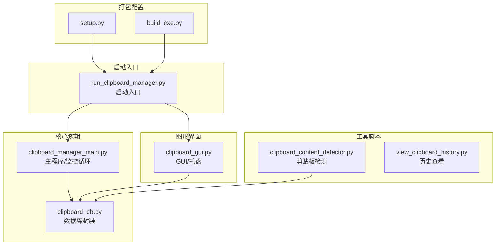
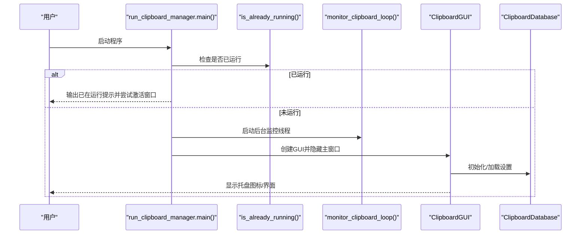
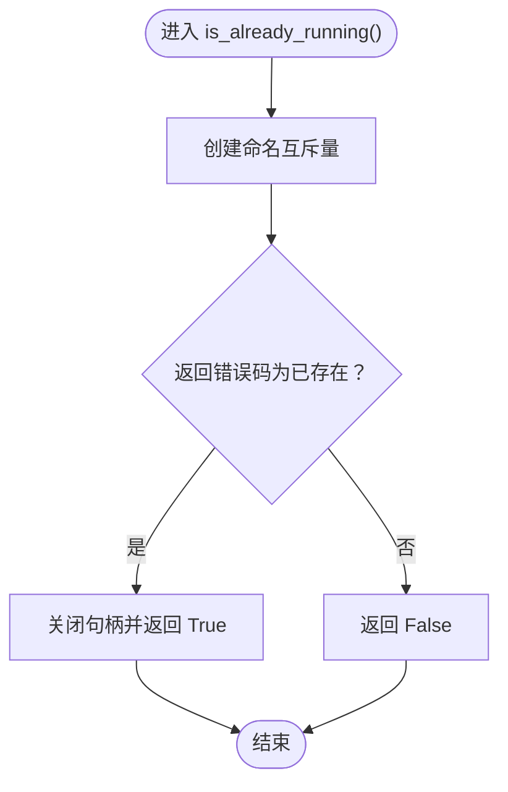
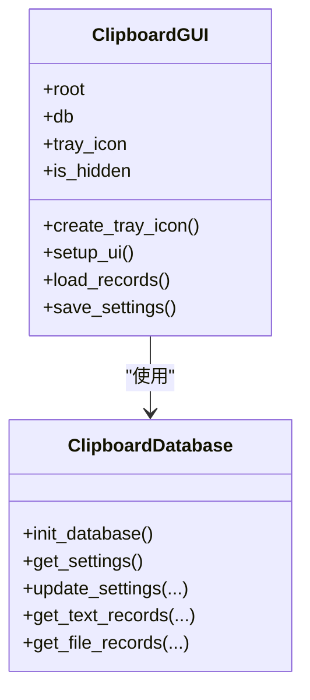
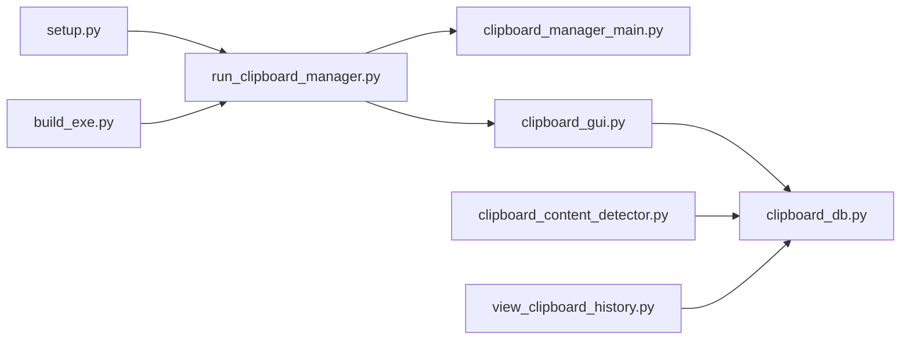
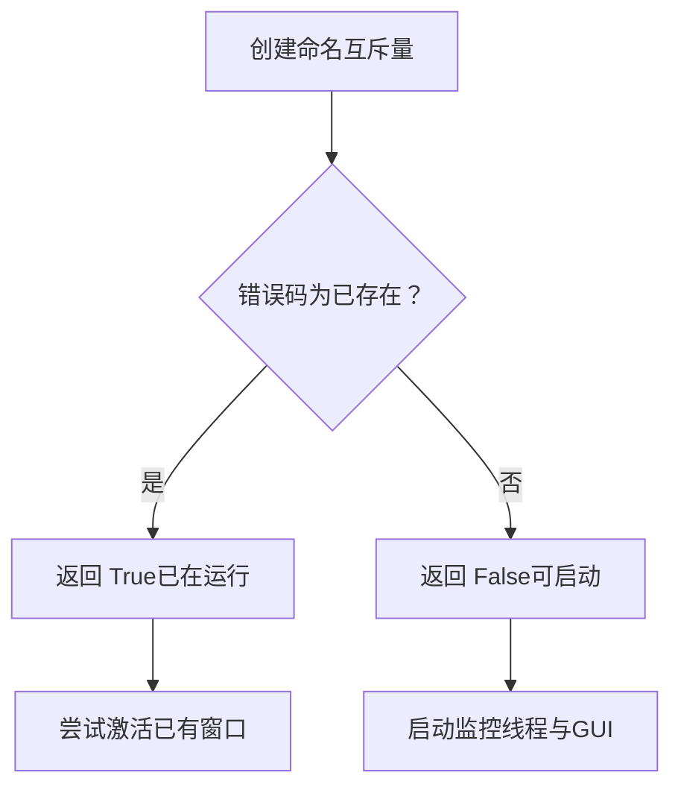

# 程序启动问题

<cite>
**本文引用的文件**
- [run_clipboard_manager.py](file://run_clipboard_manager.py)
- [clipboard_manager_main.py](file://clipboard_manager_main.py)
- [clipboard_gui.py](file://clipboard_gui.py)
- [clipboard_db.py](file://clipboard_db.py)
- [clipboard_content_detector.py](file://clipboard_content_detector.py)
- [view_clipboard_history.py](file://view_clipboard_history.py)
- [setup.py](file://setup.py)
- [build_exe.py](file://build_exe.py)
</cite>

## 目录
1. [简介](#简介)
2. [项目结构](#项目结构)
3. [核心组件](#核心组件)
4. [架构总览](#架构总览)
5. [详细组件分析](#详细组件分析)
6. [依赖关系分析](#依赖关系分析)
7. [性能考虑](#性能考虑)
8. [故障排查指南](#故障排查指南)
9. [结论](#结论)
10. [附录](#附录)

## 简介
本指南聚焦“程序无法启动”的常见问题，结合仓库中的启动入口与互斥锁机制，系统讲解以下主题：
- 常见启动失败原因：缺少依赖（pystray、Pillow）、互斥锁冲突、权限不足、环境不匹配
- 诊断步骤：检查Python环境、验证依赖安装、查看启动日志、确认互斥锁状态
- 互斥锁工作原理：is_already_running()如何通过Windows互斥量避免重复启动
- 解决方案：pip安装缺失依赖、以管理员权限运行、结束重复进程
- 调试技巧：添加详细日志、命令行运行、查看异常堆栈

## 项目结构
该项目由多个脚本组成，包含主程序、GUI界面、数据库封装、打包配置与独立工具脚本。启动流程主要通过入口脚本完成，并在GUI层集成系统托盘能力。



图表来源
- [run_clipboard_manager.py](file://run_clipboard_manager.py#L1-L71)
- [clipboard_manager_main.py](file://clipboard_manager_main.py#L717-L761)
- [clipboard_gui.py](file://clipboard_gui.py#L1-L120)
- [clipboard_db.py](file://clipboard_db.py#L1-L120)
- [clipboard_content_detector.py](file://clipboard_content_detector.py#L1-L120)
- [view_clipboard_history.py](file://view_clipboard_history.py#L1-L75)
- [setup.py](file://setup.py#L1-L84)
- [build_exe.py](file://build_exe.py#L1-L81)

章节来源
- [run_clipboard_manager.py](file://run_clipboard_manager.py#L1-L71)
- [clipboard_manager_main.py](file://clipboard_manager_main.py#L717-L761)
- [clipboard_gui.py](file://clipboard_gui.py#L1-L120)
- [clipboard_db.py](file://clipboard_db.py#L1-L120)
- [clipboard_content_detector.py](file://clipboard_content_detector.py#L1-L120)
- [view_clipboard_history.py](file://view_clipboard_history.py#L1-L75)
- [setup.py](file://setup.py#L1-L84)
- [build_exe.py](file://build_exe.py#L1-L81)

## 核心组件
- 启动入口与互斥锁
  - 入口脚本负责检查是否已有实例运行，若未运行则启动GUI与后台监控线程；若已运行则尝试激活已有窗口。
  - 互斥锁通过Windows API创建命名互斥量，利用错误码判断是否已存在实例。
- 主程序与监控循环
  - 主程序负责处理剪贴板内容（文本/文件），并写入数据库；监控循环周期性检查剪贴板变化。
- GUI与系统托盘
  - GUI负责记录展示、设置管理、统计信息；系统托盘通过pystray/Pillow实现，若缺失依赖会降级提示。
- 数据库封装
  - 统一的SQLite接口，包含文本/文件记录表与设置表，支持增删改查与统计。
- 打包配置
  - setup.py/build_exe.py声明了依赖包（pystray、PIL）与包含文件，确保可执行文件能正常运行。

章节来源
- [run_clipboard_manager.py](file://run_clipboard_manager.py#L17-L46)
- [clipboard_manager_main.py](file://clipboard_manager_main.py#L717-L761)
- [clipboard_gui.py](file://clipboard_gui.py#L144-L171)
- [clipboard_db.py](file://clipboard_db.py#L1-L120)
- [setup.py](file://setup.py#L21-L30)
- [build_exe.py](file://build_exe.py#L21-L30)

## 架构总览
启动流程的关键路径如下：入口脚本先检查互斥锁，再创建监控线程与GUI；GUI可创建系统托盘图标；数据库封装统一提供持久化能力。



图表来源
- [run_clipboard_manager.py](file://run_clipboard_manager.py#L32-L66)
- [clipboard_manager_main.py](file://clipboard_manager_main.py#L717-L761)
- [clipboard_gui.py](file://clipboard_gui.py#L144-L171)
- [clipboard_db.py](file://clipboard_db.py#L1-L120)

## 详细组件分析

### 组件A：互斥锁与重复启动防护
- 功能概述
  - 通过Windows互斥量实现“单实例”保护：若同名互斥量已存在，则判定程序已在运行。
  - 若已运行，脚本会尝试查找并激活已有窗口，避免重复实例占用资源。
- 关键点
  - 互斥量名称固定，冲突即代表重复启动。
  - 异常捕获：当系统API调用失败时，返回False，避免误判导致无法启动。
- 故障场景
  - 互斥锁冲突：另一个实例仍在运行或句柄未释放。
  - 权限不足：无法创建互斥量或无法查找窗口。
  - 环境差异：不同Python版本/虚拟环境导致导入失败。



图表来源
- [run_clipboard_manager.py](file://run_clipboard_manager.py#L17-L31)

章节来源
- [run_clipboard_manager.py](file://run_clipboard_manager.py#L17-L46)

### 组件B：GUI与系统托盘
- 功能概述
  - GUI负责记录展示、设置管理、统计信息；支持Alt+C快捷键显示/隐藏界面。
  - 系统托盘通过pystray与Pillow实现；若缺失依赖，会打印提示信息并降级运行。
- 关键点
  - 依赖缺失时的降级策略：仅禁用托盘图标功能，不影响主界面与数据库操作。
  - 资源路径兼容：支持PyInstaller打包后的资源定位。
- 故障场景
  - 缺少pystray或Pillow：托盘图标不可用，但程序仍可运行。
  - 图标文件缺失：会创建简单图标或提示资源路径问题。



图表来源
- [clipboard_gui.py](file://clipboard_gui.py#L144-L171)
- [clipboard_db.py](file://clipboard_db.py#L1-L120)

章节来源
- [clipboard_gui.py](file://clipboard_gui.py#L1-L120)
- [clipboard_db.py](file://clipboard_db.py#L1-L120)

### 组件C：主程序与监控循环
- 功能概述
  - 主程序负责处理剪贴板内容（文本/文件），并写入数据库；监控循环周期性检查剪贴板变化。
  - 支持命令行参数：--monitor与-i参数用于仅运行监控器。
- 关键点
  - 剪贴板访问需正确打开/关闭，异常时应避免阻塞。
  - 文件保存前计算MD5，避免重复保存；文本记录也基于MD5去重。
- 故障场景
  - 剪贴板访问失败：OpenClipboard异常或权限不足。
  - 文件IO异常：目标路径不可写或磁盘空间不足。
  - 数据库异常：连接失败或约束冲突。

```mermaid
sequenceDiagram
participant Loop as "monitor_clipboard_loop()"
participant Manager as "ClipboardManager"
participant Win as "win32clipboard"
participant DB as "ClipboardDatabase"
Loop->>Manager : 调用 process_clipboard_content()
Manager->>Win : OpenClipboard()
alt 存在文件
Manager->>Win : 读取文件列表
Manager->>DB : 保存文件记录/去重
else 存在文本
Manager->>Win : 读取文本
Manager->>DB : 保存文本记录/去重
end
Manager->>Win : CloseClipboard()
```

图表来源
- [clipboard_manager_main.py](file://clipboard_manager_main.py#L395-L496)
- [clipboard_manager_main.py](file://clipboard_manager_main.py#L717-L761)

章节来源
- [clipboard_manager_main.py](file://clipboard_manager_main.py#L395-L496)
- [clipboard_manager_main.py](file://clipboard_manager_main.py#L717-L761)

### 组件D：工具脚本与打包配置
- 工具脚本
  - 历史查看：控制台输出最近记录与统计信息。
  - 内容检测：枚举剪贴板格式、读取文本/文件列表，支持复制限制检查。
- 打包配置
  - setup.py/build_exe.py声明包含pystray、PIL等依赖，确保exe可运行。
  - 包含图标与数据库文件，便于首次运行时准备环境。

章节来源
- [view_clipboard_history.py](file://view_clipboard_history.py#L1-L75)
- [clipboard_content_detector.py](file://clipboard_content_detector.py#L1-L120)
- [setup.py](file://setup.py#L21-L30)
- [build_exe.py](file://build_exe.py#L21-L30)

## 依赖关系分析
- 启动入口依赖
  - run_clipboard_manager.py依赖clipboard_manager_main.py的监控循环与ClipboardManager类。
  - GUI依赖clipboard_db.py进行数据持久化。
- 打包依赖
  - setup.py/build_exe.py显式声明pystray与PIL为打包所需包。
- 运行时依赖
  - GUI层在导入pystray/Pillow时采用异常捕获与降级提示，避免因缺失依赖导致启动失败。



图表来源
- [run_clipboard_manager.py](file://run_clipboard_manager.py#L1-L71)
- [clipboard_manager_main.py](file://clipboard_manager_main.py#L717-L761)
- [clipboard_gui.py](file://clipboard_gui.py#L1-L120)
- [clipboard_db.py](file://clipboard_db.py#L1-L120)
- [clipboard_content_detector.py](file://clipboard_content_detector.py#L1-L120)
- [view_clipboard_history.py](file://view_clipboard_history.py#L1-L75)
- [setup.py](file://setup.py#L21-L30)
- [build_exe.py](file://build_exe.py#L21-L30)

章节来源
- [run_clipboard_manager.py](file://run_clipboard_manager.py#L1-L71)
- [clipboard_gui.py](file://clipboard_gui.py#L1-L120)
- [clipboard_db.py](file://clipboard_db.py#L1-L120)
- [setup.py](file://setup.py#L21-L30)
- [build_exe.py](file://build_exe.py#L21-L30)

## 性能考虑
- 监控频率
  - 默认1秒检查一次剪贴板，可根据系统负载调整间隔参数（命令行支持-i）。
- 数据库写入
  - 文本/文件均基于MD5去重，减少重复写入；批量插入与唯一索引提升查询效率。
- GUI渲染
  - 记录较多时建议分页或延迟加载，避免一次性渲染大量节点导致卡顿。
- 托盘图标
  - 仅在可用时创建托盘图标，避免额外开销；缺失依赖时自动降级。

## 故障排查指南

### 一、常见启动失败原因与诊断
- 缺少依赖（pystray、Pillow）
  - 现象：系统托盘图标不可用，GUI仍可运行；程序可能在启动时打印依赖缺失提示。
  - 诊断：查看启动日志中关于pystray/Pillow的导入异常信息。
  - 解决：使用pip安装缺失依赖。
- 互斥锁冲突（重复启动）
  - 现象：程序提示已在运行，但无界面显示；或无法创建互斥量。
  - 诊断：确认是否存在另一个实例；检查任务管理器中重复进程。
  - 解决：结束重复进程后重试；或等待互斥量句柄释放。
- 权限不足
  - 现象：无法创建互斥量、无法访问剪贴板、无法写入数据库或图标文件。
  - 诊断：以管理员身份运行；检查目标路径权限。
  - 解决：以管理员权限启动；修正文件/目录权限。
- Python环境不匹配
  - 现象：导入win32clipboard/win32con失败；打包后运行异常。
  - 诊断：确认Python版本与架构（32/64位）；核对打包配置。
  - 解决：使用与打包配置一致的Python环境；重新打包。

### 二、诊断步骤清单
- 检查Python环境
  - 确认Python版本与架构；核对已安装包列表。
- 验证依赖安装
  - 确认pystray、PIL、pywin32等包已安装；缺失时使用pip安装。
- 查看启动日志
  - 运行入口脚本时留意控制台输出；关注is_already_running()与GUI初始化过程。
- 检查互斥锁状态
  - 若提示已在运行，确认是否存在重复进程；必要时结束进程。
- 验证数据库与资源文件
  - 确认数据库文件存在且可写；图标文件路径正确。

### 三、互斥锁工作原理详解
- 原理
  - 通过Windows API创建命名互斥量；若返回错误码表示已存在，则判定程序已在运行。
  - 已运行时尝试查找窗口并激活，避免重复实例。
- 代码路径
  - [is_already_running()](file://run_clipboard_manager.py#L17-L31)
  - [main() 启动逻辑](file://run_clipboard_manager.py#L32-L66)



图表来源
- [run_clipboard_manager.py](file://run_clipboard_manager.py#L17-L46)

### 四、解决方案与最佳实践
- 安装缺失依赖
  - 使用pip安装pystray与Pillow；确保与当前Python版本兼容。
- 以管理员权限运行
  - 当遇到权限问题时，右键以管理员身份运行程序或命令提示符。
- 结束重复进程
  - 打开任务管理器，结束重复的程序实例；再次启动。
- 调整监控参数
  - 使用命令行参数-i调整监控间隔，降低CPU占用。
- 添加详细日志
  - 在关键路径增加日志输出，便于定位异常；例如互斥锁创建、剪贴板访问、数据库操作等。
- 命令行运行
  - 使用命令行直接运行入口脚本，查看实时输出与错误堆栈。

### 五、调试技巧
- 增加日志输出
  - 在互斥锁检查、剪贴板访问、数据库操作等关键处打印详细信息。
- 使用命令行运行
  - 直接运行入口脚本，观察控制台输出；便于快速定位问题。
- 分模块测试
  - 单独运行GUI或监控脚本，验证各自功能是否正常。
- 打包一致性
  - 使用与打包配置一致的Python环境进行开发与测试，避免运行时差异。

## 结论
程序启动问题多源于依赖缺失、互斥锁冲突与权限不足。通过理解互斥锁机制、验证依赖安装、以管理员权限运行、结束重复进程与添加详细日志，可有效定位并解决问题。建议在开发与部署阶段保持Python环境与依赖的一致性，并在生产环境中启用必要的日志与异常处理，提升可维护性与稳定性。

## 附录
- 相关文件路径参考
  - [run_clipboard_manager.py](file://run_clipboard_manager.py#L1-L71)
  - [clipboard_manager_main.py](file://clipboard_manager_main.py#L717-L761)
  - [clipboard_gui.py](file://clipboard_gui.py#L144-L171)
  - [clipboard_db.py](file://clipboard_db.py#L1-L120)
  - [clipboard_content_detector.py](file://clipboard_content_detector.py#L1-L120)
  - [view_clipboard_history.py](file://view_clipboard_history.py#L1-L75)
  - [setup.py](file://setup.py#L21-L30)
  - [build_exe.py](file://build_exe.py#L21-L30)