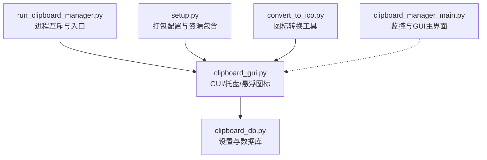
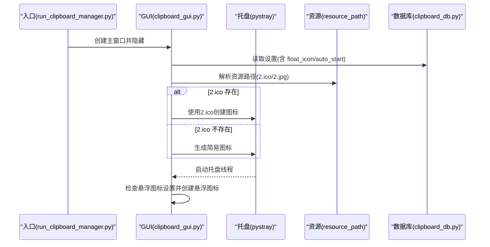
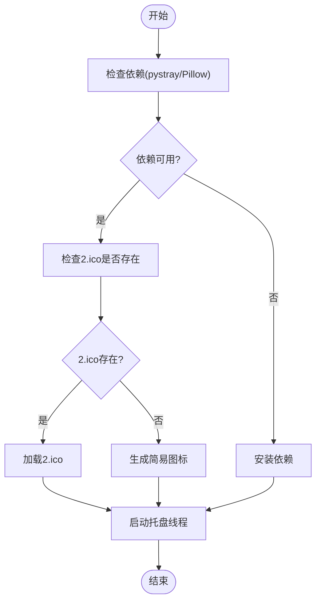
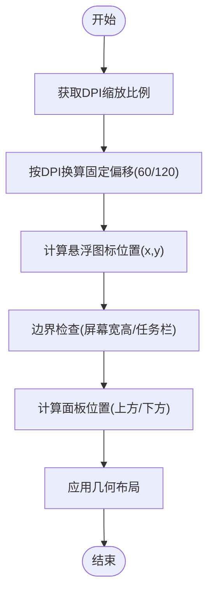
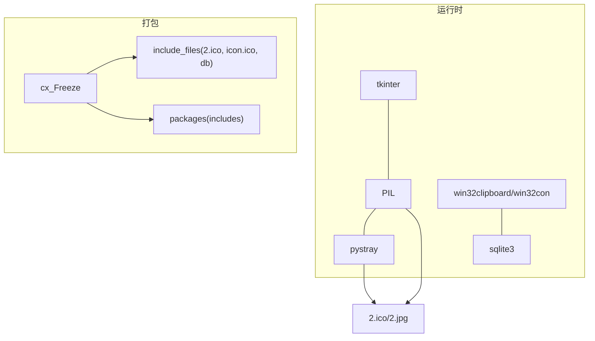

# 系统集成问题

<cite>
**本文引用的文件**
- [clipboard_gui.py](file://clipboard_gui.py)
- [run_clipboard_manager.py](file://run_clipboard_manager.py)
- [setup.py](file://setup.py)
- [clipboard_db.py](file://clipboard_db.py)
- [convert_to_ico.py](file://convert_to_ico.py)
- [clipboard_manager_main.py](file://clipboard_manager_main.py)
</cite>

## 目录
1. [简介](#简介)
2. [项目结构](#项目结构)
3. [核心组件](#核心组件)
4. [架构总览](#架构总览)
5. [详细组件分析](#详细组件分析)
6. [依赖关系分析](#依赖关系分析)
7. [性能考量](#性能考量)
8. [故障排查指南](#故障排查指南)
9. [结论](#结论)
10. [附录](#附录)

## 简介
本文件聚焦于系统集成问题，尤其是系统托盘图标不显示、pystray 兼容性、图标资源缺失（2.ico）以及悬浮图标错位等问题。我们将深入分析 create_tray_icon 函数的实现与资源加载机制，并提供针对 DPI 缩放、屏幕坐标计算的诊断与修复建议，辅以可操作的诊断步骤与解决方案。

## 项目结构
该项目采用“GUI + 托盘 + 悬浮图标 + 数据库”的组合架构：
- GUI 与托盘：通过 clipboard_gui.py 实现，包含系统托盘图标创建、悬浮图标、窗口管理等。
- 启动入口：run_clipboard_manager.py 负责进程互斥、隐藏主窗口、启动 GUI 并在后台运行剪贴板监控线程。
- 打包配置：setup.py 指定包含 2.ico、icon.ico、clipboard_history.db 等资源，确保打包后图标可用。
- 数据层：clipboard_db.py 管理设置项（含 float_icon、auto_start 等），并提供设置读写接口。
- 资源转换：convert_to_ico.py 提供将 2.jpg 转换为 2.ico 的工具，便于图标资源准备。
- 主业务：clipboard_manager_main.py 提供剪贴板监控与 GUI 主界面（非托盘模式）。

图表来源
- [run_clipboard_manager.py](file://run_clipboard_manager.py#L1-L71)
- [clipboard_gui.py](file://clipboard_gui.py#L1-L200)
- [clipboard_db.py](file://clipboard_db.py#L1-L120)
- [setup.py](file://setup.py#L1-L84)
- [convert_to_ico.py](file://convert_to_ico.py#L1-L48)
- [clipboard_manager_main.py](file://clipboard_manager_main.py#L1-L120)

章节来源
- [run_clipboard_manager.py](file://run_clipboard_manager.py#L1-L71)
- [clipboard_gui.py](file://clipboard_gui.py#L1-L200)
- [setup.py](file://setup.py#L1-L84)

## 核心组件
- 系统托盘图标创建：在 clipboard_gui.py 中，create_tray_icon 通过 pystray 创建托盘图标，优先使用 2.ico，若不存在则生成简易图标。
- 资源路径解析：resource_path 保证在 PyInstaller 打包后也能正确找到资源文件。
- 悬浮图标：支持拖动、悬停显示面板、双击显示主窗口等交互；位置计算基于屏幕宽高与固定偏移量。
- 设置持久化：clipboard_db.py 提供设置项读写，包括 float_icon、auto_start 等。

章节来源
- [clipboard_gui.py](file://clipboard_gui.py#L144-L171)
- [clipboard_gui.py](file://clipboard_gui.py#L1165-L1224)
- [clipboard_db.py](file://clipboard_db.py#L359-L412)

## 架构总览
系统托盘与悬浮图标的关键流程如下：

图表来源
- [run_clipboard_manager.py](file://run_clipboard_manager.py#L32-L71)
- [clipboard_gui.py](file://clipboard_gui.py#L144-L171)
- [clipboard_gui.py](file://clipboard_gui.py#L1165-L1224)
- [clipboard_db.py](file://clipboard_db.py#L359-L385)

## 详细组件分析

### 系统托盘图标不显示问题
- 症状与原因
  - 依赖未安装：缺少 pystray 或 Pillow，导致 TRAY_ICON_AVAILABLE 为 False，无法创建托盘图标。
  - 图标资源缺失：2.ico 未随打包包含，或打包后路径不正确。
  - 运行环境差异：某些系统或沙箱环境下托盘不可用。
- 诊断步骤
  - 检查 TRAY_ICON_AVAILABLE 标志：在 clipboard_gui.py 中，导入 pystray/Pillow 失败会设置该标志为 False。
  - 验证图标路径：使用 resource_path("2.ico") 检查是否存在。
  - 打包资源核对：确认 setup.py 的 include_files 是否包含 2.ico。
  - 依赖安装：确保 pystray 与 Pillow 已安装。
- 解决方案
  - 安装依赖：pip install pystray pillow。
  - 提供备用图标：当 2.ico 不存在时，create_tray_icon 会生成简易图标。
  - 打包修正：确保 setup.py include_files 包含 2.ico；必要时在 convert_to_ico.py 生成 2.ico 并加入打包。

图表来源
- [clipboard_gui.py](file://clipboard_gui.py#L144-L171)
- [setup.py](file://setup.py#L14-L20)
- [convert_to_ico.py](file://convert_to_ico.py#L1-L48)

章节来源
- [clipboard_gui.py](file://clipboard_gui.py#L144-L171)
- [setup.py](file://setup.py#L14-L20)

### create_tray_icon 函数实现与资源加载机制
- 关键点
  - 资源路径：使用 resource_path("2.ico")，在 PyInstaller 下指向 _MEIPASS。
  - 图标加载：若 2.ico 存在则加载，否则生成 RGB(73,109,137) 背景与白色圆圈内的字母 C 的简易图标。
  - 菜单项：包含“显示界面”和“退出”，默认项为“显示界面”。
  - 线程运行：在独立线程中调用 tray_icon.run，避免阻塞主线程。
- 兼容性注意
  - pystray 版本差异可能导致菜单项行为不同，建议使用稳定版本。
  - Windows 系统托盘权限与安全策略可能影响图标显示，需以管理员权限或在受信任环境中运行。

章节来源
- [clipboard_gui.py](file://clipboard_gui.py#L144-L171)

### 悬浮图标错位问题（DPI 缩放与坐标计算）
- 症状与原因
  - 固定像素偏移：悬浮图标默认位置使用固定像素偏移（距离右边 60、底部 120），在高 DPI 或多屏场景下可能超出屏幕或遮挡任务栏。
  - 屏幕坐标边界检查：position_float_panel_within_screen 等方法对面板位置做了边界检查，但悬浮图标本身未做 DPI 缩放适配。
- 诊断步骤
  - 检查屏幕分辨率与 DPI：确认当前 DPI 缩放比例（如 125%/150%）。
  - 验证悬浮图标位置：观察悬浮图标是否在屏幕外或被任务栏遮挡。
  - 面板位置：hover 时面板是否在图标上方/下方合适位置，是否溢出屏幕。
- 解决方案
  - DPI 缩放适配：在计算悬浮图标位置时，将固定像素偏移乘以 DPI 缩放系数（例如通过 win32gui 获取缩放比例并换算）。
  - 动态边界检查：在 move_float_icon 与 position_float_panel_* 方法中统一使用 winfo_screenwidth()/winfo_screenheight() 并考虑任务栏高度。
  - 用户偏好记忆：将悬浮图标最终位置保存至设置，下次启动时恢复。

图表来源
- [clipboard_gui.py](file://clipboard_gui.py#L1165-L1224)
- [clipboard_gui.py](file://clipboard_gui.py#L1453-L1558)
- [clipboard_gui.py](file://clipboard_gui.py#L1639-L1669)

章节来源
- [clipboard_gui.py](file://clipboard_gui.py#L1165-L1224)
- [clipboard_gui.py](file://clipboard_gui.py#L1453-L1558)
- [clipboard_gui.py](file://clipboard_gui.py#L1639-L1669)

### 依赖未安装与图标缺失的综合处理
- 依赖
  - pystray：用于系统托盘。
  - Pillow：用于图像处理与图标生成。
- 图标资源
  - 2.ico：首选图标文件。
  - 2.jpg：悬浮图标图片资源。
  - icon.ico：打包时包含的备用图标。
- 打包与资源
  - setup.py include_files 明确包含 2.ico、icon.ico、clipboard_history.db。
  - convert_to_ico.py 可将 2.jpg 转换为 2.ico，便于资源准备。

章节来源
- [setup.py](file://setup.py#L14-L20)
- [convert_to_ico.py](file://convert_to_ico.py#L1-L48)
- [clipboard_gui.py](file://clipboard_gui.py#L144-L171)

## 依赖关系分析
- 运行时依赖
  - tkinter、PIL、pystray、win32clipboard、win32con、sqlite3。
- 打包依赖
  - cx_Freeze，包含 packages、includes、include_files。
- 资源依赖
  - 2.ico、icon.ico、clipboard_history.db。

图表来源
- [setup.py](file://setup.py#L14-L30)
- [clipboard_gui.py](file://clipboard_gui.py#L144-L171)

章节来源
- [setup.py](file://setup.py#L14-L30)

## 性能考量
- 托盘线程：create_tray_icon 在独立线程运行，避免阻塞 GUI。
- 图像处理：Pillow 图像加载与缩放在悬浮图标中频繁使用，建议缓存常用尺寸与 PhotoImage 引用。
- 数据库：设置读写在 GUI 初始化阶段进行，避免高频 I/O。

[本节为通用建议，不直接分析具体文件]

## 故障排查指南
- 系统托盘图标不显示
  - 检查 TRAY_ICON_AVAILABLE：确认导入 pystray/Pillow 是否成功。
  - 验证 2.ico：使用 resource_path("2.ico") 检查路径与存在性。
  - 安装依赖：pip install pystray pillow。
  - 打包核对：确认 setup.py include_files 包含 2.ico。
- 悬浮图标错位
  - 检查 DPI 缩放：在高 DPI 场景下，固定像素偏移应按比例换算。
  - 边界检查：确保悬浮图标与面板位置在屏幕范围内，避免遮挡任务栏。
  - 位置记忆：将最终位置保存到设置，提升用户体验。
- 其他建议
  - 使用 run_clipboard_manager.py 启动，确保隐藏主窗口并仅显示托盘。
  - 如需调试，可在 create_tray_icon 与悬浮图标相关方法中添加日志输出。

章节来源
- [clipboard_gui.py](file://clipboard_gui.py#L144-L171)
- [clipboard_gui.py](file://clipboard_gui.py#L1165-L1224)
- [run_clipboard_manager.py](file://run_clipboard_manager.py#L32-L71)

## 结论
- 系统托盘图标不显示主要由依赖缺失与资源路径问题导致，可通过安装依赖、提供备用图标与修正打包配置解决。
- 悬浮图标错位与 DPI 缩放密切相关，应引入 DPI 缩放系数与统一的边界检查逻辑。
- 通过设置持久化与日志输出，可进一步提升诊断效率与用户体验。

[本节为总结，不直接分析具体文件]

## 附录
- 诊断清单
  - 检查 TRAY_ICON_AVAILABLE 标志。
  - 验证 2.ico 与 2.jpg 路径与存在性。
  - 确认 pystray 与 Pillow 已安装。
  - 核对 setup.py include_files。
  - 测试不同 DPI 设置下的表现。
- 快速修复建议
  - 安装依赖：pip install pystray pillow。
  - 生成 2.ico：使用 convert_to_ico.py。
  - 修正悬浮图标位置算法：按 DPI 换算固定偏移并统一边界检查。
  - 保存悬浮图标最终位置到设置。

章节来源
- [convert_to_ico.py](file://convert_to_ico.py#L1-L48)
- [setup.py](file://setup.py#L14-L20)
- [clipboard_gui.py](file://clipboard_gui.py#L1165-L1224)
- [clipboard_gui.py](file://clipboard_gui.py#L1453-L1558)