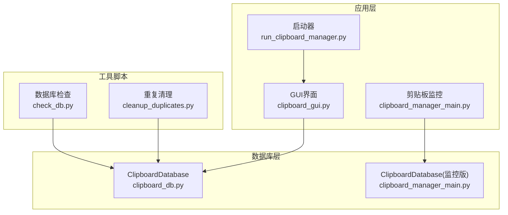
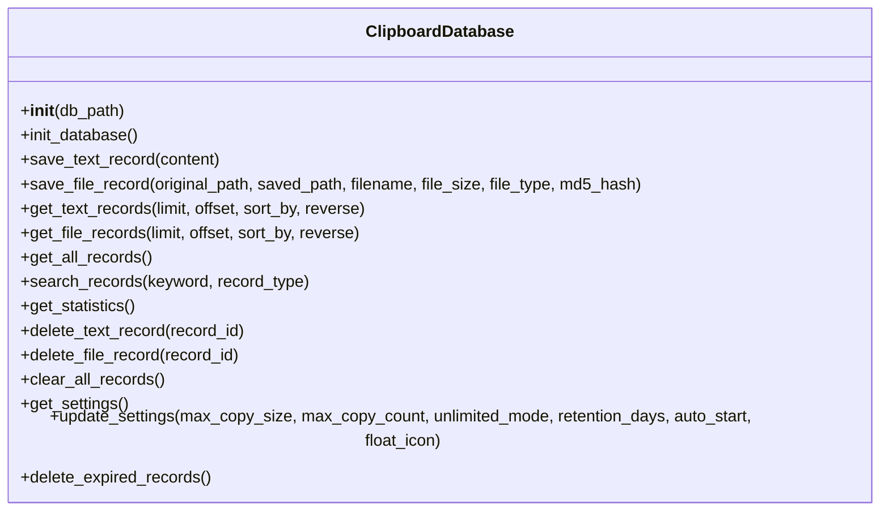
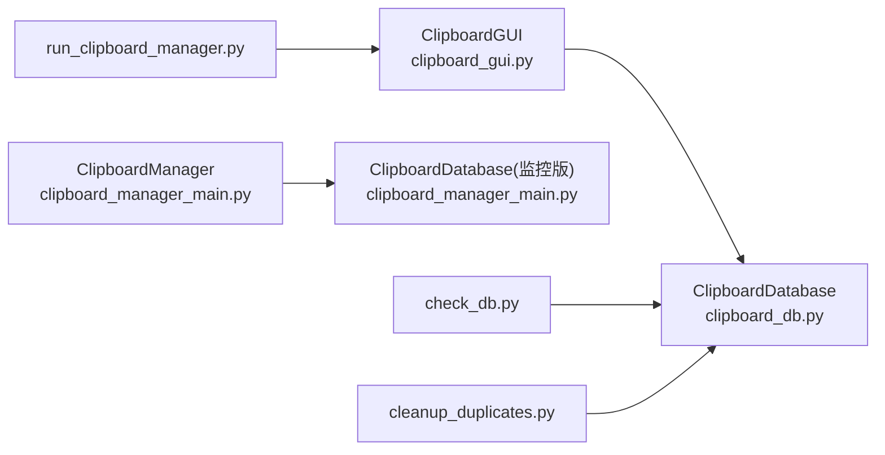

# 数据库操作接口

<cite>
**本文引用的文件**
- [clipboard_db.py](file://clipboard_db.py)
- [clipboard_manager_main.py](file://clipboard_manager_main.py)
- [clipboard_gui.py](file://clipboard_gui.py)
- [run_clipboard_manager.py](file://run_clipboard_manager.py)
- [check_db.py](file://check_db.py)
- [cleanup_duplicates.py](file://cleanup_duplicates.py)
</cite>

## 目录
1. [简介](#简介)
2. [项目结构](#项目结构)
3. [核心组件](#核心组件)
4. [架构总览](#架构总览)
5. [详细组件分析](#详细组件分析)
6. [依赖关系分析](#依赖关系分析)
7. [性能考量](#性能考量)
8. [故障排查指南](#故障排查指南)
9. [结论](#结论)
10. [附录](#附录)

## 简介
本文档面向ClipboardDatabase类，系统化梳理其提供的数据库操作接口，覆盖数据写入（保存文本与文件记录）、数据读取（文本/文件/全部/搜索）、设置管理（获取与更新）、统计查询、删除操作以及过期清理，并重点说明MD5去重、时间戳生成、唯一性冲突处理（IntegrityError）与异常重试机制。文末提供按时间倒序获取前10条记录的调用示例与最佳实践建议。

## 项目结构
- 数据库核心类位于clipboard_db.py，定义了完整的数据库表结构、字段与所有公共接口。
- GUI层通过clipboard_gui.py调用ClipboardDatabase执行查询、统计、删除等操作。
- clipboard_manager_main.py包含另一个版本的ClipboardDatabase实现，用于监控与保存剪贴板内容。
- 其他辅助脚本用于调试与清理重复数据。

图表来源
- [clipboard_db.py](file://clipboard_db.py#L1-L115)
- [clipboard_gui.py](file://clipboard_gui.py#L1-L120)
- [clipboard_manager_main.py](file://clipboard_manager_main.py#L56-L111)
- [run_clipboard_manager.py](file://run_clipboard_manager.py#L1-L71)
- [check_db.py](file://check_db.py#L1-L31)
- [cleanup_duplicates.py](file://cleanup_duplicates.py#L1-L67)

章节来源
- [clipboard_db.py](file://clipboard_db.py#L1-L115)
- [clipboard_gui.py](file://clipboard_gui.py#L1-L120)
- [clipboard_manager_main.py](file://clipboard_manager_main.py#L56-L111)
- [run_clipboard_manager.py](file://run_clipboard_manager.py#L1-L71)
- [check_db.py](file://check_db.py#L1-L31)
- [cleanup_duplicates.py](file://cleanup_duplicates.py#L1-L67)

## 核心组件
- ClipboardDatabase：封装SQLite数据库的初始化、增删改查、统计与过期清理等操作。
- GUI层ClipboardGUI：负责展示与交互，调用ClipboardDatabase执行查询、统计、删除等。
- 监控版ClipboardDatabase：由clipboard_manager_main.py提供，用于监控剪贴板并保存内容。

章节来源
- [clipboard_db.py](file://clipboard_db.py#L13-L115)
- [clipboard_gui.py](file://clipboard_gui.py#L1-L120)
- [clipboard_manager_main.py](file://clipboard_manager_main.py#L56-L111)

## 架构总览
ClipboardDatabase采用“单实例连接”模式，每个方法内部建立连接、执行SQL、提交或关闭。文本与文件记录均支持MD5去重与number计数，时间戳统一使用本地时间字符串。设置表支持多字段持久化，过期清理会同步删除磁盘文件。

图表来源
- [clipboard_db.py](file://clipboard_db.py#L13-L455)

## 详细组件分析

### 初始化与表结构
- 初始化时创建三张表：text_records、file_records、settings。
- 为text_records添加md5_hash字段并建立唯一索引，确保重复文本不重复入库。
- 为file_records添加md5_hash字段并设为UNIQUE，避免重复文件入库。
- settings表包含最大复制大小、最大复制数量、无限模式、保留天数、开机自启、悬浮图标等字段，并插入默认值。
- 通过ALTER语句兼容旧版本字段，避免破坏既有数据。

章节来源
- [clipboard_db.py](file://clipboard_db.py#L18-L115)

### 数据写入接口

#### save_text_record(content)
- 功能：保存文本记录，计算UTF-8编码的MD5，使用本地时间字符串，插入char_count与number=1。
- 唯一性冲突处理：当md5_hash唯一约束冲突时，捕获IntegrityError，更新timestamp与number+1，并返回已有记录ID。
- 返回值：新插入或已存在记录的ID。
- 异常处理：捕获sqlite3.IntegrityError后重试更新，保证幂等。

章节来源
- [clipboard_db.py](file://clipboard_db.py#L116-L151)

#### save_file_record(original_path, saved_path, filename, file_size, file_type, md5_hash)
- 功能：保存文件记录，使用本地时间字符串，插入number=1。
- 唯一性冲突处理：当md5_hash唯一约束冲突时，捕获IntegrityError，更新original_path与timestamp与number+1，并返回已有记录ID。
- 返回值：新插入或已存在记录的ID。
- 异常处理：捕获sqlite3.IntegrityError后重试更新，保证幂等。

章节来源
- [clipboard_db.py](file://clipboard_db.py#L152-L184)

### 数据读取接口

#### get_text_records(limit=None, offset=0, sort_by="timestamp", reverse=True)
- 功能：按指定字段排序获取文本记录，支持LIMIT/OFFSET分页。
- 排序字段：content、char_count、number、timestamp（默认）。
- 返回值：记录元组列表，包含(id, content, timestamp, char_count, md5_hash, number)。
- 分页：limit为None时获取全部，否则按LIMIT与OFFSET分页。

章节来源
- [clipboard_db.py](file://clipboard_db.py#L185-L221)

#### get_file_records(limit=None, offset=0, sort_by="timestamp", reverse=True)
- 功能：按指定字段排序获取文件记录，支持LIMIT/OFFSET分页。
- 排序字段：filename、file_size、file_type、number、timestamp（默认）。
- 返回值：记录元组列表，包含(id, original_path, saved_path, filename, file_size, file_type, md5_hash, timestamp, number)。

章节来源
- [clipboard_db.py](file://clipboard_db.py#L223-L261)

#### get_all_records()
- 功能：合并文本与文件记录，按timestamp降序返回(type, id, info, timestamp)。
- 返回值：联合查询结果，便于统一展示。

章节来源
- [clipboard_db.py](file://clipboard_db.py#L263-L279)

#### search_records(keyword="", record_type="all")
- 功能：模糊搜索文本内容或文件名，支持三种类型(all/text/file)。
- 返回值：联合查询结果，包含(type, id, info, timestamp)，按timestamp降序。
- 关键词匹配：content LIKE %keyword% 或 filename LIKE %keyword%。

章节来源
- [clipboard_db.py](file://clipboard_db.py#L281-L314)

### 统计查询接口

#### get_statistics()
- 功能：统计文本记录数量、文件记录数量与总大小。
- 返回值：(text_count, file_count, total_size)。

章节来源
- [clipboard_db.py](file://clipboard_db.py#L316-L332)

### 设置管理接口

#### get_settings()
- 功能：读取settings表的配置项。
- 返回值：字典，包含max_copy_size、max_copy_count、unlimited_mode、retention_days、auto_start、float_icon。
- 默认值：若无记录，返回内置默认值。

章节来源
- [clipboard_db.py](file://clipboard_db.py#L359-L386)

#### update_settings(max_copy_size=None, max_copy_count=None, unlimited_mode=None, retention_days=None, auto_start=None, float_icon=None)
- 功能：按需更新settings表字段，布尔值统一转为整型存储。
- 返回值：无（修改后立即提交）。

章节来源
- [clipboard_db.py](file://clipboard_db.py#L387-L412)

### 删除与清理接口

#### delete_text_record(record_id)
- 功能：删除指定文本记录。
- 返回值：无。

章节来源
- [clipboard_db.py](file://clipboard_db.py#L334-L341)

#### delete_file_record(record_id)
- 功能：删除指定文件记录。
- 返回值：无。

章节来源
- [clipboard_db.py](file://clipboard_db.py#L342-L349)

#### clear_all_records()
- 功能：清空文本与文件记录。
- 返回值：无。

章节来源
- [clipboard_db.py](file://clipboard_db.py#L350-L358)

#### delete_expired_records()
- 功能：根据retention_days设置删除过期记录，并同步删除磁盘上的文件。
- 行为：retention_days<=0时不删除；计算过期时间后删除text_records与file_records，并遍历删除saved_path对应的文件。
- 返回值：无。

章节来源
- [clipboard_db.py](file://clipboard_db.py#L413-L455)

### 异常处理与重试机制
- IntegrityError捕获：在save_text_record与save_file_record中，当唯一约束冲突时捕获sqlite3.IntegrityError，改为更新timestamp与number+1，确保去重与计数正确。
- 文件删除异常：删除过期文件时捕获异常并打印错误信息，不影响整体流程。

章节来源
- [clipboard_db.py](file://clipboard_db.py#L136-L151)
- [clipboard_db.py](file://clipboard_db.py#L169-L184)
- [clipboard_db.py](file://clipboard_db.py#L447-L455)

### 调用示例：按时间倒序获取前10条记录
- 示例场景：在GUI或脚本中按timestamp降序获取文本记录的前10条。
- 调用方式：调用get_text_records(limit=10, offset=0, sort_by="timestamp", reverse=True)。
- 返回值：包含(id, content, timestamp, char_count, md5_hash, number)的列表，按时间倒序排列。

章节来源
- [clipboard_db.py](file://clipboard_db.py#L185-L221)
- [clipboard_gui.py](file://clipboard_gui.py#L581-L626)

## 依赖关系分析

图表来源
- [clipboard_gui.py](file://clipboard_gui.py#L1-L120)
- [clipboard_manager_main.py](file://clipboard_manager_main.py#L56-L111)
- [run_clipboard_manager.py](file://run_clipboard_manager.py#L1-L71)
- [check_db.py](file://check_db.py#L1-L31)
- [cleanup_duplicates.py](file://cleanup_duplicates.py#L1-L67)

章节来源
- [clipboard_gui.py](file://clipboard_gui.py#L1-L120)
- [clipboard_manager_main.py](file://clipboard_manager_main.py#L56-L111)
- [run_clipboard_manager.py](file://run_clipboard_manager.py#L1-L71)
- [check_db.py](file://check_db.py#L1-L31)
- [cleanup_duplicates.py](file://cleanup_duplicates.py#L1-L67)

## 性能考量
- 唯一性索引：text_records的md5_hash已建立唯一索引，可显著降低重复插入成本。
- 排序与分页：get_text_records与get_file_records支持LIMIT/OFFSET，建议在大数据量时配合分页与合理排序字段，避免一次性加载过多数据。
- 统计查询：get_statistics使用聚合查询，复杂度低，适合频繁调用。
- 过期清理：delete_expired_records会删除大量记录并遍历删除文件，建议在维护窗口执行，避免影响前台交互。

[本节为通用性能建议，无需特定文件引用]

## 故障排查指南
- MD5重复导致插入失败：确认是否触发IntegrityError并走更新分支；可通过check_db.py验证重复MD5与number计数。
- 文件删除失败：delete_expired_records中捕获异常并打印错误，检查文件是否存在与权限问题。
- 设置未生效：update_settings仅更新传入非None的字段，确认调用参数；get_settings返回默认值时检查settings表初始化是否成功。
- 重复记录清理：使用cleanup_duplicates.py合并重复记录，确保number计数正确并删除冗余记录。

章节来源
- [clipboard_db.py](file://clipboard_db.py#L136-L151)
- [clipboard_db.py](file://clipboard_db.py#L169-L184)
- [clipboard_db.py](file://clipboard_db.py#L447-L455)
- [check_db.py](file://check_db.py#L1-L31)
- [cleanup_duplicates.py](file://cleanup_duplicates.py#L1-L67)

## 结论
ClipboardDatabase提供了完善的数据库操作接口，涵盖写入去重、读取排序分页、搜索、统计、设置管理与过期清理。其基于SQLite的简单实现具备良好的可维护性与扩展性，适合在桌面应用中稳定运行。建议在生产环境中结合分页、索引与定期清理策略，进一步优化性能与存储占用。

[本节为总结性内容，无需特定文件引用]

## 附录

### 方法参数与返回值一览
- save_text_record(content)
  - 参数：content（字符串）
  - 返回：记录ID（整数）
- save_file_record(original_path, saved_path, filename, file_size, file_type, md5_hash)
  - 参数：original_path、saved_path、filename、file_size、file_type、md5_hash（字符串）
  - 返回：记录ID（整数）
- get_text_records(limit=None, offset=0, sort_by="timestamp", reverse=True)
  - 参数：limit（整数或None）、offset（整数）、sort_by（字符串）、reverse（布尔）
  - 返回：记录列表（含id、content、timestamp、char_count、md5_hash、number）
- get_file_records(limit=None, offset=0, sort_by="timestamp", reverse=True)
  - 参数：limit（整数或None）、offset（整数）、sort_by（字符串）、reverse（布尔）
  - 返回：记录列表（含id、original_path、saved_path、filename、file_size、file_type、md5_hash、timestamp、number）
- get_all_records()
  - 参数：无
  - 返回：联合查询结果（type、id、info、timestamp）
- search_records(keyword="", record_type="all")
  - 参数：keyword（字符串）、record_type（"all"|"text"|"file"）
  - 返回：联合查询结果（type、id、info、timestamp）
- get_statistics()
  - 参数：无
  - 返回：(text_count, file_count, total_size)
- delete_text_record(record_id)
  - 参数：record_id（整数）
  - 返回：无
- delete_file_record(record_id)
  - 参数：record_id（整数）
  - 返回：无
- clear_all_records()
  - 参数：无
  - 返回：无
- get_settings()
  - 参数：无
  - 返回：配置字典（包含max_copy_size、max_copy_count、unlimited_mode、retention_days、auto_start、float_icon）
- update_settings(max_copy_size=None, max_copy_count=None, unlimited_mode=None, retention_days=None, auto_start=None, float_icon=None)
  - 参数：各配置项（可为None）
  - 返回：无
- delete_expired_records()
  - 参数：无
  - 返回：无

章节来源
- [clipboard_db.py](file://clipboard_db.py#L116-L455)