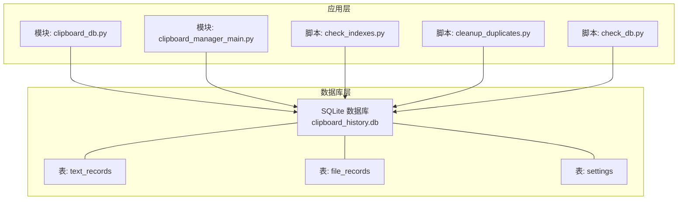
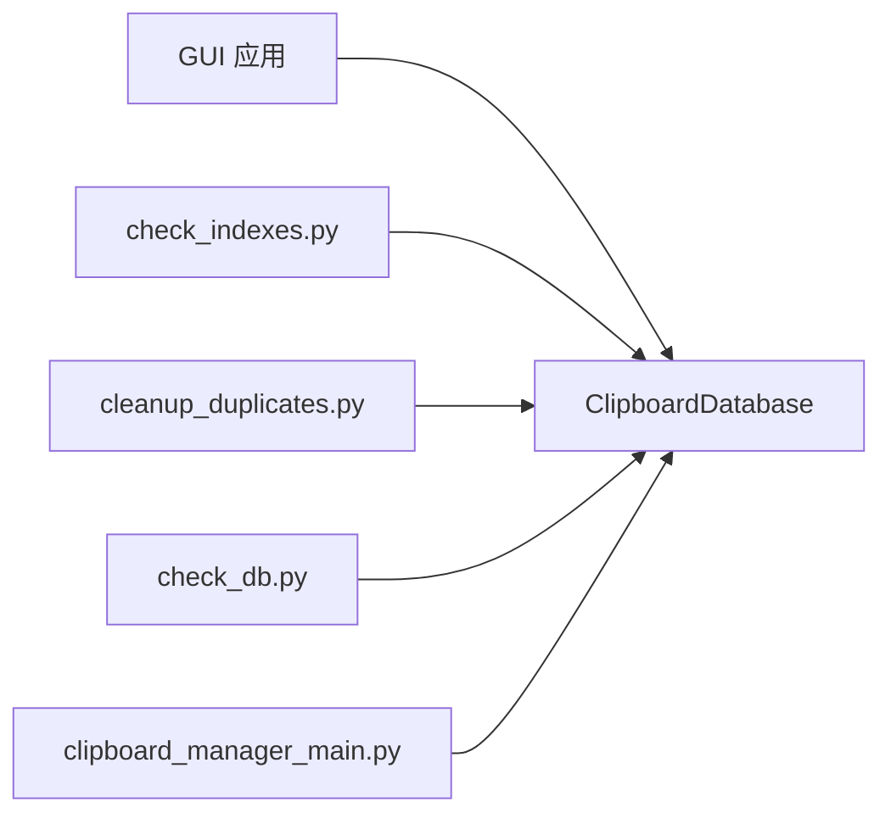
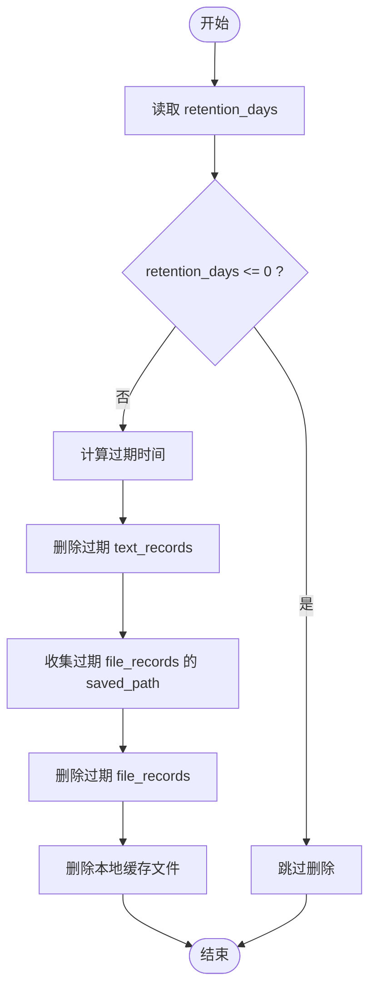

# 数据库设计

<cite>
**本文引用的文件**
- [clipboard_db.py](file://clipboard_db.py)
- [clipboard_manager_main.py](file://clipboard_manager_main.py)
- [check_indexes.py](file://check_indexes.py)
- [cleanup_duplicates.py](file://cleanup_duplicates.py)
- [check_db.py](file://check_db.py)
</cite>

## 目录
1. [简介](#简介)
2. [项目结构](#项目结构)
3. [核心组件](#核心组件)
4. [架构总览](#架构总览)
5. [详细组件分析](#详细组件分析)
6. [依赖关系分析](#依赖关系分析)
7. [性能与索引策略](#性能与索引策略)
8. [数据生命周期管理](#数据生命周期管理)
9. [数据库连接与事务](#数据库连接与事务)
10. [PRAGMA 配置与性能影响](#pragma-配置与性能影响)
11. [数据库迁移与模式演进](#数据库迁移与模式演进)
12. [示例查询与用法](#示例查询与用法)
13. [故障排查指南](#故障排查指南)
14. [结论](#结论)

## 简介
本文件系统性梳理本项目的 SQLite 数据库设计，聚焦三张核心表：text_records（文本记录）、file_records（文件记录）、settings（设置参数）。文档覆盖字段定义、主键与索引策略、数据生命周期（去重、过期清理）、连接与事务模式、PRAGMA 配置对性能的影响，以及当前版本的模式变更处理方式。同时提供数据库模式图与典型查询场景，帮助开发者与运维人员快速理解与维护数据库。

## 项目结构
数据库相关逻辑主要集中在两个模块：
- clipboard_db.py：集中式数据库管理类，负责表初始化、增删改查、统计、过期清理等。
- clipboard_manager_main.py：早期版本的数据库初始化实现，包含与 GUI 和剪贴板监控集成的完整流程。
- check_indexes.py：索引检查脚本，用于验证索引是否存在。
- cleanup_duplicates.py：重复 MD5 清理脚本，用于合并重复记录并去重。
- check_db.py：数据库内容检查脚本，辅助定位重复与异常。



图表来源
- [clipboard_db.py](file://clipboard_db.py#L24-L114)
- [clipboard_manager_main.py](file://clipboard_manager_main.py#L67-L110)
- [check_indexes.py](file://check_indexes.py#L9-L24)
- [cleanup_duplicates.py](file://cleanup_duplicates.py#L9-L67)
- [check_db.py](file://check_db.py#L9-L30)

章节来源
- [clipboard_db.py](file://clipboard_db.py#L24-L114)
- [clipboard_manager_main.py](file://clipboard_manager_main.py#L67-L110)

## 核心组件
- ClipboardDatabase 类：封装数据库初始化、记录保存、查询、统计、删除、设置读写、过期清理等操作。
- 脚本工具：check_indexes.py、cleanup_duplicates.py、check_db.py，分别用于索引检查、重复清理、内容检查。

章节来源
- [clipboard_db.py](file://clipboard_db.py#L116-L455)
- [check_indexes.py](file://check_indexes.py#L9-L24)
- [cleanup_duplicates.py](file://cleanup_duplicates.py#L9-L67)
- [check_db.py](file://check_db.py#L9-L30)

## 架构总览
数据库采用单库多表设计，三张核心表职责清晰：
- text_records：存储文本复制历史，支持去重与排序。
- file_records：存储文件复制历史，包含本地缓存路径与类型分类。
- settings：存储全局配置，含容量/数量限制、保留天数、开机自启、悬浮图标等。

```mermaid
erDiagram
TEXT_RECORDS {
integer id PK
text content
datetime timestamp
integer char_count
text md5_hash UK
integer number
}
FILE_RECORDS {
integer id PK
text original_path
text saved_path
text filename
integer file_size
text file_type
text md5_hash UK
datetime timestamp
integer number
}
SETTINGS {
integer id PK CK(id=1)
integer max_copy_size
integer max_copy_count
integer unlimited_mode
integer retention_days
integer auto_start
integer float_icon
}
```

图表来源
- [clipboard_db.py](file://clipboard_db.py#L24-L114)
- [clipboard_manager_main.py](file://clipboard_manager_main.py#L67-L110)

## 详细组件分析

### 表：text_records（文本记录）
- 字段定义与约束
  - id：整型，主键，自增。
  - content：文本，非空。
  - timestamp：时间戳，默认当前时间。
  - char_count：整型，字符数。
  - md5_hash：文本，唯一索引（非空时生效）。
  - number：整型，默认 1，用于去重计数。
- 业务含义
  - md5_hash：用于识别重复文本，避免重复入库；重复时通过 number 累加计数。
  - number：表示该文本出现次数，便于排序与统计。
  - timestamp：记录复制时间，支持按时间排序。
- 去重策略
  - 插入时若 md5_hash 冲突，捕获完整性错误后更新 timestamp 并递增 number。
- 排序与查询
  - 支持按 content、char_count、number、timestamp 排序。
  - 默认按 timestamp 降序分页查询。

章节来源
- [clipboard_db.py](file://clipboard_db.py#L24-L66)
- [clipboard_db.py](file://clipboard_db.py#L116-L179)
- [clipboard_db.py](file://clipboard_db.py#L185-L218)

### 表：file_records（文件记录）
- 字段定义与约束
  - id：整型，主键，自增。
  - original_path：原始路径。
  - saved_path：本地缓存路径（用于 GUI 打开文件位置）。
  - filename：文件名。
  - file_size：整型，字节数。
  - file_type：文本，文件类型分类（如 images、videos 等）。
  - md5_hash：文本，唯一索引。
  - timestamp：时间戳，默认当前时间。
  - number：整型，默认 1，用于去重计数。
- 业务含义
  - saved_path：本地缓存路径，用于 GUI 快速打开文件所在目录。
  - file_type：基于扩展名的分类，便于检索与展示。
  - md5_hash：用于识别重复文件，避免重复入库。
- 去重策略
  - 插入时若 md5_hash 冲突，捕获完整性错误后更新 original_path、timestamp，并递增 number。
- 排序与查询
  - 支持按 filename、file_size、file_type、number、timestamp 排序。
  - 默认按 timestamp 降序分页查询。

章节来源
- [clipboard_db.py](file://clipboard_db.py#L55-L66)
- [clipboard_db.py](file://clipboard_db.py#L152-L179)
- [clipboard_db.py](file://clipboard_db.py#L223-L258)

### 表：settings（设置参数）
- 字段定义与约束
  - id：整型，主键，CHECK(id=1)，确保只有一条记录。
  - max_copy_size：整型，字节，复制大小上限。
  - max_copy_count：整型，复制数量上限。
  - unlimited_mode：整型，布尔开关（0/1）。
  - retention_days：整型，保留天数（<=0 表示永久保存）。
  - auto_start：整型，布尔开关（0/1）。
  - float_icon：整型，布尔开关（0/1）。
- 业务含义
  - 控制复制行为（大小/数量限制、无限模式）。
  - 控制数据保留周期（过期清理依据）。
  - 控制应用行为（开机自启、悬浮图标）。
- 初始化与默认值
  - 若 settings 表不存在或无 id=1 的记录，则插入默认值。

章节来源
- [clipboard_db.py](file://clipboard_db.py#L77-L114)
- [clipboard_db.py](file://clipboard_db.py#L359-L412)

## 依赖关系分析
- 模块耦合
  - clipboard_db.py 作为统一数据库入口，被 GUI 与脚本调用。
  - clipboard_manager_main.py 中早期版本的数据库初始化与 GUI/监控集成在同一文件中，后续拆分为独立模块。
- 外部依赖
  - sqlite3：标准库，提供连接、事务、DDL/DML。
  - hashlib：计算文本与文件的 MD5。
  - os：删除过期文件时进行路径检查与删除。
- 可能的循环依赖
  - 当前未见循环导入；GUI 通过 manager.db 调用数据库方法，脚本直接连接数据库。



图表来源
- [clipboard_db.py](file://clipboard_db.py#L116-L455)
- [clipboard_manager_main.py](file://clipboard_manager_main.py#L56-L110)
- [check_indexes.py](file://check_indexes.py#L9-L24)
- [cleanup_duplicates.py](file://cleanup_duplicates.py#L9-L67)
- [check_db.py](file://check_db.py#L9-L30)

## 性能与索引策略
- 已有索引
  - text_records.md5_hash：唯一索引（WHERE md5_hash IS NOT NULL），用于去重与快速查找。
  - file_records.md5_hash：唯一索引，用于去重与快速查找。
- 索引验证
  - check_indexes.py 会查询 sqlite_master 中的 index 列表，输出 text_records 与 file_records 的索引名称。
- 建议的额外索引（基于常见查询模式）
  - text_records.timestamp：加速按时间范围检索与分页。
  - file_records.timestamp：同上。
  - text_records.number：加速按出现频次排序。
  - file_records.number：同上。
  - file_records.file_type：加速按类型过滤。
  - file_records.filename：加速按文件名模糊匹配。
- 注意事项
  - 唯一索引在 md5_hash 非空时生效，避免全表扫描。
  - 对于高并发写入，唯一约束可能带来锁竞争；可结合业务需求评估是否需要异步去重或批量合并。

章节来源
- [clipboard_db.py](file://clipboard_db.py#L40-L45)
- [clipboard_db.py](file://clipboard_db.py#L62-L66)
- [check_indexes.py](file://check_indexes.py#L9-L24)

## 数据生命周期管理
- 去重策略
  - 插入时通过 md5_hash 唯一性约束检测重复；冲突时更新 timestamp 并递增 number，避免重复数据膨胀。
  - cleanup_duplicates.py：扫描 text_records 中重复 md5_hash，保留最新记录（按时间降序），将其他记录的 number 累加到主记录，并删除重复记录。
- 过期清理
  - delete_expired_records：读取 settings.retention_days，若大于 0，则删除早于过期时间的 text_records 与 file_records，并删除对应的本地缓存文件。
- 数据统计
  - get_statistics：统计 text_records 数量、file_records 数量与总大小，便于容量监控。



图表来源
- [clipboard_db.py](file://clipboard_db.py#L413-L455)
- [clipboard_db.py](file://clipboard_db.py#L316-L332)

章节来源
- [clipboard_db.py](file://clipboard_db.py#L116-L179)
- [clipboard_db.py](file://clipboard_db.py#L185-L258)
- [clipboard_db.py](file://clipboard_db.py#L316-L332)
- [clipboard_db.py](file://clipboard_db.py#L413-L455)
- [cleanup_duplicates.py](file://cleanup_duplicates.py#L9-L67)
- [check_db.py](file://check_db.py#L9-L30)

## 数据库连接与事务
- 连接管理
  - 每次数据库操作均新建连接并关闭，未使用连接池。
  - 事务：每个操作内部 commit 后立即 close，未显式开启事务块。
- 事务模式
  - 单条 DML 操作（INSERT/UPDATE/DELETE）在单连接内提交，简单可靠但缺乏跨表原子性。
  - 建议：对于涉及多表或批量操作的场景，应显式使用事务以保证一致性。
- 错误处理
  - IntegrityError（唯一约束冲突）：捕获后执行更新与回滚逻辑，避免重复数据。
  - 其他异常：打印错误信息，继续流程或由上层处理。

章节来源
- [clipboard_db.py](file://clipboard_db.py#L116-L179)
- [clipboard_db.py](file://clipboard_db.py#L185-L258)
- [clipboard_db.py](file://clipboard_db.py#L334-L358)
- [clipboard_db.py](file://clipboard_db.py#L359-L412)

## PRAGMA 配置与性能影响
- 当前实现未显式设置 PRAGMA；SQLite 默认行为适用于本项目轻量级使用场景。
- 常见建议（概念性指导，非当前实现）：
  - synchronous：NORMAL 或 WAL 模式可提升写入吞吐。
  - journal_mode：WAL 可显著降低写锁争用，适合频繁写入场景。
  - cache_size：增大页缓存可减少磁盘 IO。
  - foreign_keys：启用外键约束（本项目无外键，无需此 PRAGMA）。
- 影响评估
  - 对于本项目的小型 SQLite 数据库，PRAGMA 调优收益有限；更关键的是索引与查询设计。
  - 若未来数据规模扩大，建议引入 WAL 与合适的缓存参数。

[本节为通用性能建议，不直接对应具体源码，故无章节来源]

## 数据库迁移与模式演进
- 现状
  - settings 表新增字段通过 ALTER TABLE + DEFAULT 方式兼容旧版本，避免破坏既有数据。
  - text_records 与 file_records 的 number 字段通过 ALTER TABLE 添加，保持向后兼容。
  - md5_hash 字段在初始化时尝试添加，避免重复执行失败。
- 迁移策略
  - 新增字段：使用 ALTER TABLE + DEFAULT，捕获 OperationalError 忽略已存在错误。
  - 唯一索引：先尝试创建，捕获 OperationalError 忽略已存在错误。
  - 建议：未来若需复杂迁移（如重命名列、修改约束），可考虑“版本号 + 迁移脚本”的方案，并在 settings 中记录 schema_version。
- 版本控制
  - 当前未见 schema_version 字段；可通过 settings.id=1 的记录状态与字段存在性判断当前模式版本。

章节来源
- [clipboard_db.py](file://clipboard_db.py#L33-L45)
- [clipboard_db.py](file://clipboard_db.py#L47-L53)
- [clipboard_db.py](file://clipboard_db.py#L69-L74)
- [clipboard_db.py](file://clipboard_db.py#L92-L112)

## 示例查询与用法
以下为常见查询场景（以路径形式给出，便于查阅具体实现）：
- 按时间范围检索文本记录
  - 参考路径：[clipboard_db.py](file://clipboard_db.py#L185-L218)
- 按时间范围检索文件记录
  - 参考路径：[clipboard_db.py](file://clipboard_db.py#L223-L258)
- 按关键词搜索（文本/文件/全部）
  - 参考路径：[clipboard_db.py](file://clipboard_db.py#L281-L314)
- 获取统计信息（文本数量、文件数量、总大小）
  - 参考路径：[clipboard_db.py](file://clipboard_db.py#L316-L332)
- 按出现频次排序（number 字段）
  - 参考路径：[clipboard_db.py](file://clipboard_db.py#L185-L218)、[clipboard_db.py](file://clipboard_db.py#L223-L258)
- 按文件类型过滤
  - 参考路径：[clipboard_db.py](file://clipboard_db.py#L223-L258)

章节来源
- [clipboard_db.py](file://clipboard_db.py#L185-L332)

## 故障排查指南
- 索引缺失
  - 使用 check_indexes.py 检查 text_records 与 file_records 的索引是否存在。
  - 参考路径：[check_indexes.py](file://check_indexes.py#L9-L24)
- 重复记录过多
  - 使用 cleanup_duplicates.py 合并重复 MD5 记录，保留最新记录并累加计数。
  - 参考路径：[cleanup_duplicates.py](file://cleanup_duplicates.py#L9-L67)
- 数据库内容异常
  - 使用 check_db.py 查看最近带 MD5 的记录与重复 MD5 分组，辅助定位问题。
  - 参考路径：[check_db.py](file://check_db.py#L9-L30)
- 过期清理未生效
  - 检查 settings.retention_days 是否大于 0；确认 delete_expired_records 的调用时机。
  - 参考路径：[clipboard_db.py](file://clipboard_db.py#L413-L455)

章节来源
- [check_indexes.py](file://check_indexes.py#L9-L24)
- [cleanup_duplicates.py](file://cleanup_duplicates.py#L9-L67)
- [check_db.py](file://check_db.py#L9-L30)
- [clipboard_db.py](file://clipboard_db.py#L413-L455)

## 结论
本项目采用简洁的 SQLite 单库多表设计，围绕去重（md5_hash）、计数（number）、时间戳（timestamp）与设置（settings）构建核心能力。通过 ALTER TABLE 兼容性迁移与脚本化的索引检查、重复清理、内容检查，实现了平滑的演进与运维支持。建议在未来引入 WAL、合适的索引与显式事务，以进一步提升性能与一致性保障。