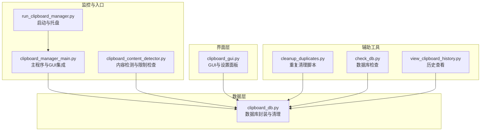
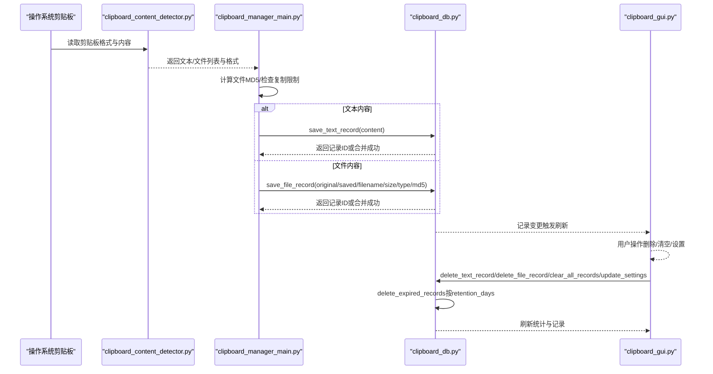
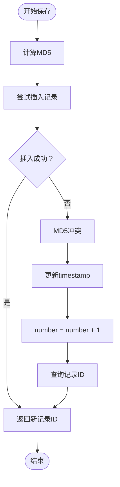
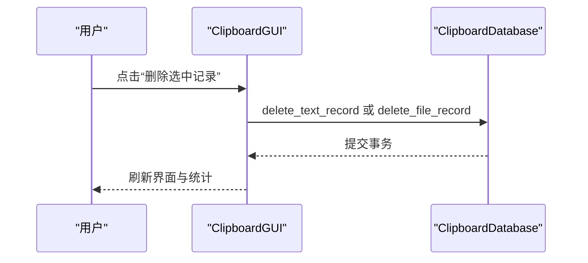
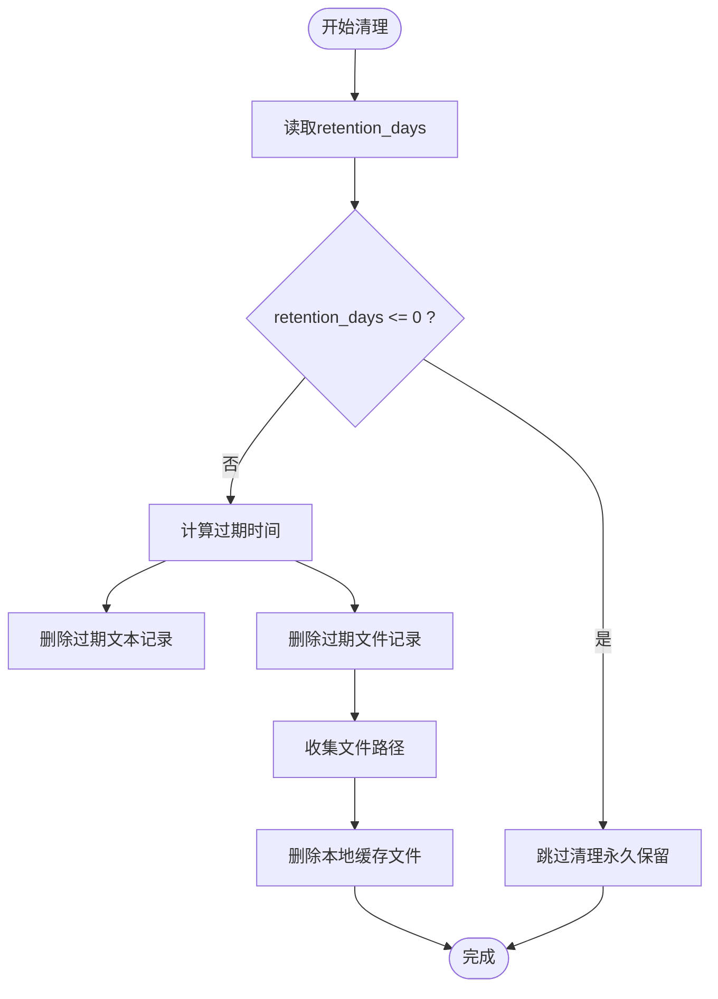
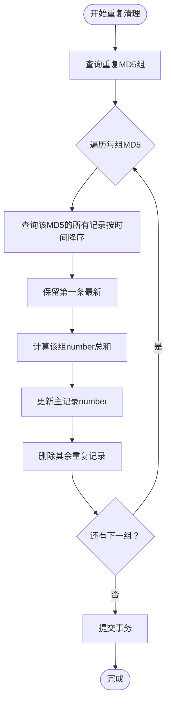
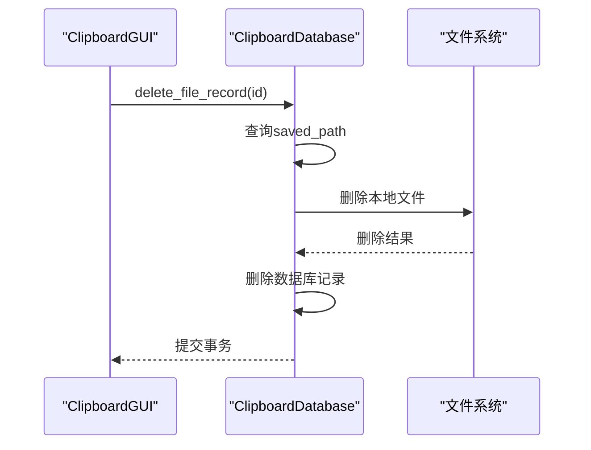
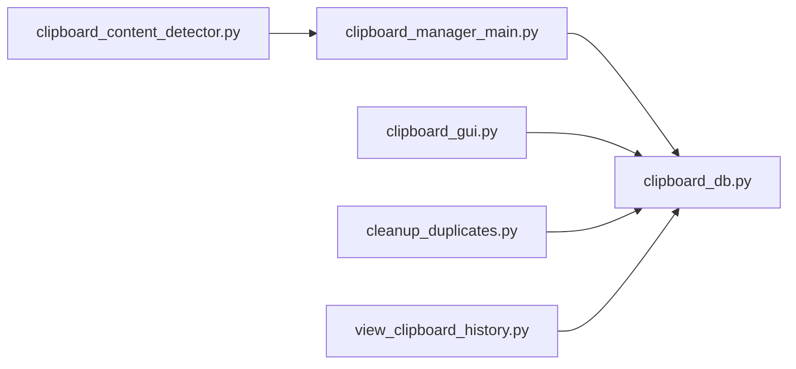

# 数据生命周期管理

<cite>
**本文引用的文件**
- [clipboard_manager_main.py](file://clipboard_manager_main.py)
- [clipboard_db.py](file://clipboard_db.py)
- [clipboard_gui.py](file://clipboard_gui.py)
- [cleanup_duplicates.py](file://cleanup_duplicates.py)
- [check_db.py](file://check_db.py)
- [clipboard_content_detector.py](file://clipboard_content_detector.py)
- [run_clipboard_manager.py](file://run_clipboard_manager.py)
- [view_clipboard_history.py](file://view_clipboard_history.py)
</cite>

## 目录
1. [简介](#简介)
2. [项目结构](#项目结构)
3. [核心组件](#核心组件)
4. [架构总览](#架构总览)
5. [详细组件分析](#详细组件分析)
6. [依赖关系分析](#依赖关系分析)
7. [性能考量](#性能考量)
8. [故障排查指南](#故障排查指南)
9. [结论](#结论)
10. [附录](#附录)

## 简介
本文件围绕“数据生命周期管理”主题，系统阐述剪贴板历史管理系统中文本与文件记录的存储、更新与删除流程。重点包括：
- 新内容进入剪贴板时，系统计算MD5并尝试插入数据库；若已存在则更新时间戳与计数器（number字段），实现智能合并。
- clear_all_records与delete_text/file_record接口如何响应用户删除操作。
- delete_expired_records方法依据settings表中的retention_days设置自动清理过期数据；若设置为0则永久保留。
- 结合cleanup_duplicates.py脚本，说明如何手动执行重复记录清理：查找相同MD5的多条记录，保留最新一条并累加总次数，删除其余冗余条目，确保数据一致性。
- 强调文件记录删除时同步清理本地缓存文件的安全机制。

## 项目结构
系统由多个脚本协同工作，形成“监控-入库-展示-清理”的闭环：
- 监控与入口：clipboard_manager_main.py、clipboard_content_detector.py、run_clipboard_manager.py
- 数据层：clipboard_db.py（SQLite数据库封装）
- 界面层：clipboard_gui.py（GUI与设置）
- 辅助工具：cleanup_duplicates.py、check_db.py、view_clipboard_history.py



图表来源
- [clipboard_manager_main.py](file://clipboard_manager_main.py#L1-L120)
- [clipboard_db.py](file://clipboard_db.py#L1-L120)
- [clipboard_gui.py](file://clipboard_gui.py#L1-L120)
- [cleanup_duplicates.py](file://cleanup_duplicates.py#L1-L40)
- [check_db.py](file://check_db.py#L1-L31)
- [clipboard_content_detector.py](file://clipboard_content_detector.py#L1-L60)
- [run_clipboard_manager.py](file://run_clipboard_manager.py#L1-L40)

章节来源
- [clipboard_manager_main.py](file://clipboard_manager_main.py#L1-L120)
- [clipboard_db.py](file://clipboard_db.py#L1-L120)
- [clipboard_gui.py](file://clipboard_gui.py#L1-L120)
- [cleanup_duplicates.py](file://cleanup_duplicates.py#L1-L40)
- [check_db.py](file://check_db.py#L1-L31)
- [clipboard_content_detector.py](file://clipboard_content_detector.py#L1-L60)
- [run_clipboard_manager.py](file://run_clipboard_manager.py#L1-L40)

## 核心组件
- ClipboardDatabase：负责数据库初始化、文本/文件记录的保存与合并、查询、统计、删除、清理过期记录等。
- ClipboardManager：负责监控剪贴板变化、计算文件MD5、分类保存文件、调用数据库保存文本/文件记录。
- ClipboardGUI：提供设置面板（含保存天数、开机自启、悬浮图标等）、记录浏览与搜索、统计信息展示。
- cleanup_duplicates.py：手动清理重复MD5记录，保留最新并累加计数，删除冗余条目。
- clipboard_content_detector.py：辅助检测剪贴板内容类型、格式、限制检查等。

章节来源
- [clipboard_db.py](file://clipboard_db.py#L1-L120)
- [clipboard_manager_main.py](file://clipboard_manager_main.py#L112-L180)
- [clipboard_gui.py](file://clipboard_gui.py#L328-L530)
- [cleanup_duplicates.py](file://cleanup_duplicates.py#L1-L67)
- [clipboard_content_detector.py](file://clipboard_content_detector.py#L143-L181)

## 架构总览
系统采用“监控-入库-展示-清理”的分层架构：
- 监控层：clipboard_manager_main.py与clipboard_content_detector.py负责检测剪贴板变化与限制检查。
- 入库层：ClipboardDatabase封装SQLite操作，实现智能合并（MD5去重+计数累加）。
- 展示层：ClipboardGUI提供设置与记录浏览；view_clipboard_history.py提供命令行查看。
- 清理层：cleanup_duplicates.py与delete_expired_records共同维护数据健康。



图表来源
- [clipboard_content_detector.py](file://clipboard_content_detector.py#L87-L138)
- [clipboard_manager_main.py](file://clipboard_manager_main.py#L395-L496)
- [clipboard_db.py](file://clipboard_db.py#L116-L183)
- [clipboard_gui.py](file://clipboard_gui.py#L477-L530)

## 详细组件分析

### 数据库封装与智能合并（MD5去重+计数累加）
- 表结构要点
  - text_records：包含content、timestamp、char_count、md5_hash（UNIQUE）、number（默认1）。
  - file_records：包含original_path、saved_path、filename、file_size、file_type、md5_hash（UNIQUE）、timestamp、number（默认1）。
  - settings：包含max_copy_size、max_copy_count、unlimited_mode、retention_days、auto_start、float_icon等。
- 智能合并策略
  - 保存文本：计算content的MD5，插入时若MD5冲突则更新timestamp并number+1，避免重复存储。
  - 保存文件：同样基于md5_hash进行冲突检测，冲突时更新original_path与timestamp并number+1。
- 查询与统计
  - 支持按字段排序与分页查询，提供统计信息（文本数量、文件数量与总大小）。



图表来源
- [clipboard_db.py](file://clipboard_db.py#L116-L183)

章节来源
- [clipboard_db.py](file://clipboard_db.py#L23-L115)
- [clipboard_db.py](file://clipboard_db.py#L116-L183)

### 剪贴板监控与文件保存
- 监控循环：持续读取剪贴板，区分文本与文件两类内容。
- 文件处理：计算MD5、分类目录（按类型与日期）、复制到本地缓存、保存到数据库。
- 文本处理：检查大小限制（受设置影响），保存到数据库。
- 限制检查：支持无限模式与复制大小/数量限制。

```mermaid
sequenceDiagram
participant Loop as "监控循环"
participant WinClip as "Win32Clipboard"
participant Manager as "ClipboardManager"
participant FS as "文件系统"
participant DB as "ClipboardDatabase"
Loop->>WinClip : OpenClipboard()
alt 文件列表
WinClip-->>Loop : CF_HDROP
Loop->>Manager : check_copy_limits(files)
Manager-->>Loop : 允许/拒绝
Loop->>Manager : 遍历文件
Manager->>Manager : 计算MD5/分类/复制
Manager->>FS : 复制到缓存目录
Manager->>DB : save_file_record(...)
else 文本
WinClip-->>Loop : CF_UNICODETEXT
Loop->>Manager : 检查文本大小限制
Manager->>DB : save_text_record(...)
end
Loop->>WinClip : CloseClipboard()
```

图表来源
- [clipboard_manager_main.py](file://clipboard_manager_main.py#L395-L496)
- [clipboard_content_detector.py](file://clipboard_content_detector.py#L143-L181)

章节来源
- [clipboard_manager_main.py](file://clipboard_manager_main.py#L395-L496)
- [clipboard_content_detector.py](file://clipboard_content_detector.py#L143-L181)

### 删除接口与用户操作响应
- delete_text_record：删除单条文本记录。
- delete_file_record：删除单条文件记录。
- clear_all_records：清空所有文本与文件记录。
- GUI侧：用户可在界面中删除选中记录，或通过设置面板重置所有记录（同时删除本地缓存文件）。



图表来源
- [clipboard_gui.py](file://clipboard_gui.py#L796-L800)
- [clipboard_db.py](file://clipboard_db.py#L334-L358)

章节来源
- [clipboard_db.py](file://clipboard_db.py#L334-L358)
- [clipboard_gui.py](file://clipboard_gui.py#L796-L800)

### 过期数据清理（retention_days）
- delete_expired_records逻辑
  - 读取settings.retention_days。
  - 若retention_days<=0，永久保留，不删除。
  - 否则计算过期时间，删除早于过期时间的文本与文件记录，并同步删除本地缓存文件。
- GUI设置联动
  - 当用户在设置中修改保存天数并保存时，若设置为自定义天数，会立即触发清理。



图表来源
- [clipboard_db.py](file://clipboard_db.py#L413-L455)
- [clipboard_gui.py](file://clipboard_gui.py#L501-L523)

章节来源
- [clipboard_db.py](file://clipboard_db.py#L413-L455)
- [clipboard_gui.py](file://clipboard_gui.py#L501-L523)

### 手动重复记录清理（cleanup_duplicates.py）
- 功能目标：查找相同MD5的多条文本记录，保留最新一条（按时间降序），累加计数，删除其余冗余条目。
- 流程
  - 查询text_records中md5_hash重复的组。
  - 对每组按timestamp降序排序，保留第一条（最新）。
  - 计算该组所有记录的number之和，更新主记录的number。
  - 删除其余重复记录。



图表来源
- [cleanup_duplicates.py](file://cleanup_duplicates.py#L9-L67)

章节来源
- [cleanup_duplicates.py](file://cleanup_duplicates.py#L9-L67)

### 文件记录删除时的本地缓存安全清理
- 删除文件记录时，先查询对应saved_path，再删除本地文件，最后删除数据库记录。
- 保证“先删文件、后删记录”，避免残留文件占用空间且无法关联到记录。



图表来源
- [clipboard_db.py](file://clipboard_db.py#L342-L358)
- [clipboard_db.py](file://clipboard_db.py#L438-L455)

章节来源
- [clipboard_db.py](file://clipboard_db.py#L342-L358)
- [clipboard_db.py](file://clipboard_db.py#L438-L455)

## 依赖关系分析
- 模块耦合
  - clipboard_manager_main.py依赖clipboard_db.py进行数据库操作。
  - clipboard_gui.py依赖clipboard_db.py进行设置与记录读写。
  - cleanup_duplicates.py直接操作clipboard_history.db，独立于主业务流程。
  - clipboard_content_detector.py提供内容检测与限制检查，供监控流程使用。
- 外部依赖
  - Windows剪贴板API（win32clipboard/win32con）。
  - SQLite（内置）。
  - GUI与托盘依赖（可选）。



图表来源
- [clipboard_manager_main.py](file://clipboard_manager_main.py#L1-L120)
- [clipboard_db.py](file://clipboard_db.py#L1-L120)
- [clipboard_gui.py](file://clipboard_gui.py#L1-L120)
- [cleanup_duplicates.py](file://cleanup_duplicates.py#L1-L40)
- [view_clipboard_history.py](file://view_clipboard_history.py#L1-L40)

章节来源
- [clipboard_manager_main.py](file://clipboard_manager_main.py#L1-L120)
- [clipboard_db.py](file://clipboard_db.py#L1-L120)
- [clipboard_gui.py](file://clipboard_gui.py#L1-L120)
- [cleanup_duplicates.py](file://cleanup_duplicates.py#L1-L40)
- [view_clipboard_history.py](file://view_clipboard_history.py#L1-L40)

## 性能考量
- MD5计算：文件MD5采用分块读取，降低内存压力；文本MD5在保存时计算，避免重复计算。
- 去重合并：通过UNIQUE约束与冲突处理，减少重复存储，降低数据库体积。
- 查询优化：settings表新增retention_days字段，清理时按timestamp过滤，避免全表扫描。
- GUI刷新：分页与排序在数据库层面完成，前端仅展示，减少传输与渲染开销。
- 文件清理：删除过期记录时批量删除并同步清理本地文件，避免碎片化。

## 故障排查指南
- 重复记录问题
  - 使用cleanup_duplicates.py脚本清理重复MD5记录。
  - 使用check_db.py检查最近带MD5的记录与重复MD5组。
- 过期清理未生效
  - 检查settings.retention_days是否为正数；若为0表示永久保留。
  - 在GUI设置中保存后，若设置为自定义天数，会自动触发清理。
- 文件删除后仍占用空间
  - 确认delete_file_record流程是否执行；检查saved_path是否存在并可删除。
- 复制限制导致保存失败
  - 检查settings.unlimited_mode、max_copy_size、max_copy_count设置。
- 剪贴板监控异常
  - 确认Windows剪贴板权限与OpenClipboard/CloseClipboard配对使用。

章节来源
- [cleanup_duplicates.py](file://cleanup_duplicates.py#L1-L67)
- [check_db.py](file://check_db.py#L1-L31)
- [clipboard_db.py](file://clipboard_db.py#L413-L455)
- [clipboard_gui.py](file://clipboard_gui.py#L501-L523)
- [clipboard_manager_main.py](file://clipboard_manager_main.py#L395-L496)

## 结论
本系统通过MD5去重与计数累加实现了高效的文本与文件记录合并；通过retention_days实现可控的数据保留周期，并在删除文件记录时同步清理本地缓存文件，保障数据一致性与磁盘空间健康。cleanup_duplicates.py提供了手动修复重复记录的能力，配合GUI设置面板，形成完整的数据生命周期管理体系。

## 附录
- 常用命令与脚本
  - 运行主程序：python clipboard_manager_main.py
  - 启动监控与GUI：python run_clipboard_manager.py
  - 查看历史：python view_clipboard_history.py
  - 检查数据库：python check_db.py
  - 清理重复记录：python cleanup_duplicates.py