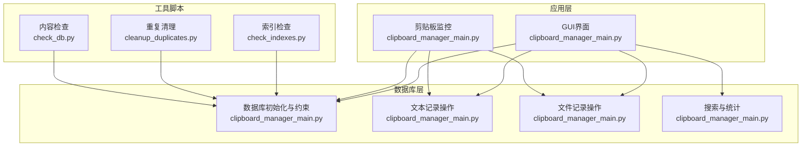
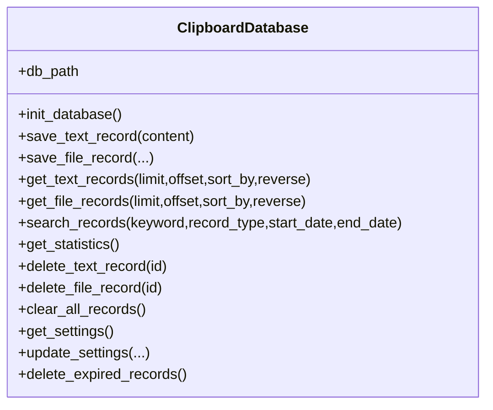
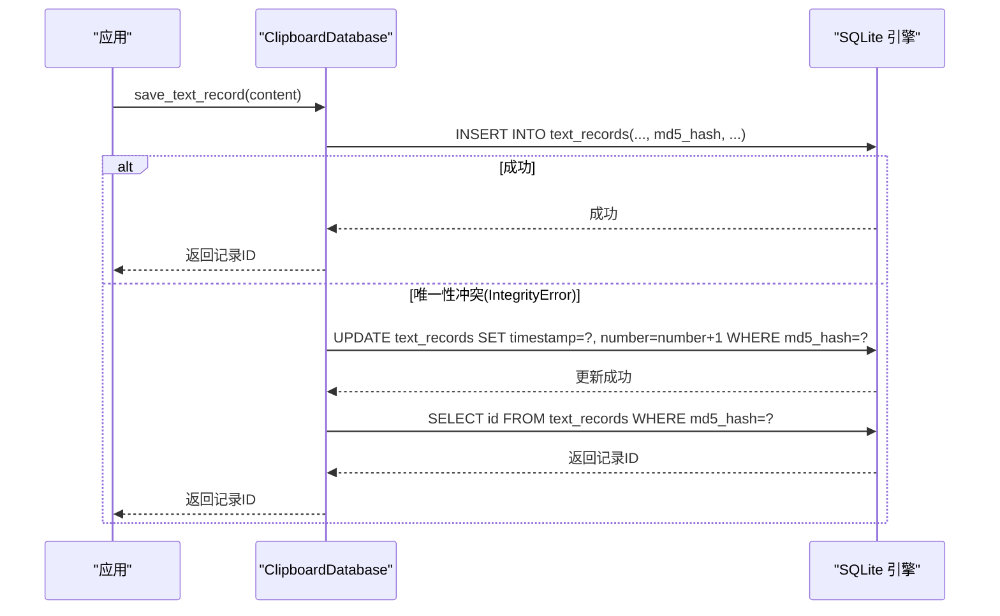
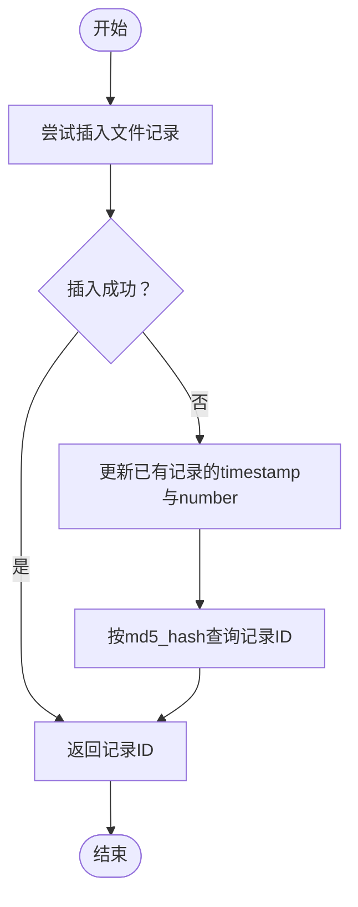
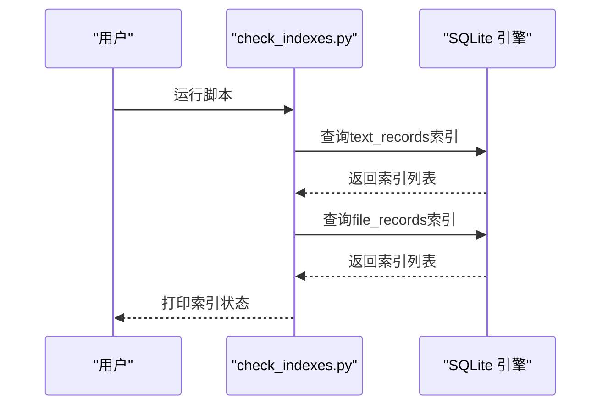
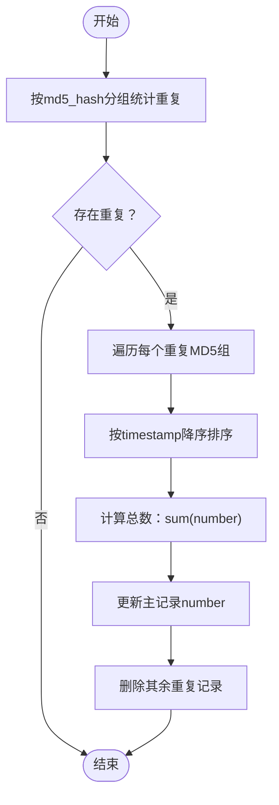
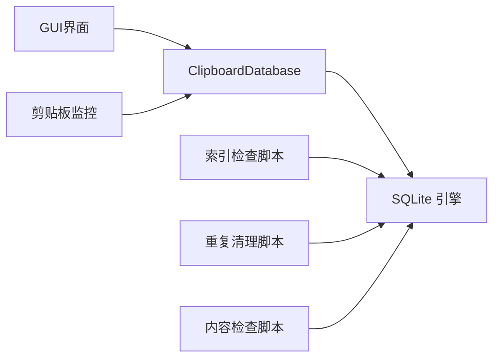

# 索引策略与优化

<cite>
**本文引用的文件**
- [clipboard_manager_main.py](file://clipboard_manager_main.py)
- [clipboard_db.py](file://clipboard_db.py)
- [check_indexes.py](file://check_indexes.py)
- [cleanup_duplicates.py](file://cleanup_duplicates.py)
- [check_db.py](file://check_db.py)
</cite>

## 目录
1. [简介](#简介)
2. [项目结构](#项目结构)
3. [核心组件](#核心组件)
4. [架构总览](#架构总览)
5. [详细组件分析](#详细组件分析)
6. [依赖关系分析](#依赖关系分析)
7. [性能考量](#性能考量)
8. [故障排查指南](#故障排查指南)
9. [结论](#结论)
10. [附录](#附录)

## 简介
本文件围绕数据库索引设计策略展开，重点分析以下方面：
- 在 text_records 表上创建的唯一索引 idx_text_records_md5_hash 的作用与实现，以及其如何保障内容唯一性、支撑去重机制高效运行。
- file_records 表中 md5_hash 字段的 UNIQUE 约束如何防止重复文件记录插入。
- 索引对搜索性能的影响，特别是 search_records 函数中基于 LIKE 查询的场景下索引的使用限制与优化建议。
- 结合 check_indexes.py 脚本的功能，说明如何验证索引是否存在并进行诊断。
- 提供索引创建 SQL 语句，并建议在大数据量情况下可扩展的索引优化方向，如对 timestamp 字段建立索引以加速时间范围查询。

## 项目结构
该项目采用“功能模块化 + 单文件数据库”的组织方式：
- 数据库层：集中于数据库初始化、增删改查、索引与约束定义。
- 应用层：负责剪贴板监控、文件/文本入库、GUI 展示与搜索。
- 工具脚本：用于索引检查、重复数据清理与数据库内容检查。

图表来源
- [clipboard_manager_main.py](file://clipboard_manager_main.py#L56-L110)
- [clipboard_manager_main.py](file://clipboard_manager_main.py#L181-L260)
- [check_indexes.py](file://check_indexes.py#L9-L24)
- [cleanup_duplicates.py](file://cleanup_duplicates.py#L9-L65)
- [check_db.py](file://check_db.py#L9-L30)

章节来源
- [clipboard_manager_main.py](file://clipboard_manager_main.py#L56-L110)
- [clipboard_manager_main.py](file://clipboard_manager_main.py#L181-L260)
- [check_indexes.py](file://check_indexes.py#L9-L24)
- [cleanup_duplicates.py](file://cleanup_duplicates.py#L9-L65)
- [check_db.py](file://check_db.py#L9-L30)

## 核心组件
- 数据库初始化与约束
  - text_records 表：包含 content、timestamp、char_count、md5_hash、number 等字段；md5_hash 字段在早期版本中通过 UNIQUE 约束保证唯一性。
  - file_records 表：包含 original_path、saved_path、filename、file_size、file_type、md5_hash、timestamp、number 等字段；md5_hash 字段通过 UNIQUE 约束保证唯一性。
- 去重与唯一性保障
  - 通过 md5_hash 字段的 UNIQUE 约束与 INSERT/UPDATE 流程，避免重复记录写入。
  - 当 IntegrityError 发生时，系统更新已有记录的 number 并刷新 timestamp，从而实现“去重计数”。
- 搜索与排序
  - search_records 支持按文本内容或文件名模糊匹配（LIKE），并支持时间范围过滤（timestamp）。
  - 排序字段包括 timestamp、content、char_count、number 等，其中 timestamp 为主要排序依据。

章节来源
- [clipboard_manager_main.py](file://clipboard_manager_main.py#L56-L110)
- [clipboard_manager_main.py](file://clipboard_manager_main.py#L112-L179)
- [clipboard_manager_main.py](file://clipboard_manager_main.py#L213-L260)

## 架构总览
下面的类图展示了数据库层的核心类与方法关系，突出索引与约束在数据一致性与查询性能中的作用。

图表来源
- [clipboard_manager_main.py](file://clipboard_manager_main.py#L56-L110)
- [clipboard_manager_main.py](file://clipboard_manager_main.py#L112-L179)
- [clipboard_manager_main.py](file://clipboard_manager_main.py#L181-L260)

## 详细组件分析

### 组件A：唯一索引 idx_text_records_md5_hash 的设计与作用
- 设计背景
  - 在 text_records 表上创建唯一索引 idx_text_records_md5_hash，目标是加速基于 md5_hash 的查找，并确保内容唯一性，支撑去重机制高效运行。
- 实现要点
  - 索引创建语句：对 md5_hash 字段建立唯一索引，且仅在 md5_hash 非空时生效（通过 WHERE 子句限定）。
  - 该索引与 md5_hash 字段的 UNIQUE 约束共同作用，形成双重保障：DDL 级别的约束与 DML 级别的索引，提升唯一性检查效率。
- 去重流程
  - 插入阶段：若 IntegrityError 抛出，系统执行 UPDATE 语句更新 timestamp 与 number 字段，并通过 WHERE md5_hash 定位记录，随后 SELECT 返回 id。
  - 该流程依赖 md5_hash 的唯一性与索引，确保定位与更新高效稳定。

图表来源
- [clipboard_manager_main.py](file://clipboard_manager_main.py#L112-L147)

章节来源
- [clipboard_manager_main.py](file://clipboard_manager_main.py#L56-L110)
- [clipboard_manager_main.py](file://clipboard_manager_main.py#L112-L147)

### 组件B：file_records 表 md5_hash 字段的 UNIQUE 约束
- 设计背景
  - file_records 表的 md5_hash 字段声明为 UNIQUE，用于防止重复文件记录插入，确保同一内容的文件仅存储一条记录。
- 实现要点
  - 约束定义位于表结构创建语句中，与 text_records 表一致。
  - 插入流程与 text_records 类似：INSERT 成功则返回新 ID；若 IntegrityError，则执行 UPDATE 与 SELECT，实现去重计数。

图表来源
- [clipboard_manager_main.py](file://clipboard_manager_main.py#L148-L179)

章节来源
- [clipboard_manager_main.py](file://clipboard_manager_main.py#L78-L91)
- [clipboard_manager_main.py](file://clipboard_manager_main.py#L148-L179)

### 组件C：索引对搜索性能的影响与 LIKE 查询限制
- LIKE 查询现状
  - search_records 支持 content LIKE ? 与 filename LIKE ?，并支持 start_date/end_date 的时间范围过滤。
  - ORDER BY timestamp DESC LIMIT 30 作为默认排序与限制。
- 索引使用限制
  - 对 text_records.content 与 file_records.filename 的前缀匹配（以 % 开头）通常无法有效利用普通 B-Tree 索引，导致全表扫描。
  - 由于 LIKE 以通配符开头，索引在 LIKE 匹配中难以发挥加速作用，性能瓶颈主要来自模糊匹配的成本。
- 优化建议
  - 若业务允许，可考虑将搜索改为后缀匹配或精确匹配，以充分利用索引。
  - 或引入 FTS（全文检索）等专用索引技术（需评估 SQLite 版本与扩展支持）。
  - 对 timestamp 字段建立索引，以加速时间范围查询与排序。

章节来源
- [clipboard_manager_main.py](file://clipboard_manager_main.py#L213-L260)

### 组件D：索引检查与诊断（check_indexes.py）
- 功能概述
  - 通过查询 sqlite_master，列出 text_records 与 file_records 两个表上的索引名称，便于快速确认索引是否存在。
- 使用建议
  - 在部署后或迁移后运行该脚本，核验索引状态。
  - 若发现缺失索引，结合业务需求补充相应索引。

图表来源
- [check_indexes.py](file://check_indexes.py#L9-L24)

章节来源
- [check_indexes.py](file://check_indexes.py#L9-L24)

### 组件E：重复数据清理与去重验证（cleanup_duplicates.py、check_db.py）
- cleanup_duplicates.py
  - 通过 GROUP BY md5_hash 与 HAVING COUNT(*) > 1，识别重复 MD5。
  - 对每组重复记录，保留最新的一条（按 timestamp DESC），并将其余记录的 number 累加到主记录，然后删除重复记录。
- check_db.py
  - 展示最近带有 md5_hash 的记录，以及重复 MD5 的统计，辅助验证去重效果。

图表来源
- [cleanup_duplicates.py](file://cleanup_duplicates.py#L9-L65)

章节来源
- [cleanup_duplicates.py](file://cleanup_duplicates.py#L9-L65)
- [check_db.py](file://check_db.py#L9-L30)

## 依赖关系分析
- 组件耦合
  - GUI 与数据库层通过 ClipboardDatabase 类交互，调用初始化、保存、查询、搜索等方法。
  - 工具脚本独立于主应用，仅依赖 SQLite 元数据查询能力。
- 外部依赖
  - SQLite3：数据库引擎与元数据查询。
  - Python 标准库：datetime、hashlib、os 等。

图表来源
- [clipboard_manager_main.py](file://clipboard_manager_main.py#L56-L110)
- [clipboard_manager_main.py](file://clipboard_manager_main.py#L112-L179)
- [check_indexes.py](file://check_indexes.py#L9-L24)
- [cleanup_duplicates.py](file://cleanup_duplicates.py#L9-L65)
- [check_db.py](file://check_db.py#L9-L30)

章节来源
- [clipboard_manager_main.py](file://clipboard_manager_main.py#L56-L110)
- [clipboard_manager_main.py](file://clipboard_manager_main.py#L112-L179)
- [check_indexes.py](file://check_indexes.py#L9-L24)
- [cleanup_duplicates.py](file://cleanup_duplicates.py#L9-L65)
- [check_db.py](file://check_db.py#L9-L30)

## 性能考量
- 现状与问题
  - LIKE 以 % 开头的前缀模糊匹配无法有效利用普通索引，导致查询成本高。
  - 缺少针对 timestamp 的索引，时间范围查询与排序可能成为瓶颈。
- 优化建议
  - 对 timestamp 字段建立索引，以加速时间范围过滤与 ORDER BY timestamp DESC。
  - 若业务允许，调整搜索策略（如后缀匹配、精确匹配或引入 FTS）以提升 LIKE 的索引利用率。
  - 对高频查询字段（如 content、filename、md5_hash）评估是否需要复合索引或覆盖索引，减少回表成本。
  - 在大数据量场景下，定期维护统计信息与索引重建，保持查询计划最优。

[本节为通用性能讨论，无需具体文件来源]

## 故障排查指南
- 索引缺失或异常
  - 使用 check_indexes.py 核验 text_records 与 file_records 的索引是否存在。
  - 如缺失，结合业务需求补充相应索引。
- 唯一性冲突与去重失效
  - 若 IntegrityError 频发，检查 md5_hash 计算逻辑与数据源，确保输入一致。
  - 使用 cleanup_duplicates.py 与 check_db.py 验证重复数据清理与去重效果。
- 搜索性能差
  - 检查是否使用了时间范围过滤与 LIMIT，避免全表扫描。
  - 考虑对 timestamp 建立索引，或调整搜索策略。

章节来源
- [check_indexes.py](file://check_indexes.py#L9-L24)
- [cleanup_duplicates.py](file://cleanup_duplicates.py#L9-L65)
- [check_db.py](file://check_db.py#L9-L30)

## 结论
- 唯一索引 idx_text_records_md5_hash 与 md5_hash 的 UNIQUE 约束共同保障了内容唯一性，配合 INSERT/UPDATE 去重流程，实现了高效的重复检测与计数。
- file_records 表的 md5_hash UNIQUE 约束同样起到防止重复文件记录的作用。
- LIKE 前缀匹配在当前实现下难以利用索引，建议通过时间索引与搜索策略优化缓解性能问题。
- 建议在大数据量场景下对 timestamp 建立索引，以提升时间范围查询与排序性能；同时评估全文检索或后缀匹配等替代方案。

[本节为总结性内容，无需具体文件来源]

## 附录

### 索引创建 SQL 语句（基于仓库现有实现）
- 在 text_records 表上创建唯一索引（仅对非空 md5_hash 生效）：
  - 语句路径参考：[clipboard_manager_main.py](file://clipboard_manager_main.py#L56-L110)
- 在 file_records 表上通过 UNIQUE 约束保证 md5_hash 唯一性：
  - 语句路径参考：[clipboard_manager_main.py](file://clipboard_manager_main.py#L78-L91)

### 建议的扩展索引（面向大数据量与时间范围查询）
- 对 timestamp 建立索引，以加速时间范围过滤与排序：
  - 语句路径参考：[clipboard_manager_main.py](file://clipboard_manager_main.py#L213-L260)
- 对 content 与 filename 建立复合索引（如业务允许后缀/精确匹配）：
  - 语句路径参考：[clipboard_manager_main.py](file://clipboard_manager_main.py#L213-L260)

[本节为建议性内容，未直接展示具体 SQL 代码，仅提供路径参考]