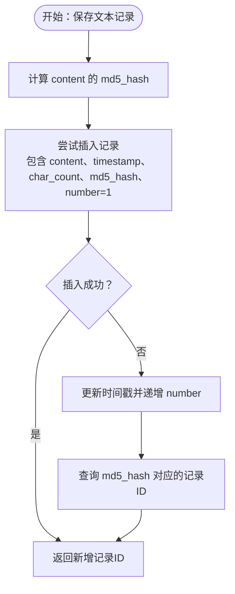

# 表结构设计

<cite>
**本文引用的文件**
- [clipboard_db.py](file://clipboard_db.py)
- [clipboard_manager_main.py](file://clipboard_manager_main.py)
- [check_db.py](file://check_db.py)
- [cleanup_duplicates.py](file://cleanup_duplicates.py)
- [view_clipboard_history.py](file://view_clipboard_history.py)
</cite>

## 目录
1. [简介](#简介)
2. [项目结构](#项目结构)
3. [核心组件](#核心组件)
4. [架构总览](#架构总览)
5. [详细组件分析](#详细组件分析)
6. [依赖关系分析](#依赖关系分析)
7. [性能考量](#性能考量)
8. [故障排查指南](#故障排查指南)
9. [结论](#结论)
10. [附录](#附录)

## 简介
本文件面向数据库管理员与开发者，系统性梳理 SQLite 数据库中的三张核心表：text_records（文本记录）、file_records（文件记录）与 settings（设置参数）。文档从字段定义、约束条件、默认值、主键策略、业务含义出发，并结合代码中的建表与迁移逻辑，说明数据库版本兼容性设计（通过异常捕获实现字段动态添加）。最后提供建表 SQL 示例与实际数据插入案例的路径指引，帮助快速理解与验证表结构。

## 项目结构
本项目围绕“剪贴板历史记录”主题构建，数据库初始化与维护集中在数据库模块中，其他脚本负责历史查看、重复清理、GUI 展示等辅助功能。核心建表与迁移逻辑集中在数据库模块中，便于统一管理与演进。

图表来源
- [clipboard_db.py](file://clipboard_db.py#L18-L115)
- [view_clipboard_history.py](file://view_clipboard_history.py#L21-L75)
- [cleanup_duplicates.py](file://cleanup_duplicates.py#L9-L67)
- [check_db.py](file://check_db.py#L9-L31)

章节来源
- [clipboard_db.py](file://clipboard_db.py#L18-L115)
- [view_clipboard_history.py](file://view_clipboard_history.py#L21-L75)
- [cleanup_duplicates.py](file://cleanup_duplicates.py#L9-L67)
- [check_db.py](file://check_db.py#L9-L31)

## 核心组件
本节聚焦三张核心表的字段定义、约束与默认值，以及它们在业务中的作用。

- text_records（文本记录）
  - 字段与约束
    - id: 整型，主键，自增
    - content: 文本，非空
    - timestamp: 时间戳，默认当前时间
    - char_count: 整型，字符数
    - md5_hash: 文本，唯一索引（非空时生效）
    - number: 整型，默认 1，用于记录该内容被复制的次数
  - 业务含义
    - content 存储剪贴板文本内容
    - md5_hash 用于内容去重
    - number 记录该内容被复制的次数，避免重复存储相同内容
    - char_count 便于按长度排序与展示
  - 关键实现参考
    - 建表与字段迁移：[clipboard_db.py](file://clipboard_db.py#L24-L53)
    - 去重与计数更新：[clipboard_db.py](file://clipboard_db.py#L116-L151)

- file_records（文件记录）
  - 字段与约束
    - id: 整型，主键，自增
    - original_path: 文本，原始路径
    - saved_path: 文本，本地缓存路径
    - filename: 文本，文件名
    - file_size: 整型，字节数
    - file_type: 文本，文件类型分类（如 images、documents 等）
    - md5_hash: 文本，唯一索引（非空时生效）
    - timestamp: 时间戳，默认当前时间
    - number: 整型，默认 1，用于记录该文件被复制的次数
  - 业务含义
    - saved_path 记录文件在本地缓存的路径，便于 GUI 打开文件位置
    - file_type 用于分类显示与统计
    - md5_hash 用于文件去重
    - number 记录该文件被复制的次数
  - 关键实现参考
    - 建表与字段迁移：[clipboard_db.py](file://clipboard_db.py#L55-L75)
    - 去重与计数更新：[clipboard_db.py](file://clipboard_db.py#L152-L184)

- settings（设置参数）
  - 字段与约束
    - id: 整型，主键，校验约束要求等于 1（单行主键）
    - max_copy_size: 整型，默认 300MB（字节）
    - max_copy_count: 整型，默认 100
    - unlimited_mode: 整型，默认 0（0: 有限制，1: 无限制）
    - retention_days: 整型，默认 0（永久保存）
    - auto_start: 整型，默认 1（启用）
    - float_icon: 整型，默认 1（启用）
  - 业务含义
    - 控制复制行为（大小与数量限制）
    - 控制保留策略（过期清理）
    - 控制启动与托盘图标行为
  - 关键实现参考
    - 建表与默认值：[clipboard_db.py](file://clipboard_db.py#L77-L91)
    - 动态字段添加与默认值：[clipboard_db.py](file://clipboard_db.py#L92-L112)

章节来源
- [clipboard_db.py](file://clipboard_db.py#L24-L112)

## 架构总览
下图展示了数据库初始化流程与各表之间的关系，以及字段迁移与去重逻辑。

图表来源
- [clipboard_db.py](file://clipboard_db.py#L18-L115)

## 详细组件分析

### text_records 表
- 字段定义与约束
  - id: 整型，主键，自增
  - content: 文本，非空
  - timestamp: 时间戳，默认当前时间
  - char_count: 整型，字符数
  - md5_hash: 文本，唯一索引（非空时生效）
  - number: 整型，默认 1
- 主键策略
  - 自增 ID，保证每条记录唯一且顺序可追踪
- 默认值
  - number 默认 1，表示首次插入即计数为 1
- 去重与计数逻辑
  - 首次插入失败（唯一冲突）时，更新时间戳并递增 number
  - 通过 md5_hash 实现内容去重
- 关键实现参考
  - 建表与迁移：[clipboard_db.py](file://clipboard_db.py#L24-L53)
  - 插入与去重更新：[clipboard_db.py](file://clipboard_db.py#L116-L151)

图表来源
- [clipboard_db.py](file://clipboard_db.py#L116-L151)

章节来源
- [clipboard_db.py](file://clipboard_db.py#L24-L53)
- [clipboard_db.py](file://clipboard_db.py#L116-L151)

### file_records 表
- 字段定义与约束
  - id: 整型，主键，自增
  - original_path: 文本
  - saved_path: 文本
  - filename: 文本
  - file_size: 整型
  - file_type: 文本（分类）
  - md5_hash: 文本，唯一索引（非空时生效）
  - timestamp: 时间戳，默认当前时间
  - number: 整型，默认 1
- 主键策略
  - 自增 ID，保证每条记录唯一
- 默认值
  - number 默认 1，表示首次插入即计数为 1
- 去重与计数逻辑
  - 首次插入失败（唯一冲突）时，更新时间戳并递增 number
  - 通过 md5_hash 实现文件去重
- 关键实现参考
  - 建表与迁移：[clipboard_db.py](file://clipboard_db.py#L55-L75)
  - 插入与去重更新：[clipboard_db.py](file://clipboard_db.py#L152-L184)

图表来源
- [clipboard_db.py](file://clipboard_db.py#L152-L184)

章节来源
- [clipboard_db.py](file://clipboard_db.py#L55-L75)
- [clipboard_db.py](file://clipboard_db.py#L152-L184)

### settings 表
- 字段定义与约束
  - id: 整型，主键，CHECK(id=1)，确保只有一行有效记录
  - max_copy_size: 整型，默认 300MB（字节）
  - max_copy_count: 整型，默认 100
  - unlimited_mode: 整型，默认 0（0: 有限制，1: 无限制）
  - retention_days: 整型，默认 0（永久保存）
  - auto_start: 整型，默认 1（启用）
  - float_icon: 整型，默认 1（启用）
- 主键策略
  - 单行主键（id=1），保证全局配置唯一
- 默认值
  - 多个字段具备合理默认值，便于首次使用
- 版本兼容性
  - 通过 ALTER TABLE 与异常捕获，动态添加新字段（如 retention_days、auto_start、float_icon），避免破坏既有数据
- 关键实现参考
  - 建表与默认值：[clipboard_db.py](file://clipboard_db.py#L77-L91)
  - 动态字段添加与默认值：[clipboard_db.py](file://clipboard_db.py#L92-L112)

图表来源
- [clipboard_db.py](file://clipboard_db.py#L77-L112)

章节来源
- [clipboard_db.py](file://clipboard_db.py#L77-L112)

### 数据库版本兼容性设计
- 设计要点
  - 使用异常捕获（OperationalError）处理字段已存在的情况，避免因重复执行 ALTER TABLE 而报错
  - 先创建基础表，再逐步添加字段与索引，确保向后兼容
  - 通过唯一索引与唯一约束（md5_hash）实现去重，降低重复数据风险
- 关键实现参考
  - text_records：添加 md5_hash 与 number 字段，创建唯一索引：[clipboard_db.py](file://clipboard_db.py#L33-L53)
  - file_records：添加 number 字段：[clipboard_db.py](file://clipboard_db.py#L69-L75)
  - settings：添加 retention_days、auto_start、float_icon 字段：[clipboard_db.py](file://clipboard_db.py#L92-L112)

章节来源
- [clipboard_db.py](file://clipboard_db.py#L33-L53)
- [clipboard_db.py](file://clipboard_db.py#L69-L75)
- [clipboard_db.py](file://clipboard_db.py#L92-L112)

### 建表 SQL 与实际插入案例
- 建表 SQL（基于代码中的 CREATE TABLE 与 ALTER TABLE 逻辑）
  - text_records 建表与字段迁移
    - 参考路径：[clipboard_db.py](file://clipboard_db.py#L24-L53)
  - file_records 建表与字段迁移
    - 参考路径：[clipboard_db.py](file://clipboard_db.py#L55-L75)
  - settings 建表与字段迁移
    - 参考路径：[clipboard_db.py](file://clipboard_db.py#L77-L112)
- 实际数据插入案例（路径指引）
  - 文本记录插入与去重更新
    - 参考路径：[clipboard_db.py](file://clipboard_db.py#L116-L151)
  - 文件记录插入与去重更新
    - 参考路径：[clipboard_db.py](file://clipboard_db.py#L152-L184)
  - 查看历史记录（包含插入后的效果）
    - 参考路径：[view_clipboard_history.py](file://view_clipboard_history.py#L21-L75)
  - 检查数据库内容（包含 MD5 与重复项）
    - 参考路径：[check_db.py](file://check_db.py#L9-L31)
  - 清理重复 MD5 记录（合并计数）
    - 参考路径：[cleanup_duplicates.py](file://cleanup_duplicates.py#L9-L67)

章节来源
- [clipboard_db.py](file://clipboard_db.py#L24-L184)
- [view_clipboard_history.py](file://view_clipboard_history.py#L21-L75)
- [check_db.py](file://check_db.py#L9-L31)
- [cleanup_duplicates.py](file://cleanup_duplicates.py#L9-L67)

## 依赖关系分析
- 组件耦合
  - 所有查询与统计均通过数据库模块封装，避免业务层直接操作底层 SQL
  - 历史查看、重复清理、数据库检查等脚本均依赖数据库模块提供的接口
- 外部依赖
  - SQLite 引擎
  - Python 标准库（sqlite3、hashlib、datetime 等）

图表来源
- [clipboard_db.py](file://clipboard_db.py#L18-L115)
- [view_clipboard_history.py](file://view_clipboard_history.py#L21-L75)
- [cleanup_duplicates.py](file://cleanup_duplicates.py#L9-L67)
- [check_db.py](file://check_db.py#L9-L31)

章节来源
- [clipboard_db.py](file://clipboard_db.py#L18-L115)
- [view_clipboard_history.py](file://view_clipboard_history.py#L21-L75)
- [cleanup_duplicates.py](file://cleanup_duplicates.py#L9-L67)
- [check_db.py](file://check_db.py#L9-L31)

## 性能考量
- 唯一索引与约束
  - text_records 与 file_records 的 md5_hash 字段建立唯一索引（非空时生效），有助于快速去重与查询
- 去重策略
  - 通过 md5_hash 与 number 字段减少重复存储，降低表膨胀
- 查询优化建议
  - 对高频查询字段（如 timestamp、number、file_type）可考虑建立索引以提升排序与筛选性能
  - 分页查询时尽量限定排序字段与范围，避免全表扫描
- 存储与清理
  - settings 中的 retention_days 支持按天清理过期记录，避免历史数据无限增长

[本节为通用指导，无需列出具体文件来源]

## 故障排查指南
- 字段已存在导致 ALTER TABLE 报错
  - 现象：重复执行迁移逻辑时报 OperationalError
  - 处理：通过异常捕获忽略错误，确保向后兼容
  - 参考路径：[clipboard_db.py](file://clipboard_db.py#L33-L53)、[clipboard_db.py](file://clipboard_db.py#L69-L75)、[clipboard_db.py](file://clipboard_db.py#L92-L112)
- MD5 冲突导致插入失败
  - 现象：IntegrityError（唯一约束冲突）
  - 处理：捕获异常后更新时间戳与计数，避免重复存储
  - 参考路径：[clipboard_db.py](file://clipboard_db.py#L137-L151)、[clipboard_db.py](file://clipboard_db.py#L166-L184)
- 检查重复 MD5 记录
  - 工具：检查数据库内容脚本
  - 参考路径：[check_db.py](file://check_db.py#L9-L31)
- 清理重复 MD5 记录
  - 工具：清理重复脚本
  - 参考路径：[cleanup_duplicates.py](file://cleanup_duplicates.py#L9-L67)

章节来源
- [clipboard_db.py](file://clipboard_db.py#L33-L53)
- [clipboard_db.py](file://clipboard_db.py#L69-L75)
- [clipboard_db.py](file://clipboard_db.py#L92-L112)
- [clipboard_db.py](file://clipboard_db.py#L137-L151)
- [clipboard_db.py](file://clipboard_db.py#L166-L184)
- [check_db.py](file://check_db.py#L9-L31)
- [cleanup_duplicates.py](file://cleanup_duplicates.py#L9-L67)

## 结论
本数据库设计方案围绕“去重、计数、分类、配置”四大目标展开：通过 md5_hash 与 number 字段实现内容与文件的去重与计数；通过 file_type 字段实现分类展示；通过 settings 表实现全局配置与版本兼容性。建表与迁移逻辑采用异常捕获与默认值策略，确保在不同版本间平滑演进。配合历史查看、重复清理与数据库检查工具，形成完整的数据治理闭环。

[本节为总结性内容，无需列出具体文件来源]

## 附录
- 常用查询路径
  - 获取文本记录（含排序与分页）：[clipboard_db.py](file://clipboard_db.py#L185-L221)
  - 获取文件记录（含排序与分页）：[clipboard_db.py](file://clipboard_db.py#L223-L261)
  - 统计信息（文本数量、文件数量与总大小）：[clipboard_db.py](file://clipboard_db.py#L316-L332)
  - 搜索记录（文本/文件/全部）：[clipboard_db.py](file://clipboard_db.py#L281-L315)
  - 删除记录与清空：[clipboard_db.py](file://clipboard_db.py#L334-L358)
  - 获取与更新设置：[clipboard_db.py](file://clipboard_db.py#L359-L412)
  - 过期记录清理：[clipboard_db.py](file://clipboard_db.py#L413-L455)

章节来源
- [clipboard_db.py](file://clipboard_db.py#L185-L455)