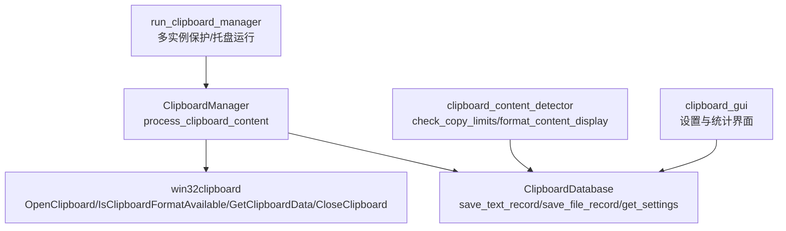
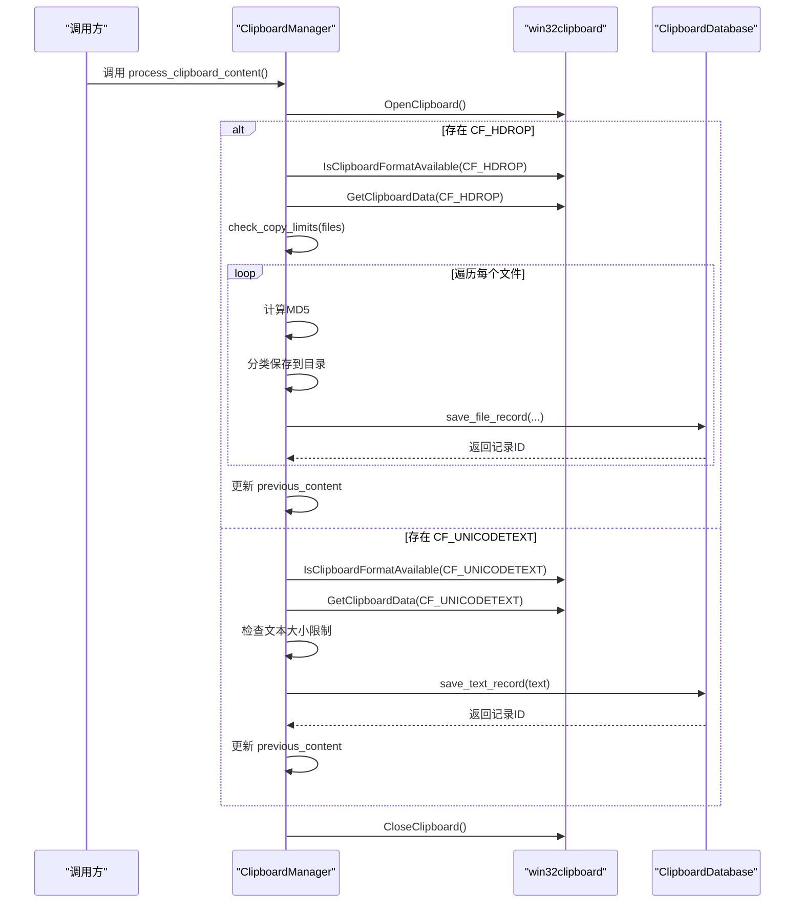
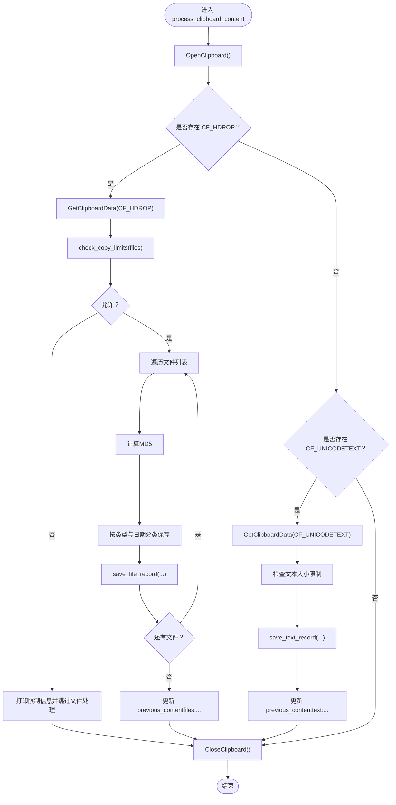
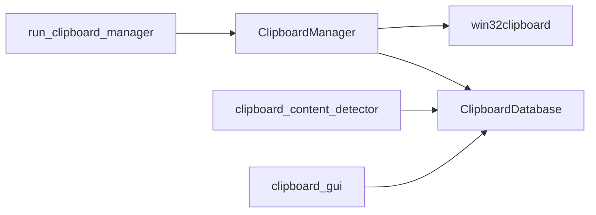

# 内容处理流程

<cite>
**本文引用的文件**
- [clipboard_manager_main.py](file://clipboard_manager_main.py)
- [clipboard_db.py](file://clipboard_db.py)
- [clipboard_content_detector.py](file://clipboard_content_detector.py)
- [clipboard_gui.py](file://clipboard_gui.py)
- [run_clipboard_manager.py](file://run_clipboard_manager.py)
</cite>

## 目录
1. [简介](#简介)
2. [项目结构](#项目结构)
3. [核心组件](#核心组件)
4. [架构总览](#架构总览)
5. [详细组件分析](#详细组件分析)
6. [依赖关系分析](#依赖关系分析)
7. [性能考量](#性能考量)
8. [故障排查指南](#故障排查指南)
9. [结论](#结论)

## 简介
本文件围绕 ClipboardManager 类中的 process_clipboard_content 方法展开，系统性梳理其通过 win32clipboard 安全打开/关闭剪贴板、按优先级检查 CF_HDROP（文件）与 CF_UNICODETEXT（文本）格式、利用 previous_content 键值避免重复处理、以及文件与文本两类内容的处理逻辑（含复制限制、MD5 计算、分类保存、数据库记录与去重）。同时补充异常处理策略与资源管理最佳实践，帮助读者快速理解并高效维护该核心流程。

## 项目结构
- 主要入口与监控循环位于 clipboard_manager_main.py，其中包含 ClipboardManager 类及 process_clipboard_content 方法。
- 数据库层由 ClipboardDatabase 类负责，提供文本与文件记录的增删改查、设置读写、统计与过期清理等能力。
- clipboard_content_detector.py 提供独立的剪贴板内容检测工具，包含格式枚举、内容提取与复制限制检查等辅助能力。
- clipboard_gui.py 提供 GUI 查询界面与设置管理，间接影响复制限制与保存策略。
- run_clipboard_manager.py 提供多实例保护与托盘运行入口。

图表来源
- [clipboard_manager_main.py](file://clipboard_manager_main.py#L355-L496)
- [clipboard_db.py](file://clipboard_db.py#L116-L183)
- [clipboard_content_detector.py](file://clipboard_content_detector.py#L143-L180)
- [clipboard_gui.py](file://clipboard_gui.py#L329-L533)
- [run_clipboard_manager.py](file://run_clipboard_manager.py#L17-L70)

章节来源
- [clipboard_manager_main.py](file://clipboard_manager_main.py#L355-L496)
- [clipboard_db.py](file://clipboard_db.py#L116-L183)
- [clipboard_content_detector.py](file://clipboard_content_detector.py#L143-L180)
- [clipboard_gui.py](file://clipboard_gui.py#L329-L533)
- [run_clipboard_manager.py](file://run_clipboard_manager.py#L17-L70)

## 核心组件
- ClipboardManager.process_clipboard_content：核心处理入口，负责：
  - 安全打开/关闭剪贴板
  - 优先检查 CF_HDROP（文件），其次检查 CF_UNICODETEXT（文本）
  - 使用 previous_content 键值避免重复处理
  - 文件侧：check_copy_limits、MD5 计算、分类保存、数据库记录与去重
  - 文本侧：大小限制检查、去重保存
- ClipboardDatabase：封装 SQLite 数据库操作，提供文本/文件记录的保存、查询、统计与设置读写。
- clipboard_content_detector：提供复制限制检查与内容格式枚举等辅助能力，便于理解与对比。
- clipboard_gui：提供设置界面，直接影响复制限制与保存策略。
- run_clipboard_manager：多实例保护与托盘运行入口，保障稳定运行。

章节来源
- [clipboard_manager_main.py](file://clipboard_manager_main.py#L355-L496)
- [clipboard_db.py](file://clipboard_db.py#L116-L183)
- [clipboard_content_detector.py](file://clipboard_content_detector.py#L143-L180)
- [clipboard_gui.py](file://clipboard_gui.py#L329-L533)
- [run_clipboard_manager.py](file://run_clipboard_manager.py#L17-L70)

## 架构总览
process_clipboard_content 的执行路径如下：
- 打开剪贴板
- 检测 CF_HDROP（文件优先）
  - 若有文件：检查复制限制，逐个计算 MD5，按类型分类保存，记录数据库（去重）
- 检测 CF_UNICODETEXT（文本次之）
  - 若有文本：检查大小限制，保存数据库（去重）
- 关闭剪贴板（finally 确保释放）

图表来源
- [clipboard_manager_main.py](file://clipboard_manager_main.py#L395-L496)
- [clipboard_db.py](file://clipboard_db.py#L116-L183)

章节来源
- [clipboard_manager_main.py](file://clipboard_manager_main.py#L395-L496)
- [clipboard_db.py](file://clipboard_db.py#L116-L183)

## 详细组件分析

### ClipboardManager.process_clipboard_content 方法详解
- 剪贴板安全访问
  - 使用 try 包裹 OpenClipboard，确保异常时也能进入 finally
  - finally 中调用 CloseClipboard，保证资源释放
  - 对 OpenClipboard 异常进行特殊判断，避免误报“OpenClipboard”错误
- 内容优先级与格式检测
  - 先检查 CF_HDROP（文件），若存在则处理文件列表
  - 否则检查 CF_UNICODETEXT（文本），若存在则处理文本
- previous_content 去重机制
  - 文件：使用“files:{sorted_files}”作为键，避免重复保存相同文件集合
  - 文本：使用“text:{hash(text)}”作为键，避免重复保存相同文本
- 文件处理流程
  - check_copy_limits：检查数量与大小限制（单文件与总大小）
  - 计算 MD5：逐块读取文件，降低内存占用
  - 分类保存：按文件类型（文档/图片/视频/音频/PDF/办公/压缩/其他）与日期分目录
  - 数据库记录：save_file_record，若 MD5 已存在则去重更新计数
- 文本处理流程
  - 大小限制检查：在非无限模式下检查 UTF-8 字节数
  - 去重保存：save_text_record，MD5 唯一约束，重复则更新计数与时间戳

图表来源
- [clipboard_manager_main.py](file://clipboard_manager_main.py#L395-L496)

章节来源
- [clipboard_manager_main.py](file://clipboard_manager_main.py#L395-L496)

### 复制限制与去重机制
- 复制限制 check_copy_limits
  - 无限模式：直接放行
  - 数量限制：超过 max_copy_count 则拒绝
  - 单文件大小限制：超过 max_copy_size 则拒绝
  - 总大小限制：超过 max_copy_size 则拒绝
- previous_content 键值
  - 文件：files:{sorted_files}，排序后拼接，避免顺序不同导致重复
  - 文本：text:{hash(text)}，哈希避免长文本比较成本
- 去重保存
  - 文本：MD5 唯一约束，重复则更新时间戳与计数
  - 文件：MD5 唯一约束，重复则更新原路径与计数

章节来源
- [clipboard_manager_main.py](file://clipboard_manager_main.py#L362-L394)
- [clipboard_db.py](file://clipboard_db.py#L116-L183)

### 文件分类与保存策略
- 类型分类：依据扩展名归类至 documents/images/videos/audio/pdf/office/archives/others
- 保存路径：clipboard_files/{type}/{YYYY-MM-DD}/
- 唯一命名：基于原名与 MD5 前缀生成，避免覆盖
- 复制策略：若目标不存在才复制，减少冗余 IO

章节来源
- [clipboard_manager_main.py](file://clipboard_manager_main.py#L362-L394)
- [clipboard_manager_main.py](file://clipboard_manager_main.py#L411-L458)

### 文本大小限制与去重保存
- 大小限制：UTF-8 编码字节数与 max_copy_size 比较
- 去重保存：MD5 唯一约束，重复则更新计数与时间戳

章节来源
- [clipboard_manager_main.py](file://clipboard_manager_main.py#L462-L486)
- [clipboard_db.py](file://clipboard_db.py#L116-L183)

### 异常处理策略
- 剪贴板访问异常
  - try 包裹 OpenClipboard，finally 中 CloseClipboard
  - 对非“OpenClipboard”异常进行打印，避免误判
- 文件处理异常
  - 单个文件处理失败不影响整体流程，继续下一个文件
- 文本处理异常
  - 文本读取失败时打印错误并跳过
- 复制限制检查异常
  - 文件大小获取失败时打印错误并继续

章节来源
- [clipboard_manager_main.py](file://clipboard_manager_main.py#L395-L496)

### 资源管理最佳实践
- 必须在 finally 中调用 CloseClipboard，确保无论成功与否都能释放剪贴板句柄
- 数据库连接在每次操作后及时 close，避免连接泄漏
- 文件 IO 使用分块读取计算 MD5，避免大文件占用过多内存

章节来源
- [clipboard_manager_main.py](file://clipboard_manager_main.py#L395-L496)
- [clipboard_db.py](file://clipboard_db.py#L116-L183)

## 依赖关系分析
- ClipboardManager 依赖 ClipboardDatabase 进行数据持久化
- process_clipboard_content 依赖 win32clipboard 进行剪贴板读取
- clipboard_content_detector 提供复制限制检查与内容格式枚举，便于理解与对比
- clipboard_gui 提供设置界面，影响复制限制与保存策略
- run_clipboard_manager 提供多实例保护与托盘运行入口

图表来源
- [clipboard_manager_main.py](file://clipboard_manager_main.py#L355-L496)
- [clipboard_db.py](file://clipboard_db.py#L116-L183)
- [clipboard_content_detector.py](file://clipboard_content_detector.py#L143-L180)
- [clipboard_gui.py](file://clipboard_gui.py#L329-L533)
- [run_clipboard_manager.py](file://run_clipboard_manager.py#L17-L70)

章节来源
- [clipboard_manager_main.py](file://clipboard_manager_main.py#L355-L496)
- [clipboard_db.py](file://clipboard_db.py#L116-L183)
- [clipboard_content_detector.py](file://clipboard_content_detector.py#L143-L180)
- [clipboard_gui.py](file://clipboard_gui.py#L329-L533)
- [run_clipboard_manager.py](file://run_clipboard_manager.py#L17-L70)

## 性能考量
- MD5 计算采用分块读取，降低内存峰值
- 文件分类与保存按类型与日期组织，便于后续检索与清理
- previous_content 键值避免重复处理，减少 IO 与数据库写入
- 文本去重通过 MD5 唯一约束，减少重复记录
- 复制限制在文件层面提前拦截，避免无效 IO

[本节为通用性能建议，不直接分析具体文件]

## 故障排查指南
- 剪贴板无法打开
  - 检查是否被其他进程占用，稍后再试
  - 查看异常日志，确认是否为“OpenClipboard”以外的异常
- 文件未保存或保存失败
  - 检查复制限制（数量/大小）是否触发
  - 确认目标目录权限与磁盘空间
  - 查看单个文件处理异常日志
- 文本未保存或重复
  - 检查文本大小是否超过限制
  - 确认 MD5 是否已存在，计数是否正确更新
- 设置不生效
  - 检查 GUI 设置界面是否保存成功
  - 确认数据库 settings 表项是否更新

章节来源
- [clipboard_manager_main.py](file://clipboard_manager_main.py#L395-L496)
- [clipboard_db.py](file://clipboard_db.py#L360-L412)
- [clipboard_gui.py](file://clipboard_gui.py#L478-L533)

## 结论
process_clipboard_content 方法通过严格的资源管理与去重机制，实现了对剪贴板内容的安全、高效处理。文件侧采用复制限制、MD5 去重与分类保存，文本侧采用大小限制与 MD5 去重，配合 GUI 设置与多实例保护，形成完整的剪贴板历史管理闭环。遵循本文提供的异常处理与资源管理最佳实践，可进一步提升稳定性与可维护性。